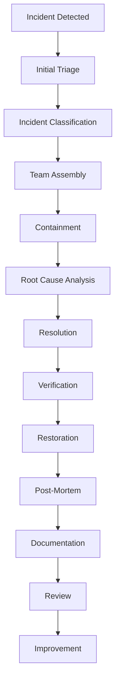
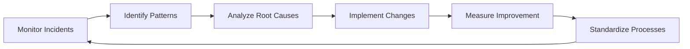

# Incident Response Playbooks for erlmcp v3

## Table of Contents
1. [Incident Management Framework](#1-incident-management-framework)
2. [Incident Classification](#2-incident-classification)
3. [Incident Response Workflow](#3-incident-response-workflow)
4. [Severity-Specific Playbooks](#4-severity-specific-playbooks)
5. [Communication Templates](#5-communication-templates)
6. [Post-Incident Procedures](#6-post-incident-procedures)
7. [Incident Escalation Rules](#7-incident-escalation-rules)
8. [Training and Simulation](#8-training-and-simulation)
9. [Continuous Improvement](#9-continuous-improvement)

## 1. Incident Management Framework

### 1.1 Core Principles

1. **Customer First**: Prioritize customer impact and communication
2. **Speed of Response**: Acknowledge immediately, resolve quickly
3. **Root Cause Focus**: Fix the underlying issue, not symptoms
4. **Learn and Improve**: Every incident provides learning opportunities
5. **Transparent Communication**: Keep all stakeholders informed

### 1.2 Incident Management Team Structure

```
Incident Commander (Tier 3/4)
├── Technical Lead (Tier 3)
├── Communications Lead
├── Customer Success Manager
├── Engineering Lead
└── QA Lead
```

### 1.3 Responsibilities

| Role | Responsibilities | Authority |
|------|-----------------|-----------|
| **Incident Commander** | Overall incident coordination | Make final decisions |
| **Technical Lead** | Technical resolution direction | Resource allocation |
| **Communications Lead** | External/internal communication | Public statements |
| **Customer Success** | Customer updates and satisfaction | SLA management |
| **Engineering Lead** | Root cause analysis | Code changes |
| **QA Lead** | Resolution verification | Release approval |

## 2. Incident Classification

### 2.1 Severity Classification Matrix

| Severity | Impact | Urgency | Example Scenarios | Response Time |
|----------|--------|---------|------------------|---------------|
| **P1 - Critical** | System-wide outage affecting all customers | Immediate | Complete service failure, data loss | < 15 min |
| **P2 - High** | Major degradation affecting most customers | High | Performance degradation, regional outage | < 30 min |
| **P3 - Medium** | Limited functionality affecting some customers | Medium | Feature not working, partial outage | < 4 hours |
| **P4 - Low** | Minor issue affecting individual customers | Low | UI bug, documentation issue | < 8 hours |

### 2.2 Impact Assessment

```erlang
% Impact Assessment Module
-module(erlmcp_impact_assessor).
-export([assess_impact/1]).

assess_impact(Incident) ->
    % Analyze incident based on:
    % - Affected systems
    % - Customer impact
    % - Business impact
    % - Severity thresholds

    AffectedSystems = get_affected_systems(Incident),
    CustomerImpact = calculate_customer_impact(AffectedSystems),
    BusinessImpact = calculate_business_impact(CustomerImpact),

    Severity = determine_severity(CustomerImpact, BusinessImpact),

    #{
        severity => Severity,
        affected_systems => AffectedSystems,
        customers_affected => CustomerImpact,
        business_impact => BusinessImpact,
        recommended_actions => get_actions_for_severity(Severity)
    }.

determine_severity(Customers, Business) ->
    % Business critical and >50% customers = P1
    % Business critical and 10-50% = P2
    % Business important and >25% = P3
    % Otherwise = P4
    case {Business critical, Customers} of
        {true, >50} -> p1;
        {true, _} -> p2;
        {important, >25} -> p3;
        _ -> p4
    end.
```

### 2.3 Service Impact Mapping

| Service Component | Service Tier | Downtime Impact | Performance Impact |
|-------------------|--------------|-----------------|-------------------|
| Registry Service | All | Complete outage | Message throughput drop |
| Transport Layer | Standard+ | Connection loss | Latency increase |
| Session Manager | Premium+ | User sessions lost | Connection stability |
| Monitoring System | All | Visibility loss | Alert delay |
| Backup Service | Premium+ | Data loss risk | Recovery time impact |

## 3. Incident Response Workflow

### 3.1 Incident Lifecycle



### 3.2 Workflow Steps

1. **Detection**:
   - System monitoring alerts
   - Customer reports
   - Self-discovery tools

2. **Initial Response**:
   - Acknowledge within 5 minutes
   - Assign incident commander
   - Create incident ticket

3. **Investigation**:
   - Gather logs and metrics
   - Identify affected systems
   - Determine severity

4. **Containment**:
   - Isolate affected components
   - Implement workarounds
   - Prevent spread

5. **Resolution**:
   - Fix root cause
   - Test solution
   - Deploy changes

6. **Recovery**:
   - Monitor system stability
   - Verify customer impact
   - Clear incident status

7. **Post-Incident**:
   - Document findings
   - Update procedures
   - Share lessons learned

### 3.3 Workflow Timelines

| Activity | P1 | P2 | P3 | P4 |
|----------|----|----|----|----|
| Detection | < 1 min | < 5 min | < 15 min | < 30 min |
| Acknowledgment | < 15 min | < 30 min | < 4 hours | < 8 hours |
| Initial Resolution | < 4 hours | < 8 hours | < 24 hours | < 72 hours |
| Resolution | < 24 hours | < 48 hours | < 72 hours | < 7 days |
| Post-Mortem | < 72 hours | < 5 days | < 7 days | < 14 days |

## 4. Severity-Specific Playbooks

### 4.1 P1 - Critical Incident Playbook

**Scenario**: Complete service outage or major data loss

**Immediate Actions** (0-15 minutes):
1. **Alert Stakeholders**:
   - Page on-call engineer
   - Notify CEO and executives
   - Initiate war room

2. **Initial Response**:
   - Create incident ticket
   - Activate incident commander
   - Assemble emergency team

3. **Containment**:
   - Enable emergency failover
   - Isolate primary systems
   - Redirect traffic to backup

**Resolution Phase** (15-240 minutes):
1. **Diagnostics**:
   - Check backup systems status
   - Verify failover success
   - Identify failure point

2. **Resolution**:
   - Implement emergency fix
   - Test system stability
   - Monitor recovery progress

3. **Communication**:
   - Update status every 30 minutes
   - Notify VIP customers directly
   - Update status page

**Verification**:
- System health check for 30 minutes
- Customer connectivity test
- Performance validation

**Post-Incident**:
- Complete RCA within 72 hours
- Customer compensation discussion
- System hardening

### 4.2 P2 - High Severity Incident Playbook

**Scenario**: Major service degradation affecting most customers

**Immediate Actions** (0-30 minutes):
1. **Alert Stakeholders**:
   - SMS engineering lead
   - Notify VP of Operations
   - Create incident ticket

2. **Initial Assessment**:
   - Determine affected systems
   - Calculate customer impact
   - Escalate to appropriate level

**Resolution Phase** (30-480 minutes):
1. **Containment**:
   - Enable circuit breakers
   - Implement rate limiting
   - Redirect traffic

2. **Investigation**:
   - Analyze logs and metrics
   - Identify root cause
   - Implement workaround

3. **Resolution**:
   - Deploy fix
   - Test recovery
   - Monitor stability

**Verification**:
- Performance metrics check
- Customer impact validation
- Service restoration confirmation

### 4.3 P3 - Medium Severity Incident Playbook

**Scenario**: Limited functionality affecting some customers

**Immediate Actions** (0-4 hours):
1. **Alert Team**:
   - Email team lead
   - Create incident ticket
   - Assign to Tier 2

2. **Assessment**:
   - Verify customer reports
   - Check system health
   - Determine priority

**Resolution Phase** (4-72 hours):
1. **Investigation**:
   - Review error logs
   - Check configuration
   - Analyze user patterns

2. **Resolution**:
   - Apply fix
   - Test solution
   - Monitor for recurrence

3. **Communication**:
   - Update ticket status
   - Inform affected customers
   - Document resolution

### 4.4 P4 - Low Severity Incident Playbook

**Scenario**: Minor issue affecting individual customers

**Response** (0-8 hours):
1. **Triage**:
   - Validate customer report
   - Check for similar issues
   - Assign to Tier 1

2. **Resolution**:
   - Troubleshoot with customer
   - Apply workaround if needed
   - Document solution

3. **Follow-up**:
   - Verify fix effectiveness
   - Update knowledge base
   - Monitor for patterns

## 5. Communication Templates

### 5.1 Incident Detection Template

```markdown
# INCIDENT NOTIFICATION - [INCIDENT_ID]

**Time**: [Timestamp]
**Severity**: [P1/P2/P3/P4]
**Affected Systems**: [List affected components]
**Initial Impact**: [Brief description]

**Actions Taken**:
- [ ] Incident created
- [ ] Team notified
- [ ] Initial assessment started
- [ ] Containment measures activated

**Next Steps**:
- [ ] Continue investigation
- [ ] Monitor system health
- [ ] Prepare customer communication

**Stakeholders Notified**:
- [x] Engineering Team
- [x] Operations
- [ ] Customer Success
- [ ] Executive Team
```

### 5.2 Status Update Template

```markdown
# INCIDENT STATUS UPDATE - [INCIDENT_ID]

**Current Time**: [Timestamp]
**Status**: [Investigating/Resolved/Resolved with Known Issues]

**Summary**:
[Brief update on current status, progress made, next steps]

**Impact**:
[Current customer impact, systems affected]

**Resolution**:
[Workarounds implemented, fix status, estimated resolution]

**Next Updates**:
[Time of next update, major milestones]

**Customer Communication**:
[Communication sent to customers, response received]
```

### 5.3 Resolution Confirmation Template

```markdown
# INCIDENT RESOLVED - [INCIDENT_ID]

**Resolved Time**: [Timestamp]
**Total Duration**: [Duration from start to resolution]
**Root Cause**: [Brief description of root cause]
**Solution**: [What was implemented]

**Verification**:
[Checks performed to confirm resolution]
- [ ] Systems stable for 30 minutes
- [ ] Customer connectivity confirmed
- [ ] Performance within SLA
- [ ] No recurrence detected

**Customer Impact**:
[Summary of impact resolution]
- Affected customers: [Number]
- Resolution time: [Duration]
- Compensation consideration: [Yes/No]

**Next Steps**:
- [ ] Document in post-mortem
- [ ] Update runbooks
- [ ] Implement preventative measures
- [ ] Customer follow-up if needed
```

### 5.4 Customer Communication Templates

#### 5.4.1 Initial Alert (P1/P2)

```
Subject: URGENT: Service Issue - [INCIDENT_ID]

Dear [Customer Name],

We are experiencing a [severity] service issue affecting [affected systems].

Current Impact: [Description]
Our team is actively working to resolve this issue.

Estimated Resolution: [Time or TBE]

We apologize for the inconvenience and appreciate your patience.

For immediate assistance, please contact our 24/7 support line at [phone number].

Status Updates:
- [Time]: [Update]
- [Time]: [Update]

Sincerely,
The erlmcp Support Team
```

#### 5.4.2 Resolution Confirmation

```
Subject: Service Issue [INCIDENT_ID] Resolved

Dear [Customer Name],

We are pleased to inform you that the service issue affecting [affected systems] has been resolved.

Summary:
- Issue: [Brief description]
- Resolution: [What was fixed]
- Duration: [Time from start to resolution]

We have implemented [preventive measures] to avoid recurrence.

If you experience any issues, please contact us immediately.

Sincerely,
The erlmcp Support Team
```

## 6. Post-Incident Procedures

### 6.1 Post-Incident Review (PIR)

#### 6.1.1 PIR Timeline

| Activity | P1 | P2 | P3 | P4 |
|---------|----|----|----|----|
| PIR Meeting | Within 24 hours | Within 3 days | Within 5 days | Within 7 days |
| PIR Document | Within 48 hours | Within 5 days | Within 7 days | Within 10 days |
| Action Items | Within 72 hours | Within 7 days | Within 10 days | Within 14 days |
| Review Complete | Within 1 week | Within 2 weeks | Within 3 weeks | Within 4 weeks |

#### 6.1.2 PIR Template

```markdown
# Post-Incident Review Report

**Incident ID**: [ID]
**Date**: [Date]
**Severity**: [P1/P2/P3/P4]
**Duration**: [Start] to [End]

## Summary
[Brief overview of what happened]

## Timeline
- [Time]: Event occurred
- [Time]: Detection
- [Time]: Response initiated
- [Time]: Resolution
- [Time]: Recovery complete

## Impact Analysis
- Customers affected: [Number]
- Systems impacted: [List]
- Business impact: [Description]
- SLA impact: [Yes/No]

## Root Cause Analysis
- Primary cause: [Description]
- Contributing factors: [List]
- Prevention opportunities: [List]

## Resolution Effectiveness
- Resolution time: [Duration]
- Quality of resolution: [Assessment]
- Recurrence prevention: [Measures taken]

## Communication Assessment
- Timeliness: [Rating]
- Clarity: [Rating]
- Customer feedback: [Summary]

## Action Items
| ID | Description | Owner | Due Date | Status |
|----|-------------|-------|----------|--------|
| 1 | [Action item] | [Owner] | [Date] | [Status] |
| 2 | [Action item] | [Owner] | [Date] | [Status] |

## Lessons Learned
1. [Key learning]
2. [Key learning]
3. [Key learning]

## Process Improvements
1. [Improvement suggestion]
2. [Improvement suggestion]
3. [Improvement suggestion]
```

### 6.2 Root Cause Analysis (RCA)

#### 6.2.1 RCA Methodology

1. **5 Whys Technique**:
   - Ask "why" repeatedly to get to root cause
   - Typically 5 iterations needed
   - Focus on process, not people

2. **Fishbone Diagram**:
   - Categories: People, Process, Technology, Environment
   - Brainstorm potential causes
   - Identify most likely root cause

3. **Failure Mode Analysis**:
   - Identify potential failure points
   - Analyze failure modes
   - Implement preventive measures

#### 6.2.2 RCA Example

```erlang
% Root Cause Analysis Module
-module(erlmcp_rca).
-export([analyze_incident/1]).

analyze_incident(Incident) ->
    % Step 1: Gather all relevant data
    Logs = fetch_logs(Incident),
    Metrics = fetch_metrics(Incident),
    Configuration = get_configuration(),

    % Step 2: Analyze timeline
    Timeline = reconstruct_timeline(Logs, Metrics),

    % Step 3: Identify failure points
    FailurePoints = identify_failures(Timeline),

    % Step 4: Apply 5 Whys
    RootCause = apply_five_whys(FailurePoints),

    % Step 5: Generate recommendations
    Recommendations = generate_recommendations(RootCause),

    #{
        incident_id => Incident#id,
        timeline => Timeline,
        failure_points => FailurePoints,
        root_cause => RootCause,
        recommendations => Recommendations
    }.
```

### 6.3 Incident Reporting

#### 6.3.1 Reporting Dashboard

```json
{
  "incident_metrics": {
    "total_incidents": 45,
    "p1_incidents": 2,
    "p2_incidents": 8,
    "p3_incidents": 20,
    "p4_incidents": 15,
    "avg_resolution_time": 18.5,
    "mean_time_to_detect": 12.3,
    "mean_time_to_resolve": 142.8
  },
  "trend_analysis": {
    "monthly_incidents": [3, 5, 4, 6, 4, 5, 4, 5, 3, 4, 2, 3],
    "resolution_trend": "improving",
    "detection_trend": "stable",
    "repeat_incidents": 12.5
  },
  "top_causes": [
    {"cause": "Network issues", "count": 12, "percentage": 26.7},
    {"cause": "Configuration errors", "count": 8, "percentage": 17.8},
    {"cause": "Resource exhaustion", "count": 7, "percentage": 15.6},
    {"cause": "Software bugs", "count": 6, "percentage": 13.3},
    {"cause": "Third-party issues", "count": 5, "percentage": 11.1}
  ]
}
```

## 7. Incident Escalation Rules

### 7.1 Escalation Matrix

| Severity | Tier 1 Response | Tier 2 Response | Tier 3 Response | Escalation Trigger |
|----------|-----------------|-----------------|-----------------|-------------------|
| **P1** | 15 min | 30 min | 60 min | Immediate activation |
| **P2** | 30 min | 60 min | 120 min | 2 hours without progress |
| **P3** | 4 hours | 8 hours | 24 hours | 8 hours without resolution |
| **P4** | 8 hours | 24 hours | N/A | 24 hours without resolution |

### 7.2 Escalation Process

```erlang
% Escalation Process Module
-module(erlmcp_escalation).
-export([escalate/2]).

escalate(Incident, CurrentLevel) ->
    % Check if escalation is warranted
    ShouldEscalate = should_escalate(Incident, CurrentLevel),

    case ShouldEscalate of
        true ->
            % Get next level
            NextLevel = get_next_level(CurrentLevel),

            % Send escalation notification
            send_escalation_notification(Incident, NextLevel),

            % Assign to next level
            assign_to_next_level(Incident, NextLevel),

            % Update timeline
            update_escalation_timeline(Incident),

            {escalated, NextLevel};
        false ->
            {no_escalation, CurrentLevel}
    end.

should_escalate(Incident, CurrentLevel) ->
    % Check against escalation criteria
    case Incident#severity of
        p1 -> true; % Always escalate P1
        p2 -> escalation_time_exceeded(Incident, 2 * 60 * 60); % 2 hours
        p3 -> escalation_time_exceeded(Incident, 8 * 60 * 60); % 8 hours
        p4 -> escalation_time_exceeded(Incident, 24 * 60 * 60) % 24 hours
    end.
```

### 7.3 Escalation Notification

```markdown
# ESCALATION NOTIFICATION

Incident ID: [ID]
Current Severity: [P1/P2/P3/P4]
Current Level: [Level]
Escalation Trigger: [Reason]
Time: [Timestamp]

Escalating to [Next Level] due to [Reason].

Actions Required:
- [ ] Acknowledge escalation within 15 minutes
- [ ] Take ownership of incident
- [ ] Provide status update within 30 minutes
- [ ] Follow [Next Level] procedures

Previous Actions:
- [ ] Initial response
- [ ] Investigation steps
- [ ] Containment measures
- [ ] Resolution attempts

Contact Information:
- On-call: [Name] - [Phone]
- Backup: [Name] - [Phone]
- Manager: [Name] - [Email]
```

## 8. Training and Simulation

### 8.1 Training Program

| Module | Duration | Content | Delivery Method |
|--------|----------|---------|-----------------|
| **Incident Fundamentals** | 2 hours | Definitions, workflow, tools | Workshop |
| **Severity Classification** | 1 hour | Impact assessment, decision making | Simulation |
| **Communication Protocols** | 1.5 hours | Templates, stakeholder management | Role-playing |
| **Technical Troubleshooting** | 4 hours | System-specific techniques | Lab |
| **Incident Leadership** | 2 hours | Command, decision making, stress management | Case studies |

### 8.2 Simulation Scenarios

#### 8.2.1 P1 Scenario: Registry Failure

```markdown
# Simulation Scenario: Complete Registry Failure

**Scenario**:
- All registry nodes are down
- No message routing possible
- Customer sessions dropping
- System-wide outage

**Objectives**:
- Assess incident handling
- Evaluate communication effectiveness
- Test recovery procedures
- Measure response time

**Metrics**:
- Time to detection: < 1 min
- Time to acknowledgment: < 5 min
- Time to resolution: < 30 min
- Communication quality: Score 1-5
```

#### 8.2.2 P2 Scenario: Transport Degradation

```markdown
# Simulation Scenario: Transport Layer Degradation

**Scenario**:
- TCP transport experiencing high latency
- WebSocket connections dropping
- Regional performance issues
- Customer complaints increasing

**Objectives**:
- Diagnose root cause
- Implement containment
- Restore service levels
- Minimize customer impact

**Challenges**:
- Identifying affected regions
- Balancing load across transports
- Implementing circuit breakers
```

### 8.3 After Action Reviews (AAR)

```markdown
# After Action Review - Simulation [Name]

**Date**: [Date]
**Scenario**: [Description]
**Participants**: [List]

## Objectives Review
- [x] Objective 1: Achieved
- [x] Objective 2: Partially achieved
- [x] Objective 3: Not achieved

## Performance Assessment
### Strengths
1. [Specific strength observed]
2. [Specific strength observed]
3. [Specific strength observed]

### Areas for Improvement
1. [Specific improvement needed]
2. [Specific improvement needed]
3. [Specific improvement needed]

## Key Learnings
1. [Learning 1]
2. [Learning 2]
3. [Learning 3]

## Action Items
| ID | Action | Owner | Due Date |
|----|--------|-------|----------|
| 1 | [Action] | [Owner] | [Date] |
| 2 | [Action] | [Owner] | [Date] |

## Next Steps
1. [Specific next step]
2. [Specific next step]
3. [Specific next step]
```

## 9. Continuous Improvement

### 9.1 Improvement Cycle



### 9.2 Improvement Areas

| Area | Metrics | Improvement Actions |
|------|---------|-------------------|
| **Detection Speed** | Time to detect | Enhanced monitoring, better alerts |
| **Response Time** | Time to acknowledgment | Improved on-call procedures |
| **Resolution Time** | Time to resolve | Better tools, knowledge base |
| **Communication** | Customer feedback | Standardized templates, training |
| **Prevention** | Incident recurrence | Proactive monitoring, automation |

### 9.3 Metrics Dashboard

```json
{
  "incident_metrics": {
    "total_incidents": 45,
    "resolved_incidents": 43,
    "unresolved_incidents": 2,
    "repeat_incidents": 3,
    "sla_breaches": 1
  },
  "performance_metrics": {
    "mttd_avg": 12.3,  // Mean Time To Detect
    "mttr_avg": 142.8, // Mean Time To Resolve
    "mtta_avg": 15.6,  // Mean Time To Acknowledge
    "resolution_rate": 95.6,
    "customer_satisfaction": 4.2
  },
  "improvement_metrics": {
    "detection_improvement": -15.2,  // % improvement
    "resolution_improvement": -18.7,
    "repeat_rate": 6.7,  // % of total incidents
    "prevention_success": 84.3  // % of prevented incidents
  }
}
```

### 9.4 Best Practices Repository

```markdown
# Incident Response Best Practices

## Detection
- Implement comprehensive monitoring across all layers
- Set up intelligent alerting with proper thresholds
- Include customer feedback in detection systems
- Regularly review and optimize alert rules

## Response
- Maintain clear escalation paths
- Conduct regular training and simulations
- Document incident procedures
- Empower teams to make decisions

## Resolution
- Focus on root cause, not symptoms
- Use diagnostic tools effectively
- Implement fixes in safe manner
- Test thoroughly before deployment

## Communication
- Be transparent and timely
- Provide regular updates
- Tailor message to audience
- Follow up after resolution

## Prevention
- Analyze patterns in past incidents
- Implement proactive measures
- Regular system hardening
- Continuous improvement process
```

## 10. Conclusion

These incident response playbooks provide a structured approach to handling incidents of all severity levels. By following these procedures, teams can minimize customer impact, resolve issues quickly, and continuously improve their incident handling capabilities.

Regular training, simulations, and post-incident reviews ensure that the incident response team remains prepared and effective. The continuous improvement process ensures that lessons learned from each incident are captured and applied to prevent future occurrences.