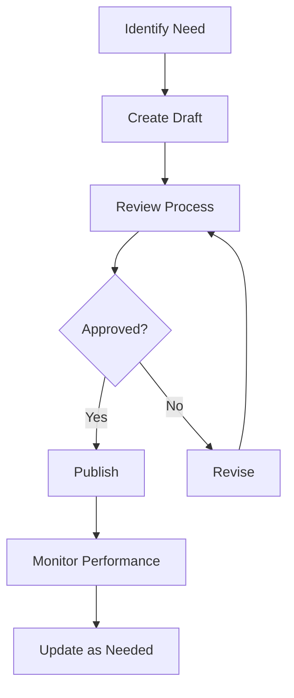
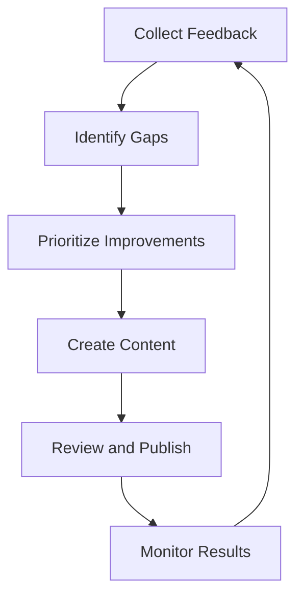

# Knowledge Base Management for erlmcp v3

## Table of Contents
1. [Knowledge Base Overview](#1-knowledge-base-overview)
2. [Content Strategy](#2-content-strategy)
3. [Knowledge Classification](#3-knowledge-classification)
4. [Content Creation Process](#4-content-creation-process)
5. [Search and Discovery](#5-search-and-discovery)
6. [Maintenance and Updates](#6-maintenance-and-updates)
7.Analytics and Optimization](#7-analytics-and-optimization)
8. [Knowledge Sharing](#8-knowledge-sharing)
9. [Continuous Improvement](#9-continuous-improvement)
10. [Training and Adoption](#10-training-and-adoption)

## 1. Knowledge Base Overview

### 1.1 Purpose and Scope

The knowledge base serves as the central repository for all erlmcp v3 documentation, troubleshooting guides, best practices, and customer-facing information. It supports both internal support teams and external customers with comprehensive, searchable content.

### 1.2 Stakeholder Groups

| Group | Needs | Access Level |
|-------|-------|--------------|
| **Support Agents** | Troubleshooting, procedures, internal docs | Full access |
| **Customers** | Getting started, guides, FAQs | Limited access |
| **Developers** | API docs, architecture, implementation | Full access |
| **Partners** | Integration guides, API access | Limited access |
| **Executives** | High-level overviews, metrics | Read-only |

### 1.3 Platform Architecture

```yaml
Knowledge Base Platform:
  Frontend:
    - Web portal for customers
    - Internal portal for staff
    - Mobile responsive design
    - Search with autocomplete

  Backend:
    - Algolia search engine
    - Markdown content storage
    - Version control integration
    - Analytics tracking

  Content Management:
    - Git-based workflow
    - Review and approval process
    - Content scheduling
    - Performance monitoring

  Features:
    - Real-time search
    - Related articles
    - Article ratings
    - Feedback collection
    - Translation support
```

## 2. Content Strategy

### 2.1 Content Pillars

| Pillar | Description | Examples |
|--------|-------------|---------|
| **Getting Started** | Onboarding and basic usage | Quick start guides, installation |
| **Technical Documentation** | Deep technical content | API references, architecture |
| **Troubleshooting** | Problem-solving guidance | Error codes, resolution steps |
| **Best Practices** | Recommended approaches | Performance, security, scaling |
| **Tutorials** | Step-by-step guides | Configuration, integration |
| **FAQs** | Common questions | Product usage, billing |
| **Release Notes** | Version information | New features, bug fixes |

### 2.2 Content Creation Workflow



### 2.3 Content Tiers

| Tier | Purpose | Target Audience | Examples |
|------|--------|----------------|----------|
| **Tier 1 - Basic** | Quick reference | All users | FAQs, quick start guides |
| **Tier 2 - Detailed** | Comprehensive guides | Support agents, technical users | Troubleshooting procedures |
| **Tier 3 - Expert** | Technical deep dives | Developers, architects | API documentation, architecture |
| **Tier 4 - Internal** | Internal processes | Support team only | Playbooks, procedures |

## 3. Knowledge Classification

### 3.1 Taxonomy Structure

```
Knowledge Base
├── 00. Getting Started
│   ├── Installation
│   ├── Configuration
│   └── First Steps
├── 01. Technical Documentation
│   ├── Architecture
│   ├── API Reference
│   └── Integration Guides
├── 02. Troubleshooting
│   ├── Common Issues
│   ├── Error Codes
│   └── Performance Tuning
├── 03. Best Practices
│   ├── Security
│   ├── Performance
│   └── High Availability
├── 04. Advanced Topics
│   ├── Customization
│   ├── Extending
│   └── Migrations
└── 05. Resources
    ├── Videos
    ├── Community
    └── Support Channels
```

### 3.2 Metadata Schema

```json
{
  "article": {
    "id": "kb-001",
    "title": "Registry Performance Tuning",
    "category": "02. Troubleshooting",
    "tags": ["performance", "registry", "optimization"],
    "author": "John Doe",
    "reviewer": "Jane Smith",
    "version": "2.1",
    "last_updated": "2024-01-15",
    "difficulty": "intermediate",
    "audience": ["developers", "admins"],
    "estimated_read_time": 10,
    "related_articles": ["kb-002", "kb-003"],
    "popular_searches": ["registry slow", "performance issues"],
    "keywords": ["throughput", "latency", "registry tuning"]
  }
}
```

### 3.3 Tagging System

| Tag Category | Examples | Purpose |
|--------------|---------|---------|
| **Technology** | erlang, otp, json-rpc | Content technology focus |
| **Difficulty** | beginner, intermediate, expert | User skill level |
| **Topic** | security, performance, scalability | Subject matter |
| **Product** | erlmcp-core, erlmcp-transports | Product component |
| **Version** | v3.0, v3.1, v3.2 | Version compatibility |

## 4. Content Creation Process

### 4.1 Article Template

```markdown
---
title: "[Article Title]"
id: "kb-001"
category: "02. Troubleshooting"
tags: ["tag1", "tag2"]
difficulty: "intermediate"
audience: ["developers", "admins"]
estimated_read_time: 15
version: "1.0"
author: "[Author Name]"
reviewer: "[Reviewer Name]"
last_updated: "[Date]"

# [Article Title]

## Overview
[Brief description of what this article covers]

## Prerequisites
- [ ] [Prerequisite 1]
- [ ] [Prerequisite 2]
- [ ] [Prerequisite 3]

## Step-by-Step Guide

### Step 1: [Title]
[Content with code blocks, screenshots, or diagrams]

```erlang
% Code example
-module(example).
-export([function/1]).

function(Arg) ->
    Result = some_operation(Arg),
    Result.
```

### Step 2: [Title]
[Content with bullet points or numbered lists]

1. First item
2. Second item
3. Third item

## Troubleshooting

### Common Issues

#### Issue: [Problem Description]
**Symptoms**: [What to look for]
**Solution**: [Step-by-step resolution]
**Prevention**: [How to prevent]

## Related Articles
- [Related article 1](/article1)
- [Related article 2](/article2)
- [Related article 3](/article3)

## Feedback
[Feedback section or link to feedback form]
```

### 4.2 Content Creation Workflow

```erlang
% Content Management Workflow
-module(erlmcp_content_workflow).
-export([create_article/1, review_article/1, publish_article/1]).

create_article(Article) ->
    % Validate article structure
    case validate_article(Article) of
        ok ->
            % Create draft in version control
            DraftId = create_draft(Article),
            % Assign to reviewer
            assign_reviewer(DraftId),
            % Create tracking ticket
            create_ticket(DraftId),
            {created, DraftId};
        {error, Reason} ->
            {error, Reason}
    end.

review_article(DraftId) ->
    % Get draft content
    Draft = get_draft(DraftId),

    % Technical review
    TechnicalReview = technical_review(Draft),

    % Accuracy check
    AccuracyCheck = check_accuracy(Draft),

    % Clarity assessment
    ClarityScore = assess_clarity(Draft),

    % Generate review feedback
    Feedback = generate_feedback(TechnicalReview, AccuracyCheck, ClarityScore),

    % Update draft with feedback
    update_draft(DraftId, Feedback),

    {review_complete, Feedback}.
```

### 4.3 Review Process

1. **Initial Draft**:
   - Author creates article
   - Self-check for completeness
   - Submit for review

2. **Peer Review**:
   - Technical accuracy check
   - Completeness verification
   - Readability assessment

3. **Editorial Review**:
   - Grammar and spelling
   - Structure and flow
   - Formatting consistency

4. **Final Approval**:
   - Product manager review
   - Technical lead approval
   - Publication scheduling

## 5. Search and Discovery

### 5.1 Search Architecture

```yaml
Search System:
  Indexing:
    - Full-text search
    - Metadata indexing
    - Synonym mapping
    - Stop word filtering

  Query Processing:
    - Tokenization
    - Stemming
    - Fuzzy matching
    - Relevance scoring

  Ranking Factors:
    - Title matches
    - Content relevance
    - User ratings
    - View count
    - Recency
    - Popularity

  Features:
    - Auto-complete
    - Spell correction
    - Related suggestions
    - Faceted filtering
    - Preview snippets
```

### 5.2 Search Optimization

```erlang
% Search Optimization Module
-module(erlmcp_search_optimizer).
-export([optimize_content/1, analyze_search_queries/1]).

optimize_content(Article) ->
    % Extract keywords from content
    Keywords = extract_keywords(Article),

    % Analyze search patterns
    SearchPatterns = analyze_search_patterns(Keywords),

    % Optimize metadata
    OptimizedMetadata = optimize_metadata(Article, SearchPatterns),

    % Generate related terms
    RelatedTerms = generate_related_terms(Keywords),

    #{
        optimized => true,
        keywords => Keywords,
        search_patterns => SearchPatterns,
        metadata => OptimizedMetadata,
        related_terms => RelatedTerms
    }.

analyze_search_queries(Keywords) ->
    % Analyze actual search queries
    Queries = fetch_search_queries(Keywords),

    % Identify common patterns
    Patterns = identify_patterns(Queries),

    % Suggest improvements
    Improvements = suggest_improvements(Patterns),

    Improvements.
```

### 5.3 Search Analytics

```json
{
  "search_analytics": {
    "total_queries": 15420,
    "successful_queries": 13890,
    "search_success_rate": 90.1,
    "average_session_duration": 3.2,
    "popular_searches": [
      {"query": "registry performance", "count": 1234},
      {"query": "installation guide", "count": 987},
      {"query": "error codes", "count": 876},
      {"query": "troubleshooting", "count": 765},
      {"query": "api documentation", "count": 654}
    ],
    "failed_searches": [
      {"query": "slow registry", "count": 45},
      {"query": "setup tutorial", "count": 32},
      {"query": "configuration help", "count": 28}
    ]
  },
  "content_performance": {
    "top_articles": [
      {"id": "kb-001", "views": 5432, "helpful": 4.2},
      {"id": "kb-002", "views": 4321, "helpful": 4.5},
      {"id": "kb-003", "views": 3456, "helpful": 4.0}
    ],
    "articles_needing_improvement": [
      {"id": "kb-004", "views": 123, "helpful": 2.1},
      {"id": "kb-005", "views": 89, "helpful": 1.8}
    ]
  }
}
```

## 6. Maintenance and Updates

### 6.1 Content Lifecycle Management

| Phase | Duration | Activities |
|-------|----------|------------|
| **Creation** | 1-2 weeks | Writing, review, approval |
| **Publication** | 1-2 days | Final checks, publishing |
| **Active** | Ongoing | Monitoring, updates |
| **Review** | Quarterly | Accuracy check, updates |
| **Archive** | As needed | Outdated content removal |

### 6.2 Update Triggers

```yaml
Update Triggers:
  Content Updates:
    - Version releases: Update all version-specific content
    - New features: Create/update feature documentation
    - Bug fixes: Update troubleshooting guides
    - Security patches: Update security documentation

  Performance Reviews:
    - Quarterly: Content effectiveness analysis
    - Annually: Comprehensive content audit
    - As needed: Customer feedback analysis

  Automation:
    - Link rot detection: Monthly checks
    - Outdated references: Version change alerts
    - Broken images: Automated verification
```

### 6.3 Content Health Dashboard

```json
{
  "content_health": {
    "total_articles": 342,
    "published_articles": 298,
    "draft_articles": 23,
    "outdated_articles": 21,
    "articles_needing_review": 15,
    "average_quality_score": 4.2,
    "coverage_of_features": 87.5
  },
  "maintenance_metrics": {
    "average_age": 45,
    "stale_content_percentage": 6.1,
    "broken_links": 0,
    "outdated_images": 3,
    "missing_screenshots": 8
  },
  "engagement_metrics": {
    "average_views_per_article": 1567,
    "helpful_votes_ratio": 0.85,
    "comments_count": 234,
    "feedback_responses": 89,
    "search_success_rate": 0.92
  }
}
```

## 7. Analytics and Optimization

### 7.1 Key Metrics to Track

| Metric Category | Specific Metrics | Target |
|----------------|------------------|--------|
| **Search Performance** | Search success rate | > 90% |
| | Zero results rate | < 5% |
| | Click-through rate | > 40% |
| | Average time on page | > 2 min |
| **Content Performance** | Article views | Growing |
| | Helpfulness rating | > 4.0 |
| | Comments/feedback | Regular |
| | Outdated content | < 5% |
| **User Behavior** | New vs returning users | Balanced |
| | Page depth > 2 | > 60% |
| | Exit rate | < 40% |
| | Bounce rate | < 25% |

### 7.2 Content Optimization Strategy

```erlang
% Content Optimization Module
-module(erlmcp_content_optimizer).
-export([analyze_content_performance/1, recommend_improvements/1]).

analyze_content_performance(ArticleId) ->
    % Gather performance data
    Performance = gather_metrics(ArticleId),

    % Analyze engagement
    Engagement = analyze_engagement(Performance),

    % Identify issues
    Issues = identify_issues(Performance),

    % Generate recommendations
    Recommendations = generate_recommendations(Engagement, Issues),

    #{
        article_id => ArticleId,
        performance => Performance,
        engagement => Engagement,
        issues => Issues,
        recommendations => Recommendations
    }.

generate_recommendvements(Engagement, Issues) ->
    Recommendations = [],

    % Check readability
    case Engagement#readability_score < 60 of
        true ->
            Recommendations#readability_improvement;
        false ->
            Recommendations
    end,

    % Check structure
    case Issues#missing_structure of
        true ->
            Recommendations#structure_improvement;
        false ->
            Recommendations
    end,

    % Check outdated content
    case Issues#content_age > 180 of
        true ->
            Recommendations#update_needed;
        false ->
            Recommendations
    end.
```

### 7.3 A/B Testing Framework

```yaml
A/B Testing:
  Test Scenarios:
    - Title variations
    - Content structure
    - Call-to-button placement
    - Search result snippets

  Measurement:
    - Click-through rates
    - Time on page
    - Conversion rates
    - User feedback

  Implementation:
    - Random assignment
    - Statistical significance
    - Continuous monitoring
    - Rollout optimization
```

## 8. Knowledge Sharing

### 8.1 Internal Knowledge Sharing

1. **Daily Stand-ups**:
   - Share new articles
   - Highlight common issues
   - Discuss content gaps

2. **Weekly Reviews**:
   - Content performance review
   - Improvement planning
   - Knowledge sharing sessions

3. **Monthly Workshops**:
   - Writing skills
   - Technical updates
   - Customer feedback analysis

### 8.2 External Knowledge Sharing

1. **Community Portal**:
   - Forums for user discussions
   - Contributing guidelines
   - Expert Q&A sessions

2. **Developer Blog**:
   - Technical deep dives
   - Best practices
   - Case studies

3. **Webinars and Videos**:
   - Tutorial series
   - Live troubleshooting sessions
   - Product updates

### 8.3 Knowledge Transfers

```markdown
# Knowledge Transfer Checklist

## Before Transfer
- [ ] Documentation complete
- [ ] Article published
- [ ] Team trained
- [ ] Search optimized
- [ ] Performance baselines set

## During Transfer
- [ ] Handoff meeting scheduled
- [ ] Key stakeholders informed
- [ ] Q&A session conducted
- [ ] Feedback collected

## After Transfer
- [ ] Monitoring period set
- [ ] Performance reviewed
- [ ] Feedback analyzed
- [ ] Improvements implemented
- [ ] Documentation updated
```

## 9. Continuous Improvement

### 9.1 Feedback Collection Methods

1. **In-Article Feedback**:
   - Thumbs up/down
   - Rating system (1-5)
   - Comment section

2. **Search Analytics**:
   - Failed searches
   - Low CTR queries
   - High bounce rates

3. **Customer Surveys**:
   - Satisfaction surveys
   - Content effectiveness
   - Suggestions for improvement

4. **Support Tickets**:
   - Common patterns
   - Missing content
   - Outdated information

### 9.2 Content Improvement Cycle



### 9.3 Quality Assurance Process

1. **Automated Checks**:
   - Spell and grammar check
   - Link validation
   - Image optimization
   - Format consistency

2. **Manual Reviews**:
   - Technical accuracy
   - Completeness check
   - Readability assessment
   - Customer perspective

3. **Performance Testing**:
   - Load testing
   - Search performance
   - Mobile responsiveness
   - Accessibility compliance

## 10. Training and Adoption

### 10.1 Training Program

| Audience | Training Content | Format | Duration |
|----------|------------------|--------|----------|
| **New Support Agents** | KB basics, search技巧, article creation | Workshop | 4 hours |
| **Existing Agents** | Advanced search, content updates, metrics | Refresher | 2 hours |
| **Content Creators** | Writing standards, review process, tools | Training | 3 days |
| **Technical Writers** | Style guide, technical writing best practices | Workshop | 2 days |

### 10.2 Adoption Strategies

1. **Incentive Programs**:
   - Recognition for top contributors
   - Rewards for high-quality content
   - Leaderboards for engagement

2. **Integration Workflows**:
   - KB links in support tickets
   - Search integration in chat
   - Recommendations in CRM

3. **Promotional Activities**:
   - New content announcements
   - Popular articles highlights
   - Regular newsletters

### 10.3 Success Metrics

```json
{
  "adoption_metrics": {
    "support_agent_usage": {
      "daily_active_users": 45,
      "content_accessed_per_day": 876,
      "kb_tickets_ratio": 0.65,
      "self_resolution_rate": 0.42
    },
    "customer_usage": {
      "unique_visitors_monthly": 12500,
      "pageviews_monthly": 45000,
      "average_session_duration": 245,
      "mobile_visitors_percentage": 35.2
    },
    "content_creation": {
      "articles_published_monthly": 12,
      "active_contributors": 18,
      "average_review_time": 2.3,
      "quality_score": 4.3
    }
  }
}
```

## 11. Conclusion

The knowledge base management system provides a structured approach to creating, maintaining, and optimizing documentation for erlmcp v3. By following these processes, we can ensure that both internal teams and customers have access to high-quality, up-to-date information that enables effective problem-solving and knowledge sharing.

Regular monitoring, feedback collection, and continuous improvement will ensure the knowledge base remains valuable and relevant as the product evolves and user needs change.