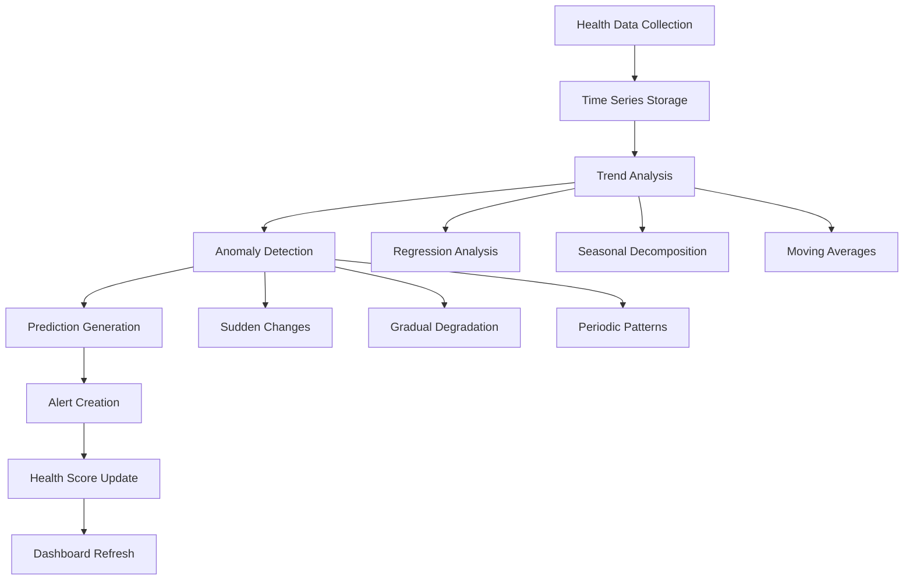

# Proactive Monitoring System for erlmcp v3

## Table of Contents
1. [Proactive Monitoring Overview](#1-proactive-monitoring-overview)
2. [Monitoring Architecture](#2-monitoring-architecture)
3. [Predictive Analytics Engine](#3-predictive-analytics-engine)
4. [Automated Alerting System](#4-automated-alerting-system)
5. [Anomaly Detection](#5-anomaly-detection)
6. [Capacity Planning](#6-capacity-planning)
7. [Chaos Engineering Integration](#7-chaos-engineering-integration)
8. [Self-Healing Systems](#8-self-healing-systems)
9. [Health Scoring](#9-health-scoring)
10. [Continuous Improvement](#10-continuous-improvement)

## 1. Proactive Monitoring Overview

### 1.1 Philosophy and Goals

**Core Principles**:
- **Predict, Don't React**: Identify issues before they impact customers
- **Automate Prevention**: Use automation to prevent incidents
- **Data-Driven Decisions**: Use metrics and trends for operational decisions
- **Continuous Learning**: Improve predictions based on historical data
- **Customer-Centric**: Focus on metrics that directly impact customers

**Key Goals**:
1. Reduce incident frequency by 50%
2. Decreve MTTR by 70%
3. Improve resource utilization by 30%
4. Prevent SLA breaches through early detection
5. Enable data-driven capacity planning

### 1.2 Proactive vs Reactive Monitoring

| Aspect | Reactive Monitoring | Proactive Monitoring |
|--------|-------------------|---------------------|
| **Detection** | After incident occurs | Before impact |
| **Response** | Manual intervention | Automated prevention |
| **Focus** | Fix symptoms | Address root causes |
| **Data** | Current state | Historical trends |
| **Tools** | Alerting dashboards | AI/ML analytics |
| **Outcome** | Incident resolution | Incident prevention |

### 1.3 Benefits of Proactive Monitoring

1. **Business Impact**:
   - Reduced downtime costs
   - Improved customer satisfaction
   - Better resource allocation
   - Proactive capacity planning

2. **Technical Benefits**:
   - Early problem detection
   - Automated resolution
   - System optimization
   - Predictive scaling

3. **Operational Benefits**:
   - Reduced manual intervention
   - Improved team efficiency
   - Better incident prevention
   - Continuous system improvement

## 2. Monitoring Architecture

### 2.1 Layered Monitoring Architecture

```yaml
Monitoring Architecture:
  Infrastructure Layer:
    - Servers: CPU, memory, disk, network
    - Network: Latency, packet loss, bandwidth
    - Storage: I/O, capacity, performance
    - Cloud: Resource utilization, costs

  Platform Layer:
    - Kubernetes: Node health, pod status
    - Containers: Resource limits, health checks
    - Load balancers: Connection counts, latency
    - Databases: Query performance, connections

  Application Layer:
    - erlmcp_registry: Message throughput, latency
    - erlmcp_transports: Connection success, errors
    - erlmcp_sessions: Session counts, creation rates
    - erlmcp_monitoring: Metric collection, alerting

  Business Layer:
    - Customer metrics: Satisfaction, churn
    - Service metrics: Uptime, SLA compliance
    - Usage metrics: API calls, feature adoption
    - Financial metrics: Revenue, costs

  Experience Layer:
    - End-user performance: Page load, API response
    - Customer experience: Support tickets, feedback
    - Application health: Error rates, success rates
```

### 2.2 Data Flow Architecture

```mermaid
graph TD
    A[Data Sources] --> B[Collection Agents]
    B --> C[Edge Processing]
    C --> D[Central Pipeline]
    D --> E[Stream Processing]
    E --> F[Analytics Engine]
    F --> G[Storage Layer]
    G --> H[Visualization]
    G --> I[Alerting]
    G --> J[APIs]

    A --> Prometheus
    A --> Application Logs
    A --> Business Systems
    A --> Customer Feedback
```

### 2.3 Technology Stack

| Component | Technology | Purpose |
|-----------|------------|---------|
| **Collection** | Prometheus, Telegraf, Fluentd | Data collection |
| **Storage** | InfluxDB, Elasticsearch, PostgreSQL | Time-series and log storage |
| **Processing** | Kafka, Spark Streaming | Stream processing |
| **Analytics** | Python ML, TensorFlow, Anomaly Detection | Predictive analysis |
| **Visualization** | Grafana, Kibana, Custom UI | Dashboards and alerts |
| **Automation** | Ansible, Kubernetes Operators | Self-healing |
| **Orchestration** | Prometheus Operator, Alertmanager | Alert management |

## 3. Predictive Analytics Engine

### 3.1 Machine Learning Models

```python
# Predictive Analytics Framework
class PredictiveAnalyticsEngine:
    def __init__(self):
        self.models = {
            'anomaly_detection': AnomalyDetector(),
            'failure_prediction': FailurePredictor(),
            'resource_forecasting': ResourceForecaster(),
            'demand_prediction': DemandPredictor(),
            'performance_degradation': PerformanceDegradationDetector()
        }
        self.data_pipeline = DataPipeline()
        self.alert_manager = AlertManager()

    def predict_incidents(self, metrics_data):
        """Predict potential incidents using multiple models"""
        predictions = {}

        # Run anomaly detection
        anomalies = self.models['anomaly_detection'].detect(metrics_data)
        if anomalies:
            predictions['anomalies'] = self._score_anomalies(anomalies)

        # Predict failures
        failure_probs = self.models['failure_prediction'].predict(metrics_data)
        if failure_probs['probability'] > 0.7:
            predictions['potential_failure'] = failure_probs

        # Forecast resource needs
        resource_forecast = self.models['resource_forecasting'].forecast(metrics_data)
        predictions['resource_needs'] = resource_forecast

        return predictions

    def _score_anomalies(self, anomalies):
        """Score anomalies based on severity and impact"""
        scored = []
        for anomaly in anomalies:
            severity = self._calculate_severity(anomaly)
            impact = self._calculate_impact(anomaly)
            score = severity * impact * 0.5  # Combined score
            scored.append({
                'anomaly': anomaly,
                'severity_score': severity,
                'impact_score': impact,
                'total_score': score
            })
        return sorted(scored, key=lambda x: x['total_score'], reverse=True)

class AnomalyDetector:
    def detect(self, metrics_data):
        """Detect anomalies using isolation forest algorithm"""
        from sklearn.ensemble import IsolationForest

        # Prepare features
        features = self._extract_features(metrics_data)

        # Train isolation forest
        clf = IsolationForest(contamination=0.1, random_state=42)
        predictions = clf.fit_predict(features)

        # Extract anomalies
        anomalies = []
        for i, pred in enumerate(predictions):
            if pred == -1:  # Anomaly detected
                anomalies.append({
                    'metric': metrics_data[i]['name'],
                    'value': metrics_data[i]['value'],
                    'expected_range': self._calculate_expected_range(metrics_data[i]),
                    'timestamp': metrics_data[i]['timestamp']
                })

        return anomalies
```

### 3.2 Predictive Models Implementation

```erlang
% Erlang Predictive Model Module
-module(erlmcp_predictive_model).
-export([predict_incident/1, forecast_resources/1]).

predict_incident(Metrics) ->
    % Extract relevant metrics
    RegistryMetrics = extract_metrics(metrics, registry),
    TransportMetrics = extract_metrics(metrics, transport),
    SessionMetrics = extract_metrics(metrics, session),

    % Run predictions
    RegistryRisk = predict_registry_failure(RegistryMetrics),
    TransportRisk = predict_transport_failure(TransportMetrics),
    SessionRisk = predict_session_failure(SessionMetrics),

    % Calculate overall risk score
    RiskScore = calculate_overall_risk([RegistryRisk, TransportRisk, SessionRisk]),

    % Generate predictions
    Predictions = generate_predictions(RiskScore, [
        {registry, RegistryRisk},
        {transport, TransportRisk},
        {session, SessionRisk}
    ]),

    % Trigger alerts if needed
    case RiskScore > 0.8 of
        true -> trigger_alert(Predictions);
        false -> ok
    end,

    Predictions.

predict_registry_failure(Metrics) ->
    % Analyze registry-specific patterns
    Throughput = proplists:get_value(throughput, Metrics),
    Latency = proplists:get_value(latency, Metrics),
    ErrorRate = proplists:get_value(error_rate, Metrics),

    % Calculate risk factors
    ThroughputRisk = calculate_throughput_risk(Throughput),
    LatencyRisk = calculate_latency_risk(Latency),
    ErrorRisk = calculate_error_risk(ErrorRate),

    % Combined risk score
    (ThroughputRisk + LatencyRisk + ErrorRisk) / 3.

forecast_resources(HistoricalData) ->
    % Analyze historical usage patterns
    % Implement time series forecasting
    % Return resource recommendations

    % Simple linear regression example
    Trend = analyze_trend(HistoricalData),
    Seasonality = detect_seasonality(HistoricalData),

    #{
        forecast => calculate_forecast(Trend, Seasonality),
        confidence_interval => calculate_confidence(HistoricalData),
        recommendations => generate_recommendations(Trend, Seasonality),
        timeframe => "30_days"
    }.
```

### 3.3 Anomaly Detection Algorithms

| Algorithm | Use Case | Pros | Cons |
|-----------|----------|------|------|
| **Isolation Forest** | Multi-dimensional anomaly detection | Handles high-dimensional data | May miss subtle patterns |
| **LSTM Autoencoders** | Time-series anomaly detection | Captures temporal patterns | Computationally intensive |
| **Statistical Process Control** | Process deviation detection | Simple to implement | Requires baseline data |
| **K-means Clustering** | Pattern-based anomalies | Unsupervised learning | Sensitive to initialization |
| **Change Point Detection** | Abrupt changes in metrics | Detects sudden shifts | May miss gradual changes |

## 4. Automated Alerting System

### 4.1 Alert Hierarchy

```yaml
Alert Hierarchy:
  Level 1 - Critical (Red):
    - Multiple systems down
    - Data loss
    - Security breach
    - Full system failure

    Actions:
    - Page on-call engineer
    - Alert CEO
    - Initiate war room
    - Enable emergency protocols

  Level 2 - High (Orange):
    - Major service degradation
    - Regional outage
    - SLA breach
    - Resource exhaustion

    Actions:
    - SMS engineering lead
    - Alert manager
    - Scale resources
    - Implement workarounds

  Level 3 - Medium (Yellow):
    - Performance degradation
    - Minor service issues
    - Capacity approaching limits
    - Configuration warnings

    Actions:
    - Email team lead
    - Monitor closely
    - Plan remediation
    - Update ticket

  Level 4 - Low (Blue):
    - Informational alerts
    - Maintenance notices
    - Usage trends
    - Optimization opportunities

    Actions:
    - Dashboard notification
    - Log for analysis
    - Schedule review
```

### 4.2 Alert Configuration

```yaml
Alert Rules Configuration:
  registry_alerts:
    - name: "registry_node_down"
      condition: "up == 0"
      duration: "5m"
      severity: "critical"
      labels: {component: "registry"}
      annotations:
        summary: "Registry node down"
        description: "All registry nodes are unavailable"

    - name: "registry_high_latency"
      condition: "latency_p95 > 100ms"
      duration: "10m"
      severity: "high"
      labels: {component: "registry"}
      annotations:
        summary: "Registry latency too high"
        description: "95th percentile latency exceeds 100ms"

  transport_alerts:
    - name: "transport_connection_failure"
      condition: "error_rate > 5%"
      duration: "5m"
      severity: "high"
      labels: {component: "transport"}
      annotations:
        summary: "Transport connection failures"
        description: "Connection error rate exceeds 5%"

    - name: "transport_buffer_full"
      condition: "buffer_usage > 80%"
      duration: "5m"
      severity: "medium"
      labels: {component: "transport"}
      annotations:
        summary: "Transport buffer nearly full"
        description: "Buffer usage exceeds 80%"

  predictive_alerts:
    - name: "resource_exhaustion_predicted"
      condition: "predicted_cpu > 90%"
      duration: "1h"
      severity: "medium"
      labels: {component: "resource", type: "predictive"}
      annotations:
        summary: "Resource exhaustion predicted"
        description: "CPU predicted to exceed 90% in next hour"
      runbook: "scaling_runbook"

    - name: "failure_predicted"
      condition: "failure_probability > 0.8"
      duration: "30m"
      severity: "high"
      labels: {component: "system", type: "predictive"}
      annotations:
        summary: "System failure predicted"
        description: "High probability of system failure detected"
```

### 4.3 Alert Routing and Escalation

```erlang
% Alert Routing Module
-module(erlmcp_alert_router).
-export([route_alert/1, escalate_alert/2]).

route_alert(Alert) ->
    % Get alert details
    Severity = maps:get(severity, Alert),
    Component = maps:get(component, Alert),
    Timestamp = maps:get(timestamp, Alert),

    % Determine routing based on severity
    Route = determine_route(Severity, Component),

    % Send alert through appropriate channels
    send_alert(Alert, Route),

    % Set escalation timer if needed
    case needs_escalation(Severity) of
        true -> start_escalation_timer(Alert);
        false -> ok
    end,

    % Update alert status
    update_alert_status(Alert, routed),

    ok.

determine_route(Severity, Component) ->
    case Severity of
        critical ->
            #{
                channels => [sms, phone, email],
                recipients => on_call_team(),
                escalation_time => 15 * 60 * 1000, % 15 minutes
                business_hours => false
            };
        high ->
            #{
                channels => [sms, email],
                recipients => engineering_lead(),
                escalation_time => 30 * 60 * 1000, % 30 minutes
                business_hours => true
            };
        medium ->
            #{
                channels => [email],
                recipients => component_team(Component),
                escalation_time => 2 * 60 * 60 * 1000, % 2 hours
                business_hours => true
            };
        low ->
            #{
                channels => [dashboard],
                recipients => monitoring_team(),
                escalation_time => undefined,
                business_hours => true
            }
    end.

escalate_alert(Alert, Level) ->
    % Get current recipients
    CurrentRoute = get_current_route(Alert),

    % Determine next escalation level
    NextLevel = get_next_escalation_level(Level),

    % Update alert with new level
    UpdatedAlert = maps:put(escalation_level, NextLevel, Alert),

    % Send escalation notifications
    send_escalation_notification(UpdatedAlert, NextLevel),

    % Update ticket system if applicable
    update_ticket(UpdatedAlert),

    ok.
```

## 5. Anomaly Detection

### 5.1 Real-time Anomaly Detection

```python
class RealTimeAnomalyDetector:
    def __init__(self):
        self.baseline = {}
        self.thresholds = {}
        self.window_size = 60  # 1 minute window
        self.detectors = {
            'statistical': StatisticalDetector(),
            'machine_learning': MLAnomalyDetector(),
            'pattern_based': PatternDetector()
        }

    def detect_anomalies(self, metrics_stream):
        """Process incoming metrics stream and detect anomalies"""
        anomalies = []

        for metric in metrics_stream:
            # Update baseline
            self.update_baseline(metric)

            # Check multiple detectors
            detector_results = {}
            for name, detector in self.detectors.items():
                result = detector.detect(metric, self.baseline)
                if result['is_anomaly']:
                    detector_results[name] = result

            # If any detector flags anomaly, create alert
            if detector_results:
                anomaly = {
                    'metric': metric['name'],
                    'value': metric['value'],
                    'timestamp': metric['timestamp'],
                    'detectors': detector_results,
                    'severity': self.calculate_severity(detector_results),
                    'action': self.determine_action(detector_results)
                }
                anomalies.append(anomaly)

        return anomalies

class StatisticalDetector:
    def detect(self, metric, baseline):
        """Detect anomalies using statistical methods"""
        name = metric['name']

        # Get baseline statistics
        stats = baseline.get(name, {'mean': 0, 'std': 1})
        mean = stats['mean']
        std = stats['std']

        # Z-score calculation
        z_score = abs(metric['value'] - mean) / std

        # Determine if anomaly
        is_anomaly = z_score > 3  # 3-sigma rule

        return {
            'is_anomaly': is_anomaly,
            'z_score': z_score,
            'method': 'statistical',
            'threshold': 3,
            'confidence': min(z_score / 3, 1.0)
        }
```

### 5.2 Multi-dimensional Anomaly Detection

```erlang
% Multi-dimensional Anomaly Detection
-module(erlmcp_multidim_anomaly).
-export([detect_system_anomalies/1]).

detect_system_anomalies(SystemMetrics) ->
    % Extract metrics for different dimensions
    RegistryMetrics = get_registry_metrics(SystemMetrics),
    TransportMetrics = get_transport_metrics(SystemMetrics),
    SessionMetrics = get_session_metrics(SystemMetrics),

    % Detect anomalies in each dimension
    RegistryAnomalies = detect_dimension_anomalies(RegistryMetrics),
    TransportAnomalies = detect_dimension_anomalies(TransportMetrics),
    SessionAnomalies = detect_dimension_anomalies(SessionMetrics),

    % Cross-correlate anomalies
    CorrelatedAnomalies = correlate_anomalies([
        RegistryAnomalies,
        TransportAnomalies,
        SessionAnomalies
    ]),

    % Calculate system-wide anomaly score
    SystemScore = calculate_system_score(CorrelatedAnomalies),

    % Generate alerts based on score
    case SystemScore > 0.8 of
        true -> trigger_system_alert(CorrelatedAnomalies, SystemScore);
        false -> ok
    end,

    #{
        system_score => SystemScore,
        anomalies => CorrelatedAnomalies,
        timestamp => erlang:system_time(millisecond)
    }.

detect_dimension_anomalies(Metrics) ->
    % Extract feature vectors
    FeatureVectors = extract_feature_vectors(Metrics),

    % Apply anomaly detection algorithms
    IsolationForestResults = apply_isolation_forest(FeatureVectors),
    LOFResults = apply_local_outlier_factor(FeatureVectors),
    OCSVResults = apply_one_class_svm(FeatureVectors),

    % Combine results
    CombinedResults = combine_anomaly_results([
        IsolationForestResults,
        LOFResults,
        OCSVResults
    ]),

    CombinedResults.
```

### 5.3 Pattern-Based Anomaly Detection

| Pattern Type | Detection Method | Example | Action |
|--------------|------------------|---------|--------|
| **Temporal Patterns** | Time series analysis | Unexpected spikes at specific times | Alert and investigate |
| **Spatial Patterns** | Geographic correlation | Regional issues | Alert regional team |
| **Behavioral Patterns** | User behavior analysis | Unusual usage patterns | Alert customer success |
| **Dependency Patterns** | Causal analysis | Root cause in upstream system | Alert responsible team |
| **Seasonal Patterns** | Time series decomposition | Expected vs actual seasonality | Adjust forecasts |

## 6. Capacity Planning

### 6.1 Automated Capacity Planning

```python
class CapacityPlanner:
    def __init__(self):
        self.forecaster = TimeSeriesForecaster()
        self.cost_optimizer = CostOptimizer()
        self.scaling_engine = ScalingEngine()

    def plan_capacity(self, historical_data, business_forecast):
        """Generate capacity plan based on multiple factors"""
        # Generate forecasts
        resource_forecast = self.forecaster.forecast(historical_data)
        demand_forecast = self.forecast_demand(business_forecast)

        # Optimize resources
        optimal_config = self.cost_optimizer.optimize(
            resource_forecast,
            demand_forecast
        )

        # Generate scaling plans
        scaling_plan = self.scaling_engine.generate_plan(optimal_config)

        # Generate recommendations
        recommendations = self.generate_recommendations(
            scaling_plan,
            cost_impact=True,
            risk_assessment=True
        )

        return {
            'forecast': resource_forecast,
            'optimal_config': optimal_config,
            'scaling_plan': scaling_plan,
            'recommendations': recommendations,
            'implementation_timeline': self.calculate_timeline(scaling_plan)
        }

class TimeSeriesForecaster:
    def forecast(self, historical_data):
        """Forecast resource needs using multiple methods"""
        # Decompose time series
        decomposition = seasonal_decompose(historical_data, model='additive')

        # Apply forecasting models
        arima_forecast = self._apply_arima(decomposition.trend)
        prophet_forecast = self._apply_prophet(historical_data)
        ml_forecast = self._apply_ml_model(historical_data)

        # Ensemble forecasts
        ensemble_forecast = self._ensemble_forecasts([
            arima_forecast,
            prophet_forecast,
            ml_forecast
        ])

        # Calculate confidence intervals
        confidence_intervals = self._calculate_confidence(ensemble_forecast)

        return {
            'forecast': ensemble_forecast,
            'confidence_intervals': confidence_intervals,
            'method': 'ensemble',
            'accuracy': self._calculate_accuracy(historical_data, ensemble_forecast)
        }
```

### 6.2 Resource Optimization

```erlang
% Resource Optimization Module
-module(erlmcp_resource_optimizer).
-export([optimize_resources/1, recommend_scaling/1]).

optimize_resources(ResourceData) ->
    % Analyze current resource usage
    UsageStats = analyze_usage_patterns(ResourceData),

    % Identify optimization opportunities
    Opportunities = identify_opportunities(UsageStats),

    % Generate optimization recommendations
    Recommendations = generate_recommendations(Opportunities),

    % Calculate cost impact
    CostImpact = calculate_cost_impact(Recommendations),

    % Create implementation plan
    ImplementationPlan = create_implementation_plan(Recommendations),

    #{
        current_usage => UsageStats,
        opportunities => Opportunities,
        recommendations => Recommendations,
        cost_impact => CostImpact,
        implementation_plan => ImplementationPlan
    }.

recommend_scaling(ResourceData) ->
    % Analyze resource trends
    Trends = analyze_trends(ResourceData),

    % Predict future needs
    Predictions = predict_needs(Trends),

    % Determine optimal scaling strategy
    ScalingStrategy = determine_scaling_strategy(Predictions),

    % Generate scaling actions
    ScalingActions = generate_scaling_actions(ScalingStrategy),

    % Set up automated scaling
    setup_automatic_scaling(ScalingActions),

    #{
        trends => Trends,
        predictions => Predictions,
        strategy => ScalingStrategy,
        actions => ScalingActions,
        timeline => calculate_scaling_timeline(ScalingActions)
    }.

determine_scaling_strategy(Predictions) ->
    % Analyze prediction patterns
    GrowthRate = Predictions#growth_rate,
    Seasonality = Predictions#seasonality,

    case GrowthRate of
        high when GrowthRate > 0.5 ->
            #{
                strategy => aggressive_scaling,
                reason => "High growth rate predicted",
                timeline => "immediate",
                risk => "high"
            };
        medium when GrowthRate > 0.2 ->
            #{
                strategy => moderate_scaling,
                reason => "Moderate growth predicted",
                timeline => "2_weeks",
                risk => "medium"
            };
        low ->
            #{
                strategy => conservative_scaling,
                reason => "Low growth predicted",
                timeline => "monthly",
                risk => "low"
            }
    end.
```

### 6.3 Cost Optimization Strategies

| Strategy | Description | Implementation | Expected Savings |
|----------|-------------|----------------|------------------|
| **Right-Sizing** | Match resources to actual usage | Auto-scaling policies | 20-30% |
| **Reserved Instances** | Commit to usage for discounts | Reserved instance planning | 30-40% |
| **Spot Instances** | Use spare capacity | Spot instance policies | 60-80% |
| **Scheduling** | Turn off unused resources | Automated scheduling | 15-25% |
| **Multi-Region** | Optimize region usage | Geographic load balancing | 10-20% |

## 7. Chaos Engineering Integration

### 7.1 Chaos Engineering Framework

```yaml
Chaos Engineering Framework:
  Principles:
    - Build confidence in system behavior
    - Discover failure modes before customers do
    - Embrace failures as learning opportunities
    - Continuous experimentation and improvement

  Methodology:
    1. Define steady state - What normal looks like
    2. Hypothesize failure modes - How things can break
    3. Run experiments in production - Safely inject failures
    4. Validate findings - Does behavior match expectations
    5. Mitigate and improve - Fix discovered weaknesses

  Experiment Types:
    - Infrastructure: Node failures, network partitions
    - Platform: Pod restarts, service disruptions
    - Application: Feature flag failures, circuit breakers
    - Data: Database failures, cache invalidation
    - Network: Latency, packet loss, bandwidth limits
```

### 7.2 Automated Chaos Experiments

```python
class ChaosEngine:
    def __init__(self):
        self.experiment_manager = ExperimentManager()
        self.monitoring_client = MonitoringClient()
        self.failure_injector = FailureInjector()

    def run_experiment(self, experiment_config):
        """Execute a chaos engineering experiment"""
        # Validate experiment configuration
        self.validate_config(experiment_config)

        # Start monitoring baseline
        baseline = self.monitoring_client.capture_baseline()

        # Inject failures
        failures = self.failure_injector.inject(experiment_config['failures'])

        # Monitor system behavior
        results = self.monitoring_client.monitor_experiment(
            experiment_config['duration'],
            baseline
        )

        # Analyze results
        analysis = self.analyze_results(results, baseline)

        # Generate report
        report = self.generate_report(experiment_config, results, analysis)

        # Clean up
        self.failure_injector.cleanup(failures)

        return report

class FailureInjector:
    def inject(self, failures):
        """Inject failures into the system"""
        injected_failures = []

        for failure in failures:
            failure_type = failure['type']

            if failure_type == 'node_failure':
                injected = self.inject_node_failure(failure)
            elif failure_type == 'network_partition':
                injected = self.inject_network_partition(failure)
            elif failure_type == 'resource_exhaustion':
                injected = self.inject_resource_exhaustion(failure)
            elif failure_type == 'service_disruption':
                injected = self.inject_service_disruption(failure)
            else:
                continue

            injected_failures.append({
                'config': failure,
                'injected_id': injected,
                'timestamp': datetime.now()
            })

        return injected_failures
```

### 7.3 Proactive Chaos Testing

| Test Type | Frequency | Scope | Objective |
|-----------|-----------|-------|-----------|
| **Infrastructure Tests** | Weekly | Random nodes | Test failover capabilities |
| **Network Tests** | Monthly | Network partitions | Test resilience |
| **Service Tests** | Weekly | Random services | Test dependency handling |
| **Data Tests** | Monthly | Data corruption | Test backup and recovery |
| **Edge Case Tests** | Quarterly | Rare scenarios | Test extreme conditions |

## 8. Self-Healing Systems

### 8.1 Self-Healing Architecture

```yaml
Self-Healing Architecture:
  Detection Layer:
    - Health checks: Automated monitoring
    - Anomaly detection: ML-based analysis
    - Pattern recognition: Historical comparison

  Decision Layer:
    - Rule engine: Predefined healing actions
    - Machine learning: Predict optimal actions
    - Human override: Manual intervention needed

  Action Layer:
    - Auto-restart: Restart failed components
    - Auto-scale: Adjust resources
    - Auto-failover: Switch to backup systems
    - Auto-configuration: Apply settings

  Verification Layer:
    - Health verification: Confirm fix
    - Performance monitoring: Track recovery
    - Customer impact: Check service levels
```

### 8.2 Automated Healing Actions

```erlang
% Self-Healing Module
-module(erlmcp_self_healing).
-export([heal_system/1, execute_healing_action/2]).

heal_system(SystemState) ->
    % Analyze system health
    HealthIssues = detect_health_issues(SystemState),

    % For each issue, determine healing action
    HealingActions = lists:map(fun(Issue) ->
        determine_healing_action(Issue)
    end, HealthIssues),

    % Execute healing actions
    Results = lists:map(fun(Action) ->
        execute_healing_action(Action, SystemState)
    end, HealingActions),

    % Verify healing effectiveness
    HealingReport = verify_healing(Results, SystemState),

    % Log and report
    log_healing_actions(Results),
    notify_team(HealingReport),

    HealingReport.

determine_healing_action(Issue) ->
    case Issue#type of
        node_down ->
            #{
                action => restart_node,
                target => Issue#node,
                priority => high,
                timeout => 5 * 60 * 1000 % 5 minutes
            };
        service_unresponsive ->
            #{
                action => restart_service,
                target => Issue#service,
                priority => high,
                timeout => 2 * 60 * 1000 % 2 minutes
            };
        resource_exhausted ->
            #{
                action => scale_resources,
                target => Issue#resource,
                priority => medium,
                timeout => 10 * 60 * 1000 % 10 minutes
            };
        network_partition ->
            #{
                action => failover_traffic,
                target => Issue#network,
                priority => high,
                timeout => 1 * 60 * 1000 % 1 minute
            }
    end.

execute_healing_action(Action, SystemState) ->
    ActionName = maps:get(action, Action),
    Target = maps:get(target, Action),

    case ActionName of
        restart_node ->
            execute_node_restart(Target);
        restart_service ->
            execute_service_restart(Target);
        scale_resources ->
            execute_resource_scaling(Target);
        failover_traffic ->
            execute_traffic_failover(Target)
    end.
```

### 8.3 Healing Strategies

| Failure Type | Detection Method | Healing Action | Success Metric |
|--------------|-----------------|----------------|----------------|
| **Node Failure** | Health check timeout | Restart node | Node back online |
| **Service Crash** | Process monitor | Restart service | Service healthy |
| **Resource Exhaustion** | Resource monitoring | Scale resources | Resources normalized |
| **Database Slow Query** | Query performance | Optimize queries | Query performance improved |
| **Network Latency** | Network monitoring | Route optimization | Latency reduced |
| **Memory Leak** | Memory monitoring | Restart process | Memory usage stable |

## 9. Health Scoring

### 9.1 System Health Scoring Model

```python
class HealthScorer:
    def __init__(self):
        self.weights = {
            'uptime': 0.3,
            'performance': 0.25,
            'errors': 0.2,
            'resources': 0.15,
            'business_metrics': 0.1
        }
        self.baselines = {}

    def calculate_health_score(self, metrics):
        """Calculate overall system health score"""
        scores = {}

        # Calculate individual scores
        scores['uptime'] = self._calculate_uptime_score(metrics['uptime'])
        scores['performance'] = self._calculate_performance_score(metrics['performance'])
        scores['errors'] = self._calculate_error_score(metrics['errors'])
        scores['resources'] = self._calculate_resource_score(metrics['resources'])
        scores['business_metrics'] = self._calculate_business_score(metrics['business'])

        # Apply weights to get overall score
        overall_score = sum(
            score * self.weights[category]
            for category, score in scores.items()
        )

        # Generate health grade
        health_grade = self._get_health_grade(overall_score)

        return {
            'overall_score': overall_score,
            'scores': scores,
            'health_grade': health_grade,
            'timestamp': datetime.now(),
            'recommendations': self._generate_recommendations(scores)
        }

    def _calculate_uptime_score(self, uptime_data):
        """Calculate uptime health score"""
        current_uptime = uptime_data['current']
        target_uptime = uptime_data['target']

        if current_uptime >= target_uptime:
            return 1.0
        else:
            # Score decreases proportionally
            return current_uptime / target_uptime
```

### 9.2 Real-time Health Dashboard

```json
{
  "health_dashboard": {
    "system_health": {
      "overall_score": 92.5,
      "grade": "A",
      "trend": "improving",
      "last_updated": "2024-01-15T10:30:00Z"
    },
    "component_scores": {
      "registry": {
        "score": 95,
        "grade": "A",
        "trend": "stable",
        "metrics": {
          "uptime": 99.99,
          "throughput": 850000,
          "latency": 45,
          "errors": 0.02
        }
      },
      "transports": {
        "score": 88,
        "grade": "B",
        "trend": "degrading",
        "metrics": {
          "uptime": 99.5,
          "connections": 25000,
          "error_rate": 0.5,
          "latency": 120
        }
      },
      "sessions": {
        "score": 90,
        "grade": "A",
        "trend": "improving",
        "metrics": {
          "active_sessions": 12000,
          "creation_rate": 150,
          "failures": 0.1,
          "avg_duration": 3600
        }
      }
    },
    "recommendations": [
      {
        "component": "transports",
        "issue": "Latency increasing",
        "action": "Check network configuration",
        "priority": "medium",
        "deadline": "2024-01-20"
      }
    ]
  }
}
```

### 9.3 Health Trend Analysis



## 10. Continuous Improvement

### 10.1 Feedback Loop Implementation

```python
class ContinuousImprovementSystem:
    def __init__(self):
        self.feedback_collector = FeedbackCollector()
        self.analyzer = ImprovementAnalyzer()
        self.implementation_engine = ImplementationEngine()

    def run_improvement_cycle(self):
        """Execute continuous improvement cycle"""
        # Collect feedback from multiple sources
        feedback = self.feedback_collector.collect_feedback()

        # Analyze and identify improvement opportunities
        opportunities = self.analyzer.analyze(feedback)

        # Prioritize opportunities
        prioritized = self.prioritize_opportunities(opportunities)

        # Create and track improvement plans
        improvement_plans = self.create_improvement_plans(prioritized)

        # Implement changes
        results = self.implementation_engine.implement(improvement_plans)

        # Measure impact
        impact = self.measure_improvement_impact(results)

        # Update models for future predictions
        self.update_models(impact)

        return {
            'opportunities': opportunities,
            'plans': improvement_plans,
            'results': results,
            'impact': impact
        }

class ImprovementAnalyzer:
    def analyze(self, feedback):
        """Analyze feedback to identify improvement opportunities"""
        # Categorize feedback by type
        categorized = self.categorize_feedback(feedback)

        # Analyze patterns
        patterns = self.analyze_patterns(categorized)

        # Identify root causes
        root_causes = self.identify_root_causes(patterns)

        # Generate improvement suggestions
        suggestions = self.generate_suggestions(root_causes)

        return {
            'categorized_feedback': categorized,
            'patterns': patterns,
            'root_causes': root_causes,
            'suggestions': suggestions
        }
```

### 10.2 Metrics for Continuous Improvement

| Improvement Area | Metric | Target | Measurement Method |
|------------------|--------|--------|-------------------|
| **Alert Effectiveness** | Alert precision | > 90% | False positive tracking |
| **Resolution Time** | MTTR reduction | -30% | Historical comparison |
| **False Positives** | Alert accuracy | < 10% | Manual verification |
| **Coverage** | Systems monitored | 100% | Inventory check |
| **Prediction Accuracy** | Prediction success | > 80% | Verified predictions |

### 10.3 Implementation Roadmap

| Phase | Timeline | Focus Areas | Success Metrics |
|-------|----------|-------------|-----------------|
| **Phase 1: Foundation** | Months 1-3 | Basic monitoring, alerting | 99% uptime, < 5 false positives |
| **Phase 2: Automation** | Months 4-6 | Self-healing, auto-scaling | 50% incident reduction |
| **Phase 3: Prediction** | Months 7-9 | Predictive analytics, ML models | 80% prediction accuracy |
| **Phase 4: Optimization** | Months 10-12 | Cost optimization, performance | 30% cost reduction |
| **Phase 5: Maturity** | Year 2+ | Continuous improvement | Industry best practices |

## 11. Conclusion

The proactive monitoring system for erlmcp v3 combines advanced analytics, automation, and machine learning to prevent incidents before they impact customers. By implementing this comprehensive system, organizations can achieve higher reliability, reduce operational costs, and deliver exceptional customer experiences.

The system's continuous improvement loop ensures that monitoring capabilities evolve with the changing needs of the business, making it a future-proof solution for maintaining operational excellence.