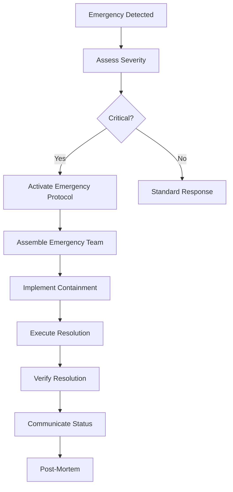
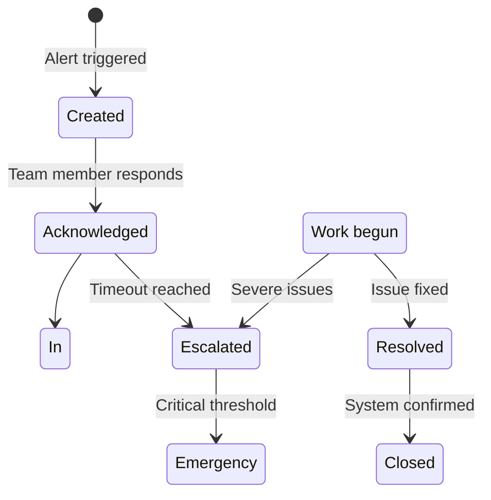
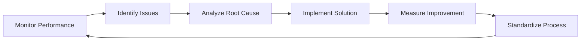

# 24/7 Support Operations Procedures

## Table of Contents
1. [Support Team Structure](#1-support-team-structure)
2. [Shift Rotation Coverage](#2-shift-rotation-coverage)
3. [On-Call Responsibilities](#3-on-call-responsibilities)
4. [Handover Procedures](#4-handover-procedures)
5. [Emergency Response Protocols](#5-emergency-response-protocols)
6. [Communication Channels](#6-communication-channels)
7. [Alert Management](#7-alert-management)
8. [Workload Management](#8-workload-management)
9. [Quality Assurance](#9-quality-assurance)
10. [Continuous Operations](#10-continuous-operations)

## 1. Support Team Structure

### 1.1 Global Support Organization

```
Global Head of Support (24/7)
├── Regional Managers (x4)
│   ├── Tier 1 Team Leads
│   ├── Tier 2 Team Leads
│   ├── Tier 3 Engineers
│   └── Tier 4 Architects
└── Central Operations
    ├── On-Call Coordinator
    ├── Quality Assurance Lead
    ├── Training Specialist
    └── Process Improvement Lead
```

### 1.2 Role Definitions

| Role | Responsibilities | Qualifications |
|------|-----------------|----------------|
| Tier 1 Support Agent | Initial contact, basic troubleshooting, ticket creation | 2+ years support experience |
| Tier 2 Engineer | Advanced troubleshooting, complex issue resolution | 4+ years Erlang experience |
| Tier 3 Engineer | Core system expert, incident handling | 6+ years OTP development |
| Tier 4 Architect | Strategic support, architectural guidance | 10+ years distributed systems |
| On-Call Coordinator | Shift management, emergency response | Leadership experience |
| Quality Assurance | Review quality, training, metrics tracking | Quality management background |

## 2. Shift Rotation Coverage

### 2.1 Shift Schedules

| Region | Shift 1 | Shift 2 | Shift 3 | Coverage |
|--------|---------|---------|---------|----------|
| Americas | 6AM-2PM PST | 2PM-10PM PST | 10PM-6AM PST | 24/7 |
| Europe | 8AM-4PM GMT | 4PM-12AM GMT | 12AM-8AM GMT | 24/7 |
| APAC | 8AM-4PM SGT | 4PM-12AM SGT | 12AM-8AM SGT | 24/7 |
| LATAM | 8AM-4PM BRT | 4PM-12AM BRT | 12AM-8AM BRT | 24/7 |

### 2.2 Rotation Pattern

- **Standard Rotation**: 5 days day shift → 2 days swing → 5 nights → 9 days off
- **Emergency Rotation**: On-call rotation with 24-hour coverage
- **Weekend Coverage**: Every third weekend with additional compensation
- **Holiday Coverage**: Shared responsibility with premium pay

### 2.3 Staffing Requirements

| Time Period | Minimum Staffing | Additional Coverage |
|------------|------------------|-------------------|
| Business Hours (9AM-5PM local) | 10 agents | 2 managers |
| Extended Hours (5AM-9AM, 5PM-10PM) | 6 agents | 1 manager |
| Night Hours (10PM-5AM) | 3 agents | 1 on-call |
| Weekends | 4 agents | 1 manager |
| Holidays | 2 agents | 1 manager |

## 3. On-Call Responsibilities

### 3.1 On-Call Rotation

```erlang
% On-Call Assignment Logic
assign_on_call() ->
    % Priority order for escalation:
    % 1. Primary engineer (current region)
    % 2. Backup engineer (same region)
    % 3. Global on-call
    % 4. Engineering lead
    case get_primary_on_call() of
        undefined ->
            escalate_to_backup();
        Pid when is_pid(Pid) ->
            {ok, Pid}
    end.

% Escalation Timer
escalation_timer() ->
    % Escalate if not acknowledged within:
    % - P1: 15 minutes
    % - P2: 30 minutes
    % - P3: 60 minutes
    case get_severity() of
        p1 -> timer:minutes(15);
        p2 -> timer:minutes(30);
        p3 -> timer:minutes(60)
    end.
```

### 3.2 On-Call Duties

- **Monitoring**: Review dashboard alerts every 30 minutes
- **Response**: Acknowledge alerts within 5 minutes
- **Investigation**: Begin diagnostic procedures immediately
- **Escalation**: Escalate to appropriate tier if needed
- **Communication**: Keep stakeholders informed of progress
- **Documentation**: Document all actions and findings

### 3.3 On-Call Checklist

```markdown
## Pre-Shift Checklist
- [ ] Review previous shift handover notes
- [ ] Check alert thresholds and configuration
- [ ] Verify contact information is up-to-date
- [ ] Test communication channels
- [ ] Review active incidents and their status
- [ ] Check staff availability and backup coverage

## During Shift
- [ ] Monitor all alert channels
- [ ] Acknowledge alerts within 5 minutes
- [ ] Document all investigations and actions
- [ ] Maintain communication logs
- [ ] Track SLA compliance
- [ ] Escalate when thresholds are met

## Post-Shift
- [ ] Complete incident documentation
- [ ] Update ticketing system with resolution details
- [ ] Hand over to next shift with status summary
- [ ] Review personal performance metrics
- [ ] Submit shift report
```

## 4. Handover Procedures

### 4.1 Shift Handover Template

```markdown
# Shift Handover Report - [Shift Date]

## Active Incidents
- [Incident ID]: [Status], [Updated], [Owner]
- [Incident ID]: [Status], [Updated], [Owner]

## System Health
- Registry: [Status]
- Transports: [Status]
- Sessions: [Status]
- Alerts: [Count] active

## Upcoming Maintenance
- [Task]: [Scheduled Time], [Duration]
- [Task]: [Scheduled Time], [Duration]

## Staffing
- On-Call: [Name]
- Available: [List]
- Unavailable: [Reasons]

## Notes
- [Important information]
- [Known issues]
- [Customer concerns]
```

### 4.2 Handover Process

1. **Preparation**:
   - Complete all active ticket updates
   - Document incident status
   - Review system health

2. **Meeting**:
   - 30-minute overlap between shifts
   - Face-to-face or video conference
   - Review all critical items

3. **Verification**:
   - Confirm understanding of all issues
   - Test communication channels
   - Update on-call information

4. **Closure**:
   - Sign off in ticketing system
   - Document handover completion
   - Trigger shift change notification

### 4.3 Handover Checklist

```markdown
## Technical Handover
- [ ] All incidents documented with current status
- [ ] System health confirmed and documented
- [ ] Configuration changes communicated
- [ ] Performance metrics reviewed
- [ ] Backup systems tested

## Operational Handover
- [ ] Staffing levels accurate
- [ ] Emergency contacts verified
- [ ] Communication channels tested
- [ ] Alert confirmations set
- [ ] Escalation paths confirmed

## Customer Handover
- [ ] High-priority customers notified
- [ ] SLA status communicated
- [ ] Known issues documented
- [ ] Upcoming maintenance scheduled
- [ ] Customer expectations set
```

## 5. Emergency Response Protocols

### 5.1 Emergency Classification

| Emergency Type | Response Team | Communication Protocol |
|----------------|--------------|----------------------|
| System Outage | Tier 3 + On-Call | Page all, executive alert |
| Security Breach | Security Team + Tier 4 | Dedicated channel, legal notification |
| Data Loss | DBA + Tier 4 | Customer notification, backup recovery |
| Natural Disaster | Regional Manager + Operations | Global coordination, relocation plan |
| Personnel Emergency | HR + Regional Manager | Support coverage, employee assistance |

### 5.2 Emergency Response Flow



### 5.3 Emergency Communication Chain

1. **Internal Alert** (0 minutes):
   - Emergency notification system
   - Immediate team assembly

2. **Stakeholder Alert** (15 minutes):
   - Management notification
   - Customer status update

3. **Executive Alert** (30 minutes):
   - C-suite notification
   - Board brief if necessary

4. **Customer Notification** (60 minutes):
   - Customer status portal
   - Direct communication for VIPs

5. **Public Communication** (As needed):
   - Status page updates
   - Social media announcements

## 6. Communication Channels

### 6.1 Channel Matrix

| Channel | Purpose | Response Time | Availability |
|---------|---------|---------------|--------------|
| Slack | Team collaboration | Immediate | Business Hours |
| Microsoft Teams | Cross-team coordination | < 5 min | 24/7 |
| PagerDuty | Emergency alerts | < 1 min | 24/7 |
| Phone | Direct communication | < 15 min | 24/7 |
| Email | Detailed communication | < 4 hours | 24/7 |
| SMS | Critical notifications | < 1 min | 24/7 |
| Webex | Video conferences | < 10 min | 24/7 |

### 6.2 Channel Usage Guidelines

```yaml
Channel Usage Rules:
  Slack:
    - Daily standups
    - Team collaboration
    - Non-urgent alerts
    - Knowledge sharing

  PagerDuty:
    - P1/P2 incidents only
    - Emergency alerts
    - Escalation triggers
    - Acknowledgment required

  Phone:
    - VIP customer calls
    - Emergency situations
    - Complex discussions
    - Crisis management

  Email:
    - Formal communication
    - Documentation updates
    - Customer follow-ups
    - Process notifications

  Teams:
    - Cross-team meetings
    - Screen sharing
    - Presentations
    - Training sessions
```

### 6.3 Communication Etiquette

1. **Professionalism**:
   - Use professional language
   - Maintain appropriate tone
   - Avoid internal jargon with customers

2. **Response Time**:
   - Acknowledge messages within 5 minutes
   - Provide status updates every 30 minutes for active issues
   - Set clear expectations for response times

3. **Clarity**:
   - Be concise but thorough
   - Use clear subject lines
   - Include relevant context
   - Avoid ambiguous language

## 7. Alert Management

### 7.1 Alert Lifecycle



### 7.2 Alert Prioritization

| Priority | Response Time | Escalation Time | Actions Required |
|----------|---------------|----------------|------------------|
| P1 (Critical) | < 15 minutes | < 30 minutes | Full team activation |
| P2 (High) | < 1 hour | < 2 hours | Tier 2 + escalation |
| P3 (Medium) | < 4 hours | < 8 hours | Tier 1 + Tier 2 |
| P4 (Low) | < 8 hours | < 24 hours | Tier 1 only |

### 7.3 Alert Handling Procedure

1. **Alert Receipt**:
   - System notification received
   - Automatic acknowledgment required
   - Alert details logged

2. **Initial Assessment**:
   - Check alert severity
   - Verify system impact
   - Determine appropriate response

3. **Response Activation**:
   - Notify relevant team
   - Create support ticket
   - Begin diagnostic procedures

4. **Escalation Process**:
   - Monitor response times
   - Escalate if thresholds exceeded
   - Communicate with stakeholders

5. **Resolution**:
   - Implement solution
   - Verify fix effectiveness
   - Document resolution

### 7.4 Alert Fatigue Prevention

```yaml
Fatigue Mitigation:
  Alert Throttling:
    - Limit alerts per time window
    - Batch similar alerts
    - Implement suppression rules

  Alert Prioritization:
    - Dynamic thresholds based on impact
    - Context-aware alerting
    - User-defined suppression

  Alert Management:
    - Regular review of alert rules
    - Alert effectiveness metrics
    - Continuous optimization
```

## 8. Workload Management

### 8.1 Workload Balancing

| Factor | Consideration | Balancing Strategy |
|--------|--------------|-------------------|
| Ticket Volume | Peak hours vs. off-peak | Staff level adjustments |
| Skill Distribution | Complex vs. simple tickets | Load balancing rules |
| Customer Priority | Enterprise vs. standard | Priority routing |
| Time Zones | Global coverage shift planning | Regional rotation |

### 8.2 Capacity Planning

```erlang
% Capacity Planning Algorithm
calculate_capacity() ->
    % Consider current workload, forecasted demand,
    % staff availability, and skill requirements
    CurrentLoad = get_current_ticket_volume(),
    Forecasted = predict_ticket_volume(),
    AvailableStaff = get_available_staff(),
    SkillRequirements = map_skill_to_tickets(),

    RequiredStaff = calculate_required_staff(
        CurrentLoad + Forecasted,
        SkillRequirements
    ),

    case RequiredStaff > AvailableStaff of
        true -> trigger_hiring_alert();
        false -> adequate_coverage
    end.
```

### 8.3 Staff Utilization

| Utilization Level | Target | Actions |
|-------------------|--------|---------|
| 70-80% | Optimal | Maintain current staffing |
| 80-90% | High | Consider temporary help |
| 90%+ | Critical | Emergency measures |
| <70% | Low | Adjust staffing down |

### 8.4 Burnout Prevention

1. **Workload Monitoring**:
   - Track hours worked
   - Monitor vacation usage
   - Check overtime levels

2. **Well-being Programs**:
   - Mental health resources
   - Flexible scheduling
   - Regular breaks

3. **Team Health**:
   - Monthly morale check-ins
   - Team building activities
   - Recognition programs

## 9. Quality Assurance

### 9.1 Quality Metrics

| Metric | Target | Measurement Method |
|--------|--------|-------------------|
| First Contact Resolution | ≥ 85% | Ticket analysis |
| Customer Satisfaction | ≥ 90% | Post-interaction surveys |
| Response Time | < 15 min | Ticketing system |
| Resolution Accuracy | ≥ 95% | Quality audits |
| Knowledge Usage | ≥ 70% | Analytics platform |

### 9.2 Quality Review Process

```yaml
Quality Review Steps:
  1. Sample Collection:
     - Random ticket selection
     - High-priority incident review
     - Customer complaints

  2. Evaluation Criteria:
     - Technical accuracy
     - Communication clarity
     - Resolution effectiveness
     - Customer focus
     - Documentation quality

  3. Feedback Loop:
     - Individual coaching
     - Team training updates
     - Process improvements
     - Knowledge base updates
```

### 9.3 Continuous Quality Improvement

1. **Weekly Reviews**:
   - Team performance metrics
   - Quality score trends
   - Action item tracking

2. **Monthly Audits**:
   - Process compliance check
   - Documentation review
   - Training effectiveness

3. **Quarterly Assessments**:
   - Quality goal achievement
   - Process optimization
   - Training plan updates

## 10. Continuous Operations

### 10.1 Business Continuity Planning

| Threat | Response Plan | Recovery Time |
|--------|--------------|---------------|
| Data Center Failure | Failover to secondary | < 2 hours |
| Network Outage | Backup connectivity | < 1 hour |
| Power Failure | Generator backup | < 30 minutes |
| Staff Shortage | Cross-training coverage | Immediate |
| Software Failure | Rollback procedures | < 1 hour |

### 10.2 Disaster Recovery Procedures

```yaml
Disaster Recovery Levels:
  1. Site Failure:
     - Activate secondary data center
     - Redirect traffic
     - Maintain service continuity

  2. Regional Outage:
     - Activate alternative region
     - Customer communication
     - Service restoration

  3. Global Crisis:
     - Minimal service mode
     - Critical functions only
     - Customer prioritization
```

### 10.3 Resilience Testing

1. **Scheduled Tests**:
   - Monthly failover drills
   - Quarterly disaster simulations
   - Annual comprehensive testing

2. **Unannounced Tests**:
   - Random disruption scenarios
   - Team response evaluation
   - Process validation

3. **Test Scenarios**:
   - Partial system failure
   - Complete site loss
   - Network partition
   - Data corruption

### 10.4 Continuous Improvement Cycle



## 11. Performance Metrics Dashboard

### 11.1 Real-time Metrics

```json
{
  "current_status": {
    "active_tickets": 45,
    "open_incidents": 2,
    "on_call_staff": 3,
    "system_health": "green",
    "response_time": 12.5,
    "resolution_rate": 88.3
  },
  "team_performance": {
    "tier1_utilization": 75.2,
    "tier2_utilization": 82.1,
    "tier3_utilization": 45.8,
    "satisfaction_score": 92.4
  },
  "system_metrics": {
    "registry_throughput": 523000,
    "session_count": 12450,
    "error_rate": 0.02,
    "latency_p95": 45.6
  }
}
```

### 11.2 Reporting Schedule

| Report | Frequency | Audience |
|--------|----------|----------|
| Real-time Dashboard | Continuous | Support team |
| Daily Summary | 9 AM daily | Management |
| Weekly Review | Monday morning | Leadership |
| Monthly Report | 5th of month | Executive |
| Quarterly Review | End of quarter | Board |

## 12. Training and Certification

### 12.1 Onboarding Program

```yaml
Onboarding Phases:
  Phase 1 (Week 1):
    - Company culture and values
    - System architecture overview
    - Basic troubleshooting procedures
    - Communication protocols

  Phase 2 (Week 2):
    - Advanced system knowledge
    - Incident response procedures
    - Ticketing system mastery
    - Customer interaction skills

  Phase 3 (Week 3-4):
    - Shadow experienced agents
    - Handle low-priority tickets
    - Practice escalation procedures
    - Certification exam
```

### 12.2 Continuous Training

1. **Monthly Technical Updates**:
   - New feature training
   - System enhancements
   - Best practices

2. **Quarterly Skills Development**:
   - Advanced troubleshooting
   - Leadership training
   - Communication skills

3. **Annual Certification Renewal**:
   - Updated knowledge assessment
   - Practical skills demonstration
   - Continuing education requirements

## 13. Conclusion

These 24/7 support operations procedures ensure that erlmcp maintains continuous operational excellence while providing exceptional customer service. The structured approach to team management, emergency response, and continuous improvement enables us to deliver on our SLA commitments while adapting to changing business needs.

Regular review and updates to these procedures will ensure they remain effective as the business grows and technology evolves.