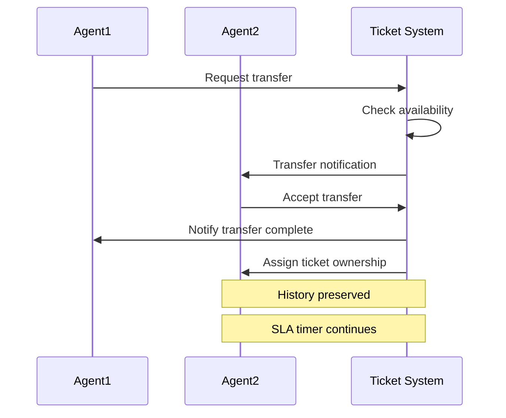
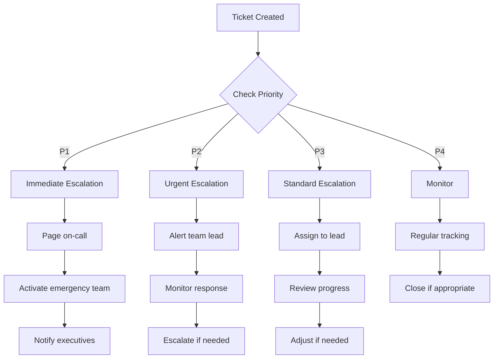

# Ticketing System Workflow for erlmcp v3

## Table of Contents
1. [Ticketing System Overview](#1-ticketing-system-overview)
2. [Ticket Lifecycle](#2-ticket-lifecycle)
3. [Ticket Creation and Routing](#3-ticket-creation-and-routing)
4. [Ticket Prioritization and Triage](#4-ticket-prioritization-and-triage)
5. [Assignment and Ownership](#5-assignment-and-ownership)
6. [Resolution Process](#6-resolution-process)
7. [Escalation Procedures](#7-escalation-procedures)
8. [SLA Management](#8-sla-management)
9. [Ticket Analytics and Reporting](#9-ticket-analytics-and-reporting)
10. [Quality Assurance](#10-quality-assurance)

## 1. Ticketing System Overview

### 1.1 System Architecture

```yaml
Ticketing System Stack:
  Platform: Zendesk Enterprise
  Integration:
    - CRM: Salesforce
    - Monitoring: Datadog
    - Communication: Slack/Teams
    - Knowledge Base: Custom KB
    - Email: Exchange/Gmail

  Features:
    - Automated routing
    - SLA tracking
    - Customer portal
    - Analytics dashboard
    - API for integrations
    - Custom fields and tags
    - Automation rules
    - Macros and templates

  Channels:
    - Email (support@erlmcp.com)
    - Web portal
    - Phone (1-800-ERLMCP-SUPPORT)
    - Chat (real-time)
    - API
    - Partner portals
```

### 1.2 Key Terminology

| Term | Definition |
|------|------------|
| **Ticket** | Individual support request with unique ID |
| **Priority** | P1-P4 classification based on impact |
| **SLA** | Service Level Agreement for response/resolution |
| **Agent** | Support team member handling tickets |
| **Queue** | Group of tickets waiting for assignment |
| **Escalation** | Moving ticket to higher priority/authority |
| **SLA Breach** | Failure to meet response/resolution time |
| **Meta-tag** | Custom field for categorization |

### 1.3 Access Control

| Role | Permissions | Access Level |
|------|-------------|--------------|
| **Agent** | View, assign, update, resolve tickets | All tickets |
| **Team Lead** | Manage team, escalations, SLA settings | Team + escalation |
| **Manager** | Team oversight, reporting, workflow design | Full access |
| **Admin** | System configuration, custom fields, integrations | Full system |
| **Customer** | View own tickets, submit requests | Limited view |

## 2. Ticket Lifecycle

### 2.1 Complete Lifecycle States

```mermaid
stateDiagram-v2
    [*] --> New: Ticket created
    New --> Open: Assigned to agent
    Open --> Pending: Waiting for customer
    Pending --> Open: Customer response received
    Open -> Escalated: Escalation triggered
    Escalated --> Open: Escalation resolved
    Open --> Solved: Resolution implemented
    Solved --> Closed: Customer confirmed
    Solved --> Reopened: Issue persists
    Reopened --> Open: Restart work
    Open --> Closed: Invalid/closed without resolution

    Closed --> Archived: After 30 days
    Archived --> Deleted: After 1 year
```

### 2.2 State Transitions

| From | To | Trigger | Required Action |
|------|----|---------|----------------|
| **New** | Open | Manual assignment | Assign to appropriate agent |
| **Open** | Pending | Need customer info | Notify customer, set expectation |
| **Pending** | Open | Customer reply | Acknowledge, continue work |
| **Open** | Solved | Resolution complete | Verify solution, notify customer |
| **Solved** | Closed | Customer confirmation | Document resolution |
| **Solved** | Reopened | Customer dissatisfaction | Investigate new information |
| **Reopened** | Open | Issue confirmed | Continue investigation |

### 2.3 State Descriptions

| State | Description | SLA Impact |
|-------|-------------|-----------|
| **New** | Ticket created, not yet assigned | Time starts counting |
| **Open** | Assigned to agent, work in progress | Active SLA timer |
| **Pending** | Waiting for customer information | SLA paused |
| **Escalated** | Elevated to higher priority | Accelerated SLA |
| **Solved** | Resolution implemented, awaiting confirmation | SLA complete |
| **Closed** | Final resolution, no further action | Complete |
| **Reopened** | Issue persists, requires more work | New SLA cycle |

## 3. Ticket Creation and Routing

### 3.1 Creation Channels

| Channel | Processing Method | Response Time |
|--------|-------------------|---------------|
| **Email** | Automatic parsing + routing | < 1 minute |
| **Web Portal** | Form submission + routing | < 1 minute |
| **Phone** | Agent creates + priority assignment | Immediate |
| **Chat** | Transcription + ticket creation | < 5 minutes |
| **API** | Direct integration + auto-routing | < 1 minute |
| **Partner Portal** | Custom routing + priority | < 2 minutes |

### 3.2 Auto-Routing Rules

```yaml
Routing Rules:
  By Product:
    erlmcp_core:
      - Registry issues -> Tier 2
      - Session issues -> Tier 2
      - Authentication -> Tier 1

    erlmcp_transports:
      - Transport layer -> Tier 2
      - Connection issues -> Tier 1
      - Configuration -> Tier 1

    erlmcp_observability:
      - Monitoring -> Tier 1
      - Metrics -> Tier 2
      - Dashboard -> Tier 1

  By Customer Tier:
    Enterprise:
      - Direct to Tier 2
      - Escalation path: 2 hours
    Premium:
      - Queue with priority
      - Escalation path: 4 hours
    Standard:
      - Regular queue
      - Escalation path: 8 hours
    Essential:
      - Standard queue
      - Escalation path: 24 hours

  By Language:
    English -> General queue
    Spanish -> Spanish-speaking agents
    French -> French-speaking agents
    Other -> Translation required
```

### 3.3 Ticket Template Structure

```json
{
  "ticket": {
    "id": "INC-2024-001234",
    "subject": "Registry performance degradation",
    "description": "Our system experiencing high latency...",
    "priority": "P2",
    "category": "Technical",
    "subcategory": "Performance",
    "product": "erlmcp_core",
    "customer": {
      "id": "CUST-001",
      "tier": "Enterprise",
      "contract": "E-2024-001"
    },
    "metadata": {
      "environment": "production",
      "version": "3.0.1",
      "affected_components": ["registry", "sessions"],
      "error_code": "REG_001",
      "duration": "2 hours"
    },
    "attachments": [
      {
        "filename": "logs.zip",
        "size": "2.3MB",
        "type": "application/zip"
      }
    ]
  }
}
```

## 4. Ticket Prioritization and Triage

### 4.1 Priority Matrix

| Impact | Urgency | Priority | Examples |
|--------|---------|----------|----------|
| **Critical** | Critical | P1 | System-wide outage, data loss |
| **Major** | High | P2 | Performance degradation, SLA breach |
| **Moderate** | Medium | P3 | Feature not working, partial issue |
| **Minor** | Low | P4 | UI bug, documentation question |

### 4.2 Triage Process

```erlang
% Ticket Triage Module
-module(erlmcp_ticket_triage).
-export([triage_ticket/1, calculate_priority/2]).

triage_ticket(Ticket) ->
    % Extract ticket details
    Impact = assess_impact(Ticket),
    Urgency = assess_urgency(Ticket),

    % Calculate priority
    Priority = calculate_priority(Impact, Urgency),

    % Apply business rules
    FinalPriority = apply_business_rules(Ticket, Priority),

    % Assign appropriate queue
    Queue = determine_queue(FinalPriority, Ticket),

    #{
        original_priority => Priority,
        final_priority => FinalPriority,
        impact => Impact,
        urgency => Urgency,
        queue => Queue,
        estimated_resolution_time => estimate_resolution_time(FinalPriority)
    }.

assess_impact(Ticket) ->
    case Ticket#metadata.affected_customers of
        undefined -> calculate_from_description(Ticket);
        Count when Count > 1000 -> critical;
        Count when Count > 100 -> major;
        Count when Count > 10 -> moderate;
        _ -> minor
    end.

calculate_priority(Impact, Urgency) ->
    % Priority matrix calculation
    case {Impact, Urgency} of
        {critical, critical} -> p1;
        {critical, _} -> p2;
        {major, critical} -> p1;
        {major, high} -> p2;
        {major, _} -> p3;
        {moderate, critical} -> p2;
        {moderate, high} -> p3;
        {moderate, _} -> p4;
        {minor, _} -> p4
    end.
```

### 4.3 Triage Automation

| Automation Trigger | Action | Example |
|-------------------|--------|---------|
| Keyword detection | Auto-tag and route | "emergency" -> P1 flag |
| Customer tier | Auto-escalation | Enterprise -> direct Tier 2 |
| Repeat issues | Auto-deduplication | Similar tickets grouped |
| SLA breach | Auto-escalation | Response time exceeded |
| High volume time | Load balancing | Distribute across teams |

## 5. Assignment and Ownership

### 5.1 Assignment Strategies

| Strategy | Use Case | Algorithm |
|----------|----------|----------|
| **Round Robin** | Even distribution | Cycle through team |
| **Skill-based** | Technical specialization | Match skills to issue |
| **Load Balancing** | Workload optimization | Assign least busy |
| **Escalation** | High-priority tickets | Predefined path |
| **Customer Assignment** | VIP customers | Dedicated agent |

### 5.2 Assignment Rules

```yaml
Assignment Rules:
  Tier 1 Tickets:
    - All new tickets enter Tier 1 queue
    - Auto-assign based on load (≤ 5 tickets active)
    - Timeout after 30 minutes: reassign

  Tier 2 Tickets:
    - Escalated from Tier 1
    - Skill-based routing:
      - Registry issues -> Registry specialists
      - Transport issues -> Transport team
      - Performance -> Performance engineers

  Escalated Tickets:
    - P1: Any available Tier 2/3
    - P2: Escalation path defined
    - Time-based: Auto-escalate if not handled

  After Hours:
    - On-call rotation
    - P1/P2 only auto-assignment
    - P3/P4 queued for next shift
```

### 5.3 Ownership Transfer



## 6. Resolution Process

### 6.1 Resolution Steps

| Step | Description | Tools Required | SLA Impact |
|------|-------------|---------------|-----------|
| **1. Acknowledge** | Confirm receipt, set expectations | Communication | Response time |
| **2. Diagnose** | Investigate root cause | Monitoring, logs | Work time |
| **3. Resolve** | Implement solution | Development tools | Resolution time |
| **4. Verify** | Test solution | Testing environment | Verification |
| **5. Communicate** | Notify customer of resolution | CRM, email | Customer satisfaction |
| **6. Document** | Record solution in KB | Knowledge base | Knowledge base |

### 6.2 Resolution Workflow

```erlang
% Resolution Process Module
-module(erlmcp_resolution).
-export([handle_ticket/1, resolve_ticket/2]).

handle_ticket(Ticket) ->
    % Step 1: Acknowledge
    ack_ticket(Ticket),

    % Step 2: Diagnose
    Diagnosis = diagnose_issue(Ticket),

    case Diagnosis#severity of
        critical -> escalate(Ticket);
        high -> proceed_with_resolution(Ticket, Diagnosis);
        medium -> proceed_with_resolution(Ticket, Diagnosis);
        low -> proceed_with_resolution(Ticket, Diagnosis)
    end.

proceed_with_resolution(Ticket, Diagnosis) ->
    % Step 3: Implement resolution
    Resolution = implement_resolution(Ticket, Diagnosis),

    % Step 4: Verify
    Verification = verify_resolution(Resolution),

    % Step 5: Update ticket
    UpdatedTicket = update_ticket(Ticket, Resolution, Verification),

    % Step 6: Communicate
    communicate_resolution(Ticket, Resolution),

    UpdatedTicket.

implement_resolution(Ticket, Diagnosis) ->
    case Diagnosis#type of
        configuration -> apply_configuration_fix(Ticket);
        bug -> deploy_bug_fix(Ticket);
        performance -> optimize_performance(Ticket);
        other -> custom_resolution(Ticket)
    end.
```

### 6.3 Resolution Templates

#### 6.3.1 Resolution Note Template

```markdown
## Resolution Summary

**Issue**: [Brief description of the problem]
**Root Cause**: [What caused the issue]
**Solution Implemented**: [What was done to fix it]
**Verification**: [How the fix was verified]

## Steps Taken
1. [Step 1 description]
2. [Step 2 description]
3. [Step 3 description]

## Additional Information
- Affected customers: [Number]
- Downtime experienced: [Duration]
- Preventive measures: [What was put in place]

## Related Tickets
- [INC-XXXX] Similar issue
- [KB-XXXX] Knowledge base article
```

#### 6.3.2 Customer Communication Template

```
Subject: Your Support Ticket [INC-XXXX] Has Been Resolved

Dear [Customer Name],

We're pleased to inform you that your support ticket regarding [Issue Description] has been resolved.

Summary:
- Issue: [Brief description]
- Resolution: [What was fixed]
- Time to resolve: [Duration]

Our team has implemented [Solution Details] to resolve this issue.

If you experience any further issues with this matter, please don't hesitate to reply to this email or contact us directly.

Thank you for your patience while we worked to resolve this.

Sincerely,
The erlmcp Support Team
```

## 7. Escalation Procedures

### 7.1 Escalation Triggers

| Trigger Condition | Escalation Level | Action Required |
|-------------------|------------------|----------------|
| **P1 Ticket Created** | Level 1 - Immediate | Alert manager, page on-call |
| **Response Time > Threshold** | Level 2 - Urgent | Move to priority queue |
| **SLA Breach Imminent** | Level 3 - Critical | Notify executive team |
| **Customer Complaint** | Level 4 - Executive | CEO involvement |
| **Repeated Issues** | Level 5 - Strategic | Root cause team |

### 7.2 Escalation Paths

```yaml
Escalation Paths:
  P1 - Critical:
    Agent (15 min) → Team Lead (30 min) → Manager (1 hour) → Director (2 hours)
    Actions: Full team activation, executive notification

  P2 - High:
    Agent (1 hour) → Team Lead (2 hours) → Manager (4 hours)
    Actions: Cross-team assistance, SLA management

  P3 - Medium:
    Agent (4 hours) → Team Lead (8 hours)
    Actions: Review process, resource allocation

  P4 - Low:
    Agent (8 hours) → Review if not resolved (24 hours)
    Actions: Batch processing, improvement planning
```

### 7.3 Escalation Workflow



## 8. SLA Management

### 8.1 SLA Definitions

| Service Tier | Response Time | Resolution Time | Business Hours |
|--------------|---------------|-----------------|----------------|
| **Enterprise** | 1 hour | 12 hours | 9AM-5PM local |
| **Premium** | 2 hours | 24 hours | 9AM-5PM local |
| **Standard** | 4 hours | 48 hours | 9AM-5PM local |
| **Essential** | 8 hours | 72 hours | 9AM-5PM local |

### 8.2 SLA Tracking

```erlang
% SLA Tracking Module
-module(erlmcp_sla_tracker).
-export([check_sla/1, calculate_breach/2]).

check_sla(Ticket) ->
    % Get SLA requirements for customer tier
    SLA = get_customer_sla(Ticket#customer.tier),

    % Calculate current metrics
    ResponseTime = calculate_response_time(Ticket),
    ResolutionTime = calculate_resolution_time(Ticket),

    % Check for breaches
    ResponseBreach = check_response_breach(ResponseTime, SLA#response_time),
    ResolutionBreach = check_resolution_breach(ResolutionTime, SLA#resolution_time),

    % Generate report
    Report = generate_sla_report(Ticket, SLA, ResponseTime, ResolutionTime,
                              ResponseBreach, ResolutionBreach),

    Report.

generate_sla_report(Ticket, SLA, ResponseTime, ResolutionTime, ResponseBreach, ResolutionBreach) ->
    #{
        ticket_id => Ticket#id,
        customer_tier => Ticket#customer.tier,
        sla_response_time => SLA#response_time,
        actual_response_time => ResponseTime,
        response_breach => ResponseBreach,
        sla_resolution_time => SLA#resolution_time,
        actual_resolution_time => ResolutionTime,
        resolution_breach => ResolutionBreach,
        sla_status => calculate_sla_status(ResponseBreach, ResolutionBreach),
        next_steps => determine_next_steps(ResponseBreach, ResolutionBreach)
    }.
```

### 8.3 SLA Violation Handling

| Violation Type | Action | Communication |
|----------------|--------|---------------|
| **Response Time Breach** | Auto-escalation, SLA alert | Customer notification |
| **Resolution Time Breach** | Escalation, credit consideration | Executive alert |
| **Repeated Breach** | Review SLA terms, customer meeting | Strategic review |
| **System-wide Breach** | Emergency procedures, status updates | Public communication |

## 9. Ticket Analytics and Reporting

### 9.1 Key Metrics Dashboard

```json
{
  "ticket_metrics": {
    "current_status": {
      "open_tickets": 234,
      "pending_tickets": 45,
      "escalated_tickets": 12,
      "sla_breaches": 3
    },
    "performance": {
      "avg_response_time": 2.3,
      "avg_resolution_time": 18.7,
      "first_contact_resolution": 68,
      "customer_satisfaction": 4.2
    },
    "volume": {
      "daily": 87,
      "weekly": 523,
      "monthly": 2103,
      "peak_hours": ["9-10", "14-15"]
    },
    "trends": {
      "week_over_week": 12.3,
      "month_over_month": 8.7,
      "projection_next_week": 92
    }
  }
}
```

### 9.2 Report Types and Schedules

| Report Type | Frequency | Purpose | Audience |
|-------------|----------|---------|----------|
| **Real-time Dashboard** | Continuous | Operational overview | Support team |
| **Daily Summary** | 6:00 AM | Day's performance | Team leads |
| **Weekly Analysis** | Monday 9:00 AM | Trends and patterns | Management |
| **Monthly Review** | 1st of month | Strategic insights | Executives |
| **SLA Report** | Monthly | SLA compliance | All customers |
| **Customer Satisfaction** | Monthly | Quality assessment | Product team |

### 9.3 Analytics Features

1. **Predictive Analytics**:
   - Ticket volume forecasting
   - Resource planning
   - Potential SLA breaches

2. **Root Cause Analysis**:
   - Common issue patterns
   - Systemic problems
   - Knowledge gaps

3. **Performance Optimization**:
   - Agent productivity metrics
   - Process bottlenecks
   - Customer satisfaction drivers

## 10. Quality Assurance

### 10.1 Quality Checks

| Check Type | Frequency | Method |
|------------|----------|--------|
| **Ticket Review** | 10% random sample | Peer review |
| **Resolution Quality** | Monthly | Expert panel |
| **Customer Follow-up** | All solved tickets | Automated survey |
| **Process Compliance** | Weekly | Audit tool |
| **SLA Compliance** | Daily | Automated checks |

### 10.2 Quality Metrics

| Metric | Target | Measurement Method |
|--------|--------|-------------------|
| **Resolution Accuracy** | > 95% | Follow-up surveys |
| **First Contact Resolution** | > 80% | Ticket analysis |
| **Customer Satisfaction** | > 90% | Post-interaction surveys |
| **Knowledge Usage** | > 70% | Analytics tracking |
| **Process Compliance** | > 95% | Audit reports |

### 10.3 Continuous Improvement

1. **Monthly Quality Reviews**:
   - Analyze failed tickets
   - Identify improvement opportunities
   - Update procedures and templates

2. **Quarterly Process Optimization**:
   - Review workflows
   - Implement automation
   - Update training materials

3. **Annual System Enhancement**:
   - Major workflow improvements
   - New feature implementations
   - Platform upgrades

## 11. Conclusion

This ticketing system workflow provides a structured approach to managing support requests from creation to resolution. By following these procedures, the support team can ensure consistent service delivery, maintain SLA compliance, and continuously improve the customer experience.

Regular monitoring of metrics, continuous training, and process optimization will ensure the ticketing system remains effective as business needs evolve and customer expectations increase.