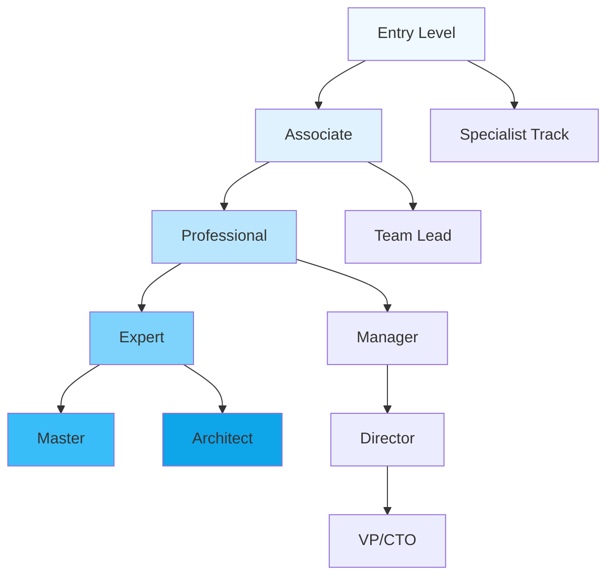

# Training and Certification Program for erlmcp v3

## Table of Contents
1. [Program Overview](#1-program-overview)
2. [Training Philosophy](#2-training-philosophy)
3. [Career Path Framework](#3-career-path-framework)
4. [Certification Levels](#4-certification-levels)
5. [Curriculum Structure](#5-curriculum-structure)
6. [Training Delivery Methods](#6-training-delivery-methods)
7. [Assessment and Testing](#7-assessment-and-testing)
8. [Training Materials](#8-training-materials)
9. [Trainer Certification](#9-trainer-certification)
10. [Continuous Learning](#10-continuous-learning)
11. [Program Management](#11-program-management)

## 1. Program Overview

### 1.1 Program Vision

"To develop world-class erlmcp professionals through comprehensive training and rigorous certification, ensuring excellence in system administration, development, and support."

### 1.2 Target Audience

| Audience | Role | Training Focus |
|----------|------|---------------|
| **System Administrators** | Managing erlmcp deployments | Operations, monitoring, troubleshooting |
| **Developers** | Building on erlmcp platform | API development, extensions, integration |
| **Support Engineers** | Customer support and troubleshooting | Issue resolution, communication, SLAs |
| **DevOps Engineers** | CI/CD and automation | Deployment, scaling, infrastructure |
| **Architects** | System design and planning | Architecture, best practices, optimization |
| **Managers** | Team and project management | Leadership, metrics, processes |

### 1.3 Program Goals

1. **Standardize Knowledge**: Ensure consistent knowledge across all teams
2. **Build Expertise**: Develop deep technical expertise in erlmcp
3. **Improve Quality**: Enhance service quality through certified professionals
4. **Career Development**: Clear career progression paths
5. **Customer Success**: Improve customer satisfaction through skilled support

## 2. Training Philosophy

### 2.1 Learning Principles

1. **Learn by Doing**: Hands-on labs and real-world scenarios
2. **Progressive Learning**: Start simple, advance to complex
3. **Continuous Improvement**: Regular updates based on feedback
4. **Community Learning**: Foster peer-to-peer knowledge sharing
5. **Outcome-Based**: Focus on real-world skills and competencies

### 2.2 Training Methodologies

| Method | Description | Benefits |
|--------|-------------|----------|
| **Instructor-Led** | Live virtual or in-person training | Interactive, real-time feedback |
| **Self-Paced** | Online modules, videos | Flexible, learn at your own pace |
| **Blended Learning** | Combination of methods | Best of both worlds |
| **Hands-on Labs** | Practical exercises | Build real skills |
| **Mentorship** | One-on-one guidance | Personalized learning |
| **Peer Learning** | Team-based activities | Collaborative problem-solving |

### 2.3 Competency Framework

| Competency Area | Levels | Focus Areas |
|-----------------|--------|-------------|
| **Technical Knowledge** | Beginner to Expert | System architecture, APIs, operations |
| **Problem Solving** | Basic to Advanced | Troubleshooting, debugging |
| **Communication** | Foundation to Mastery | Customer interaction, technical writing |
| **Leadership** | Emerging to Strategic | Team management, project leadership |
| **Innovation** | Learner to Innovator | Process improvement, automation |

## 3. Career Path Framework

### 3.1 Career Progression Map



### 3.2 Role Descriptions

| Role | Experience Level | Key Responsibilities |
|------|-----------------|---------------------|
| **Erlang Support Associate** | 0-1 years | Basic troubleshooting, ticket handling |
| **Erlang Support Engineer** | 1-3 years | Advanced troubleshooting, complex issues |
| **Senior Support Engineer** | 3-5 years | Escalated issues, mentorship |
| **Support Team Lead** | 5+ years | Team management, process improvement |
| **Support Manager** | 5+ years | Operations, strategy, leadership |
| **Technical Architect** | 8+ years | System design, technical strategy |

### 3.3 Skill Matrix

| Skill Level | System Administration | Development | Support | Architecture |
|-------------|----------------------|-------------|---------|--------------|
| **Associate** | Basic installation | Simple scripts | Ticket handling | Basic concepts |
| **Professional** | Configuration, monitoring | API usage | Troubleshooting | Design patterns |
| **Expert** | Optimization, security | Extensions, plugins | Complex issues | System design |
| **Master** | Advanced operations | Core contributions | Training, mentoring | Enterprise architecture |
| **Architect** | Infrastructure design | Framework development | Technical leadership | Strategic planning |

## 4. Certification Levels

### 4.1 Certification Path

```yaml
Certification Hierarchy:
  Associate Level:
    - Erlang Support Associate (ESA)
    - Erlang Operations Associate (EOA)
    - Erlang Developer Associate (EDA)

  Professional Level:
    - Certified Erlang Support Professional (CESP)
    - Certified Erlang Operations Professional (CEOP)
    - Certified Erlang Developer Professional (CEDP)

  Expert Level:
    - Certified Erlang Support Expert (CESE)
    - Certified Erlang Operations Expert (CEOE)
    - Certified Erlang Developer Expert (CEDE)

  Master Level:
    - Certified Erlang Master (CEM)
    - Master Trainer (MT)
    - Solutions Architect (SA)
```

### 4.2 Certification Requirements

| Level | Experience | Training | Exam | Project | Renewal |
|-------|------------|---------|------|--------|---------|
| **Associate** | 0-1 years | 40 hours | 70% | None | 2 years |
| **Professional** | 1-3 years | 80 hours | 80% | Practical case | 3 years |
| **Expert** | 3-5 years | 120 hours | 85% | Real project | 3 years |
| **Master** | 5+ years | 160 hours | 90% | Major project | 5 years |

### 4.3 Exam Details

#### 4.3.1 Exam Structure

```python
class CertificationExam:
    def __init__(self, exam_type):
        self.exam_type = exam_type
        self.duration = self.get_duration()
        self.questions = self.generate_questions()
        self.scoring = self.get_scoring_method()

    def get_duration(self):
        durations = {
            'associate': 90,      # 1.5 hours
            'professional': 120,  # 2 hours
            'expert': 180,       # 3 hours
            'master': 240        # 4 hours
        }
        return durations[self.exam_type]

    def generate_questions(self):
        # Generate question pool based on exam type
        question_types = {
            'associate': {
                'multiple_choice': 40,
                'true_false': 20,
                'short_answer': 10
            },
            'professional': {
                'multiple_choice': 30,
                'scenario_based': 20,
                'practical': 10
            },
            'expert': {
                'scenario_based': 30,
                'practical': 20,
                'essay': 10
            },
            'master': {
                'case_study': 40,
                'architecture_design': 20,
                'innovation_proposal': 10
            }
        }
        return question_types[self.exam_type]

    def get_scoring_method(self):
        return {
            'passing_score': self.get_passing_score(),
            'weighting': self.get_question_weighting(),
            'adjustment': self.get_difficulty_adjustment()
        }
```

#### 4.3.2 Practical Exam Components

```yaml
Practical Exam Components:
  Associate Level:
    - Installation and basic setup
    - Simple troubleshooting scenarios
    - API usage examples

  Professional Level:
    - Complex configuration tasks
    - Performance optimization exercises
    - Integration projects

  Expert Level:
    - Production environment troubleshooting
    - High availability setup
    - Security implementation

  Master Level:
    - Enterprise architecture design
    - Performance optimization for large scale
    - Innovation and process improvement
```

## 5. Curriculum Structure

### 5.1 Curriculum by Level

#### 5.1.1 Associate Level Curriculum

```yaml
Associate Curriculum (ESA - Erlang Support Associate):
  Duration: 40 hours
  Modules:
    - Module 1: Introduction to erlmcp (8 hours)
      - System overview
      - Core concepts
      - Installation basics
    - Module 2: Basic Operations (12 hours)
      - Starting/stopping systems
      - Basic monitoring
      - Log analysis
    - Module 3: User Interface (8 hours)
      - Web portal navigation
      - Basic troubleshooting
      - Knowledge base usage
    - Module 4: Fundamentals (12 hours)
      - Erlang basics
      - OTP concepts
      - JSON-RPC protocol

  Learning Outcomes:
    - Install and configure erlmcp
    - Perform basic operations
    - Troubleshoot common issues
    - Use the support portal
```

#### 5.1.2 Professional Level Curriculum

```yaml
Professional Curriculum (CESP - Certified Erlang Support Professional):
  Duration: 80 hours
  Modules:
    - Module 1: Advanced Operations (16 hours)
      - Performance tuning
      - Load balancing
      - High availability
    - Module 2: Troubleshooting Deep Dive (20 hours)
      - Complex issue resolution
      - Debug techniques
      - Root cause analysis
    - Module 3: Integration and APIs (16 hours)
      - API usage
      - Third-party integration
      - Custom development
    - Module 4: Security and Compliance (16 hours)
      - Security best practices
      - Compliance requirements
      - Auditing procedures
    - Module 5: Advanced Monitoring (12 hours)
      - Advanced metrics
      - Alert management
      - Performance analysis

  Learning Outcomes:
    - Optimize system performance
    - Resolve complex issues
    - Integrate with external systems
    - Implement security measures
```

#### 5.1.3 Expert Level Curriculum

```yaml
Expert Curriculum (CESE - Certified Erlang Support Expert):
  Duration: 120 hours
  Modules:
    - Module 1: Architecture Design (24 hours)
      - System architecture patterns
      - Scalability design
      - Fault tolerance
    - Module 2: Performance Optimization (24 hours)
      - Advanced performance tuning
      - Load testing
      - Bottleneck identification
    - Module 3: Large-Scale Operations (24 hours)
      - Multi-region deployment
      - Disaster recovery
      - Capacity planning
    - Module 4: Innovation and Improvement (24 hours)
      - Process optimization
      - Automation development
      - Research and development
    - Module 5: Leadership and Mentoring (24 hours)
      - Technical leadership
      - Training development
      - Team management

  Learning Outcomes:
    - Design enterprise architectures
    - Optimize large-scale systems
    - Drive technical innovation
    - Lead technical teams
```

### 5.2 Specialized Training Tracks

```yaml
Specialized Tracks:
  DevOps Track:
    - CI/CD pipeline integration
    - Infrastructure as code
    - Container orchestration
    - Automated testing

  Security Track:
    - Security fundamentals
    - Threat modeling
    - Incident response
    - Compliance frameworks

  Performance Track:
    - Performance monitoring
    - Load testing
    - Optimization techniques
    - Capacity planning

  Architecture Track:
    - System design patterns
    - Microservices architecture
    - Distributed systems
    - Scalability principles
```

## 6. Training Delivery Methods

### 6.1 Virtual Training Platform

```yaml
Virtual Training Platform:
  Features:
    - Live video streaming
    - Interactive whiteboards
    - Screen sharing
    - Breakout rooms
    - Polling and quizzes
    - Recording availability
    - Resource library

  Technical Requirements:
    - Minimum 10 Mbps internet
    - HD webcam
    - Headset with microphone
    - Dual monitor setup
    - Virtual lab access

  Accessibility:
    - Closed captioning
    - Sign language interpretation
    - Language translation
    - Screen reader compatibility
```

### 6.2 Hands-on Labs Environment

```dockerfile
# Training Lab Environment
FROM erlang:25.2-alpine

# Install erlmcp and dependencies
RUN apk add --no-cache git build-base

# Install training-specific tools
RUN git clone https://github.com/erlmcp/training-labs.git /labs

# Create training user
RUN adduser -D training

# Set up lab environment
COPY ./lab-setup.sh /lab-setup.sh
RUN chmod +x /lab-setup.sh

CMD ["/lab-setup.sh"]
```

### 6.3 Workshop Structure

```python
class TrainingWorkshop:
    def __init__(self, topic, duration, audience):
        self.topic = topic
        self.duration = duration  # in hours
        self.audience = audience
        self.agenda = self.create_agenda()

    def create_agenda(self):
        if self.topic == "erlmcp_operations":
            return [
                {"time": "09:00", "activity": "Introduction and Overview"},
                {"time": "09:30", "activity": "Architecture Deep Dive", "type": "presentation"},
                {"time": "10:30", "activity": "Installation Lab", "type": "hands-on"},
                {"time": "12:00", "activity": "Lunch Break"},
                {"time": "13:00", "activity": "Performance Tuning Lab", "type": "hands-on"},
                {"time": "14:30", "activity": "Troubleshooting Workshop", "type": "group"},
                {"time": "15:30", "activity": "Q&A Session"},
                {"time": "16:00", "activity": "Wrap-up and Next Steps"}
            ]
        # Add more topic-specific agendas
```

## 7. Assessment and Testing

### 7.1 Assessment Types

| Assessment Type | Purpose | Format | Frequency |
|-----------------|---------|--------|-----------|
| **Knowledge Tests** | Verify theoretical knowledge | Multiple choice, short answer | After each module |
| **Practical Labs** | Evaluate hands-on skills | Guided exercises | Weekly |
| **Scenario Tests** | Test problem-solving | Case studies, simulations | Mid-course |
| **Final Exam** | Comprehensive evaluation | Mixed format | End of course |
| **Performance Review** | Real-world application | On-the-job assessment | Quarterly |

### 7.2 Competency Assessment Framework

```python
class CompetencyAssessment:
    def __init__(self):
        self.domains = {
            'technical': {
                'weight': 0.6,
                'areas': ['knowledge', 'skills', 'application']
            },
            'operational': {
                'weight': 0.25,
                'areas': ['process', 'efficiency', 'quality']
            },
            'leadership': {
                'weight': 0.15,
                'areas': ['communication', 'mentoring', 'innovation']
            }
        }

    def assess_competency(self, candidate, domain):
        """Assess candidate competency in a specific domain"""
        assessment_results = {}

        # Collect evidence from various sources
        knowledge_score = self.assess_knowledge(candidate)
        skills_score = self.assess_skills(candidate)
        behavior_score = self.assess_behavior(candidate)

        # Calculate weighted score
        scores = {
            'knowledge': knowledge_score,
            'skills': skills_score,
            'behavior': behavior_score
        }

        overall_score = sum(
            scores[area] * self.domains[domain]['weight']
            for area in self.domains[domain]['areas']
        )

        return {
            'domain': domain,
            'scores': scores,
            'overall': overall_score,
            'recommendation': self.get_recommendation(overall_score)
        }
```

### 7.3 Practical Testing Scenarios

```yaml
Practical Testing Scenarios:
  Associate Level:
    - Scenario 1: Basic Installation and Setup
      Objective: Install erlmcp on Linux
      Tasks: Download, configure, start service
      Time Limit: 30 minutes

    - Scenario 2: Basic Troubleshooting
      Objective: Resolve a common issue
      Tasks: Identify problem, apply fix, verify
      Time Limit: 45 minutes

  Professional Level:
    - Scenario 1: Performance Optimization
      Objective: Improve system performance
      Tasks: Analyze metrics, apply tuning, verify results
      Time Limit: 90 minutes

    - Scenario 2: Integration Project
      Objective: Integrate with external system
      Tasks: Configure API, implement callback, test
      Time Limit: 120 minutes

  Expert Level:
    - Scenario 1: Disaster Recovery
      Objective: Handle system failure
      Tasks: Implement failover, restore service, document
      Time Limit: 180 minutes

    - Scenario 2: Architecture Review
      Objective: Evaluate and improve design
      Tasks: Review architecture, identify issues, propose improvements
      Time Limit: 240 minutes
```

## 8. Training Materials

### 8.1 Content Structure

```yaml
Training Materials Structure:
  Core Materials:
    - Student Guide (PDF + Interactive)
    - Instructor Guide (PDF + Notes)
    - Lab Manual (Step-by-step)
    - Reference Documentation
    - Case Studies (Real-world examples)

  Digital Resources:
    - Video Lectures (HD, downloadable)
    - Interactive Simulations
    - Practice Exams
    - Flashcards and Quizzes
    - Community Forum Access

  Assessment Tools:
    - Question Bank (1000+ questions)
    - Practical Lab Environment
    - Scenario Simulation Platform
    - Automated Grading System

  Reference Materials:
    - erlmcp Documentation
    - Erlang/OTP Reference
    - Best Practices Guide
    - Troubleshooting Handbook
```

### 8.2 Learning Management System (LMS)

```python
class LearningManagementSystem:
    def __init__(self):
        self.courses = {}
        self.users = {}
        self.assessments = {}
        self.progress_tracking = ProgressTracker()

    def create_course(self, course_config):
        """Create a new training course"""
        course = Course(
            title=course_config['title'],
            modules=course_config['modules'],
            objectives=course_config['objectives'],
            prerequisites=course_config['prerequisites']
        )
        self.courses[course.id] = course
        return course

    def assign_course(self, user_id, course_id):
        """Assign course to user"""
        assignment = CourseAssignment(
            user_id=user_id,
            course_id=course_id,
            start_date=datetime.now(),
            status='assigned'
        )
        self.track_progress(assignment)
        return assignment

    def track_progress(self, assignment):
        """Track user progress through course"""
        progress = self.progress_tracking.get_progress(assignment.user_id, assignment.course_id)
        return {
            'completed_modules': progress.completed,
            'current_module': progress.current,
            'overall_progress': progress.percentage,
            'time_spent': progress.duration,
            'assessment_scores': progress.scores
        }
```

### 8.3 Interactive Learning Components

1. **Virtual Labs**:
   - Pre-configured environments
   - Step-by-step guidance
   - Auto-evaluation
   - Reset capability

2. **Simulations**:
   - Real-world scenarios
   - Decision trees
   - Consequence tracking
   - Multiple paths

3. **Gamification**:
   - Badges and achievements
   - Leaderboards
   - Progress visualization
   - Challenges and quests

## 9. Trainer Certification

### 9.1 Trainer Requirements

| Requirement | Details |
|-------------|---------|
| **Experience** | 5+ years in erlmcp/OTP |
| **Certification** | Expert level in relevant area |
| **Training** | Train-the-Trainer certification |
| **Performance** | Minimum 4.5/5 rating |
| **Continuous** | Annual recertification |

### 9.2 Train-the-Trainer Program

```python
class TrainTheTrainer:
    def __init__(self):
        self.modules = [
            'Adult Learning Principles',
            'Instructional Design',
            'Presentation Skills',
            'Facilitation Techniques',
            'Assessment Methods',
            'Technology Tools',
            'Classroom Management'
        ]
        self.assessment_criteria = {
            'knowledge': 0.3,
            'skills': 0.4,
            'delivery': 0.3
        }

    def certify_trainer(self, candidate):
        """Evaluate and certify trainer candidates"""
        # Evaluate knowledge
        knowledge_score = self.evaluate_knowledge(candidate)

        # Evaluate teaching skills
        teaching_score = self.evaluate_teaching(candidate)

        # Evaluate delivery
        delivery_score = self.evaluate_delivery(candidate)

        # Calculate overall score
        overall_score = (
            knowledge_score * self.assessment_criteria['knowledge'] +
            teaching_score * self.assessment_criteria['skills'] +
            delivery_score * self.assessment_criteria['delivery']
        )

        if overall_score >= 0.85:
            return {
                'certified': True,
                'score': overall_score,
                'level': 'Master Trainer',
                'areas_for_improvement': self.identify_improvement_areas(
                    knowledge_score, teaching_score, delivery_score
                )
            }
        else:
            return {
                'certified': False,
                'score': overall_score,
                'remediation': self.create_remediation_plan(
                    knowledge_score, teaching_score, delivery_score
                )
            }
```

### 9.3 Trainer Quality Assurance

1. **Quality Metrics**:
   - Student satisfaction (≥ 4.5/5)
   - Knowledge retention (≥ 80%)
   - Certification pass rate (≥ 90%)
   - Student performance improvement

2. **Peer Review**:
   - Teaching observation
   - Material review
   - Best practice sharing
   - Continuous feedback

3. **Continuous Development**:
   - Quarterly training updates
   - New technology training
   - Subject matter expertise
   - Industry certification updates

## 10. Continuous Learning

### 10.1 Learning Pathways

```yaml
Continuous Learning Pathways:
  Technical Excellence:
    - Advanced erlang/otp topics
    - Performance optimization
    - Security practices
    - New features

  Operational Excellence:
    - Process improvement
    - Automation development
    - Monitoring and alerting
    - Best practices

  Leadership Development:
    - Team management
    - Project leadership
    - Strategic thinking
    - Communication skills

  Innovation:
    - Research projects
    - Innovation labs
    - Technical writing
    - Conference presentations
```

### 10.2 Microlearning Approach

```python
class MicrolearningPlatform:
    def __init__(self):
        self.content_library = ContentLibrary()
        self.personalization_engine = PersonalizationEngine()
        self.progress_tracker = ProgressTracker()

    def recommend_content(self, user_id, interests, performance):
        """Personalized learning recommendations"""
        # Analyze current skill gaps
        skill_gaps = self.analyze_skill_gaps(user_id)

        # Match content to needs
        recommendations = self.personalization_engine.recommend(
            user_id,
            skill_gaps,
            interests,
            performance
        )

        # Create learning plan
        learning_plan = self.create_learning_plan(recommendations)

        return {
            'recommendations': recommendations,
            'learning_plan': learning_plan,
            'estimated_completion': self.estimate_completion_time(learning_plan)
        }

    def create_microlearning_module(self, topic, duration=15):
        """Create a 15-minute learning module"""
        return {
            'title': topic,
            'duration': duration,
            'objectives': self.generate_objectives(topic),
            'content': self.generate_content(topic),
            'assessment': self.generate_assessment(topic),
            'resources': self.generate_resources(topic)
        }
```

### 10.3 Knowledge Management Integration

1. **Content Creation**:
   - Subject matter experts create content
   - Version control and approval process
   - Quality assurance checks

2. **Content Distribution**:
   - Learning paths and curricula
   - Search and recommendation engine
   - Multi-platform delivery

3. **Content Analytics**:
   - Usage metrics tracking
   - Effectiveness measurement
   - Continuous improvement

## 11. Program Management

### 11.1 Program Governance

```yaml
Program Governance Structure:
  Steering Committee:
    - Executive Sponsor (CTO)
    - Program Director
    - Head of Training
    - Lead Architect

  Operational Team:
    - Training Manager
    - Curriculum Developers
    - Assessment Specialists
    - Technical Writers

  Quality Assurance:
    - Quality Review Board
    - Subject Matter Experts
    - Customer Feedback Loop
    - Continuous Improvement Process

  Stakeholder Communication:
    - Executive Updates (Monthly)
    - Team Progress (Weekly)
    - Quality Metrics (Quarterly)
    - Strategic Reviews (Annually)
```

### 11.2 Program Metrics and KPIs

| Metric Category | Specific Metrics | Target | Measurement |
|-----------------|------------------|--------|-------------|
| **Program Effectiveness** | Certification pass rate | ≥ 90% | Exam results |
| | Skill improvement | ≥ 40% | Pre/post assessments |
| | Job performance | ≥ 30% | Manager feedback |
| **Operational Efficiency** | Training completion rate | ≥ 85% | LMS tracking |
| | Time to certification | ≤ 6 months | Progress tracking |
| | Resource utilization | ≥ 80% | Capacity planning |
| **Business Impact** | Customer satisfaction | ≥ 90% | NPS surveys |
| | Support quality | ≥ 85% | Quality metrics |
| | Innovation rate | ≥ 20% | Idea tracking |

### 11.3 Continuous Program Improvement

```python
class ProgramImprovementManager:
    def __init__(self):
        self.feedback_collector = FeedbackCollector()
        self.metrics_analyzer = MetricsAnalyzer()
        self.implementation_engine = ImplementationEngine()

    def run_improvement_cycle(self):
        """Execute continuous improvement cycle"""
        # Collect feedback
        feedback = self.feedback_collector.collect(
            sources=['students', 'instructors', 'managers', 'customers']
        )

        # Analyze metrics
        metrics = self.metrics_analyzer.analyze(
            categories=['effectiveness', 'efficiency', 'impact']
        )

        # Identify improvement opportunities
        opportunities = self.identify_opportunities(feedback, metrics)

        # Prioritize and plan improvements
        improvements = self.plan_improvements(opportunities)

        # Implement changes
        results = self.implement_improvements(improvements)

        # Measure impact
        impact = self.measure_impact(results)

        # Update program
        self.update_program(impact)

        return {
            'opportunities': opportunities,
            'improvements': improvements,
            'results': results,
            'impact': impact
        }
```

### 11.4 Program Timeline

| Phase | Timeline | Key Activities | Success Criteria |
|-------|----------|----------------|------------------|
| **Phase 1: Design** | Months 1-2 | Needs analysis, curriculum design | Complete framework |
| **Phase 2: Development** | Months 3-4 | Content creation, platform setup | Beta launch ready |
| **Phase 3: Pilot** | Months 5-6 | Pilot program, feedback collection | 80% satisfaction |
| **Phase 4: Rollout** | Months 7-9 | Full deployment, certification program | 100% coverage |
| **Phase 5: Optimization** | Month 10+ | Continuous improvement, scaling | Industry excellence |

## 12. Conclusion

The training and certification program for erlmcp v3 provides a comprehensive framework for developing skilled professionals across all levels of expertise. By combining structured learning paths, rigorous assessments, and continuous improvement, the program ensures that erlmcp professionals maintain the highest standards of technical excellence and operational proficiency.

The program's focus on practical skills, real-world scenarios, and continuous learning ensures that certified professionals are prepared to handle the challenges of modern distributed systems and deliver exceptional value to their organizations.