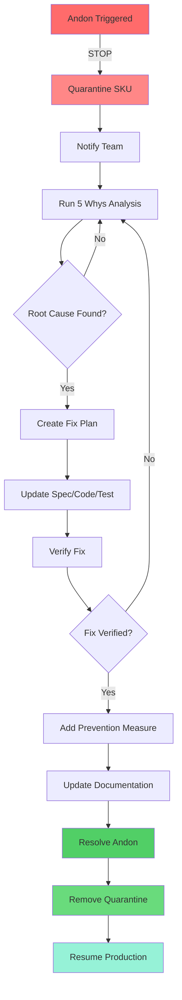

# TCPS Andon Runbook

**Version**: 1.0.0
**Last Updated**: 2026-01-26
**Purpose**: Define procedures for stop-the-line events

## Table of Contents

1. [Overview](#overview)
2. [How to Trigger Andon](#how-to-trigger-andon)
3. [Stop-the-Line Enforcement](#stop-the-line-enforcement)
4. [Resolution Workflow](#resolution-workflow)
5. [5 Whys Template](#5-whys-template)
6. [Prevention Action Framework](#prevention-action-framework)
7. [Common Failure Scenarios](#common-failure-scenarios)

---

## Overview

**Andon** is the stop-the-line mechanism that makes problems visible and halts production until resolution.

### Core Principle

> **"Red means stop. Nobody can ship until the problem is fixed."**

### Andon Authority

**Everyone** has authority to trigger Andon:
- Automated systems (SHACL, tests, security scans)
- CI/CD pipelines
- Developers
- QA engineers
- Operations
- **Even customers** (via critical bug reports)

### Andon Philosophy

Traditional software: "Ship broken, fix in patch"

TCPS: "Stop everything, fix root cause, prevent recurrence"

---

## How to Trigger Andon

### Automated Triggers

Most Andon events are triggered automatically:

```bash
# SHACL validation failure
./tools/shacl-validate --data ontology/ --shapes shapes/ || {
    ./tools/andon trigger \
        --stage generate \
        --severity critical \
        --reason shacl_violation \
        --details "Missing required field: taiea:dueDate"
}

# Test failure
rebar3 ct || {
    ./tools/andon trigger \
        --stage test \
        --severity critical \
        --reason test_failure \
        --details "erlmcp_transport_http_gun_SUITE:test_http2 FAILED"
}

# Security vulnerability
./tools/security/scan.sh || {
    ./tools/andon trigger \
        --stage verify \
        --severity high \
        --reason security_vulnerability \
        --details "CVE-2026-1234 in dependency gun-2.0.1"
}
```

### Manual Triggers

Humans can trigger Andon for anomalies:

```bash
# Generic Andon trigger
./tools/andon trigger \
    --stage <stage> \
    --severity <critical|high|medium|low> \
    --reason <reason_code> \
    --details "<description>" \
    --work-order <wo-id>

# Example: Discovered performance regression
./tools/andon trigger \
    --stage test \
    --severity high \
    --reason performance_regression \
    --details "Response time increased from 50ms to 500ms" \
    --work-order wo-001
```

### Severity Levels

| Severity | Response Time | Auto-Quarantine | Requires |
|----------|--------------|-----------------|----------|
| **Critical** | Immediate | Yes | Immediate resolution |
| **High** | < 1 hour | Yes | Resolution within 1 day |
| **Medium** | < 4 hours | No | Resolution within 1 week |
| **Low** | < 24 hours | No | Resolution or accept risk |

---

## Stop-the-Line Enforcement

### What Stops

When Andon triggers:

1. **Affected SKU quarantined** - Cannot proceed to next stage
2. **Related work orders blocked** - No new work on affected component
3. **Publishing disabled** - Cannot push to production
4. **Marketplace updates blocked** - Cannot update listings
5. **Alerts sent** - Team notified immediately

### Quarantine Process

```bash
# Automatic quarantine on critical/high Andon
./tools/andon trigger --severity critical --reason test_failure

# Output:
🚨 ANDON TRIGGERED: andon-20260126-001
Severity: CRITICAL
Reason: test_failure
Stage: test
Work Order: wo-001
SKU: erlmcp-0.6.0-http-transport

🔒 QUARANTINE ACTIONS:
✓ SKU quarantined: erlmcp-0.6.0-http-transport
✓ Publishing blocked for wo-001
✓ Marketplace updates disabled
✓ Team notified via Slack
✓ Andon receipt created: receipts/andon/andon-20260126-001.json

📋 NEXT STEPS:
1. Run 5 Whys analysis
2. Fix root cause
3. Update spec/test to prevent recurrence
4. Resolve Andon event
5. Re-run production pipeline
```

### Visual Indicators

```
┌────────────────────────────────────────┐
│      🚨 PRODUCTION LINE STOPPED 🚨     │
│                                        │
│  Andon: andon-20260126-001            │
│  Stage: Test                           │
│  Reason: test_failure                  │
│  SKU: erlmcp-0.6.0 (QUARANTINED)      │
│                                        │
│  Action Required: Fix before resuming  │
└────────────────────────────────────────┘
```

---

## Resolution Workflow



### Step-by-Step Resolution

#### Step 1: Acknowledge Andon

```bash
# Mark Andon as acknowledged
./tools/andon acknowledge andon-20260126-001 \
    --assigned-to "jane@example.com" \
    --estimated-resolution "2 hours"

# Output:
✓ Andon acknowledged
✓ Assigned to: jane@example.com
✓ ETA: 2 hours
✓ Status: IN_PROGRESS
```

#### Step 2: Run 5 Whys Analysis

```bash
# Create 5 Whys analysis document
./tools/andon create-5whys andon-20260126-001

# Opens editor with template (see template section below)
```

#### Step 3: Implement Fix

```bash
# Apply fix to specification
vi ontology/work_orders.ttl  # Fix spec

# Or fix code
vi src/erlmcp_transport_http_gun.erl  # Fix bug

# Or add test
vi test/erlmcp_transport_http_gun_SUITE.erl  # Add regression test
```

#### Step 4: Verify Fix

```bash
# Re-run the stage that failed
./tools/pipeline run-stage --stage test --work-order wo-001

# Expected:
✓ Stage test completed successfully
✓ All tests passed
✓ Receipt generated: receipts/test/results-wo-001-retry.json
```

#### Step 5: Add Prevention Measure

```bash
# Add SHACL constraint to prevent recurrence
vi shapes/work_order.ttl

# Example: Add constraint for field that was missing
:WorkOrderShape
    sh:property [
        sh:path taiea:dueDate ;
        sh:minCount 1 ;  # Make required
        sh:datatype xsd:date ;
        sh:message "Due date is required and must be a valid date"
    ] .

# Add regression test
vi test/shacl_validation_SUITE.erl

# Add test case for the constraint
test_work_order_requires_due_date(_Config) ->
    % Create work order without due date
    InvalidWO = create_work_order(#{sku => "test", priority => high}),

    % Validate - should fail
    {error, Violations} = shacl:validate(InvalidWO, work_order_shape),

    % Assert violation detected
    ?assertMatch([#{path := "taiea:dueDate"}], Violations).
```

#### Step 6: Update Documentation

```bash
# Document the failure and prevention in Andon receipt
./tools/andon document \
    --andon-id andon-20260126-001 \
    --root-cause "Work order template allowed optional due date" \
    --fix "Added SHACL constraint requiring due date" \
    --prevention "Regression test added to prevent recurrence"
```

#### Step 7: Resolve Andon

```bash
# Mark Andon as resolved
./tools/andon resolve andon-20260126-001 \
    --5whys-id 5w-20260126-001 \
    --fix-verified true \
    --prevention-added true

# Output:
✓ Andon resolved: andon-20260126-001
✓ 5 Whys completed: 5w-20260126-001
✓ Fix verified: YES
✓ Prevention added: YES
✓ Quarantine removed from: erlmcp-0.6.0-http-transport
✓ Production line: RESUMED
```

---

## 5 Whys Template

### Template Structure

```markdown
# 5 Whys Analysis

**Andon ID**: andon-20260126-001
**Date**: 2026-01-26
**Analyst**: Jane Doe
**Stage**: Test
**Work Order**: wo-001
**SKU**: erlmcp-0.6.0-http-transport

---

## Problem Statement

**What happened?**
HTTP/2 integration test `test_http2_multiplexing` failed with connection timeout.

**Impact:**
- Production line stopped
- SKU quarantined
- Release delayed

---

## 5 Whys Analysis

**Why 1: Why did the test fail?**

**Answer**: The test timed out waiting for HTTP/2 response from server.

**Evidence**:
- Test log shows: `{error, timeout} after 5000ms`
- No HTTP/2 response received
- Server logs show connection established but no data sent

---

**Why 2: Why did the server not send HTTP/2 response?**

**Answer**: Server did not handle HTTP/2 SETTINGS frame correctly.

**Evidence**:
- Server received SETTINGS frame (logged)
- Server did not send SETTINGS acknowledgment
- Connection hung waiting for ACK

---

**Why 3: Why did the server not handle SETTINGS frame?**

**Answer**: HTTP/2 protocol handler was not configured in test setup.

**Evidence**:
- Test setup only configured HTTP/1.1 protocol
- HTTP/2 handler registration missing from test config
- gun client attempted HTTP/2 upgrade but server couldn't respond

---

**Why 4: Why was HTTP/2 not configured in test?**

**Answer**: Test template did not include HTTP/2 setup.

**Evidence**:
- Template: `templates/transport_test.erl.tera`
- Contains only HTTP/1.1 configuration
- HTTP/2 configuration block missing

---

**Why 5: Why didn't the template include HTTP/2?**

**Answer**: Template was created before gun HTTP/2 refactoring.

**Evidence**:
- Template created: 2025-12-01
- gun HTTP/2 refactoring: 2026-01-15
- Template not updated when gun was integrated

---

## Root Cause

**Primary Root Cause**:
Test template outdated - does not include HTTP/2 configuration required after gun integration.

**Contributing Factors**:
1. No template versioning linked to dependency versions
2. No automated check for template completeness
3. No requirement to update templates when dependencies change

---

## Countermeasures

### Immediate Fix (to resolve Andon)

**Action**: Update test template to include HTTP/2 configuration

**Implementation**:
```erlang
% templates/transport_test.erl.tera
init_per_suite(Config) ->
    % Start test server with HTTP/1.1 AND HTTP/2
    {ok, Server} = start_test_server([
        {protocols, [http1, http2]},  % Both protocols
        {http2_opts, #{
            settings_timeout => 5000,
            max_concurrent_streams => 100
        }}
    ]),
    [{server, Server} | Config].
```

**Verification**:
```bash
# Re-generate test from updated template
./tools/template render \
    --template templates/transport_test.erl.tera \
    --output test/erlmcp_transport_http_gun_SUITE.erl

# Re-run tests
rebar3 ct --suite test/erlmcp_transport_http_gun_SUITE
# Expected: All tests pass including test_http2_multiplexing
```

### Prevention Measures

**1. Template Versioning**

Add to ontology:
```turtle
:HttpTransportTestTemplate a taiea:Template ;
    taiea:version "2.0.0" ;
    taiea:requiredDependencies [
        :gun "^2.0.0" ;
        :ranch "^2.1.0"
    ] ;
    taiea:supportedProtocols ( :http1 :http2 ) .
```

**2. Template Completeness Check**

Add SHACL constraint:
```turtle
:TemplateShape a sh:NodeShape ;
    sh:targetClass taiea:Template ;
    sh:property [
        sh:path taiea:supportedProtocols ;
        sh:minCount 1 ;
        sh:message "Template must declare supported protocols"
    ] .
```

**3. Dependency Change Trigger**

Add CI check:
```bash
# .github/workflows/dependency-update.yml
on:
  pull_request:
    paths:
      - 'rebar.config'
      - 'rebar.lock'

jobs:
  check-templates:
    runs-on: ubuntu-latest
    steps:
      - name: Check if templates need update
        run: |
          ./tools/template check-compatibility \
            --deps rebar.lock \
            --templates templates/
```

**4. Regression Test**

Add test case:
```erlang
% test/template_versioning_SUITE.erl
test_http_transport_test_template_supports_http2(_Config) ->
    Template = load_template("templates/transport_test.erl.tera"),

    % Assert HTTP/2 configuration present
    ?assertMatch(#{protocols := [http1, http2]},
                 extract_config(Template)),

    % Assert HTTP/2 settings present
    ?assertMatch(#{http2_opts := #{settings_timeout := _}},
                 extract_config(Template)).
```

---

## Verification

**Fix Verified**: ✓ YES
- Re-ran test: PASSED
- HTTP/2 multiplexing working
- All transport tests passing

**Prevention Verified**: ✓ YES
- Template versioning added to ontology
- SHACL constraint added
- CI check added
- Regression test added

---

## Timeline

| Time | Event |
|------|-------|
| 10:15 | Test failure detected |
| 10:16 | Andon triggered automatically |
| 10:17 | SKU quarantined, team notified |
| 10:20 | 5 Whys analysis started |
| 10:45 | Root cause identified |
| 11:00 | Fix implemented |
| 11:15 | Fix verified |
| 11:30 | Prevention measures added |
| 11:45 | Andon resolved, line resumed |

**Total Downtime**: 1.5 hours

---

## Lessons Learned

1. **Templates are code** - Must be versioned and tested
2. **Dependency updates require template review** - Should be automated
3. **Protocol support must be explicit** - Cannot assume
4. **Test completeness must be verified** - Need automated checks

---

## Action Items

- [x] Update transport test template - @jane
- [x] Add template versioning to ontology - @jane
- [x] Add SHACL constraint for protocols - @jane
- [x] Create CI check for template compatibility - @bob
- [x] Add regression test for HTTP/2 - @jane
- [ ] Document template update process - @alice (Due: 2026-01-27)
- [ ] Review all templates for completeness - @team (Due: 2026-02-01)

---

**Sign-off**:
- Analyst: Jane Doe (2026-01-26)
- Reviewer: Bob Smith (2026-01-26)
- Approved: Alice Johnson (2026-01-26)
```

---

## Prevention Action Framework

### Prevention Categories

**1. Specification Prevention**

Add constraints to prevent invalid states:
```turtle
# shapes/work_order.ttl
sh:property [
    sh:path taiea:dueDate ;
    sh:minCount 1 ;  # Make required
    sh:datatype xsd:date ;
    sh:minExclusive "2020-01-01"^^xsd:date  # Must be future
] .
```

**2. Code Prevention**

Add type safety, guards, validations:
```erlang
% src/erlmcp_work_order.erl
-spec create_work_order(map()) -> {ok, work_order()} | {error, term()}.
create_work_order(#{sku := SKU, due_date := DueDate} = Attrs)
    when is_binary(SKU), is_binary(DueDate) ->
    % Validate due date is future
    case parse_date(DueDate) of
        {ok, Date} when Date > today() ->
            {ok, #work_order{sku = SKU, due_date = Date}};
        {ok, _PastDate} ->
            {error, {invalid_due_date, "Due date must be in future"}};
        {error, _} = Error ->
            Error
    end;
create_work_order(_InvalidAttrs) ->
    {error, missing_required_fields}.
```

**3. Test Prevention**

Add regression test that would have caught the bug:
```erlang
% test/work_order_SUITE.erl
test_work_order_requires_future_due_date(_Config) ->
    Yesterday = format_date(yesterday()),

    % Attempt to create work order with past due date
    Result = erlmcp_work_order:create_work_order(#{
        sku => <<"test-sku">>,
        due_date => Yesterday
    }),

    % Should fail
    ?assertMatch({error, {invalid_due_date, _}}, Result).
```

**4. Process Prevention**

Add automated checks to CI/CD:
```yaml
# .github/workflows/ci.yml
- name: Validate work orders
  run: |
    ./tools/shacl-validate \
      --data ontology/work_orders.ttl \
      --shapes shapes/work_order.ttl \
      --strict

    # Fail if any violations
    if [ $? -ne 0 ]; then
      echo "SHACL validation failed - blocking merge"
      exit 1
    fi
```

**5. Documentation Prevention**

Update standard work to include the lesson:
```markdown
### Common Failure: Past Due Date

**Symptom**: Work order created with past due date
**Cause**: No validation of date being future
**Prevention**: SHACL constraint requires future date
**Detection**: Automated SHACL validation in CI
**Recovery**: Update work order with valid future date
```

---

## Common Failure Scenarios

### Scenario 1: SHACL Validation Failure

**Trigger**: Ontology violates SHACL constraint

**Andon Details**:
```json
{
  "andon_id": "andon-20260126-002",
  "stage": "generate",
  "severity": "critical",
  "reason": "shacl_violation",
  "details": {
    "violation_count": 1,
    "violations": [
      {
        "path": "taiea:dueDate",
        "message": "Due date is required",
        "focus_node": "wo-002"
      }
    ]
  }
}
```

**Recovery**:
1. Identify missing/invalid field
2. Update ontology with correct value
3. Re-run SHACL validation
4. Verify constraint satisfied
5. Resume pipeline

**Prevention**:
- Add constraint to SHACL shape
- Add validation to work order creation tool
- Add test for constraint

---

### Scenario 2: Test Failure

**Trigger**: One or more tests fail

**Andon Details**:
```json
{
  "andon_id": "andon-20260126-003",
  "stage": "test",
  "severity": "critical",
  "reason": "test_failure",
  "details": {
    "suite": "erlmcp_transport_http_gun_SUITE",
    "test_case": "test_connection_timeout",
    "error": "Expected timeout after 5000ms, got 500ms",
    "failure_type": "assertion_failed"
  }
}
```

**Recovery**:
1. Reproduce test failure locally
2. Debug to find root cause
3. Fix bug in code
4. Re-run tests
5. Verify all pass
6. Add regression test

**Prevention**:
- Fix the bug
- Add test case for the scenario
- Add property test if applicable

---

### Scenario 3: Security Vulnerability

**Trigger**: Security scan finds vulnerability

**Andon Details**:
```json
{
  "andon_id": "andon-20260126-004",
  "stage": "verify",
  "severity": "high",
  "reason": "security_vulnerability",
  "details": {
    "cve": "CVE-2026-1234",
    "package": "gun",
    "version": "2.0.1",
    "severity": "HIGH",
    "description": "HTTP/2 header parsing vulnerability"
  }
}
```

**Recovery**:
1. Assess vulnerability impact
2. Check for patched version
3. Update dependency to patched version
4. Re-run security scan
5. Verify vulnerability resolved
6. Document in changelog

**Prevention**:
- Subscribe to security advisories
- Automated dependency scanning
- Regular dependency updates

---

### Scenario 4: Non-Deterministic Build

**Trigger**: Build checksums don't match

**Andon Details**:
```json
{
  "andon_id": "andon-20260126-005",
  "stage": "build",
  "severity": "high",
  "reason": "non_deterministic_build",
  "details": {
    "build_1_checksum": "sha256:abc123...",
    "build_2_checksum": "sha256:def456...",
    "build_3_checksum": "sha256:abc123...",
    "deterministic": false
  }
}
```

**Recovery**:
1. Identify source of randomness
   - Timestamps in generated files?
   - Random test data?
   - Non-deterministic dependency resolution?
2. Eliminate randomness
3. Re-run build verification
4. Verify checksums match

**Prevention**:
- Remove timestamps from generated files
- Use fixed seeds for random data
- Lock dependency versions
- Add determinism check to CI

---

### Scenario 5: Coverage Drop

**Trigger**: Test coverage falls below threshold

**Andon Details**:
```json
{
  "andon_id": "andon-20260126-006",
  "stage": "test",
  "severity": "medium",
  "reason": "coverage_below_threshold",
  "details": {
    "current_coverage": 75.3,
    "threshold": 80.0,
    "uncovered_modules": [
      "erlmcp_transport_http_gun"
    ]
  }
}
```

**Recovery**:
1. Identify uncovered code
2. Write tests for uncovered paths
3. Re-run coverage
4. Verify threshold met

**Prevention**:
- Coverage ratcheting (never allow decrease)
- Require tests for new code
- Review coverage in PR

---

## Andon Metrics

Track Andon effectiveness:

```bash
# Generate Andon metrics report
./tools/andon metrics --period last-30-days

# Output:
=== Andon Metrics (Last 30 Days) ===

Total Andon Events: 12
- Critical: 4 (33%)
- High: 5 (42%)
- Medium: 2 (17%)
- Low: 1 (8%)

Average Resolution Time:
- Critical: 1.5 hours
- High: 3.2 hours
- Medium: 8.7 hours
- Low: 24.3 hours

Top Failure Reasons:
1. test_failure: 5 events
2. shacl_violation: 3 events
3. security_vulnerability: 2 events
4. non_deterministic_build: 1 event
5. coverage_below_threshold: 1 event

Recurrence Rate: 0% (0 repeat failures)

Prevention Measures Added: 12
- SHACL constraints: 5
- Regression tests: 5
- CI checks: 2
```

---

## Conclusion

Andon is not punishment - it's learning.

Every Andon event makes the system stronger:
1. Problem visible immediately
2. Root cause found (5 Whys)
3. Fix applied
4. Prevention measure added
5. **Problem cannot recur**

**Stop the line. Fix the root cause. Build it in.**

---

**See Also**:
- [TCPS.md](TCPS.md) - Complete TCPS guide
- [STANDARD_WORK.md](STANDARD_WORK.md) - Stage procedures
- [DEFINITION_OF_DONE.md](DEFINITION_OF_DONE.md) - Quality gates
- [KAIZEN_GUIDE.md](KAIZEN_GUIDE.md) - Continuous improvement
