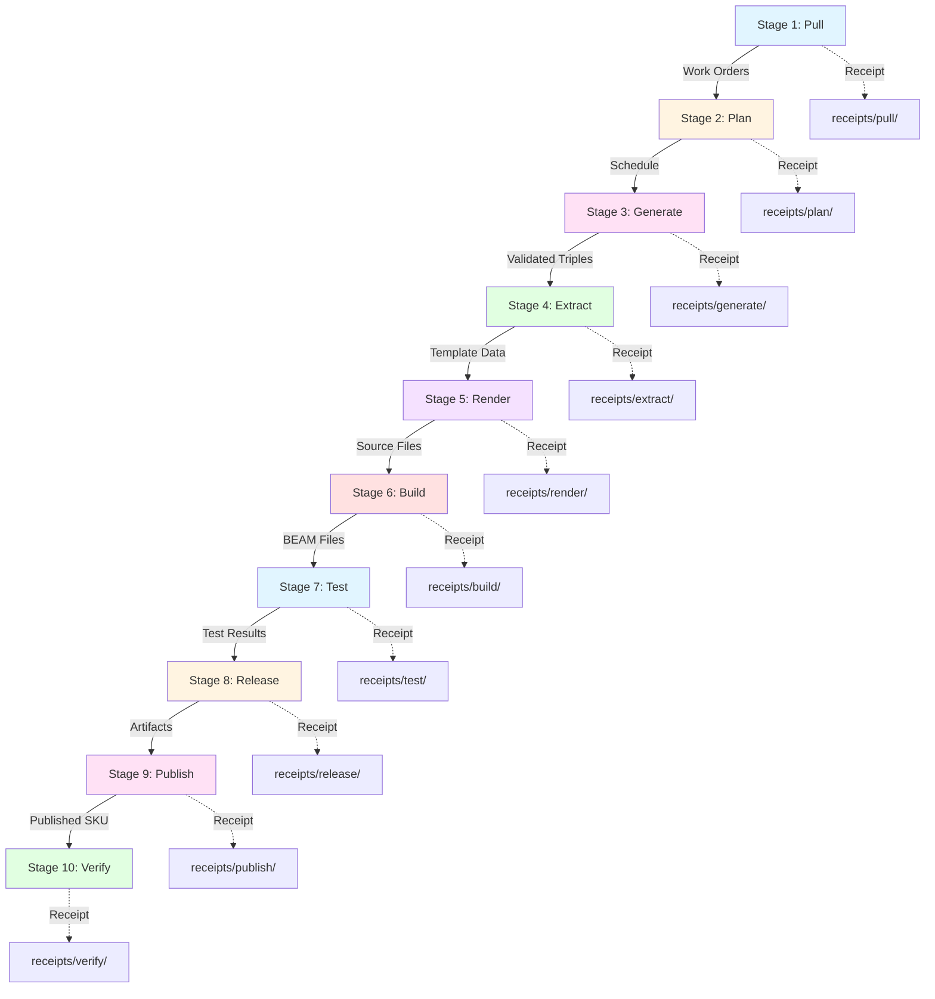

# TCPS Standard Work Procedures

**Version**: 1.0.0
**Last Updated**: 2026-01-26
**Purpose**: Define standard procedures for each production stage

## Table of Contents

1. [Overview](#overview)
2. [Production Pipeline](#production-pipeline)
3. [Stage 1: Pull](#stage-1-pull)
4. [Stage 2: Plan](#stage-2-plan)
5. [Stage 3: Generate](#stage-3-generate)
6. [Stage 4: Extract](#stage-4-extract)
7. [Stage 5: Render](#stage-5-render)
8. [Stage 6: Build](#stage-6-build)
9. [Stage 7: Test](#stage-7-test)
10. [Stage 8: Release](#stage-8-release)
11. [Stage 9: Publish](#stage-9-publish)
12. [Stage 10: Verify](#stage-10-verify)

---

## Overview

**Standard Work** is the foundation of TCPS. If you cannot document the procedure, you do not understand the process.

### Principles

1. **Every stage has defined inputs and outputs**
2. **Every stage has an SLO (Service Level Objective)**
3. **Every stage emits a receipt**
4. **Every stage has documented failure modes**
5. **Every failure mode has a recovery procedure**

### Standard Work Format

Each stage documentation includes:
- **Purpose**: Why this stage exists
- **Inputs**: Required artifacts to begin
- **Process**: Step-by-step procedure
- **Outputs**: Artifacts produced
- **SLO**: Maximum time allowed
- **Receipt**: Proof of completion
- **Failure Modes**: What can go wrong
- **Recovery**: How to fix each failure

---

## Production Pipeline



---

## Stage 1: Pull

### Purpose
Convert demand signals into formal work orders.

### Inputs
- **Demand signals**: GitHub issues, Marketplace analytics, security advisories, customer requests
- **Demand sources**:
  - `marketplace/installs.json`
  - `github/issues.json`
  - `security/cves.json`
  - `customers/requests.json`

### Process

#### Step 1.1: Collect Demand Signals
```bash
# Run demand collection
./tools/demand-collector run --sources all

# Output: demand_signals.json
{
  "timestamp": "2026-01-26T10:00:00Z",
  "signals": [
    {
      "source": "marketplace",
      "type": "install_spike",
      "feature": "http2_transport",
      "count": 147,
      "trend": "increasing"
    }
  ]
}
```

#### Step 1.2: Create Work Orders
```bash
# Generate work order from signal
./tools/work-order create \
  --from-signal demand_signals.json \
  --template ontology/templates/work_order.ttl

# Output: ontology/work_orders.ttl
:wo-001 a taiea:WorkOrder ;
    taiea:requestedSKU "erlmcp-http2-transport" ;
    taiea:priority "high" ;
    taiea:bucket "features" ;
    taiea:dueDate "2026-02-01"^^xsd:date ;
    taiea:demandSource :marketplace-install-spike ;
    taiea:created "2026-01-26T10:15:00Z"^^xsd:dateTime ;
    taiea:status "open" .
```

#### Step 1.3: Validate Work Order
```bash
# Validate against SHACL shapes
./tools/shacl-validate \
  --data ontology/work_orders.ttl \
  --shapes shapes/work_order.ttl

# Expected output:
✓ Validation passed
✓ All required fields present
✓ Data types correct
✓ Constraints satisfied
```

#### Step 1.4: Emit Receipt
```bash
# Generate pull receipt
./tools/receipt generate \
  --stage pull \
  --work-order wo-001 \
  --output receipts/pull/wo-001.json
```

### Outputs
- **Work orders**: `ontology/work_orders.ttl`
- **Pull receipt**: `receipts/pull/wo-001.json`

### SLO
**5 minutes** per work order

### Receipt Schema
```json
{
  "receipt_id": "pull-wo-001-20260126",
  "stage": "pull",
  "timestamp": "2026-01-26T10:15:00Z",
  "work_order_id": "wo-001",
  "demand_signal": {
    "source": "marketplace",
    "type": "install_spike",
    "count": 147
  },
  "validation": {
    "shacl_passed": true,
    "constraints_satisfied": true
  },
  "outputs": [
    "ontology/work_orders.ttl#wo-001"
  ],
  "next_stage": "plan",
  "status": "completed"
}
```

### Failure Modes

| Failure | Detection | Recovery | Prevention |
|---------|-----------|----------|------------|
| **Invalid demand source** | SHACL validation fails | Update demand source schema | Add source validation constraint |
| **Duplicate work order** | ID collision check | Merge with existing WO | Add uniqueness constraint |
| **Missing required field** | SHACL validation fails | Add field to work order | Enforce template completion |
| **Invalid due date** | Date validation fails | Correct date format | Add date constraint to SHACL |

### Recovery Procedures

#### F1.1: Invalid Demand Source
```bash
# Trigger Andon
./tools/andon trigger \
  --stage pull \
  --reason invalid_demand_source \
  --work-order wo-001

# Quarantine work order
./tools/work-order quarantine wo-001

# Fix demand source
vi demand_signals.json  # Correct source format

# Re-validate
./tools/shacl-validate --data ontology/work_orders.ttl

# Resume
./tools/andon resolve andon-20260126-001
```

---

## Stage 2: Plan

### Purpose
Schedule work orders using Heijunka leveling algorithm.

### Inputs
- **Open work orders**: `ontology/work_orders.ttl` (status = "open")
- **WIP limits**: `config/wip_limits.erl`
- **Bucket allocations**: `config/heijunka.erl`

### Process

#### Step 2.1: Check WIP Limits
```bash
# Count active work in progress
./tools/wip count

# Output:
Active WIP: 2
WIP Limit: 3
Available slots: 1
Status: ACCEPT
```

#### Step 2.2: Apply Heijunka Leveling
```bash
# Generate leveled schedule
./tools/heijunka schedule \
  --input ontology/work_orders.ttl \
  --output receipts/plan/schedule-20260126.json \
  --algorithm level-by-bucket

# Algorithm logic:
# 1. Group work orders by bucket (reliability, security, features, etc.)
# 2. Allocate slots per bucket per day
# 3. Prioritize within bucket
# 4. Respect WIP limits
```

**Heijunka Configuration**:
```erlang
% config/heijunka.erl
-define(DAILY_SLOTS, #{
    reliability => 2,   % 2 slots/day for bug fixes
    security => 2,      % 2 slots/day for security
    features => 1,      % 1 slot/day for features
    compliance => 1,    % 1 slot/day for compliance
    debt => 1           % 1 slot/day for refactoring
}).
```

#### Step 2.3: Create Schedule
```bash
# Output: receipts/plan/schedule-20260126.json
{
  "schedule_id": "sched-20260126",
  "date": "2026-01-26",
  "slots": [
    {
      "slot": 1,
      "bucket": "security",
      "work_order": "wo-001",
      "sku": "erlmcp-security-patch",
      "start_time": "09:00"
    },
    {
      "slot": 2,
      "bucket": "reliability",
      "work_order": "wo-002",
      "sku": "erlmcp-tcp-fix",
      "start_time": "11:00"
    }
  ],
  "wip_status": {
    "current": 2,
    "limit": 3,
    "available": 1
  }
}
```

#### Step 2.4: Emit Receipt
```bash
./tools/receipt generate \
  --stage plan \
  --schedule schedule-20260126 \
  --output receipts/plan/schedule-20260126.json
```

### Outputs
- **Schedule**: `receipts/plan/schedule-20260126.json`
- **Updated work orders**: Status changed to "scheduled"

### SLO
**10 minutes** per schedule

### Receipt Schema
```json
{
  "receipt_id": "plan-20260126",
  "stage": "plan",
  "timestamp": "2026-01-26T08:00:00Z",
  "schedule_id": "sched-20260126",
  "algorithm": "heijunka-leveling",
  "slots_allocated": 2,
  "wip_limit": 3,
  "wip_current": 2,
  "bucket_distribution": {
    "security": 1,
    "reliability": 1,
    "features": 0,
    "compliance": 0,
    "debt": 0
  },
  "work_orders": ["wo-001", "wo-002"],
  "next_stage": "generate",
  "status": "completed"
}
```

### Failure Modes

| Failure | Detection | Recovery | Prevention |
|---------|-----------|----------|------------|
| **WIP limit exceeded** | Count check fails | Wait for slot to free | Monitor WIP continuously |
| **No work orders** | Empty queue | Wait for pull stage | Set minimum backlog threshold |
| **Invalid bucket** | Bucket lookup fails | Assign to default bucket | Add bucket validation to SHACL |
| **Unbalanced schedule** | Distribution check | Re-run leveling algorithm | Tune bucket allocations |

---

## Stage 3: Generate

### Purpose
Load ontology and validate with SHACL shapes.

### Inputs
- **Ontology files**: `ontology/*.ttl`
- **SHACL shapes**: `shapes/*.ttl`
- **Work orders**: From schedule

### Process

#### Step 3.1: Load Ontology
```bash
# Load all ontology files into RDF store
./tools/ontology load \
  --input ontology/ \
  --format turtle \
  --store jena-tdb

# Verify triples loaded
./tools/ontology count-triples
# Output: 1,247 triples loaded
```

#### Step 3.2: Validate with SHACL
```bash
# Run SHACL validation
./tools/shacl-validate \
  --data ontology/ \
  --shapes shapes/ \
  --report receipts/generate/shacl-report.ttl

# Expected output:
✓ WorkOrder shapes: 5/5 passed
✓ Transport shapes: 3/3 passed
✓ Release shapes: 2/2 passed
✓ Overall: PASS (0 violations)
```

#### Step 3.3: Check Determinism
```bash
# Verify ontology is deterministic
./tools/ontology check-determinism \
  --input ontology/ \
  --iterations 3

# Run 3 times, verify identical output
# SHA256 checksums must match
```

#### Step 3.4: Emit Receipt
```bash
./tools/receipt generate \
  --stage generate \
  --shacl-report receipts/generate/shacl-report.ttl \
  --output receipts/generate/validate-wo-001.json
```

### Outputs
- **Validated ontology**: Loaded in RDF store
- **SHACL report**: `receipts/generate/shacl-report.ttl`
- **Generate receipt**: `receipts/generate/validate-wo-001.json`

### SLO
**30 minutes**

### Receipt Schema
```json
{
  "receipt_id": "generate-wo-001-20260126",
  "stage": "generate",
  "timestamp": "2026-01-26T09:00:00Z",
  "work_order_id": "wo-001",
  "ontology": {
    "files_loaded": 12,
    "triples_count": 1247,
    "namespaces": ["taiea", "erlmcp", "owl", "rdf", "rdfs", "sh"]
  },
  "shacl_validation": {
    "passed": true,
    "violations": 0,
    "shapes_validated": 10,
    "report": "receipts/generate/shacl-report.ttl"
  },
  "determinism": {
    "iterations": 3,
    "checksums": [
      "sha256:abc123...",
      "sha256:abc123...",
      "sha256:abc123..."
    ],
    "deterministic": true
  },
  "next_stage": "extract",
  "status": "completed"
}
```

### Failure Modes

| Failure | Detection | Recovery | Prevention |
|---------|-----------|----------|------------|
| **SHACL violation** | Validation fails | Fix ontology, re-validate | Add constraint to prevent |
| **Invalid Turtle syntax** | Parse error | Fix syntax | Pre-commit validation |
| **Missing namespace** | Undefined prefix | Add namespace declaration | Namespace registry |
| **Non-deterministic** | Checksum mismatch | Find randomness source | Eliminate randomness |

---

## Stage 4: Extract

### Purpose
Run SPARQL queries to extract data for templates.

### Inputs
- **Validated ontology**: From RDF store
- **SPARQL queries**: `sparql/*.rq`
- **Work order**: Specifies which queries to run

### Process

#### Step 4.1: Select Queries
```bash
# Determine queries needed for work order
./tools/sparql select-queries --work-order wo-001

# Output:
Selected queries:
- sparql/transport_config.rq
- sparql/dependencies.rq
- sparql/test_cases.rq
```

#### Step 4.2: Execute Queries
```bash
# Run each query
./tools/sparql execute \
  --query sparql/transport_config.rq \
  --store jena-tdb \
  --output receipts/extract/transport_config.json

# Example query:
# sparql/transport_config.rq
PREFIX taiea: <http://taiea.org/ontology#>
PREFIX erlmcp: <http://erlmcp.org/ontology#>

SELECT ?transport ?module ?protocol ?port
WHERE {
  ?transport a erlmcp:Transport ;
             erlmcp:module ?module ;
             erlmcp:protocol ?protocol ;
             erlmcp:defaultPort ?port .
}
```

#### Step 4.3: Validate Query Results
```bash
# Verify results are complete
./tools/sparql validate-results \
  --results receipts/extract/transport_config.json \
  --schema schemas/transport_config_schema.json

# Check:
# - All required fields present
# - Data types correct
# - No null values in required fields
```

#### Step 4.4: Emit Receipt
```bash
./tools/receipt generate \
  --stage extract \
  --queries-run 3 \
  --output receipts/extract/query-wo-001.json
```

### Outputs
- **Query results**: `receipts/extract/*.json`
- **Extract receipt**: `receipts/extract/query-wo-001.json`

### SLO
**15 minutes**

### Receipt Schema
```json
{
  "receipt_id": "extract-wo-001-20260126",
  "stage": "extract",
  "timestamp": "2026-01-26T09:30:00Z",
  "work_order_id": "wo-001",
  "queries_executed": [
    {
      "query_file": "sparql/transport_config.rq",
      "results_count": 3,
      "execution_time_ms": 234,
      "output": "receipts/extract/transport_config.json"
    },
    {
      "query_file": "sparql/dependencies.rq",
      "results_count": 8,
      "execution_time_ms": 156,
      "output": "receipts/extract/dependencies.json"
    }
  ],
  "total_execution_time_ms": 390,
  "validation": {
    "passed": true,
    "schemas_validated": 2
  },
  "next_stage": "render",
  "status": "completed"
}
```

### Failure Modes

| Failure | Detection | Recovery | Prevention |
|---------|-----------|----------|------------|
| **Query timeout** | Execution exceeds limit | Optimize query | Add query performance test |
| **Empty results** | Result count = 0 | Check ontology completeness | Add data completeness constraint |
| **Invalid JSON** | Schema validation fails | Fix query projection | Add schema to SPARQL query |
| **Query syntax error** | SPARQL parser error | Fix query syntax | Pre-commit SPARQL validation |

---

## Stage 5: Render

### Purpose
Render templates using extracted data.

### Inputs
- **Templates**: `templates/*.tera`
- **Extracted data**: `receipts/extract/*.json`
- **Work order**: Specifies which templates to render

### Process

#### Step 5.1: Select Templates
```bash
# Determine templates needed
./tools/template select --work-order wo-001

# Output:
Selected templates:
- templates/transport_http.erl.tera
- templates/transport_test.erl.tera
- templates/README.md.tera
```

#### Step 5.2: Render Templates
```bash
# Render each template
./tools/template render \
  --template templates/transport_http.erl.tera \
  --data receipts/extract/transport_config.json \
  --output src/erlmcp_transport_http_gun.erl

# Tera template example:
% Generated by TCPS - DO NOT EDIT MANUALLY
% Template: transport_http.erl.tera
% Generated: {{ timestamp }}

-module({{ module_name }}).
-behaviour(erlmcp_transport).


-export([init_{{ protocol }}/1]).

```

#### Step 5.3: Verify No Manual Edits
```bash
# Check generated files for manual edits marker
./tools/template verify-generated \
  --files src/erlmcp_transport_*.erl

# Verify each file has:
# - "Generated by TCPS" marker
# - Timestamp
# - Template source reference
```

#### Step 5.4: Emit Receipt
```bash
./tools/receipt generate \
  --stage render \
  --templates-rendered 3 \
  --output receipts/render/files-wo-001.json
```

### Outputs
- **Generated files**: `src/*.erl`, `test/*.erl`, `docs/*.md`
- **Render receipt**: `receipts/render/files-wo-001.json`

### SLO
**20 minutes**

### Receipt Schema
```json
{
  "receipt_id": "render-wo-001-20260126",
  "stage": "render",
  "timestamp": "2026-01-26T09:50:00Z",
  "work_order_id": "wo-001",
  "templates_rendered": [
    {
      "template": "templates/transport_http.erl.tera",
      "data_source": "receipts/extract/transport_config.json",
      "output": "src/erlmcp_transport_http_gun.erl",
      "lines_generated": 423,
      "checksum": "sha256:def456..."
    }
  ],
  "verification": {
    "manual_edits_detected": false,
    "all_files_marked": true
  },
  "next_stage": "build",
  "status": "completed"
}
```

### Failure Modes

| Failure | Detection | Recovery | Prevention |
|---------|-----------|----------|------------|
| **Template syntax error** | Tera parse error | Fix template syntax | Add template validation to CI |
| **Missing data field** | Render fails | Add field to extraction | Add schema validation |
| **Manual edit detected** | Marker check fails | Trigger Andon, revert edit | Add pre-commit hook |
| **Output file collision** | File exists without marker | Backup + regenerate | Add file tracking |

---

## Stage 6: Build

### Purpose
Compile Erlang source to BEAM bytecode.

### Inputs
- **Source files**: `src/*.erl`
- **Dependencies**: `rebar.lock`
- **Build config**: `rebar.config`

### Process

#### Step 6.1: Verify Dependencies
```bash
# Check all dependencies available
rebar3 get-deps

# Verify lock file integrity
./tools/deps verify-lock rebar.lock

# Expected output:
✓ All dependencies resolved
✓ Lock file integrity: OK
✓ No version conflicts
```

#### Step 6.2: Compile
```bash
# Run Erlang compiler
rebar3 compile 2>&1 | tee receipts/build/compile.log

# Expected output:
===> Verifying dependencies...
===> Analyzing applications...
===> Compiling erlmcp
===> Compiling src/erlmcp_transport_http_gun.erl
===> Compiling src/erlmcp_server.erl
... (20 modules)
===> Build succeeded
```

#### Step 6.3: Verify BEAM Files
```bash
# Check BEAM files generated
./tools/build verify-beams \
  --expected src/*.erl \
  --actual _build/default/lib/erlmcp/ebin/*.beam

# Verify checksums
./tools/build checksum-beams \
  --output receipts/build/beam_checksums.json
```

#### Step 6.4: Check Determinism
```bash
# Build 3 times, verify identical output
make clean && make compile  # Build 1
sha256sum _build/default/lib/erlmcp/ebin/*.beam > build1.sum

make clean && make compile  # Build 2
sha256sum _build/default/lib/erlmcp/ebin/*.beam > build2.sum

make clean && make compile  # Build 3
sha256sum _build/default/lib/erlmcp/ebin/*.beam > build3.sum

# Compare
diff build1.sum build2.sum  # Must be identical
diff build2.sum build3.sum  # Must be identical
```

#### Step 6.5: Emit Receipt
```bash
./tools/receipt generate \
  --stage build \
  --compile-log receipts/build/compile.log \
  --checksums receipts/build/beam_checksums.json \
  --output receipts/build/compile-wo-001.json
```

### Outputs
- **BEAM files**: `_build/default/lib/erlmcp/ebin/*.beam`
- **Build receipt**: `receipts/build/compile-wo-001.json`

### SLO
**10 minutes**

### Receipt Schema
```json
{
  "receipt_id": "build-wo-001-20260126",
  "stage": "build",
  "timestamp": "2026-01-26T10:00:00Z",
  "work_order_id": "wo-001",
  "compilation": {
    "modules_compiled": 20,
    "warnings": 0,
    "errors": 0,
    "duration_ms": 12453,
    "compiler_version": "OTP 26.2"
  },
  "outputs": {
    "beam_files": 20,
    "total_size_bytes": 456789,
    "checksums": "receipts/build/beam_checksums.json"
  },
  "determinism": {
    "builds_compared": 3,
    "identical": true,
    "checksums_match": true
  },
  "next_stage": "test",
  "status": "completed"
}
```

### Failure Modes

| Failure | Detection | Recovery | Prevention |
|---------|-----------|----------|------------|
| **Compilation error** | rebar3 exit code != 0 | Fix source, re-compile | Add syntax check to template |
| **Missing dependency** | Dep resolution fails | Update rebar.config | Lock file validation |
| **Non-deterministic build** | Checksum mismatch | Find randomness source | Eliminate timestamps |
| **Timeout** | Build exceeds SLO | Trigger Andon, investigate | Profile build performance |

---

## Stage 7: Test

### Purpose
Execute test suite and verify all tests pass.

### Inputs
- **BEAM files**: `_build/default/lib/erlmcp/ebin/*.beam`
- **Test suites**: `test/*_SUITE.erl`
- **Test config**: `test/test.config`

### Process

#### Step 7.1: Run Unit Tests
```bash
# Execute unit tests
rebar3 eunit --cover 2>&1 | tee receipts/test/eunit.log

# Expected output:
===> Running eunit tests...
erlmcp_json_rpc_tests: test_encode_request ... ok
erlmcp_json_rpc_tests: test_decode_response ... ok
... (47 tests)
All 47 tests passed.
```

#### Step 7.2: Run Integration Tests
```bash
# Execute Common Test suites
rebar3 ct --cover 2>&1 | tee receipts/test/ct.log

# Expected output:
===> Running Common Test suites...
erlmcp_transport_http_gun_SUITE:
  init_per_suite ... ok
  test_http1_request ... ok
  test_http2_multiplexing ... ok
  test_connection_pooling ... ok
  end_per_suite ... ok
... (12 suites, 89 test cases)
All tests passed.
```

#### Step 7.3: Check Coverage
```bash
# Generate coverage report
rebar3 cover --verbose

# Verify coverage threshold
./tools/test check-coverage \
  --threshold 80 \
  --report _build/test/cover/index.html

# Expected output:
Coverage: 87.3% (threshold: 80%)
✓ Coverage threshold met
```

#### Step 7.4: Run Property Tests
```bash
# Execute PropEr property-based tests
rebar3 proper

# Expected output:
===> Testing erlmcp_json_rpc properties...
prop_encode_decode_inverse: OK (1000 tests)
prop_valid_json_output: OK (1000 tests)
prop_error_handling: OK (1000 tests)
All properties passed.
```

#### Step 7.5: Emit Receipt
```bash
./tools/receipt generate \
  --stage test \
  --eunit-log receipts/test/eunit.log \
  --ct-log receipts/test/ct.log \
  --coverage _build/test/cover/cover.html \
  --output receipts/test/results-wo-001.json
```

### Outputs
- **Test logs**: `receipts/test/*.log`
- **Coverage report**: `_build/test/cover/`
- **Test receipt**: `receipts/test/results-wo-001.json`

### SLO
**30 minutes**

### Receipt Schema
```json
{
  "receipt_id": "test-wo-001-20260126",
  "stage": "test",
  "timestamp": "2026-01-26T10:30:00Z",
  "work_order_id": "wo-001",
  "unit_tests": {
    "framework": "eunit",
    "total": 47,
    "passed": 47,
    "failed": 0,
    "skipped": 0,
    "duration_ms": 3421
  },
  "integration_tests": {
    "framework": "common_test",
    "suites": 12,
    "total": 89,
    "passed": 89,
    "failed": 0,
    "skipped": 0,
    "duration_ms": 45678
  },
  "property_tests": {
    "framework": "proper",
    "properties": 15,
    "tests_per_property": 1000,
    "all_passed": true
  },
  "coverage": {
    "lines": 87.3,
    "functions": 92.1,
    "threshold": 80,
    "passed": true,
    "report": "_build/test/cover/index.html"
  },
  "next_stage": "release",
  "status": "completed"
}
```

### Failure Modes

| Failure | Detection | Recovery | Prevention |
|---------|-----------|----------|------------|
| **Test failure** | Test exit code != 0 | Trigger Andon, fix bug | Add regression test |
| **Coverage drop** | Below threshold | Add tests | Coverage ratcheting |
| **Test timeout** | Exceeds SLO | Trigger Andon | Profile slow tests |
| **Flaky test** | Intermittent failure | Trigger Andon, fix race | Add determinism check |

---

## Stage 8: Release

### Purpose
Package artifacts into distributable release.

### Inputs
- **BEAM files**: `_build/default/lib/erlmcp/ebin/*.beam`
- **Test results**: Passing
- **Release config**: `rebar.config` (relx section)

### Process

#### Step 8.1: Build Release
```bash
# Create ERTS-included release
rebar3 release 2>&1 | tee receipts/release/release.log

# Expected output:
===> Starting relx build process ...
===> Resolving OTP Applications dependencies...
===> Including Erts from /usr/lib/erlang
===> release successfully created!
```

#### Step 8.2: Create Tarball
```bash
# Package release
rebar3 tar 2>&1 | tee receipts/release/tar.log

# Expected output:
===> Tarball successfully created: _build/default/rel/erlmcp/erlmcp-0.6.0.tar.gz
```

#### Step 8.3: Calculate Checksums
```bash
# Generate checksums for verification
sha256sum _build/default/rel/erlmcp/erlmcp-0.6.0.tar.gz > receipts/release/checksums.txt
md5sum _build/default/rel/erlmcp/erlmcp-0.6.0.tar.gz >> receipts/release/checksums.txt
```

#### Step 8.4: Build Container (if applicable)
```bash
# Build Docker container
docker build -t erlmcp:0.6.0 -f Dockerfile .

# Tag for registry
docker tag erlmcp:0.6.0 registry.example.com/erlmcp:0.6.0

# Export image
docker save erlmcp:0.6.0 | gzip > receipts/release/erlmcp-0.6.0-docker.tar.gz
```

#### Step 8.5: Emit Receipt
```bash
./tools/receipt generate \
  --stage release \
  --tarball _build/default/rel/erlmcp/erlmcp-0.6.0.tar.gz \
  --checksums receipts/release/checksums.txt \
  --output receipts/release/erlmcp-0.6.0.json
```

### Outputs
- **Tarball**: `_build/default/rel/erlmcp/erlmcp-0.6.0.tar.gz`
- **Container**: `receipts/release/erlmcp-0.6.0-docker.tar.gz` (optional)
- **Checksums**: `receipts/release/checksums.txt`
- **Release receipt**: `receipts/release/erlmcp-0.6.0.json`

### SLO
**15 minutes**

### Receipt Schema
```json
{
  "receipt_id": "release-erlmcp-0.6.0-20260126",
  "stage": "release",
  "timestamp": "2026-01-26T11:00:00Z",
  "work_order_id": "wo-001",
  "release": {
    "name": "erlmcp",
    "version": "0.6.0",
    "erts_version": "14.2",
    "otp_version": "26.2"
  },
  "artifacts": [
    {
      "type": "tarball",
      "path": "_build/default/rel/erlmcp/erlmcp-0.6.0.tar.gz",
      "size_bytes": 12456789,
      "sha256": "abc123...",
      "md5": "def456..."
    },
    {
      "type": "docker",
      "path": "receipts/release/erlmcp-0.6.0-docker.tar.gz",
      "size_bytes": 45678912,
      "sha256": "ghi789...",
      "image_id": "sha256:jkl012..."
    }
  ],
  "next_stage": "publish",
  "status": "completed"
}
```

### Failure Modes

| Failure | Detection | Recovery | Prevention |
|---------|-----------|----------|------------|
| **Release build fails** | rebar3 exit code != 0 | Check dependencies | Test release in CI |
| **Missing ERTS** | Release incomplete | Install Erlang/OTP | Add ERTS availability check |
| **Tarball corruption** | Checksum mismatch | Rebuild | Verify disk integrity |
| **Container build fails** | Docker exit code != 0 | Check Dockerfile | Test container build in CI |

---

## Stage 9: Publish

### Purpose
Publish artifacts to distribution channels.

### Inputs
- **Release artifacts**: From Stage 8
- **Checksums**: Verified
- **Marketplace config**: Credentials, endpoints

### Process

#### Step 9.1: Verify Artifacts
```bash
# Verify checksums before publishing
./tools/release verify-checksums \
  --artifact _build/default/rel/erlmcp/erlmcp-0.6.0.tar.gz \
  --checksums receipts/release/checksums.txt

# Expected output:
✓ SHA256 checksum verified
✓ MD5 checksum verified
✓ Artifact integrity: OK
```

#### Step 9.2: Publish to Hex.pm
```bash
# Publish Erlang package
rebar3 hex publish

# Expected output:
Publishing erlmcp 0.6.0
  Dependencies:
    gproc 0.9.0
    gun 2.0.1
    ranch 2.1.0
    poolboy 1.5.2
Proceed? [Y/n] Y
Published erlmcp 0.6.0
```

#### Step 9.3: Publish Container
```bash
# Push Docker image
docker push registry.example.com/erlmcp:0.6.0
docker push registry.example.com/erlmcp:latest

# Expected output:
The push refers to repository [registry.example.com/erlmcp]
0.6.0: digest: sha256:abc123... size: 2842
latest: digest: sha256:abc123... size: 2842
```

#### Step 9.4: Update Marketplace
```bash
# Update marketplace listing
./tools/marketplace update \
  --sku erlmcp-0.6.0 \
  --version 0.6.0 \
  --artifacts receipts/release/erlmcp-0.6.0.json

# Expected output:
✓ Marketplace listing updated
✓ Download links active
✓ Version 0.6.0 published
```

#### Step 9.5: Emit Receipt
```bash
./tools/receipt generate \
  --stage publish \
  --artifacts-published 3 \
  --output receipts/publish/erlmcp-0.6.0.json
```

### Outputs
- **Hex.pm package**: Published
- **Container registry**: Image pushed
- **Marketplace**: Listing updated
- **Publish receipt**: `receipts/publish/erlmcp-0.6.0.json`

### SLO
**20 minutes**

### Receipt Schema
```json
{
  "receipt_id": "publish-erlmcp-0.6.0-20260126",
  "stage": "publish",
  "timestamp": "2026-01-26T11:20:00Z",
  "work_order_id": "wo-001",
  "publications": [
    {
      "channel": "hex.pm",
      "package": "erlmcp",
      "version": "0.6.0",
      "url": "https://hex.pm/packages/erlmcp/0.6.0",
      "published_at": "2026-01-26T11:15:00Z"
    },
    {
      "channel": "docker",
      "registry": "registry.example.com",
      "image": "erlmcp:0.6.0",
      "digest": "sha256:abc123...",
      "published_at": "2026-01-26T11:18:00Z"
    },
    {
      "channel": "marketplace",
      "sku": "erlmcp-0.6.0",
      "listing_url": "https://marketplace.example.com/erlmcp",
      "published_at": "2026-01-26T11:20:00Z"
    }
  ],
  "next_stage": "verify",
  "status": "completed"
}
```

### Failure Modes

| Failure | Detection | Recovery | Prevention |
|---------|-----------|----------|------------|
| **Hex publish fails** | API error | Check credentials | Validate credentials in CI |
| **Container push fails** | Registry error | Check network/auth | Test registry access |
| **Marketplace update fails** | API error | Retry with backoff | Add health check |
| **Version conflict** | Version exists | Increment version | Check version availability |

---

## Stage 10: Verify

### Purpose
Verify published artifacts work correctly.

### Inputs
- **Published artifacts**: From Stage 9
- **Verification scripts**: `tools/verify/*.sh`

### Process

#### Step 10.1: Install from Hex.pm
```bash
# Create test project
mkdir /tmp/erlmcp-verify
cd /tmp/erlmcp-verify
rebar3 new release erlmcp_test

# Add dependency
echo '{deps, [{erlmcp, "0.6.0"}]}.' >> rebar.config

# Fetch and compile
rebar3 get-deps
rebar3 compile

# Expected output:
===> Fetching erlmcp 0.6.0
===> Analyzing dependencies...
===> Compiling erlmcp
✓ Dependency installed successfully
```

#### Step 10.2: Run Smoke Tests
```bash
# Execute smoke test suite
./tools/verify/smoke-test.sh erlmcp 0.6.0

# Tests:
# - Start server
# - Initialize client
# - Call test tool
# - Check response
# - Shutdown cleanly

# Expected output:
Running smoke tests for erlmcp 0.6.0...
✓ Server starts successfully
✓ Client connects
✓ Tool call succeeds
✓ Response valid
✓ Shutdown clean
Smoke tests: PASS
```

#### Step 10.3: Verify Container
```bash
# Pull and run container
docker pull registry.example.com/erlmcp:0.6.0
docker run --rm registry.example.com/erlmcp:0.6.0 version

# Expected output:
erlmcp 0.6.0
OTP 26.2
ERTS 14.2
```

#### Step 10.4: Test Entitlements
```bash
# Verify entitlement gating
./tools/verify/test-entitlements.sh

# Test cases:
# - Active user: access granted
# - Inactive user: access denied
# - Expired license: access denied
# - Invalid token: access denied

# Expected output:
Testing entitlement gating...
✓ Active user: access granted
✓ Inactive user: 403 Forbidden
✓ Expired license: 403 Forbidden
✓ Invalid token: 401 Unauthorized
Entitlement tests: PASS
```

#### Step 10.5: Emit Receipt
```bash
./tools/receipt generate \
  --stage verify \
  --smoke-tests-passed true \
  --output receipts/verify/erlmcp-0.6.0.json
```

### Outputs
- **Smoke test results**: Pass/fail
- **Entitlement test results**: Pass/fail
- **Verify receipt**: `receipts/verify/erlmcp-0.6.0.json`

### SLO
**15 minutes**

### Receipt Schema
```json
{
  "receipt_id": "verify-erlmcp-0.6.0-20260126",
  "stage": "verify",
  "timestamp": "2026-01-26T11:35:00Z",
  "work_order_id": "wo-001",
  "verification": {
    "hex_install": {
      "passed": true,
      "version_installed": "0.6.0"
    },
    "smoke_tests": {
      "passed": true,
      "tests_run": 5,
      "tests_passed": 5,
      "tests_failed": 0
    },
    "container": {
      "passed": true,
      "image_pulled": true,
      "version_correct": true
    },
    "entitlement_gating": {
      "passed": true,
      "test_cases": 4,
      "all_passed": true
    }
  },
  "overall_status": "verified",
  "status": "completed"
}
```

### Failure Modes

| Failure | Detection | Recovery | Prevention |
|---------|-----------|----------|------------|
| **Install fails** | Hex fetch error | Trigger Andon, check package | Verify package metadata |
| **Smoke test fails** | Test exit code != 0 | Trigger Andon, investigate | Add smoke tests to CI |
| **Container broken** | Run fails | Trigger Andon, rebuild | Test container before push |
| **Entitlement broken** | Access incorrectly granted/denied | Trigger Andon, fix logic | Add entitlement tests to CI |

---

## Receipt Chain Verification

After all stages complete, verify the complete receipt chain:

```bash
# Verify complete chain
./tools/receipt verify-chain \
  --work-order wo-001 \
  --output receipts/chain-verification.json

# Expected output:
Verifying receipt chain for wo-001...
✓ Stage 1 (pull): receipts/pull/wo-001.json
✓ Stage 2 (plan): receipts/plan/schedule-20260126.json
✓ Stage 3 (generate): receipts/generate/validate-wo-001.json
✓ Stage 4 (extract): receipts/extract/query-wo-001.json
✓ Stage 5 (render): receipts/render/files-wo-001.json
✓ Stage 6 (build): receipts/build/compile-wo-001.json
✓ Stage 7 (test): receipts/test/results-wo-001.json
✓ Stage 8 (release): receipts/release/erlmcp-0.6.0.json
✓ Stage 9 (publish): receipts/publish/erlmcp-0.6.0.json
✓ Stage 10 (verify): receipts/verify/erlmcp-0.6.0.json

Chain hash: sha256:xyz789...
Chain verification: PASS
All stages completed successfully
```

---

## Conclusion

Standard Work is the foundation of TCPS. Every stage has:
- Defined inputs and outputs
- Step-by-step procedure
- SLO target
- Receipt proof
- Failure modes documented
- Recovery procedures

**If the process isn't documented, it's not production-ready.**

---

**See Also**:
- [TCPS.md](TCPS.md) - Complete TCPS guide
- [DEFINITION_OF_DONE.md](DEFINITION_OF_DONE.md) - Quality gates
- [ANDON_RUNBOOK.md](ANDON_RUNBOOK.md) - Failure response
- [RECEIPTS_SPEC.md](RECEIPTS_SPEC.md) - Receipt schemas
