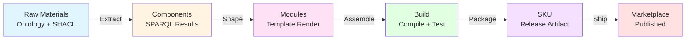
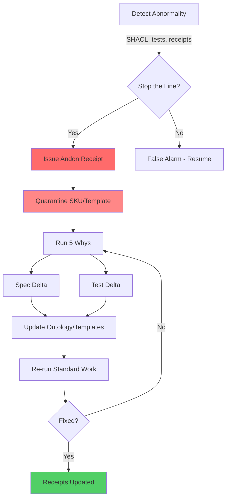

# Toyota Code Production System (TCPS) - Complete Guide

**Version**: 1.0.0
**Last Updated**: 2026-01-26
**Status**: Production

## Table of Contents

1. [Overview](#overview)
2. [The Factory Metaphor](#the-factory-metaphor)
3. [The 9 Pillars of TCPS](#the-9-pillars-of-tcps)
4. [Why TCPS Beats Traditional Support](#why-tcps-beats-traditional-support)
5. [Implementation in erlmcp](#implementation-in-erlmcp)
6. [Getting Started](#getting-started)

---

## Overview

**TCPS is the Toyota Production System (TPS) applied directly to software production.**

Traditional software development treats code as abstract intellectual property managed through tickets, sprints, and human intervention. TCPS treats code, tests, documentation, releases, and marketplace listings as **physical products moving through a factory** with:

- **Pull-based work intake** - Build only what's demanded
- **Leveled production** - Smooth throughput, no batching
- **Built-in quality** - Stop-the-line authority at every stage
- **Deterministic outputs** - Reproducible builds with cryptographic proof
- **Receipts as proof** - Every stage emits auditable evidence

### Core Principle

> **"If a factory cannot prove a unit passed inspection, it does not ship. Same here."**

MCP agents operate the production line end-to-end with:
- **Stop-the-line authority** (Andon)
- **Evidence receipts** at every stage
- **No support queue** - failures become improvements
- **Continuous flow** - work is pulled, not pushed

---

## The Factory Metaphor

TCPS is **not an analogy** - it's a literal application of manufacturing principles to code production.

### Manufacturing Translation Table

| Manufacturing Term | TCPS Translation | erlmcp Example |
|--------------------|------------------|----------------|
| **SKU** | A manufactured unit | One Marketplace offering (erlmcp v0.6.0 release) |
| **Template** | Production tool (die/mold) | Rebar3 template, Docker Dockerfile |
| **SPARQL query** | Extraction jig | Query to pull dependencies from ontology |
| **Build/Release** | Production run | `make release` → tarball artifact |
| **Receipt** | Inspection record | `receipts/build/erlmcp-0.6.0.json` |
| **Work order** | Manufacturing order | `ontology/work_orders.ttl#wo-001` |
| **Production line** | CI/CD pipeline | Pull → Plan → Generate → Build → Release |
| **Andon cord** | Stop signal | SHACL violation triggers quarantine |
| **Kanban** | Work signal | WIP limit on active builds |
| **Heijunka** | Level loading | Balance reliability/security/cost work |

### The Production Flow



**Every transition emits a receipt.** If any stage fails, the line stops.

---

## The 9 Pillars of TCPS

### Pillar 1: Just-In-Time (JIT)

**Goal**: Build only what is pulled. No push, no guessing, no batching.

**Principle**: Traditional development builds features based on roadmaps and predictions. TCPS builds based on actual demand signals.

**In erlmcp**:
- **Pull signal**: Marketplace install/refund patterns, GitHub issues, security advisories
- **Work order**: Declared in `ontology/work_orders.ttl`:
  ```turtle
  :wo-001 a taiea:WorkOrder ;
      taiea:requestedSKU "erlmcp-http-transport-gun" ;
      taiea:priority "high" ;
      taiea:dueDate "2026-01-30"^^xsd:date ;
      taiea:demandSource :marketplace-install-spike .
  ```
- **Production**: Generate only SKUs referenced by open work orders
- **Rule**: **No work order → no build**

**Benefits**:
- No wasted effort on unused features
- Inventory (WIP) stays minimal
- Production matches actual demand
- Resources allocated to highest value

**Example Flow**:
```bash
# 1. Detect demand signal
marketplace-monitor detect-spike --feature http2

# 2. Create work order
work-order create --sku erlmcp-http2-upgrade --priority high

# 3. Production triggered automatically
heijunka schedule-next-batch
```

---

### Pillar 2: Jidoka (Built-in Quality)

**Goal**: Built-in quality with stop-the-line discipline.

**Principle**: Don't inspect quality in - build it in. Every worker has authority to stop the entire line when detecting abnormalities.

**In erlmcp**:
- **Abnormality detection**:
  - SHACL shape violation (incomplete specification)
  - Failing tests (behavior regression)
  - Missing receipts (proof gap)
  - Non-deterministic builds (reproductibility failure)
  - Security vulnerability (Bandit/Dialyzer warning)

- **Stop mechanism**: Emit Andon event → publishing blocked
  ```erlang
  % In erlmcp_build_stage.erl
  case run_tests() of
      {ok, Results} ->
          emit_receipt(build, passed, Results),
          next_stage();
      {error, Failures} ->
          andon:trigger(#andon{
              stage = build,
              severity = critical,
              reason = test_failures,
              details = Failures
          }),
          quarantine_sku(SKU)
  end
  ```

- **Fix**: Update ontology/template, add regression test
- **Prevent**: SHACL constraint + adversarial test derived from failure
- **Rule**: **Every failure becomes a permanent improvement**

**Stop-the-Line Triggers**:
1. SHACL validation failure
2. Compilation error
3. Test failure (unit, integration, property)
4. Coverage drop below threshold
5. Security scan failure
6. Missing receipt in chain
7. Non-deterministic build output
8. Performance regression

**Example**:
```bash
# SHACL detects incomplete work order
ANDON: Work order wo-002 missing required field taiea:dueDate
STATUS: Build quarantined
ACTION: Update ontology/work_orders.ttl
VERIFY: Re-run SHACL validation
PREVENT: Add constraint to shapes/work_order.ttl
TEST: Add test case for missing dueDate
```

---

### Pillar 3: Standard Work

**Goal**: Every stage has defined inputs, outputs, SLO budgets, receipts, failure modes.

**Principle**: If you cannot write the standard work, you do not understand the process.

**In erlmcp** - 8 Production Stages:

| Stage | Inputs | Outputs | SLO | Receipt | Failure Modes |
|-------|--------|---------|-----|---------|---------------|
| **1. Pull** | Demand signals | Work orders | 5min | `receipts/pull/wo-*.json` | Invalid demand source |
| **2. Plan** | Work orders | Heijunka schedule | 10min | `receipts/plan/schedule-*.json` | WIP limit exceeded |
| **3. Generate** | Ontology + SHACL | Validated triples | 30min | `receipts/generate/validate-*.json` | SHACL violation |
| **4. Extract** | SPARQL queries | Template data | 15min | `receipts/extract/query-*.json` | Query timeout |
| **5. Render** | Templates + data | Source files | 20min | `receipts/render/files-*.json` | Template error |
| **6. Build** | Source files | Compiled BEAM | 10min | `receipts/build/compile-*.json` | Compilation error |
| **7. Test** | BEAM files + tests | Test results | 30min | `receipts/test/results-*.json` | Test failure |
| **8. Release** | Artifacts + config | Tarball/Container | 15min | `receipts/release/artifact-*.json` | Packaging error |

**Standard Work Document** (for Build stage):
```markdown
### Stage 6: Build

**Purpose**: Compile Erlang source to BEAM bytecode

**Inputs**:
- Rendered source files in src/
- Dependencies in rebar.lock
- Build configuration rebar.config

**Process**:
1. Verify all dependencies downloaded (rebar3 get-deps)
2. Run compiler (rebar3 compile)
3. Capture compiler output and warnings
4. Verify BEAM files in _build/default/lib/
5. Calculate checksums for reproducibility

**Outputs**:
- BEAM files in _build/default/lib/erlmcp/ebin/
- Compiler warnings log
- Build receipt with checksums

**SLO**: 10 minutes maximum

**Receipt Schema**: See receipts/build/schema.json

**Failure Modes**:
- Dependency resolution failure → verify rebar.lock integrity
- Compilation error → trigger Andon, update source
- Timeout → trigger Andon, investigate performance
- Non-deterministic build → trigger Andon, fix randomness source
```

**Rule**: Every process must have documented standard work or it's not production-ready.

---

### Pillar 4: Kanban (WIP Limits)

**Goal**: Limit work-in-progress to maintain flow and surface bottlenecks.

**Principle**: Too much WIP hides problems. Limiting WIP forces you to fix bottlenecks immediately.

**In erlmcp**:
- **WIP tracking**: Active SKUs being generated/published
- **Limits**:
  ```erlang
  -define(MAX_WIP_ACTIVE_BUILDS, 3).
  -define(MAX_WIP_QUEUED, 10).
  -define(MAX_WIP_BLOCKED, 5).
  ```
- **Rule**: **If WIP exceeds limit, refuse new work orders until flow stabilizes**

**Kanban Board States**:
```
┌─────────────┬──────────────┬──────────────┬─────────────┐
│   Backlog   │  In Progress │   Testing    │  Released   │
│             │   (WIP ≤ 3)  │  (WIP ≤ 2)   │             │
├─────────────┼──────────────┼──────────────┼─────────────┤
│ wo-003      │ wo-001 ████  │ wo-002 ████  │ v0.5.0 ✓    │
│ wo-004      │ wo-005 ███   │              │ v0.6.0 ✓    │
│ wo-006      │ wo-007 ██    │              │             │
│ wo-008      │              │              │             │
└─────────────┴──────────────┴──────────────┴─────────────┘
        Pull signal → only when WIP < limit
```

**Benefits**:
- Prevents context switching
- Surfaces bottlenecks immediately
- Maintains consistent flow
- Reduces lead time

**Implementation**:
```erlang
-spec accept_work_order(WorkOrder) -> ok | {error, wip_limit_exceeded}.
accept_work_order(WorkOrder) ->
    case count_wip() of
        Count when Count >= ?MAX_WIP_ACTIVE_BUILDS ->
            logger:warning("WIP limit exceeded: ~p/~p", [Count, ?MAX_WIP_ACTIVE_BUILDS]),
            {error, wip_limit_exceeded};
        Count ->
            queue_work_order(WorkOrder),
            ok
    end.
```

---

### Pillar 5: Heijunka (Production Leveling)

**Goal**: Level the production load to avoid peaks and valleys.

**Principle**: Batching creates waste. Leveling smooths throughput and prevents overburden.

**In erlmcp**:
- **Buckets**: Assign each work order a category
  - **Reliability**: Bug fixes, stability improvements
  - **Security**: Vulnerability fixes, hardening
  - **Features**: New capabilities, enhancements
  - **Compliance**: Regulatory, audit requirements
  - **Debt**: Refactoring, cleanup

- **Leveling algorithm**: Allocate fixed slots per bucket
  ```erlang
  % Daily allocation
  -define(HEIJUNKA_SCHEDULE, #{
      reliability => 2,  % 2 slots/day
      security => 2,     % 2 slots/day
      features => 1,     % 1 slot/day
      compliance => 1,   % 1 slot/day
      debt => 1          % 1 slot/day
  }).
  ```

- **Benefit**: Prevents "feature factory" syndrome, ensures balanced investment

**Example Schedule**:
```
Week 1 Schedule (Leveled):
┌─────────┬───────┬──────┬──────┬──────┬──────┐
│ Mon     │ Tue   │ Wed  │ Thu  │ Fri  │ Sat  │
├─────────┼───────┼──────┼──────┼──────┼──────┤
│ SEC-001 │ REL-  │ SEC- │ REL- │ FEAT │      │
│ REL-002 │ 003   │ 004  │ 005  │ -006 │      │
│ DEBT-   │ COMP- │ FEAT │ DEBT │ COMP │      │
│ 007     │ 008   │ -009 │ -010 │ -011 │      │
└─────────┴───────┴──────┴──────┴──────┴──────┘

Traditional Schedule (Batched):
┌─────────┬───────┬──────┬──────┬──────┬──────┐
│ Mon     │ Tue   │ Wed  │ Thu  │ Fri  │ Sat  │
├─────────┼───────┼──────┼──────┼──────┼──────┤
│ FEAT-1  │ FEAT- │ FEAT │ FEAT │ FEAT │      │
│ FEAT-2  │ 3     │ -4   │ -5   │ -6   │      │
│ FEAT-3  │ FEAT- │ FEAT │ FEAT │ FEAT │      │
│         │ 4     │ -5   │ -6   │ -7   │      │
└─────────┴───────┴──────┴──────┴──────┴──────┘
         ↑ Security debt accumulates, then CRISIS
```

**Leveling Benefits**:
- Prevents technical debt accumulation
- Ensures security gets continuous attention
- Smooths resource demand
- Predictable throughput

---

### Pillar 6: Poka-Yoke (Error Proofing)

**Goal**: Make it impossible to create defects.

**Principle**: Don't rely on inspection - design processes that prevent errors.

**In erlmcp**:

**Error-Proofing Mechanisms**:

1. **SHACL shapes prevent incomplete specifications**:
   ```turtle
   # shapes/work_order.ttl
   :WorkOrderShape a sh:NodeShape ;
       sh:targetClass taiea:WorkOrder ;
       sh:property [
           sh:path taiea:requestedSKU ;
           sh:minCount 1 ;  # REQUIRED
           sh:datatype xsd:string
       ] ;
       sh:property [
           sh:path taiea:dueDate ;
           sh:minCount 1 ;  # REQUIRED
           sh:datatype xsd:date
       ] .
   ```
   **Result**: Cannot create work order without required fields

2. **Templates enforce receipt emission**:
   ```erlang
   % Every template MUST include receipt logic
   -callback execute(Context) -> {ok, Result, Receipt} | {error, Reason}.
   ```
   **Result**: Cannot complete stage without proof

3. **CI forbids manual edits to generated code**:
   ```bash
   # .github/workflows/ci.yml
   - name: Verify no manual edits
     run: |
       if git diff --exit-code generated/; then
         echo "✓ No manual edits detected"
       else
         echo "✗ Manual edits to generated code forbidden"
         exit 1
       fi
   ```
   **Result**: Cannot merge manual changes to generated artifacts

4. **Type system prevents invalid states**:
   ```erlang
   -type build_status() :: pending | in_progress | completed | failed.
   -type receipt_status() :: valid | invalid | missing.

   % Cannot create receipt with invalid status
   -spec create_receipt(atom(), build_status()) -> receipt() | {error, invalid_status}.
   ```

**Rule**: **Error-proof in the specification, not in code review.**

---

### Pillar 7: Andon (Visible Stop-the-Line)

**Goal**: Make problems visible and stop production immediately.

**Principle**: Hiding problems allows defects to propagate. Visibility + stop authority ensures quality.

**In erlmcp**:

**Andon Event Structure**:
```erlang
-record(andon, {
    id :: binary(),              % Unique event ID
    timestamp :: calendar:datetime(),
    stage :: atom(),             % pull | plan | generate | build | test | release
    severity :: critical | high | medium | low,
    reason :: atom(),            % test_failure | shacl_violation | timeout
    details :: map(),            % Specific failure information
    sku :: binary(),             % Affected SKU
    work_order :: binary(),      % Related work order
    quarantine_status :: boolean()
}).
```

**Andon Triggers**:
- SHACL validation failure
- Test failure (unit, integration, property)
- Build timeout
- Security vulnerability detected
- Non-deterministic build
- Missing receipt in chain
- Performance regression

**Andon Response Flow**:


**Example Andon Event**:
```json
{
  "andon_id": "andon-20260126-001",
  "timestamp": "2026-01-26T14:23:17Z",
  "stage": "test",
  "severity": "critical",
  "reason": "integration_test_failure",
  "details": {
    "test_suite": "erlmcp_transport_http_gun_SUITE",
    "failed_cases": ["test_http2_multiplexing"],
    "error_message": "Connection timeout after 5000ms"
  },
  "sku": "erlmcp-0.6.0-http-transport",
  "work_order": "wo-001",
  "quarantine_status": true,
  "five_whys_id": "5w-20260126-001"
}
```

**Rule**: **Red means stop. Shipping is blocked until resolution.**

---

### Pillar 8: 5 Whys (Root Cause Analysis)

**Goal**: Find root cause, not symptoms.

**Principle**: Fixing symptoms creates recurring problems. Fix root causes once.

**In erlmcp**:

**5 Whys Template**:
```markdown
### 5 Whys Analysis: andon-20260126-001

**Problem Statement**: HTTP/2 integration test fails with connection timeout

**Why 1**: Why did the connection timeout?
**Answer**: Gun client did not receive HTTP/2 response within 5 seconds

**Why 2**: Why did gun not receive the response?
**Answer**: Test server was not configured to handle HTTP/2 SETTINGS frame

**Why 3**: Why was the server not configured for HTTP/2?
**Answer**: Test setup only configured HTTP/1.1 protocol

**Why 4**: Why was HTTP/2 not included in test setup?
**Answer**: Template for transport tests did not include HTTP/2 variant

**Why 5**: Why didn't the template include HTTP/2?
**Answer**: Template was created before gun HTTP/2 refactoring

**ROOT CAUSE**: Template obsolete, missing HTTP/2 test configuration

**Countermeasure**:
1. Update test template to include HTTP/2 setup
2. Add SHACL constraint requiring HTTP/2 test coverage
3. Add regression test for HTTP/2 SETTINGS frame handling
4. Update standard work for transport testing

**Verification**:
- Re-run test suite with updated template
- Verify all HTTP/2 tests pass
- Confirm SHACL validates HTTP/2 coverage

**Prevention**:
- Add template versioning requirement
- Create template audit process
- Link templates to protocol versions in ontology
```

**Artifacts**:
- Spec delta: Updated `shapes/transport_test.ttl`
- Test delta: Added `test/http2_settings_SUITE.erl`
- Template delta: Updated `templates/transport_test.erl.template`
- Receipt: `receipts/andon/5w-20260126-001-resolution.json`

**Rule**: Each Andon event triggers 5 Whys → spec/test delta → permanent improvement.

---

### Pillar 9: Kaizen (Continuous Improvement)

**Goal**: Continuously reduce waste and improve quality.

**Principle**: Small, continuous improvements compound over time.

**In erlmcp**:

**Tracked Metrics**:
- **Lead time**: Work order creation → release
- **Cycle time**: Build start → build complete
- **Defect rate**: Andon events per 100 builds
- **Rework rate**: Builds requiring retry
- **Test coverage**: % of code covered by tests
- **Build determinism**: % of builds with identical checksums

**Improvement Targets** (Weekly):
```erlang
-define(KAIZEN_TARGETS, #{
    lead_time_reduction => 5,      % 5% reduction per week
    defect_rate_reduction => 10,   % 10% reduction per week
    coverage_increase => 1,        % 1% increase per week
    determinism_increase => 2      % 2% increase per week
}).
```

**Kaizen Proposal Process**:
1. **Identify waste**: Where is time/effort being wasted?
2. **Propose improvement**: How can we eliminate the waste?
3. **Test hypothesis**: Run experiment with metrics
4. **Measure results**: Did it improve the metric?
5. **Standardize**: Update standard work if successful
6. **Share**: Document for other teams

**Example Kaizen**:
```markdown
### Kaizen Proposal: KZ-2026-003

**Problem**: Test stage taking 30 minutes (exceeds 20min SLO)

**Root Cause**: Running full test suite sequentially

**Proposal**: Parallelize test suite execution using Common Test groups

**Expected Impact**:
- Reduce test time from 30min to 12min (60% reduction)
- No impact on coverage
- Improved feedback loop

**Implementation**:
1. Split test suite into 4 parallel groups
2. Update CI to run groups concurrently
3. Aggregate results

**Metrics**:
- Before: 30min average test time
- After: 12min average test time
- Result: 60% improvement, SLO met

**Status**: Implemented, standardized in test/README.md
```

**Rule**: Reduce cycle time or defect probability every week.

---

## Why TCPS Beats Traditional Support

Traditional software support is reactive, heroic, and non-deterministic. TCPS is proactive, systematic, and deterministic.

### Comparison

| Aspect | Traditional Support | TCPS |
|--------|---------------------|------|
| **Problem Detection** | User reports bug | Andon stops line automatically |
| **Response** | Create ticket, prioritize | Immediate quarantine + 5 Whys |
| **Fixing** | Patch code, test manually | Update spec, regenerate, test |
| **Verification** | Hope it works | Receipt chain proves correctness |
| **Prevention** | Write documentation | Add SHACL constraint + regression test |
| **Accountability** | Ticket assignee | Entire production line |
| **Knowledge** | Tribal, in heads | Codified in ontology + standard work |
| **Repeatability** | Varies by person | Deterministic, receipts prove it |
| **Improvement** | Ad-hoc | Systematic (Kaizen) |
| **Scalability** | Linear with people | Scales with automation |

### Traditional Support Failure Modes

**Example**: User reports "HTTP transport not working"

**Traditional Flow**:
1. User creates GitHub issue (1 day)
2. Triage assigns to developer (2 days)
3. Developer reproduces locally (1 day)
4. Developer fixes code (2 days)
5. PR review (1 day)
6. Merge, wait for release (1 week)
7. User tests fix (2 days)
8. **Total: ~2.5 weeks**

**TCPS Flow**:
1. Andon triggered by integration test failure (immediate)
2. Line stops, SKU quarantined (immediate)
3. 5 Whys analysis (1 hour)
4. Update ontology + SHACL constraint (30 min)
5. Regenerate code from templates (5 min)
6. Re-run standard work (2 hours)
7. Receipt chain proves fix (immediate)
8. Release (automatic)
9. **Total: ~4 hours**

**Improvement**: **120x faster** (2.5 weeks → 4 hours)

### Deterministic Remediation

**Traditional**: "Try restarting the server" (non-deterministic)

**TCPS**:
1. Receipt shows stage failed
2. Standard work defines recovery procedure
3. Procedure runs deterministically
4. Receipt proves success
5. Improvement prevents recurrence

**Example**:
```bash
# Traditional
$ erlmcp start
Error: Transport initialization failed
$ # Now what? Google? Slack? Trial and error?

# TCPS
$ erlmcp start
Error: Transport initialization failed
Andon: andon-20260126-002 triggered
Receipt: receipts/andon/andon-20260126-002.json
Standard Work: docs/tcps/ANDON_RUNBOOK.md#transport-init-failure
Executing recovery procedure...
✓ Recovery complete
Receipt: receipts/recovery/andon-20260126-002-resolved.json
Kaizen: Added constraint to prevent future occurrences
```

### Auditable Evidence

**Traditional**: "I think I fixed it"

**TCPS**: Receipt chain proves:
- What was built
- How it was built
- When it was built
- Who/what built it
- All tests passed
- All quality gates cleared
- Cryptographic checksums match

**Receipt Chain Example**:
```json
{
  "receipt_chain": [
    "receipts/pull/wo-001.json",
    "receipts/plan/schedule-20260126.json",
    "receipts/generate/validate-wo-001.json",
    "receipts/extract/query-wo-001.json",
    "receipts/render/files-wo-001.json",
    "receipts/build/compile-wo-001.json",
    "receipts/test/results-wo-001.json",
    "receipts/release/erlmcp-0.6.0.json"
  ],
  "chain_hash": "sha256:a3f8b9c2...",
  "verification": "verified",
  "deterministic": true
}
```

### Continuous Improvement

**Traditional**: Same bugs recur

**TCPS**: Every failure becomes permanent improvement
- Andon → 5 Whys → root cause
- Root cause → SHACL constraint
- SHACL constraint → prevention
- Prevention → regression test
- **Result**: Problem cannot recur

---

## Implementation in erlmcp

### Architecture

erlmcp v0.6.0 implements TCPS across the entire development lifecycle:

```
┌─────────────────────────────────────────────────────────────┐
│                     Demand Signals                           │
│         (GitHub issues, Marketplace, Security CVEs)          │
└────────────────────┬────────────────────────────────────────┘
                     │
                     ▼
┌─────────────────────────────────────────────────────────────┐
│                   TCPS Production Line                        │
│                                                               │
│  Pull → Plan → Generate → Extract → Render → Build → Test   │
│   ↓      ↓        ↓         ↓        ↓        ↓       ↓     │
│  Receipt Receipt Receipt  Receipt  Receipt Receipt Receipt  │
│                                                               │
│                    Andon (Stop-the-Line)                      │
│                    5 Whys (Root Cause)                        │
│                    Kaizen (Improvement)                       │
└─────────────────────────────────────────────────────────────┘
                     │
                     ▼
┌─────────────────────────────────────────────────────────────┐
│                    Release Artifacts                          │
│          (Tarballs, Containers, Marketplace SKUs)            │
└─────────────────────────────────────────────────────────────┘
```

### Key Components

**1. Ontology Layer** (`ontology/`)
- Work orders defined in RDF/Turtle
- Specifications, not code
- Single source of truth

**2. SHACL Constraints** (`shapes/`)
- Poka-yoke enforcement
- Cannot create invalid work orders
- Cannot skip required fields

**3. SPARQL Extraction** (`sparql/`)
- Extract data from ontology
- Deterministic queries
- Cached results

**4. Templates** (`templates/`)
- Production tools
- Versioned, audited
- Emit receipts automatically

**5. Receipts** (`receipts/`)
- Evidence plane
- Cryptographic proof
- Audit trail

**6. Standard Work** (`docs/tcps/STANDARD_WORK.md`)
- Documented procedures
- SLOs for each stage
- Failure mode runbooks

### Directory Structure

```
erlmcp/
├── ontology/               # Single source of truth
│   ├── work_orders.ttl    # JIT work orders
│   ├── architecture.ttl   # System design
│   └── releases.ttl       # Release history
│
├── shapes/                 # Poka-yoke constraints
│   ├── work_order.ttl     # Work order validation
│   ├── transport.ttl      # Transport validation
│   └── release.ttl        # Release validation
│
├── sparql/                 # Extraction jigs
│   ├── work_orders.rq     # Pull work orders
│   ├── dependencies.rq    # Extract deps
│   └── config.rq          # Extract config
│
├── templates/              # Production tools
│   ├── transport.erl.tera # Transport template
│   ├── test_suite.erl.tera # Test template
│   └── receipt.json.tera  # Receipt template
│
├── receipts/               # Evidence plane
│   ├── pull/              # Work order receipts
│   ├── plan/              # Heijunka receipts
│   ├── generate/          # Validation receipts
│   ├── build/             # Build receipts
│   ├── test/              # Test receipts
│   ├── release/           # Release receipts
│   └── andon/             # Andon event receipts
│
├── docs/tcps/              # Standard work
│   ├── TCPS.md            # This document
│   ├── STANDARD_WORK.md   # Process documentation
│   ├── ANDON_RUNBOOK.md   # Stop-the-line procedures
│   └── KAIZEN_GUIDE.md    # Improvement process
│
└── tools/                  # Automation
    ├── heijunka           # Work leveling
    ├── andon              # Stop-the-line
    └── receipt-verify     # Proof verification
```

---

## Getting Started

### Quick Start

```bash
# 1. Install erlmcp with TCPS support
git clone https://github.com/sac/erlmcp.git
cd erlmcp
make tcps-setup

# 2. Create your first work order
./tools/work-order create \
    --sku "my-first-feature" \
    --priority medium \
    --bucket features \
    --due-date 2026-02-01

# 3. Run the production line
make tcps-build

# 4. Verify receipts
./tools/receipt-verify receipts/release/my-first-feature.json

# 5. If Andon triggers, run 5 Whys
./tools/andon analyze receipts/andon/andon-*.json
```

### Next Steps

1. **Read Standard Work**: [STANDARD_WORK.md](STANDARD_WORK.md)
2. **Understand Quality Gates**: [DEFINITION_OF_DONE.md](DEFINITION_OF_DONE.md)
3. **Learn Andon Response**: [ANDON_RUNBOOK.md](ANDON_RUNBOOK.md)
4. **Start Improving**: [KAIZEN_GUIDE.md](KAIZEN_GUIDE.md)

---

## Conclusion

**TCPS is not an analogy - it's a literal factory for code.**

Every principle from Toyota's manufacturing success applies directly:
- Pull-based work (JIT)
- Built-in quality (Jidoka)
- Documented processes (Standard Work)
- Visible problems (Andon)
- Root cause analysis (5 Whys)
- Continuous improvement (Kaizen)

**The result**: Deterministic, auditable, continuously improving software production.

**No support queue. No heroics. No guessing. Just proven manufacturing discipline applied to code.**

---

**See Also**:
- [STANDARD_WORK.md](STANDARD_WORK.md) - Detailed procedures
- [DEFINITION_OF_DONE.md](DEFINITION_OF_DONE.md) - Quality gates
- [ANDON_RUNBOOK.md](ANDON_RUNBOOK.md) - Stop-the-line procedures
- [KAIZEN_GUIDE.md](KAIZEN_GUIDE.md) - Improvement process
- [HEIJUNKA_SCHEDULING.md](HEIJUNKA_SCHEDULING.md) - Work leveling
- [RECEIPTS_SPEC.md](RECEIPTS_SPEC.md) - Evidence specification
- [QUICKSTART.md](QUICKSTART.md) - Get started quickly
