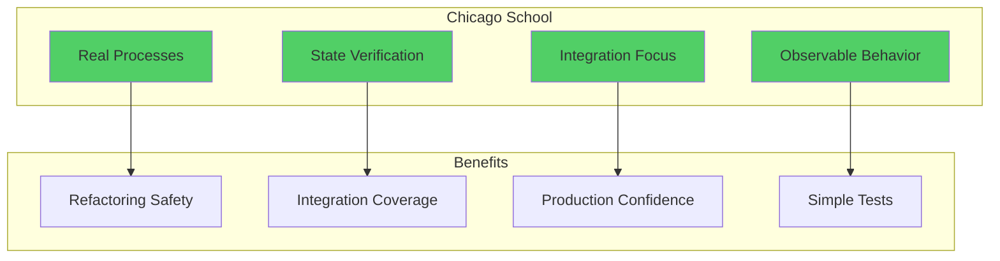
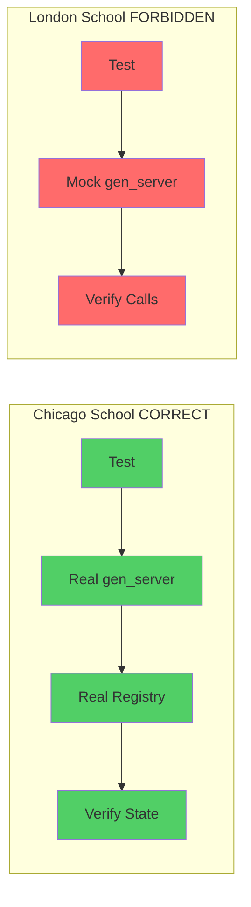
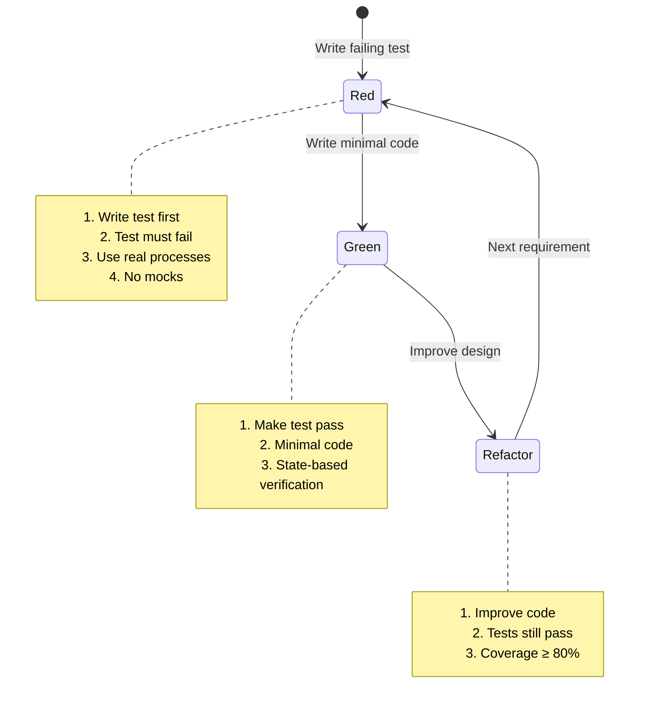

# Chicago School TDD for erlmcp

**Version:** 3.0.0
**Last Updated:** 2026-02-06
**Status:** Production-Ready

---

## Table of Contents

1. [Overview](#overview)
2. [Chicago vs London School](#chicago-vs-london-school)
3. [Core Principles](#core-principles)
4. [Red-Green-Refactor Cycle](#red-green-refactor-cycle)
5. [Testing gen_server Processes](#testing-genserver-processes)
6. [Testing Supervision Trees](#testing-supervision-trees)
7. [Testing Distributed Systems](#testing-distributed-systems)
8. [Anti-Patterns to Avoid](#anti-patterns-to-avoid)
9. [Real-World Examples](#real-world-examples)

---

## Overview

erlmcp follows the **Chicago School** (Detroit School) of Test-Driven Development. This approach emphasizes testing the observable behavior of systems using real collaborators, in contrast to the London School which relies heavily on mocks and interaction testing.

### Philosophy

> "Test what the system **does**, not **how** it does it."



---

## Chicago vs London School

### Comparison Matrix

| Aspect | Chicago School (erlmcp) | London School (FORBIDDEN) |
|--------|-------------------------|---------------------------|
| **Collaborators** | ✅ Real gen_server processes | ❌ Mock objects |
| **Verification** | ✅ State-based (API calls) | ❌ Interaction-based (call counts) |
| **Focus** | ✅ Observable behavior | ❌ Implementation details |
| **Integration** | ✅ Test components together | ❌ Isolate everything |
| **Refactoring** | ✅ Safe (tests don't break) | ❌ Brittle (tests break often) |
| **Confidence** | ✅ High (real system tested) | ❌ Low (mocks ≠ reality) |

### Visual Comparison



---

## Core Principles

### 1. Real Collaborators

**Always use real processes.** Never mock gen_servers, supervisors, or OTP components.

#### ✅ CORRECT (Chicago School)

```erlang
test_server_registration() ->
    % Start REAL gen_server
    {ok, Server} = erlmcp_server:start_link({stdio, #{test_mode => true}}),

    % Register with REAL registry
    ok = erlmcp_registry:register(my_server, Server),

    % Verify state via API
    {ok, RegisteredPid} = erlmcp_registry:lookup(my_server),

    % Assert observable state
    ?assertEqual(Server, RegisteredPid),
    ?assert(is_process_alive(Server)),

    % Cleanup
    erlmcp_server:stop(Server).
```

#### ❌ FORBIDDEN (London School)

```erlang
test_server_registration_WRONG() ->
    % ❌ FORBIDDEN: Mocking gen_server
    meck:new(erlmcp_server),
    meck:expect(erlmcp_server, start_link, fun(_) -> {ok, fake_pid} end),

    % ❌ FORBIDDEN: Mocking registry
    meck:new(erlmcp_registry),
    meck:expect(erlmcp_registry, register, fun(_, _) -> ok end),

    % ❌ FORBIDDEN: Verifying interactions
    ?assert(meck:called(erlmcp_registry, register, [my_server, fake_pid])).
    % This tests NOTHING about real behavior!
```

### 2. State-Based Verification

**Test observable state**, not internal calls or implementation details.

#### ✅ CORRECT (Observable State)

```erlang
test_client_initialization() ->
    {ok, Client} = erlmcp_client:start_link({stdio, #{test_mode => true}}),

    % Initialize client
    ClientInfo = #{
        protocolVersion => <<"2024-11-05">>,
        capabilities => #{},
        clientInfo => #{name => <<"test">>, version => <<"1.0.0">>}
    },
    {ok, ServerInfo} = erlmcp_client:initialize(Client, ClientInfo),

    % Verify observable state (what changed)
    ?assertMatch(#{capabilities := _, serverInfo := _}, ServerInfo),

    % Verify client can now make requests (behavior changed)
    {ok, Resources} = erlmcp_client:list_resources(Client),
    ?assert(is_list(Resources)),

    erlmcp_client:stop(Client).
```

#### ❌ FORBIDDEN (Internal State)

```erlang
test_client_initialization_WRONG() ->
    {ok, Client} = erlmcp_client:start_link({stdio, #{test_mode => true}}),

    % ❌ FORBIDDEN: Accessing internal state
    State = sys:get_state(Client),
    ?assertEqual(initialized, State#state.phase),

    % ❌ FORBIDDEN: Testing implementation
    ?assert(State#state.internal_buffer =:= []).
```

### 3. Observable Behavior

**Test what the system does** (outputs, effects), not how it does it (internals).

#### ✅ CORRECT (Observable Effects)

```erlang
test_tool_execution() ->
    {ok, Server} = erlmcp_server:start_link({stdio, #{test_mode => true}}),

    % Execute tool
    Args = #{input => <<"test data">>},
    {ok, Result} = erlmcp_server:call_tool(Server, <<"echo_tool">>, Args),

    % Verify observable output
    ?assertMatch(#{
        content := [#{
            type := text,
            text := <<"test data">>
        }]
    }, Result),

    erlmcp_server:stop(Server).
```

#### ❌ FORBIDDEN (Implementation Details)

```erlang
test_tool_execution_WRONG() ->
    % ❌ FORBIDDEN: Testing how tool is called internally
    ?assert(tool_handler_called_with_correct_args()),
    ?assert(result_formatter_received_raw_output()).
```

### 4. Integration Focus

**Test components together** whenever practical. Prefer integration over isolation.

#### ✅ CORRECT (Integration)

```erlang
test_complete_message_flow() ->
    % Start all real components
    {ok, Client} = erlmcp_client:start_link({stdio, #{test_mode => true}}),
    {ok, Server} = erlmcp_server:start_link({stdio, #{test_mode => true}}),

    % Register server
    ok = erlmcp_registry:register(test_server, Server),

    % Initialize client
    ClientInfo = #{
        protocolVersion => <<"2024-11-05">>,
        capabilities => #{},
        clientInfo => #{name => <<"test">>, version => <<"1.0.0">>}
    },
    {ok, _} = erlmcp_client:initialize(Client, ClientInfo),

    % Test complete flow: Client → Registry → Server → Response
    {ok, Tools} = erlmcp_client:list_tools(Client),
    ?assert(is_list(Tools)),

    % Cleanup
    erlmcp_client:stop(Client),
    erlmcp_server:stop(Server).
```

#### ❌ FORBIDDEN (Over-Isolation)

```erlang
test_complete_message_flow_WRONG() ->
    % ❌ FORBIDDEN: Mocking every component
    meck:new(erlmcp_client),
    meck:new(erlmcp_registry),
    meck:new(erlmcp_server),

    % This tests NOTHING about real integration!
```

---

## Red-Green-Refactor Cycle

### The Cycle



### Step-by-Step Example

#### Step 1: Red (Failing Test)

```erlang
% File: apps/erlmcp_core/test/erlmcp_registry_tests.erl

test_basic_registration() ->
    % Start registry (not implemented yet)
    {ok, Registry} = erlmcp_registry:start_link(),

    % Register process
    ok = erlmcp_registry:register(Registry, test_key, self()),

    % Lookup
    {ok, self()} = erlmcp_registry:lookup(Registry, test_key),

    % Stop
    ok = erlmcp_registry:stop(Registry).

% Run test:
% $ docker compose run --rm erlmcp-unit rebar3 eunit --module=erlmcp_registry_tests
%
% Expected output:
% erlmcp_registry_tests: test_basic_registration...*failed*
% Reason: erlmcp_registry:start_link/0 is undefined
```

#### Step 2: Green (Minimal Implementation)

```erlang
% File: apps/erlmcp_core/src/erlmcp_registry.erl

-module(erlmcp_registry).
-behaviour(gen_server).

-export([start_link/0, register/3, lookup/2, stop/1]).
-export([init/1, handle_call/3, handle_cast/2, handle_info/2, terminate/2]).

-record(state, {
    entries = #{} :: map()
}).

start_link() ->
    gen_server:start_link(?MODULE, [], []).

register(Registry, Key, Pid) ->
    gen_server:call(Registry, {register, Key, Pid}).

lookup(Registry, Key) ->
    gen_server:call(Registry, {lookup, Key}).

stop(Registry) ->
    gen_server:stop(Registry).

init([]) ->
    {ok, #state{}}.

handle_call({register, Key, Pid}, _From, State) ->
    NewEntries = maps:put(Key, Pid, State#state.entries),
    {reply, ok, State#state{entries = NewEntries}};

handle_call({lookup, Key}, _From, State) ->
    case maps:get(Key, State#state.entries, undefined) of
        undefined -> {reply, {error, not_found}, State};
        Pid -> {reply, {ok, Pid}, State}
    end.

handle_cast(_Msg, State) ->
    {noreply, State}.

handle_info(_Info, State) ->
    {noreply, State}.

terminate(_Reason, _State) ->
    ok.

% Run test:
% $ docker compose run --rm erlmcp-unit rebar3 eunit --module=erlmcp_registry_tests
%
% Expected output:
% erlmcp_registry_tests: test_basic_registration...ok
% All tests passed.
```

#### Step 3: Refactor (Improve Design)

```erlang
% Add process monitoring (refactor)

test_automatic_cleanup() ->
    {ok, Registry} = erlmcp_registry:start_link(),

    % Spawn process
    Pid = spawn(fun() -> receive stop -> ok end end),

    % Register
    ok = erlmcp_registry:register(Registry, test_key, Pid),

    % Verify registered
    {ok, Pid} = erlmcp_registry:lookup(Registry, test_key),

    % Kill process
    exit(Pid, kill),
    timer:sleep(50),

    % Verify automatic cleanup
    {error, not_found} = erlmcp_registry:lookup(Registry, test_key),

    ok = erlmcp_registry:stop(Registry).

% Refactor implementation:
handle_call({register, Key, Pid}, _From, State) ->
    % Monitor process for automatic cleanup
    erlang:monitor(process, Pid),
    NewEntries = maps:put(Key, Pid, State#state.entries),
    {reply, ok, State#state{entries = NewEntries}}.

handle_info({'DOWN', _Ref, process, Pid, _Reason}, State) ->
    % Remove dead process
    NewEntries = maps:filter(fun(_, V) -> V =/= Pid end, State#state.entries),
    {noreply, State#state{entries = NewEntries}}.

% Tests still pass + new test passes!
```

---

## Testing gen_server Processes

### Pattern: Lifecycle Testing

```erlang
%%====================================================================
%% gen_server Lifecycle Test Pattern
%%====================================================================

gen_server_lifecycle_test_() ->
    {setup,
     fun setup_server/0,
     fun cleanup_server/1,
     fun(Server) ->
        [?_test(test_server_starts(Server)),
         ?_test(test_server_initialization(Server)),
         ?_test(test_server_api_calls(Server)),
         ?_test(test_server_stops(Server))]
     end}.

setup_server() ->
    {ok, Server} = erlmcp_server:start_link({stdio, #{test_mode => true}}),
    Server.

cleanup_server(Server) ->
    erlmcp_server:stop(Server),
    timer:sleep(50).  % Allow cleanup

test_server_starts(Server) ->
    % Verify server is alive
    ?assert(is_process_alive(Server)),
    ?assert(is_pid(Server)).

test_server_initialization(Server) ->
    % Before initialization, requests should fail
    Result = erlmcp_server:list_resources(Server),
    ?assertMatch({error, {not_initialized, pre_initialization, _}}, Result),

    % Initialize
    ClientInfo = #{
        protocolVersion => <<"2024-11-05">>,
        capabilities => #{},
        clientInfo => #{name => <<"test">>, version => <<"1.0.0">>}
    },
    {ok, _} = erlmcp_server:initialize(Server, ClientInfo),

    % After initialization, requests should succeed
    {ok, Resources} = erlmcp_server:list_resources(Server),
    ?assert(is_list(Resources)).

test_server_api_calls(Server) ->
    % Test all public API operations
    {ok, Tools} = erlmcp_server:list_tools(Server),
    ?assert(is_list(Tools)),

    {ok, Prompts} = erlmcp_server:list_prompts(Server),
    ?assert(is_list(Prompts)).

test_server_stops(Server) ->
    % Stop server
    ok = erlmcp_server:stop(Server),
    timer:sleep(50),

    % Verify stopped
    ?assertNot(is_process_alive(Server)).
```

### Pattern: State Transitions

```erlang
%%====================================================================
%% State Machine Testing
%%====================================================================

state_transitions_test() ->
    {ok, Server} = erlmcp_server:start_link({stdio, #{test_mode => true}}),

    % State 1: pre_initialization
    % Can't make requests yet
    ?assertMatch({error, {not_initialized, pre_initialization, _}},
                 erlmcp_server:list_resources(Server)),

    % Transition to: initialized
    ClientInfo = #{
        protocolVersion => <<"2024-11-05">>,
        capabilities => #{},
        clientInfo => #{name => <<"test">>, version => <<"1.0.0">>}
    },
    {ok, _} = erlmcp_server:initialize(Server, ClientInfo),

    % State 2: initialized
    % Now requests work
    {ok, Resources} = erlmcp_server:list_resources(Server),
    ?assert(is_list(Resources)),

    % Can't re-initialize
    ?assertMatch({error, {already_initialized, _}},
                 erlmcp_server:initialize(Server, ClientInfo)),

    erlmcp_server:stop(Server).
```

### Pattern: Error Handling

```erlang
%%====================================================================
%% Error Handling Tests
%%====================================================================

error_handling_test() ->
    {ok, Server} = erlmcp_server:start_link({stdio, #{test_mode => true}}),

    % Invalid protocol version
    BadClientInfo = #{
        protocolVersion => <<"invalid">>,
        capabilities => #{},
        clientInfo => #{name => <<"test">>, version => <<"1.0.0">>}
    },
    ?assertMatch({error, {invalid_protocol_version, _}},
                 erlmcp_server:initialize(Server, BadClientInfo)),

    % Missing required fields
    IncompleteInfo = #{capabilities => #{}},
    ?assertMatch({error, {missing_field, _}},
                 erlmcp_server:initialize(Server, IncompleteInfo)),

    % Invalid method
    ?assertMatch({error, {method_not_found, _}},
                 erlmcp_server:call_method(Server, <<"invalid_method">>, #{})),

    erlmcp_server:stop(Server).
```

---

## Testing Supervision Trees

### Pattern: Supervisor Restart

```erlang
%%====================================================================
%% Supervision Tree Testing
%%====================================================================

supervisor_restart_test() ->
    % Start supervisor
    {ok, Sup} = erlmcp_sup:start_link(),

    % Get supervised child
    Children = supervisor:which_children(Sup),
    {erlmcp_registry, RegistryPid, worker, _} =
        lists:keyfind(erlmcp_registry, 1, Children),

    % Verify child is alive
    ?assert(is_process_alive(RegistryPid)),

    % Kill child (simulate crash)
    exit(RegistryPid, kill),
    timer:sleep(100),  % Allow supervisor to restart

    % Verify supervisor restarted child
    NewChildren = supervisor:which_children(Sup),
    {erlmcp_registry, NewPid, worker, _} =
        lists:keyfind(erlmcp_registry, 1, NewChildren),

    % New PID should be different
    ?assertNot(RegistryPid =:= NewPid),
    ?assert(is_process_alive(NewPid)),

    % Cleanup
    supervisor:terminate_child(Sup, erlmcp_registry).
```

### Pattern: Supervision Strategy

```erlang
%%====================================================================
%% one_for_all Strategy Test
%%====================================================================

one_for_all_test() ->
    % Start supervisor with one_for_all strategy
    {ok, Sup} = erlmcp_core_sup:start_link(),

    % Get all children
    Children = supervisor:which_children(Sup),
    Pids = [Pid || {_Name, Pid, _Type, _Modules} <- Children, is_pid(Pid)],

    % Kill one child
    [FirstPid | _] = Pids,
    exit(FirstPid, kill),
    timer:sleep(100),

    % Verify ALL children restarted (one_for_all)
    NewChildren = supervisor:which_children(Sup),
    NewPids = [Pid || {_Name, Pid, _Type, _Modules} <- NewChildren, is_pid(Pid)],

    % All PIDs should be different
    ?assertEqual(length(Pids), length(NewPids)),
    lists:foreach(fun(OldPid) ->
        ?assertNot(lists:member(OldPid, NewPids))
    end, Pids).
```

### Pattern: Restart Intensity

```erlang
%%====================================================================
%% Restart Intensity Test (prevent crash loops)
%%====================================================================

restart_intensity_test() ->
    % Supervisor configured with: intensity=3, period=5 (seconds)
    {ok, Sup} = my_sup:start_link(),

    % Get child spec
    {ok, {_Strategy, Specs}} = supervisor:get_childspec(Sup),
    [{_, {M, F, A}, Restart, _, _, _}] = Specs,

    % Crash child 3 times (within intensity limit)
    lists:foreach(fun(_) ->
        {ok, Child} = supervisor:start_child(Sup, child_spec()),
        exit(Child, kill),
        timer:sleep(100)
    end, [1, 2, 3]),

    % Supervisor should still be alive
    ?assert(is_process_alive(Sup)),

    % 4th crash should kill supervisor (exceeds intensity)
    {ok, Child4} = supervisor:start_child(Sup, child_spec()),
    exit(Child4, kill),
    timer:sleep(100),

    ?assertNot(is_process_alive(Sup)).
```

---

## Testing Distributed Systems

### Pattern: Multi-Node Setup

```erlang
%%====================================================================
%% Distributed System Testing (Common Test)
%%====================================================================

init_per_suite(Config) ->
    % Start distributed nodes
    {ok, Node1} = ct_slave:start(node1, [
        {boot_timeout, 10},
        {init_timeout, 10},
        {startup_timeout, 10}
    ]),
    {ok, Node2} = ct_slave:start(node2, [
        {boot_timeout, 10},
        {init_timeout, 10},
        {startup_timeout, 10}
    ]),

    % Start application on both nodes
    ok = rpc:call(Node1, application, ensure_all_started, [erlmcp_core]),
    ok = rpc:call(Node2, application, ensure_all_started, [erlmcp_core]),

    % Verify nodes connected
    ?assert(lists:member(Node2, rpc:call(Node1, erlang, nodes, []))),

    [{node1, Node1}, {node2, Node2} | Config].

end_per_suite(Config) ->
    Node1 = ?config(node1, Config),
    Node2 = ?config(node2, Config),

    ct_slave:stop(Node1),
    ct_slave:stop(Node2),

    ok.
```

### Pattern: Distributed Registry

```erlang
%%====================================================================
%% Distributed Registry Test
%%====================================================================

distributed_registry_test(Config) ->
    Node1 = ?config(node1, Config),
    Node2 = ?config(node2, Config),

    % Register process on Node1
    Pid1 = rpc:call(Node1, erlang, self, []),
    ok = rpc:call(Node1, erlmcp_registry, register, [test_proc, Pid1]),

    % Lookup from Node2 (should find via distributed registry)
    {ok, Pid1} = rpc:call(Node2, erlmcp_registry, lookup, [test_proc]),

    % Verify it's the same process
    ?assertEqual(Pid1, Pid1),

    ok.
```

### Pattern: Network Partition

```erlang
%%====================================================================
%% Network Partition Test
%%====================================================================

network_partition_test(Config) ->
    Node1 = ?config(node1, Config),
    Node2 = ?config(node2, Config),

    % Disconnect nodes (simulate partition)
    true = rpc:call(Node1, erlang, disconnect_node, [Node2]),
    timer:sleep(100),

    % Verify disconnected
    ?assertNot(lists:member(Node2, rpc:call(Node1, erlang, nodes, []))),

    % Each node should still function independently
    ok = rpc:call(Node1, erlmcp_registry, register, [node1_proc, self()]),
    ok = rpc:call(Node2, erlmcp_registry, register, [node2_proc, self()]),

    % Reconnect
    true = rpc:call(Node1, net_kernel, connect_node, [Node2]),
    timer:sleep(100),

    % Verify reconnected
    ?assert(lists:member(Node2, rpc:call(Node1, erlang, nodes, []))),

    % Verify both registrations survived
    {ok, _} = rpc:call(Node1, erlmcp_registry, lookup, [node1_proc]),
    {ok, _} = rpc:call(Node2, erlmcp_registry, lookup, [node2_proc]),

    ok.
```

---

## Anti-Patterns to Avoid

### ❌ Anti-Pattern 1: Mocking gen_server

```erlang
% DON'T DO THIS!
test_with_mocks_WRONG() ->
    meck:new(erlmcp_server),
    meck:expect(erlmcp_server, handle_call,
                fun({list_resources, _}, _From, State) ->
                    {reply, {ok, []}, State}
                end),

    % This tests NOTHING about real server behavior!
    {ok, []} = erlmcp_server:list_resources(fake_pid).
```

**Why it's wrong:**
- Tests fake behavior, not real code
- Breaks on refactoring
- No confidence in production
- Violates Chicago School principles

**Correct approach:**
```erlang
% DO THIS instead!
test_with_real_server_CORRECT() ->
    {ok, Server} = erlmcp_server:start_link({stdio, #{test_mode => true}}),
    {ok, _} = erlmcp_server:initialize(Server, client_info()),
    {ok, Resources} = erlmcp_server:list_resources(Server),
    ?assert(is_list(Resources)),
    erlmcp_server:stop(Server).
```

### ❌ Anti-Pattern 2: Testing Private Functions

```erlang
% DON'T DO THIS!
test_private_function_WRONG() ->
    % Testing internal helper
    ?assertEqual(42, erlmcp_server:internal_calculate_value(21, 2)).
```

**Why it's wrong:**
- Tests implementation, not behavior
- Breaks on refactoring
- Couples tests to internals

**Correct approach:**
```erlang
% DO THIS instead!
test_public_behavior_CORRECT() ->
    {ok, Server} = erlmcp_server:start_link({stdio, #{test_mode => true}}),
    {ok, Result} = erlmcp_server:public_operation(Server, Args),
    ?assertEqual(expected_output, Result),
    erlmcp_server:stop(Server).
```

### ❌ Anti-Pattern 3: Verifying Call Counts

```erlang
% DON'T DO THIS!
test_call_counts_WRONG() ->
    meck:new(erlmcp_registry),

    % Call function
    erlmcp_server:do_something(),

    % Verify registry was called exactly once
    ?assert(meck:called(erlmcp_registry, register, '_', 1)).
```

**Why it's wrong:**
- Tests implementation (how), not behavior (what)
- Brittle - breaks on refactoring
- No value for production

**Correct approach:**
```erlang
% DO THIS instead!
test_observable_state_CORRECT() ->
    {ok, Server} = erlmcp_server:start_link({stdio, #{test_mode => true}}),

    % Perform operation
    ok = erlmcp_server:do_something(Server),

    % Verify observable effect
    {ok, RegisteredPid} = erlmcp_registry:lookup(expected_key),
    ?assert(is_process_alive(RegisteredPid)),

    erlmcp_server:stop(Server).
```

### ❌ Anti-Pattern 4: Over-Isolation

```erlang
% DON'T DO THIS!
test_isolated_WRONG() ->
    % Mock everything
    meck:new(erlmcp_client),
    meck:new(erlmcp_server),
    meck:new(erlmcp_registry),
    meck:new(erlmcp_transport),

    % Test one tiny piece in complete isolation
    % This provides NO integration confidence!
```

**Correct approach:**
```erlang
% DO THIS instead!
test_integration_CORRECT() ->
    % Start all REAL components
    {ok, Client} = erlmcp_client:start_link({stdio, #{test_mode => true}}),
    {ok, Server} = erlmcp_server:start_link({stdio, #{test_mode => true}}),

    % Test them working TOGETHER
    ok = erlmcp_registry:register(test_server, Server),
    {ok, _} = erlmcp_client:initialize(Client, client_info()),
    {ok, Tools} = erlmcp_client:list_tools(Client),

    ?assert(is_list(Tools)),

    erlmcp_client:stop(Client),
    erlmcp_server:stop(Server).
```

---

## Real-World Examples

### Example 1: Complete Client-Server Test

```erlang
%%====================================================================
%% Real-World Example: Complete Message Flow
%%====================================================================

complete_flow_test() ->
    % Start all components (NO MOCKS!)
    {ok, Server} = erlmcp_server:start_link({stdio, #{test_mode => true}}),
    {ok, Client} = erlmcp_client:start_link({stdio, #{test_mode => true}}),

    % Register server
    ok = erlmcp_registry:register(test_server, Server),

    % Initialize client
    ClientInfo = #{
        protocolVersion => <<"2024-11-05">>,
        capabilities => #{
            experimental => #{},
            sampling => #{}
        },
        clientInfo => #{
            name => <<"test_client">>,
            version => <<"1.0.0">>
        }
    },

    {ok, ServerInfo} = erlmcp_client:initialize(Client, ClientInfo),

    % Verify server info
    ?assertMatch(#{
        protocolVersion := <<"2024-11-05">>,
        capabilities := _,
        serverInfo := _
    }, ServerInfo),

    % List resources
    {ok, Resources} = erlmcp_client:list_resources(Client),
    ?assert(is_list(Resources)),

    % List tools
    {ok, Tools} = erlmcp_client:list_tools(Client),
    ?assert(is_list(Tools)),

    % Call a tool
    ToolArgs = #{input => <<"test input">>},
    {ok, ToolResult} = erlmcp_client:call_tool(Client, <<"echo_tool">>, ToolArgs),

    ?assertMatch(#{
        content := [#{
            type := text,
            text := <<"test input">>
        }]
    }, ToolResult),

    % Read a resource
    {ok, ResourceContent} = erlmcp_client:read_resource(Client, <<"test://resource">>),
    ?assertMatch([#{type := text}], ResourceContent),

    % Cleanup
    erlmcp_client:stop(Client),
    erlmcp_server:stop(Server).
```

### Example 2: Supervision Tree Integration

```erlang
%%====================================================================
%% Real-World Example: Full Supervision Tree
%%====================================================================

supervision_integration_test() ->
    % Start top-level supervisor
    {ok, TopSup} = erlmcp_sup:start_link(),

    % Verify all critical children started
    Children = supervisor:which_children(TopSup),

    % Check erlmcp_core_sup
    {erlmcp_core_sup, CoreSup, supervisor, _} =
        lists:keyfind(erlmcp_core_sup, 1, Children),
    ?assert(is_pid(CoreSup)),

    % Check registry
    {erlmcp_registry, Registry, worker, _} =
        lists:keyfind(erlmcp_registry, 1, Children),
    ?assert(is_pid(Registry)),

    % Verify registry works
    TestPid = spawn(fun() -> receive stop -> ok end end),
    ok = erlmcp_registry:register(Registry, test_key, TestPid),
    {ok, TestPid} = erlmcp_registry:lookup(Registry, test_key),

    % Kill registry (test restart)
    exit(Registry, kill),
    timer:sleep(100),

    % Verify supervisor restarted registry
    NewChildren = supervisor:which_children(TopSup),
    {erlmcp_registry, NewRegistry, worker, _} =
        lists:keyfind(erlmcp_registry, 1, NewChildren),

    ?assertNot(Registry =:= NewRegistry),
    ?assert(is_process_alive(NewRegistry)),

    % Old registration should be gone (new registry)
    {error, not_found} = erlmcp_registry:lookup(NewRegistry, test_key),

    % Cleanup
    TestPid ! stop,
    ok = supervisor:terminate_child(TopSup, erlmcp_core_sup).
```

### Example 3: Error Recovery

```erlang
%%====================================================================
%% Real-World Example: Error Recovery
%%====================================================================

error_recovery_test() ->
    {ok, Server} = erlmcp_server:start_link({stdio, #{test_mode => true}}),

    % Initialize normally
    ClientInfo = #{
        protocolVersion => <<"2024-11-05">>,
        capabilities => #{},
        clientInfo => #{name => <<"test">>, version => <<"1.0.0">>}
    },
    {ok, _} = erlmcp_server:initialize(Server, ClientInfo),

    % Trigger error condition (invalid tool)
    Result1 = erlmcp_server:call_tool(Server, <<"nonexistent_tool">>, #{}),
    ?assertMatch({error, {tool_not_found, _}}, Result1),

    % Verify server still functional after error
    {ok, Tools} = erlmcp_server:list_tools(Server),
    ?assert(is_list(Tools)),

    % Trigger another error (invalid parameters)
    Result2 = erlmcp_server:call_tool(Server, <<"test_tool">>, invalid_params),
    ?assertMatch({error, {invalid_params, _}}, Result2),

    % Server should still work
    {ok, Resources} = erlmcp_server:list_resources(Server),
    ?assert(is_list(Resources)),

    erlmcp_server:stop(Server).
```

---

## Summary

### Chicago School Checklist

When writing tests, ensure:

- [ ] ✅ Using real gen_server processes
- [ ] ✅ No mocks (meck, mocking libraries)
- [ ] ✅ State-based verification (API calls)
- [ ] ✅ Testing observable behavior
- [ ] ✅ Integration over isolation
- [ ] ✅ Cleanup processes after tests
- [ ] ✅ Tests are deterministic
- [ ] ✅ Coverage ≥ 80%

### Key Principles

1. **Real Processes** - Always use actual OTP components
2. **Observable State** - Test via public API, not internals
3. **Behavior Focus** - Test what system does, not how
4. **Integration** - Test components together
5. **Refactoring Safety** - Tests survive implementation changes

### Anti-Patterns to Avoid

1. ❌ Mocking gen_servers
2. ❌ Testing private functions
3. ❌ Verifying call counts
4. ❌ Over-isolation
5. ❌ Testing implementation details

---

**Last Updated:** 2026-02-06
**Version:** 3.0.0
**Status:** Production-Ready ✅
