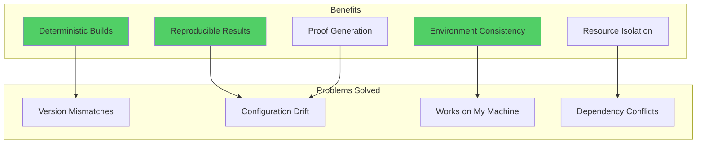
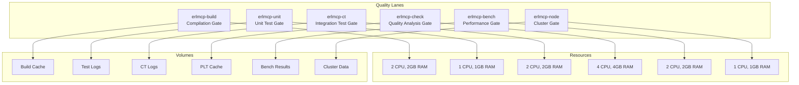
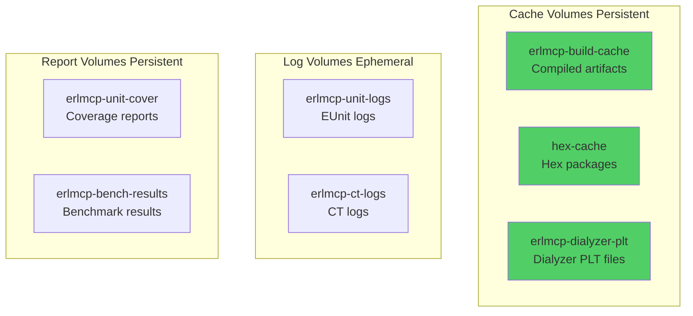

# Docker-Based Testing for erlmcp

**Version:** 3.0.0
**Last Updated:** 2026-02-06
**Status:** Production-Ready

---

## Table of Contents

1. [Overview](#overview)
2. [Docker-Only Constitution](#docker-only-constitution)
3. [Quality Lane Architecture](#quality-lane-architecture)
4. [Execution Commands](#execution-commands)
5. [Proof & Receipts](#proof--receipts)
6. [Resource Management](#resource-management)
7. [Volume Management](#volume-management)
8. [Troubleshooting](#troubleshooting)

---

## Overview

erlmcp enforces **Docker-only execution** for all development, testing, and quality operations. This ensures deterministic builds, reproducible results, and environment consistency across all platforms.

### Why Docker-Only?



---

## Docker-Only Constitution

### CRITICAL RULES

**FORBIDDEN on host:**
```bash
# ❌ These commands are BLOCKED on host
rebar3 compile
rebar3 eunit
rebar3 ct
rebar3 dialyzer
rebar3 xref
make compile
make test
erl
erlc
```

**REQUIRED via Docker:**
```bash
# ✅ All operations via Docker quality lanes
docker compose run --rm erlmcp-build make compile
docker compose run --rm erlmcp-unit make eunit
docker compose run --rm erlmcp-ct make ct
docker compose run --rm erlmcp-check make check
```

### Enforcement: ANDON System

If you attempt host execution, you'll see:

```
╔════════════════════════════════════════════════════════════════════╗
║                                                                    ║
║   🚨 ANDON: FORBIDDEN_HOST_EXECUTION 🚨                           ║
║                                                                    ║
╚════════════════════════════════════════════════════════════════════╝

Refusal Code: FORBIDDEN_HOST_EXECUTION
Constitution: DOCKER-ONLY CONSTITUTION

Target: compile
Detected: HOST (forbidden)

✅ CORRECT EXECUTION:
   docker compose run --rm erlmcp-build make compile
```

---

## Quality Lane Architecture

### Lane Mapping



### Service Definitions

#### erlmcp-build: Compilation Gate

```yaml
erlmcp-build:
  image: erlmcp:3.0.0-build
  container_name: erlmcp-build
  networks:
    - erlmcp-network
  environment:
    ERLMCP_ENV: build
    ERLMCP_PROFILE: dev
    OTP_VERSION: 28
    REBAR_NO_USER_CONFIG: "true"
    ERL_COMPILER_OPTIONS: deterministic
  deploy:
    resources:
      limits:
        cpus: '2.0'
        memory: '2G'
        pids: 4096
  volumes:
    - .:/workspace:cached
    - erlmcp-build-cache:/workspace/_build
    - hex-cache:/root/.cache/rebar3
  working_dir: /workspace
  command: ["exec make $$MAKE_TARGET"]
```

**Usage:**
```bash
docker compose run --rm erlmcp-build make compile
docker compose run --rm erlmcp-build rebar3 compile
```

#### erlmcp-unit: Unit Test Gate

```yaml
erlmcp-unit:
  image: erlmcp:3.0.0-unit
  container_name: erlmcp-unit
  environment:
    ERLMCP_ENV: test
    ERLMCP_PROFILE: test
    EUNIT_OPTS: "-verbose"
    COVER_ENABLED: "true"
    COVER_EXPORT_ENABLED: "true"
  deploy:
    resources:
      limits:
        cpus: '1.0'
        memory: '1G'
  volumes:
    - .:/workspace:cached
    - erlmcp-unit-logs:/workspace/log/eunit
    - erlmcp-unit-cover:/workspace/_build/test/cover
  command: ["exec make $$MAKE_TARGET"]
```

**Usage:**
```bash
docker compose run --rm erlmcp-unit make eunit
docker compose run --rm erlmcp-unit rebar3 eunit --cover
docker compose run --rm erlmcp-unit rebar3 eunit --module=erlmcp_json_rpc_tests
```

#### erlmcp-ct: Common Test Gate

```yaml
erlmcp-ct:
  image: erlmcp:3.0.0-ct
  container_name: erlmcp-ct
  environment:
    ERLMCP_ENV: test
    CT_OPTS: "-logdir log/ct"
    COVER_ENABLED: "true"
    CT_RUN_SUITE_TIMEOUT: 3600
  deploy:
    resources:
      limits:
        cpus: '2.0'
        memory: '2G'
  volumes:
    - .:/workspace:cached
    - erlmcp-ct-logs:/workspace/log/ct
    - erlmcp-ct-cover:/workspace/_build/test/cover
  command: ["exec make $$MAKE_TARGET"]
```

**Usage:**
```bash
docker compose run --rm erlmcp-ct make ct
docker compose run --rm erlmcp-ct rebar3 ct
docker compose run --rm erlmcp-ct rebar3 ct --suite=erlmcp_registry_SUITE
```

#### erlmcp-check: Quality Analysis Gate

```yaml
erlmcp-check:
  image: erlmcp:3.0.0-check
  container_name: erlmcp-check
  environment:
    ERLMCP_ENV: analysis
    DIALYZER_PLT_APPS: all_deps
    DIALYZER_INCREMENTAL: "true"
    COVERAGE_THRESHOLD: 80
  deploy:
    resources:
      limits:
        cpus: '4.0'
        memory: '4G'  # Dialyzer needs memory
  volumes:
    - .:/workspace:cached
    - erlmcp-dialyzer-plt:/workspace/_build/default
    - erlmcp-check-cover:/workspace/_build/test/cover
  command: ["exec make $$MAKE_TARGET"]
```

**Usage:**
```bash
docker compose run --rm erlmcp-check make check
docker compose run --rm erlmcp-check rebar3 dialyzer
docker compose run --rm erlmcp-check rebar3 xref
docker compose run --rm erlmcp-check rebar3 cover --verbose
docker compose run --rm erlmcp-check make validate
```

#### erlmcp-bench: Performance Gate

```yaml
erlmcp-bench:
  image: erlmcp:3.0.0-bench
  container_name: erlmcp-bench
  environment:
    ERLMCP_ENV: benchmark
    BENCHMARK_REGRESSION_THRESHOLD: 10
    BENCHMARK_ITERATIONS: 1000
  deploy:
    resources:
      limits:
        cpus: '2.0'
        memory: '2G'
  volumes:
    - .:/workspace:cached
    - erlmcp-bench-results:/workspace/bench/results
    - erlmcp-bench-baselines:/workspace/bench/baselines
  command: ["exec make $$MAKE_TARGET"]
```

**Usage:**
```bash
docker compose run --rm erlmcp-bench make benchmark
docker compose run --rm erlmcp-bench make benchmark-nine-nines
```

---

## Execution Commands

### Compilation

```bash
# Full compilation
docker compose run --rm erlmcp-build make compile

# Specific app
docker compose run --rm erlmcp-build make compile-core

# Clean build
docker compose run --rm erlmcp-build make clean compile
```

### Unit Tests

```bash
# All EUnit tests
docker compose run --rm erlmcp-unit make eunit

# Specific module
docker compose run --rm erlmcp-unit rebar3 eunit --module=erlmcp_server_tests

# With coverage
docker compose run --rm erlmcp-unit rebar3 eunit --cover

# Verbose output
docker compose run --rm erlmcp-unit rebar3 eunit --verbose
```

### Integration Tests

```bash
# All CT suites
docker compose run --rm erlmcp-ct make ct

# Specific suite
docker compose run --rm erlmcp-ct rebar3 ct --suite=erlmcp_integration_SUITE

# Specific test case
docker compose run --rm erlmcp-ct rebar3 ct --suite=erlmcp_registry_SUITE --case=test_registration

# With coverage
docker compose run --rm erlmcp-ct rebar3 ct --cover
```

### Quality Analysis

```bash
# All checks
docker compose run --rm erlmcp-check make check

# Dialyzer (type checking)
docker compose run --rm erlmcp-check rebar3 dialyzer

# Xref (cross-reference)
docker compose run --rm erlmcp-check rebar3 xref

# Coverage report
docker compose run --rm erlmcp-check rebar3 cover --verbose

# Full validation (all gates)
docker compose run --rm erlmcp-check make validate
```

### Benchmarks

```bash
# Quick benchmarks
docker compose run --rm erlmcp-bench make benchmark

# Nine-nines validation
docker compose run --rm erlmcp-bench make benchmark-nine-nines

# Regression check
docker compose run --rm erlmcp-bench make validate-bench
```

### Full Pipeline

```bash
# Run all quality gates sequentially
docker compose run --rm erlmcp-build make compile && \
docker compose run --rm erlmcp-unit make eunit && \
docker compose run --rm erlmcp-ct make ct && \
docker compose run --rm erlmcp-check make check && \
docker compose run --rm erlmcp-bench make benchmark

# Or use the validate target
docker compose run --rm erlmcp-check make validate
```

---

## Proof & Receipts

### Receipt Generation

Every Docker execution produces a proof receipt containing:

```
receipt(hash(
    git_sha ∥
    image_digest ∥
    service ∥
    cmd ∥
    exit_code ∥
    stdout ∥
    stderr ∥
    timestamp
))
```

### Capturing Receipts

```bash
# Capture full execution proof
docker compose run --rm erlmcp-unit make eunit 2>&1 | tee /tmp/eunit-receipt-$(date +%s).log

# Extract key information
git_sha=$(git rev-parse HEAD)
image_digest=$(docker inspect erlmcp:3.0.0-unit | jq -r '.[0].RepoDigests[0]')
timestamp=$(date -Iseconds)

echo "Receipt:"
echo "  Git SHA: $git_sha"
echo "  Image: $image_digest"
echo "  Timestamp: $timestamp"
```

### Receipt Verification

```bash
# Verify receipt authenticity
sha256sum /tmp/eunit-receipt-*.log

# Verify reproducibility
docker compose run --rm erlmcp-unit make eunit > /tmp/run1.log 2>&1
docker compose run --rm erlmcp-unit make eunit > /tmp/run2.log 2>&1
diff /tmp/run1.log /tmp/run2.log  # Should be identical
```

---

## Resource Management

### Resource Limits

Each quality lane has specific resource limits to prevent resource exhaustion:

```yaml
deploy:
  resources:
    limits:
      cpus: '2.0'        # Maximum CPU cores
      memory: '2G'       # Maximum memory
      pids: 4096         # Maximum processes
    reservations:
      cpus: '1.0'        # Guaranteed CPU
      memory: '1G'       # Guaranteed memory
```

### Monitoring Resource Usage

```bash
# Real-time stats
docker stats erlmcp-build

# Inspect resource limits
docker inspect erlmcp-build | jq '.[0].HostConfig.Resources'

# Check container processes
docker compose exec erlmcp-build ps aux
```

### Adjusting Resources

Edit `docker-compose.yml` or use environment variables:

```bash
# Increase memory for dialyzer
ERLMCP_CHECK_MEMORY_LIMIT=6G docker compose run --rm erlmcp-check make check

# Increase CPU for parallel tests
ERLMCP_UNIT_CPU_LIMIT=4.0 docker compose run --rm erlmcp-unit make eunit
```

---

## Volume Management

### Volume Types



### Volume Commands

```bash
# List volumes
docker volume ls | grep erlmcp

# Inspect volume
docker volume inspect erlmcp-build-cache

# Clean cache volumes (force rebuild)
docker volume rm erlmcp-build-cache
docker volume rm erlmcp-dialyzer-plt

# Clean log volumes
docker volume rm erlmcp-unit-logs erlmcp-ct-logs

# Clean all erlmcp volumes (CAUTION)
docker volume ls -q | grep erlmcp | xargs docker volume rm
```

### Accessing Logs

```bash
# View EUnit logs
docker compose run --rm erlmcp-unit cat /workspace/_build/test/logs/eunit.log

# View CT logs
docker compose run --rm erlmcp-ct ls -la /workspace/log/ct/

# Copy coverage report to host
docker compose run --rm erlmcp-check tar czf - _build/test/cover | tar xzf -

# Interactive access
docker compose run --rm erlmcp-unit /bin/sh
```

---

## Troubleshooting

### Issue 1: Permission Denied

**Symptom:**
```
Permission denied: /workspace/_build
```

**Cause:** Volume permission mismatch between host and container.

**Solution:**
```bash
# Fix ownership
docker compose run --rm erlmcp-build chown -R $(id -u):$(id -g) /workspace

# Or rebuild with correct user
docker compose build --build-arg UID=$(id -u) --build-arg GID=$(id -g) erlmcp-build
```

### Issue 2: Out of Memory

**Symptom:**
```
Killed (OOM)
```

**Cause:** Container exceeded memory limit (common with dialyzer).

**Solution:**
```bash
# Increase memory limit
ERLMCP_CHECK_MEMORY_LIMIT=6G docker compose run --rm erlmcp-check rebar3 dialyzer

# Or permanently in docker-compose.yml
# memory: '6G'
```

### Issue 3: Slow Build

**Symptom:**
```
Compilation takes 10+ minutes
```

**Cause:** No build cache, or cache volume deleted.

**Solution:**
```bash
# Verify cache volume exists
docker volume inspect erlmcp-build-cache

# Recreate if missing
docker volume create erlmcp-build-cache

# Use cached mode for volume
# volumes:
#   - .:/workspace:cached  # Ensures cache
```

### Issue 4: Network Issues

**Symptom:**
```
Could not reach hex.pm
```

**Cause:** Container network configuration.

**Solution:**
```bash
# Check network
docker network inspect erlmcp-network

# Recreate network
docker network rm erlmcp-network
docker network create erlmcp-network

# Test connectivity
docker compose run --rm erlmcp-build ping -c 3 hex.pm
```

### Issue 5: Stale Artifacts

**Symptom:**
```
Tests fail with old code
```

**Cause:** Cached build artifacts not invalidated.

**Solution:**
```bash
# Clean and rebuild
docker compose run --rm erlmcp-build make clean
docker compose run --rm erlmcp-build make compile

# Or remove cache volume
docker volume rm erlmcp-build-cache
docker compose run --rm erlmcp-build make compile
```

### Debug Commands

```bash
# Interactive shell in build container
docker compose run --rm erlmcp-build /bin/sh

# Check environment variables
docker compose run --rm erlmcp-build env | grep ERLMCP

# Verify OTP version
docker compose run --rm erlmcp-build erl -version

# Test rebar3
docker compose run --rm erlmcp-build rebar3 version

# Check disk space
docker compose run --rm erlmcp-build df -h

# Check memory
docker compose run --rm erlmcp-build free -h
```

---

## Best Practices

### 1. Always Use Docker

Never run compilation or tests on host. Always use Docker quality lanes.

```bash
# ❌ WRONG
rebar3 compile

# ✅ CORRECT
docker compose run --rm erlmcp-build make compile
```

### 2. Capture Receipts

Always capture execution receipts for audit trail.

```bash
docker compose run --rm erlmcp-unit make eunit 2>&1 | tee receipts/eunit-$(date +%Y%m%d-%H%M%S).log
```

### 3. Clean Build for Release

Before release, always do a clean build.

```bash
docker volume rm erlmcp-build-cache
docker compose run --rm erlmcp-build make compile
docker compose run --rm erlmcp-check make validate
```

### 4. Monitor Resources

Monitor resource usage to optimize limits.

```bash
docker stats --no-stream erlmcp-build erlmcp-unit erlmcp-ct erlmcp-check
```

### 5. Use Specific Tags

Pin Docker image tags for reproducibility.

```yaml
# Don't use :latest
image: erlmcp:latest  # ❌

# Use specific version
image: erlmcp:3.0.0-build  # ✅
```

---

## Summary

### Key Points

1. **Docker-Only Execution** - All operations via Docker quality lanes
2. **Quality Gates** - Compile, test, coverage, analysis, benchmarks
3. **Proof Generation** - Every execution produces verifiable receipt
4. **Resource Isolation** - Controlled CPU, memory, and PID limits
5. **Deterministic Builds** - Same inputs always produce same outputs

### Quality Lane Quick Reference

| Lane | Service | Purpose | Command |
|------|---------|---------|---------|
| Compile | erlmcp-build | Build code | `docker compose run --rm erlmcp-build make compile` |
| Unit | erlmcp-unit | EUnit tests | `docker compose run --rm erlmcp-unit make eunit` |
| Integration | erlmcp-ct | CT suites | `docker compose run --rm erlmcp-ct make ct` |
| Analysis | erlmcp-check | Dialyzer/xref | `docker compose run --rm erlmcp-check make check` |
| Benchmark | erlmcp-bench | Performance | `docker compose run --rm erlmcp-bench make benchmark` |
| Cluster | erlmcp-node | Distributed | `docker compose run --rm erlmcp-node make test-cluster` |

---

**Last Updated:** 2026-02-06
**Version:** 3.0.0
**Status:** Production-Ready ✅
