# erlmcp Testing Documentation

**Version:** 3.0.0
**Last Updated:** 2026-02-06
**OTP Requirements:** 28.3.1+
**Status:** Production-Ready ✅

---

## Welcome

This directory contains comprehensive testing documentation for the **erlmcp** project. Our testing approach is built on three pillars:

1. **Chicago School TDD** - Real processes, no mocks, state-based verification
2. **Docker-Only Execution** - All tests run via Docker quality lanes
3. **Zero-Defect Quality** - errors=0, failures=0, coverage≥80%

---

## Quick Start

### For New Team Members

**Start here:**

1. Read **[QUICK_REFERENCE.md](QUICK_REFERENCE.md)** - 5-minute overview
2. Follow **[TESTING_GUIDE.md](TESTING_GUIDE.md)** - Complete guide
3. Review **[CHICAGO_SCHOOL_TDD.md](CHICAGO_SCHOOL_TDD.md)** - TDD patterns

**Run your first test:**

```bash
# Compile
docker compose run --rm erlmcp-build make compile

# Run unit tests
docker compose run --rm erlmcp-unit make eunit

# Check coverage
docker compose run --rm erlmcp-check rebar3 cover --verbose
```

### For Experienced Developers

**Daily workflow:**

```bash
# Full quality pipeline
docker compose run --rm erlmcp-build make compile && \
docker compose run --rm erlmcp-unit make eunit && \
docker compose run --rm erlmcp-ct make ct && \
docker compose run --rm erlmcp-check make validate
```

**Quick checks:**

```bash
# Fast unit tests
docker compose run --rm erlmcp-unit make eunit

# Specific module
docker compose run --rm erlmcp-unit rebar3 eunit --module=erlmcp_json_rpc_tests

# Coverage validation
docker compose run --rm erlmcp-check make validate-coverage
```

---

## Documentation Structure

### 🎯 Core Guides (START HERE)

| Document | Purpose | Lines | When to Read |
|----------|---------|-------|--------------|
| **[QUICK_REFERENCE.md](QUICK_REFERENCE.md)** | Fast command lookup | 300+ | Every day |
| **[TESTING_GUIDE.md](TESTING_GUIDE.md)** | Complete testing guide | 1,200+ | First week |
| **[DOCKER_TESTING.md](DOCKER_TESTING.md)** | Docker execution | 800+ | Setup phase |
| **[CHICAGO_SCHOOL_TDD.md](CHICAGO_SCHOOL_TDD.md)** | TDD patterns | 1,000+ | Writing tests |

### 📚 Deep Dive Documentation

| Document | Purpose | Audience |
|----------|---------|----------|
| [TESTING_ARCHITECTURE.md](TESTING_ARCHITECTURE.md) | System architecture | Architects |
| [TEST_PATTERNS_LIBRARY.md](TEST_PATTERNS_LIBRARY.md) | Pattern catalog | Engineers |
| [TESTING_WORKFLOWS.md](TESTING_WORKFLOWS.md) | Step-by-step guides | All |
| [coverage-analysis.md](coverage-analysis.md) | Coverage metrics | Managers |
| [integration-tests.md](integration-tests.md) | CT patterns | Engineers |
| [tdd-strategy.md](tdd-strategy.md) | TDD methodology | All |

### 📋 Reference Materials

| Document | Purpose |
|----------|---------|
| [TESTING_DOCUMENTATION_INDEX.md](TESTING_DOCUMENTATION_INDEX.md) | Complete index |
| [TEST_COVERAGE_SUMMARY.md](TEST_COVERAGE_SUMMARY.md) | Coverage status |
| [TEST_COVERAGE_PLAN.md](TEST_COVERAGE_PLAN.md) | Coverage roadmap |
| [AUTOMATED_VALIDATION.md](AUTOMATED_VALIDATION.md) | Quality automation |

---

## Testing Philosophy

### Chicago School TDD

erlmcp follows the **Chicago School** (Detroit School) of Test-Driven Development:

### Testing Philosophy

```mermaid
graph TB
    A[Code Change] --> B{Write Test First}
    B -->|Yes| C[Test Fails]
    B -->|No| X[❌ Violation]
    C --> D[Implement Minimum Code]
    D --> E[Test Passes]
    E --> F{Real Collaborators?}
    F -->|Yes| G[State-Based Verification]
    F -->|No| X[❌ No Mocking Allowed]
    G --> H{Coverage ≥ 80%}
    H -->|Yes| I[✅ Production-Ready]
    H -->|No| J[Add More Tests]
    J --> C

    style X fill:#ff6b6b
    style I fill:#51cf66
```



### Test Suite Architecture


### Test File Organization


---

## Quick Reference

### Test Execution

```bash
# Run all tests
make test

# Run specific test suite
rebar3 eunit --module=erlmcp_server_tests
rebar3 ct --suite=erlmcp_registry_SUITE

# Property-based testing
rebar3 proper -c

# Coverage report
rebar3 cover --verbose
```

### Quality Gates

```bash
# Comprehensive validation
make quality-strict

# Individual checks
make test-strict        # ≥90% pass rate
make coverage-strict    # ≥80% coverage
make benchmark-strict   # <10% regression

# TCPS manufacturing
make jidoka            # 自働化 - Built-in quality
make poka-yoke         # ポカヨケ - Error-proofing
```

---

## Test Categories

### 1. Unit Tests (EUnit)

**Purpose:** Test individual modules in isolation
**Location:** `apps/*/test/<module>_tests.erl`
**Coverage:** ≥85% for core modules


**Example Structure:**
```erlang
-module(erlmcp_server_tests).
-include_lib("eunit/include/eunit.hrl").

server_test_() ->
    {setup,
     fun() -> {ok, Pid} = erlmcp_server:start_link(), Pid end,
     fun(Pid) -> ok = erlmcp_server:stop(Pid) end,
     fun(Pid) ->
         [
          ?_test(basic_operation(Pid)),
          ?_test(error_handling(Pid))
         ]
     end}.

basic_operation(Pid) ->
    % Exercise: Call API
    ok = erlmcp_server:add_tool(Pid, #{name => <<"test">>}),
    % Verify: Check observable state (Chicago School)
    {ok, Tools} = erlmcp_server:list_tools(Pid),
    ?assertEqual(1, length(Tools)).
```

### 2. Integration Tests (Common Test)

**Purpose:** Test multi-process scenarios
**Location:** `apps/*/test/<module>_SUITE.erl`
**Scenarios:** Client-server, supervision, distributed coordination


**Example Structure:**
```erlang
-module(erlmcp_registry_SUITE).
-compile(export_all).
-include_lib("common_test/include/ct.hrl").

all() -> [basic_registration, message_routing].

init_per_suite(Config) ->
    application:ensure_all_started(erlmcp),
    Config.

end_per_suite(_Config) ->
    application:stop(erlmcp).

basic_registration(_Config) ->
    Pid = spawn(fun() -> receive stop -> ok end end),
    ok = erlmcp_registry:register_name({test, proc}, Pid),
    {ok, Pid} = erlmcp_registry:whereis_name({test, proc}),
    Pid ! stop.
```

### 3. Property-Based Tests (Proper)

**Purpose:** Find edge cases via generative testing
**Location:** In `*_tests.erl` files
**Invariants:** Protocol roundtrips, state machine properties


**Example Structure:**
```erlang
prop_json_rpc_roundtrip() ->
    ?FORALL(Message, message_generator(),
        begin
            Encoded = erlmcp_json_rpc:encode(Message),
            {ok, Decoded} = erlmcp_json_rpc:decode(Encoded),
            Decoded =:= Message
        end).

message_generator() ->
    ?LET({Id, Method, Params},
        {binary(), binary(), proper_types:list(prop_json())},
        #{jsonrpc => <<"2.0">>, id => Id, method => Method, params => Params}).
```

---

## Test Workflow

### TDD Cycle (Chicago School)


### Pre-Commit Validation Flow

```mermaid
graph TB
    A[Git Commit] --> B[Pre-Commit Hook]
    B --> C{Compilation OK?}
    C -->|No| D[❌ Block Commit]
    C -->|Yes| E{Tests Pass?}
    E -->|No| D
    E -->|Yes| F{Coverage ≥ 80%?}
    F -->|No| D
    F -->|Yes| G{No Regressions?}
    G -->|No| D
    G -->|Yes| H[✅ Commit Allowed]

    style D fill:#ff6b6b
    style H fill:#51cf66
```



---

## Coverage Strategy

### Current Coverage Status


### Coverage Targets

| App | Current | Target | Priority |
|-----|---------|--------|----------|
| erlmcp_core | 49% | 85% | P0 - Critical |
| erlmcp_observability | 44% | 80% | P0 - Critical |
| erlmcp_transports | 73% | 80% | P1 - High |
| tcps_erlmcp | 49% | 70% | P2 - Medium |

### Coverage Improvement Roadmap


---

## Quality Gates

### Mandatory Validation Sequence

```mermaid
graph TB
    Start[Code Change] --> Gate1[Gate 1: Compilation]
    Gate1 -->|errors = 0| Gate2[Gate 2: Tests]
    Gate1 -->|errors > 0| Fail1[❌ Compile Errors]

    Gate2 -->|pass_rate = 100%| Gate3[Gate 3: Coverage]
    Gate2 -->|failures > 0| Fail2[❌ Test Failures]

    Gate3 -->|≥ 80%| Gate4[Gate 4: Benchmarks]
    Gate3 -->|< 80%| Fail3[❌ Low Coverage]

    Gate4 -->|< 10% regression| Gate5[Gate 5: Dialyzer]
    Gate4 -->|≥ 10% regression| Fail4[❌ Performance]

    Gate5 -->|warnings = 0| Success[✅ Production-Ready]
    Gate5 -->|warnings > 0| Warn[⚠️ Type Warnings]

    style Fail1 fill:#ff6b6b
    style Fail2 fill:#ff6b6b
    style Fail3 fill:#ff6b6b
    style Fail4 fill:#ff6b6b
    style Success fill:#51cf66
    style Warn fill:#ffd43b
```



### Quality Thresholds

| Check | Threshold | Target | Blocking |
|-------|-----------|--------|----------|
| Compilation | 0 errors | 0 errors | ✅ Yes |
| Tests | ≥90% pass | 100% pass | ✅ Yes |
| Coverage | ≥80% | 85-90% | ✅ Yes |
| Benchmarks | <10% regression | 0% regression | ✅ Yes |
| Dialyzer | 0 warnings | 0 warnings | ⚠️ Advisory |
| Xref | 0 undefined | 0 undefined | ⚠️ Advisory |

---

## Testing Best Practices

### Chicago School TDD Principles

```mermaid
graph TB
    subgraph "✅ Chicago School (DO THIS)"
        A1[Real Collaborators]
        A2[State-Based Verification]
        A3[Observable Behavior]
    end

    subgraph "❌ London School (DON'T DO THIS)"
        B1[Mock Objects]
        B2[Interaction Testing]
        B3[Implementation Details]
    end

    A1 --> C[Production Confidence]
    A2 --> C
    A3 --> C

    B1 --> D[Fragile Tests]
    B2 --> D
    B3 --> D

    style C fill:#51cf66
    style D fill:#ff6b6b
```



**Key Principles:**

1. **Real Collaborators Only**
   ```erlang
   % ✅ CORRECT: Use real gen_server
   {ok, Pid} = erlmcp_registry:start_link(),
   ok = erlmcp_registry:register_name({test, key}, Pid)

   % ❌ WRONG: Don't mock registry
   meck:new(erlmcp_registry),
   meck:expect(erlmcp_registry, register_name, ...)
   ```

2. **State-Based Verification**
   ```erlang
   % ✅ CORRECT: Assert on observable state
   {ok, Tools} = erlmcp_server:list_tools(Pid),
   ?assertEqual(1, length(Tools))

   % ❌ WRONG: Don't verify method calls
   ?assertMatch({call, register_name, _}, meck:history(...))
   ```

3. **Integration Over Isolation**
   ```erlang
   % ✅ CORRECT: Test components together
   {ok, Server} = erlmcp_server:start_link(),
   {ok, Client} = erlmcp_client:start_link(),
   % Test real client-server interaction

   % ❌ WRONG: Don't test in isolation
   % Test server alone, client alone, then fake integration
   ```

### Test Organization


**File Naming Convention:**
- EUnit: `<module>_tests.erl` (e.g., `erlmcp_server_tests.erl`)
- Common Test: `<module>_SUITE.erl` (e.g., `erlmcp_registry_SUITE.erl`)

---

## CI/CD Integration

### Test Pipeline

```mermaid
graph LR
    A[Push/PR] --> B[Install Deps]
    B --> C[Compile]
    C --> D[EUnit]
    D --> E[Common Test]
    E --> F[Proper]
    F --> G[Coverage]
    G --> H[Benchmarks]
    H --> I[Dialyzer]
    I --> J{All Pass?}
    J -->|Yes| K[✅ Merge]
    J -->|No| L[❌ Fail PR]

    style K fill:#51cf66
    style L fill:#ff6b6b
```



### GitHub Actions Workflow

```yaml
# .github/workflows/test.yml
name: Test Suite
on: [push, pull_request]

jobs:
  test:
    runs-on: ubuntu-latest
    steps:
      - uses: actions/checkout@v3
      - name: Install Erlang
        uses: erlang-solutions/erlang-otp-actions@v1
      - name: Run tests
        run: make test-strict
      - name: Check coverage
        run: make coverage-strict
      - name: Benchmark validation
        run: make benchmark-strict
```

---

## Troubleshooting

### Common Issues


### Debugging Tests

```bash
# Verbose test output
rebar3 eunit --module=erlmcp_server_tests --verbose

# Interactive debugging
rebar3 shell
# In shell:
eunit:test(erlmcp_server_tests, [verbose]).

# Coverage details
rebar3 cover
open _build/test/cover/index.html
```

---

## Test Metrics Dashboard

### Real-Time Test Status

```mermaid
graph TB
    subgraph "Current Status (January 2026)"
        Status1[Total Tests: 245]
        Status2[Pass Rate: 100%]
        Status3[Coverage: 51%]
        Status4[Target: 80%]
    end

    subgraph "Test Distribution"
        Dist1[EUnit: 180 tests]
        Dist2[Common Test: 55 tests]
        Dist3[Proper: 10 properties]
    end

    subgraph "Quality Indicators"
        Q1[Chicago School: ✅]
        Q2[Zero Mocking: ✅]
        Q3[Real Processes: ✅]
        Q4[All Green: ✅]
    end

    Status1 --> Q4
    Status2 --> Q4
    Q1 --> Q4
    Q2 --> Q4
    Q3 --> Q4

    style Q4 fill:#51cf66
```



---

## Documentation Index

### Core Testing Documentation (Enhanced - January 2026)
- **[README.md](README.md)** ⭐ - Testing overview & quick reference (this file)
- **[tdd-strategy.md](tdd-strategy.md)** - Chicago School TDD methodology
- **[coverage-analysis.md](coverage-analysis.md)** - Coverage metrics & visualization
- **[integration-tests.md](integration-tests.md)** - Multi-process testing patterns
- **[TESTING_ARCHITECTURE.md](TESTING_ARCHITECTURE.md)** 🆕 - System architecture & design
- **[TEST_PATTERNS_LIBRARY.md](TEST_PATTERNS_LIBRARY.md)** 🆕 - Visual pattern library
- **[TESTING_WORKFLOWS.md](TESTING_WORKFLOWS.md)** 🆕 - Step-by-step workflows

### Planning & Status
- [Test Coverage Summary](TEST_COVERAGE_SUMMARY.md) - Coverage snapshot and roadmap
- [Test Coverage Plan](TEST_COVERAGE_PLAN.md) - Detailed implementation plan
- [WEEK_1_CHECKLIST.md](WEEK_1_CHECKLIST.md) - Week 1 tasks and deliverables

### Automation & Validation
- [Automated Validation](AUTOMATED_VALIDATION.md) - Quality gates and scripts
- [TESTING_DOCUMENTATION_INDEX.md](TESTING_DOCUMENTATION_INDEX.md) - Complete documentation index

### Related Documentation
- [Architecture](../architecture.md) - System design and supervision
- [OTP Patterns](../otp-patterns.md) - Erlang/OTP best practices
- [Protocol](../protocol.md) - MCP specification compliance

---

## Contributing

When adding tests to erlmcp:

1. **Follow Chicago School TDD** - Real collaborators, state-based verification
2. **Meet coverage targets** - ≥80% for all modules, ≥85% for core
3. **Use proper structure** - EUnit for units, CT for integration, Proper for properties
4. **Document complex scenarios** - Comments explaining edge cases
5. **Run quality gates** - All checks must pass before PR

**Test Review Checklist:**
- [ ] No mocking or fakes
- [ ] State-based assertions only
- [ ] Coverage ≥80%
- [ ] All tests pass (100%)
- [ ] Proper setup/teardown
- [ ] Edge cases covered

---

**Last Updated:** 2026-01-31
**Maintained by:** erlang-test-engineer agent
**Version:** 2.1.0
**Status:** Production-Ready
