# Testing Architecture & System Design

**Version:** 2.1.0
**Last Updated:** 2026-01-31
**Status:** Production-Ready

---

## Overview

erlmcp testing architecture is built on three interconnected frameworks (EUnit, Common Test, Proper) orchestrated through a unified quality gate system. This document provides comprehensive visualizations of the testing infrastructure, data flows, and integration points.

---

## Test Framework Architecture

### High-Level Architecture

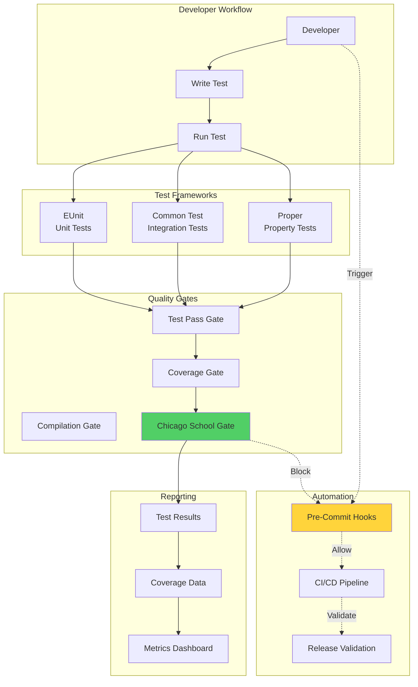

### Component Relationship Map

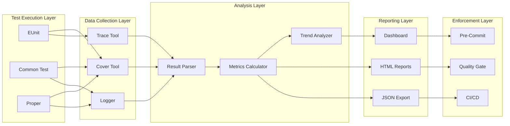

---

## Test Execution Pipeline

### Sequential Test Execution Flow

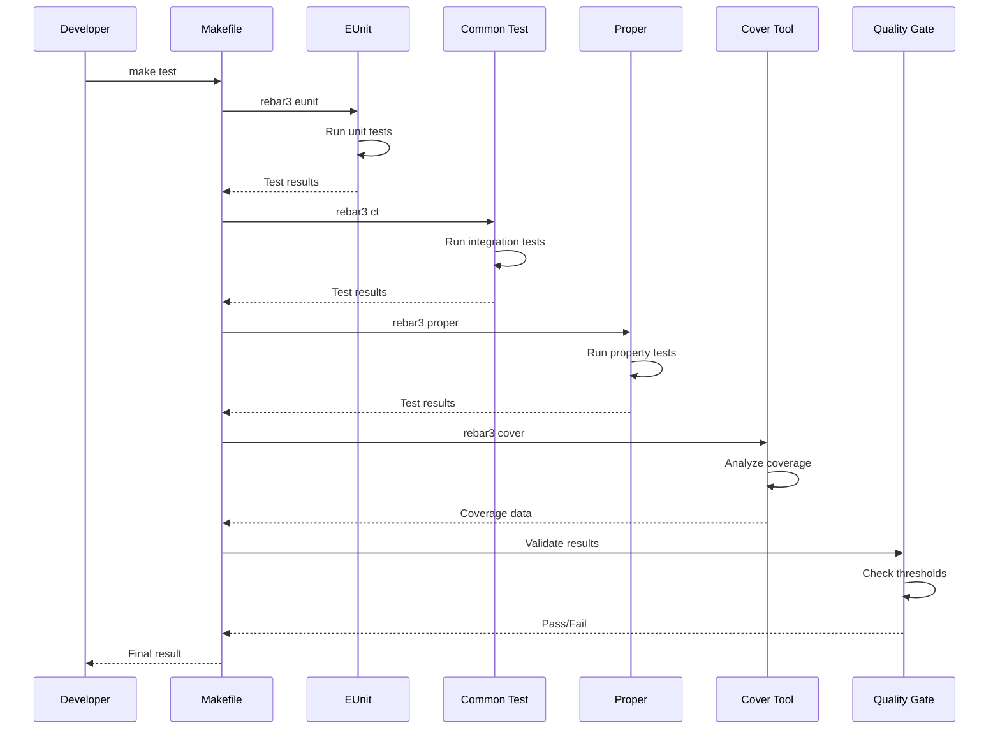

### Parallel Test Execution (Optimized)

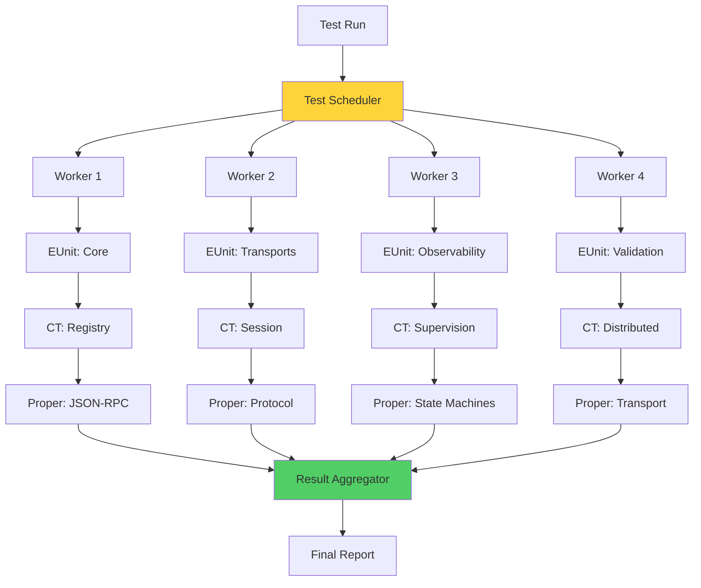

---

## Coverage Collection & Reporting

### Coverage Data Flow

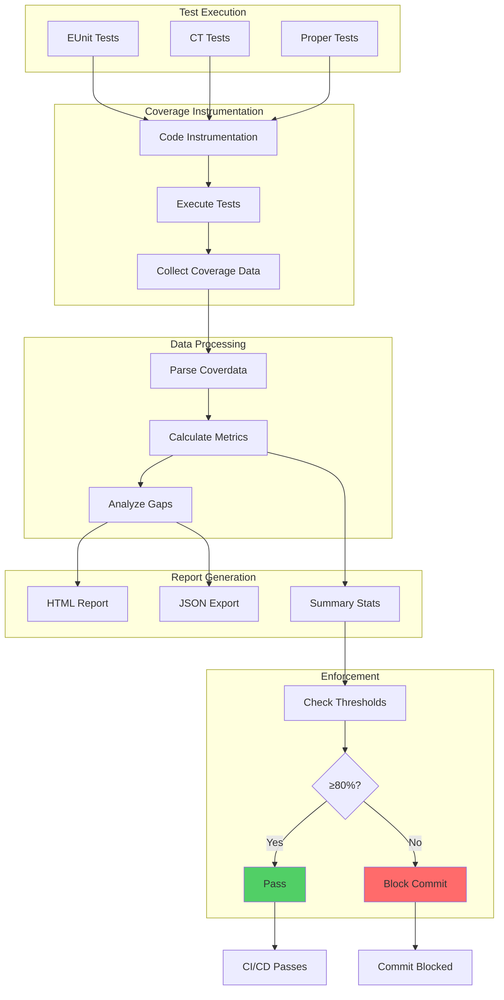

### Coverage Metrics Calculation

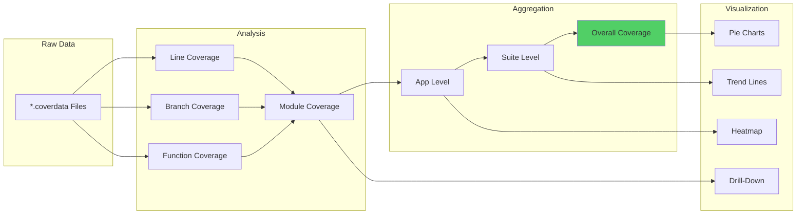

---

## Quality Gate Enforcement

### Quality Gate Architecture

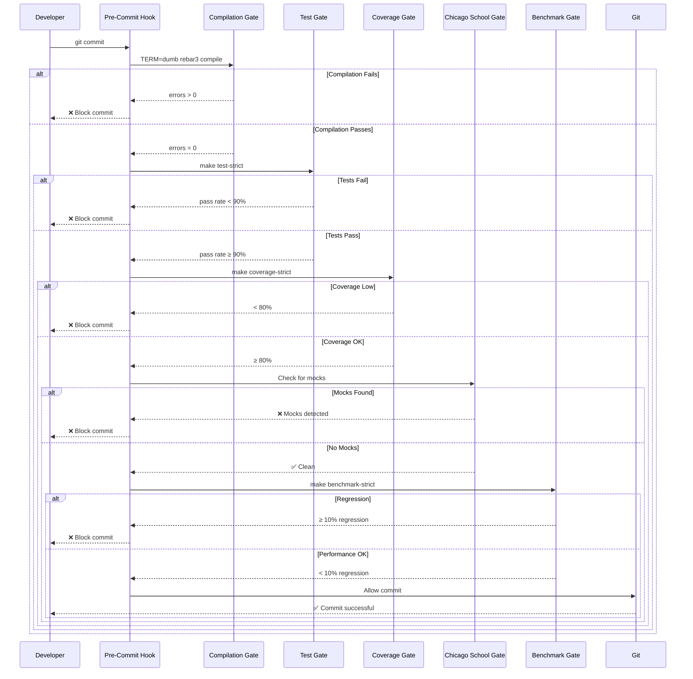

### Gate Decision Tree

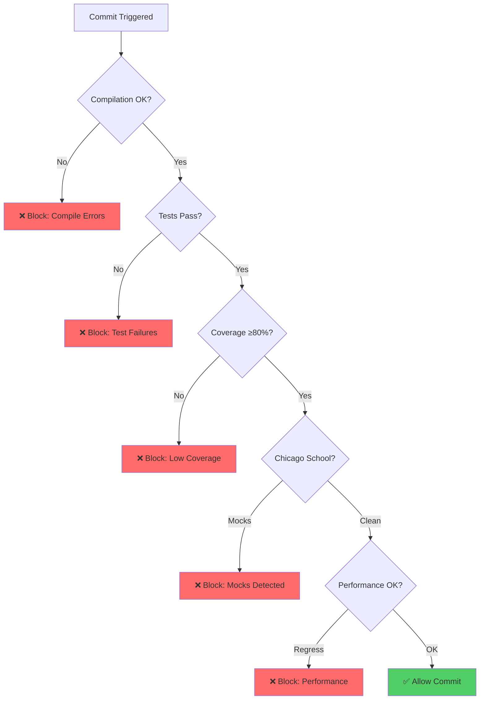

---

## CI/CD Integration

### GitHub Actions Pipeline

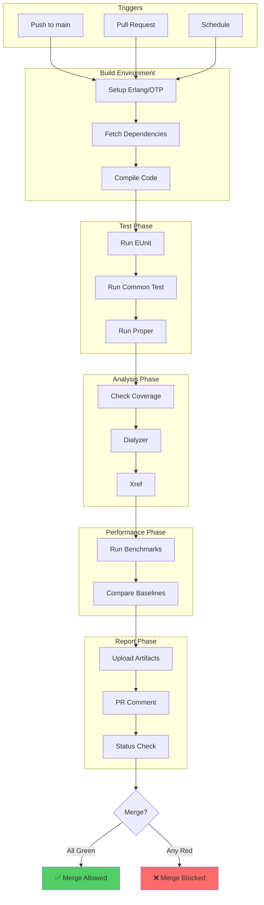

### CI/CD Data Flow

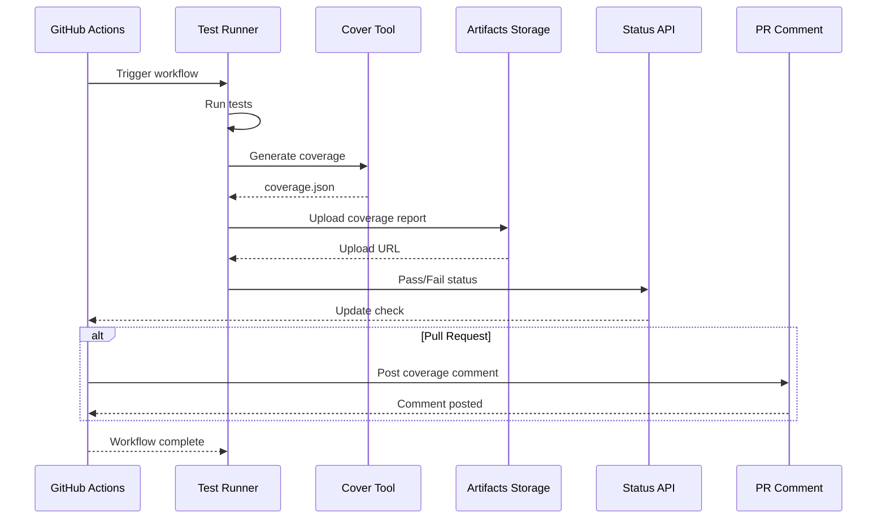

---

## Test Data Management

### Test Data Flow

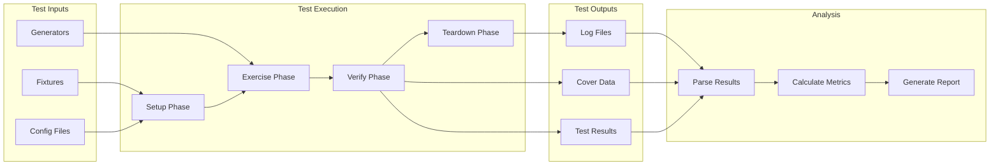

### Test State Management

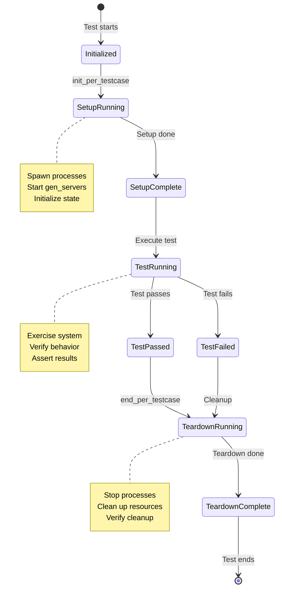

---

## Monitoring & Observability

### Test Metrics Pipeline

```mermaid
graph TB
    subgraph "Collection"
        Tests[Test Execution]
        Bench[Benchmarks]
        Cover[Coverage]
    end

    subgraph "Processing"
        Parse1[Parse Logs]
        Calc[Calculate Metrics]
        Aggregate[Aggregate Data]
    end

    subgraph "Storage"
        TSDB[Time Series DB]
        Index[Elasticsearch]
        Files[JSON Files]
    end

    subgraph "Visualization"
        Dashboard[Dashboard]
        Reports[Reports]
        Alerts[Alerts]
    end

    Tests --> Parse1
    Bench --> Parse1
    Cover --> Parse1

    Parse1 --> Calc
    Calc --> Aggregate

    Aggregate --> TSDB
    Aggregate --> Index
    Aggregate --> Files

    TSDB --> Dashboard
    Index --> Reports
    Files --> Alerts

    Dashboard --> Monitor[Monitor Trends]
    Reports --> Analyze[Analyze Gaps]
    Alerts -> Notify[Notify Team]

    style Dashboard fill:#51cf66
    style Alerts fill:#ff6b6b
```

### Real-Time Test Monitoring

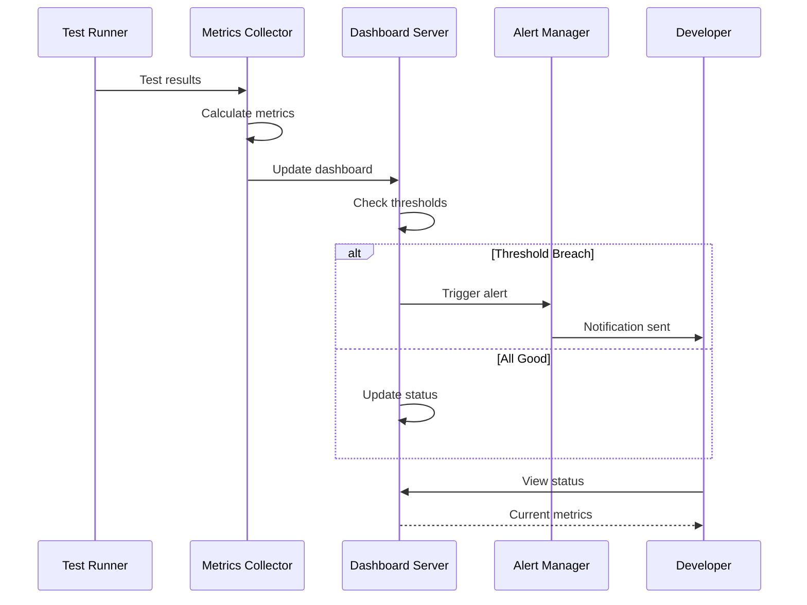

---

## Integration Points

### External System Integration

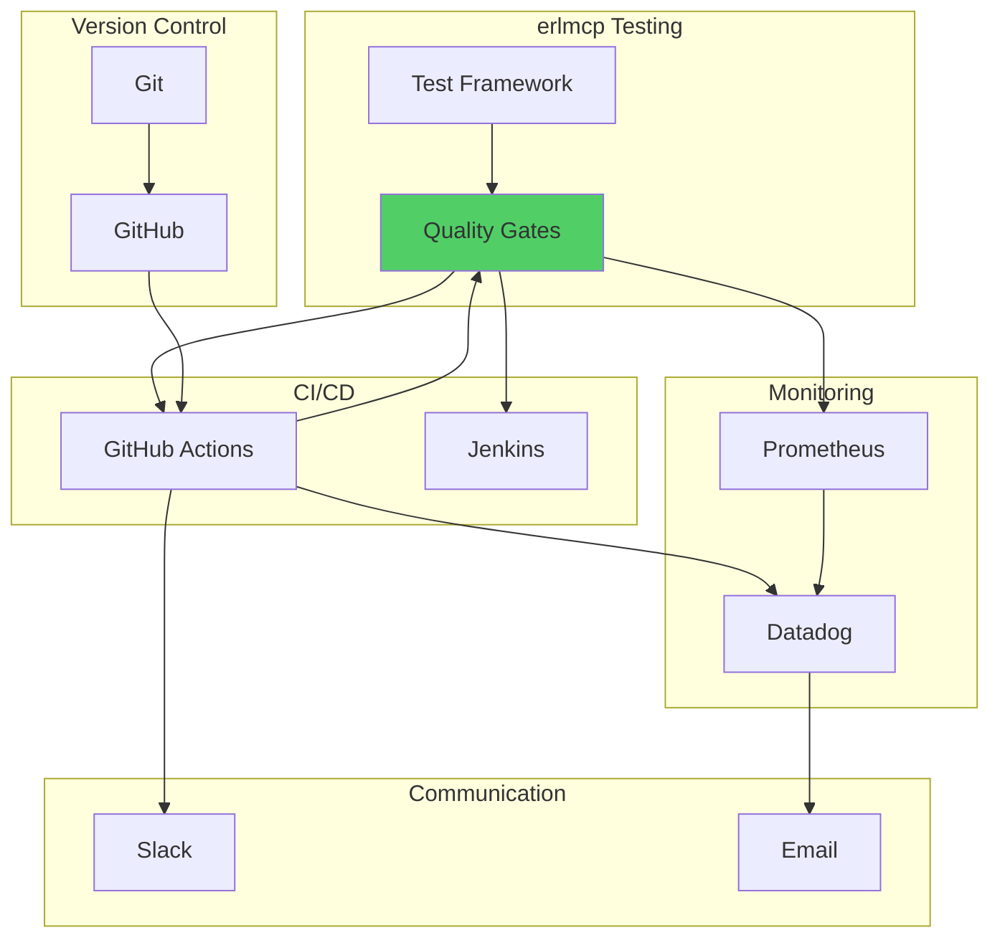

### Plugin Architecture

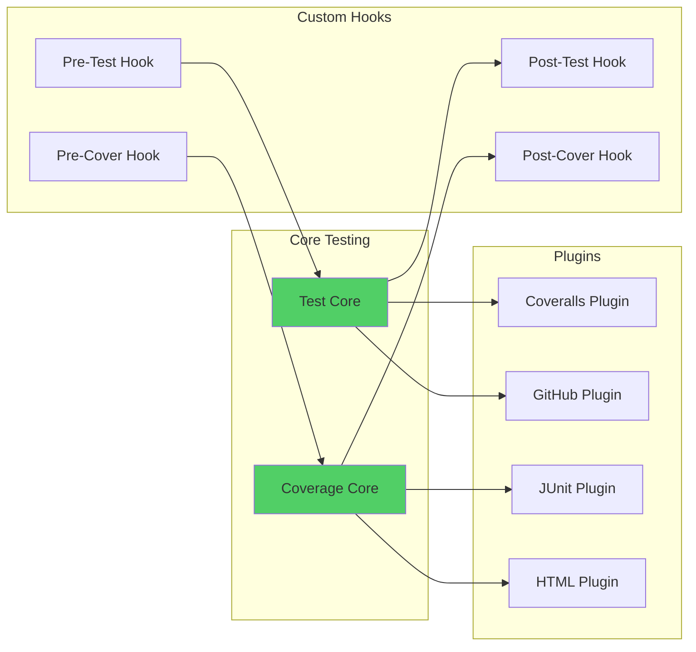

---

## Performance & Scalability

### Test Execution Optimization

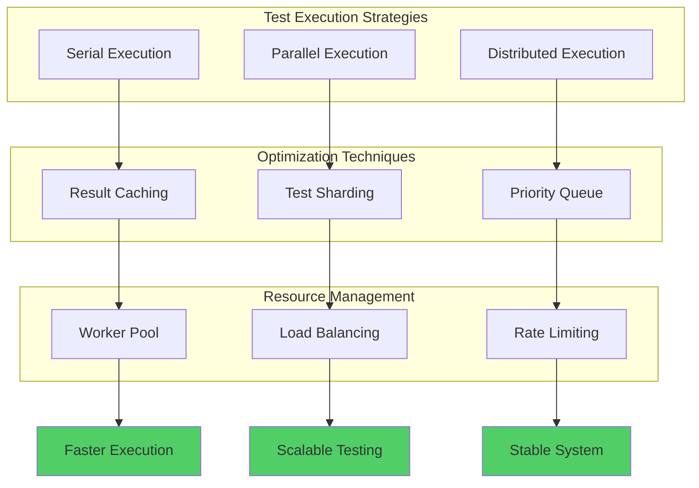

### Distributed Test Execution

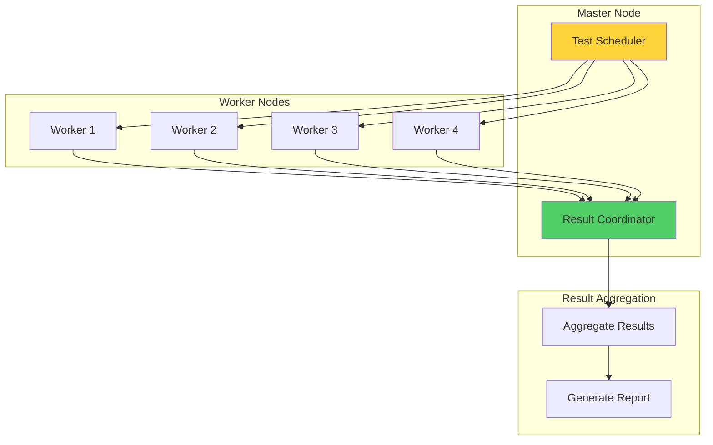

---

## Summary

**Architecture Highlights:**

- **Three-Framework Integration**: EUnit, Common Test, Proper unified through quality gates
- **Sequential & Parallel Execution**: Optimized for speed and reliability
- **Comprehensive Coverage**: Line, branch, function, module coverage tracking
- **Quality Gate Enforcement**: Five mandatory gates (compile, test, coverage, Chicago School, benchmark)
- **CI/CD Integration**: GitHub Actions with artifact storage and status checks
- **Monitoring Pipeline**: Real-time metrics, dashboards, and alerts
- **Scalability**: Distributed test execution for large test suites

**Key Design Principles:**

1. **Zero-Defect Tolerance**: All gates are blocking on failure
2. **Chicago School TDD**: Real collaborators, state-based verification
3. **Automation First**: Pre-commit hooks prevent low-quality code
4. **Observability**: Comprehensive metrics and reporting
5. **Scalability**: Parallel and distributed execution support

---

**Related Documentation:**
- [README](README.md) - Testing overview
- [TDD Strategy](tdd-strategy.md) - Chicago School methodology
- [Integration Tests](integration-tests.md) - Multi-process patterns
- [Coverage Analysis](coverage-analysis.md) - Coverage metrics

**Last Updated:** 2026-01-31
**Maintained by:** erlang-test-engineer agent
**Version:** 2.1.0
