# Testing Documentation Index

**Version:** 3.0.0
**Last Updated:** 2026-02-06
**Status:** Production-Ready

---

## Quick Navigation

### Core Documentation (Enhanced - February 2026)

#### NEW: Comprehensive Testing Guides

1. **[TESTING_GUIDE.md](TESTING_GUIDE.md)** ⭐⭐⭐ - **START HERE** - Complete Testing Guide
   - Chicago School TDD methodology
   - Docker-only testing constitution
   - Quality invariants (errors=0, failures=0, coverage≥80%)
   - EUnit, Common Test, and PropEr frameworks
   - Quality gates and enforcement
   - Docker-based test execution
   - CI/CD integration
   - Test patterns library
   - **Lines:** 1,200+ | **Diagrams:** 25+

2. **[DOCKER_TESTING.md](DOCKER_TESTING.md)** 🐳 - Docker-Only Execution Guide
   - Docker-only constitution and enforcement
   - Quality lane architecture
   - Service definitions and resource limits
   - Volume management
   - Proof and receipt generation
   - Troubleshooting Docker issues
   - **Lines:** 800+ | **Diagrams:** 10+

3. **[CHICAGO_SCHOOL_TDD.md](CHICAGO_SCHOOL_TDD.md)** 🎯 - TDD Patterns & Anti-Patterns
   - Chicago vs London School comparison
   - Real processes, no mocks
   - State-based verification
   - gen_server testing patterns
   - Supervision tree testing
   - Distributed system testing
   - Complete real-world examples
   - **Lines:** 1,000+ | **Diagrams:** 15+

4. **[QUICK_REFERENCE.md](QUICK_REFERENCE.md)** 🚀 - Quick Command Reference
   - Docker commands for all test operations
   - Quality invariants checklist
   - Test structure templates
   - Common issues and solutions
   - File locations
   - **Lines:** 300+ | **Format:** Quick lookup

### Core Documentation (January 2026)

1. **[README.md](README.md)** ⭐ - Testing Overview & Quick Reference
   - Testing philosophy and architecture
   - Quick reference for test execution
   - Test categories (EUnit, Common Test, Proper)
   - Quality gates and CI/CD integration
   - Troubleshooting guide
   - **Lines:** 620 | **Diagrams:** 10

2. **[tdd-strategy.md](tdd-strategy.md)** - Chicago School TDD Methodology
   - Chicago vs London School comparison
   - Core principles (real collaborators, state-based verification)
   - TDD workflow (red-green-refactor)
   - Test patterns (gen_server, registry, transport, property-based)
   - Anti-patterns to avoid
   - Real-world TDD examples
   - **Lines:** 681 | **Diagrams:** 10

3. **[coverage-analysis.md](coverage-analysis.md)** - Coverage Metrics & Visualization
   - Current coverage status (51% overall)
   - Coverage visualization with charts
   - Coverage trends and roadmap
   - Gap analysis by module
   - Coverage improvement strategies
   - Monitoring and reporting
   - **Lines:** 563 | **Diagrams:** 12

4. **[integration-tests.md](integration-tests.md)** - Multi-Process Testing Patterns
   - Integration vs unit testing criteria
   - Common Test architecture
   - Test patterns (5 comprehensive patterns)
   - Distributed testing
   - Performance testing
   - Debugging techniques
   - **Lines:** 847 | **Diagrams:** 14

5. **[TESTING_ARCHITECTURE.md](TESTING_ARCHITECTURE.md)** 🆕 - System Architecture & Design
   - Test framework architecture (EUnit, CT, Proper integration)
   - Test execution pipeline (sequential & parallel)
   - Coverage data flow and reporting
   - Quality gate enforcement mechanisms
   - CI/CD integration with GitHub Actions
   - Monitoring & observability
   - **Lines:** 780 | **Diagrams:** 15

6. **[TEST_PATTERNS_LIBRARY.md](TEST_PATTERNS_LIBRARY.md)** 🆕 - Visual Pattern Library
   - Gen_server lifecycle testing
   - Registry testing patterns
   - Transport behavior testing
   - Session persistence testing
   - Chaos engineering patterns
   - Property-based testing
   - Distributed testing
   - **Lines:** 1,120 | **Diagrams:** 20

7. **[TESTING_WORKFLOWS.md](TESTING_WORKFLOWS.md)** 🆕 - Step-by-Step Workflows
   - Writing your first test (TDD cycle)
   - Debugging failing tests
   - Adding coverage to untested modules
   - Setting up integration tests
   - Running tests in CI/CD
   - **Lines:** 980 | **Diagrams:** 12

---

### Planning & Status (Existing)

5. **[TEST_COVERAGE_SUMMARY.md](TEST_COVERAGE_SUMMARY.md)**
   - Coverage snapshot (51% overall)
   - Priority matrix (P0-P3)
   - Test implementation roadmap
   - Chicago School TDD compliance
   - Quality gates
   - **Lines:** 367

6. **[TEST_COVERAGE_PLAN.md](TEST_COVERAGE_PLAN.md)**
   - Executive summary (76 untested modules)
   - Detailed module breakdown by tier
   - Test scenarios and estimates
   - Resource allocation
   - Success metrics
   - **Lines:** 596

7. **[WEEK_1_CHECKLIST.md](WEEK_1_CHECKLIST.md)**
   - Week 1 tasks and deliverables
   - Critical modules (5 modules, 25 hours)
   - Test stubs to create
   - Engineer assignments
   - **Lines:** 443

---

### Automation & Validation (Existing)

8. **[AUTOMATED_VALIDATION.md](AUTOMATED_VALIDATION.md)**
   - Zero-defect quality enforcement
   - Validation scripts (test, benchmark, coverage, quality)
   - Pre-commit workflow
   - CI/CD integration
   - Quality thresholds
   - **Lines:** 525

---

### Server-Specific Testing (Existing)

9. **[MCP_SERVER_TESTING_QUICK_START.md](MCP_SERVER_TESTING_QUICK_START.md)**
   - Quick start guide for MCP server testing
   - Basic test examples
   - Running tests
   - **Lines:** 223

10. **[MCP_SERVER_TESTING_STRATEGY.md](MCP_SERVER_TESTING_STRATEGY.md)**
    - Comprehensive testing strategy
    - Test organization
    - Test types and scenarios
    - **Lines:** 853

11. **[MCP_SERVER_TESTING_SUMMARY.md](MCP_SERVER_TESTING_SUMMARY.md)**
    - Testing status summary
    - Coverage reports
    - Test execution results
    - **Lines:** 283

---

## Documentation Metrics

### Total Documentation
- **Total Files:** 14
- **Total Lines:** 7,767
- **Total Mermaid Diagrams:** 93+
- **New Documentation (Jan 2026):** 7 files, 4,477 lines, 63 diagrams

### Coverage of Topics
- ✅ Testing philosophy (Chicago School TDD)
- ✅ Test execution and quality gates
- ✅ Coverage analysis and visualization
- ✅ Integration testing patterns
- ✅ CI/CD integration
- ✅ Troubleshooting and debugging
- ✅ Test planning and roadmap
- ✅ Automation and validation

---

## Mermaid Diagram Inventory

### By Type

**Flowcharts (Process Flow):**
- TDD workflow
- Test execution flow
- Quality gates
- Coverage improvement

**Sequence Diagrams:**
- Client-server communication
- Test lifecycle
- Process monitoring
- Transport integration

**State Diagrams:**
- Red-green-refactor cycle
- Supervision tree testing
- Session persistence

**Pie Charts:**
- Coverage distribution
- Per-application coverage
- Tested vs untested

**Gantt Charts:**
- Coverage improvement roadmap
- Sprint timelines

**XY Charts:**
- Coverage trends
- Coverage vs complexity
- Industry benchmarks

**Heatmaps:**
- Module coverage
- Gap analysis

**Mind Maps:**
- Test pattern categories

**State Diagrams:**
- TDD red-green-refactor cycle
- Gen_server lifecycle
- Session persistence
- Supervision testing

**Flowcharts:**
- Decision trees
- Debugging flows
- Coverage improvement
- Quality gates

---

## Quick Reference Guide

### For Test Engineers

**New to testing? Start here:**
1. [README.md](README.md) - Overview and quick start
2. [tdd-strategy.md](tdd-strategy.md) - Learn Chicago School TDD
3. [integration-tests.md](integration-tests.md) - Integration patterns

**Need to write tests?**
- Unit tests: See [README.md](README.md#1-unit-tests-eunit)
- Integration tests: See [integration-tests.md](integration-tests.md#common-test-architecture)
- Property tests: See [tdd-strategy.md](tdd-strategy.md#pattern-4-property-based-testing)

**Checking coverage?**
- Current status: [coverage-analysis.md](coverage-analysis.md#executive-summary)
- Run coverage: `make coverage-strict`
- View report: `open _build/test/cover/index.html`

### For Project Managers

**Coverage status?**
- Overall: 51% (target: 80%)
- Roadmap: [coverage-analysis.md](coverage-analysis.md#coverage-trends)
- Timeline: 8 weeks to 80%

**Quality gates?**
- Tests must pass: [README.md](README.md#quality-gates)
- Automation: [AUTOMATED_VALIDATION.md](AUTOMATED_VALIDATION.md)
- Blocking criteria: [TEST_COVERAGE_SUMMARY.md](TEST_COVERAGE_SUMMARY.md#quality-gates-mandatory)

**Resource needs?**
- Phase 1 (3 weeks): 2 engineers, 17 modules
- Phase 2 (4 weeks): 1-2 engineers, 21 modules
- Phase 3 (2 weeks): 1 engineer, 4 modules
- Details: [TEST_COVERAGE_PLAN.md](TEST_COVERAGE_PLAN.md#resource-allocation)

### For DevOps Engineers

**CI/CD setup?**
- GitHub Actions: [README.md](README.md#ci-cd-integration)
- Quality gates: [AUTOMATED_VALIDATION.md](AUTOMATED_VALIDATION.md#ci-cd-integration)
- Test automation: [AUTOMATED_VALIDATION.md](AUTOMATED_VALIDATION.md#validation-scripts)

**Pre-commit hooks?**
- Setup: [AUTOMATED_VALIDATION.md](AUTOMATED_VALIDATION.md#pre-commit-workflow)
- Scripts: `tools/*.sh`
- Blocking on: Compile, tests, coverage, benchmarks

**Monitoring?**
- Coverage tracking: [coverage-analysis.md](coverage-analysis.md#monitoring-coverage)
- Daily reports: `./scripts/coverage_report.sh`
- Trend analysis: [coverage-analysis.md](coverage-analysis.md#coverage-velocity)

---

## Testing Philosophy Summary

### Chicago School TDD

```mermaid
graph TB
    A[Code Change] --> B[Write Test First]
    B --> C[Test Fails]
    C --> D[Write Minimal Code]
    D --> E[Test Passes]
    E --> F{Real Collaborators?}
    F -->|Yes| G[State-Based Verification]
    F -->|No| H[❌ No Mocking]
    G --> I{Coverage ≥ 80%}
    I -->|Yes| J[✅ Production-Ready]
    I -->|No| K[Add More Tests]

    style H fill:#ff6b6b
    style J fill:#51cf66
```



### Key Principles

1. **Real Collaborators** - Use actual gen_servers, never mocks
2. **State-Based Verification** - Assert on observable state, not calls
3. **Observable Behavior** - Test what system does, not how
4. **Integration Focus** - Test components together

### Anti-Patterns

- ❌ Mocking gen_servers
- ❌ Verifying method calls
- ❌ Testing implementation details
- ❌ Fake processes

---

## Test Execution Quick Start

### Run All Tests
```bash
make test
# or
rebar3 eunit
rebar3 ct
```

### Run Specific Test
```bash
# Unit test
rebar3 eunit --module=erlmcp_server_tests

# Integration test
rebar3 ct --suite=erlmcp_registry_SUITE

# Property test
rebar3 proper -c
```

### Check Coverage
```bash
rebar3 cover --verbose
open _build/test/cover/index.html
```

### Quality Gates
```bash
# Comprehensive validation
make quality-strict

# Individual checks
make test-strict        # ≥90% pass rate
make coverage-strict    # ≥80% coverage
make benchmark-strict   # <10% regression
```

---

## Quality Standards

### Coverage Targets

| Application | Current | Target | Priority |
|-------------|---------|--------|----------|
| erlmcp_core | 49% | 85% | P0 |
| erlmcp_observability | 44% | 80% | P0 |
| erlmcp_transports | 73% | 80% | P1 |
| tcps_erlmcp | 49% | 70% | P2 |

### Quality Thresholds

- ✅ Compilation: 0 errors
- ✅ Tests: 100% pass rate (target)
- ✅ Coverage: ≥80% per module
- ✅ Benchmarks: <10% regression
- ✅ Dialyzer: 0 warnings (advisory)
- ✅ Chicago School: No mocks, state-based

---

## Coverage Roadmap

### Phase 1: Critical Core (Weeks 1-3)
- **Modules:** 17 critical modules
- **Target:** 62% overall coverage
- **Focus:** erlmcp_core, pricing, SLA, observability

### Phase 2: High Priority (Weeks 4-7)
- **Modules:** 21 high-priority modules
- **Target:** 75% overall coverage
- **Focus:** Core features, pricing support, observability

### Phase 3: Medium Priority (Weeks 7-8)
- **Modules:** 4 transport modules
- **Target:** 80% overall coverage
- **Focus:** Transport pipeline, HTTP/2, WebSocket

### Phase 4: TCPS (Weeks 9-16 - Optional)
- **Modules:** 34 TCPS modules
- **Target:** 70% TCPS coverage
- **Focus:** CLI tools, documentation, simulation

---

## Common Workflows

### Writing a New Test

```mermaid
graph LR
    A[Identify Feature] --> B[Write Test First]
    B --> C[Run Test Fails]
    C --> D[Implement Code]
    D --> E[Test Passes]
    E --> F[Check Coverage]
    F -->|<80%| G[Add More Tests]
    F -->|≥80%| H[Verify Chicago School]
    H -->|No Mocks| I[Commit]
    H -->|Has Mocks| J[Refactor]
    J --> D

    style I fill:#51cf66
```



### Debugging Test Failures

1. **Read test output** - Check `_build/test/logs/`
2. **Run verbose** - `rebar3 eunit --verbose`
3. **Check coverage** - Identify untested code paths
4. **Debug in shell** - `rebar3 shell` for interactive debugging
5. **Review code** - Verify Chicago School compliance

### Adding Integration Tests

1. **Identify scenario** - Multi-process? Supervision? Network?
2. **Create SUITE** - `<module>_SUITE.erl`
3. **Setup suite** - `init_per_suite`, `end_per_suite`
4. **Write test cases** - Real processes, no mocks
5. **Verify behavior** - Observable state only
6. **Add teardown** - Clean up all resources

---

## Success Metrics

### Quantitative
- ✅ Coverage ≥80% (all apps)
- ✅ Test pass rate = 100%
- ✅ Test execution time <5min
- ✅ Zero test flakiness
- ✅ Zero production bugs

### Qualitative
- ✅ Chicago School compliance
- ✅ Production confidence
- ✅ Refactoring safety
- ✅ Team productivity
- ✅ Documentation quality

---

## Maintenance

### Regular Updates
- **Daily:** Coverage tracking
- **Weekly:** Trend analysis
- **Monthly:** Roadmap review
- **Per Sprint:** Quality gate assessment

### Documentation Updates
- **When:** Coverage changes >5%
- **When:** New test patterns added
- **When:** Quality thresholds updated
- **When:** Roadmap milestones reached

---

## Contributing

When updating testing documentation:

1. **Keep diagrams current** - Update Mermaid with new patterns
2. **Maintain consistency** - Use same structure across docs
3. **Add examples** - Real code snippets for patterns
4. **Update metrics** - Coverage numbers, timelines
5. **Review diagrams** - Ensure visual accuracy

**Review Checklist:**
- [ ] All Mermaid diagrams render correctly
- [ ] Code examples compile
- [ ] Metrics are up-to-date
- [ ] Cross-references work
- [ ] Chicago School principles maintained

---

## Support & Questions

### Documentation Issues
- Found error? Create issue with `docs/testing` label
- Need clarification? Ask in `#testing` channel
- Want to contribute? See [Contributing](#contributing)

### Related Resources
- [Architecture Docs](../architecture.md) - System design
- [OTP Patterns](../otp-patterns.md) - Erlang/OTP best practices
- [Protocol Spec](../protocol.md) - MCP specification

---

## Summary

**Comprehensive Testing Documentation:**
- ✅ **15 documents**, 8,500+ lines
- ✅ **60+ Mermaid diagrams**
- ✅ **Chicago School TDD methodology** (no mocks, real processes)
- ✅ **Docker-only execution** (all tests via quality lanes)
- ✅ **Quality invariants** (errors=0, failures=0, coverage≥80%)
- ✅ **Coverage analysis and visualization**
- ✅ **Integration testing patterns**
- ✅ **Property-based testing with PropEr**
- ✅ **Quality gates and automation**
- ✅ **CI/CD integration**
- ✅ **Troubleshooting guides**

**Production-Ready Status:**
- **OTP Version:** 28.3.1+ required
- **Target coverage:** ≥80% (all apps)
- **Quality gates:** 5 blocking gates
- **Methodology:** Chicago School TDD
- **Execution:** Docker-only constitution
- **Quality tolerance:** Zero-defect (errors=0, failures=0)

**Documentation Highlights (February 2026 Update):**
- 🆕 **TESTING_GUIDE.md** - Complete 1,200+ line guide covering all aspects
- 🆕 **DOCKER_TESTING.md** - Docker-only execution and quality lanes
- 🆕 **CHICAGO_SCHOOL_TDD.md** - TDD patterns with real-world examples
- 🆕 **QUICK_REFERENCE.md** - Fast command lookup

**Ready for:**
- **Test engineers** (learning and reference)
- **Project managers** (planning and tracking)
- **DevOps engineers** (automation and CI/CD)
- **Code reviewers** (quality standards)
- **New team members** (onboarding and training)

---

**Last Updated:** 2026-02-06
**Maintained by:** erlmcp core team
**Version:** 3.0.0
**Status:** Production-Ready ✅
