# erlmcp Testing Guide

**Version:** 3.0.0
**Last Updated:** 2026-02-06
**Status:** Production-Ready
**OTP Requirements:** 28.3.1+

---

## Table of Contents

1. [Overview](#overview)
2. [Testing Philosophy: Chicago School TDD](#testing-philosophy-chicago-school-tdd)
3. [Docker-Only Testing Constitution](#docker-only-testing-constitution)
4. [Quality Invariants](#quality-invariants)
5. [Test Framework Architecture](#test-framework-architecture)
6. [EUnit: Unit Testing](#eunit-unit-testing)
7. [Common Test: Integration Testing](#common-test-integration-testing)
8. [PropEr: Property-Based Testing](#proper-property-based-testing)
9. [Coverage Requirements](#coverage-requirements)
10. [Quality Gates](#quality-gates)
11. [Docker-Based Test Execution](#docker-based-test-execution)
12. [CI/CD Integration](#cicd-integration)
13. [Test Patterns Library](#test-patterns-library)
14. [Troubleshooting](#troubleshooting)

---

## Overview

erlmcp testing is built on a foundation of **Chicago School TDD** with **Docker-only execution** and **zero-defect quality gates**. This guide provides comprehensive documentation for writing, running, and maintaining tests in the erlmcp ecosystem.

### Core Principles

1. **Real Processes, No Mocks** - Chicago School TDD philosophy
2. **Docker-Only Execution** - All tests run via Docker quality lanes
3. **Zero-Defect Quality** - errors=0, failures=0, coverage≥80%
4. **State-Based Verification** - Test observable behavior, not implementation
5. **Deterministic & Reproducible** - Same inputs always produce same outputs

### Quick Start

```bash
# Compile via Docker
docker compose run --rm erlmcp-build make compile

# Run unit tests (EUnit)
docker compose run --rm erlmcp-unit make eunit

# Run integration tests (Common Test)
docker compose run --rm erlmcp-ct make ct

# Check coverage (must be ≥80%)
docker compose run --rm erlmcp-check make coverage

# Run all quality gates
docker compose run --rm erlmcp-check make validate
```

---

## Testing Philosophy: Chicago School TDD

erlmcp follows the **Chicago School** (Detroit School) of Test-Driven Development. This approach emphasizes real collaborators and state-based verification over mocks and interaction testing.

### Chicago School vs London School

```mermaid
graph TB
    subgraph "Chicago School erlmcp"
        C1[Real gen_server processes]
        C2[State-based verification]
        C3[Observable behavior testing]
        C4[Integration focus]
    end

    subgraph "London School FORBIDDEN"
        L1[❌ Mock gen_servers]
        L2[❌ Interaction verification]
        L3[❌ Implementation testing]
        L4[❌ Fake processes]
    end

    style C1 fill:#51cf66
    style C2 fill:#51cf66
    style C3 fill:#51cf66
    style C4 fill:#51cf66
    style L1 fill:#ff6b6b
    style L2 fill:#ff6b6b
    style L3 fill:#ff6b6b
    style L4 fill:#ff6b6b
```



### Core Tenets

#### 1. Real Collaborators

**DO:**
```erlang
% Start real gen_server
{ok, Server} = erlmcp_server:start_link(TransportOpts),

% Verify server state via API
{ok, State} = erlmcp_server:get_state(Server),
?assertEqual(initialized, State#state.phase).
```

**DON'T:**
```erlang
% ❌ FORBIDDEN: Mocking gen_server
meck:new(erlmcp_server),
meck:expect(erlmcp_server, handle_call, fun(_, _, _) -> {reply, ok, state} end).
```

#### 2. State-Based Verification

**DO:**
```erlang
% Test observable state
ok = erlmcp_registry:register(server_1, Pid),
{ok, Pid} = erlmcp_registry:lookup(server_1),
?assert(is_process_alive(Pid)).
```

**DON'T:**
```erlang
% ❌ FORBIDDEN: Verifying internal calls
?assert(meck:called(erlmcp_registry, register, [server_1, Pid])).
```

#### 3. Observable Behavior

Test **what** the system does, not **how** it does it.

**DO:**
```erlang
% Test the result
{ok, Response} = erlmcp_client:call_tool(Client, ToolName, Args),
?assertMatch(#{result := #{content := [#{type := text}]}}, Response).
```

**DON'T:**
```erlang
% ❌ FORBIDDEN: Testing implementation details
?assert(erlmcp_client_internal_buffer_contains(ExpectedMessage)).
```

#### 4. Integration Focus

Test components together whenever practical.

**DO:**
```erlang
% Integration test: Client → Transport → Server → Registry
{ok, Client} = erlmcp_client:start_link({stdio, #{test_mode => true}}),
{ok, _} = erlmcp_client:initialize(Client, ClientInfo),
{ok, Resources} = erlmcp_client:list_resources(Client),
?assert(is_list(Resources)).
```

### Red-Green-Refactor Cycle


---

## Docker-Only Testing Constitution

### CRITICAL: All Execution via Docker

**FORBIDDEN on host:**
- `rebar3` (any subcommand)
- `erl`, `ct_run`, `dialyzer`, `xref`
- `make compile`, `make test`, `make check`

**REQUIRED: Docker quality lanes**
- `docker compose run --rm erlmcp-build make compile`
- `docker compose run --rm erlmcp-unit make eunit`
- `docker compose run --rm erlmcp-ct make ct`
- `docker compose run --rm erlmcp-check make check`

### Quality Lane Mapping

| Gate | Docker Service | Purpose | Command |
|------|----------------|---------|---------|
| **Compile** | `erlmcp-build` | Compilation gate | `docker compose run --rm erlmcp-build make compile` |
| **EUnit** | `erlmcp-unit` | Unit test gate | `docker compose run --rm erlmcp-unit make eunit` |
| **CT** | `erlmcp-ct` | Integration test gate | `docker compose run --rm erlmcp-ct make ct` |
| **Check** | `erlmcp-check` | Quality analysis gate | `docker compose run --rm erlmcp-check make check` |
| **Bench** | `erlmcp-bench` | Performance gate | `docker compose run --rm erlmcp-bench make benchmark` |
| **Cluster** | `erlmcp-node` | Cluster testing | `docker compose run --rm erlmcp-node make test-cluster` |

### Proof Requirement

Every test execution MUST produce a proof receipt:

```
receipt(hash(git_sha ∥ image_digest ∥ service ∥ cmd ∥ exit ∥ stdout ∥ stderr))
```

No receipt = no truth.

---

## Quality Invariants

### Mandatory Thresholds

erlmcp enforces **zero-defect quality** with blocking gates:

```mermaid
graph LR
    A[Code Change] --> B{Compile?}
    B -->|errors > 0| FAIL1[❌ BLOCK]
    B -->|errors = 0| C{Tests?}
    C -->|failures > 0| FAIL2[❌ BLOCK]
    C -->|failures = 0| D{Coverage?}
    D -->|< 80%| FAIL3[❌ BLOCK]
    D -->|≥ 80%| E{Regression?}
    E -->|≥ 10%| FAIL4[❌ BLOCK]
    E -->|< 10%| PASS[✅ ALLOW]

    style PASS fill:#51cf66
    style FAIL1 fill:#ff6b6b
    style FAIL2 fill:#ff6b6b
    style FAIL3 fill:#ff6b6b
    style FAIL4 fill:#ff6b6b
```



### Invariants (BLOCKING)

1. **errors = 0** - Zero compilation errors
2. **failures = 0** - Zero test failures
3. **coverage ≥ 0.8** - Minimum 80% code coverage
4. **regression < 0.1** - Less than 10% performance regression

### No Exceptions

These invariants are **absolute**. No PRs merge without passing all gates.

---

## Test Framework Architecture

### Three-Layer Testing Stack


### Test Execution Flow

```mermaid
sequenceDiagram
    participant Dev as Developer
    participant Docker as Docker Compose
    participant EUnit as EUnit Tests
    participant CT as Common Test
    participant Cover as Coverage Tool
    participant Gate as Quality Gate

    Dev->>Docker: docker compose run erlmcp-unit make eunit
    Docker->>EUnit: Execute unit tests
    EUnit->>EUnit: Run real processes
    EUnit-->>Docker: Results

    Docker->>CT: Execute CT suites
    CT->>CT: Integration tests
    CT-->>Docker: Results

    Docker->>Cover: Generate coverage
    Cover->>Cover: Analyze coverage
    Cover-->>Docker: Coverage data

    Docker->>Gate: Validate
    Gate->>Gate: Check invariants

    alt All gates pass
        Gate-->>Dev: ✅ PASS
    else Any gate fails
        Gate-->>Dev: ❌ BLOCK
    end
```



---

## EUnit: Unit Testing

### Structure

EUnit tests are embedded in the module being tested or in separate `_tests.erl` modules.

```erlang
-module(erlmcp_json_rpc_tests).

-include_lib("eunit/include/eunit.hrl").

%%====================================================================
%% Test Organization
%%====================================================================
%% 1. Setup/Teardown
%% 2. Request encoding tests
%% 3. Response decoding tests
%% 4. Error handling tests
%% 5. Edge cases

%%====================================================================
%% Setup/Teardown
%%====================================================================

setup() ->
    % No mocks - start real processes if needed
    ok.

cleanup(_) ->
    ok.

%%====================================================================
%% Test Fixtures
%%====================================================================

encode_decode_test_() ->
    {setup,
     fun setup/0,
     fun cleanup/1,
     fun(_) ->
        [?_test(test_encode_request()),
         ?_test(test_decode_response()),
         ?_test(test_error_response())]
     end}.

%%====================================================================
%% Test Cases
%%====================================================================

test_encode_request() ->
    Request = #{
        jsonrpc => <<"2.0">>,
        id => 1,
        method => <<"tools/call">>,
        params => #{name => <<"test_tool">>}
    },

    % Test encoding
    {ok, Json} = erlmcp_json_rpc:encode(Request),

    % Verify structure (state-based)
    ?assert(is_binary(Json)),

    % Verify roundtrip (observable behavior)
    {ok, Decoded} = erlmcp_json_rpc:decode(Json),
    ?assertEqual(Request, Decoded).

test_decode_response() ->
    Json = <<"{\"jsonrpc\":\"2.0\",\"id\":1,\"result\":{\"content\":[]}}">>,

    {ok, Response} = erlmcp_json_rpc:decode(Json),

    ?assertMatch(#{jsonrpc := <<"2.0">>, id := 1, result := _}, Response).

test_error_response() ->
    ErrorJson = <<"{\"jsonrpc\":\"2.0\",\"id\":1,\"error\":{\"code\":-32600,\"message\":\"Invalid Request\"}}">>,

    {ok, ErrorResponse} = erlmcp_json_rpc:decode(ErrorJson),

    ?assertMatch(#{error := #{code := -32600}}, ErrorResponse).
```

### Testing gen_server (Chicago School)

```erlang
%%====================================================================
%% gen_server Testing Pattern
%%====================================================================

gen_server_lifecycle_test_() ->
    {setup,
     fun() ->
        % Start REAL gen_server
        {ok, Server} = erlmcp_server:start_link({stdio, #{test_mode => true}}),
        Server
     end,
     fun(Server) ->
        % Stop gen_server
        erlmcp_server:stop(Server),
        timer:sleep(50)  % Allow cleanup
     end,
     fun(Server) ->
        [?_test(test_server_initialization(Server)),
         ?_test(test_server_state_transitions(Server)),
         ?_test(test_server_api_calls(Server))]
     end}.

test_server_initialization(Server) ->
    % Verify server is alive (observable state)
    ?assert(is_process_alive(Server)),

    % Verify initial phase via API
    Result = erlmcp_server:list_resources(Server),
    ?assertMatch({error, {not_initialized, pre_initialization, _}}, Result).

test_server_state_transitions(Server) ->
    % Initialize server (real operation)
    ClientInfo = #{
        protocolVersion => <<"2024-11-05">>,
        capabilities => #{},
        clientInfo => #{name => <<"test">>, version => <<"1.0.0">>}
    },

    {ok, _} = erlmcp_server:initialize(Server, ClientInfo),

    % Verify state transition via API
    {ok, Resources} = erlmcp_server:list_resources(Server),
    ?assert(is_list(Resources)).

test_server_api_calls(Server) ->
    % Test API operations
    {ok, Tools} = erlmcp_server:list_tools(Server),
    ?assert(is_list(Tools)),

    {ok, Prompts} = erlmcp_server:list_prompts(Server),
    ?assert(is_list(Prompts)).
```

### EUnit Best Practices

**DO:**
- Start real processes in `setup/0`
- Test observable state via public API
- Use descriptive test names
- Group related tests with test fixtures
- Clean up resources in `cleanup/1`
- Test edge cases and error conditions

**DON'T:**
- ❌ Mock gen_servers or processes
- ❌ Test private functions
- ❌ Verify internal state directly
- ❌ Use interaction-based testing
- ❌ Leave processes running after tests

---

## Common Test: Integration Testing

### Suite Structure

Common Test suites test multiple components working together.

```erlang
%%%-------------------------------------------------------------------
%%% @doc
%%% Integration test suite for erlmcp registry
%%%
%%% Tests:
%%% - Multi-process registration
%%% - Supervision tree integration
%%% - Distributed registry operations
%%% - Failure recovery
%%% @end
%%%-------------------------------------------------------------------
-module(erlmcp_registry_SUITE).

-include_lib("common_test/include/ct.hrl").
-include_lib("eunit/include/eunit.hrl").

%% Suite callbacks
-export([all/0, groups/0,
         init_per_suite/1, end_per_suite/1,
         init_per_group/2, end_per_group/2,
         init_per_testcase/2, end_per_testcase/2]).

%% Test cases
-export([test_basic_registration/1,
         test_concurrent_registration/1,
         test_process_monitoring/1,
         test_supervisor_integration/1]).

%%====================================================================
%% Suite Configuration
%%====================================================================

all() ->
    [{group, registry_operations},
     {group, supervision_integration},
     {group, distributed_registry}].

groups() ->
    [{registry_operations, [parallel],
      [test_basic_registration,
       test_concurrent_registration,
       test_process_monitoring]},
     {supervision_integration, [sequence],
      [test_supervisor_integration]},
     {distributed_registry, [sequence],
      [test_distributed_registration]}].

%%====================================================================
%% Suite Lifecycle
%%====================================================================

init_per_suite(Config) ->
    ct:pal("Starting registry integration tests"),

    % Start real application
    {ok, _} = application:ensure_all_started(erlmcp_core),

    Config.

end_per_suite(_Config) ->
    ct:pal("Stopping registry integration tests"),

    % Stop application
    application:stop(erlmcp_core),

    ok.

init_per_group(GroupName, Config) ->
    ct:pal("Starting group: ~p", [GroupName]),
    Config.

end_per_group(GroupName, _Config) ->
    ct:pal("Ending group: ~p", [GroupName]),
    ok.

init_per_testcase(TestCase, Config) ->
    ct:pal("Starting test: ~p", [TestCase]),
    Config.

end_per_testcase(TestCase, _Config) ->
    ct:pal("Ending test: ~p", [TestCase]),
    ok.

%%====================================================================
%% Test Cases
%%====================================================================

test_basic_registration(Config) ->
    % Start real gen_server
    {ok, Server} = erlmcp_server:start_link({stdio, #{test_mode => true}}),

    % Register process
    ok = erlmcp_registry:register(test_server, Server),

    % Verify registration (state-based)
    {ok, Server} = erlmcp_registry:lookup(test_server),
    ?assert(is_process_alive(Server)),

    % Cleanup
    erlmcp_server:stop(Server),
    timer:sleep(50),

    % Verify deregistration
    {error, not_found} = erlmcp_registry:lookup(test_server),

    Config.

test_concurrent_registration(Config) ->
    % Spawn multiple processes concurrently
    NumProcesses = 100,
    Pids = [begin
                {ok, Pid} = erlmcp_server:start_link({stdio, #{test_mode => true}}),
                Name = list_to_atom("server_" ++ integer_to_list(N)),
                ok = erlmcp_registry:register(Name, Pid),
                {Name, Pid}
            end || N <- lists:seq(1, NumProcesses)],

    % Verify all registered
    lists:foreach(fun({Name, Pid}) ->
        {ok, Pid} = erlmcp_registry:lookup(Name),
        ?assert(is_process_alive(Pid))
    end, Pids),

    % Cleanup
    lists:foreach(fun({_Name, Pid}) ->
        erlmcp_server:stop(Pid)
    end, Pids),

    timer:sleep(100),

    Config.

test_process_monitoring(Config) ->
    % Start process and register
    {ok, Server} = erlmcp_server:start_link({stdio, #{test_mode => true}}),
    ok = erlmcp_registry:register(test_server, Server),

    % Verify registered
    {ok, Server} = erlmcp_registry:lookup(test_server),

    % Kill process (simulate crash)
    exit(Server, kill),
    timer:sleep(50),

    % Verify automatic deregistration
    {error, not_found} = erlmcp_registry:lookup(test_server),

    Config.

test_supervisor_integration(Config) ->
    % Verify supervision tree structure
    {ok, Children} = supervisor:which_children(erlmcp_sup),

    % Verify critical components are supervised
    ChildNames = [Name || {Name, _Pid, _Type, _Modules} <- Children],
    ?assert(lists:member(erlmcp_registry, ChildNames)),

    Config.
```

### Integration Test Patterns

#### 1. End-to-End Message Flow

```erlang
test_complete_message_flow(Config) ->
    % Start all components
    {ok, Client} = erlmcp_client:start_link({stdio, #{test_mode => true}}),
    {ok, Server} = erlmcp_server:start_link({stdio, #{test_mode => true}}),

    % Initialize
    ClientInfo = #{
        protocolVersion => <<"2024-11-05">>,
        capabilities => #{},
        clientInfo => #{name => <<"test">>, version => <<"1.0.0">>}
    },
    {ok, _} = erlmcp_client:initialize(Client, ClientInfo),

    % Call tool end-to-end
    {ok, Result} = erlmcp_client:call_tool(Client, <<"test_tool">>, #{}),

    % Verify result
    ?assertMatch(#{result := #{content := _}}, Result),

    % Cleanup
    erlmcp_client:stop(Client),
    erlmcp_server:stop(Server),

    Config.
```

#### 2. Supervision Tree Testing

```erlang
test_supervisor_crash_recovery(Config) ->
    % Get supervisor
    {ok, Sup} = erlmcp_sup:start_link(),

    % Get child
    Children = supervisor:which_children(Sup),
    {erlmcp_registry, RegistryPid, _, _} = lists:keyfind(erlmcp_registry, 1, Children),

    % Kill child
    exit(RegistryPid, kill),
    timer:sleep(100),

    % Verify restart
    NewChildren = supervisor:which_children(Sup),
    {erlmcp_registry, NewPid, _, _} = lists:keyfind(erlmcp_registry, 1, NewChildren),

    ?assert(is_process_alive(NewPid)),
    ?assertNot(RegistryPid =:= NewPid),

    Config.
```

#### 3. Distributed Testing

```erlang
test_distributed_operation(Config) ->
    % Start nodes
    {ok, Node1} = ct_slave:start(node1),
    {ok, Node2} = ct_slave:start(node2),

    % Start application on both nodes
    ok = rpc:call(Node1, application, ensure_all_started, [erlmcp_core]),
    ok = rpc:call(Node2, application, ensure_all_started, [erlmcp_core]),

    % Register on node1
    ok = rpc:call(Node1, erlmcp_registry, register, [test, self()]),

    % Lookup from node2
    {ok, Pid} = rpc:call(Node2, erlmcp_registry, lookup, [test]),

    ?assertEqual(self(), Pid),

    % Cleanup
    ct_slave:stop(Node1),
    ct_slave:stop(Node2),

    Config.
```

### Common Test Best Practices

**DO:**
- Test multiple components together
- Use real supervision trees
- Test distributed scenarios
- Verify crash recovery
- Test under realistic load
- Clean up all processes

**DON'T:**
- ❌ Mock components
- ❌ Skip cleanup
- ❌ Test in isolation when integration is possible
- ❌ Assume single-node operation

---

## PropEr: Property-Based Testing

### What is Property-Based Testing?

Property-based testing verifies that properties hold for a wide range of generated inputs.

```mermaid
graph LR
    A[Define Property] --> B[Generate Inputs]
    B --> C[Run Test]
    C --> D{Property Holds?}
    D -->|Yes| E[Shrink & Retry]
    D -->|No| F[Report Counterexample]
    E -->|100s of tests| G[✅ PASS]

    style G fill:#51cf66
    style F fill:#ff6b6b
```



### PropEr Test Structure

```erlang
-module(erlmcp_json_rpc_proper_tests).

-include_lib("proper/include/proper.hrl").
-include_lib("eunit/include/eunit.hrl").

%%====================================================================
%% Properties
%%====================================================================

prop_encode_decode_roundtrip() ->
    ?FORALL(Request, json_rpc_request(),
        begin
            {ok, Json} = erlmcp_json_rpc:encode(Request),
            {ok, Decoded} = erlmcp_json_rpc:decode(Json),
            Request =:= Decoded
        end).

prop_error_codes_valid() ->
    ?FORALL(ErrorCode, error_code(),
        begin
            Error = #{
                jsonrpc => <<"2.0">>,
                id => 1,
                error => #{
                    code => ErrorCode,
                    message => <<"Error">>
                }
            },
            {ok, Json} = erlmcp_json_rpc:encode(Error),
            {ok, Decoded} = erlmcp_json_rpc:decode(Json),
            maps:get(error, Decoded, undefined) =/= undefined
        end).

%%====================================================================
%% Generators
%%====================================================================

json_rpc_request() ->
    ?LET({Method, Params},
         {method(), params()},
         #{jsonrpc => <<"2.0">>,
           id => proper_types:integer(1, 1000000),
           method => Method,
           params => Params}).

method() ->
    proper_types:oneof([
        <<"initialize">>,
        <<"tools/list">>,
        <<"tools/call">>,
        <<"resources/list">>,
        <<"resources/read">>,
        <<"prompts/list">>,
        <<"prompts/get">>
    ]).

params() ->
    proper_types:map(
        proper_types:atom(),
        proper_types:oneof([
            proper_types:binary(),
            proper_types:integer(),
            proper_types:list(proper_types:binary())
        ])
    ).

error_code() ->
    proper_types:oneof([
        -32700,  % Parse error
        -32600,  % Invalid request
        -32601,  % Method not found
        -32602,  % Invalid params
        -32603,  % Internal error
        -32010   % ResourceNotFound
    ]).

%%====================================================================
%% EUnit Integration
%%====================================================================

proper_test_() ->
    {timeout, 60, fun() ->
        ?assert(proper:quickcheck(prop_encode_decode_roundtrip(), [{numtests, 100}])),
        ?assert(proper:quickcheck(prop_error_codes_valid(), [{numtests, 50}]))
    end}.
```

### State Machine Testing

```erlang
-module(erlmcp_session_statem).

-include_lib("proper/include/proper.hrl").

-export([initial_state/0, command/1, precondition/2,
         postcondition/3, next_state/3]).

%%====================================================================
%% State Machine Model
%%====================================================================

-record(state, {
    session_pid :: pid() | undefined,
    phase :: pre_initialization | initializing | initialized,
    capabilities :: map()
}).

initial_state() ->
    #state{
        session_pid = undefined,
        phase = pre_initialization,
        capabilities = #{}
    }.

%%====================================================================
%% Commands
%%====================================================================

command(#state{session_pid = undefined}) ->
    {call, erlmcp_session, start_link, [session_opts()]};

command(#state{session_pid = Pid, phase = pre_initialization}) when Pid =/= undefined ->
    {call, erlmcp_session, initialize, [Pid, client_info()]};

command(#state{session_pid = Pid, phase = initialized}) when Pid =/= undefined ->
    proper_types:oneof([
        {call, erlmcp_session, list_resources, [Pid]},
        {call, erlmcp_session, list_tools, [Pid]},
        {call, erlmcp_session, stop, [Pid]}
    ]).

%%====================================================================
%% Preconditions & Postconditions
%%====================================================================

precondition(#state{session_pid = undefined}, {call, _, start_link, _}) ->
    true;

precondition(#state{session_pid = Pid}, {call, _, initialize, [Pid, _]}) ->
    Pid =/= undefined;

precondition(#state{phase = initialized}, {call, _, list_resources, _}) ->
    true;

precondition(_, _) ->
    false.

postcondition(#state{}, {call, _, start_link, _}, {ok, Pid}) ->
    is_pid(Pid) andalso is_process_alive(Pid);

postcondition(#state{}, {call, _, initialize, _}, {ok, _}) ->
    true;

postcondition(#state{phase = initialized}, {call, _, list_resources, _}, {ok, Resources}) ->
    is_list(Resources);

postcondition(_, _, _) ->
    false.

%%====================================================================
%% State Transitions
%%====================================================================

next_state(State, Result, {call, _, start_link, _}) ->
    State#state{session_pid = Result};

next_state(State, _Result, {call, _, initialize, _}) ->
    State#state{phase = initialized};

next_state(State, _Result, {call, _, stop, _}) ->
    State#state{session_pid = undefined, phase = pre_initialization}.

%%====================================================================
%% Generators
%%====================================================================

session_opts() ->
    #{test_mode => true}.

client_info() ->
    #{
        protocolVersion => <<"2024-11-05">>,
        capabilities => #{},
        clientInfo => #{
            name => <<"proper_test">>,
            version => <<"1.0.0">>
        }
    }.

%%====================================================================
%% Property
%%====================================================================

prop_session_state_machine() ->
    ?FORALL(Cmds, proper_statem:commands(?MODULE),
        begin
            {History, State, Result} = proper_statem:run_commands(?MODULE, Cmds),
            ?WHENFAIL(
                io:format("History: ~p~nState: ~p~nResult: ~p~n",
                          [History, State, Result]),
                Result =:= ok
            )
        end).
```

### PropEr Best Practices

**DO:**
- Define properties that must hold
- Use generators for realistic inputs
- Test state machines with proper_statem
- Shrink counterexamples
- Integration with EUnit for CI

**DON'T:**
- ❌ Test implementation details
- ❌ Generate unrealistic inputs
- ❌ Ignore shrinking
- ❌ Skip integration with test suites

---

## Coverage Requirements

### Minimum Thresholds

| Application | Target | Current | Status |
|-------------|--------|---------|--------|
| erlmcp_core | ≥85% | TBD | 🟡 In Progress |
| erlmcp_transports | ≥80% | TBD | 🟡 In Progress |
| erlmcp_observability | ≥80% | TBD | 🟡 In Progress |
| erlmcp_validation | ≥70% | TBD | 🟡 In Progress |

### Coverage Calculation

```mermaid
graph TB
    subgraph "Coverage Metrics"
        L[Line Coverage]
        B[Branch Coverage]
        F[Function Coverage]
    end

    subgraph "Aggregation"
        M[Module Coverage]
        A[App Coverage]
        O[Overall Coverage]
    end

    subgraph "Enforcement"
        G{≥ 80%?}
        PASS[✅ Allow]
        FAIL[❌ Block]
    end

    L --> M
    B --> M
    F --> M
    M --> A
    A --> O
    O --> G
    G -->|Yes| PASS
    G -->|No| FAIL

    style PASS fill:#51cf66
    style FAIL fill:#ff6b6b
```



### Running Coverage

```bash
# Via Docker (REQUIRED)
docker compose run --rm erlmcp-unit rebar3 eunit --cover
docker compose run --rm erlmcp-ct rebar3 ct --cover
docker compose run --rm erlmcp-check rebar3 cover --verbose

# View HTML report
open _build/test/cover/index.html
```

### Coverage Report

```
Coverage Summary:
  Total Lines: 45,234
  Covered Lines: 36,187
  Coverage: 80.0%

Per-Application:
  erlmcp_core: 85.2% (38,234 / 44,892 lines)
  erlmcp_transports: 82.1% (6,234 / 7,592 lines)
  erlmcp_observability: 78.9% (4,567 / 5,789 lines)
  erlmcp_validation: 71.2% (2,345 / 3,294 lines)

Coverage Gate: ✅ PASS (≥ 80%)
```

---

## Quality Gates

### Gate Architecture

```mermaid
sequenceDiagram
    participant Dev as Developer
    participant Gate1 as Compile Gate
    participant Gate2 as Test Gate
    participant Gate3 as Coverage Gate
    participant Gate4 as Chicago Gate
    participant Gate5 as Bench Gate
    participant CI as CI/CD

    Dev->>Gate1: Commit

    alt Compile fails
        Gate1-->>Dev: ❌ BLOCK
    else Compile passes
        Gate1->>Gate2: Continue
    end

    alt Tests fail
        Gate2-->>Dev: ❌ BLOCK
    else Tests pass
        Gate2->>Gate3: Continue
    end

    alt Coverage < 80%
        Gate3-->>Dev: ❌ BLOCK
    else Coverage ≥ 80%
        Gate3->>Gate4: Continue
    end

    alt Mocks detected
        Gate4-->>Dev: ❌ BLOCK
    else No mocks
        Gate4->>Gate5: Continue
    end

    alt Regression ≥ 10%
        Gate5-->>Dev: ❌ BLOCK
    else Regression < 10%
        Gate5->>CI: ✅ ALLOW
    end
```



### Gate Definitions

#### Gate 1: Compilation

```bash
docker compose run --rm erlmcp-build make compile

# PASS: errors = 0
# FAIL: errors > 0
```

#### Gate 2: Tests

```bash
docker compose run --rm erlmcp-unit make eunit
docker compose run --rm erlmcp-ct make ct

# PASS: failures = 0
# FAIL: failures > 0
```

#### Gate 3: Coverage

```bash
docker compose run --rm erlmcp-check rebar3 cover --verbose

# PASS: coverage ≥ 80%
# FAIL: coverage < 80%
```

#### Gate 4: Chicago School

```bash
# Automated check for mocks
grep -r "meck:" apps/*/test/ && echo "❌ MOCKS DETECTED" || echo "✅ NO MOCKS"

# PASS: No mocks found
# FAIL: Mocks detected
```

#### Gate 5: Benchmarks

```bash
docker compose run --rm erlmcp-bench make benchmark

# PASS: regression < 10%
# FAIL: regression ≥ 10%
```

### Running All Gates

```bash
# Full quality pipeline
docker compose run --rm erlmcp-check make validate

# Output:
# ✅ Gate 1: Compilation (0 errors)
# ✅ Gate 2: Tests (0 failures)
# ✅ Gate 3: Coverage (82.3% ≥ 80%)
# ✅ Gate 4: Chicago School (no mocks)
# ✅ Gate 5: Benchmarks (3.2% regression < 10%)
#
# ✅ ALL GATES PASSED - Ready for production
```

---

## Docker-Based Test Execution

### Quality Lane Services

erlmcp uses Docker Compose quality lanes for deterministic, reproducible testing.

```yaml
# docker-compose.yml (excerpt)
services:
  erlmcp-build:
    image: erlmcp:3.0.0-build
    volumes:
      - .:/workspace:cached
      - erlmcp-build-cache:/workspace/_build
    command: ["exec make $$MAKE_TARGET"]

  erlmcp-unit:
    image: erlmcp:3.0.0-unit
    volumes:
      - .:/workspace:cached
      - erlmcp-unit-cover:/workspace/_build/test/cover
    environment:
      COVER_ENABLED: "true"
    command: ["exec make $$MAKE_TARGET"]

  erlmcp-ct:
    image: erlmcp:3.0.0-ct
    volumes:
      - .:/workspace:cached
      - erlmcp-ct-logs:/workspace/log/ct
    environment:
      CT_OPTS: "-logdir log/ct"
    command: ["exec make $$MAKE_TARGET"]
```

### Execution Commands

```bash
# Compile
docker compose run --rm erlmcp-build make compile

# Unit tests
docker compose run --rm erlmcp-unit make eunit

# Integration tests
docker compose run --rm erlmcp-ct make ct

# Coverage
docker compose run --rm erlmcp-check make coverage

# All quality gates
docker compose run --rm erlmcp-check make validate

# Benchmarks
docker compose run --rm erlmcp-bench make benchmark

# Specific test module
docker compose run --rm erlmcp-unit rebar3 eunit --module=erlmcp_json_rpc_tests

# Specific CT suite
docker compose run --rm erlmcp-ct rebar3 ct --suite=erlmcp_registry_SUITE
```

### Resource Limits

```yaml
deploy:
  resources:
    limits:
      cpus: '2.0'
      memory: '2G'
      pids: 4096
    reservations:
      cpus: '1.0'
      memory: '1G'
```

### Proof Receipts

Every Docker execution generates a proof receipt:

```bash
docker compose run --rm erlmcp-unit make eunit 2>&1 | tee /tmp/test-receipt.log

# Receipt includes:
# - Git SHA
# - Docker image digest
# - Service name
# - Command
# - Exit code
# - Stdout/stderr
# - Timestamp
```

---

## CI/CD Integration

### GitHub Actions Workflow

```yaml
# .github/workflows/ci.yml
name: CI

on:
  push:
    branches: [main]
  pull_request:
    branches: [main]

jobs:
  quality-gates:
    runs-on: ubuntu-latest

    steps:
      - uses: actions/checkout@v3

      - name: Build Docker images
        run: docker compose build erlmcp-build erlmcp-unit erlmcp-ct erlmcp-check

      - name: Gate 1 - Compilation
        run: docker compose run --rm erlmcp-build make compile

      - name: Gate 2 - Unit Tests
        run: docker compose run --rm erlmcp-unit make eunit

      - name: Gate 3 - Integration Tests
        run: docker compose run --rm erlmcp-ct make ct

      - name: Gate 4 - Coverage
        run: |
          docker compose run --rm erlmcp-check rebar3 cover --verbose
          docker compose run --rm erlmcp-check make validate-coverage

      - name: Gate 5 - Static Analysis
        run: |
          docker compose run --rm erlmcp-check rebar3 dialyzer
          docker compose run --rm erlmcp-check rebar3 xref

      - name: Gate 6 - Benchmarks
        run: docker compose run --rm erlmcp-bench make benchmark

      - name: Upload Coverage
        uses: actions/upload-artifact@v3
        with:
          name: coverage-report
          path: _build/test/cover/

      - name: Upload Test Logs
        if: failure()
        uses: actions/upload-artifact@v3
        with:
          name: test-logs
          path: log/
```

### CI/CD Enforcement


---

## Test Patterns Library

### Pattern 1: gen_server Lifecycle

```erlang
gen_server_test() ->
    % Start
    {ok, Pid} = my_server:start_link(),

    % Verify alive
    ?assert(is_process_alive(Pid)),

    % Call API
    {ok, Result} = my_server:get_state(Pid),

    % Verify state
    ?assertEqual(expected_state, Result),

    % Stop
    ok = my_server:stop(Pid),
    timer:sleep(50),

    % Verify stopped
    ?assertNot(is_process_alive(Pid)).
```

### Pattern 2: Supervision Tree

```erlang
supervisor_test() ->
    % Start supervisor
    {ok, Sup} = my_sup:start_link(),

    % Get children
    Children = supervisor:which_children(Sup),

    % Find child
    {my_worker, WorkerPid, worker, _} =
        lists:keyfind(my_worker, 1, Children),

    % Kill child
    exit(WorkerPid, kill),
    timer:sleep(100),

    % Verify restart
    NewChildren = supervisor:which_children(Sup),
    {my_worker, NewPid, worker, _} =
        lists:keyfind(my_worker, 1, NewChildren),

    ?assert(is_process_alive(NewPid)),
    ?assertNot(WorkerPid =:= NewPid).
```

### Pattern 3: Registry Operations

```erlang
registry_test() ->
    % Register
    ok = erlmcp_registry:register(my_name, self()),

    % Lookup
    {ok, self()} = erlmcp_registry:lookup(my_name),

    % Unregister
    ok = erlmcp_registry:unregister(my_name),

    % Verify gone
    {error, not_found} = erlmcp_registry:lookup(my_name).
```

### Pattern 4: Transport Testing

```erlang
transport_test() ->
    % Start transport
    {ok, Transport} = erlmcp_transport_stdio:start_link(#{}),

    % Send message
    Message = #{jsonrpc => <<"2.0">>, method => <<"test">>},
    ok = erlmcp_transport_stdio:send(Transport, Message),

    % Receive response
    receive
        {transport_message, Response} ->
            ?assertMatch(#{jsonrpc := <<"2.0">>}, Response)
    after 1000 ->
        ?assert(false, "Timeout waiting for response")
    end,

    % Stop
    ok = erlmcp_transport_stdio:stop(Transport).
```

### Pattern 5: Error Handling

```erlang
error_handling_test() ->
    % Test invalid input
    {error, Reason} = my_module:process_request(invalid_input),
    ?assertMatch({invalid_request, _}, Reason),

    % Test missing parameter
    {error, missing_param} = my_module:process_request(#{missing => key}),

    % Test boundary condition
    {error, out_of_range} = my_module:process_request(#{value => 99999}).
```

---

## Troubleshooting

### Common Issues

#### 1. Tests Fail: "Process not alive"

**Symptom:**
```
Test failed: process not alive
```

**Cause:** Process crashed or wasn't started properly.

**Solution:**
```erlang
% Add longer sleep after start
{ok, Pid} = my_server:start_link(),
timer:sleep(100),  % Give process time to initialize
?assert(is_process_alive(Pid)).
```

#### 2. Tests Hang: Timeout

**Symptom:**
```
Test timeout after 5000ms
```

**Cause:** Process deadlock or waiting for message.

**Solution:**
```erlang
% Use shorter receive timeout
receive
    {result, Value} -> Value
after 500 ->  % Shorter timeout
    error(timeout)
end.
```

#### 3. Coverage Too Low

**Symptom:**
```
Coverage: 65% < 80% (FAIL)
```

**Cause:** Untested code paths.

**Solution:**
```bash
# Identify gaps
docker compose run --rm erlmcp-check rebar3 cover --verbose
open _build/test/cover/index.html

# Add tests for red (uncovered) lines
```

#### 4: Docker Permission Errors

**Symptom:**
```
Permission denied: /workspace/_build
```

**Cause:** Volume permission mismatch.

**Solution:**
```bash
# Fix permissions
docker compose run --rm erlmcp-build chown -R $(id -u):$(id -g) /workspace/_build
```

#### 5. Mocks Detected

**Symptom:**
```
❌ Gate 4 FAILED: Mocks detected
```

**Cause:** Test uses meck or similar mocking library.

**Solution:**
```erlang
% Replace mock with real process
% BEFORE (WRONG):
meck:new(erlmcp_server),
meck:expect(erlmcp_server, handle_call, fun(...) -> ... end),

% AFTER (CORRECT):
{ok, Server} = erlmcp_server:start_link({stdio, #{test_mode => true}}),
{ok, Result} = erlmcp_server:get_state(Server).
```

### Debug Commands

```bash
# Verbose test output
docker compose run --rm erlmcp-unit rebar3 eunit --verbose

# CT logs
docker compose run --rm erlmcp-ct rebar3 ct --verbose
ls -la log/ct/

# Coverage detailed report
docker compose run --rm erlmcp-check rebar3 cover --verbose

# Interactive shell
docker compose run --rm erlmcp-build rebar3 shell
```

---

## Summary

### Key Takeaways

1. **Chicago School TDD** - Real processes, state-based verification, no mocks
2. **Docker-Only Execution** - All tests via Docker quality lanes
3. **Zero-Defect Quality** - errors=0, failures=0, coverage≥80%
4. **Three-Layer Stack** - EUnit (unit), CT (integration), PropEr (property)
5. **Blocking Gates** - Compilation, tests, coverage, Chicago School, benchmarks

### Testing Checklist

- [ ] Write test first (Red)
- [ ] Use real processes (Chicago School)
- [ ] Verify observable state only
- [ ] Run via Docker quality lanes
- [ ] Achieve ≥80% coverage
- [ ] Pass all quality gates
- [ ] No mocks detected
- [ ] Tests are deterministic

### Resources

- [TESTING_ARCHITECTURE.md](TESTING_ARCHITECTURE.md) - System architecture
- [TEST_PATTERNS_LIBRARY.md](TEST_PATTERNS_LIBRARY.md) - Pattern library
- [TESTING_WORKFLOWS.md](TESTING_WORKFLOWS.md) - Step-by-step workflows
- [Coverage Analysis](coverage-analysis.md) - Coverage metrics

---

**Last Updated:** 2026-02-06
**Maintained by:** erlmcp core team
**Version:** 3.0.0
**Status:** Production-Ready ✅
