# Testing Metrics Dashboard Specification

**Version:** 2.1.0
**Last Updated:** 2026-01-31
**Status:** Production-Ready

---

## Overview

This document specifies the design and implementation of a comprehensive testing metrics dashboard for erlmcp. The dashboard provides real-time visibility into test coverage, execution time, failure rates, and quality gate compliance.

---

## Dashboard Architecture

### System Components


---

## Dashboard Layout

### Main Dashboard View


---

## Metrics Specifications

### 1. Coverage Metrics

#### Overall Coverage Gauge

```mermaid
graph LR
    subgraph "Coverage Gauge"
        Gauge[Arc Gauge]
        Current[51%]
        Target[80%]
        Status[⚠️ Needs Improvement]
    end

    subgraph "Breakdown"
        Core[erlmcp_core: 49%]
        Obs[erlmcp_observability: 44%]
        Trans[erlmcp_transports: 73%]
        TCPS[tcps_erlmcp: 49%]
    end

    Current --> Status
    Core --> Gauge
    Obs --> Gauge
    Trans --> Gauge
    TCPS --> Gauge
```



**Data Source:** `rebar3 cover --verbose`

**Update Frequency:** After each test run

**Visual Elements:**
- Semi-circle gauge (0-100%)
- Color-coded: Red (<50%), Yellow (50-79%), Green (≥80%)
- Target marker at 80%
- Trend arrow (+/- from last run)

#### Coverage Trend Line


**Data Points:** Daily coverage measurements

**Features:**
- Trend line with data points
- Moving average (7-day)
- Target line (80%)
- Projection to target date

#### Module Coverage Heatmap

```mermaid
heatmap
    title "Module Coverage Heatmap (Top 20 Critical Modules)"
    x-axis ["Coverage %"]
    y-axis ["Modules"]
    "" : 0, 20, 40, 60, 80, 100
    "erlmcp_server" : 0, 0, 0, 0, 0, 100
    "erlmcp_client" : 0, 0, 0, 0, 0, 100
    "erlmcp_registry" : 0, 0, 0, 0, 0, 85
    "erlmcp_hooks" : 0, 0, 0, 0, 0, 0
    "erlmcp_pricing_receipt" : 0, 0, 0, 0, 0, 0
```

**Color Scale:**
- 🟢 80-100%: Green
- 🟡 60-79%: Yellow
- 🟠 40-59%: Orange
- 🔴 0-39%: Red

### 2. Test Execution Metrics

#### Execution Time Box Plot


**Data Points:** Last 100 test runs

**Features:**
- Box-and-whisker plot
- Outlier detection (values > 1.5 * IQR)
- Trend line overlay
- SLA threshold marker (<5min)

#### Execution Timeline


### 3. Failure Rate Metrics

#### Pareto Chart of Failures


**Features:**
- Bar chart: Failure count by category
- Line chart: Cumulative percentage
- Pareto principle line (80% threshold)
- Top 3 failure types highlighted

#### Recent Failures Table

| Time | Test Suite | Test Case | Error | Status |
|------|------------|-----------|-------|--------|
| 14:25 | erlmcp_server_tests | concurrent_test | Timeout | 🔴 Open |
| 13:45 | erlmcp_registry_SUITE | distributed_test | Assertion fail | 🟡 Fixed |
| 11:30 | erlmcp_client_tests | connection_test | Process crash | 🟢 Verified |

**Update Frequency:** Real-time

**Features:**
- Sort by time (most recent first)
- Color-coded status
- Click to view full error log
- Link to code location

### 4. Quality Gate Metrics

#### Gate Compliance Status

```mermaid
graph TB
    subgraph "Quality Gates"
        G1[Compilation<br/>✅ Pass]
        G2[Tests<br/>✅ 100% Pass]
        G3[Coverage<br/>⚠️ 51% (< 80%)]
        G4[Chicago School<br/>✅ No Mocks]
        G5[Benchmarks<br/>✅ <10% Regression]
    end

    subgraph "Overall Status"
        Overall[Status: ⚠️ Partial Pass]
        Blocking[Blocking: Coverage Gate]
    end

    G3 --> Blocking
    Blocking --> Overall

    style G1 fill:#51cf66
    style G2 fill:#51cf66
    style G3 fill:#ff6b6b
    style G4 fill:#51cf66
    style G5 fill:#51cf66
```

#### Gate History Timeline


**Features:**
- Pass rate percentage per week
- Individual gate breakdown
- Failure reasons drill-down

---

## Real-Time Monitoring

### Test Execution Monitor


**Real-Time Metrics:**
- Tests executed / total tests
- Current test running
- Estimated time remaining
- Failures detected (live)

### Live Coverage Tracking


**WebSocket Events:**
```json
{
  "event": "coverage_updated",
  "timestamp": "2026-01-31T14:30:00Z",
  "data": {
    "module": "erlmcp_server",
    "coverage": 75.5,
    "lines_covered": 450,
    "lines_total": 600
  }
}
```

---

## Alerting System

### Alert Thresholds

```mermaid
graph TB
    subgraph "Alert Levels"
        L1[🔴 Critical<br/>Coverage < 40%<br/>Pass rate < 80%]
        L2[🟡 Warning<br/>Coverage 40-79%<br/>Pass rate 80-94%]
        L3[🟢 Info<br/>Coverage ≥ 80%<br/>Pass rate ≥ 95%]
    end

    subgraph "Notification Channels"
        Slack[Slack #testing]
        Email[Email to team]
        Dashboard[Dashboard banner]
    end

    L1 --> Slack
    L1 --> Email

    L2 --> Slack
    L2 --> Dashboard

    L3 --> Dashboard

    style L1 fill:#ff6b6b
    style L2 fill:#ffd43b
    style L3 fill:#51cf66
```



### Alert Examples

**Critical Alert:**
```json
{
  "level": "critical",
  "title": "Coverage Drop Alert",
  "message": "Overall coverage dropped from 52% to 48%",
  "timestamp": "2026-01-31T14:30:00Z",
  "actions": [
    {"text": "View Coverage Report", "url": "/coverage"},
    {"text": "View Failing Tests", "url": "/tests?status=failed"}
  ]
}
```

**Warning Alert:**
```json
{
  "level": "warning",
  "title": "Test Execution Slow",
  "message": "Test suite took 6min 30s (threshold: 5min)",
  "timestamp": "2026-01-31T14:25:00Z"
}
```

---

## Data Storage

### Time Series Data Model


### Data Collection Endpoints

**POST /metrics/test-results**
```json
{
  "run_id": "run-123",
  "timestamp": "2026-01-31T14:30:00Z",
  "git_commit": "abc123",
  "results": {
    "total_tests": 245,
    "passed": 245,
    "failed": 0,
    "skipped": 0,
    "pass_rate": 100,
    "execution_time_ms": 58000
  },
  "coverage": {
    "overall": 51,
    "erlmcp_core": 49,
    "erlmcp_observability": 44,
    "erlmcp_transports": 73,
    "tcps_erlmcp": 49
  }
}
```

---

## Dashboard Implementation

### Technology Stack


### API Endpoints

**GET /api/metrics/summary**
- Returns: Overall metrics summary
- Cache: 30 seconds

**GET /api/metrics/coverage**
- Returns: Coverage by module
- Parameters: `?module=erlmcp_server`

**GET /api/metrics/trends**
- Returns: Historical trends
- Parameters: `?from=2026-01-01&to=2026-01-31`

**GET /api/metrics/failures**
- Returns: Recent test failures
- Parameters: `?limit=10`

**WebSocket /ws/metrics/live**
- Real-time test execution updates
- Events: `test_started`, `test_passed`, `test_failed`, `coverage_updated`

---

## Summary

**Dashboard Features:**

- ✅ **Real-time monitoring**: Live test execution and coverage updates
- ✅ **Comprehensive metrics**: Coverage, execution time, failure rates
- ✅ **Visualizations**: Gauges, charts, heatmaps, timelines
- ✅ **Alerting**: Critical, warning, and info notifications
- ✅ **Historical trends**: 30-day detailed, 365-day aggregated
- ✅ **Drill-down**: From summary to detailed module views
- ✅ **Quality gates**: Compliance status and history

**Data Flow:**

1. Test execution → Metrics collection → Storage
2. Storage → Processing → Dashboard API
3. Dashboard API → Frontend → Visualization
4. Threshold checks → Alerting → Notifications

**Benefits:**

- Immediate visibility into testing health
- Fast identification of failing tests
- Trend analysis for coverage improvement
- Data-driven decisions for test prioritization
- Automated alerts for quality gate violations

---

**Related Documentation:**
- [README](README.md) - Testing overview
- [Coverage Analysis](coverage-analysis.md) - Coverage metrics
- [Automated Validation](AUTOMATED_VALIDATION.md) - Quality gates

**Last Updated:** 2026-01-31
**Maintained by:** erlang-test-engineer agent
**Version:** 2.1.0
