# Testing Workflows - Interactive Step-by-Step Guides

**Version:** 2.1.0
**Last Updated:** 2026-01-31
**Status:** Production-Ready

---

## Overview

This document provides step-by-step visual workflows for common testing scenarios in erlmcp. Each workflow includes decision trees, flowcharts, and actionable steps to guide you through testing tasks.

---

## Workflow 1: Writing Your First Test

### Decision Tree: When to Write Tests

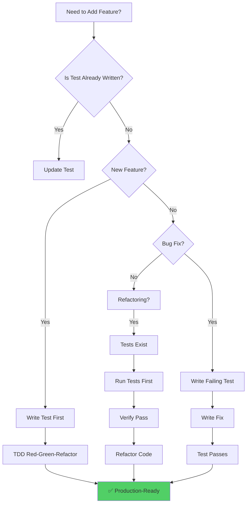

### TDD Red-Green-Refactor Cycle

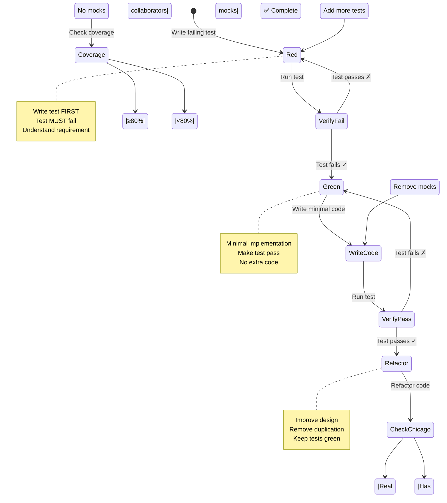

### Step-by-Step Guide

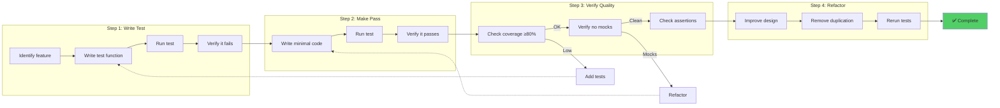

### Practical Example

**Scenario**: Add a `count_tools/1` function to `erlmcp_server`

**Step 1: Write Test First**
```erlang
% File: apps/erlmcp_core/test/erlmcp_server_tests.erl

count_tools_test_() ->
    {setup,
     fun() -> {ok, Pid} = erlmcp_server:start_link(), Pid end,
     fun(Pid) -> ok = erlmcp_server:stop(Pid) end,
     fun(Pid) ->
         [
          ?_test(count_zero_tools(Pid)),
          ?_test(count_multiple_tools(Pid))
         ]
     end}.

count_zero_tools(Pid) ->
    % Exercise: Call new function
    {ok, Count} = erlmcp_server:count_tools(Pid),

    % Verify: Should be 0 (state-based)
    ?assertEqual(0, Count).

count_multiple_tools(Pid) ->
    % Setup: Add tools
    ok = erlmcp_server:add_tool(Pid, #{name => <<"tool1">>}),
    ok = erlmcp_server:add_tool(Pid, #{name => <<"tool2">>}),
    ok = erlmcp_server:add_tool(Pid, #{name => <<"tool3">>}),

    % Exercise: Count tools
    {ok, Count} = erlmcp_server:count_tools(Pid),

    % Verify: Should be 3
    ?assertEqual(3, Count).
```

**Step 2: Run Test (Verify it Fails)**
```bash
rebar3 eunit --module=erlmcp_server_tests
# Expected: undefined function count_tools/1
```

**Step 3: Write Minimal Code**
```erlang
% File: apps/erlmcp_core/src/erlmcp_server.erl

% Add to handle_call
handle_call({count_tools}, _From, State) ->
    Count = maps:size(State#state.tools),
    {reply, {ok, Count}, State};
```

**Step 4: Run Test (Verify it Passes)**
```bash
rebar3 eunit --module=erlmcp_server_tests
# Expected: All tests passed
```

**Step 5: Check Coverage**
```bash
rebar3 cover --verbose
# Expected: count_tools/1 coverage = 100%
```

**Step 6: Verify Chicago School**
```bash
# Check: No mocks? ✓
# Check: Real gen_server? ✓
# Check: State-based assertion? ✓
```

**Step 7: Refactor (if needed)**
```erlang
% Refactor for clarity
handle_call({count_tools}, _From, State) ->
    Tools = State#state.tools,
    Count = maps:size(Tools),
    {reply, {ok, Count}, State}.
```

---

## Workflow 2: Debugging Failing Tests

### Diagnostic Flowchart

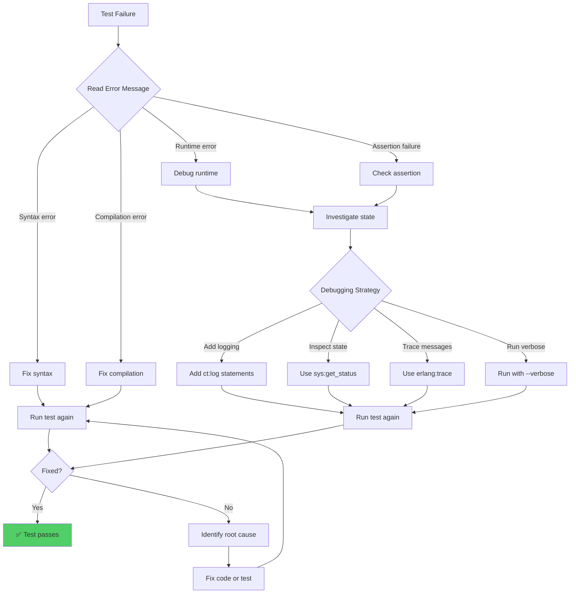

### Common Failure Patterns

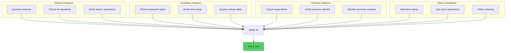

### Debugging Techniques

**Technique 1: Verbose Output**
```bash
# Run with verbose logging
rebar3 eunit --module=erlmcp_server_tests --verbose

# Enable debug logging
rebar3 shell
# In shell:
application:ensure_all_started(erlmcp).
logger:set_primary_config(level, all).
eunit:test(erlmcp_server_tests, [verbose]).
```

**Technique 2: Inspect Process State**
```erlang
debug_state_test() ->
    {ok, Pid} = erlmcp_server:start_link(),

    % Inspect internal state
    {status, Pid, {module, erlmcp_server}, Status} =
        sys:get_status(Pid),

    % Log state for debugging
    ct:log("Server state: ~p", [Status]),

    ?assertEqual(expected, get_state_value(Pid)),

    erlmcp_server:stop(Pid).
```

**Technique 3: Message Tracing**
```erlang
trace_messages_test() ->
    {ok, Pid} = erlmcp_server:start_link(),

    % Trace all messages to/from Pid
    erlang:trace(Pid, true, [send, 'receive']),

    % Exercise system
    ok = erlmcp_server:add_tool(Pid, #{name => <<"test">>}),

    % Allow time for messages
    timer:sleep(100),

    % Check trace output in logs
    ct:log("Trace output: ~p", [erlang:trace_info(Pid, flags)]),

    erlmcp_server:stop(Pid).
```

**Technique 4: Step-by-Step Execution**
```erlang
step_by_step_test() ->
    {ok, Pid} = erlmcp_server:start_link(),

    % Step 1: Verify server started
    ct:log("Step 1: Server started"),
    ?assert(is_process_alive(Pid)),

    % Step 2: Add tool
    ct:log("Step 2: Adding tool"),
    ok = erlmcp_server:add_tool(Pid, #{name => <<"tool1">>}),
    ct:log("Tool added successfully"),

    % Step 3: Verify tool count
    ct:log("Step 3: Checking tool count"),
    {ok, Count} = erlmcp_server:count_tools(Pid),
    ct:log("Tool count: ~p", [Count]),
    ?assertEqual(1, Count),

    erlmcp_server:stop(Pid).
```

---

## Workflow 3: Adding Coverage to Untested Modules

### Gap Analysis Workflow

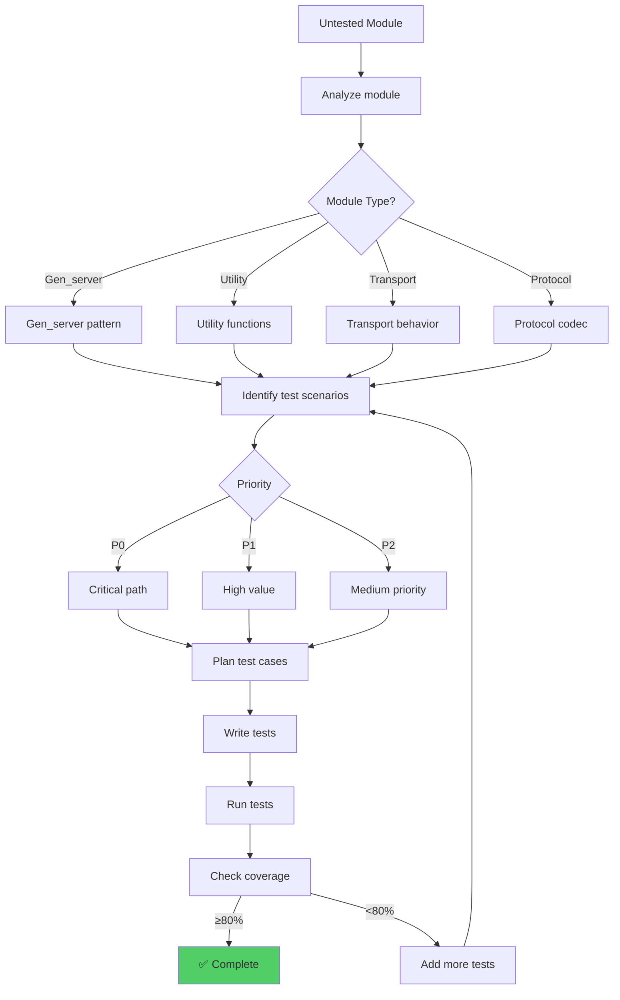

### Coverage Improvement Strategy

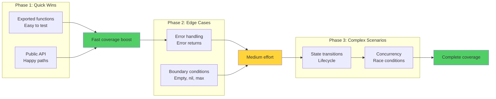

### Step-by-Step Coverage Improvement

**Example**: Add tests to `erlmcp_hooks` (0% coverage, 597 LOC)

**Step 1: Analyze Module**
```bash
# Check module structure
grep "^[a-z].*(" apps/erlmcp_core/src/erlmcp_hooks.erl | head -20

# Output:
# add_hook(Name, Handler)
# remove_hook(Name)
# execute_hook(Name, Args)
# list_hooks()
```

**Step 2: Identify Test Scenarios**
```erlang
% Test scenarios for erlmcp_hooks

%% Basic operations (Phase 1: Quick Wins)
% ✓ Add hook
% ✓ Remove hook
% ✓ Execute hook
% ✓ List hooks

%% Edge cases (Phase 2)
% ✓ Add duplicate hook
% ✓ Remove non-existent hook
% ✓ Execute non-existent hook
% ✓ Hook returns error

%% Complex scenarios (Phase 3)
% ✓ Multiple hooks for same event
% ✓ Hook execution order
% ✓ Hook failure handling
```

**Step 3: Write Tests (Phased Approach)**

**Phase 1: Quick Wins (30% coverage)**
```erlang
-module(erlmcp_hooks_tests).
-include_lib("eunit/include/eunit.hrl").

hooks_basic_test_() ->
    {setup,
     fun() -> {ok, Pid} = erlmcp_hooks:start_link(), Pid end,
     fun(Pid) -> ok = erlmcp_hooks:stop(Pid) end,
     fun(Pid) ->
         [
          ?_test(add_hook(Pid)),
          ?_test(execute_hook(Pid)),
          ?_test(list_hooks(Pid))
         ]
     end}.

add_hook(Pid) ->
    Handler = fun(_) -> ok end,
    ok = erlmcp_hooks:add_hook(Pid, <<"test_hook">>, Handler).

execute_hook(Pid) ->
    Handler = fun(Args) -> {ok, Args} end,
    ok = erlmcp_hooks:add_hook(Pid, <<"echo">>, Handler),

    {ok, Result} = erlmcp_hooks:execute_hook(Pid, <<"echo">>, #{msg => hello}),
    ?assertEqual(#{msg => hello}, Result).

list_hooks(Pid) ->
    Handler = fun(_) -> ok end,
    ok = erlmcp_hooks:add_hook(Pid, <<"hook1">>, Handler),
    ok = erlmcp_hooks:add_hook(Pid, <<"hook2">>, Handler),

    {ok, Hooks} = erlmcp_hooks:list_hooks(Pid),
    ?assertEqual(2, length(Hooks)).
```

**Phase 2: Edge Cases (60% coverage)**
```erlang
hooks_edge_cases_test_() ->
    {setup,
     fun() -> {ok, Pid} = erlmcp_hooks:start_link(), Pid end,
     fun(Pid) -> ok = erlmcp_hooks:stop(Pid) end,
     fun(Pid) ->
         [
          ?_test(add_duplicate_hook(Pid)),
          ?_test(remove_nonexistent_hook(Pid)),
          ?_test(execute_nonexistent_hook(Pid)),
          ?_test(hook_returns_error(Pid))
         ]
     end}.

add_duplicate_hook(Pid) ->
    Handler = fun(_) -> ok end,
    ok = erlmcp_hooks:add_hook(Pid, <<"dup">>, Handler),
    % Adding same hook again should fail or replace
    Result = erlmcp_hooks:add_hook(Pid, <<"dup">>, Handler),
    ?assertEqual({error, exists}, Result).

remove_nonexistent_hook(Pid) ->
    Result = erlmcp_hooks:remove_hook(Pid, <<"nonexistent">>),
    ?assertEqual({error, not_found}, Result).

execute_nonexistent_hook(Pid) ->
    Result = erlmcp_hooks:execute_hook(Pid, <<"nonexistent">>, #{}),
    ?assertEqual({error, not_found}, Result).

hook_returns_error(Pid) ->
    Handler = fun(_) -> {error, failed} end,
    ok = erlmcp_hooks:add_hook(Pid, <<"failing">>, Handler),

    Result = erlmcp_hooks:execute_hook(Pid, <<"failing">>, #{}),
    ?assertEqual({error, failed}, Result).
```

**Phase 3: Complex Scenarios (80%+ coverage)**
```erlang
hooks_complex_test_() ->
    {setup,
     fun() -> {ok, Pid} = erlmcp_hooks:start_link(), Pid end,
     fun(Pid) -> ok = erlmcp_hooks:stop(Pid) end,
     fun(Pid) ->
         [
          ?_test(multiple_hooks_execution(Pid)),
          ?_test(hook_execution_order(Pid)),
          ?_test(hook_failure_handling(Pid))
         ]
     end}.

multiple_hooks_execution(Pid) ->
    % Register multiple hooks for same event
    H1 = fun(Args) -> maps:put(h1, true, Args) end,
    H2 = fun(Args) -> maps:put(h2, true, Args) end,
    H3 = fun(Args) -> maps:put(h3, true, Args) end,

    ok = erlmcp_hooks:add_hook(Pid, <<"multi">>, H1),
    ok = erlmcp_hooks:add_hook(Pid, <<"multi">>, H2),
    ok = erlmcp_hooks:add_hook(Pid, <<"multi">>, H3),

    % Execute and verify all hooks ran
    {ok, Result} = erlmcp_hooks:execute_hook(Pid, <<"multi">>, #{}),
    ?assertEqual(true, maps:get(h1, Result)),
    ?assertEqual(true, maps:get(h2, Result)),
    ?assertEqual(true, maps:get(h3, Result)).

hook_execution_order(Pid) ->
    % Verify hooks execute in registration order
    OrderRef = make_ref(),
    PidSelf = self(),

    H1 = fun(_) -> PidSelf ! {hook, 1}, ok end,
    H2 = fun(_) -> PidSelf ! {hook, 2}, ok end,
    H3 = fun(_) -> PidSelf ! {hook, 3}, ok end,

    ok = erlmcp_hooks:add_hook(Pid, <<"order">>, H1),
    ok = erlmcp_hooks:add_hook(Pid, <<"order">>, H2),
    ok = erlmcp_hooks:add_hook(Pid, <<"order">>, H3),

    erlmcp_hooks:execute_hook(Pid, <<"order">>, #{}),

    % Verify execution order
    receive {hook, 1} -> ok end,
    receive {hook, 2} -> ok end,
    receive {hook, 3} -> ok end.

hook_failure_handling(Pid) ->
    % Register 3 hooks, middle one fails
    H1 = fun(_) -> {ok, h1} end,
    H2 = fun(_) -> {error, fail} end,
    H3 = fun(_) -> {ok, h3} end,

    ok = erlmcp_hooks:add_hook(Pid, <<"fail">>, H1),
    ok = erlmcp_hooks:add_hook(Pid, <<"fail">>, H2),
    ok = erlmcp_hooks:add_hook(Pid, <<"fail">>, H3),

    % Execute: should handle failure gracefully
    Result = erlmcp_hooks:execute_hook(Pid, <<"fail">>, #{}),

    % Verify: Either all execute or stop on failure
    ?assertMatch({ok, _} orelse {error, _}, Result).
```

**Step 4: Check Coverage**
```bash
# Run tests
rebar3 eunit --module=erlmcp_hooks_tests

# Check coverage
rebar3 cover --verbose | grep erlmcp_hooks

# Expected: 80%+ coverage
```

---

## Workflow 4: Setting Up Integration Tests

### Integration Test Decision Tree

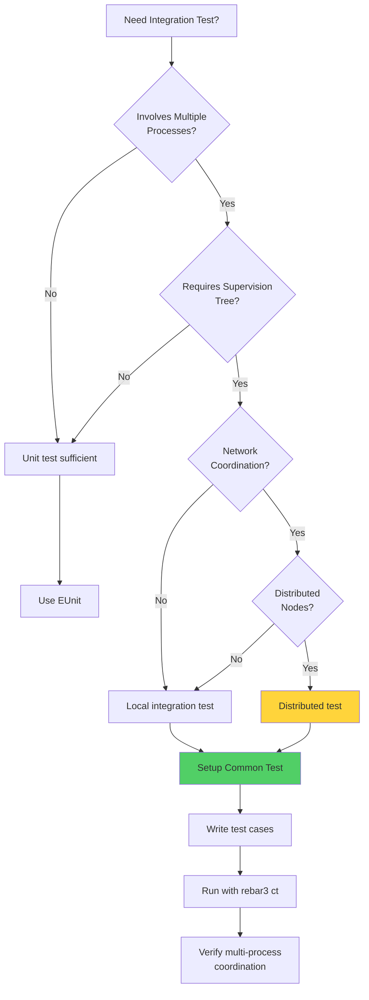

### Common Test Setup Flow

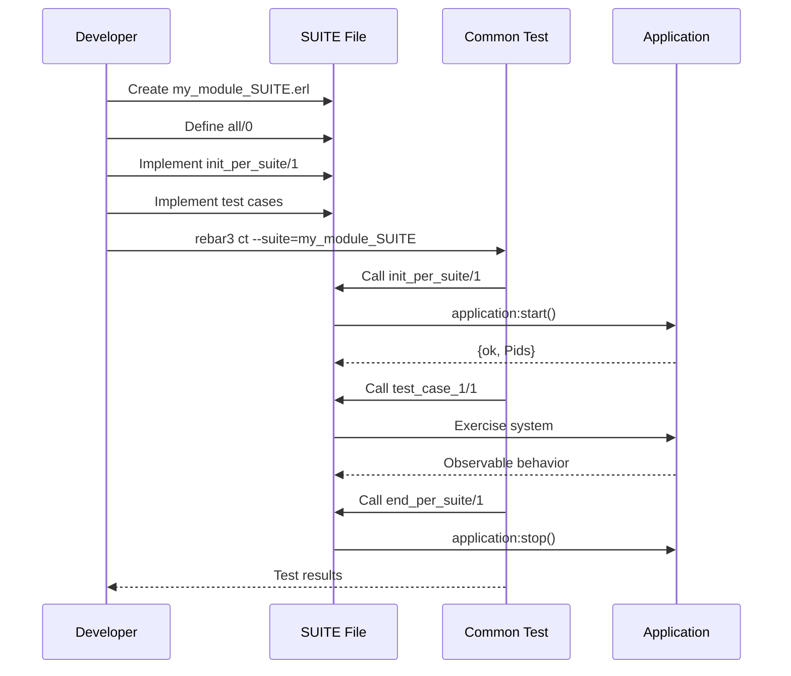

### Step-by-Step Integration Test Setup

**Scenario**: Test client-server communication with registry

**Step 1: Create SUITE File**
```erlang
% File: apps/erlmcp_core/test/erlmcp_client_server_SUITE.erl

-module(erlmcp_client_server_SUITE).
-compile(export_all).
-include_lib("common_test/include/ct.hrl").

%% Test cases
all() -> [
    client_server_communication,
    registry_coordination,
    supervised_restart
].

%% Suite setup
init_per_suite(Config) ->
    application:ensure_all_started(erlmcp),
    Config.

end_per_suite(_Config) ->
    application:stop(erlmcp).

%% Test case setup
init_per_testcase(_TestCase, Config) ->
    Config.

end_per_testcase(_TestCase, _Config) ->
    ok.
```

**Step 2: Write First Test Case**
```erlang
client_server_communication(Config) ->
    % Setup: Start registry
    {ok, Registry} = erlmcp_registry:start_link(),

    % Setup: Start server
    {ok, Server} = erlmcp_server:start_link(
        #{name => <<"test_server">>}
    ),

    % Setup: Start client
    {ok, Client} = erlmcp_client:start_link(
        #{server_name => <<"test_server">>}
    ),

    % Exercise: Send request via client
    Request = #{jsonrpc => <<"2.0">>, id => 1, method => <<"ping">>},
    {ok, Response} = erlmcp_client:send_request(Client, Request),

    % Verify: Response received
    ?assertEqual(<<"2.0">>, maps:get(jsonrpc, Response)),
    ?assertEqual(1, maps:get(id, Response)),
    ?assert(maps:is_key(result, Response)),

    % Teardown
    ok = erlmcp_client:stop(Client),
    ok = erlmcp_server:stop(Server),
    ok = erlmcp_registry:stop(Registry).
```

**Step 3: Write Registry Coordination Test**
```erlang
registry_coordination(Config) ->
    % Setup: Start registry
    {ok, Registry} = erlmcp_registry:start_link(),

    % Setup: Start multiple servers
    {ok, Server1} = erlmcp_server:start_link(#{name => <<"s1">>}),
    {ok, Server2} = erlmcp_server:start_link(#{name => <<"s2">>}),

    % Exercise: Verify both registered
    {ok, Pid1} = erlmcp_registry:whereis_name({mcp, server, <<"s1">>}),
    {ok, Pid2} = erlmcp_registry:whereis_name({mcp, server, <<"s2">>}),

    ?assertEqual(Server1, Pid1),
    ?assertEqual(Server2, Pid2),

    % Exercise: Client discovers servers
    {ok, Servers} = erlmcp_registry:list_names({mcp, server}),
    ?assertEqual(2, length(Servers)),

    % Teardown
    ok = erlmcp_server:stop(Server1),
    ok = erlmcp_server:stop(Server2),
    ok = erlmcp_registry:stop(Registry).
```

**Step 4: Write Supervision Test**
```erlang
supervised_restart(Config) ->
    % Setup: Start application (starts supervision tree)
    {ok, SupPid} = erlmcp_core_sup:start_link(),

    % Get initial server PID
    {children, Children} = supervisor:which_children(SupPid),
    {erlmcp_server, InitialPid, _, _} =
        lists:keyfind(erlmcp_server, 1, Children),

    % Exercise: Kill server
    exit(InitialPid, kill),
    timer:sleep(100), % Allow supervisor to restart

    % Verify: Server restarted
    {children, NewChildren} = supervisor:which_children(SupPid),
    {erlmcp_server, NewPid, _, _} =
        lists:keyfind(erlmcp_server, 1, NewChildren),

    ?assertNotEqual(InitialPid, NewPid),
    ?assert(is_process_alive(NewPid)),

    % Teardown
    erlmcp_core_sup:stop(SupPid).
```

**Step 5: Run Integration Tests**
```bash
# Run specific suite
rebar3 ct --suite=erlmcp_client_server_SUITE

# Run with verbose output
rebar3 ct --suite=erlmcp_client_server_SUITE --verbose

# Check results
ls -l _build/test/logs/
```

---

## Workflow 5: Running Tests in CI/CD

### CI/CD Pipeline Flow

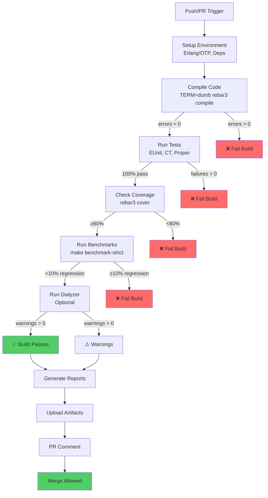

### GitHub Actions Workflow

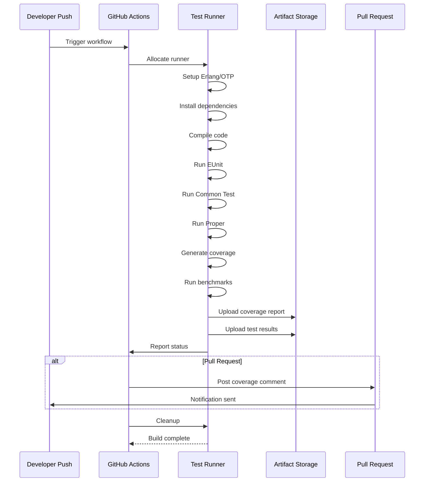

### Setting Up CI/CD

**Step 1: Create GitHub Actions Workflow**
```yaml
# File: .github/workflows/test.yml

name: Test Suite

on:
  push:
    branches: [ main, develop ]
  pull_request:
    branches: [ main ]

jobs:
  test:
    runs-on: ubuntu-latest
    strategy:
      matrix:
        otp: [25, 26, 27]

    steps:
      - name: Checkout code
        uses: actions/checkout@v3

      - name: Setup Erlang/OTP
        uses: erlang-solutions/erlang-otp-actions@v1
        with:
          otp-version: ${{ matrix.otp }}

      - name: Fetch dependencies
        run: rebar3 get-deps

      - name: Compile
        run: TERM=dumb rebar3 compile

      - name: Run tests
        run: make test-strict

      - name: Check coverage
        run: make coverage-strict

      - name: Run benchmarks
        run: make benchmark-strict

      - name: Upload coverage
        uses: actions/upload-artifact@v3
        with:
          name: coverage-${{ matrix.otp }}
          path: _build/test/cover/

      - name: Upload test results
        uses: actions/upload-artifact@v3
        with:
          name: test-results-${{ matrix.otp }}
          path: _build/test/logs/
```

**Step 2: Test Locally Before Push**
```bash
# Run same tests as CI
make quality-strict

# Verify coverage
rebar3 cover --verbose

# Verify no regressions
make benchmark-strict
```

**Step 3: Push and Monitor**
```bash
# Commit and push
git add .
git commit -m "Add test coverage for module X"
git push origin feature/add-tests

# Monitor GitHub Actions
# Open: https://github.com/user/repo/actions
```

**Step 4: Review Artifacts**
```bash
# Download coverage report from GitHub Actions
# Open index.html
open _build/test/cover/index.html
```

---

## Summary

**Workflow Coverage:**

- ✅ **Writing First Test**: TDD red-green-refactor cycle
- ✅ **Debugging Failures**: Diagnostic flowchart and techniques
- ✅ **Adding Coverage**: Phased approach (quick wins → edge cases → complex)
- ✅ **Integration Tests**: Multi-process Common Test setup
- ✅ **CI/CD Pipeline**: GitHub Actions automation

**Key Takeaways:**

1. **Always write tests first** (TDD)
2. **Use real collaborators** (Chicago School)
3. **Test observable behavior** (state-based)
4. **Add coverage in phases** (30% → 60% → 80%+)
5. **Debug with logging and tracing**
6. **Automate in CI/CD**

---

**Related Documentation:**
- [README](README.md) - Testing overview
- [TDD Strategy](tdd-strategy.md) - Chicago School methodology
- [Test Patterns](TEST_PATTERNS_LIBRARY.md) - Comprehensive patterns
- [Testing Architecture](TESTING_ARCHITECTURE.md) - System design

**Last Updated:** 2026-01-31
**Maintained by:** erlang-test-engineer agent
**Version:** 2.1.0
