# Test Patterns Library - Comprehensive Visual Guide

**Version:** 2.1.0
**Last Updated:** 2026-01-31
**Status:** Production-Ready

---

## Overview

This document provides a comprehensive library of testing patterns used in erlmcp, each illustrated with detailed Mermaid diagrams showing test structure, execution flow, and verification strategies. All patterns follow **Chicago School TDD** principles: real collaborators, state-based verification, and observable behavior testing.

---

## Pattern Categories

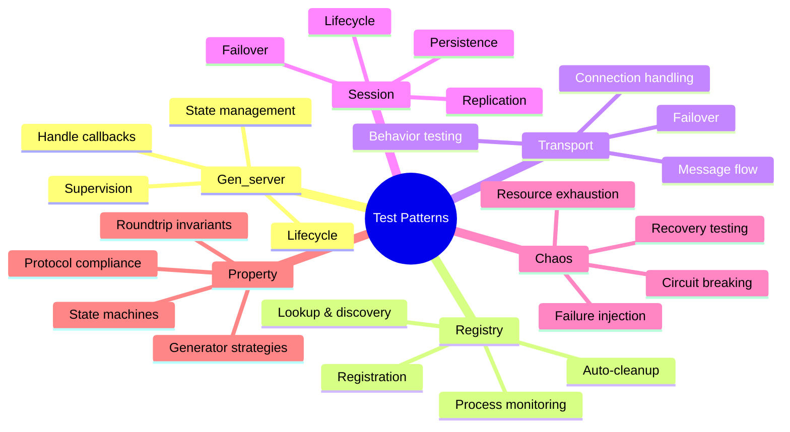

---

## Pattern 1: Gen_server Lifecycle Testing

### Purpose

Verify gen_server starts correctly, handles initialization, stops gracefully, and cleans up resources.

### Test Structure

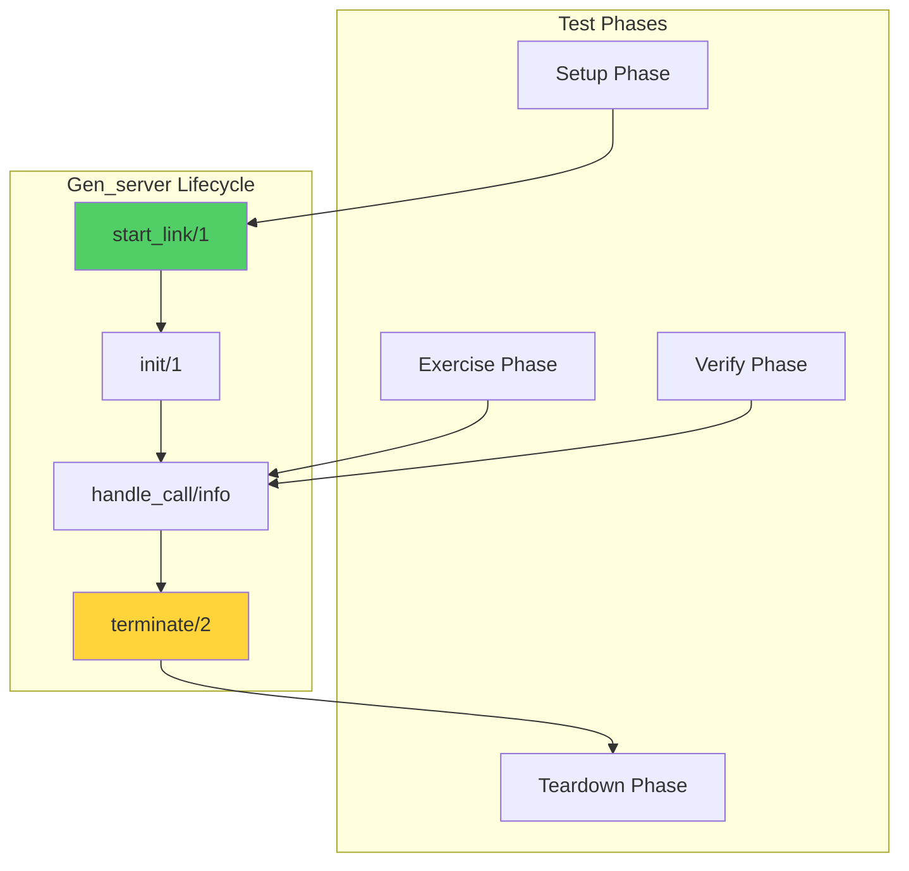

### Sequence Diagram

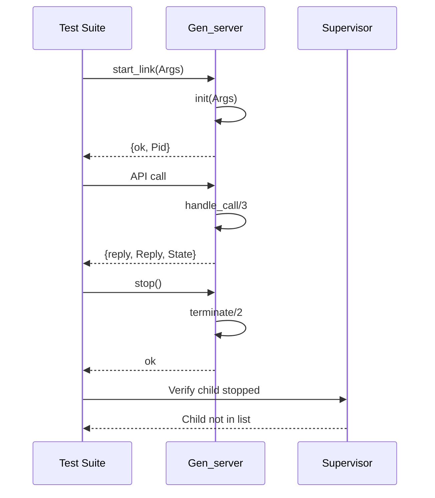

### Implementation Template

```erlang
-module(my_server_tests).
-include_lib("eunit/include/eunit.hrl").

server_lifecycle_test_() ->
    {setup,
     fun setup/0,
     fun cleanup/1,
     fun tests/1}.

setup() ->
    {ok, Pid} = my_server:start_link(#{name => test}),
    Pid.

cleanup(Pid) ->
    ok = my_server:stop(Pid),
    % Verify process is dead
    undefined = process_info(Pid).

tests(Pid) ->
    [
     ?_test(started_successfully(Pid)),
     ?_test(handle_call_works(Pid)),
     ?_test(stop_is_graceful(Pid))
    ].

started_successfully(Pid) ->
    ?assertNotEqual(undefined, process_info(Pid)),
    ?assert(is_process_alive(Pid)).

handle_call_works(Pid) ->
    {ok, Result} = my_server:do_something(Pid, arg),
    ?assertEqual(expected, Result).

stop_is_graceful(Pid) ->
    ok = my_server:stop(Pid),
    timer:sleep(100),
    ?assertEqual(false, is_process_alive(Pid)).
```

---

## Pattern 2: Registry Testing

### Purpose

Verify process registration, lookup by name, process monitoring, and auto-cleanup on process death.

### Registration Flow

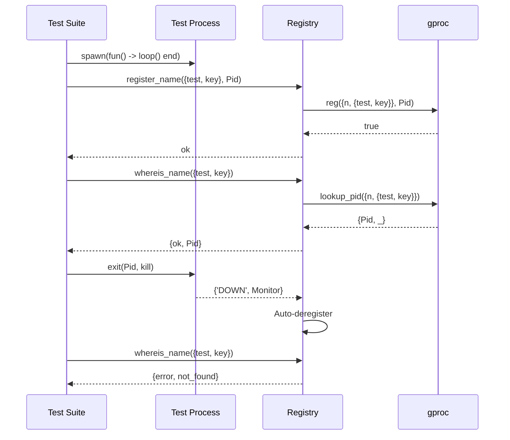

### State Transitions

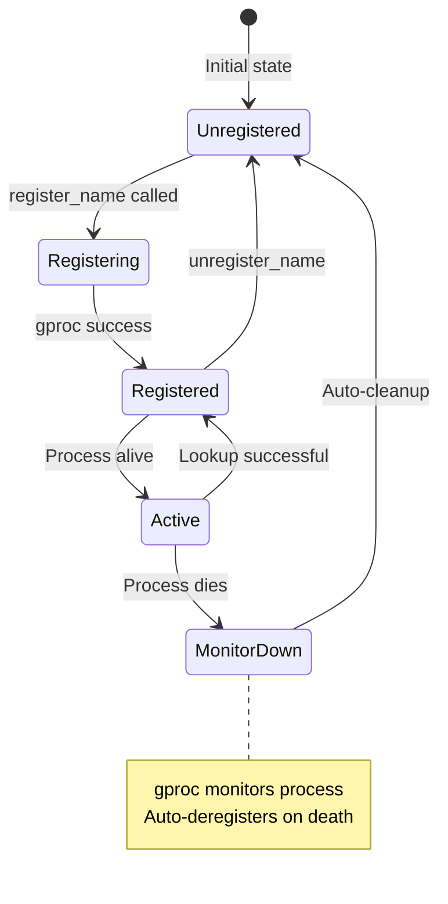

### Implementation Template

```erlang
registry_test_() ->
    {setup,
     fun() ->
         application:ensure_all_started(erlmcp),
         erlmcp_registry
     end,
     fun(_) ->
         application:stop(erlmcp)
     end,
     fun(_) ->
         [
          ?_test(register_and_lookup()),
          ?_test(auto_cleanup_on_death()),
          ?_test(unregister_removes_entry())
         ]
     end}.

register_and_lookup() ->
    % Setup: Spawn process
    Pid = spawn(fun() -> receive stop -> ok end end),

    % Exercise: Register
    ok = erlmcp_registry:register_name({test, key}, Pid),

    % Verify: Lookup returns same Pid (state-based)
    {ok, FoundPid} = erlmcp_registry:whereis_name({test, key}),
    ?assertEqual(Pid, FoundPid),

    % Cleanup
    Pid ! stop.

auto_cleanup_on_death() ->
    % Setup: Register process
    Pid = spawn(fun() -> receive stop -> ok end end),
    ok = erlmcp_registry:register_name({test, auto}, Pid),

    % Verify: Registered
    {ok, Pid} = erlmcp_registry:whereis_name({test, auto}),

    % Exercise: Kill process
    exit(Pid, kill),
    timer:sleep(100), % Allow monitor to trigger

    % Verify: Auto-deregistered (observable behavior)
    ?assertEqual({error, not_found},
                 erlmcp_registry:whereis_name({test, auto})).

unregister_removes_entry() ->
    % Setup: Register
    Pid = spawn(fun() -> receive stop -> ok end end),
    ok = erlmcp_registry:register_name({test, manual}, Pid),

    % Exercise: Unregister
    ok = erlmcp_registry:unregister_name({test, manual}),

    % Verify: Not found
    ?assertEqual({error, not_found},
                 erlmcp_registry:whereis_name({test, manual})),

    % Cleanup
    Pid ! stop.
```

---

## Pattern 3: Transport Behavior Testing

### Purpose

Verify transport behavior compliance: init, send, close, and error handling for all transport types (stdio, TCP, HTTP, WebSocket).

### Transport Interface

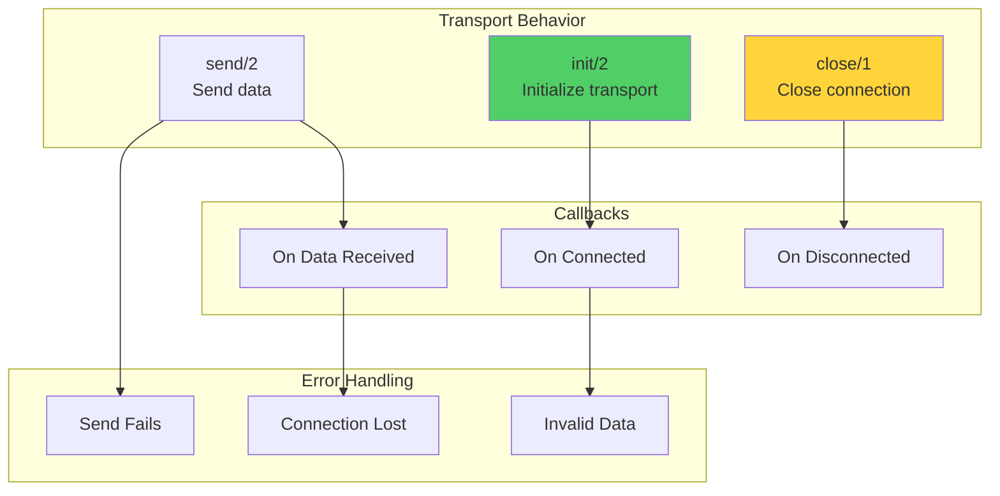

### Message Flow (stdio Transport)

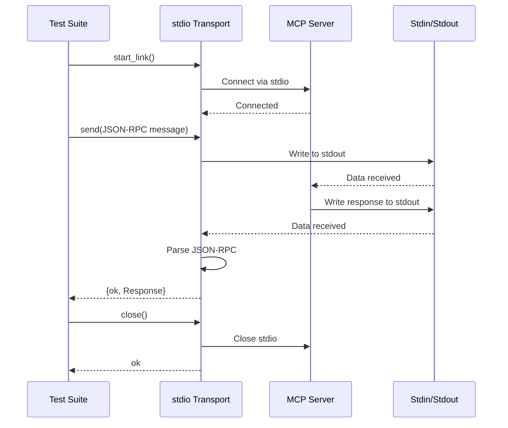

### Implementation Template

```erlang
transport_test_() ->
    {setup,
     fun() ->
         {ok, Transport} = erlmcp_transport_stdio:start_link(),
         Transport
     end,
     fun(Transport) ->
         erlmcp_transport_stdio:close(Transport)
     end,
     fun(Transport) ->
         [
          ?_test(initialization(Transport)),
          ?_test(send_data(Transport)),
          ?_test(receive_data(Transport)),
          ?_test(close_connection(Transport))
         ]
     end}.

initialization(Transport) ->
    % Verify: Transport initialized successfully
    ?assert(is_process_alive(Transport)).

send_data(Transport) ->
    Message = #{
        jsonrpc => <<"2.0">>,
        id => 1,
        method => <<"test">>
    },

    % Exercise: Send message
    Result = erlmcp_transport_stdio:send(Message, Transport),

    % Verify: Send succeeds
    ?assertEqual(ok, Result).

receive_data(Transport) ->
    % Exercise: Simulate incoming data
    JSON = <<"{\"jsonrpc\":\"2.0\",\"id\":1,\"result\":{}}">>,

    % Transport would normally receive this via stdin
    % For testing, we verify the transport handles it
    {ok, Decoded} = jsx:decode(JSON, [return_maps]),
    ?assertEqual(<<"2.0">>, maps:get(<<"jsonrpc">>, Decoded)).

close_connection(Transport) ->
    % Exercise: Close transport
    ok = erlmcp_transport_stdio:close(Transport),

    % Verify: Transport stopped
    timer:sleep(100),
    ?assertEqual(false, is_process_alive(Transport)).
```

---

## Pattern 4: Session Persistence Testing

### Purpose

Verify session data survives server restarts across different backends (ETS, DETS, Mnesia).

### Backend Comparison

```mermaid
graph TB
    subgraph "ETS Backend"
        E1[In-Memory]
        E2[Fastest O(1)]
        E3[Lost on restart]
    end

    subgraph "DETS Backend"
        D1[Disk Storage]
        D2[Fast O(1)]
        D3[Persistent]
    end

    subgraph "Mnesia Backend"
        M1[Distributed]
        M2[Replicated]
        M3[Cluster-wide]
    end

    E1 --> Speed[Speed: ETS > DETS > Mnesia]
    D1 --> Speed
    M1 --> Speed

    E3 --> Durability[Durability: Mnesia > DETS > ETS]
    D3 --> Durability
    M3 --> Durability

    style Speed fill:#ffd43b
    style Durability fill:#51cf66
```

### Persistence Flow

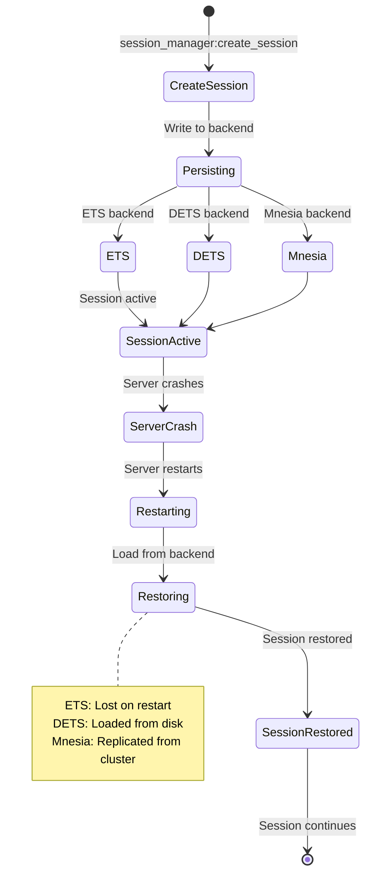

### Implementation Template

```erlang
session_persistence_test_() ->
    {setup,
     fun() ->
         % Setup: Start with DETS backend
         {ok, SessionMgr} = erlmcp_session_manager:start_link(
             #{
                 backend => erlmcp_session_dets,
                 backend_opts => #{
                     file_path => "/tmp/test_session.dets"
                 }
             }
         ),
         SessionMgr
     end,
     fun(SessionMgr) ->
         % Cleanup: Stop manager and remove file
         ok = erlmcp_session_manager:stop(SessionMgr),
         file:delete("/tmp/test_session.dets")
     end,
     fun(SessionMgr) ->
         [
          ?_test(create_and_retrieve(SessionMgr)),
          ?_test(update_session(SessionMgr)),
          ?_test(delete_session(SessionMgr)),
          ?_test(persists_across_restart(SessionMgr))
         ]
     end}.

create_and_retrieve(SessionMgr) ->
    SessionId = <<"session-123">>,
    SessionData = #{user_id => <<"user-456">>},

    % Exercise: Create session
    ok = erlmcp_session_manager:create_session(
        SessionMgr, SessionId, SessionData
    ),

    % Verify: Retrieve session (state-based)
    {ok, Retrieved} = erlmcp_session_manager:get_session(
        SessionMgr, SessionId
    ),
    ?assertEqual(SessionData, Retrieved).

update_session(SessionMgr) ->
    SessionId = <<"session-789">>,
    InitialData = #{count => 1},

    ok = erlmcp_session_manager:create_session(
        SessionMgr, SessionId, InitialData
    ),

    % Exercise: Update session
    UpdatedData = #{count => 2},
    ok = erlmcp_session_manager:update_session(
        SessionMgr, SessionId, UpdatedData
    ),

    % Verify: Session updated
    {ok, Retrieved} = erlmcp_session_manager:get_session(
        SessionMgr, SessionId
    ),
    ?assertEqual(UpdatedData, Retrieved).

delete_session(SessionMgr) ->
    SessionId = <<"session-delete">>,
    SessionData = #{test => true},

    ok = erlmcp_session_manager:create_session(
        SessionMgr, SessionId, SessionData
    ),

    % Exercise: Delete session
    ok = erlmcp_session_manager:delete_session(SessionMgr, SessionId),

    % Verify: Session gone
    ?assertEqual(
        {error, not_found},
        erlmcp_session_manager:get_session(SessionMgr, SessionId)
    ).

persists_across_restart(_SessionMgr) ->
    SessionId = <<"session-persist">>,
    SessionData = #{persistent => true},

    % Setup: Create session before restart
    {ok, SessionMgr1} = erlmcp_session_manager:start_link(
        #{
            backend => erlmcp_session_dets,
            backend_opts => #{
                file_path => "/tmp/test_session_restart.dets"
            }
         }
    ),

    ok = erlmcp_session_manager:create_session(
        SessionMgr1, SessionId, SessionData
    ),

    % Exercise: Crash and restart
    exit(SessionMgr1, kill),
    timer:sleep(100),

    {ok, SessionMgr2} = erlmcp_session_manager:start_link(
        #{
            backend => erlmcp_session_dets,
            backend_opts => #{
                file_path => "/tmp/test_session_restart.dets"
            }
         }
    ),

    % Verify: Session restored from disk
    {ok, Restored} = erlmcp_session_manager:get_session(
        SessionMgr2, SessionId
    ),
    ?assertEqual(SessionData, Restored),

    % Cleanup
    ok = erlmcp_session_manager:stop(SessionMgr2),
    file:delete("/tmp/test_session_restart.dets").
```

---

## Pattern 5: Chaos Engineering Testing

### Purpose

Verify system resilience through controlled failure injection (network failures, process crashes, resource exhaustion).

### Failure Scenarios

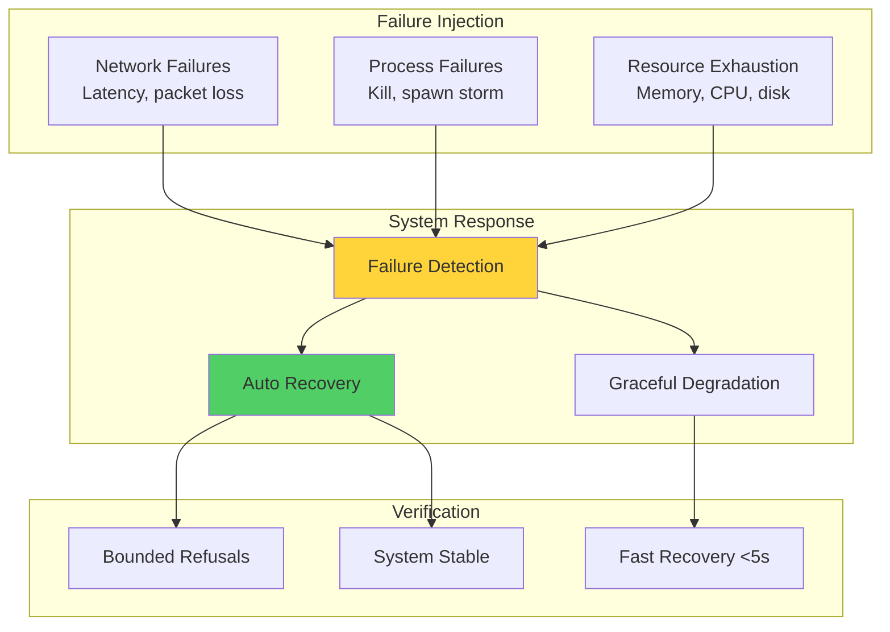

### Chaos Test Flow

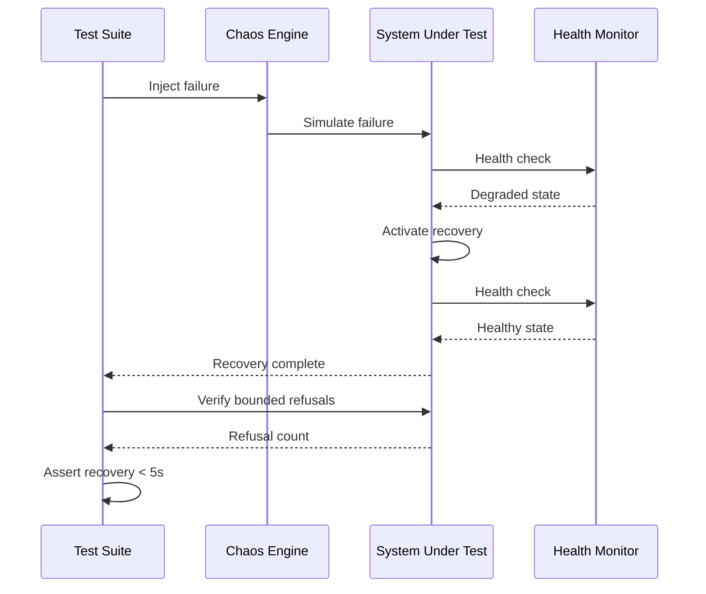

### Implementation Template

```erlang
chaos_test_() ->
    {setup,
     fun() ->
         application:ensure_all_started(erlmcp),
         erlmcp_chaos:start_link()
     end,
     fun(Chaos) ->
         erlmcp_chaos:stop(Chaos),
         application:stop(erlmcp)
     end,
     fun(Chaos) ->
         [
          ?_test(network_latency(Chaos)),
          ?_test(process_kill(Chaos)),
          ?_test(memory_exhaustion(Chaos))
         ]
     end}.

network_latency(Chaos) ->
    % Setup: Start server
    {ok, Server} = erlmcp_server:start_link(),

    % Exercise: Inject 100ms latency
    ok = erlmcp_chaos:inject_latency(Chaos, network, 100),

    % Verify: Requests still succeed (slower but working)
    StartTime = erlang:monotonic_time(millisecond),
    {ok, _Result} = erlmcp_server:list_tools(Server),
    EndTime = erlang:monotonic_time(millisecond),

    ResponseTime = EndTime - StartTime,
    ?assert(ResponseTime >= 100),
    ?assert(ResponseTime < 500), % Should complete

    % Cleanup
    ok = erlmcp_chaos:remove_injection(Chaos, network),
    erlmcp_server:stop(Server).

process_kill(Chaos) ->
    % Setup: Start supervised server
    {ok, Sup} = erlmcp_core_sup:start_link(),
    {children, Children} = supervisor:which_children(Sup),
    {erlmcp_server, InitialPid, _, _} =
        lists:keyfind(erlmcp_server, 1, Children),

    % Exercise: Kill process
    exit(InitialPid, kill),
    timer:sleep(100), % Allow supervisor to restart

    % Verify: Process restarted (observable behavior)
    {children, NewChildren} = supervisor:which_children(Sup),
    {erlmcp_server, NewPid, _, _} =
        lists:keyfind(erlmcp_server, 1, NewChildren),

    ?assertNotEqual(InitialPid, NewPid),
    ?assert(is_process_alive(NewPid)),

    % Verify: Recovery time < 5s
    ?assert(timer:sleep(5000) =:= ok),

    % Cleanup
    erlmcp_core_sup:stop(Sup).

memory_exhaustion(Chaos) ->
    % Setup: Start server
    {ok, Server} = erlmcp_server:start_link(),

    % Exercise: Inject memory pressure
    ok = erlmcp_chaos:inject_memory_pressure(Chaos, 80), % 80% usage

    % Verify: Server degrades gracefully
    {ok, Status} = erlmcp_server:get_status(Server),
    ?assertEqual(degraded, maps:get(state, Status)),

    % Verify: Requests return bounded refusals (not crashes)
    RefusalCount = lists:foldl(
        fun(_, Acc) ->
            case erlmcp_server:list_tools(Server) of
                {error, resource_exhausted} -> Acc + 1;
                {ok, _} -> Acc
            end
        end,
        0,
        lists:seq(1, 100)
    ),

    ?assert(RefusalCount > 0), % Some refusals
    ?assert(RefusalCount < 100), % Not all refused (bounded)

    % Cleanup
    ok = erlmcp_chaos:remove_injection(Chaos, memory),
    erlmcp_server:stop(Server).
```

---

## Pattern 6: Property-Based Testing

### Purpose

Find edge cases through generative testing of invariants (roundtrips, state machines, protocol compliance).

### Property Test Structure

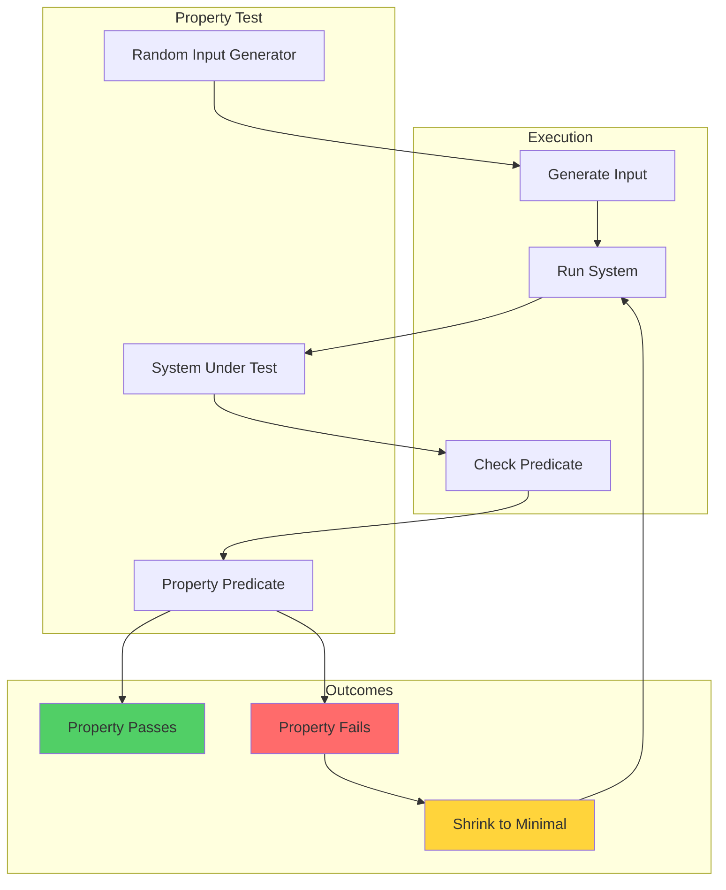

### Roundtrip Property

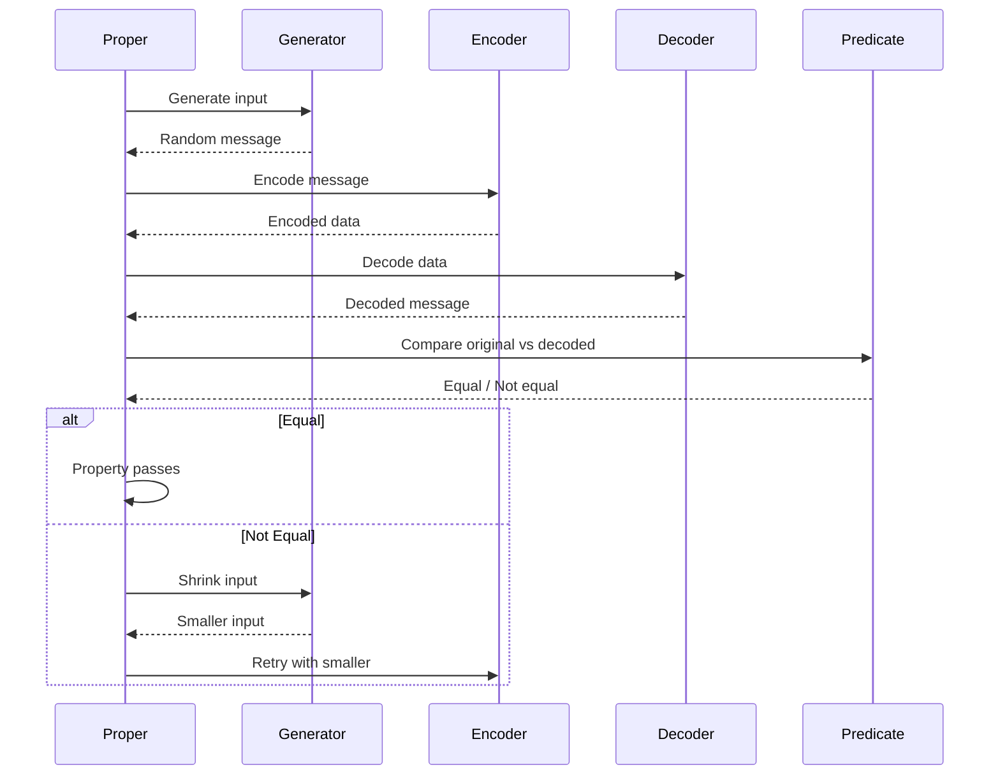

### Implementation Template

```erlang
% Property: JSON-RPC encoding/decoding roundtrip
prop_json_rpc_roundtrip() ->
    ?FORALL(Message, message_generator(),
        begin
            % Exercise: Encode
            Encoded = erlmcp_json_rpc:encode(Message),

            % Exercise: Decode
            {ok, Decoded} = erlmcp_json_rpc:decode(Encoded),

            % Verify: Roundtrip invariant
            Decoded =:= Message
        end).

% Generator: Random JSON-RPC request
message_generator() ->
    ?LET({Id, Method, Params},
        {binary(), binary(), proper_types:list(prop_json())},
        #{
            jsonrpc => <<"2.0">>,
            id => Id,
            method => Method,
            params => Params
        }).

% Property: Tool invocation always returns valid response
prop_tool_invocation() ->
    ?FORALL({Tool, Args},
            {tool_generator(), proper_types:list(prop_json())},
        begin
            {ok, Server} = erlmcp_server:start_link(),
            ok = erlmcp_server:add_tool(Server, Tool),

            % Exercise: Call tool
            Result = erlmcp_server:call_tool(
                Server,
                maps:get(name, Tool),
                Args
            ),

            % Verify: Result is valid JSON-RPC response
            IsValid = case Result of
                {ok, Response} when is_map(Response) ->
                    maps:is_key(result, Response) orelse
                    maps:is_key(error, Response);
                _ ->
                    false
            end,

            erlmcp_server:stop(Server),
            IsValid
        end).

tool_generator() ->
    ?LET(Name, binary(),
        #{
            name => Name,
            description => <<"Test tool">>,
            handler => fun(_) -> {ok, #{result => ok}} end
        }).

% Property: State machine transitions are valid
prop_session_state_machine() ->
    ?FORALL(Commands,
            proper_types:list(commands()),
        begin
            {ok, Session} = erlmcp_session:start_link(),

            % Exercise: Execute commands
            Results = [execute_command(Session, Cmd) || Cmd <- Commands],

            % Verify: All transitions valid
            IsValid = lists:all(fun(R) -> R =:= valid end, Results),

            erlmcp_session:stop(Session),
            IsValid
        end).

commands() ->
    proper_types:oneof([
        {create, binary()},
        {update, binary(), term()},
        {delete, binary()},
        {get, binary()}
    ]).

execute_command(Session, {create, Id}) ->
    case erlmcp_session:create(Session, Id, #{}) of
        ok -> valid;
        {error, _} -> valid % Error is valid transition
    end;
execute_command(Session, {update, Id, Data}) ->
    case erlmcp_session:update(Session, Id, Data) of
        ok -> valid;
        {error, _} -> valid
    end;
execute_command(Session, {delete, Id}) ->
    case erlmcp_session:delete(Session, Id) of
        ok -> valid;
        {error, _} -> valid
    end;
execute_command(Session, {get, Id}) ->
    case erlmcp_session:get(Session, Id) of
        {ok, _} -> valid;
        {error, _} -> valid
    end.
```

---

## Pattern 7: Distributed Testing

### Purpose

Verify distributed coordination, replication, and failover across multiple nodes.

### Multi-Node Topology

```mermaid
graph TB
    subgraph "Node 1 (Primary)"
        R1[Registry]
        S1[Server 1]
        DB1[(Mnesia)]
    end

    subgraph "Node 2 (Replica)"
        R2[Registry]
        S2[Server 2]
        DB2[(Mnesia)]
    end

    subgraph "Node 3 (Replica)"
        R3[Registry]
        S3[Server 3]
        DB3[(Mnesia)]
    end

    DB1 <-_sync->|Replication| DB2
    DB2 <-sync->|Replication| DB3
    DB3 <-sync->|Replication| DB1

    S1 -.->|Register| R1
    S2 -.->|Register| R2
    S3 -.->|Register| R3

    Test[Test Suite] -.->|Lookup from any node| R1
    Test -.->|Lookup from any node| R2
    Test -.->|Lookup from any node| R3

    style DB1 fill:#51cf66
    style DB2 fill:#51cf66
    style DB3 fill:#51cf66
```

### Distributed Test Flow

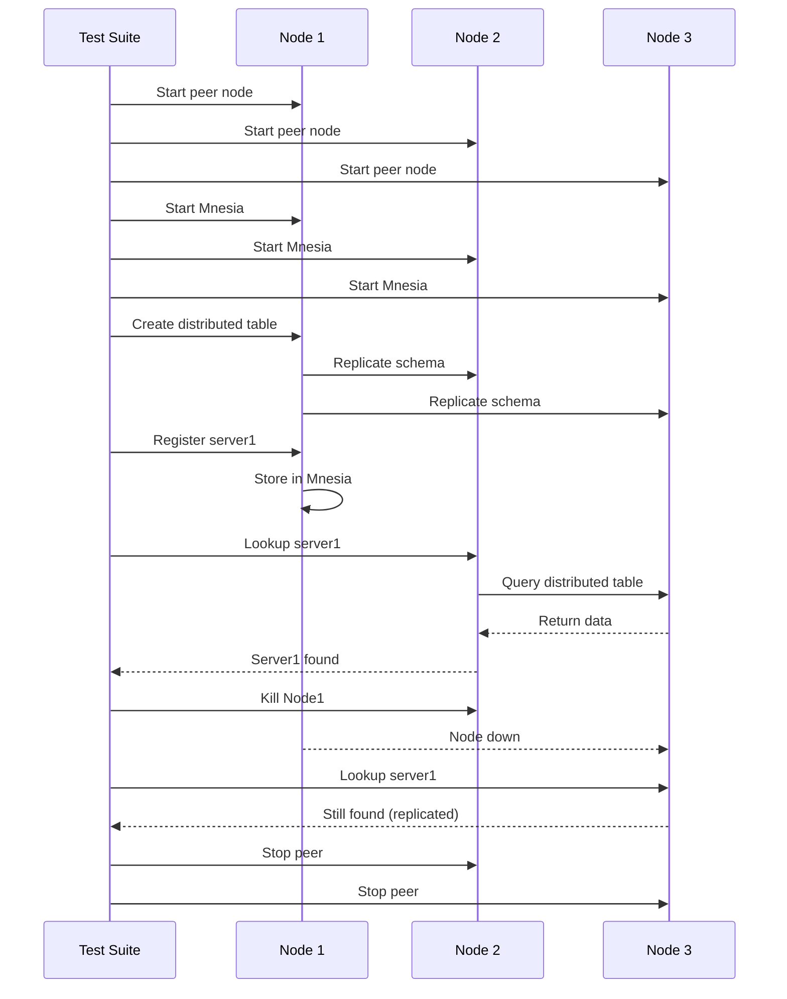

### Implementation Template

```erlang
distributed_registry_test_() ->
    {setup,
     fun setup_nodes/0,
     fun teardown_nodes/1,
     fun test_distribution/1}.

setup_nodes() ->
    % Start peer nodes
    {ok, PeerNode1} = ct_slave:start(node1, [
        {erl_flags, "-name node1@127.0.0.1"}
    ]),
    {ok, PeerNode2} = ct_slave:start(node2, [
        {erl_flags, "-name node2@127.0.0.1"}
    ]),

    % Wait for nodes to start
    timer:sleep(500),

    #{node1 => PeerNode1, node2 => PeerNode2}.

teardown_nodes(Nodes) ->
    ct_slave:stop(node1),
    ct_slave:stop(node2),
    timer:sleep(500).

test_distribution(Nodes) ->
    [
     ?_test(register_and_lookup_distributed(Nodes)),
     ?_test(replication_across_nodes(Nodes)),
     ?_test(failover_to_replica(Nodes))
    ].

register_and_lookup_distributed(#{node1 := Node1, node2 := Node2}) ->
    % Setup: Start Mnesia on all nodes
    rpc:call(Node1, mnesia, start, []),
    rpc:call(Node2, mnesia, start, []),
    mnesia:start(),

    % Setup: Create distributed table
    {atomic, ok} = mnesia:create_table(
        registry,
        [
            {disc_copies, [node(), Node1, Node2]},
            {attributes, record_info(fields, registry)}
        ]
    ),

    % Exercise: Register on node1
    ServerPid = spawn(Node1, fun() ->
        receive stop -> ok end
    end),

    rpc:call(Node1, erlmcp_registry, register_name,
        [{mcp, server, <<"s1">>}, ServerPid]
    ),

    % Verify: Can lookup from node2 (distributed)
    {ok, FoundPid} = rpc:call(Node2, erlmcp_registry,
        whereis_name, [{mcp, server, <<"s1">>}]
    ),

    ?assertEqual(ServerPid, FoundPid),

    % Cleanup
    mnesia:stop().

replication_across_nodes(#{node1 := Node1, node2 := Node2}) ->
    % Setup: Create replicated table
    rpc:call(Node1, mnesia, start, []),
    rpc:call(Node2, mnesia, start, []),
    mnesia:start(),

    {atomic, ok} = mnesia:create_table(
        sessions,
        [
            {disc_copies, [node(), Node1, Node2]},
            {attributes, record_info(fields, session)}
        ]
    ),

    % Exercise: Write on node1
    SessionData = #session{id => <<"sess1">>, data => #{test => true}},
    {atomic, ok} = rpc:call(Node1, mnesia, transaction, [fun() ->
        mnesia:write(SessionData)
    end]),

    % Verify: Read from node2 (replicated)
    {atomic, [FoundSession]} = rpc:call(Node2, mnesia, transaction, [fun() ->
        mnesia:read({session, <<"sess1">>})
    end]),

    ?assertEqual(SessionData, FoundSession),

    % Cleanup
    mnesia:stop().

failover_to_replica(#{node1 := Node1, node2 := Node2}) ->
    % Setup: Create replicated table
    rpc:call(Node1, mnesia, start, []),
    rpc:call(Node2, mnesia, start, []),
    mnesia:start(),

    {atomic, ok} = mnesia:create_table(
        config,
        [
            {disc_copies, [node(), Node1, Node2]},
            {attributes, record_info(fields, config)}
        ]
    ),

    % Exercise: Write data
    ConfigData = #config{key => <<"key1">>, value => <<"val1">>},
    {atomic, ok} = rpc:call(Node1, mnesia, transaction, [fun() ->
        mnesia:write(ConfigData)
    end]),

    % Exercise: Kill node1
    ct_slave:stop(node1),
    timer:sleep(500),

    % Verify: Data still available on node2 (replicated)
    {atomic, [FoundConfig]} = rpc:call(Node2, mnesia, transaction, [fun() ->
        mnesia:read({config, <<"key1">>})
    end]),

    ?assertEqual(ConfigData, FoundConfig),

    % Cleanup
    mnesia:stop().

% Record definitions
-record(registry, {name, pid}).
-record(session, {id, data}).
-record(config, {key, value}).
```

---

## Summary

**Pattern Library Coverage:**

- ✅ **Gen_server Lifecycle**: Start, stop, supervision, callbacks
- ✅ **Registry**: Registration, lookup, monitoring, cleanup
- ✅ **Transport**: Behavior compliance, message flow, failover
- ✅ **Session**: Persistence, failover, replication (ETS/DETS/Mnesia)
- ✅ **Chaos**: Failure injection, recovery, bounded refusals
- ✅ **Property**: Roundtrips, state machines, generators
- ✅ **Distributed**: Multi-node coordination, replication, failover

**Chicago School TDD Compliance:**

- All patterns use **real collaborators** (no mocks)
- All patterns use **state-based verification** (observable behavior)
- All patterns use **real processes** (gen_servers, supervised)
- All patterns include **setup/teardown** (clean lifecycle)

**Usage:**

1. Copy template for your use case
2. Adapt to your module's API
3. Run with `rebar3 eunit` or `rebar3 ct`
4. Verify Chicago School compliance (no mocks, real processes)

---

**Related Documentation:**
- [README](README.md) - Testing overview
- [TDD Strategy](tdd-strategy.md) - Chicago School methodology
- [Integration Tests](integration-tests.md) - Multi-process patterns
- [Testing Architecture](TESTING_ARCHITECTURE.md) - System design

**Last Updated:** 2026-01-31
**Maintained by:** erlang-test-engineer agent
**Version:** 2.1.0
