# Test Coverage Analysis & Visualization

**Version:** 2.1.0
**Last Updated:** 2026-01-31
**Status:** Production-Ready

---

## Executive Summary

Current test coverage across erlmcp applications: **51% overall**

| Application | Coverage | Tested Modules | Untested Modules | Target | Status |
|-------------|----------|----------------|------------------|--------|--------|
| erlmcp_core | 49% | 23 | 24 | 85% | ⚠️ Critical |
| erlmcp_observability | 44% | 11 | 14 | 80% | ⚠️ Critical |
| erlmcp_transports | 73% | 11 | 4 | 80% | ✅ Good |
| tcps_erlmcp | 49% | 33 | 34 | 70% | ⚠️ Medium |

---

## Coverage Visualization

### Overall Coverage Distribution


### Per-Application Coverage


### Coverage vs Target Gap

```mermaid
graph TB
    subgraph "Current Coverage"
        C1[erlmcp_core: 49%]
        C2[erlmcp_observability: 44%]
        C3[erlmcp_transports: 73%]
        C4[tcps_erlmcp: 49%]
    end

    subgraph "Target Coverage"
        T1[erlmcp_core: 85%]
        T2[erlmcp_observability: 80%]
        T3[erlmcp_transports: 80%]
        T4[tcps_erlmcp: 70%]
    end

    subgraph "Gap Analysis"
        G1[Gap: -36% ⚠️]
        G2[Gap: -36% ⚠️]
        G3[Gap: -7% ✅]
        G4[Gap: -21% ⚠️]
    end

    C1 --> G1
    C2 --> G2
    C3 --> G3
    C4 --> G4

    G1 --> T1
    G2 --> T2
    G3 --> T3
    G4 --> T4

    style G1 fill:#ff6b6b
    style G2 fill:#ff6b6b
    style G3 fill:#51cf66
    style G4 fill:#ffd43b
```



---

## Coverage Trends

### Historical Coverage Progress


### Projected Coverage Timeline


---

## Coverage Heatmap

### Module Coverage Heatmap

```mermaid
heatmap
    title Module Coverage Heatmap (Top 20 Critical Modules)
    x-axis ["Coverage %"]
    y-axis ["Modules"]
    "" : 0, 20, 40, 60, 80, 100
    "erlmcp_subscription" : 0, 0, 0, 0, 0, 100
    "erlmcp_hooks" : 0, 0, 0, 0, 0, 0
    "erlmcp_split_brain_detector" : 0, 0, 0, 0, 0, 0
    "erlmcp_secrets" : 0, 0, 0, 0, 0, 0
    "erlmcp_message_handler" : 0, 0, 0, 0, 0, 0
    "erlmcp_pricing_receipt" : 0, 0, 0, 0, 0, 0
    "tcps_poka_yoke" : 0, 0, 0, 0, 0, 0
    "erlmcp_sla_monitor" : 0, 0, 0, 0, 0, 0
    "erlmcp_otel_middleware" : 0, 0, 0, 0, 0, 0
    "erlmcp_chaos" : 0, 0, 0, 0, 0, 0
    "erlmcp_graceful_drain" : 0, 0, 0, 0, 0, 0
    "erlmcp_rate_limiter" : 0, 0, 0, 0, 0, 0
```

### Color Legend
- 🟢 80-100%: Production-ready
- 🟡 60-79%: Needs improvement
- 🔴 0-59%: Critical gap

---

## Detailed Coverage Reports

### erlmcp_core Coverage Breakdown


**Top 10 Untested Critical Modules:**
1. erlmcp_hooks (597 LOC) - Quality gates
2. erlmcp_pricing_receipt (742 LOC) - Revenue critical
3. tcps_poka_yoke (528 LOC) - Error-proofing
4. erlmcp_sla_monitor (414 LOC) - SLA compliance
5. erlmcp_split_brain_detector (221 LOC) - Cluster safety
6. erlmcp_subscription (51 LOC) - Core protocol
7. erlmcp_secrets (~100 LOC) - Security
8. erlmcp_message_handler (~150 LOC) - Message routing
9. erlmcp_graceful_drain (~120 LOC) - Shutdown safety
10. erlmcp_node_monitor (~150 LOC) - Cluster health

### erlmcp_observability Coverage Breakdown


**Top 10 Untested Critical Modules:**
1. erlmcp_chaos (762 LOC) - Failure injection
2. erlmcp_otel_middleware (317 LOC) - Auto-tracing
3. erlmcp_otel_jaeger (285 LOC) - Jaeger exporter
4. erlmcp_otel_honeycomb (252 LOC) - Honeycomb exporter
5. erlmcp_otel_datadog (232 LOC) - Datadog exporter
6. erlmcp_receipt_chain (92 LOC) - Audit trail
7. erlmcp_chaos_network (118 LOC) - Network chaos
8. erlmcp_chaos_process (169 LOC) - Process chaos
9. erlmcp_chaos_resource (157 LOC) - Resource chaos
10. erlmcp_metrics_aggregator (~150 LOC) - Metrics rollup

### erlmcp_transports Coverage Breakdown


**Untested Modules (4):**
1. erlmcp_transport_pipeline (~250 LOC) - HTTP/2, WebSocket batching
2. erlmcp_pool_strategy (~100 LOC) - Connection pooling
3. erlmcp_security_headers (~80 LOC) - Header injection
4. erlmcp_transport_http_server (~150 LOC) - HTTP server

---

## Coverage by Category

### Coverage by Module Type


### Coverage by Complexity


**Insight:** Larger modules tend to have lower coverage, indicating complexity hinders testing.

---

## Coverage Metrics Dashboard

### Key Performance Indicators

```mermaid
graph TB
    subgraph "Coverage KPIs"
        KPI1[Overall: 51%]
        KPI2[Core Modules: 49%]
        KPI3[Tested Modules: 78]
        KPI4[Untested Modules: 76]
    end

    subgraph "Progress Metrics"
        P1[+9% since Oct 2025]
        P2[-36% gap to target]
        P3[56.6% modules tested]
        P4[43.4% coverage gap]
    end

    subgraph "Quality Indicators"
        Q1[Test Quality: High]
        Q2[Chicago School: ✅]
        Q3[Zero Mocking: ✅]
        Q4[Real Collaborators: ✅]
    end

    KPI1 --> Status[⚠️ Needs Improvement]
    KPI2 --> Status
    P2 --> Status

    style Status fill:#ffd43b
```



### Coverage Velocity


**Target:** +15% coverage per sprint (2-week sprints)

---

## Testing Gaps Analysis

### Gap Severity Matrix


---

## Coverage Improvement Strategies

### Strategy 1: Critical Path Focus


**Timeline:**
- Phase 1: 3 weeks (17 critical modules)
- Phase 2: 4 weeks (21 high-priority modules)
- Phase 3: 2 weeks (4 medium-priority modules)

### Strategy 2: Test-Driven Development

```mermaid
sequenceDiagram
    participant D as Developer
    participant T as Test Engineer
    participant R as Reviewer

    D->>T: Write test first
    T->>T: Verify test fails
    T->>D: Implement minimal code
    D->>T: Test passes
    T->>R: Review Chicago School compliance
    R->>T: ✅ Approved (or refactor)
    T->>T: Check coverage ≥80%
    T->>T: Merge to main
```



### Strategy 3: Automation

```mermaid
graph TB
    A[Pre-Commit Hook] --> B{Coverage ≥80%?}
    B -->|No| C[❌ Block Commit]
    B -->|Yes| D{Tests Pass?}
    D -->|No| C
    D -->|Yes| E{Chicago School?}
    E -->|No| C
    E -->|Yes| F[✅ Commit Allowed]

    C --> G[Add More Tests]
    G --> A

    style C fill:#ff6b6b
    style F fill:#51cf66
```



---

## Coverage Tools & Reports

### Generating Coverage Reports

```bash
# Run tests with coverage
rebar3 do eunit, ct --cover

# Generate coverage report
rebar3 cover --verbose

# Open HTML report
open _build/test/cover/index.html

# Export coverage JSON
rebar3 cover --verbose > coverage_report.txt
```

### Coverage Report Locations

```
_build/test/cover/
├── index.html              # Main HTML report
├── coverage_report.txt     # Text summary
├── coverage_results.json   # JSON data
└── *.coverdata            # Raw coverage data
```

### CI/CD Integration

```yaml
# GitHub Actions
- name: Check coverage
  run: |
    rebar3 do eunit, ct --cover
    rebar3 cover --verbose

- name: Enforce 80% threshold
  run: |
    ./tools/coverage-checker.sh || exit 1
```

---

## Coverage Benchmarks

### Industry Comparison


**Goal:** Reach industry standard (80%) by March 2026

### Internal Targets


---

## Coverage Action Items

### Immediate (Week 1)

- [ ] Create test file stubs for 5 critical modules
- [ ] Assign 2 test engineers to critical path
- [ ] Set up pre-commit coverage enforcement
- [ ] Baseline current coverage metrics

### Short-term (Weeks 2-4)

- [ ] Complete testing for 17 critical modules
- [ ] Achieve 62% overall coverage
- [ ] Integrate coverage reports in CI/CD
- [ ] Train team on Chicago School TDD

### Medium-term (Weeks 5-8)

- [ ] Complete testing for 21 high-priority modules
- [ ] Achieve 75% overall coverage
- [ ] Test all transport features
- [ ] Document testing patterns

### Long-term (Weeks 9-16)

- [ ] Complete TCPS testing (optional)
- [ ] Achieve 80% overall coverage
- [ ] Maintain coverage during development
- [ ] Continuous improvement

---

## Monitoring Coverage

### Daily Coverage Tracking

```bash
# Daily coverage check
make coverage-strict

# Coverage trend
./scripts/coverage_trend.sh --days 30
```

### Weekly Coverage Reports

```bash
# Generate weekly report
./scripts/coverage_report.sh --week 4

# Email to team
./scripts/coverage_alert.sh --threshold 80
```

### Monthly Coverage Dashboard

```mermaid
graph TB
    subgraph "Monthly Dashboard"
        M1[Coverage: 51% → 62% → 75% → 80%]
        M2[Tests Added: 17 → 21 → 4 → 34]
        M3[Modules Tested: 78 → 95 → 116 → 150]
        M4[Quality Score: High → High → High → High]
    end

    M1 --> Trend[✅ On Track]
    M2 --> Trend
    M3 --> Trend
    M4 --> Trend

    style Trend fill:#51cf66
```



---

## Summary

**Current Status:**
- Overall Coverage: 51%
- Gap to Target: -29%
- Critical Modules Untested: 17
- Timeline to 80%: 8 weeks

**Action Plan:**
1. Focus on 17 critical modules (Week 1-3)
2. Complete high-priority modules (Week 4-7)
3. Finish transport testing (Week 8)
4. Optional: TCPS testing (Week 9-16)

**Success Criteria:**
- erlmcp_core: 85% coverage
- erlmcp_observability: 80% coverage
- erlmcp_transports: 80% coverage
- Overall: 80% coverage

---

**Related Documentation:**
- [Test Coverage Summary](TEST_COVERAGE_SUMMARY.md) - Detailed roadmap
- [Test Coverage Plan](TEST_COVERAGE_PLAN.md) - Implementation plan
- [README](README.md) - Testing overview

**Last Updated:** 2026-01-31
**Maintained by:** erlang-test-engineer agent
**Version:** 2.1.0
