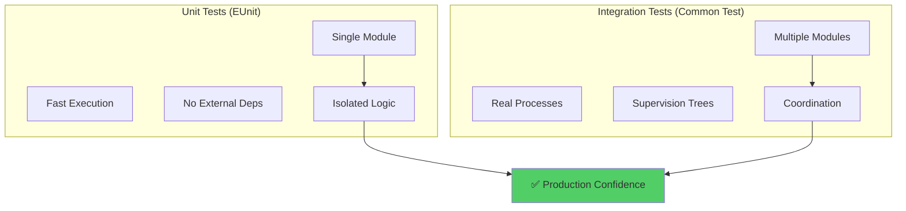
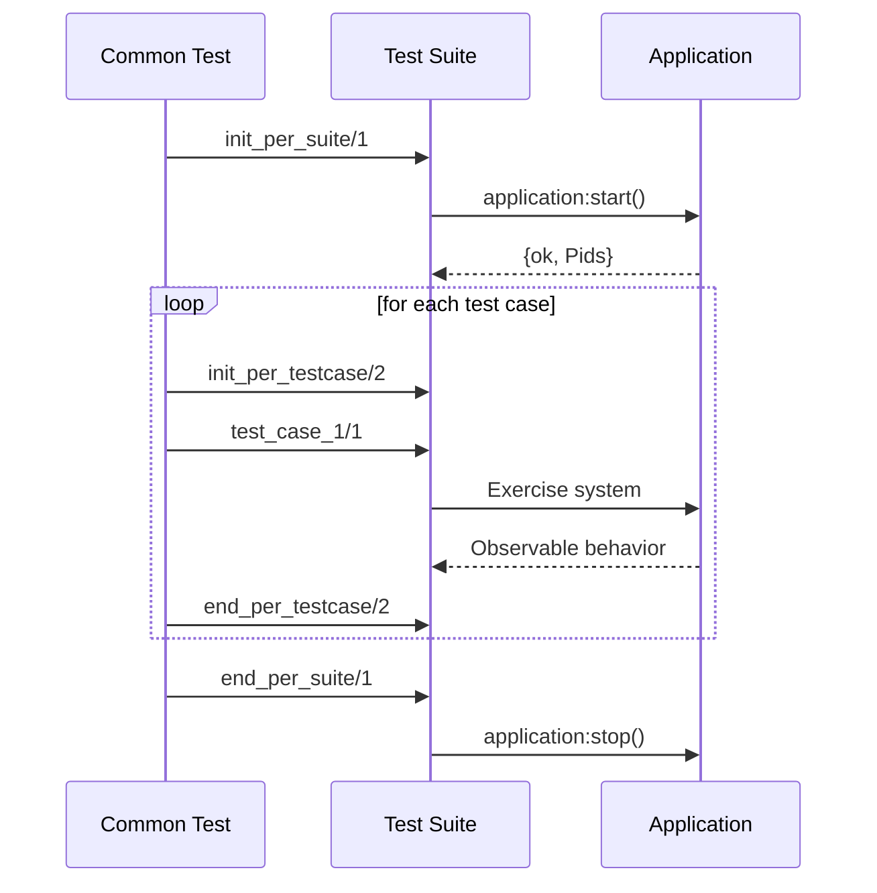
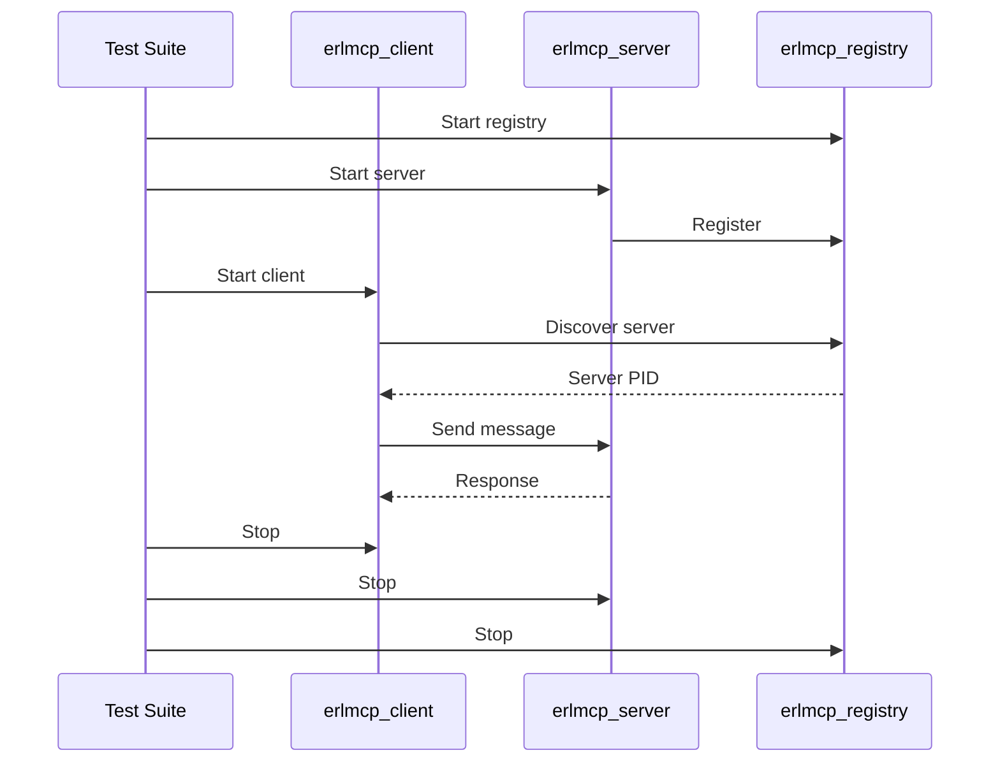
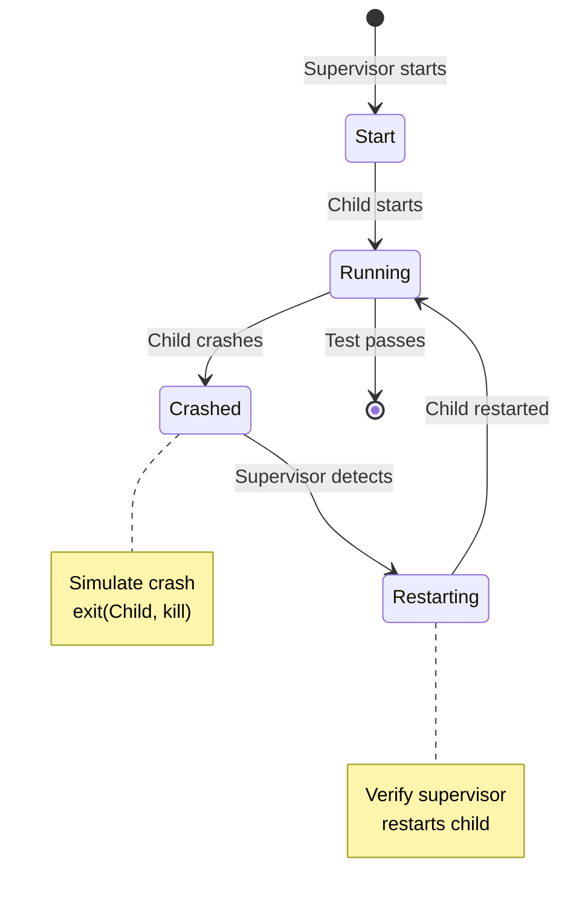
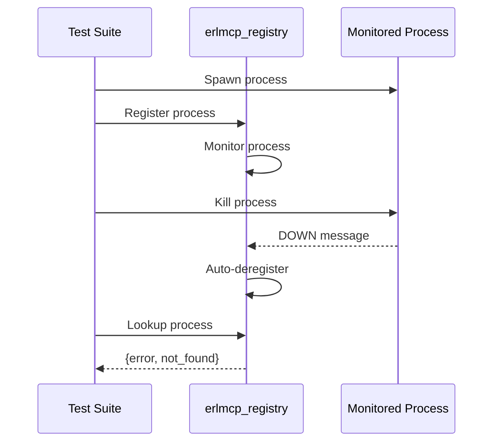
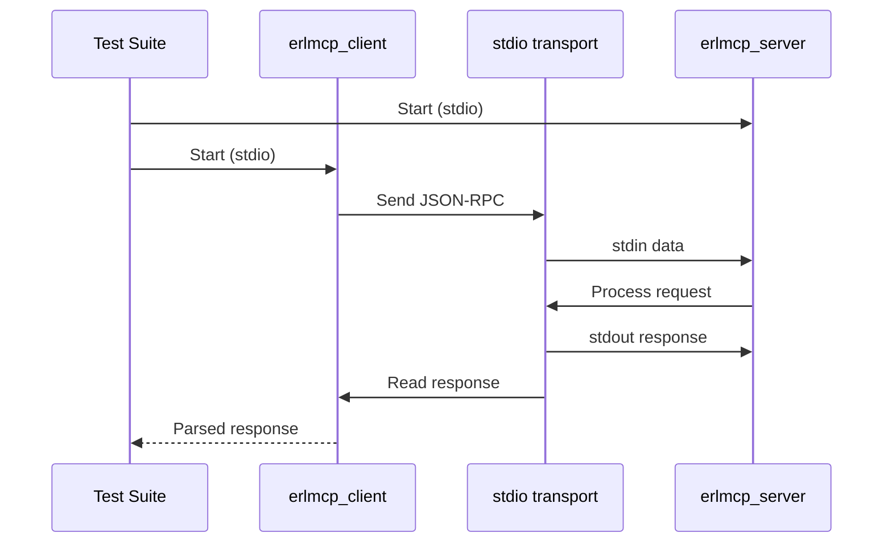
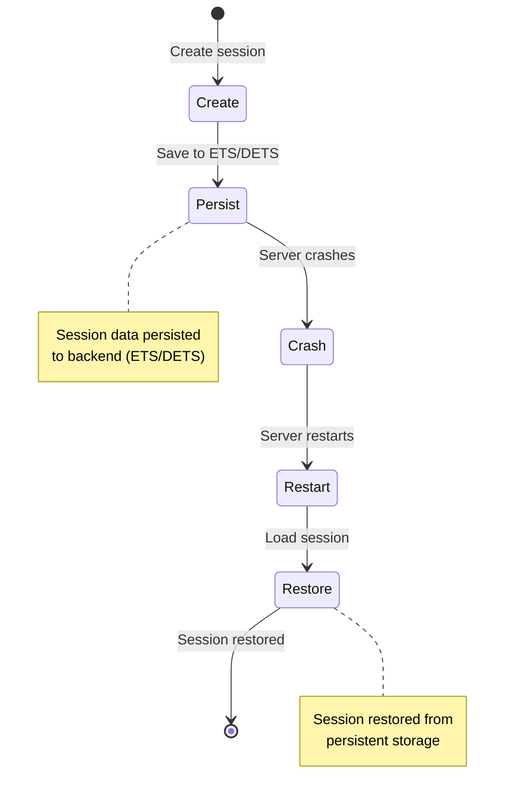
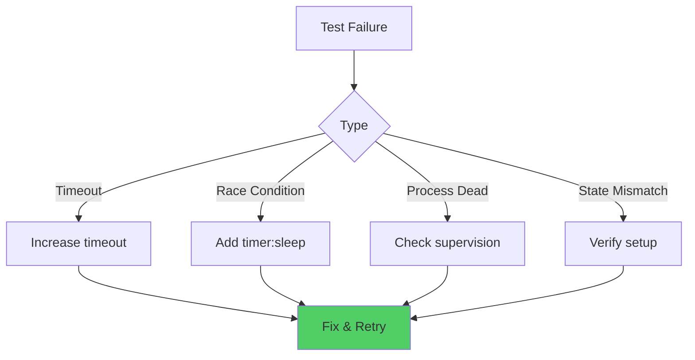

# Integration Testing Guide

**Version:** 2.1.0
**Last Updated:** 2026-01-31
**Status:** Production-Ready

---

## Overview

Integration testing in erlmcp uses **Common Test** to verify multi-process scenarios, supervision trees, and distributed coordination. Unlike unit tests (EUnit), integration tests verify components working together.

### Integration vs Unit Testing



---

## When to Use Integration Tests

### Test Selection Criteria

```mermaid
graph TB
    A[New Functionality] --> B{Involves Multiple Processes?}
    B -->|No| C[Unit Test (EUnit)]
    B -->|Yes| D{Requires Real Supervision?}
    D -->|No| C
    D -->|Yes| E{Network Coordination?}
    E -->|No| F[Integration Test (CT)]
    E -->|Yes| G[Distributed Test (CT)]

    C --> H[Fast Feedback]
    F --> H
    G --> H

    style C fill:#51cf66
    style F fill:#ffd43b
    style G fill:#ff6b6b
```

### Use Integration Tests For:

✅ **Multi-process scenarios**
- Client-server communication
- Registry coordination
- Supervision tree restart
- Process monitoring

✅ **Network operations**
- TCP/HTTP connections
- WebSocket communication
- SSE event streaming
- Transport failover

✅ **State persistence**
- ETS table operations
- DETS disk storage
- Mnesia replication
- Session management

✅ **Resource management**
- Connection pooling
- Rate limiting
- Circuit breaking
- Graceful shutdown

### Use Unit Tests For:

✅ **Single module logic**
- Data transformation
- Validation functions
- Protocol encoding/decoding
- Utility functions

---

## Common Test Architecture

### Test Suite Structure

```erlang
-module(my_module_SUITE).
-compile(export_all).
-include_lib("common_test/include/ct.hrl").

%% Suite callbacks
all() -> [test_case_1, test_case_2].

init_per_suite(Config) ->
    %% Start application, dependencies
    application:ensure_all_started(erlmcp),
    Config.

end_per_suite(_Config) ->
    %% Stop application
    application:stop(erlmcp).

init_per_testcase(_TestCase, Config) ->
    %% Setup per test case
    Config.

end_per_testcase(_TestCase, _Config) ->
    %% Cleanup per test case
    ok.
```

### Test Lifecycle



---

## Integration Test Patterns

### Pattern 1: Client-Server Communication

**Scenario:** Test client and server interaction via registry



**Implementation:**
```erlang
client_server_communication_test(Config) ->
    %% Setup: Start registry
    {ok, Registry} = erlmcp_registry:start_link(),

    %% Setup: Start server
    {ok, Server} = erlmcp_server:start_link(
        #{name => <<"test_server">>}
    ),

    %% Exercise: Start client
    {ok, Client} = erlmcp_client:start_link(
        #{server_name => <<"test_server">>}
    ),

    %% Exercise: Send request
    {ok, RequestId} = erlmcp_client:call_tool(
        Client,
        <<"echo">>,
        #{<<"msg">> => <<"hello">>}
    ),

    %% Verify: Response received
    receive
        {tool_response, RequestId, Response} ->
            ?assertEqual(#{<<"msg">> => <<"hello">>}, Response)
    after 5000 ->
        ct:fail("Timeout waiting for response")
    end.

%% Teardown
end_per_testcase(_, _Config) ->
    application:stop(erlmcp).
```

### Pattern 2: Supervision Tree Testing

**Scenario:** Verify supervisor restarts crashed child



**Implementation:**
```erlang
supervisor_restart_test(Config) ->
    %% Setup: Start application
    {ok, SupPid} = erlmcp_core_sup:start_link(),

    %% Get initial child PID
    {children, Children} = supervisor:which_children(SupPid),
    {erlmcp_server, InitialPid, _, _} =
        lists:keyfind(erlmcp_server, 1, Children),

    %% Exercise: Kill child
    exit(InitialPid, kill),

    %% Wait for restart
    timer:sleep(100),

    %% Verify: New PID (child restarted)
    {children, NewChildren} = supervisor:which_children(SupPid),
    {erlmcp_server, NewPid, _, _} =
        lists:keyfind(erlmcp_server, 1, NewChildren),

    ?assertNotEqual(InitialPid, NewPid),
    ?assert(is_process_alive(NewPid)).
```

### Pattern 3: Process Monitoring

**Scenario:** Verify auto-cleanup on monitored process death



**Implementation:**
```erlang
process_death_cleanup_test(Config) ->
    %% Setup: Start registry
    {ok, _Pid} = erlmcp_registry:start_link(),

    %% Setup: Spawn monitored process
    MonitoredPid = spawn(fun() ->
        receive
            stop -> ok
        end
    end),

    %% Exercise: Register process
    ok = erlmcp_registry:register_name(
        {test, monitored},
        MonitoredPid
    ),

    %% Verify: Registered
    {ok, MonitoredPid} = erlmcp_registry:whereis_name(
        {test, monitored}
    ),

    %% Exercise: Kill process
    exit(MonitoredPid, kill),
    timer:sleep(100), % Allow cleanup

    %% Verify: Auto-deregistered
    ?assertEqual(
        {error, not_found},
        erlmcp_registry:whereis_name({test, monitored})
    ).
```

### Pattern 4: Transport Integration

**Scenario:** Test end-to-end message flow over transport



**Implementation:**
```erlang
stdio_transport_integration_test(Config) ->
    %% Setup: Start server with stdio transport
    {ok, Server} = erlmcp_server:start_link(
        #{transport => stdio}
    ),

    %% Setup: Start client with stdio transport
    {ok, Client} = erlmcp_client:start_link(
        #{transport => stdio}
    ),

    %% Exercise: Send request via transport
    Request = #{
        jsonrpc => <<"2.0">>,
        id => 1,
        method => <<"tools/list">>
    },

    {ok, Response} = erlmcp_client:send_request(Client, Request),

    %% Verify: Response received via transport
    ?assertEqual(<<"2.0">>, maps:get(jsonrpc, Response)),
    ?assertEqual(1, maps:get(id, Response)),
    ?assert(maps:is_key(result, Response)).
```

### Pattern 5: Session Persistence

**Scenario:** Verify session survives server restart



**Implementation:**
```erlang
session_persistence_test(Config) ->
    %% Setup: Start session manager with DETS backend
    {ok, SessionMgr} = erlmcp_session_manager:start_link(
        #{
            backend => erlmcp_session_dets,
            backend_opts => #{
                file_path => "/tmp/test_session.dets"
            }
        }
    ),

    %% Exercise: Create session
    SessionId = <<"session-123">>,
    SessionData = #{
        user_id => <<"user-456">>,
        tools => [<<"tool1">>, <<"tool2">>]
    },

    ok = erlmcp_session_manager:create_session(
        SessionMgr,
        SessionId,
        SessionData
    ),

    %% Exercise: Crash and restart session manager
    exit(SessionMgr, kill),
    timer:sleep(100),

    {ok, NewSessionMgr} = erlmcp_session_manager:start_link(
        #{
            backend => erlmcp_session_dets,
            backend_opts => #{
                file_path => "/tmp/test_session.dets"
            }
        }
    ),

    %% Verify: Session restored
    {ok, RestoredData} = erlmcp_session_manager:get_session(
        NewSessionMgr,
        SessionId
    ),

    ?assertEqual(SessionData, RestoredData).
```

---

## Distributed Testing

### Multi-Node Coordination

**Scenario:** Test registry distribution across nodes

```mermaid
graph TB
    subgraph "Node 1"
        R1[Registry]
        S1[Server 1]
    end

    subgraph "Node 2"
        R2[Registry]
        S2[Server 2]
    end

    subgraph "Node 3"
        R3[Registry]
        S3[Server 3]
    end

    R1 <-_sync->|Mnesia replication| R2
    R2 <-sync->|Mnesia replication| R3
    R3 <-sync->|Mnesia replication| R1

    S1 -.->|Register| R1
    S2 -.->|Register| R2
    S3 -.->|Register| R3

    Test[Test Suite] -.->|Lookup from any node| R1
    Test -.->|Lookup from any node| R2
    Test -.->|Lookup from any node| R3
```

**Implementation:**
```erlang
distributed_registry_test(Config) ->
    %% Setup: Start peer nodes
    {ok, PeerNode1} = ct_slave:start(node1, [
        {erl_flags, "-name node1@127.0.0.1"}
    ]),
    {ok, PeerNode2} = ct_slave:start(node2, [
        {erl_flags, "-name node2@127.0.0.1"}
    ]),

    %% Setup: Start mnesia on all nodes
    rpc:call(PeerNode1, mnesia, start, []),
    rpc:call(PeerNode2, mnesia, start, []),
    mnesia:start(),

    %% Setup: Create distributed table
    mnesia:create_table(
        registry,
        [
            {disc_copies, [node(), PeerNode1, PeerNode2]},
            {attributes, record_info(fields, registry)}
        ]
    ),

    %% Exercise: Register server on node1
    ServerPid1 = spawn(PeerNode1, fun() ->
        receive stop -> ok end
    end),

    rpc:call(PeerNode1, erlmcp_registry, register_name,
        [{mcp, server, <<"s1">>}, ServerPid1]
    ),

    %% Verify: Can lookup from node2 (distributed)
    {ok, FoundPid} = rpc:call(PeerNode2, erlmcp_registry,
        whereis_name, [{mcp, server, <<"s1">>}]
    ),

    ?assertEqual(ServerPid1, FoundPid),

    %% Teardown
    ct_slave:stop(node1),
    ct_slave:stop(node2).
```

---

## Test Data Management

### Test Configuration

```erlang
%% In suite callback
init_per_suite(Config) ->
    %% Add test data to config
    TestData = #{
        server_name => <<"test_server">>,
        tools => [
            #{name => <<"echo">>, handler => fun echo/1},
            #{name => <<"reverse">>, handler => fun reverse/1}
        ],
        transport_options => #{
            type => stdio,
            timeout => 5000
        }
    },

    [{test_data, TestData} | Config].

%% Use in test case
my_test(Config) ->
    TestData = ?config(test_data, Config),
    ServerName = maps:get(server_name, TestData),
    %% Use test data...
```

### Test Fixtures

```erlang
%% Fixture module
-module(test_fixtures).

-export([
    sample_tool/0,
    sample_request/0,
    sample_message/0
]).

sample_tool() ->
    #{
        name => <<"test_tool">>,
        description => <<"A test tool">>,
        input_schema => #{
            type => object,
            properties => #{
                <<"message">> => #{type => string}
            }
        },
        handler => fun(Args) ->
            {ok, #{result => maps:get(<<"message">>, Args)}}
        end
    }.

sample_request() ->
    #{
        jsonrpc => <<"2.0">>,
        id => 1,
        method => <<"tools/call">>,
        params => #{
            name => <<"test_tool">>,
            arguments => #{<<"message">> => <<"hello">>}
        }
    }.
```

---

## Performance Testing

### Load Testing

**Scenario:** 1000 concurrent connections

```erlang
concurrent_connections_test(Config) ->
    %% Setup: Start server
    {ok, Server} = erlmcp_server:start_link(),

    %% Exercise: Spawn 1000 clients
    Clients = [begin
        {ok, Client} = erlmcp_client:start_link(),
        Client
    end || _ <- lists:seq(1, 1000)],

    %% Exercise: Send request from all clients
    StartTime = erlang:monotonic_time(millisecond),

    Results = [begin
        erlmcp_client:list_tools(Client)
    end || Client <- Clients],

    EndTime = erlang:monotonic_time(millisecond),

    %% Verify: All succeeded
    SuccessCount = length([R || {ok, _} <- Results]),
    ?assertEqual(1000, SuccessCount),

    %% Verify: Response time acceptable (<5s)
    ResponseTime = EndTime - StartTime,
    ?assert(ResponseTime < 5000),

    %% Cleanup
    [erlmcp_client:stop(Client) || Client <- Clients].
```

---

## Debugging Integration Tests

### Common Issues



### Debugging Techniques

```erlang
%% 1. Verbose logging
init_per_suite(Config) ->
    error_logger:tty(true),
    logger:set_primary_config(level, all),
    Config.

%% 2. Process inspection
debug_test(Config) ->
    {ok, Pid} = erlmcp_server:start_link(),
    %% Inspect state
    {status, Pid, {module, erlmcp_server}, _Status} =
        sys:get_status(Pid),
    %% Continue test...

%% 3. Message tracing
trace_test(Config) ->
    {ok, Pid} = erlmcp_server:start_link(),
    erlang:trace(Pid, true, [receive, send]),
    %% Exercise system
    %% Check trace logs...

%% 4. Crash dumps
end_per_testcase(TestCase, Config) ->
    case erlang:is_process_alive(Pid) of
        false ->
            ct:log("Process crashed: ~p", [erlang:process_info(Pid, last_messages)]);
        true ->
            ok
    end.
```

---

## Best Practices

### 1. Clean Setup/Teardown

```erlang
%% ✅ GOOD: Explicit teardown
end_per_testcase(_, _Config) ->
    application:stop(erlmcp),
    ok = file:delete("/tmp/test.dets"),
    ok.

%% ❌ BAD: No cleanup
end_per_testcase(_, _) ->
    ok.
```

### 2. Deterministic Tests

```erlang
%% ✅ GOOD: Deterministic
deterministic_test(Config) ->
    {ok, Pid} = my_module:start_link(),
    ?assertEqual(ok, my_module:do_something(Pid)),
    ok = my_module:stop(Pid).

%% ❌ BAD: Race condition
race_condition_test(Config) ->
    spawn(fun() -> my_module:async_thing() end),
    %% No guarantee this runs after async_thing
    ?assertEqual(expected, get_state()).
```

### 3. Proper Timeouts

```erlang
%% ✅ GOOD: Explicit timeout
receive
    {response, Response} ->
        Response
after 5000 ->
    ct:fail("Timeout waiting for response")
end.

%% ❌ BAD: Infinite wait
receive
    {response, Response} ->
        Response
end.
```

### 4. Resource Management

```erlang
%% ✅ GOOD: Ensure cleanup
resource_test(Config) ->
    File = "/tmp/test.dat",
    try
        %% Use file
        ok = write_data(File, data)
    after
        %% Always cleanup
        file:delete(File)
    end.

%% ❌ BAD: Cleanup may not run
resource_test(Config) ->
    File = "/tmp/test.dat",
    ok = write_data(File, data),
    %% If exception above, this never runs
    file:delete(File).
```

---

## CI/CD Integration

### GitHub Actions

```yaml
name: Integration Tests

on: [push, pull_request]

jobs:
  integration:
    runs-on: ubuntu-latest
    strategy:
      matrix:
        otp: [25, 26, 27]

    steps:
      - uses: actions/checkout@v3

      - name: Install Erlang
        uses: erlang-solutions/erlang-otp-actions@v1
        with:
          otp-version: ${{ matrix.otp }}

      - name: Run integration tests
        run: rebar3 ct --suite=apps/*/test/*_SUITE

      - name: Upload results
        uses: actions/upload-artifact@v3
        with:
          name: ct-results-${{ matrix.otp }}
          path: _build/test/logs/
```

---

## Summary

**Integration Testing Principles:**

- ✅ Multi-process scenarios
- ✅ Real supervision trees
- ✅ Network coordination
- ✅ Resource management
- ✅ State persistence

**Quality Standards:**

- Clean setup/teardown
- Deterministic execution
- Proper timeouts
- Resource cleanup
- Clear error messages

**Test Categories:**

1. Client-server communication
2. Supervision tree restart
3. Process monitoring
4. Transport integration
5. Session persistence
6. Distributed coordination

---

**Related Documentation:**
- [README](README.md) - Testing overview
- [TDD Strategy](tdd-strategy.md) - Test-driven development
- [Coverage Analysis](coverage-analysis.md) - Coverage metrics

**Last Updated:** 2026-01-31
**Maintained by:** erlang-test-engineer agent
**Version:** 2.1.0
