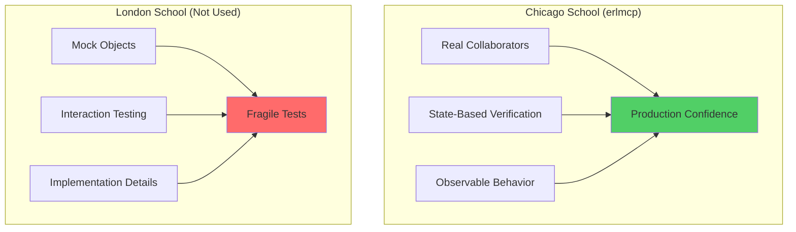
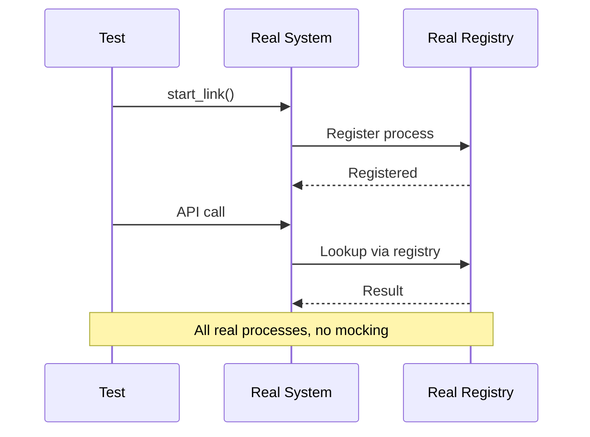
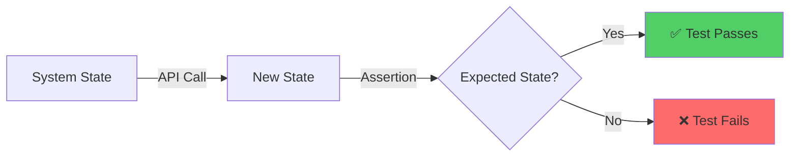
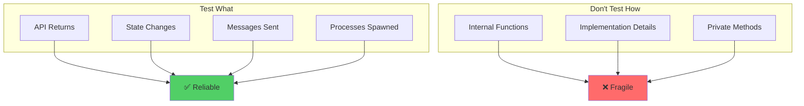
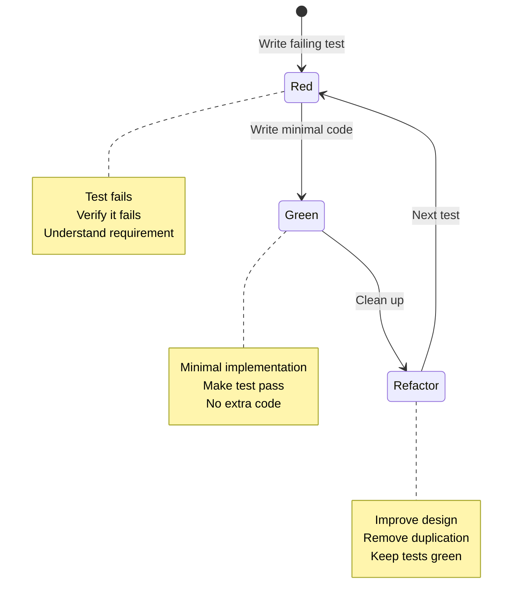
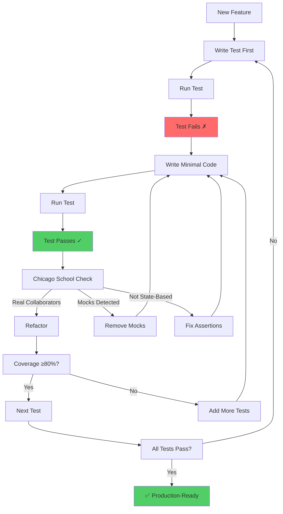
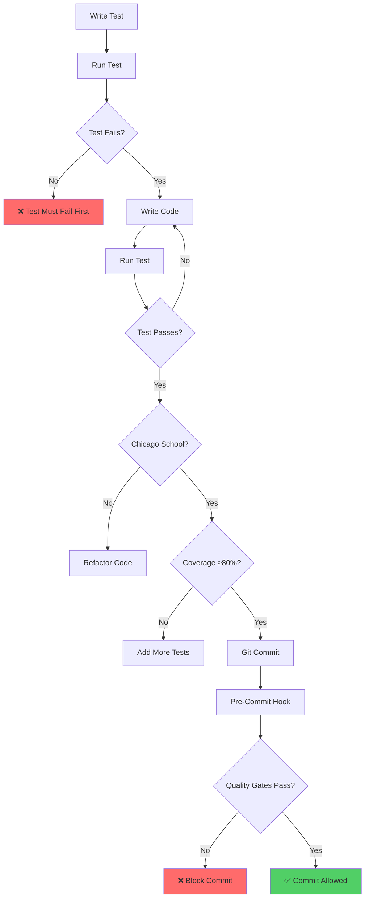
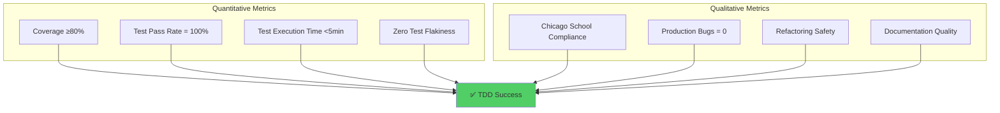

# TDD Strategy: Chicago School Methodology

**Version:** 2.1.0
**Last Updated:** 2026-01-31
**Status:** Production-Ready

---

## Overview

erlmcp implements **Chicago School TDD** - a state-based testing methodology that emphasizes real collaborators and observable behavior over interaction verification. This approach provides production confidence through testing what the system does, not how it does it.

### Chicago vs London School TDD



---

## Core Principles

### 1. Real Collaborators (No Mocking)

**Principle:** Use actual gen_servers and processes, never mocks or fakes.



**Chicago School (CORRECT):**
```erlang
% Real gen_server, real registry
{ok, Server} = erlmcp_server:start_link(),
{ok, Registry} = erlmcp_registry:start_link(),

ok = erlmcp_server:register(Server, <<"server1">>),
{ok, Pid} = erlmcp_registry:whereis_name({mcp, server, <<"server1">>}),
?assertEqual(Server, Pid).
```

**London School (WRONG - Don't Do This):**
```erlang
% Mocked registry (fragile!)
meck:new(erlmcp_registry),
meck:expect(erlmcp_registry, whereis_name, fun(_) -> {ok, fake_pid} end),

% Test passes but doesn't verify real behavior
{ok, Pid} = erlmcp_registry:whereis_name({mcp, server, <<"server1">>}),
?assertEqual({ok, fake_pid}, Pid).
```

### 2. State-Based Verification

**Principle:** Assert on observable state changes, not method calls.



**Chicago School (CORRECT):**
```erlang
% Assert on state
ok = erlmcp_server:add_tool(Pid, #{name => <<"test">>}),

{ok, Tools} = erlmcp_server:list_tools(Pid),
?assertEqual(1, length(Tools)),
?assertMatch(#{name := <<"test">>}, hd(Tools)).
```

**London School (WRONG - Don't Do This):**
```erlang
% Assert on method calls (fragile!)
meck:expect(erlmcp_server, add_tool, fun(_, _) -> ok end),

erlmcp_server:add_tool(Pid, #{name => <<"test">>}),

?assertMatch({call, add_tool, _}, meck:history(erlmcp_server)).
```

### 3. Observable Behavior

**Principle:** Test what the system does (outputs), not how it does it (internals).



---

## TDD Workflow

### The Red-Green-Refactor Cycle



### Detailed TDD Process



---

## Test Patterns

### Pattern 1: Gen_server Testing

**Test lifecycle:**
```erlang
server_test_() ->
    {setup,
     fun setup/0,           % Start real gen_server
     fun cleanup/1,         % Stop gen_server
     fun tests/1}.          % Run tests

setup() ->
    {ok, Pid} = erlmcp_server:start_link(),
    Pid.

cleanup(Pid) ->
    ok = erlmcp_server:stop(Pid).

tests(Pid) ->
    [
     ?_test(start_stop(Pid)),
     ?_test(add_tool(Pid)),
     ?_test(handle_call(Pid))
    ].

start_stop(Pid) ->
    ?assertNotEqual(undefined, process_info(Pid)),
    ?assert(is_process_alive(Pid)).
```

### Pattern 2: Registry Testing

**Test routing and discovery:**
```erlang
registry_test_() ->
    {setup,
     fun() ->
         application:ensure_all_started(erlmcp),
         erlmcp_registry
     end,
     fun(_) ->
         application:stop(erlmcp)
     end,
     fun(_) ->
         [
          ?_test(register_and_lookup()),
          ?_test(auto_cleanup_on_death())
         ]
     end}.

register_and_lookup() ->
    % Setup: Register real process
    Pid = spawn(fun() -> receive stop -> ok end end),
    ok = erlmcp_registry:register_name({test, key}, Pid),

    % Exercise: Lookup
    {ok, FoundPid} = erlmcp_registry:whereis_name({test, key}),

    % Verify: Found same process (state-based)
    ?assertEqual(Pid, FoundPid),

    % Cleanup
    Pid ! stop.

auto_cleanup_on_death() ->
    % Setup: Register process
    Pid = spawn(fun() -> receive stop -> ok end end),
    ok = erlmcp_registry:register_name({test, auto}, Pid),

    % Exercise: Kill process
    exit(Pid, kill),
    timer:sleep(100),

    % Verify: Auto-deregistered (observable behavior)
    ?assertEqual({error, not_found},
                 erlmcp_registry:whereis_name({test, auto})).
```

### Pattern 3: Transport Testing

**Test transport behavior:**
```erlang
transport_test_() ->
    {setup,
     fun() ->
         % Start real transport
         {ok, Transport} = erlmcp_transport_stdio:start_link(),
         Transport
     end,
     fun(Transport) ->
         erlmcp_transport_stdio:close(Transport)
     end,
     fun(Transport) ->
         [
          ?_test(send_data(Transport)),
          ?_test(receive_data(Transport))
         ]
     end}.

send_data(Transport) ->
    Message = #{jsonrpc => <<"2.0">>, method => <<"test">>},
    ok = erlmcp_transport_stdio:send(Message, Transport),
    % Verify transport accepted data (no errors)
    ?assertEqual(ok, erlmcp_transport_stdio:send(Message, Transport)).
```

### Pattern 4: Property-Based Testing

**Test invariants:**
```erlang
prop_json_rpc_roundtrip() ->
    ?FORALL(Message, message_generator(),
        begin
            % Exercise: Encode
            Encoded = erlmcp_json_rpc:encode(Message),

            % Exercise: Decode
            {ok, Decoded} = erlmcp_json_rpc:decode(Encoded),

            % Verify: Roundtrip invariant
            Decoded =:= Message
        end).

prop_tool_invocation() ->
    ?FORALL({Tool, Args},
            {tool_generator(), proper_types:list(prop_json())},
        begin
            {ok, Server} = erlmcp_server:start_link(),
            ok = erlmcp_server:add_tool(Server, Tool),

            % Exercise: Call tool
            Result = erlmcp_server:call_tool(Server,
                                             maps:get(name, Tool),
                                             Args),

            % Verify: Result is valid JSON-RPC response
            case Result of
                {ok, Response} when is_map(Response) ->
                    maps:is_key(result, Response);
                _ ->
                    false
            end
        end).
```

---

## Anti-Patterns (What to Avoid)

### ❌ Anti-Pattern 1: Mocking gen_servers

```erlang
% WRONG: Don't mock gen_servers!
meck:new(erlmcp_server),
meck:expect(erlmcp_server, start_link, fun() -> {ok, fake_pid} end).

% This gives false confidence - real server may fail!
```

**✅ Correct Approach:**
```erlang
% Use real gen_server
{ok, Pid} = erlmcp_server:start_link(),
% Test real behavior, verify real state
```

### ❌ Anti-Pattern 2: Verifying Internal Calls

```erlang
% WRONG: Don't test which methods were called!
meck:expect(erlmcp_registry, register_name, fun(_, _) -> ok end),
erlmcp_server:register(Server, <<"s1">>),
?assertMatch({call, register_name, _}, meck:history(erlmcp_registry)).

% This is fragile - breaks on refactoring!
```

**✅ Correct Approach:**
```erlang
% Test observable state
ok = erlmcp_server:register(Server, <<"s1">>),
{ok, Pid} = erlmcp_registry:whereis_name({mcp, server, <<"s1">>}),
?assertEqual(Server, Pid).
```

### ❌ Anti-Pattern 3: Testing Implementation Details

```erlang
% WRONG: Don't test internal state directly!
State = sys:get_state(Server),
?assertEqual(expected_internal_state, State).

% This breaks on refactoring!
```

**✅ Correct Approach:**
```erlang
% Test via API
{ok, Status} = erlmcp_server:get_status(Server),
?assertEqual(registered, maps:get(state, Status)).
```

---

## Integration with CI/CD

### Pre-Commit TDD Flow



### Quality Gates

```bash
# 1. Compilation (0 errors)
TERM=dumb rebar3 compile

# 2. Tests (100% pass)
rebar3 eunit --module=my_module_tests
rebar3 ct --suite=my_module_SUITE

# 3. Coverage (≥80%)
rebar3 cover --verbose

# 4. Chicago School compliance (manual review)
# - No mocking
# - State-based assertions
# - Real collaborators

# 5. Benchmark (if performance code)
make benchmark-strict
```

---

## Measuring TDD Success

### Test Metrics



### Red Flags

```mermaid
graph TB
    subgraph "Warning Signs"
        W1[Mocks in test code]
        W2[Interaction verification]
        W3[Coverage <80%]
        W4[Flaky tests]
        W5[Slow tests (>10min)]
        W6[Testing internals]
    end

    W1 --> Problem[❌ TDD Problems]
    W2 --> Problem
    W3 --> Problem
    W4 --> Problem
    W5 --> Problem
    W6 --> Problem

    style Problem fill:#ff6b6b
```

---

## Training Guide

### Learning Chicago School TDD

**Step 1: Understand the Philosophy**
- Read: "Growing Object-Oriented Software, Guided by Tests" (Freeman & Pryce)
- Internalize: Tests specify behavior, not implementation
- Practice: Write tests without thinking about code structure

**Step 2: Master the Tools**
- EUnit for unit tests
- Common Test for integration
- Proper for property-based testing
- Real gen_servers for OTP behaviors

**Step 3: Learn the Patterns**
- Gen_server lifecycle testing
- Registry and process monitoring
- Transport behavior testing
- Protocol roundtrip testing

**Step 4: Avoid Anti-Patterns**
- Never mock gen_servers
- Never verify method calls
- Never test implementation details
- Always use real collaborators

**Step 5: Practice Refactoring**
- Change code without breaking tests
- Improve design while tests stay green
- Use tests as safety net for changes

---

## Examples: Real-World TDD

### Example 1: Resource Subscription

**Test First:**
```erlang
subscribe_test_() ->
    {setup,
     fun() -> {ok, Pid} = erlmcp_server:start_link(), Pid end,
     fun(Pid) -> ok = erlmcp_server:stop(Pid) end,
     fun(Pid) ->
         [
          ?_test(subscribe_to_resource(Pid)),
          ?_test(receive_notification(Pid))
         ]
     end}.

subscribe_to_resource(Pid) ->
    % Test: Subscribe to resource
    ok = erlmcp_server:subscribe_resource(Pid, self(), <<"res://test">>),

    % Verify: Subscribed (state-based)
    {ok, Subs} = erlmcp_server:list_subscriptions(Pid, <<"res://test">>),
    ?assertEqual(1, length(Subs)),
    ?assertEqual(self(), hd(Subs)).
```

**Implement Code:**
```erlang
% Minimal implementation to make test pass
handle_call({subscribe_resource, Pid, Resource}, _From, State) ->
    Subs = maps:get(Resource, State#state.subscriptions, []),
    NewSubs = [Pid | Subs],
    NewState = State#state{subscriptions = maps:put(Resource, NewSubs, State#state.subscriptions)},
    {reply, ok, NewState};

handle_call({list_subscriptions, Resource}, _From, State) ->
    Subs = maps:get(Resource, State#state.subscriptions, []),
    {reply, {ok, Subs}, State}.
```

### Example 2: Tool Invocation

**Test First:**
```erlang
tool_invocation_test_() ->
    {setup,
     fun() ->
         {ok, Pid} = erlmcp_server:start_link(),
         Tool = #{name => <<"echo">>,
                  handler => fun(Args) -> {ok, Args} end},
         ok = erlmcp_server:add_tool(Pid, Tool),
         Pid
     end,
     fun(Pid) -> ok = erlmcp_server:stop(Pid) end,
     fun(Pid) ->
         [
          ?_test(call_existing_tool(Pid)),
          ?_test(call_nonexistent_tool(Pid))
         ]
     end}.

call_existing_tool(Pid) ->
    % Test: Call tool
    Args = #{<<"message">> => <<"hello">>},
    {ok, Result} = erlmcp_server:call_tool(Pid, <<"echo">>, Args),

    % Verify: Tool executed
    ?assertEqual(Args, maps:get(result, Result)).
```

**Implement Code:**
```erlang
% Minimal implementation
handle_call({call_tool, Name, Args}, _From, State) ->
    case maps:get(Name, State#state.tools, undefined) of
        undefined ->
            {reply, {error, not_found}, State};
        #{handler := Handler} ->
            Result = Handler(Args),
            {reply, {ok, #{result => Result}}, State}
    end.
```

---

## Summary

**Chicago School TDD = Production Confidence**

- ✅ Real collaborators (no mocks)
- ✅ State-based verification (not interactions)
- ✅ Observable behavior (not implementation)
- ✅ Integration testing (not just units)
- ✅ Property-based testing (invariants)

**Quality Gates:**
- Coverage ≥80% (85% for core)
- 100% test pass rate
- Zero tolerance for mocking
- All tests must be reliable

**Result:**
- Production bugs → 0
- Refactoring safety → High
- Maintenance burden → Low
- Team velocity → Sustained

---

**References:**
- [Test Coverage Summary](TEST_COVERAGE_SUMMARY.md) - Current status and roadmap
- [Test Coverage Plan](TEST_COVERAGE_PLAN.md) - Detailed implementation plan
- [README](README.md) - Testing documentation overview

**Last Updated:** 2026-01-31
**Maintained by:** erlang-test-engineer agent
**Version:** 2.1.0
