# Test Coverage Strategy and Implementation Plan

**Status**: Draft
**Version**: 1.0.0
**Date**: 2026-01-30
**Author**: ErlMCP Test Engineering Team

---

## Executive Summary

This document provides a comprehensive test coverage strategy for the erlmcp project, addressing:
- Current coverage: **~0% measured** (73 EUnit tests + 16 CT suites exist but not running in coverage reports)
- Target coverage: **80%+ for all modules, 85%+ for core modules**
- Broken files: **24 broken files** (11 in apps/, 13 in test.bak/)
- Test organization: **Consolidate/delete 47+ redundant test artifacts**
- Quality gates: **Automated validation before commit**

### Key Findings
1. **Tests exist but don't contribute to coverage** - 89 test files but coverage reports show 0%
2. **Missing application startup** - Many tests don't call `application:ensure_all_started/1`
3. **Broken test files** - 24 .broken files need triage and fix
4. **Scattered test artifacts** - Test files in multiple locations (test/, test.bak/, test_destructive/, tests/)
5. **No property-based testing** - Only 1 Proper test file (erlmcp_json_rpc_proper_tests.erl)

---

## 1. C4 Component Diagram - Test Architecture

```plantuml
@startuml
!include https://raw.githubusercontent.com/plantuml-stdlib/C4-PlantUML/master/C4_Component.puml

LAYOUT_WITH_LEGEND()

title Test Architecture - ErlMCP Test Suite (C4 Component)

Container_Boundary(test_infrastructure, "Test Infrastructure") {
    Component(eunit, "EUnit Tests", "Erlang EUnit", "Unit tests with Chicago School TDD\n73 test files, state-based verification")
    Component(ct, "Common Test Suites", "Erlang CT", "Integration tests with real processes\n16 CT suites, multi-process scenarios")
    Component(proper, "Property Tests", "PropEr", "Property-based testing\n1 file (needs expansion)")
    Component(benchmark, "Benchmarks", "Custom Framework", "5 benchmark modules:\ncore_ops, network_real, stress, chaos, integration")
}

Container_Boundary(test_support, "Test Support Infrastructure") {
    Component(fixtures, "Test Fixtures", "Data/Config", "Test data, mock configs\nfixtures/, integration/fixtures/")
    Component(helpers, "Test Helpers", "Erlang Modules", "tcps_test_helper.erl\ngcp_simulator_server.erl\nerlmcp_test_client.erl")
    Component(destructive, "Destructive Tests", "Isolated Tests", "Memory exhaustion, chaos\ntest_destructive/ directory")
}

Container_Boundary(apps, "Applications Under Test") {
    Component(core, "erlmcp_core", "OTP App", "65 modules\nJSON-RPC, Registry, Client/Server")
    Component(transports, "erlmcp_transports", "OTP App", "Transport implementations\nSTDIO, TCP, HTTP, WebSocket")
    Component(observability, "erlmcp_observability", "OTP App", "Metrics, traces, receipts\nOpenTelemetry integration")
    Component(validation, "erlmcp_validation", "OTP App", "Validation framework\nProtocol checker, security")
}

Container_Boundary(quality, "Quality Gates") {
    Component(coverage, "Coverage Analysis", "rebar3 cover", "Target: 80%+ overall, 85%+ core\nHTML reports, line coverage")
    Component(dialyzer, "Type Checking", "Dialyzer", "Static type analysis\nDetect discrepancies")
    Component(xref, "Cross Reference", "Xref", "Undefined function calls\nUnused exports")
    Component(hooks, "Git Hooks", "Shell Scripts", "Pre-commit validation\nPost-task validation")
}

Rel(eunit, core, "Tests", "Unit tests for modules")
Rel(eunit, transports, "Tests", "Unit tests for transports")
Rel(eunit, observability, "Tests", "Unit tests for metrics")
Rel(eunit, validation, "Tests", "Unit tests for validators")

Rel(ct, core, "Integration tests", "Multi-process scenarios")
Rel(ct, transports, "Integration tests", "Transport behavior tests")
Rel(ct, observability, "Integration tests", "E2E observability")
Rel(ct, validation, "Integration tests", "Contract validation")

Rel(proper, core, "Property tests", "Invariant testing")

Rel(benchmark, core, "Performance tests", "Throughput, latency")
Rel(benchmark, transports, "Performance tests", "Network I/O")

Rel(eunit, fixtures, "Uses", "Test data")
Rel(ct, fixtures, "Uses", "Test configs")
Rel(eunit, helpers, "Uses", "Shared utilities")
Rel(ct, helpers, "Uses", "Mock servers")

Rel(coverage, eunit, "Measures", "Line coverage")
Rel(coverage, ct, "Measures", "Integration coverage")
Rel(dialyzer, core, "Analyzes", "Type safety")
Rel(xref, core, "Checks", "Function references")
Rel(hooks, coverage, "Enforces", "80%+ coverage")
Rel(hooks, dialyzer, "Runs", "Type checks")
Rel(hooks, xref, "Runs", "Cross-ref checks")

@enduml
```

**Diagram Explanation:**
- **Test Infrastructure**: 3-tier testing (unit, integration, property)
- **Test Support**: Fixtures, helpers, destructive tests
- **Applications Under Test**: 4 OTP apps with distinct responsibilities
- **Quality Gates**: Automated validation (coverage, types, cross-refs, hooks)

---

## 2. Test Pyramid Diagram - Unit/Integration/E2E Distribution


**Current Distribution:**
- **Unit Tests**: 73 files (82%) - Good base but needs coverage measurement
- **Integration Tests**: 16 files (18%) - Needs expansion for transport and registry coordination
- **Property Tests**: 1 file (1%) - **CRITICAL GAP** - Need 10+ files
- **E2E Tests**: 5 benchmark modules (5%) - Good coverage

**Target Distribution (Ideal Test Pyramid):**
- **Unit Tests**: 85 files (70%) - Fast, isolated, comprehensive
- **Integration Tests**: 25 files (20%) - Multi-process, real collaborators
- **Property Tests**: 10 files (8%) - Protocol invariants, state machines
- **E2E Tests**: 5+ files (5%) - Full system validation

**Rationale:** Shift from 82% unit tests to 70% to make room for property-based testing (8%), which is essential for protocol compliance and state machine validation.

---

## 3. Coverage Heat Map - Current vs Target Coverage by Module


**Coverage Priorities:**

| Priority | Modules | Current | Target | Rationale |
|----------|---------|---------|--------|-----------|
| **P1** | Core (client, server, registry, JSON-RPC, capabilities, session) | 0% | 85-95% | Heart of MCP protocol, critical path |
| **P2** | Transports (stdio, tcp, http, websocket) | 0% | 80-85% | Reliability critical, real I/O testing |
| **P3** | Features (resource, tool, prompt, completion, sampling) | 0% | 80-85% | MCP capability compliance |
| **P4** | Support (auth, cache, pagination, circuit_breaker, rate_limiter) | 0% | 75-80% | Infrastructure, acceptable if core is solid |

**Why current coverage is 0%:**
1. Tests exist but `rebar3 cover` reports show 0% - likely application not started in test setup
2. Many tests in broken state (.broken files)
3. Tests may be skipped or not discovered by rebar3

---

## 4. Sequence Diagram - Test Execution Flow with Application Setup

```plantuml
@startuml
title Test Execution Flow - Chicago School TDD with Real Application Startup

actor Developer as dev
participant "rebar3 eunit" as rebar
participant "Test Module\n(e.g., erlmcp_client_tests)" as test
participant "Application Controller" as app
participant "Supervisor Tree" as sup
participant "erlmcp_registry\n(gen_server)" as registry
participant "erlmcp_client\n(gen_server)" as client
participant "Coverage Reporter" as coverage

dev -> rebar: Execute test\n`rebar3 eunit --module=erlmcp_client_tests`
activate rebar

rebar -> test: Load test module
activate test

' Setup Phase (Chicago School: Real Application)
test -> test: setup_application/0
note right
  **Chicago School TDD:**
  - Start REAL application
  - Use REAL gen_servers
  - NO mocks, NO stubs
  - State-based verification
end note

test -> app: application:ensure_all_started(erlmcp_core)
activate app
app -> app: Start dependencies (jsx, jesse, gproc, etc.)
app -> sup: Start erlmcp_core_sup (supervisor)
activate sup

sup -> registry: Start erlmcp_registry (gen_server)
activate registry
registry --> sup: {ok, RegistryPid}

sup -> sup: Start client_sup (simple_one_for_one)
sup -> sup: Start server_sup (simple_one_for_one)

sup --> app: {ok, SupPid}
app --> test: ok

' Exercise Phase
test -> test: Test function: test_stdio_connection/0
note right
  **Exercise Phase:**
  - Call real API
  - Spawn real processes
  - Real message passing
end note

test -> client: erlmcp_client:start_link(stdio, Config)
activate client
client -> registry: gproc:reg({n, l, {mcp, client, Id}})
registry --> client: true
client --> test: {ok, ClientPid}

test -> client: erlmcp_client:initialize(ClientPid, Capabilities)
client -> client: Send initialize request via transport
client -> client: Transition state: pre_initialization -> initializing
client --> test: {ok, ServerCapabilities}

' Verify Phase (Chicago School: State-based)
test -> test: ?assertEqual(initialized, get_state(ClientPid))
note right
  **Verify Phase:**
  - Check observable state
  - NOT internal method calls
  - State-based verification
  - No mock expectations
end note

test -> client: erlmcp_client:get_capabilities(ClientPid)
client --> test: {ok, ServerCapabilities}
test -> test: ?assertMatch(#{tools := _}, ServerCapabilities)

' Teardown Phase
test -> test: cleanup_application/1
test -> client: erlmcp_client:stop(ClientPid)
client -> registry: gproc:unreg({n, l, {mcp, client, Id}})
deactivate client

test -> app: application:stop(erlmcp_core)
app -> sup: Shutdown supervisor tree
sup -> registry: Terminate erlmcp_registry
deactivate registry
deactivate sup
deactivate app

test --> rebar: Test result: PASS
deactivate test

' Coverage Collection
rebar -> coverage: Collect coverage data
activate coverage
coverage -> coverage: Analyze line execution\nfor all modules
coverage -> coverage: Generate HTML report\n_build/test/cover/index.html
coverage --> rebar: Coverage: 87% (erlmcp_client.erl)
deactivate coverage

rebar --> dev: Test report:\n✅ Tests: 1/1 passed\n✅ Coverage: 87%
deactivate rebar

note over dev, coverage
  **Post-Test Validation (Quality Gates):**
  1. All tests MUST pass (0 failures)
  2. Coverage MUST be ≥80% overall, ≥85% for core
  3. Dialyzer MUST have 0 warnings
  4. Xref MUST have 0 undefined calls

  **Git Hooks enforce these gates before commit**
end note

@enduml
```



**Key Points in Test Execution:**

1. **Setup Phase (Chicago School TDD)**:
   - `application:ensure_all_started(erlmcp_core)` starts REAL application
   - Supervisor tree starts REAL gen_servers (registry, client_sup, server_sup)
   - No mocks, no stubs - use actual OTP infrastructure

2. **Exercise Phase**:
   - Call real API: `erlmcp_client:start_link/2`, `erlmcp_client:initialize/2`
   - Real process spawning and message passing
   - Real state transitions (pre_initialization → initializing → initialized)

3. **Verify Phase (State-based)**:
   - Check observable state: `get_state(ClientPid)`, `get_capabilities(ClientPid)`
   - Assert on returned values, not on internal method calls
   - No mock expectations (no `?assert(meck:called(...))`

4. **Teardown Phase**:
   - Stop client: `erlmcp_client:stop/1`
   - Stop application: `application:stop(erlmcp_core)`
   - Supervisor cleans up all child processes

5. **Coverage Collection**:
   - `rebar3 cover` collects line execution data
   - Generates HTML report with per-module coverage
   - Enforced by quality gates (80%+ overall, 85%+ core)

---

## 5. Implementation Plan

### Phase 1: Fix Broken Tests and Infrastructure (Week 1-2)

**Priority Order for Fixing .broken Files:**

| File | Priority | Reason | Estimated Effort |
|------|----------|--------|------------------|
| `erlmcp_integration_SUITE.erl.broken` | P0 | Critical E2E tests, blocks coverage measurement | 4 hours |
| `mcp_compliance_SUITE.erl.broken` | P0 | Protocol compliance critical for spec adherence | 6 hours |
| `erlmcp_error_handling_tests.erl.broken` | P1 | Core error handling, affects reliability | 3 hours |
| `erlmcp_jsonrpc_compliance_tests.erl.broken` | P1 | JSON-RPC protocol validation | 3 hours |
| `erlmcp_server_capabilities_SUITE.erl.broken` | P1 | Server capability negotiation | 4 hours |
| `mcp_tools_SUITE.erl.broken` | P2 | Tool capability testing | 3 hours |
| `mcp_resources_SUITE.erl.broken` | P2 | Resource capability testing | 3 hours |
| `mcp_prompts_capability_SUITE.erl.broken` | P2 | Prompt capability testing | 3 hours |

**Tasks:**

1. **Triage .broken files** (2 hours)
   - Analyze each .broken file for compilation errors
   - Categorize: fixable, obsolete, redundant
   - Decision matrix:
     - Fixable with <4h effort → **Fix in Phase 1**
     - Obsolete (replaced by newer tests) → **Delete**
     - Redundant (duplicate coverage) → **Consolidate**

2. **Add `application:ensure_all_started/1` to all test setups** (6 hours)
   - Pattern to add to all EUnit tests:
     ```erlang
     setup_application() ->
         application:ensure_all_started(erlmcp_core),
         application:ensure_all_started(erlmcp_transports),
         application:ensure_all_started(erlmcp_observability).

     cleanup_application(_) ->
         application:stop(erlmcp_observability),
         application:stop(erlmcp_transports),
         application:stop(erlmcp_core).
     ```
   - Add to all CT suites:
     ```erlang
     init_per_suite(Config) ->
         application:ensure_all_started(erlmcp_core),
         application:ensure_all_started(erlmcp_transports),
         application:ensure_all_started(erlmcp_observability),
         Config.

     end_per_suite(_Config) ->
         application:stop(erlmcp_observability),
         application:stop(erlmcp_transports),
         application:stop(erlmcp_core),
         ok.
     ```
   - **Affected files**: All 73 EUnit tests + 16 CT suites = 89 files

3. **Fix compilation errors in broken tests** (12 hours)
   - Common issues:
     - Undefined functions (API changes)
     - Missing includes
     - Type mismatches
     - Outdated process registration (gproc migration)
   - Fix P0 and P1 broken tests (8 files, 23 hours estimated)

4. **Verify coverage measurement works** (2 hours)
   - Run: `rebar3 do eunit, ct, cover --verbose`
   - Verify: Coverage > 0% for at least one module
   - Debug: If still 0%, check application startup in tests

**Deliverables (Week 1-2):**
- ✅ 8 broken test files fixed (P0 and P1)
- ✅ All 89 test files have proper application setup
- ✅ Coverage reports show >0% (baseline established)
- ✅ Quality gates script runs successfully

---

### Phase 2: Achieve 50% Coverage (Week 3-4)

**Focus**: Add missing tests for core modules (Priority 1)

**Modules to test (Priority 1 - Core):**

| Module | Current Tests | Lines Uncovered (est.) | Tests to Add | Effort |
|--------|---------------|------------------------|---------------|--------|
| `erlmcp_client.erl` | erlmcp_client_tests.erl | ~300 lines | Edge cases, error paths | 6h |
| `erlmcp_server.erl` | erlmcp_server_tests.erl | ~400 lines | Tool/resource handlers, errors | 8h |
| `erlmcp_registry.erl` | erlmcp_registry_tests.erl | ~200 lines | Concurrent registration, failures | 4h |
| `erlmcp_json_rpc.erl` | erlmcp_json_rpc_tests.erl | ~150 lines | Malformed JSON, edge cases | 3h |
| `erlmcp_capabilities.erl` | NEW | ~250 lines | Capability negotiation tests | 6h |
| `erlmcp_session_manager.erl` | erlmcp_session_manager_tests.erl | ~200 lines | Session lifecycle, cleanup | 4h |

**Test Patterns to Add:**

1. **Error Handling Tests** (every module)
   ```erlang
   error_handling_test_() ->
       {setup,
        fun setup_application/0,
        fun cleanup_application/1,
        fun(_) ->
            [
             ?_test(test_invalid_input()),
             ?_test(test_timeout()),
             ?_test(test_process_crash()),
             ?_test(test_network_failure()),
             ?_test(test_resource_exhaustion())
            ]
        end}.
   ```

2. **Boundary Condition Tests**
   ```erlang
   boundary_test_() ->
       {setup,
        fun setup_application/0,
        fun cleanup_application/1,
        fun(_) ->
            [
             ?_test(test_empty_list()),
             ?_test(test_max_size()),
             ?_test(test_nil_value()),
             ?_test(test_zero_timeout()),
             ?_test(test_max_concurrent())
            ]
        end}.
   ```

3. **Concurrency Tests** (where applicable)
   ```erlang
   concurrent_test_() ->
       {setup,
        fun setup_application/0,
        fun cleanup_application/1,
        fun(_) ->
            [
             ?_test(test_100_concurrent_requests()),
             ?_test(test_race_condition_handling()),
             ?_test(test_deadlock_prevention())
            ]
        end}.
   ```

**Deliverables (Week 3-4):**
- ✅ 50% overall coverage achieved
- ✅ Core modules (Priority 1) at 60%+ coverage
- ✅ All error paths tested for critical modules
- ✅ Boundary conditions covered

---

### Phase 3: Achieve 80%+ Coverage (Week 5-8)

**Focus**: Complete coverage for all modules, add property tests

**Week 5-6: Transport Module Tests (Priority 2)**

| Module | Current Tests | Tests to Add | Effort |
|--------|---------------|--------------|--------|
| `erlmcp_transport_stdio.erl` | NEW (CT suite exists) | Unit tests for I/O handling | 6h |
| `erlmcp_transport_tcp.erl` | NEW (CT suite exists) | Unit tests for TCP specifics | 6h |
| `erlmcp_transport_http.erl` | NEW (CT suite exists) | Unit tests for HTTP client | 6h |
| `erlmcp_transport_websocket.erl` | NEW | WebSocket lifecycle tests | 8h |

**Week 7: Property-Based Tests (NEW!)**

Add 10 Proper test files for protocol invariants:

1. **erlmcp_json_rpc_proper_tests.erl** (already exists) - Expand coverage
2. **erlmcp_capabilities_proper_tests.erl** - Capability negotiation roundtrips
3. **erlmcp_session_proper_tests.erl** - Session state machine properties
4. **erlmcp_tool_proper_tests.erl** - Tool invocation invariants
5. **erlmcp_resource_proper_tests.erl** - Resource subscription properties
6. **erlmcp_prompt_proper_tests.erl** - Prompt template rendering
7. **erlmcp_registry_proper_tests.erl** - Registry consistency properties
8. **erlmcp_transport_proper_tests.erl** - Transport message ordering
9. **erlmcp_batch_proper_tests.erl** - Batch request/response correlation
10. **erlmcp_pagination_proper_tests.erl** - Pagination cursor invariants

**Property Test Template:**
```erlang
-module(erlmcp_<module>_proper_tests).
-include_lib("proper/include/proper.hrl").
-include_lib("eunit/include/eunit.hrl").

% Property: Encoding/decoding is an identity function
prop_encoding_roundtrip() ->
    ?FORALL(Data, data_generator(),
        begin
            Encoded = erlmcp_<module>:encode(Data),
            {ok, Decoded} = erlmcp_<module>:decode(Encoded),
            Decoded =:= Data
        end
    ).

% Property: State machine transitions are valid
prop_state_machine_valid() ->
    ?FORALL(Commands, commands(?MODULE),
        begin
            {History, State, Result} = run_commands(?MODULE, Commands),
            ?WHENFAIL(
                io:format("History: ~p\nState: ~p\nResult: ~p\n",
                          [History, State, Result]),
                Result =:= ok
            )
        end
    ).

% EUnit wrapper
proper_test_() ->
    {timeout, 60, fun() ->
        ?assertEqual(true, proper:quickcheck(prop_encoding_roundtrip(), [{numtests, 1000}])),
        ?assertEqual(true, proper:quickcheck(prop_state_machine_valid(), [{numtests, 500}]))
    end}.
```

**Week 8: Feature Module Tests (Priority 3)**

Complete tests for:
- `erlmcp_resource.erl` (expand resource_tests.erl)
- `erlmcp_tool.erl` (expand tool_tests.erl)
- `erlmcp_prompt_template.erl` (NEW)
- `erlmcp_completion.erl` (NEW)
- `erlmcp_sampling.erl` (NEW)

**Deliverables (Week 5-8):**
- ✅ 80%+ overall coverage achieved
- ✅ Core modules (Priority 1) at 85%+ coverage
- ✅ Transport modules (Priority 2) at 80%+ coverage
- ✅ 10 property test files added
- ✅ All feature modules tested

---

### Phase 4: Consolidate and Cleanup (Week 9-10)

**Task 1: Consolidate Redundant Test Artifacts**

**Files to delete/consolidate:**

| Location | Files | Action | Rationale |
|----------|-------|--------|-----------|
| `test/*.md` | 15 documentation files | **Move to docs/testing/** | Test dir should only have test code |
| `test.bak/` | 13 .broken files | **Delete** | Already in attic, duplicates |
| `test_destructive/` | 2 files | **Keep but document** | Legitimate destructive tests |
| `tests/` (plural) | 2 SUITE files | **Move to apps/tcps_erlmcp/test/** | Belongs in TCPS app |
| `test/*.sh` | 4 shell scripts | **Consolidate to scripts/test/** | Centralize scripts |
| `test/*.escript` | 2 escript files | **Move to scripts/test/** | Centralize scripts |
| `attic/legacy_untrusted/` | 3 benchmark SUITE files | **Delete** | Replaced by bench/ modules |
| `integration/` | 6 .md files | **Move to docs/testing/integration/** | Documentation |

**Total cleanup:** 47 files relocated or deleted

**Task 2: Reorganize Test Directory Structure**

**Current structure (chaotic):**
```
test/
├── *.erl (4 test files)
├── *.broken (20 files) [ALREADY MOVED to test.bak/]
├── *.md (15 docs)
├── *.sh (4 scripts)
├── *.escript (2 scripts)
├── fixtures/
├── integration/
│   ├── *.md (6 docs)
│   └── fixtures/
└── metrology/

test.bak/ (13 .broken files)
test_destructive/ (2 files)
tests/ (2 SUITE files)
attic/legacy_untrusted/ (3 old benchmarks)
```

**Proposed structure (clean):**
```
apps/
├── erlmcp_core/test/          (73 EUnit tests + 2 CT suites)
├── erlmcp_transports/test/     (3 CT suites + new unit tests)
├── erlmcp_observability/test/  (2 CT suites)
└── erlmcp_validation/test/     (9 CT suites)

test/                           (LEGACY - top-level integration only)
├── fixtures/                   (Shared test data)
├── helpers/                    (NEW - Shared test utilities)
│   ├── tcps_test_helper.erl
│   ├── gcp_simulator_server.erl
│   └── erlmcp_test_client.erl
└── erlmcp_trace_analyzer_tests.erl (observability integration test)

test_destructive/               (Destructive tests - isolated)
├── README.md                   (NEW - Document purpose)
├── destructive_memory_exhaustion_test.erl
└── destructive_memory_standalone.erl

docs/testing/                   (NEW - All test documentation)
├── test_strategy_plan.md       (this document)
├── coverage_reports/           (Archived coverage reports)
├── integration/                (Integration test docs)
│   ├── README.md
│   ├── DELIVERABLES_SUMMARY.md
│   ├── DELIVERY_SUMMARY.md
│   └── MOCK_INFRASTRUCTURE.md
└── legacy/                     (Old docs for reference)
    ├── BATCH3_SUMMARY.md
    ├── BATCH_8_RESULTS.md
    ├── BENCH_TEST_SUITE_README.md
    ├── CHAOS_TEST_DOCUMENTATION.md
    ├── CT_TEST_REPORT.md
    ├── INTEGRATION_100K_README.md
    ├── INTEGRATION_TESTS.md
    ├── LOAD_TESTING.md
    ├── PERFORMANCE_ANALYSIS_SUMMARY.md
    ├── PHASE3_COMPREHENSIVE_TEST_REPORT.md
    ├── PRODUCTION_READINESS_REPORT.md
    ├── README_STRESS_TESTS.md
    ├── README_VALIDATION.md
    ├── TEST_SUITE_SUMMARY.txt
    └── VALIDATION_SUITE_SUMMARY.md

scripts/test/                   (NEW - Centralized test scripts)
├── comprehensive_transport_tests.escript
├── inter_node_comm_stress.escript
├── run_comprehensive_integration_tests.sh
├── run_load_tests.sh
└── run_validation.sh

attic/                          (Untrusted legacy code)
└── (no changes)
```

**Task 3: Create Test Organization Documentation**

Create `docs/testing/README.md`:
```markdown
# ErlMCP Test Suite Organization

## Directory Structure

- `apps/*/test/` - Unit tests (EUnit) and integration tests (CT) per application
- `test/` - Legacy top-level integration tests (being phased out)
- `test_destructive/` - Destructive tests (memory exhaustion, chaos)
- `docs/testing/` - Test documentation and coverage reports
- `scripts/test/` - Test automation scripts

## Test Types

### EUnit Tests (`*_tests.erl`)
- Unit tests following Chicago School TDD
- One test file per module: `<module>_tests.erl`
- Run: `rebar3 eunit --module=<module>_tests`

### Common Test Suites (`*_SUITE.erl`)
- Integration tests with multi-process scenarios
- Run: `rebar3 ct --suite=<suite>`

### Property Tests (`*_proper_tests.erl`)
- Property-based testing with PropEr
- Protocol invariants, state machine properties
- Run: `rebar3 proper --module=<module>_proper_tests`

### Benchmark Tests (`bench/*`)
- Performance benchmarks (5 modules)
- Run: `./scripts/bench/run_all_benchmarks.sh`

## Running Tests

```bash
# All tests
rebar3 do eunit, ct, proper -c

# With coverage
rebar3 do eunit, ct, cover --verbose

# Quality gates (enforced by git hooks)
./tools/claude-md-enforcer.sh
```

## Coverage Targets

- Overall: 80%+ (enforced)
- Core modules: 85%+ (erlmcp_client, erlmcp_server, erlmcp_registry, etc.)
- Transport modules: 80%+
- Feature modules: 80%+
- Support modules: 75%+

## Test Patterns

See docs/otp-patterns.md for ErlMCP test patterns (Chicago School TDD).
```

**Deliverables (Week 9-10):**
- ✅ 47 files relocated/deleted
- ✅ Clean directory structure
- ✅ Test organization documentation
- ✅ All tests still passing after reorganization

---

### Phase 5: Automated Quality Gates (Week 11)

**Task 1: Enhanced Git Hooks**

Create `.git/hooks/pre-commit`:
```bash
#!/bin/bash
# ErlMCP Pre-Commit Quality Gate

set -e

echo "🔍 Running pre-commit quality gates..."

# 1. Compilation (MUST pass)
echo "  ✓ Compiling..."
rebar3 compile 2>&1 | tee /tmp/erlmcp_compile.log
if grep -q "ERROR" /tmp/erlmcp_compile.log; then
    echo "❌ Compilation failed!"
    exit 1
fi

# 2. Tests (MUST pass)
echo "  ✓ Running tests..."
rebar3 do eunit, ct 2>&1 | tee /tmp/erlmcp_test.log
if grep -q "Failed:" /tmp/erlmcp_test.log; then
    echo "❌ Tests failed!"
    exit 1
fi

# 3. Coverage (MUST be ≥80%)
echo "  ✓ Checking coverage..."
rebar3 cover --verbose 2>&1 | tee /tmp/erlmcp_cover.log
COVERAGE=$(grep "total" /tmp/erlmcp_cover.log | awk '{print $2}' | sed 's/%//')
if (( $(echo "$COVERAGE < 80" | bc -l) )); then
    echo "❌ Coverage $COVERAGE% is below 80%!"
    exit 1
fi

# 4. Dialyzer (SHOULD pass, warn only)
echo "  ✓ Running Dialyzer..."
rebar3 dialyzer 2>&1 | tee /tmp/erlmcp_dialyzer.log || echo "⚠️  Dialyzer warnings detected"

# 5. Xref (SHOULD pass, warn only)
echo "  ✓ Running Xref..."
rebar3 xref 2>&1 | tee /tmp/erlmcp_xref.log || echo "⚠️  Xref warnings detected"

echo "✅ All quality gates passed! Coverage: $COVERAGE%"
exit 0
```

**Task 2: Post-Task Validation Hook**

Update `.claude/hooks/post-task-validate.sh`:
```bash
#!/bin/bash
# Post-task validation for Claude agent tasks

set -e

RESULTS_DIR="test_results/quality_gates"
mkdir -p "$RESULTS_DIR"
TIMESTAMP=$(date +%Y%m%d_%H%M%S)

echo "🔍 Post-Task Quality Gate Validation"
echo "===================================="

# 1. Compilation
echo "1️⃣  Compiling..."
rebar3 compile > "$RESULTS_DIR/compile_$TIMESTAMP.log" 2>&1
if grep -q "ERROR" "$RESULTS_DIR/compile_$TIMESTAMP.log"; then
    echo "❌ FAILED: Compilation errors"
    cat "$RESULTS_DIR/compile_$TIMESTAMP.log"
    exit 1
else
    echo "✅ PASS: Compilation successful"
fi

# 2. EUnit Tests
echo "2️⃣  Running EUnit tests..."
rebar3 eunit > "$RESULTS_DIR/eunit_$TIMESTAMP.log" 2>&1
EUNIT_PASS=$(grep -oP '\d+(?= tests passed)' "$RESULTS_DIR/eunit_$TIMESTAMP.log" || echo "0")
EUNIT_FAIL=$(grep -oP '\d+(?= failed)' "$RESULTS_DIR/eunit_$TIMESTAMP.log" || echo "0")
if [ "$EUNIT_FAIL" != "0" ]; then
    echo "❌ FAILED: $EUNIT_FAIL EUnit tests failed"
    exit 1
else
    echo "✅ PASS: $EUNIT_PASS EUnit tests passed"
fi

# 3. Common Test
echo "3️⃣  Running Common Test..."
rebar3 ct > "$RESULTS_DIR/ct_$TIMESTAMP.log" 2>&1
CT_PASS=$(grep -oP '\d+(?= ok)' "$RESULTS_DIR/ct_$TIMESTAMP.log" || echo "0")
CT_FAIL=$(grep -oP '\d+(?= failed)' "$RESULTS_DIR/ct_$TIMESTAMP.log" || echo "0")
if [ "$CT_FAIL" != "0" ]; then
    echo "❌ FAILED: $CT_FAIL CT tests failed"
    exit 1
else
    echo "✅ PASS: $CT_PASS CT tests passed"
fi

# 4. Coverage
echo "4️⃣  Checking coverage..."
rebar3 cover --verbose > "$RESULTS_DIR/coverage_$TIMESTAMP.log" 2>&1
COVERAGE=$(grep "total" "$RESULTS_DIR/coverage_$TIMESTAMP.log" | awk '{print $2}' | sed 's/%//' || echo "0")
if (( $(echo "$COVERAGE < 80" | bc -l) )); then
    echo "❌ FAILED: Coverage $COVERAGE% is below 80%"
    exit 1
else
    echo "✅ PASS: Coverage $COVERAGE%"
fi

# 5. Dialyzer (warning only)
echo "5️⃣  Running Dialyzer..."
rebar3 dialyzer > "$RESULTS_DIR/dialyzer_$TIMESTAMP.log" 2>&1 || true
DIALYZER_WARNINGS=$(grep -c "Warning:" "$RESULTS_DIR/dialyzer_$TIMESTAMP.log" || echo "0")
if [ "$DIALYZER_WARNINGS" != "0" ]; then
    echo "⚠️  WARNING: $DIALYZER_WARNINGS Dialyzer warnings"
else
    echo "✅ PASS: Dialyzer clean"
fi

# 6. Xref (warning only)
echo "6️⃣  Running Xref..."
rebar3 xref > "$RESULTS_DIR/xref_$TIMESTAMP.log" 2>&1 || true
XREF_WARNINGS=$(grep -c "Warning:" "$RESULTS_DIR/xref_$TIMESTAMP.log" || echo "0")
if [ "$XREF_WARNINGS" != "0" ]; then
    echo "⚠️  WARNING: $XREF_WARNINGS Xref warnings"
else
    echo "✅ PASS: Xref clean"
fi

# Summary
echo ""
echo "📊 Quality Gate Summary"
echo "======================="
echo "✅ Compilation: PASS"
echo "✅ EUnit: $EUNIT_PASS tests passed, $EUNIT_FAIL failed"
echo "✅ CT: $CT_PASS tests passed, $CT_FAIL failed"
echo "✅ Coverage: $COVERAGE%"
echo "⚠️  Dialyzer: $DIALYZER_WARNINGS warnings"
echo "⚠️  Xref: $XREF_WARNINGS warnings"
echo ""
echo "Results saved to: $RESULTS_DIR/*_$TIMESTAMP.log"
echo ""

# Write summary to file
cat > "$RESULTS_DIR/summary_$TIMESTAMP.txt" <<EOF
Quality Gate Summary - $TIMESTAMP
==================================

Compilation: PASS
EUnit: $EUNIT_PASS passed, $EUNIT_FAIL failed
CT: $CT_PASS passed, $CT_FAIL failed
Coverage: $COVERAGE%
Dialyzer: $DIALYZER_WARNINGS warnings
Xref: $XREF_WARNINGS warnings

Status: $([ "$EUNIT_FAIL" == "0" ] && [ "$CT_FAIL" == "0" ] && (( $(echo "$COVERAGE >= 80" | bc -l) )) && echo "✅ PASSED" || echo "❌ FAILED")
EOF

if [ "$EUNIT_FAIL" != "0" ] || [ "$CT_FAIL" != "0" ] || (( $(echo "$COVERAGE < 80" | bc -l) )); then
    echo "❌ Quality gates FAILED - see logs above"
    exit 1
else
    echo "✅ All quality gates PASSED!"
    exit 0
fi
```

**Task 3: CI/CD Integration**

Create `.github/workflows/test.yml`:
```yaml
name: Test and Coverage

on: [push, pull_request]

jobs:
  test:
    runs-on: ubuntu-latest

    strategy:
      matrix:
        otp: ['25', '26', '27']

    steps:
    - uses: actions/checkout@v3

    - name: Set up Erlang/OTP
      uses: erlef/setup-beam@v1
      with:
        otp-version: ${{ matrix.otp }}
        rebar3-version: '3.22'

    - name: Compile
      run: rebar3 compile

    - name: Run EUnit tests
      run: rebar3 eunit

    - name: Run Common Test
      run: rebar3 ct

    - name: Generate coverage report
      run: rebar3 cover --verbose

    - name: Check coverage threshold (80%)
      run: |
        COVERAGE=$(rebar3 cover --verbose | grep "total" | awk '{print $2}' | sed 's/%//')
        if (( $(echo "$COVERAGE < 80" | bc -l) )); then
          echo "Coverage $COVERAGE% is below 80%!"
          exit 1
        fi
        echo "Coverage: $COVERAGE%"

    - name: Run Dialyzer
      run: rebar3 dialyzer
      continue-on-error: true

    - name: Run Xref
      run: rebar3 xref
      continue-on-error: true

    - name: Upload coverage to Codecov
      uses: codecov/codecov-action@v3
      with:
        files: _build/test/cover/cover.html
        flags: unittests
        name: codecov-erlmcp
```

**Deliverables (Week 11):**
- ✅ Pre-commit hook enforces quality gates
- ✅ Post-task hook validates agent work
- ✅ CI/CD pipeline runs on every push
- ✅ Coverage reports uploaded to Codecov

---

## 6. Test Organization Diagram - Proposed Directory Structure

```plantuml
@startuml
!theme plain

title ErlMCP Test Organization - Final Structure

skinparam componentStyle rectangle
skinparam linetype ortho

package "erlmcp (root)" {

    package "apps/" {
        package "erlmcp_core/" {
            folder "src/" as core_src
            folder "test/" as core_test {
                file "73 EUnit tests\n(*_tests.erl)" as core_eunit
                file "2 CT suites\n(*_SUITE.erl)" as core_ct
                file "10 Proper tests\n(*_proper_tests.erl)" as core_proper
            }
        }

        package "erlmcp_transports/" {
            folder "src/" as trans_src
            folder "test/" as trans_test {
                file "4 Unit tests\n(stdio, tcp, http, ws)" as trans_eunit
                file "3 CT suites\n(behavior, http, integration)" as trans_ct
            }
        }

        package "erlmcp_observability/" {
            folder "src/" as obs_src
            folder "test/" as obs_test {
                file "2 CT suites\n(observability, regression)" as obs_ct
            }
        }

        package "erlmcp_validation/" {
            folder "src/" as val_src
            folder "test/" as val_test {
                file "9 CT suites\n(error, lifecycle, performance, etc.)" as val_ct
            }
        }
    }

    package "test/ (legacy)" {
        folder "fixtures/" as fixtures {
            file "Shared test data\nJSON configs, mock data" as fixture_files
        }
        folder "helpers/" as helpers {
            file "tcps_test_helper.erl\ngcp_simulator_server.erl\nerlmcp_test_client.erl" as helper_files
        }
        file "erlmcp_trace_analyzer_tests.erl\n(observability integration)" as trace_test
    }

    package "test_destructive/" {
        file "README.md\n(Documents purpose)" as dest_readme
        file "destructive_memory_exhaustion_test.erl\ndestructive_memory_standalone.erl" as dest_tests
    }

    package "bench/" {
        file "5 benchmark modules:\ncore_ops, network_real,\nstress, chaos, integration" as benchmarks
    }

    package "docs/testing/" {
        file "test_strategy_plan.md\n(this document)" as strategy
        folder "coverage_reports/" as coverage_archive {
            file "Archived HTML reports" as coverage_files
        }
        folder "integration/" as integration_docs {
            file "README.md\nDELIVERABLES_SUMMARY.md\nMOCK_INFRASTRUCTURE.md" as int_docs
        }
        folder "legacy/" as legacy_docs {
            file "15+ old test docs\n(historical reference)" as legacy_files
        }
    }

    package "scripts/test/" {
        file "comprehensive_transport_tests.escript\ninter_node_comm_stress.escript\nrun_comprehensive_integration_tests.sh\nrun_load_tests.sh\nrun_validation.sh" as scripts
    }

    package ".git/hooks/" {
        file "pre-commit\n(Quality gates)" as pre_commit
    }

    package ".claude/hooks/" {
        file "post-task-validate.sh\n(Agent validation)" as post_task
    }
}

' Relationships
core_eunit ..> core_src: tests
core_ct ..> core_src: integration tests
core_proper ..> core_src: property tests

trans_eunit ..> trans_src: tests
trans_ct ..> trans_src: integration tests

obs_ct ..> obs_src: integration tests
val_ct ..> val_src: validation tests

core_eunit ..> fixtures: uses
core_ct ..> fixtures: uses
trans_ct ..> fixtures: uses

core_eunit ..> helpers: uses
core_ct ..> helpers: uses
trans_ct ..> helpers: uses

trace_test ..> obs_src: tests

benchmarks ..> core_src: measures
benchmarks ..> trans_src: measures

scripts ..> core_test: runs
scripts ..> trans_test: runs
scripts ..> obs_test: runs
scripts ..> val_test: runs

pre_commit ..> core_test: validates
pre_commit ..> trans_test: validates
pre_commit ..> coverage_archive: generates

post_task ..> core_test: validates
post_task ..> trans_test: validates
post_task ..> coverage_archive: generates

note right of core_test
  **Core Tests:**
  - 73 EUnit tests (unit)
  - 2 CT suites (integration)
  - 10 Proper tests (properties)

  **Coverage Target:** 85%+
end note

note right of trans_test
  **Transport Tests:**
  - 4 EUnit tests (NEW)
  - 3 CT suites (existing)

  **Coverage Target:** 80%+
end note

note right of obs_test
  **Observability Tests:**
  - 2 CT suites

  **Coverage Target:** 75%+
end note

note right of val_test
  **Validation Tests:**
  - 9 CT suites

  **Coverage Target:** 75%+
end note

note bottom of fixtures
  **Shared Resources:**
  - JSON test data
  - Mock configurations
  - Sample MCP messages
end note

note bottom of helpers
  **Test Utilities:**
  - Mock servers (GCP)
  - Test clients (MCP)
  - Helper functions (TCPS)
end note

note bottom of dest_tests
  **Destructive Tests:**
  - Isolated from main suite
  - Manual execution only
  - Memory/chaos injection
end note

note bottom of scripts
  **Test Automation:**
  - E2E test orchestration
  - Load test runners
  - Validation scripts
end note

note bottom of pre_commit
  **Quality Gates:**
  - Compile ✅
  - Tests ✅
  - Coverage ≥80% ✅
  - Dialyzer ⚠️
  - Xref ⚠️
end note

@enduml
```



**Proposed Directory Structure (Text Format):**

```
erlmcp/
├── apps/                               # OTP applications
│   ├── erlmcp_core/
│   │   ├── src/                       # 65 source modules
│   │   └── test/                      # 85+ test files
│   │       ├── *_tests.erl           # 73 EUnit tests (unit)
│   │       ├── *_SUITE.erl           # 2 CT suites (integration)
│   │       └── *_proper_tests.erl    # 10 Proper tests (properties)
│   ├── erlmcp_transports/
│   │   ├── src/                       # Transport implementations
│   │   └── test/                      # 7 test files
│   │       ├── *_tests.erl           # 4 EUnit tests (NEW)
│   │       └── *_SUITE.erl           # 3 CT suites
│   ├── erlmcp_observability/
│   │   ├── src/                       # Metrics, traces
│   │   └── test/                      # 2 CT suites
│   └── erlmcp_validation/
│       ├── src/                       # Validation framework
│       └── test/                      # 9 CT suites
│
├── test/                              # Legacy top-level tests (phasing out)
│   ├── fixtures/                     # Shared test data
│   ├── helpers/                      # Test utilities (NEW)
│   │   ├── tcps_test_helper.erl
│   │   ├── gcp_simulator_server.erl
│   │   └── erlmcp_test_client.erl
│   └── erlmcp_trace_analyzer_tests.erl
│
├── test_destructive/                  # Destructive tests (isolated)
│   ├── README.md                     # Purpose and usage (NEW)
│   ├── destructive_memory_exhaustion_test.erl
│   └── destructive_memory_standalone.erl
│
├── bench/                             # Benchmarks (5 modules)
│   ├── erlmcp_bench_core_ops.erl
│   ├── erlmcp_bench_network_real.erl
│   ├── erlmcp_bench_stress.erl
│   ├── erlmcp_bench_chaos.erl
│   └── erlmcp_bench_integration.erl
│
├── docs/testing/                      # Test documentation (NEW)
│   ├── test_strategy_plan.md         # This document
│   ├── coverage_reports/             # Archived coverage (NEW)
│   ├── integration/                  # Integration docs
│   │   ├── README.md
│   │   ├── DELIVERABLES_SUMMARY.md
│   │   └── MOCK_INFRASTRUCTURE.md
│   └── legacy/                       # Old docs (moved from test/)
│       ├── BATCH3_SUMMARY.md
│       ├── BENCH_TEST_SUITE_README.md
│       └── (15+ legacy docs)
│
├── scripts/test/                      # Test automation (NEW)
│   ├── comprehensive_transport_tests.escript
│   ├── inter_node_comm_stress.escript
│   ├── run_comprehensive_integration_tests.sh
│   ├── run_load_tests.sh
│   └── run_validation.sh
│
├── .git/hooks/
│   └── pre-commit                    # Quality gates (NEW)
│
├── .claude/hooks/
│   └── post-task-validate.sh         # Agent validation (NEW)
│
└── test_results/                      # Quality gate logs
    └── quality_gates/
        ├── compile_*.log
        ├── eunit_*.log
        ├── ct_*.log
        ├── coverage_*.log
        ├── dialyzer_*.log
        ├── xref_*.log
        └── summary_*.txt
```

**Key Organizational Principles:**

1. **Tests live with their modules** (`apps/*/test/`) - Chicago School TDD principle
2. **Legacy tests in top-level `test/`** - Phasing out, only shared fixtures/helpers remain
3. **Destructive tests isolated** (`test_destructive/`) - Never run automatically
4. **Documentation separated** (`docs/testing/`) - No .md files in test/
5. **Scripts centralized** (`scripts/test/`) - All test automation in one place
6. **Quality gates automated** (`.git/hooks/`, `.claude/hooks/`) - Enforced before commit

---

## 7. Edge Case Test Catalog

**Missing Edge Case Tests (to be added in Phase 3):**

### Client Module Edge Cases

| Edge Case | Test Function | Priority | Module |
|-----------|---------------|----------|--------|
| Connection timeout during initialization | `test_initialize_timeout/0` | P0 | erlmcp_client_tests.erl |
| Server crashes during capability negotiation | `test_server_crash_during_init/0` | P0 | erlmcp_client_tests.erl |
| Malformed server response to initialize | `test_malformed_initialize_response/0` | P1 | erlmcp_client_tests.erl |
| Client receives notification before initialization | `test_early_notification/0` | P1 | erlmcp_client_tests.erl |
| Maximum concurrent requests exceeded | `test_max_concurrent_requests/0` | P2 | erlmcp_client_tests.erl |
| Request ID collision (duplicate IDs) | `test_request_id_collision/0` | P2 | erlmcp_client_tests.erl |
| Transport disconnects mid-request | `test_transport_disconnect_mid_request/0` | P0 | erlmcp_client_tests.erl |
| Extremely large response (>10MB) | `test_large_response_handling/0` | P1 | erlmcp_client_tests.erl |

### Server Module Edge Cases

| Edge Case | Test Function | Priority | Module |
|-----------|---------------|----------|--------|
| Tool handler crashes during execution | `test_tool_handler_crash/0` | P0 | erlmcp_server_tests.erl |
| Tool handler exceeds timeout | `test_tool_handler_timeout/0` | P0 | erlmcp_server_tests.erl |
| Client requests non-existent tool | `test_nonexistent_tool_request/0` | P1 | erlmcp_server_tests.erl |
| Resource subscription to invalid URI | `test_invalid_resource_subscription/0` | P1 | erlmcp_server_tests.erl |
| Multiple simultaneous initialize requests | `test_multiple_initialize_requests/0` | P2 | erlmcp_server_tests.erl |
| Server receives request before initialized | `test_request_before_initialized/0` | P1 | erlmcp_server_tests.erl |
| Prompt template rendering fails | `test_prompt_rendering_failure/0` | P2 | erlmcp_server_tests.erl |

### Registry Module Edge Cases

| Edge Case | Test Function | Priority | Module |
|-----------|---------------|----------|--------|
| Concurrent registration of same name | `test_concurrent_same_name_registration/0` | P0 | erlmcp_registry_tests.erl |
| Registry process crashes during lookup | `test_registry_crash_during_lookup/0` | P0 | erlmcp_registry_tests.erl |
| Process dies before unregistering | `test_process_death_before_unreg/0` | P1 | erlmcp_registry_tests.erl |
| Lookup of name being unregistered | `test_lookup_during_unreg/0` | P2 | erlmcp_registry_tests.erl |
| Maximum registered processes exceeded | `test_max_registered_processes/0` | P2 | erlmcp_registry_tests.erl |

### JSON-RPC Module Edge Cases

| Edge Case | Test Function | Priority | Module |
|-----------|---------------|----------|--------|
| Malformed JSON (invalid UTF-8) | `test_invalid_utf8_json/0` | P0 | erlmcp_json_rpc_tests.erl |
| Missing required field (method/id) | `test_missing_required_fields/0` | P0 | erlmcp_json_rpc_tests.erl |
| Invalid JSON-RPC version (not 2.0) | `test_invalid_jsonrpc_version/0` | P1 | erlmcp_json_rpc_tests.erl |
| Extremely deep nesting (>100 levels) | `test_deep_nesting/0` | P1 | erlmcp_json_rpc_tests.erl |
| Null bytes in string fields | `test_null_bytes_in_strings/0` | P2 | erlmcp_json_rpc_tests.erl |
| Floating point precision edge cases | `test_float_precision/0` | P2 | erlmcp_json_rpc_tests.erl |
| Unicode edge cases (emoji, RTL) | `test_unicode_edge_cases/0` | P1 | erlmcp_json_rpc_tests.erl |

### Transport Module Edge Cases

| Edge Case | Test Function | Priority | Module |
|-----------|---------------|----------|--------|
| TCP socket closes during write | `test_tcp_close_during_write/0` | P0 | erlmcp_transport_tcp_tests.erl (NEW) |
| HTTP connection timeout | `test_http_connection_timeout/0` | P0 | erlmcp_transport_http_tests.erl (NEW) |
| WebSocket handshake failure | `test_ws_handshake_failure/0` | P0 | erlmcp_transport_websocket_tests.erl (NEW) |
| STDIO pipe broken | `test_stdio_pipe_broken/0` | P1 | erlmcp_transport_stdio_tests.erl (NEW) |
| Partial message received (TCP) | `test_tcp_partial_message/0` | P1 | erlmcp_transport_tcp_tests.erl (NEW) |
| HTTP 429 rate limit response | `test_http_rate_limit/0` | P2 | erlmcp_transport_http_tests.erl (NEW) |

**Total Edge Cases to Add: 35+**

---

## 8. Quality Metrics and Dashboards

### Coverage Dashboard (HTML Report)

After running `rebar3 cover --verbose`, HTML reports are generated at:
- `_build/test/cover/index.html` - Overall coverage
- `_build/test/cover/<module>.html` - Per-module coverage

**Target Metrics:**
- **Overall Coverage**: 80%+ (blocking quality gate)
- **Core Module Coverage**: 85%+ (erlmcp_client, erlmcp_server, erlmcp_registry, erlmcp_json_rpc, erlmcp_capabilities, erlmcp_session_manager)
- **Transport Coverage**: 80%+ (erlmcp_transport_*)
- **Feature Coverage**: 80%+ (erlmcp_resource, erlmcp_tool, erlmcp_prompt_template)
- **Support Coverage**: 75%+ (all other modules)

### Test Execution Dashboard

**Metrics to track:**
- **Total Tests**: EUnit + CT + Proper (target: 120+)
- **Test Pass Rate**: 100% (blocking quality gate)
- **Test Execution Time**: <5 minutes for full suite
- **Flaky Tests**: 0 (tests that fail intermittently)
- **Skipped Tests**: 0

### Quality Gate Dashboard

**Automated gates (enforced by hooks):**
- ✅ **Compilation**: 0 errors (blocking)
- ✅ **Tests**: 100% pass rate (blocking)
- ✅ **Coverage**: ≥80% overall, ≥85% core (blocking)
- ⚠️ **Dialyzer**: 0 warnings (warning only)
- ⚠️ **Xref**: 0 undefined calls (warning only)

**Manual gates (reviewed in PR):**
- ⚠️ **Code Review**: At least 1 approver
- ⚠️ **Documentation**: Updated for API changes
- ⚠️ **Changelog**: Entry added for user-facing changes

---

## 9. Success Criteria

**Phase 1 (Week 1-2) - Infrastructure Fixed:**
- [ ] 8 broken test files fixed (P0 and P1)
- [ ] All 89 test files have `application:ensure_all_started/1`
- [ ] Coverage reports show >0% baseline
- [ ] Quality gates script runs successfully

**Phase 2 (Week 3-4) - 50% Coverage:**
- [ ] 50% overall coverage achieved
- [ ] Core modules (Priority 1) at 60%+ coverage
- [ ] All error paths tested for critical modules
- [ ] Boundary conditions covered

**Phase 3 (Week 5-8) - 80%+ Coverage:**
- [ ] 80%+ overall coverage achieved
- [ ] Core modules (Priority 1) at 85%+ coverage
- [ ] Transport modules (Priority 2) at 80%+ coverage
- [ ] 10 property test files added
- [ ] All feature modules tested

**Phase 4 (Week 9-10) - Consolidated:**
- [ ] 47 files relocated/deleted
- [ ] Clean directory structure
- [ ] Test organization documentation
- [ ] All tests still passing after reorganization

**Phase 5 (Week 11) - Automated:**
- [ ] Pre-commit hook enforces quality gates
- [ ] Post-task hook validates agent work
- [ ] CI/CD pipeline runs on every push
- [ ] Coverage reports uploaded to Codecov

**Final Success Criteria (Week 11 Complete):**
- ✅ **80%+ overall coverage** (blocking)
- ✅ **85%+ core module coverage** (blocking)
- ✅ **100% test pass rate** (blocking)
- ✅ **0 broken files** (all fixed or deleted)
- ✅ **Clean directory structure** (47 files relocated)
- ✅ **Automated quality gates** (pre-commit + post-task + CI/CD)
- ✅ **10+ property test files** (protocol invariants)
- ✅ **35+ edge case tests** (comprehensive)

---

## 10. Appendices

### Appendix A: Broken Test File Triage

**P0 (Fix Immediately - Week 1):**
1. `apps/erlmcp_core/test/erlmcp_integration_SUITE.erl.broken` - Critical E2E tests
2. `test.bak/mcp_compliance_SUITE.erl.broken` - Protocol compliance

**P1 (Fix Week 1-2):**
3. `test.bak/erlmcp_error_handling_tests.erl.broken` - Error handling
4. `test.bak/erlmcp_jsonrpc_compliance_tests.erl.broken` - JSON-RPC validation
5. `test.bak/erlmcp_server_capabilities_SUITE.erl.broken` - Capability negotiation
6. `apps/erlmcp_core/test/erlmcp_progress_tests.erl.broken` - Progress reporting

**P2 (Fix Week 3-4):**
7. `test.bak/mcp_tools_SUITE.erl.broken` - Tool tests
8. `test.bak/mcp_resources_SUITE.erl.broken` - Resource tests
9. `test.bak/mcp_prompts_capability_SUITE.erl.broken` - Prompt tests

**P3 (Evaluate for deletion/consolidation):**
10-24. Various other .broken files in test.bak/ and apps/

### Appendix B: Test Fixture Catalog

**Existing Fixtures:**
- `test/fixtures/` - Shared test data (JSON configs, mock MCP messages)
- `test/integration/fixtures/` - Integration test specific data

**Fixtures to Add:**
- `test/fixtures/mcp_messages/` - Sample MCP messages for all protocol methods
- `test/fixtures/capabilities/` - Sample capability configurations
- `test/fixtures/transports/` - Transport-specific test data
- `test/fixtures/schemas/` - JSON schema test cases

### Appendix C: Test Helper Module Inventory

**Existing Helpers:**
1. `tcps_test_helper.erl` - TCPS test utilities
2. `gcp_simulator_server.erl` - Google Cloud Platform mock server
3. `erlmcp_test_client.erl` (in erlmcp_validation/src/) - MCP test client

**Helpers to Add:**
4. `erlmcp_test_server.erl` - MCP test server (mock server for client tests)
5. `erlmcp_transport_mock.erl` - Mock transport for unit tests
6. `erlmcp_fixture_loader.erl` - Helper to load test fixtures
7. `erlmcp_test_assertions.erl` - Custom EUnit assertions for MCP

### Appendix D: References

**Internal Documentation:**
- `docs/architecture.md` - System architecture
- `docs/otp-patterns.md` - OTP patterns and testing guidelines
- `docs/protocol.md` - MCP protocol specification
- `CLAUDE.md` - Development guide and quality gates

**External References:**
- [MCP Specification 2025-11-25](https://spec.modelcontextprotocol.io/)
- [Chicago School TDD](https://martinfowler.com/articles/mocksArentStubs.html)
- [EUnit User's Guide](https://www.erlang.org/doc/apps/eunit/chapter.html)
- [Common Test User's Guide](https://www.erlang.org/doc/apps/common_test/basics_chapter.html)
- [PropEr Documentation](https://proper-testing.github.io/)

---

## Revision History

| Version | Date | Author | Changes |
|---------|------|--------|---------|
| 1.0.0 | 2026-01-30 | ErlMCP Test Engineering | Initial version with C4 diagrams, implementation plan, edge case catalog |

---

**End of Document**
