# Debugging Guide

**Version**: 2.1.0
**Last Updated**: 2025-01-31

---

## Overview

This guide provides comprehensive debugging techniques for erlmcp, covering Erlang/OTP tools, erlmcp-specific debugging, and systematic debugging workflows.

---

## Debugging Workflow

### End-to-End Debugging Flow

```mermaid
flowchart TD
    subgraph Detect["Issue Detection"]
        direction LR

        subgraph Signals["Detection Signals"]
            S1["🚨 CI/CD Failure<br/>Test failures, compilation errors"]
            S2["🚨 Alert Triggered<br/>PagerDuty, Slack alerts"]
            S3["🚨 User Report<br/>Bug reports, support tickets"]
            S4["🚨 Monitoring<br/>Latency spike, error rate"]
            S1 & S2 & S3 & S4
        end

        subgraph Prioritize["Triage & Prioritize"]
            P1["🔴 Critical<br/>Production down, data loss"]
            P2["🟠 High<br/>Major feature broken"]
            P3["🟡 Medium<br/>Workaround available"]
            P4["🟢 Low<br/>Minor annoyance"]
            P1 --> P2 --> P3 --> P4
        end

        Signals --> Prioritize
    end

    subgraph Investigate["Investigation Phase"]
        direction TB

        subgraph Reproduce["Reproduction"]
            direction LR
            R1["🔍 Minimal Reproducer<br/>Isolate the bug"]
            R2["🔍 Test Case<br/>Write failing test"]
            R3["🔍 Environment<br/>Match production config"]
            R1 --> R2 --> R3
        end

        subgraph Diagnostics["Diagnostic Tools"]
            direction LR
            D1["📊 Logs<br/>erlmcp_logging structured logs"]
            D2["📊 Traces<br/>OpenTelemetry distributed tracing"]
            D3["📊 Metrics<br/>erlmcp_metrics dashboard"]
            D4["📊 Process Inspector<br/>observer, recon"]
            D1 --> D2 --> D3 --> D4
        end

        subgraph Analysis["Root Cause Analysis"]
            direction LR
            A1["🔬 5 Whys<br/>Ask why 5 times"]
            A2["🔬 Fault Tree<br/>Systematic elimination"]
            A3["🔬 Timeline<br/>When did it start?"]
            A4["🔬 Changes<br/>Recent commits?"]
            A1 --> A2 --> A3 --> A4
        end

        Reproduce --> Diagnostics --> Analysis
    end

    subgraph Tools["Debugging Toolbox"]
        direction LR

        subgraph ErlangTools["Erlang/OTP Tools"]
            direction TB
            ET1["🔧 debugger<br/>Interactive debugger"]
            ET2["🔧 observer<br/>Process visualization"]
            ET3["🔧 recon<br/>Runtime diagnostics"]
            ET4["🔧 :sys.get_state<br/>Inspect gen_server state"]
            ET5["🔧 :erlang.process_info<br/>Process details"]
            ET1 --> ET2 --> ET3 --> ET4 --> ET5
        end

        subgraph ERLMCPTools["erlmcp Tools"]
            direction TB
            MT1["🔧 erlmcp_debugger<br/>MCP-specific debugging"]
            MT2["🔧 erlmcp_tracer<br/>Message flow tracing"]
            MT3["🔧 erlmcp_health_monitor<br/>Real-time health"]
            MT4["🔧 erlmcp_observability<br/>Metrics + traces"]
            MT1 --> MT2 --> MT3 --> MT4
        end

        subgraph ExternalTools["External Tools"]
            direction TB
            XT1["🔧 rebar3 shell<br/>Interactive REPL"]
            XT2["🔧 wireshark<br/>Network packet capture"]
            XT3["🔧 strace/dtrace<br/>System calls"]
            XT1 --> XT2 --> XT3
        end

        ErlangTools & ERLMCPTools & ExternalTools
    end

    subgraph Fix["Fix & Validation"]
        direction TB

        subgraph Strategy["Fix Strategy"]
            direction LR
            F1["🩹 Hotfix<br/>Emergency patch"]
            F2["🔧 Proper Fix<br/>Refactor + tests"]
            F3["🔄 Workaround<br/>Temporary mitigation"]
            F1 --> F2 --> F3
        end

        subgraph Implementation["Implementation"]
            direction LR
            I1["✅ Write Test First<br/>Failing test for bug"]
            I2["✅ Implement Fix<br/>Minimal change"]
            I3["✅ Verify Fix<br/>Test passes"]
            I4["✅ Add Regression Test<br/>Prevent recurrence"]
            I1 --> I2 --> I3 --> I4
        end

        subgraph Validation["Validation Checks"]
            direction LR
            V1["✔️ Local Testing<br/>rebar3 eunit"]
            V2["✔️ Code Review<br/>Peer verification"]
            V3["✔️ CI/CD Pass<br/>All quality gates"]
            V4["✔️ Staging Deploy<br/>Pre-production test"]
            V1 --> V2 --> V3 --> V4
        end

        Strategy --> Implementation --> Validation
    end

    Detect --> Investigate
    Investigate --> Tools
    Tools --> Fix

    style Detect fill:#fee2e2,stroke:#ef4444,stroke-width:2px
    style Investigate fill:#fef9c3,stroke:#eab308,stroke-width:2px
    style Tools fill:#e0e7ff,stroke:#6366f1,stroke-width:2px
    style Fix fill:#dcfce7,stroke:#22c55e,stroke-width:2px

    classDef critical fill:#fecaca,stroke:#dc2626,stroke-width:2px
    classDef tool fill:#ddd6fe,stroke:#8b5cf6,stroke-width:1px

    class P1 critical
    class ET1,ET2,ET3,ET4,ET5,MT1,MT2,MT3,MT4,XT1,XT2,XT3 tool
```



---

## Erlang/OTP Debugging Tools

### 1. Observer (GUI)

**When to use**: Visual process inspection, memory analysis, load monitoring

```erlang
% Start observer
observer:start().

% Key features:
% - Load Charts: CPU, memory, IO
% - Process tab: All processes with message queue lengths
% - Applications: Application hierarchy
% - Table Viewer: ETS tables
% - Trace: Message tracing
```

**Observer Workflow**:


### 2. Recon (Runtime Diagnostics)

**When to use**: Quick runtime checks without GUI

```erlang
% Add to dependencies
{recon, "2.5.3"}.

% Process inspection
recon:proc_count(memory, 10).           % Top 10 by memory
recon:proc_count(message_queue_len, 10). % Top 10 by queue
recon:proc_count(reductions, 10).       % Top 10 by CPU

% Memory analysis
recon:allocators(1000).                  % Allocator usage
recon:bin_leak(100).                     % Binary leak check

% TCP/UDP connections
recon:tcp().                             % TCP connections
recon:udp().                             % UDP connections

% Loaded modules
recon:mods_changed().                    % Changed modules since start
```

### 3. Debugger

**When to use**: Step-through debugging, breakpoints

```erlang
% Start debugger
debugger:start().

% Interpret module
debugger:interpret(Module).

% Set breakpoints
debugger:break(Module, Function, Arity).

% Continue execution
debugger:continue().

% Next step
debugger:next().

% Inspect variable
debugger:evaluate(VariableName).
```

**Debugger Workflow**:


### 4. :sys Module

**When to use**: Inspect gen_server state

```erlang
% Get state
sys:get_state(Pid).

% Get state with timeout
sys:get_state(Pid, 5000).

% Get status
sys:get_status(Pid).

% Trace
sys:trace(Pid, true).
sys:trace(Pid, false).

% Get statistics
sys:get_statistics(Pid).
```

### 5. Process Info

```erlang
% Basic info
process_info(Pid).

% Specific items
process_info(Pid, memory).
process_info(Pid, message_queue_len).
process_info(Pid, heap_size).
process_info(Pid, stack_size).
process_info(Pid, reductions).
process_info(Pid, current_function).
process_info(Pid, initial_call).

% All info
process_info(Pid, registered_name).
process_info(Pid, dictionary).

% Message queue
process_info(Pid, messages).
```

---

## erlmcp-Specific Debugging

### erlmcp_debugger

```erlang
% Start debugger
erlmcp_debugger:start().

% Enable tracing
erlmcp_debugger:enable_trace().

% Trace specific module
erlmcp_debugger:trace_module(erlmcp_server).

% Trace function calls
erlmcp_debugger:trace_function(erlmcp_server, handle_call, 3).

% Trace message flow
erlmcp_debugger:trace_messages(ServerPid).

% View trace output
erlmcp_debugger:trace_output().
```

### erlmcp_tracer

```erlang
% Start tracer
erlmcp_tracer:start().

% Trace MCP protocol
erlmcp_tracer:trace_protocol().

% Trace server operations
erlmcp_tracer:trace_server(ServerId).

% Trace client operations
erlmcp_tracer:trace_client(ClientPid).

% Trace resource operations
erlmcp_tracer:trace_resources().

% Stop tracer
erlmcp_tracer:stop().

% View trace
erlmcp_tracer:view_trace().
```

### erlmcp_health_monitor

```erlang
% Start health monitor
erlmcp_health_monitor:start_link().

% Check health
erlmcp_health_monitor:health_check().

% Get detailed status
erlmcp_health_monitor:detailed_status().

% Monitor specific server
erlmcp_health_monitor:monitor_server(ServerId).

% Monitor specific client
erlmcp_health_monitor:monitor_client(ClientPid).

% Get health history
erlmcp_health_monitor:history().

% Set up alerts
erlmcp_health_monitor:set_alert(
    metric,
    threshold,
    callback_fun
).
```

### erlmcp_observability

```erlang
% Enable OpenTelemetry
erlmcp_otel:start().

% Create span
erlmcp_otel:start_span("operation_name").

% Add attributes
erlmcp_otel:add_attribute("key", "value").

% End span
erlmcp_otel:end_span().

% Get metrics
erlmcp_metrics:get_metrics().

% Export metrics
erlmcp_metrics:export().
```

---

## Common Debugging Scenarios

### Scenario 1: Server Not Responding


**Commands**:

```erlang
% Check server status
erlmcp_server:status(ServerId).

% Check message queue
process_info(ServerPid, message_queue_len).

% Check current function
process_info(ServerPid, current_function).

% Flush message queue
erlang:garbage_collect(ServerPid).
```

### Scenario 2: Memory Leak


**Commands**:

```erlang
% Memory snapshot
Snapshot1 = erlang:memory().

% After 5 minutes
timer:sleep(300000),
Snapshot2 = erlang:memory().

% Compare
lists:map(fun({K, V1}) ->
    {K, V2} = lists:keyfind(K, 1, Snapshot2),
    {K, V2 - V1}
end, Snapshot1).

% Find large processes
recon:proc_count(memory, 10).

% Check ETS tables
ets:i().

% Binary leak
recon:bin_leak(100).

% Force GC
erlang:garbage_collect().
```

### Scenario 3: High CPU


**Commands**:

```erlang
% Scheduler utilization
recon:load(avg10).

% Top by CPU
recon:proc_count(reductions, 10).

% Profile
fprof:apply(Module, Function, Args).
fprof:profile().
fprof:analyse().
fprof:analyse(dest, "analysis.txt").

% Trace function
recon:trace(Module, Function, Arity, [{scope, g}]).
```

### Scenario 4: Intermittent Failure

```mermaid
graph TD
    A[Intermittent failure] --> B[Add detailed logging]
    B --> C[Enable tracing]
    C --> D[Wait for occurrence]

    D --> E[Review logs]
    E --> F[Analyze pattern]

    F --> G{Timing related?}
    F -->|Load related?} H{Race condition?}
    F -->|State related?} I{State bug?}

    G -->|Yes| J[Add timing checks]
    H -->|Yes| K[Add synchronization]
    I -->|Yes| L[Review state machine]

    J --> M[Fix timing]
    K --> N[Fix race]
    L --> O[Fix state]

    style A fill:#ffebee
    style M fill:#c8e6c9
    style N fill:#c8e6c9
    style O fill:#c8e6c9
```

**Commands**:

```erlang
% Enable debug logging
logger:set_application_level(erlmcp_core, debug).

% Trace module
erlmcp_debugger:trace_module(erlmcp_server).

% Trace messages
erlmcp_tracer:trace_messages(ServerPid).

% Log events
logger:notice("Event: ~p", [Data]).

% Add timing
StartTime = erlang:monotonic_time(),
%% ... code ...
EndTime = erlang:monotonic_time(),
Duration = erlang:convert_time_unit(EndTime - StartTime, native, microsecond),
logger:info("Operation took: ~p us", [Duration]).
```

---

## Advanced Techniques

### Distributed Debugging

```erlang
% Connect to remote node
erl -name debug@127.0.0.1 -setcookie erlmcp -remsh erlmcp@remotehost.

% Run commands on remote node
rpc:call(erlmcp@remotehost, erlang, memory, []).

% Trace across nodes
erlang:trace(all, true, [send, 'receive']).
erlang:trace_pattern({erlmcp_server, handle_call, 3}, [], [local]).
```

### Crash Dump Analysis

```bash
# Enable crash dumps
export ERL_CRASH_DUMP=/path/to/erl_crash.dump

# Analyze crash dump
erl -noshell -eval "
    case file:read_file(\"/path/to/erl_crash.dump\") of
        {ok, Data} ->
            io:format(\"~p~n\", [Data]);
        {error, Reason} ->
            io:format(\"Error: ~p~n\", [Reason])
    end,
    halt().
"
```

### Live Code Upgrade

```erlang
% Check current version
Module:module_info(attributes).

% Load new code
l(Module).

% Check version
Module:module_info(attributes).

% Switch to new code
sys:suspend(Pid).
sys:change_code(Pid, Module, OldVsn, Extra).
sys:resume(Pid).

% Revert to old code
erlang:check_old_code(Module).
sys:replace_state(Pid, fun(State) -> convert_state(State) end).
```

---

## Best Practices

1. **Start with logs**: Check structured logs first
2. **Use observer**: Visual inspection is often faster
3. **Recon over manual**: Use recon instead of manual process_info
4. **Trace selectively**: Don't trace everything at once
5. **Profile before optimizing**: Measure before making changes
6. **Keep debugging sessions**: Document findings and commands
7. **Use version control**: Bisect to find when bugs were introduced

---

**See Also**:
- [README.md](README.md) - Main troubleshooting guide
- [ERROR_HANDLING.md](ERROR_HANDLING.md) - Error code reference
- [Common Issues](common-issues.md) - Frequently encountered problems
