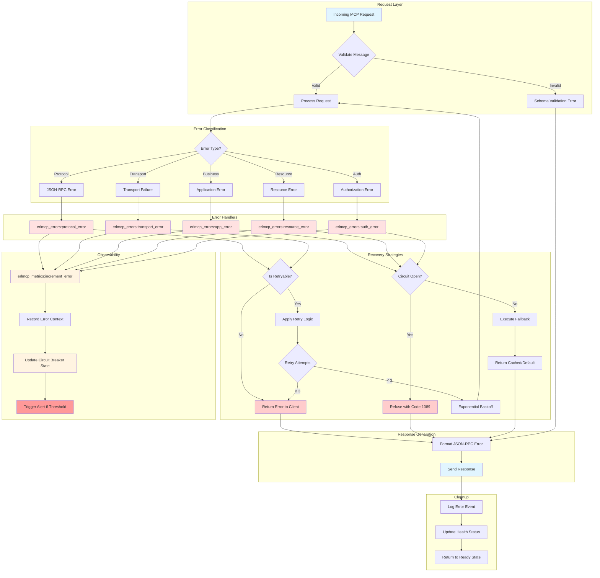
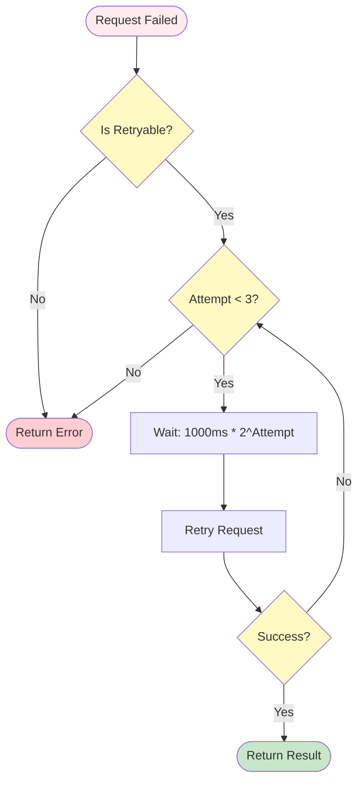
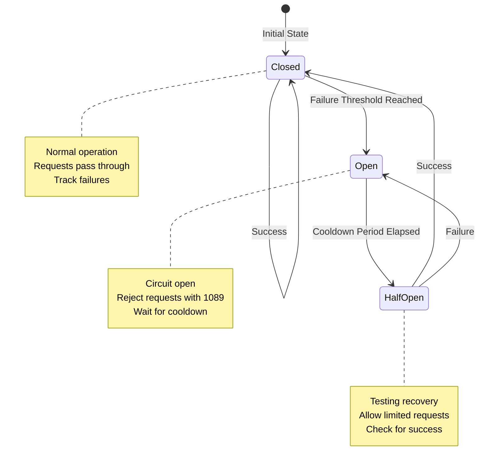
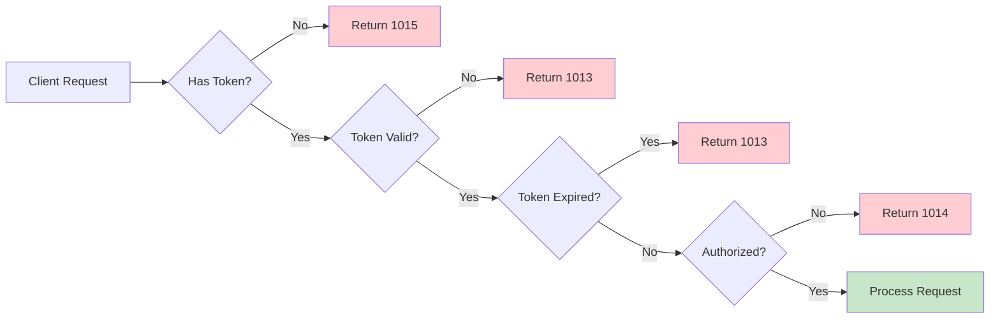
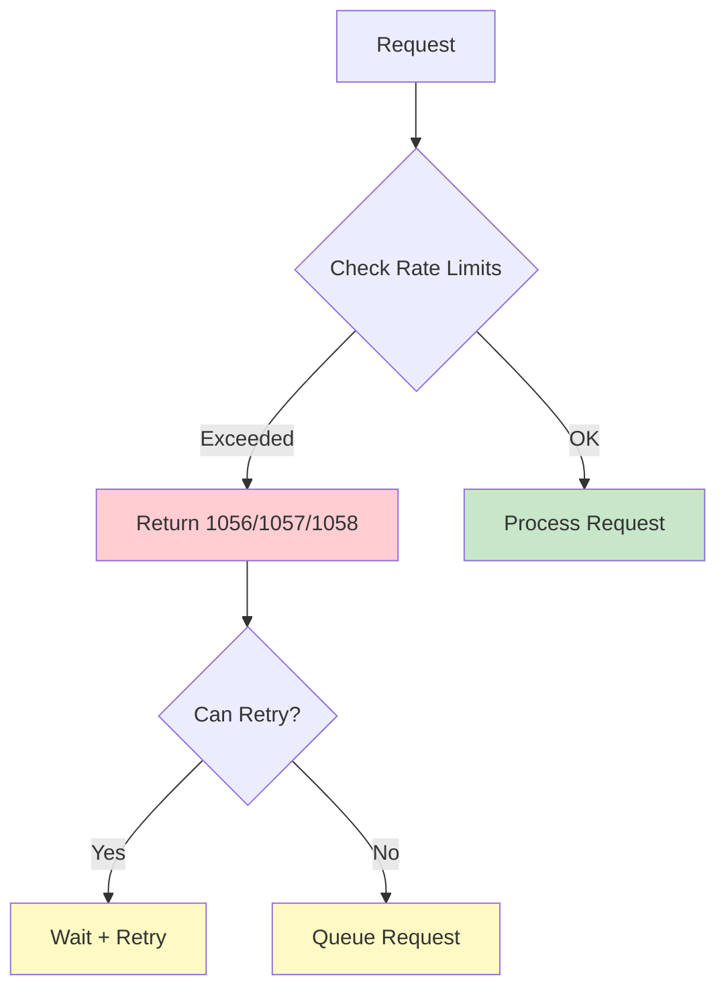
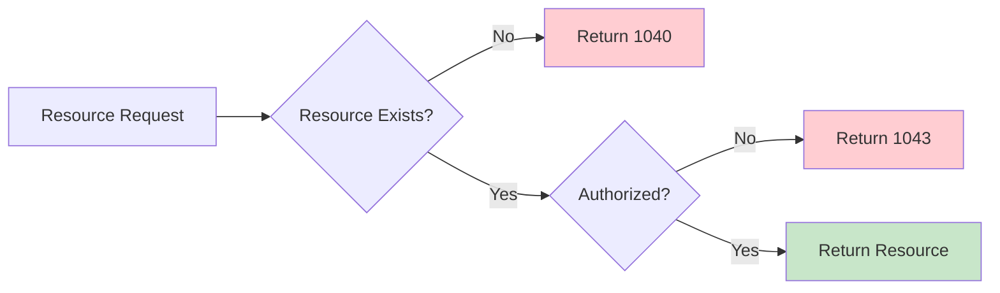

# Error Handling Guide

**Version**: 2.1.0
**Last Updated**: 2025-01-31

---

## Overview

This guide provides comprehensive error handling information for erlmcp, including error codes, recovery strategies, and debugging techniques.

---

## Error Flow Architecture

### Error Handling Flowchart



---

## Error Code Reference

### Protocol Errors (1001-1039)

#### Core Protocol Errors

| Code | Name | Description | Retryable | Action |
|------|------|-------------|-----------|--------|
| 1001 | Protocol Violation | Fundamental protocol error | No | Fix client implementation |
| 1002 | Invalid JSON | JSON parsing failed | No | Fix JSON syntax |
| 1003 | JSON-RPC Error | JSON-RPC spec violation | No | Fix JSON-RPC format |
| 1004 | Invalid Request | Malformed request | No | Fix request structure |
| 1005 | Method Not Found | Requested method doesn't exist | No | Use valid method |
| 1006 | Invalid Params | Invalid parameters | No | Fix parameter types |
| 1007 | Internal Error | Server internal error | Yes | Retry or report |
| 1008 | Server Error | Server error | Yes | Retry or report |

#### MCP-Specific Errors

| Code | Name | Description | Retryable | Action |
|------|------|-------------|-----------|--------|
| 1011 | Authentication Failed | Auth credentials invalid | No | Update credentials |
| 1012 | Invalid Credentials | Wrong username/password | No | Fix credentials |
| 1013 | Token Expired | Auth token expired | No | Refresh token |
| 1014 | Forbidden | Authorization denied | No | Check permissions |
| 1015 | Missing Auth | No credentials provided | No | Add credentials |
| 1016 | Invalid Session | Session ID format invalid | No | Fix session format |
| 1017 | Session Expired | Session timeout | Yes | Re-authenticate |
| 1018 | Session Not Found | Session doesn't exist | No | Create session |
| 1019 | Rate Limit Exceeded | Rate limit hit | Yes | Wait and retry |

### Resource Errors (1040-1059)

| Code | Name | Description | Retryable | Action |
|------|------|-------------|-----------|--------|
| 1040 | Resource Not Found | Resource doesn't exist | No | Check resource URI |
| 1041 | Tool Not Found | Tool doesn't exist | No | Check tool name |
| 1042 | Prompt Not Found | Prompt doesn't exist | No | Check prompt URI |
| 1043 | Resource Access Denied | No permission for resource | No | Check permissions |
| 1044 | Resource Already Exists | Duplicate resource | No | Use different URI |
| 1045 | Tool Already Exists | Duplicate tool | No | Use different name |
| 1046 | Resource Invalid | Invalid resource definition | No | Fix resource spec |
| 1047 | Tool Invalid | Invalid tool definition | No | Fix tool spec |
| 1048 | Prompt Invalid | Invalid prompt definition | No | Fix prompt spec |
| 1049 | Resource Sub Failed | Subscription failed | No | Check subscription limit |
| 1050 | Resource Unsub Failed | Unsubscribe failed | No | Check subscription exists |
| 1051 | Resource List Failed | List resources failed | Yes | Retry |
| 1052 | Resource Read Failed | Read resource failed | Yes | Retry |

### Request/Response Errors (1060-1079)

| Code | Name | Description | Retryable | Action |
|------|------|-------------|-----------|--------|
| 1060 | Message Too Large | Message exceeds size limit | No | Compress or chunk |
| 1061 | Request Cancelled | Request was cancelled | No | Check cancellation |
| 1062 | Request Timed Out | Request timeout | Yes | Increase timeout |
| 1063 | Response Timed Out | Response timeout | Yes | Increase timeout |
| 1064 | Invalid Response | Invalid response format | No | Fix response handling |
| 1065 | Response Incomplete | Partial response | Yes | Retry |
| 1066 | Protocol Error | MCP protocol error | No | Fix protocol usage |
| 1067 | Transport Error | Transport layer error | Yes | Retry |
| 1068 | Message Size Exceeded | Message size limit | No | Compress message |
| 1069 | Batch Too Large | Batch exceeds limit | No | Reduce batch size |
| 1070 | Invalid Batch | Batch format invalid | No | Fix batch format |

### Rate Limiting Errors (1080-1089)

| Code | Name | Description | Retryable | Action |
|------|------|-------------|-----------|--------|
| 1056 | Overall Rate Limit | Overall rate limit exceeded | Yes | Wait and retry |
| 1057 | Per-Second Rate Limit | Per-second limit exceeded | Yes | Spread requests |
| 1058 | Per-Minute Rate Limit | Per-minute limit exceeded | Yes | Spread requests |
| 1059 | Quota Exceeded | Monthly quota exceeded | No | Wait for reset or upgrade |
| 1060 | Connection Limit | Connection limit exceeded | Yes | Close connections |
| 1089 | Circuit Breaker Open | Service unavailable | Yes | Wait for cooldown |

---

## Error Recovery Patterns

### Retry Pattern



**Configuration**:

```erlang
{retry_policy, [
    {max_retries, 3},
    {base_delay_ms, 1000},
    {max_delay_ms, 10000},
    {multiplier, 2.0}
]}.
```

### Circuit Breaker Pattern



**Configuration**:

```erlang
{circuit_breaker, [
    {enabled, true},
    {failure_threshold, 5},
    {success_threshold, 2},
    {timeout_ms, 30000},
    {cooldown_ms, 10000}
]}.
```

---

## Debugging Errors

### Error Context Extraction

```erlang
%% Get full error context
case erlmcp_errors:classify_error(Error) of
    {protocol_error, Context} ->
        logger:error("Protocol error: ~p", [Context]);
    {transport_error, Context} ->
        logger:error("Transport error: ~p", [Context]);
    {auth_error, Context} ->
        logger:error("Auth error: ~p", [Context])
end.
```

### Error Stack Traces

```erlang
%% Enable stack traces
erlang:process_flag(trap_exit, true).

%% Catch and log
try
    dangerous_operation()
catch
    Type:Reason:Stacktrace ->
        logger:error("Error: ~p:~p~nStack: ~p",
                     [Type, Reason, Stacktrace]),
        {error, Reason}
end.
```

### Error Logging

```bash
# Enable debug logging
logger:set_application_level(erlmcp_core, debug).

# View error logs
logger:get_config().

# Filter errors
logger:filter_handler_error(default, fun(_) -> true end).
```

---

## Error Prevention

### Input Validation

```erlang
%% Validate JSON schema
{ok, Schema} = file:read_file("schema/request.json"),
case jesse:validate(Json, Schema) of
    {ok, Validated} ->
        process_request(Validated);
    {error, Errors} ->
        {error, {invalid_params, Errors}}
end.
```

### Rate Limiting

```erlang
%% Configure rate limits
{rate_limiting, [
    {enabled, true},
    {overall_limit, 10000},
    {per_second_limit, 100},
    {per_minute_limit, 5000},
    {connection_limit, 100}
]}.
```

### Circuit Breakers

```erlang
%% Enable circuit breaker
{circuit_breaker, [
    {enabled, true},
    {failure_threshold, 5},
    {timeout_ms, 30000}
]}.
```

---

## Common Error Scenarios

### Scenario 1: Authentication Failure



**Resolution**:
- 1015: Add `Authorization` header
- 1013: Refresh token
- 1014: Check permissions

### Scenario 2: Rate Limit



**Resolution**:
- Wait before retry
- Implement backoff
- Request limit increase

### Scenario 3: Resource Not Found



**Resolution**:
- Check resource URI
- List available resources
- Check permissions

---

## Error Monitoring

### Metrics to Track

```erlang
%% Error count by type
erlmcp_metrics:increment_error(protocol_error).
erlmcp_metrics:increment_error(auth_error).
erlmcp_metrics:increment_error(resource_error).

%% Error rate
erlmcp_metrics:error_rate(window_minutes).

%% Circuit breaker state
erlmcp_metrics:circuit_breaker_state(service_name).
```

### Alerting Thresholds

```erlang
{alerting, [
    {error_rate_threshold, 0.05},   % 5% error rate
    {circuit_breaker_alerts, true},
    {auth_failure_threshold, 10},   % 10 auth failures/min
    {timeout_threshold, 30}         % 30 timeouts/min
]}.
```

---

**See Also**:
- [README.md](README.md) - Main troubleshooting guide
- [DEBUGGING_GUIDE.md](DEBUGGING_GUIDE.md) - Advanced debugging techniques
- [Common Issues](common-issues.md) - Frequently encountered problems
