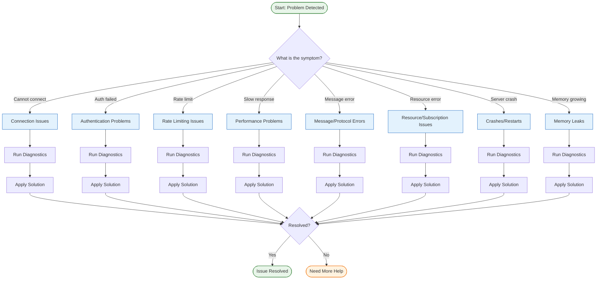
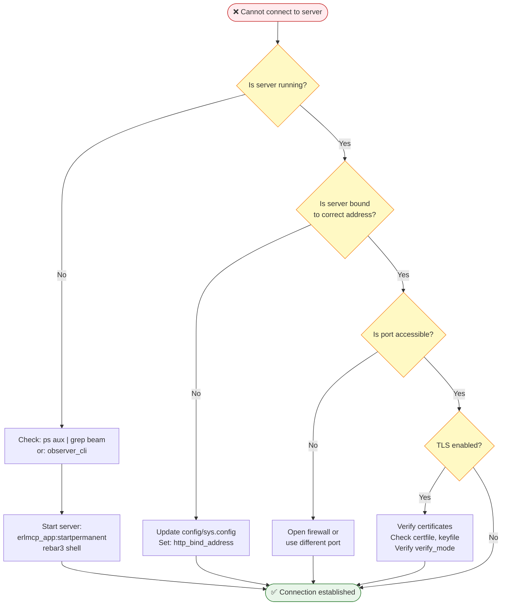
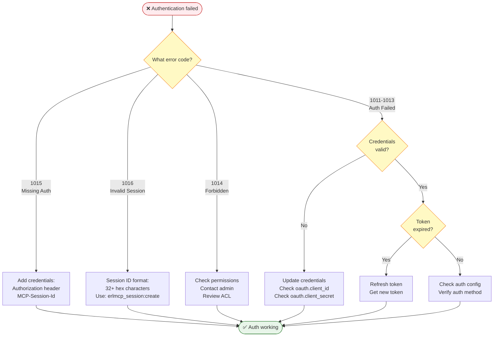
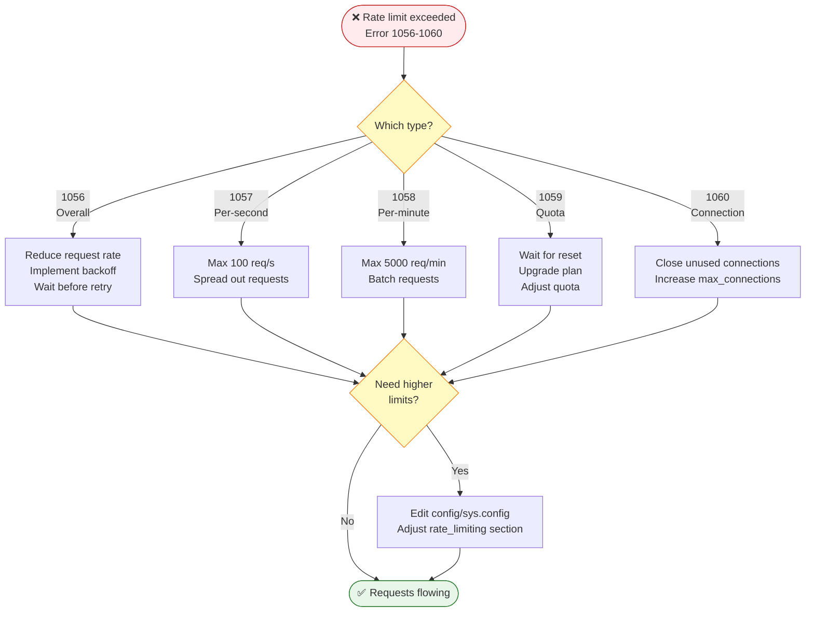
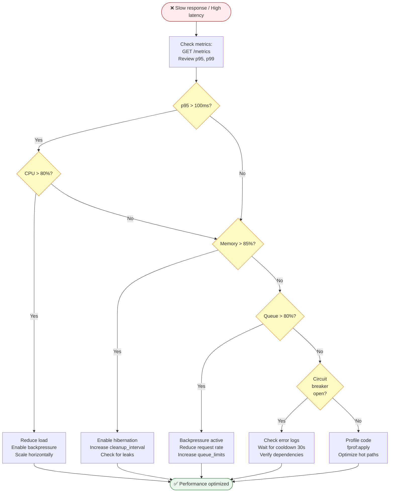
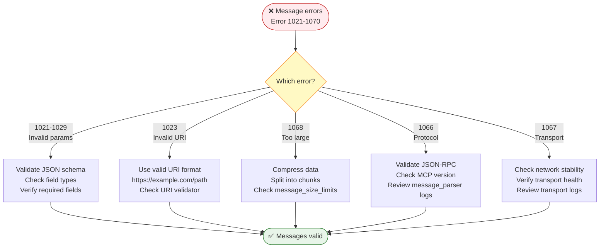
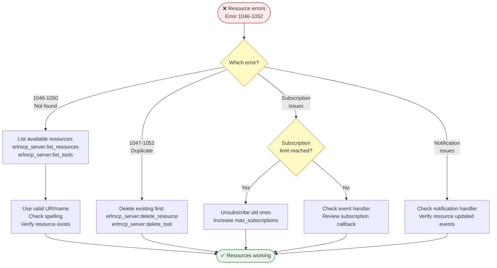
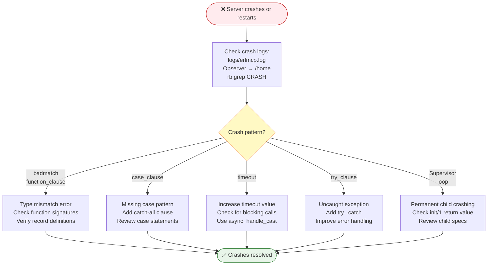
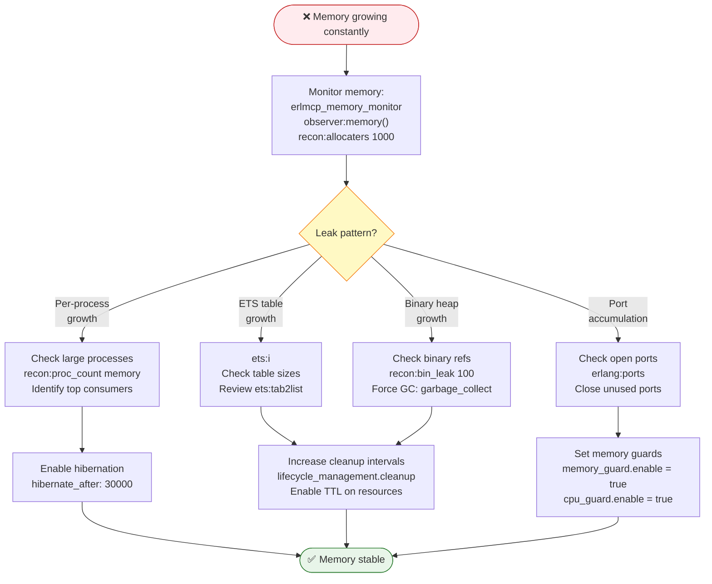

# erlmcp Troubleshooting Guide

**Version**: 2.1.0
**Last Updated**: 2025-01-31
**Maintainer**: erlmcp Development Team

---

## Overview

This guide provides comprehensive troubleshooting information for erlmcp (Erlang/OTP Model Context Protocol SDK). It uses visual flowcharts and systematic diagnostic procedures to help you quickly identify and resolve issues.

**Scope**: Covers connection issues, authentication failures, performance problems, message/protocol errors, resource management, crashes, and memory leaks.

**Quick Diagnosis**: Use the symptom checker below or navigate to specific sections.

---

## Symptom Checker

Use this table to quickly navigate to the relevant troubleshooting section:

| Symptom | Category | See Section |
|---------|----------|-------------|
| Cannot connect to server | Connection | [Connection Issues](#connection-issues) |
| Authentication/authorization failures | Authentication | [Authentication Problems](#authentication-problems) |
| Rate limit exceeded errors | Rate Limiting | [Rate Limiting Issues](#rate-limiting-issues) |
| Slow response times / high latency | Performance | [Performance Problems](#performance-problems) |
| Message validation failures | Protocol | [Message/Protocol Errors](#messageprotocol-errors) |
| Resource/tool/prompt not found | Resources | [Resource/Subscription Issues](#resourcesubscription-issues) |
| Server crashes or restarts | Stability | [Crashes/Restarts](#crashesrestarts) |
| Memory growing constantly | Memory | [Memory Leaks](#memory-leaks) |
| Transport layer errors | Transport | [Transport Layer Issues](docs/troubleshooting/TRANSPORT_ISSUES.md) |

---

## Master Diagnostic Flowchart



---

## Diagnostic Tools Overview

### Quick Access Tools

```bash
# Health check (comprehensive)
curl http://localhost:9090/health

# Metrics endpoint
curl http://localhost:9090/metrics

# Erlang shell connection
erl -name debug@127.0.0.1 -setcookie erlmcp -remsh erlmcp@hostname

# Observer GUI (if available)
observer:start()
```

### Tool Categories

| Tool | Purpose | Usage |
|------|---------|-------|
| **observer** | Visual process inspection | `observer:start()` in Erlang shell |
| **recon** | Runtime diagnostics | `recon:proc_count(memory)` |
| **erlmcp_metrics** | Performance metrics | `GET /metrics` HTTP endpoint |
| **logger** | Log inspection | `logger:get_config()` |
| **debugger** | Step-through debugging | `debugger:start()` |
| **fprof** | Performance profiling | `fprof:apply(Module, Fun, Args)` |

---

## Connection Issues

### Symptom: Cannot connect to server

**Diagnostic Flowchart**:



**Step-by-Step Diagnosis**:

1. **Check if server is running**:
   ```bash
   # Check for beam process
   ps aux | grep beam

   # Or use observer_cli
   observer_cli

   # Check if listening
   netstat -an | grep 8080
   ```

2. **Verify binding address**:
   ```erlang
   % Check configuration
   application:get_env(erlmcp_core, http_bind_address).
   % Should return: {ok, {127, 0, 0, 1}} or similar
   ```

3. **Test port accessibility**:
   ```bash
   # Test TCP connection
   telnet localhost 8080

   # Or use nc
   nc -zv 127.0.0.1 8080
   ```

4. **Check TLS configuration** (if applicable):
   ```erlang
   % Verify TLS settings
   application:get_env(erlmcp_core, https_config).
   ```

**Solutions**:

- Server not running: Start it with `erlmcp_app:startpermanent` or `rebar3 shell`
- Wrong binding: Update `http_bind_address` in `config/sys.config`
- Firewall blocking: Open port or use different port
- TLS issues: Verify certificate files exist and `verify_mode` is correct

---

## Authentication Problems

### Symptom: Authentication failed

**Error Code Flowchart**:



**Error Code Reference**:

| Code | Meaning | Solution |
|------|---------|----------|
| 1011 | Authentication failed | Check credentials, verify auth method |
| 1012 | Invalid credentials | Update username/password or API key |
| 1013 | Token expired | Refresh token |
| 1014 | Forbidden | Check permissions, contact administrator |
| 1015 | Missing auth | Add `Authorization` or `MCP-Session-Id` header |
| 1016 | Invalid session ID | Use correct format (32+ hex chars) |

**Diagnosis Steps**:

1. **Check error code in response**:
   ```bash
   # View full error response
   curl -v http://localhost:8080/tools/list \
     -H "Authorization: Bearer invalid_token"
   ```

2. **Verify credentials**:
   ```erlang
   % Check OAuth configuration
   application:get_env(erlmcp_core, oauth).

   % Verify session
   erlmcp_session_manager:get_session(<<"session_id">>).
   ```

3. **Test with valid credentials**:
   ```bash
   # Get valid token
   TOKEN=$(curl -X POST http://localhost:8080/auth/token \
     -d "client_id=xxx&client_secret=xxx" | jq -r '.access_token')

   # Use token
   curl http://localhost:8080/tools/list \
     -H "Authorization: Bearer $TOKEN"
   ```

---

## Rate Limiting Issues

### Symptom: Rate limit exceeded

**Rate Limit Decision Tree**:



**Rate Limit Configuration**:

```erlang
{erlmcp_core, [
    {rate_limiting, [
        {enabled, true},
        {overall_limit, 10000},        % Total requests
        {per_second_limit, 100},       % Max 100 req/s
        {per_minute_limit, 5000},      % Max 5000 req/min
        {connection_limit, 100},       % Max concurrent connections
        {quota_limit, 1000000}         % Monthly quota
    ]}
]}.
```

**Solutions**:

- Implement exponential backoff:
  ```erlang
  %% Backoff strategy
 {retry_policy, [
      {max_retries, 3},
      {base_delay_ms, 1000},
      {max_delay_ms, 10000},
      {multiplier, 2.0}
  ]}
  ```

- Adjust limits in configuration (if appropriate)

---

## Performance Problems

### Symptom: Slow response times / high latency

**Performance Diagnostic Flow**:



**Performance Diagnosis**:

1. **Check metrics**:
   ```bash
   # View current metrics
   curl http://localhost:9090/metrics | grep latency

   # Look for:
   # - erlmcp_latency_p50_us
   # - erlmcp_latency_p95_us
   # - erlmcp_latency_p99_us
   ```

2. **Monitor CPU**:
   ```erlang
   % Check scheduler utilization
   observer:start().
   % Look at Load Charts tab

   % Or use recon
   recon:load(avg10).
   ```

3. **Check memory**:
   ```erlang
   % Total memory
   erlang:memory().

   % Per-process memory
   recon:proc_count(memory, 10).

   % Binary heap
   recon:bin_leak(100).
   ```

4. **Inspect message queues**:
   ```erlang
   % Processes with large message queues
   recon:proc_count(message_queue_len, 10).
   ```

5. **Check circuit breaker**:
   ```erlang
   % Circuit breaker state
   erlmcp_circuit_breaker:get_state(service_name).
   ```

**Solutions**:

- Enable hibernation:
  ```erlang
  {hibernate_after, 30000}  % Hibernate after 30s idle
  ```

- Increase cleanup intervals:
  ```erlang
  {cleanup_interval, 60000}  % Run cleanup every 60s
  ```

- Enable backpressure:
  ```erlang
  {backpressure, [
      {enabled, true},
      {threshold, 0.8},  % Trigger at 80% capacity
      {strategy, drop_tail}
  ]}
  ```

---

## Message/Protocol Errors

### Symptom: Message validation failures

**Protocol Error Decision Tree**:



**Common Message Errors**:

| Error | Meaning | Solution |
|-------|---------|----------|
| 1021 | Missing required field | Add required field |
| 1022 | Invalid field type | Correct field type |
| 1023 | Invalid URI | Use valid URI format |
| 1066 | Protocol error | Validate JSON-RPC format |
| 1067 | Transport error | Check network/transport |
| 1068 | Message too large | Compress or chunk |

**Validation Tools**:

```erlang
% Validate JSON schema
erlmcp_json_rpc:validate_request(JsonMap).

% Check message size
erlmcp_message_size:validate_message(Binary).

% Parse URI
erlmcp_uri_validator:parse(Uri).
```

---

## Resource/Subscription Issues

### Symptom: Resource/tool/prompt not found

**Resource Troubleshooting Flow**:



**Resource Management Commands**:

```erlang
% List available resources
erlmcp_server:list_resources().

% List tools
erlmcp_server:list_tools().

% List prompts
erlmcp_server:list_prompts().

% Check subscriptions
erlmcp_resource_subscriptions:list(ServerId).

% Subscribe to resource
erlmcp_resource_subscriptions:subscribe(ServerId, ResourceUri).

% Unsubscribe
erlmcp_resource_subscriptions:unsubscribe(ServerId, ResourceUri).
```

**Configuration**:

```erlang
{erlmcp_core, [
    {max_subscriptions_per_server, 10000},
    {subscription_cleanup_interval, 60000}
]}.
```

---

## Crashes/Restarts

### Symptom: Server crashes or restarts

**Crash Analysis Flowchart**:



**Crash Diagnosis**:

1. **Find crash logs**:
   ```bash
   # Search for CRASH reports
   grep -i "crash" /var/log/erlmcp/erlmcp.log | tail -50

   # In Erlang shell
   rb:list().
   rb:show(Ref).
   ```

2. **Analyze crash dump** (if available):
   ```erlang
   % Load crash dump
   webtool:start().

   % Or analyze manually
   erl_crash_dump_analyzer:analyze("erl_crash.dump").
   ```

3. **Check supervisor restarts**:
   ```erlang
   % Get child processes
   supervisor:which_children(erlmcp_core_sup).

   % Check restart counts
   recon:proc_count(reductions, 10).
   ```

**Common Crash Patterns**:

| Pattern | Cause | Solution |
|---------|-------|----------|
| badmatch | Pattern match failure | Check data types |
| function_clause | No matching function clause | Add catch-all clause |
| case_clause | No matching case branch | Add default case |
| timeout | Operation exceeded timeout | Increase timeout |
| try_clause | Uncaught exception | Add try...catch |

---

## Memory Leaks

### Symptom: Memory growing constantly

**Memory Leak Detection Flow**:



**Memory Diagnosis Tools**:

```erlang
% Total memory breakdown
erlang:memory().

% Per-process memory
recon:proc_count(memory, 10).

% Binary leak detection
recon:bin_leak(100).

% ETS table sizes
ets:i().

% Port count
length(erlang:ports()).

% Force garbage collection
garbage_collect(Pid).
```

**Memory Leak Solutions**:

1. **Enable hibernation**:
   ```erlang
   {hibernate_after, 30000}  % After 30s idle
   ```

2. **Increase cleanup intervals**:
   ```erlang
   {cleanup_interval, 60000},
   {lifecycle_management, [
       {session_ttl, 3600000},
       {enable_ttl, true}
   ]}
   ```

3. **Enable memory guards**:
   ```erlang
   {memory_guard, [
       {enable, true},
       {threshold_mb, 4096},
       {action, throttle}
   ]},
   {cpu_guard, [
       {enable, true},
       {threshold_percent, 90}
   ]}
   ```

4. **Bounded ETS tables**:
   ```erlang
   ets:new(table_name, [
       named_table,
       public,
       {max_size, 10000},
       {heir, None}
   ]).
   ```

---

## Getting More Help

### Information to Collect

When seeking help, please collect:

1. **System Information**:
   ```bash
   erl -version
   uname -a
   ```

2. **erlmcp Version**:
   ```bash
   rebar3 version
   git log -1 --oneline
   ```

3. **Configuration**:
   ```bash
   cat config/sys.config
   ```

4. **Recent Logs**:
   ```bash
   tail -n 100 logs/erlmcp.log
   ```

5. **Error Messages**:
   - Full error text
   - Stack traces
   - Context around error

### Where to Get Help

- **Documentation**: [erlmcp Documentation](https://github.com/erlmcp/erlmcp)
- **GitHub Issues**: [Issue Tracker](https://github.com/erlmcp/erlmcp/issues)
- **Troubleshooting Guides**: See additional guides below

### Additional Troubleshooting Guides

- [Transport Layer Issues](TRANSPORT_ISSUES.md) - TCP, HTTP, WebSocket, SSE troubleshooting
- [Error Handling Guide](ERROR_HANDLING.md) - Comprehensive error code reference
- [Debugging Guide](DEBUGGING_GUIDE.md) - Advanced debugging techniques
- [Common Issues](common-issues.md) - Frequently encountered problems

---

**Status**: Published
**Review Date**: 2025-02-28
**Next Update**: 2025-03-31
