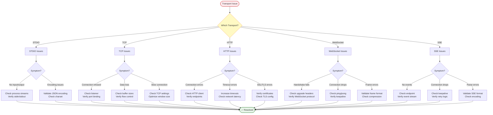
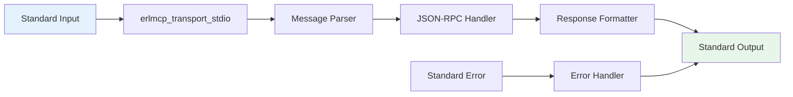
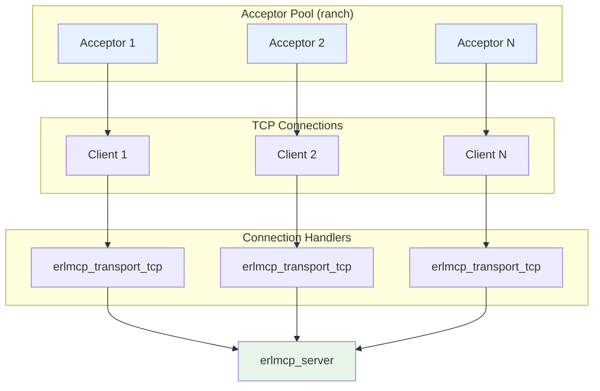
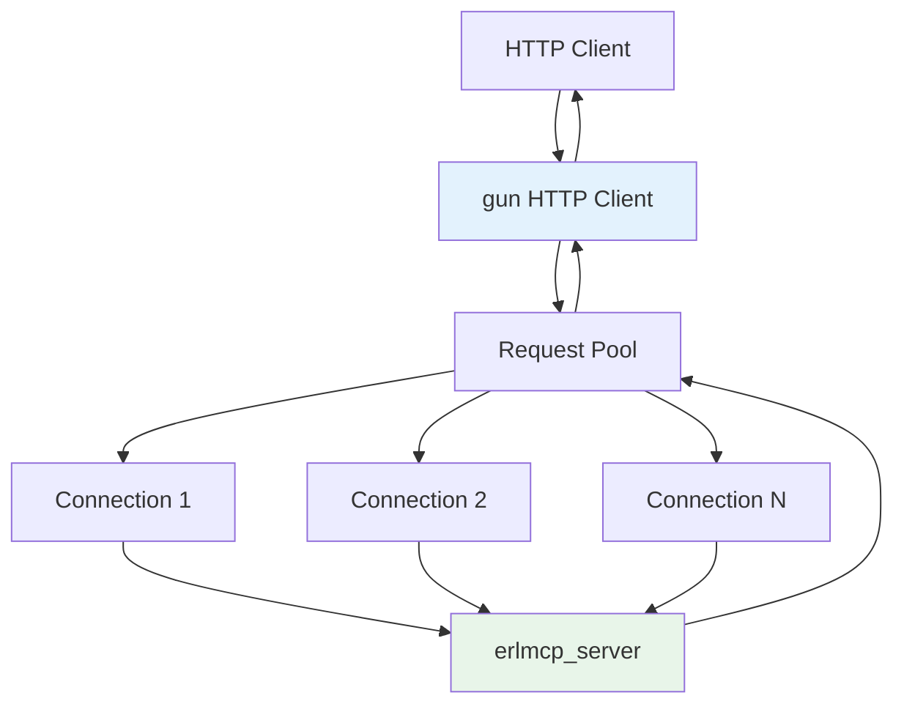
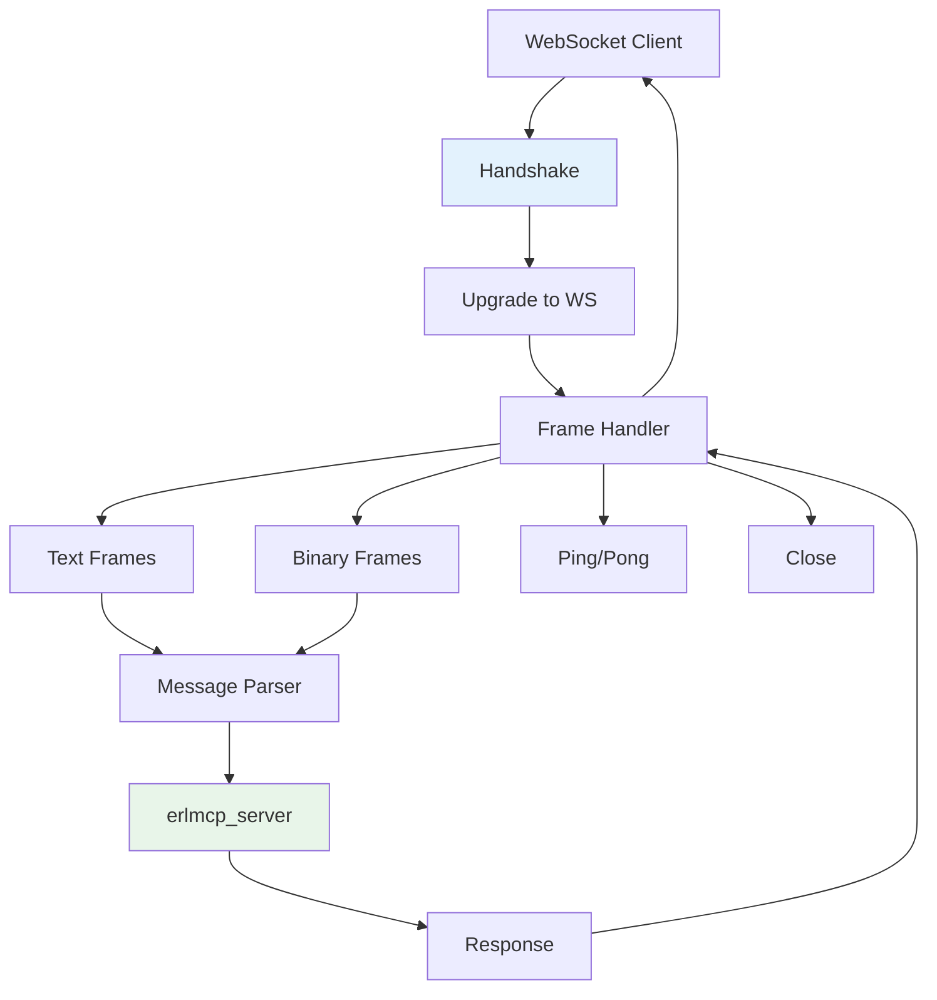
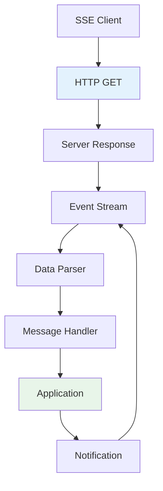
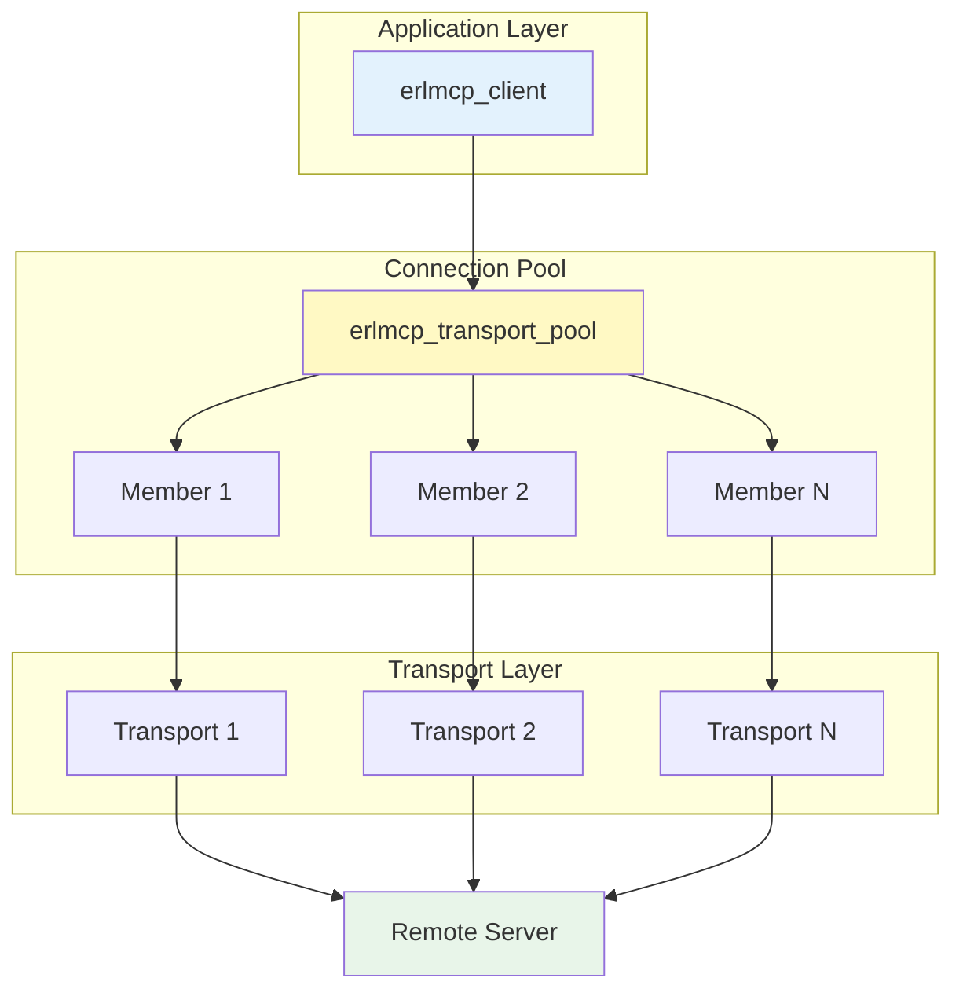

# Transport Layer Issues

**Version**: 2.1.0
**Last Updated**: 2025-01-31

---

## Overview

This guide covers troubleshooting transport-specific issues in erlmcp, including STDIO, TCP, HTTP, WebSocket, and Server-Sent Events (SSE).

---

## Transport Selection Flow



---

## STDIO Transport

### Architecture



### Common Issues

#### Issue 1: No Input/Output

**Symptoms**:
- Messages not received
- Responses not sent
- Process appears frozen

**Diagnosis**:

```erlang
% Check if process is alive
erlang:is_process_alive(StdioPid).

% Check process info
process_info(StdioPid, status).

% Check input/output
io:format("~p~n", ["Test message"]).

% Check group leader
erlang:group_leader().

% Check if stdin is readable
file:read_line(standard_io).
```

**Solution**:

```erlang
% Ensure proper initialization
{ok, StdioPid} = erlmcp_transport_stdio:start_link([
    {input, standard_io},
    {output, standard_io},
    {error, standard_error}
]).

% Set correct encoding
io:setopts(standard_io, [{binary, true}]).
```

#### Issue 2: Encoding Problems

**Symptoms**:
- Invalid UTF-8 sequences
- Encoding/decoding errors
- Garbled output

**Diagnosis**:

```bash
# Check terminal encoding
echo $LANG
locale

# Test UTF-8
echo -e "\xe2\x9c\x93"
```

**Solution**:

```erlang
% Set UTF-8 encoding
io:setopts(standard_io, [{encoding, utf8}]).

% Validate JSON
jsx:is_json(JsonBinary).

% Encode with UTF-8
jsx:encode(Map, [utf8]).

% Decode with UTF-8
jsx:decode(JsonBinary, [utf8]).
```

---

## TCP Transport

### Architecture



### Common Issues

#### Issue 1: Connection Refused

**Symptoms**:
- Cannot connect to server
- ECONNREFUSED errors
- Telnet fails

**Diagnosis**:

```bash
# Check if port is listening
netstat -an | grep 5005

# Or using ss
ss -tlnp | grep 5005

# Try telnet
telnet localhost 5005

# Check firewall
iptables -L -n | grep 5005
```

```erlang
% Check ranch listener
ranch:server_status(erlmcp_tcp).

% Check port configuration
application:get_env(erlmcp_core, tcp_port).

% Check listener count
ranch:procs(erlmcp_tcp, acceptors).
```

**Solution**:

```erlang
% Ensure ranch is started
application:ensure_all_started(ranch).

% Configure TCP listener
{erlmcp_transports, [
    {tcp_listeners, [
        [{port, 5005},
         {acceptors, 10},
         {max_connections, 1000}]
    ]}
]}.

% Start listener
ranch:start_listener(erlmcp_tcp,
    ranch_tcp, #{socket_opts => [{port, 5005}]},
    erlmcp_transport_tcp, []
).
```

#### Issue 2: Data Loss or Corruption

**Symptoms**:
- Incomplete messages
- Corrupted data
- Missing packets

**Diagnosis**:

```erlang
% Check buffer size
inet:getopts(Socket, [recbuf, sndbuf]).

% Check packet count
erlang:port_info(Socket, recv_cnt).

% Check packet errors
erlang:port_info(Socket, error).
```

**Solution**:

```erlang
% Increase buffer sizes
{socket_opts, [
    {port, 5005},
    {recbuf, 65536},  % 64KB receive buffer
    {sndbuf, 65536},  % 64KB send buffer
    {buffer, 65536}
]}.

% Enable flow control
{flow_control, true}.

% Use packet mode
{packet, 4},  % 4-byte length prefix
```

#### Issue 3: Slow Connection

**Symptoms**:
- High latency
- Slow throughput
- Connection timeout

**Diagnosis**:

```bash
# Measure latency
ping -c 10 localhost

# Measure throughput
iperf -s
iperf -c localhost -t 10
```

```erlang
% Check TCP settings
inet:getopts(Socket, [nodelay, keepalive]).

% Measure round-trip time
{ok, {Address, _}} = inet:peername(Socket).
```

**Solution**:

```erlang
% Optimize TCP settings
{socket_opts, [
    {nodelay, true},      % Disable Nagle's algorithm
    {keepalive, true},    % Enable TCP keepalive
    {send_timeout, 30000}, % 30-second send timeout
    {recv_timeout, 30000}  % 30-second receive timeout
]}.

% Increase window size
{window_size, 65535}.
```

---

## HTTP Transport

### Architecture



### Common Issues

#### Issue 1: Connection Errors

**Symptoms**:
- Failed to connect
- DNS resolution failed
- Network unreachable

**Diagnosis**:

```bash
# Check DNS
nslookup example.com
dig example.com

# Check connectivity
curl -v http://example.com:8080

# Check routing
traceroute example.com
```

```erlang
% Check gun client state
gun:state(ClientPid).

% Check connection pool
gun:pool_status(PoolName).

% Check open connections
gun:open_connections(PoolName).
```

**Solution**:

```erlang
% Configure HTTP client with retry
{http_client, [
    {connect_timeout, 5000},
    {retry, 3},
    {retry_timeout, 1000}
]}.

% Use connection pool
{http_pool, [
    {size, 10},
    {max_overflow, 20}
]}.
```

#### Issue 2: Timeout Errors

**Symptoms**:
- Requests timeout
- Slow response
- Partial responses

**Diagnosis**:

```bash
# Measure response time
time curl http://localhost:8080/health

# Check HTTP timeout
curl -v --max-time 5 http://localhost:8080/
```

```erlang
% Check gun request stats
gun:info(ClientPid).

% Check pending requests
gun:pending_requests(StreamRef).
```

**Solution**:

```erlang
% Increase timeouts
{http_config, [
    {request_timeout, 30000},  % 30 seconds
    {connect_timeout, 10000},  % 10 seconds
    {inactivity_timeout, 60000}  % 60 seconds
]}.

% Enable async mode
{async, true}.
```

#### Issue 3: SSL/TLS Errors

**Symptoms**:
- Certificate verification failed
- Handshake errors
- SSL errors

**Diagnosis**:

```bash
# Test SSL connection
openssl s_client -connect localhost:8443

# Check certificate
openssl x509 -in cert.pem -text -noout
```

```erlang
% Check TLS config
application:get_env(erlmcp_core, https_config).

% Test TLS connection
ssl:connect("localhost", 8443, [{verify, verify_peer}]).
```

**Solution**:

```erlang
% Configure TLS
{https_config, [
    {enabled, true},
    {certfile, "certs/server.crt"},
    {keyfile, "certs/server.key"},
    {cacertfile, "certs/ca.crt"},
    {verify, verify_peer},
    {fail_if_no_peer_cert, true},
    {versions, ['tlsv1.2', 'tlsv1.3']},
    {ciphers, [
        "ECDHE-RSA-AES128-GCM-SHA256",
        "ECDHE-RSA-AES256-GCM-SHA384"
    ]}
]}.
```

---

## WebSocket Transport

### Architecture



### Common Issues

#### Issue 1: Handshake Fails

**Symptoms**:
- Connection rejected
- 400 Bad Request
- Upgrade header missing

**Diagnosis**:

```bash
# Check WebSocket upgrade
curl -i -N \
  -H "Connection: Upgrade" \
  -H "Upgrade: websocket" \
  -H "Sec-WebSocket-Version: 13" \
  -H "Sec-WebSocket-Key: test" \
  http://localhost:8080/ws
```

```erlang
% Check WebSocket handler
cowboy:stop_listener(ws_listener).

% Check WebSocket config
application:get_env(erlmcp_transports, ws_config).
```

**Solution**:

```erlang
% Configure WebSocket
{ws_config, [
    {port, 8080},
    {path, "/ws"},
    {compress, true},
    {max_frame_size, 65536},
    {idle_timeout, 60000}
]}.
```

#### Issue 2: Connection Drops

**Symptoms**:
- Frequent disconnections
- Connection timeout
- Unexpected close

**Diagnosis**:

```erlang
% Check WebSocket state
websocket_client:state(WSPid).

% Check close reason
websocket_client:close_info(WSPid).

% Check ping/pong
websocket_client:last_ping(WSPid).
```

**Solution**:

```erlang
% Enable keepalive
{ws_config, [
    {enable_keepalive, true},
    {keepalive_interval, 30000},  % 30 seconds
    {keepalive_timeout, 10000}     % 10 seconds
]}.

% Handle reconnect
{reconnect, [
    {enabled, true},
    {max_retries, 5},
    {retry_interval, 5000}
]}.
```

#### Issue 3: Frame Errors

**Symptoms**:
- Invalid frame format
- Parse errors
- Encoding errors

**Diagnosis**:

```erlang
% Check frame format
websocket:frame_info(Frame).

% Validate frame
websocket:validate_frame(Frame).
```

**Solution**:

```erlang
% Configure frame handling
{ws_config, [
    {frame_format, binary},
    {max_frame_size, 65536},
    {validate_frames, true}
]}.
```

---

## SSE (Server-Sent Events) Transport

### Architecture



### Common Issues

#### Issue 1: No Events Received

**Symptoms**:
- Connection established but no events
- Empty event stream
- Timeout waiting for events

**Diagnosis**:

```bash
# Test SSE endpoint
curl -N http://localhost:8080/events

# Check headers
curl -I http://localhost:8080/events
```

```erlang
% Check SSE handler
erlmcp_transport_sse:state(SSEPid).

% Check event store
erlmcp_sse_event_store:list(ServerId).
```

**Solution**:

```erlang
% Configure SSE
{sse_config, [
    {path, "/events"},
    {headers, [
        {"Content-Type", "text/event-stream"},
        {"Cache-Control", "no-cache"},
        {"Connection", "keep-alive"}
    ]}
]}.
```

#### Issue 2: Connection Drops

**Symptoms**:
- Intermittent disconnections
- Lost events
- Need to reconnect

**Diagnosis**:

```erlang
% Check SSE connection
erlmcp_sse_manager:get_connection(ClientId).

% Check last event
erlmcp_sse_event_store:last_event(ServerId).
```

**Solution**:

```erlang
% Enable retry
{sse_config, [
    {retry, 3000},  % Retry after 3 seconds
    {keepalive, true},
    {keepalive_interval, 15000}
]}.

% Implement Last-Event-ID
{last_event_id, true}.
```

#### Issue 3: Parse Errors

**Symptoms**:
- Invalid SSE format
- Encoding errors
- Malformed events

**Diagnosis**:

```bash
# View raw event stream
curl -N http://localhost:8080/events | cat -v
```

```erlang
% Validate SSE event
erlmcp_transport_sse:validate_event(Event).

% Parse SSE event
erlmcp_transport_sse:parse_event(Data).
```

**Solution**:

```erlang
% Configure SSE format
{sse_config, [
    {event_format, strict},
    {validate_events, true},
    {encoding, utf8}
]}.
```

---

## Transport Pooling

### Pool Architecture



### Pool Configuration

```erlang
{transport_pools, [
    {default_pool, [
        {size, 10},
        {max_overflow, 20},
        {strategy, fifo}
    ]}
]}.
```

---

**See Also**:
- [README.md](README.md) - Main troubleshooting guide
- [DEBUGGING_GUIDE.md](DEBUGGING_GUIDE.md) - Debugging techniques
- [ERROR_HANDLING.md](ERROR_HANDLING.md) - Error code reference
