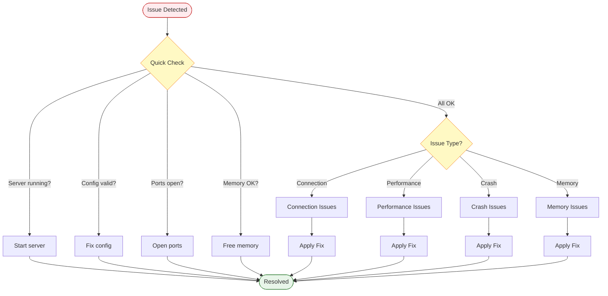
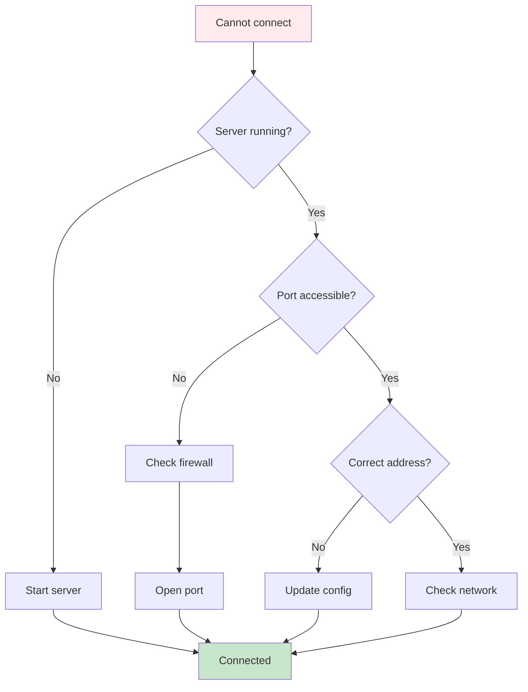
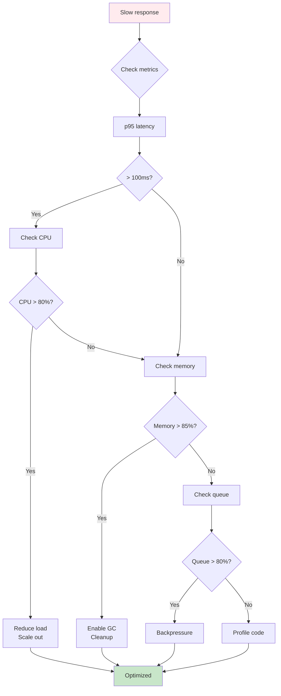
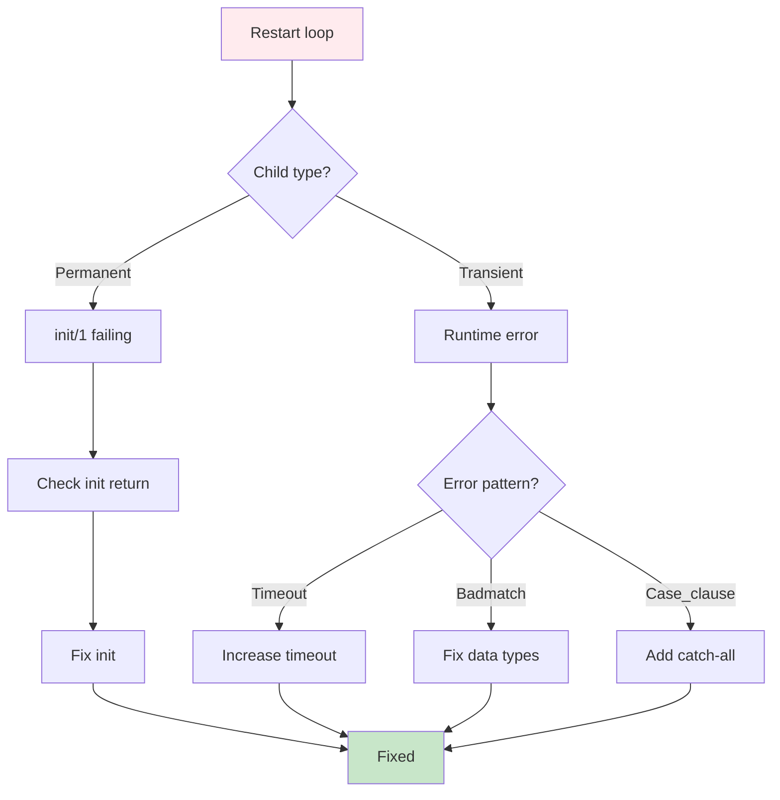
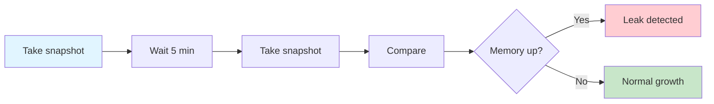

# Common Issues and Solutions

**Version**: 2.1.0
**Last Updated**: 2025-01-31

---

## Overview

This guide provides quick solutions to the most frequently encountered issues in erlmcp. Each issue includes symptoms, diagnosis steps, and resolution procedures.

---

## Quick Issue Resolution Flow



---

## Installation and Setup Issues

### Issue 1: Rebar3 Compilation Fails

**Symptoms**:
- Compilation errors during `rebar3 compile`
- Missing dependencies
- Version conflicts

**Diagnosis**:

```bash
# Check rebar3 version
rebar3 version

# Clean build
rebar3 clean --all

# Check dependencies
rebar3 tree
```

**Solution**:

```bash
# Update rebar3
# Download latest from http://rebar3.org

# Clean and rebuild
rebar3 clean --all
rebar3 compile

# Update dependencies
rebar3 upgrade
rebar3 compile
```

### Issue 2: Erlang Version Incompatible

**Symptoms**:
- OTP release not supported
- Function not defined errors
- Compilation warnings about version

**Diagnosis**:

```bash
# Check Erlang version
erl -version

# Check supported versions in rebar.config
grep otp_release rebar.config
```

**Solution**:

```bash
# Install correct Erlang/OTP version
# Using kerl (version manager):
kerl install 26.2.1 26.2.1
kerl use 26.2.1

# Or using asdf:
asdf install erlang 26.2.1
asdf local erlang 26.2.1
```

### Issue 3: Port Already in Use

**Symptoms**:
- `{error, eaddrinuse}`
- Cannot bind to port
- Address already in use

**Diagnosis**:

```bash
# Find process using port
lsof -i :5005

# Or using netstat
netstat -an | grep 5005

# Or using ss
ss -tlnp | grep 5005
```

**Solution**:

```bash
# Option 1: Kill existing process
kill -9 <PID>

# Option 2: Use different port
# Update config/sys.config:
{erlmcp_core, [
    {tcp_port, 5006}
]}.
```

---

## Connection Issues

### Issue 4: Cannot Connect to Server

**Symptoms**:
- Connection refused
- Timeout connecting
- Unable to establish connection

**Resolution Path**:



**Quick Fix**:

```bash
# 1. Check server
ps aux | grep beam

# 2. Start if needed
rebar3 shell

# 3. Check port
netstat -an | grep 5005

# 4. Test connection
telnet localhost 5005
```

### Issue 5: Connection Intermittent

**Symptoms**:
- Connection drops randomly
- Flaky connection
- Need to reconnect

**Solution**:

```erlang
% Enable TCP keepalive
{socket_opts, [
    {keepalive, true},
    {keepidle, 60},   % Start sending after 60s
    {keepintvl, 10},  % Send every 10s
    {keepcnt, 3}      % Retry 3 times
]}.

% Increase timeout
{connect_timeout, 30000}.

% Enable auto-reconnect
{auto_reconnect, true},
{max_retries, 5},
{retry_delay, 5000}.
```

---

## Performance Issues

### Issue 6: Slow Response Times

**Symptoms**:
- p95 latency > 100ms
- Requests take too long
- Throughput degraded

**Resolution Flow**:



**Quick Fix**:

```bash
# 1. Check metrics
curl http://localhost:9090/metrics | grep latency

# 2. Check CPU
top -p $(pgrep beam.smp)

# 3. Check memory
erlang:memory().

# 4. Profile
recon:proc_count(reductions, 10).
```

### Issue 7: High Memory Usage

**Symptoms**:
- Memory growing constantly
- Out of memory errors
- Garbage collection overhead

**Solution**:

```erlang
% Enable hibernation
{hibernate_after, 30000}.

% Increase cleanup
{cleanup_interval, 60000}.

% Enable memory guard
{memory_guard, [
    {enable, true},
    {threshold_mb, 4096}
]}.

% Check for leaks
recon:bin_leak(100).
ets:i().
```

### Issue 8: Process Queue Full

**Symptoms**:
- Message queue growing
- Process mailbox overflow
- Slow message processing

**Solution**:

```erlang
% Check queue
process_info(Pid, message_queue_len).

% Find problematic processes
recon:proc_count(message_queue_len, 10).

% Increase process pool
{pool_size, 50}.

% Enable backpressure
{backpressure, [
    {enabled, true},
    {threshold, 0.8}
]}.
```

---

## Crash and Stability Issues

### Issue 9: Server Crashes on Startup

**Symptoms**:
- Server exits immediately
- Crash dump on startup
- Cannot start

**Diagnosis**:

```bash
# Check crash logs
cat logs/erlmcp.log | grep -i crash

# Check crash dump
ls -l erl_crash.dump.*

# Check configuration
rebar3 shell --config config/dev.config
```

**Solution**:

```erlang
% Common causes:

% 1. Missing dependencies:
rebar3 compile

% 2. Invalid config:
% Validate sys.config syntax

% 3. Port conflict:
% Change port in config

% 4. Permission denied:
% Check file permissions
```

### Issue 10: Supervisor Restart Loop

**Symptoms**:
- Process restarts repeatedly
- Supervisor max intensity reached
- System unstable

**Resolution Flow**:



**Solution**:

```erlang
% Check child spec
supervisor:which_children(erlmcp_sup).

% Check restart count
recon:proc_count(reductions, 10).

% Temporarily change to transient
{restart_strategy, transient}.
```

### Issue 11: Runtime Exception

**Symptoms**:
- Uncaught exception
- Process crash during operation
- try_clause error

**Solution**:

```erlang
% Add try...catch
try
    risky_operation()
catch
    Type:Reason:Stacktrace ->
        logger:error("Error: ~p:~p~nStack: ~p",
                     [Type, Reason, Stacktrace]),
        {error, Reason}
end.

% Add better error handling
case operation() of
    {ok, Result} ->
        handle_success(Result);
    {error, Reason} ->
        handle_error(Reason)
end.
```

---

## Memory Issues

### Issue 12: Memory Leak

**Symptoms**:
- Memory usage increases over time
- Never released
- Eventually OOM

**Detection**:



**Solution**:

```erlang
% 1. Find leak source
Snapshot1 = erlang:memory().
timer:sleep(300000).
Snapshot2 = erlang:memory().

% 2. Check processes
recon:proc_count(memory, 10).

% 3. Check ETS tables
ets:i().

% 4. Check binaries
recon:bin_leak(100).

% 5. Fix with hibernation
{hibernate_after, 30000}.

% 6. Fix with cleanup
{cleanup_interval, 60000}.
```

### Issue 13: Binary Memory Not Released

**Symptoms**:
- Binary heap growing
- Refc binaries not freed
- Memory high despite GC

**Solution**:

```erlang
% Check binary references
recon:bin_leak(100).

% Force binary GC
erlang:garbage_collect().

% Clear binary references
clear_binary_references(State).

% Use binary:copy/1 carefully
% Avoid holding large binaries in process state
```

---

## Authentication and Authorization Issues

### Issue 14: Invalid Credentials

**Symptoms**:
- Error 1011-1013
- Login fails
- Token rejected

**Solution**:

```bash
# 1. Check credentials
# Verify username/password
# Check API key format

# 2. Get new token
curl -X POST http://localhost:8080/auth/token \
  -d "client_id=xxx&client_secret=xxx"

# 3. Use correct header
curl http://localhost:8080/tools/list \
  -H "Authorization: Bearer $TOKEN"
```

### Issue 15: Token Expired

**Symptoms**:
- Error 1013
- Previously working token fails
- Auth failure after some time

**Solution**:

```erlang
% Check token expiration
jwt:decode(Token).

% Refresh token
{ok, NewToken} = refresh_token(RefreshToken).

% Configure longer expiration
{jwt_expiration, 3600}.  % 1 hour

% Auto-refresh
{auto_refresh, true},
{refresh_before, 300}.  % Refresh 5 min before expiry
```

### Issue 16: Forbidden

**Symptoms**:
- Error 1014
- Authenticated but denied
- Permission error

**Solution**:

```erlang
% Check permissions
erlmcp_auth:check_permissions(UserId, Resource).

% Add permissions
erlmcp_auth:add_permission(UserId, Resource, read).

% Configure ACL
{acl_rules, [
    {allow, user, resource, read},
    {allow, admin, all, all}
]}.
```

---

## Rate Limiting Issues

### Issue 17: Rate Limit Exceeded

**Symptoms**:
- Error 1056-1060
- Requests rejected
- Too many requests error

**Solution**:

```bash
# 1. Check current rate
curl http://localhost:9090/metrics | grep rate

# 2. Implement backoff
# Wait and retry with exponential backoff

# 3. Request limit increase
# Update configuration if appropriate
```

```erlang
% Backoff implementation
retry_with_backoff(Fun) ->
    retry_with_backoff(Fun, 0, 1000).

retry_with_backoff(Fun, Attempt, Delay) when Attempt < 3 ->
    case Fun() of
        {error, rate_limit_exceeded} ->
            timer:sleep(Delay),
            retry_with_backoff(Fun, Attempt + 1, Delay * 2);
        Result ->
            Result
    end;
retry_with_backoff(_, _, _) ->
    {error, max_retries_exceeded}.
```

---

## Resource Issues

### Issue 18: Resource Not Found

**Symptoms**:
- Error 1040-1042
- Resource URI invalid
- Tool/prompt doesn't exist

**Solution**:

```erlang
% 1. List available resources
erlmcp_server:list_resources().

% 2. List available tools
erlmcp_server:list_tools().

% 3. List available prompts
erlmcp_server:list_prompts().

% 4. Use valid URI
% Correct: "file:///path/to/resource"
% Wrong: "file://path/to/resource"
```

### Issue 19: Subscription Limit Reached

**Symptoms**:
- Cannot subscribe to resource
- Subscription fails
- Error 1049

**Solution**:

```erlang
% 1. Check current subscriptions
erlmcp_resource_subscriptions:list(ServerId).

% 2. Unsubscribe old ones
erlmcp_resource_subscriptions:unsubscribe(
    ServerId,
    OldResourceUri
).

% 3. Increase limit
{max_subscriptions_per_server, 20000}.
```

---

## Message and Protocol Issues

### Issue 20: Invalid JSON

**Symptoms**:
- Error 1002
- JSON parse failed
- Malformed request

**Solution**:

```bash
# Validate JSON
echo '{}' | jq .

# Check encoding
file --mime-type request.json

# Validate with schema
# Use JSON schema validator
```

```erlang
% Validate before parsing
case jsx:is_json(JsonBinary) of
    true ->
        {ok, jsx:decode(JsonBinary)};
    false ->
        {error, invalid_json}
end.
```

### Issue 21: Message Too Large

**Symptoms**:
- Error 1068
- Request rejected
- Size limit exceeded

**Solution**:

```erlang
% 1. Compress data
Compressed = zlib:compress(Data).

% 2. Split into chunks
Chunks = split_into_chunks(Data, 102400).

% 3. Increase limit
{message_size_limits, [
    {max_request_size, 1048576},  % 1MB
    {max_response_size, 10485760}  % 10MB
]}.
```

---

## Transport-Specific Issues

### Issue 22: TCP Connection Refused

**Solution**: See [TRANSPORT_ISSUES.md](TRANSPORT_ISSUES.md)

### Issue 23: WebSocket Handshake Fails

**Solution**: See [TRANSPORT_ISSUES.md](TRANSPORT_ISSUES.md)

### Issue 24: SSL/TLS Certificate Error

**Solution**: See [TRANSPORT_ISSUES.md](TRANSPORT_ISSUES.md)

---

## Getting Help

If none of these solutions resolve your issue:

1. **Check logs**:
   ```bash
   tail -f logs/erlmcp.log
   ```

2. **Enable debug logging**:
   ```erlang
   logger:set_application_level(erlmcp_core, debug).
   ```

3. **Collect diagnostics**:
   ```bash
   ./scripts/collect-diagnostic-info.sh
   ```

4. **Create bug report** with:
   - erlmcp version
   - Erlang/OTP version
   - Full error message
   - Steps to reproduce
   - Configuration

5. **See additional guides**:
   - [README.md](README.md) - Complete troubleshooting guide
   - [ERROR_HANDLING.md](ERROR_HANDLING.md) - Error code reference
   - [DEBUGGING_GUIDE.md](DEBUGGING_GUIDE.md) - Debugging techniques
   - [TRANSPORT_ISSUES.md](TRANSPORT_ISSUES.md) - Transport troubleshooting

---

**Last Updated**: 2025-01-31
**Next Review**: 2025-03-31
