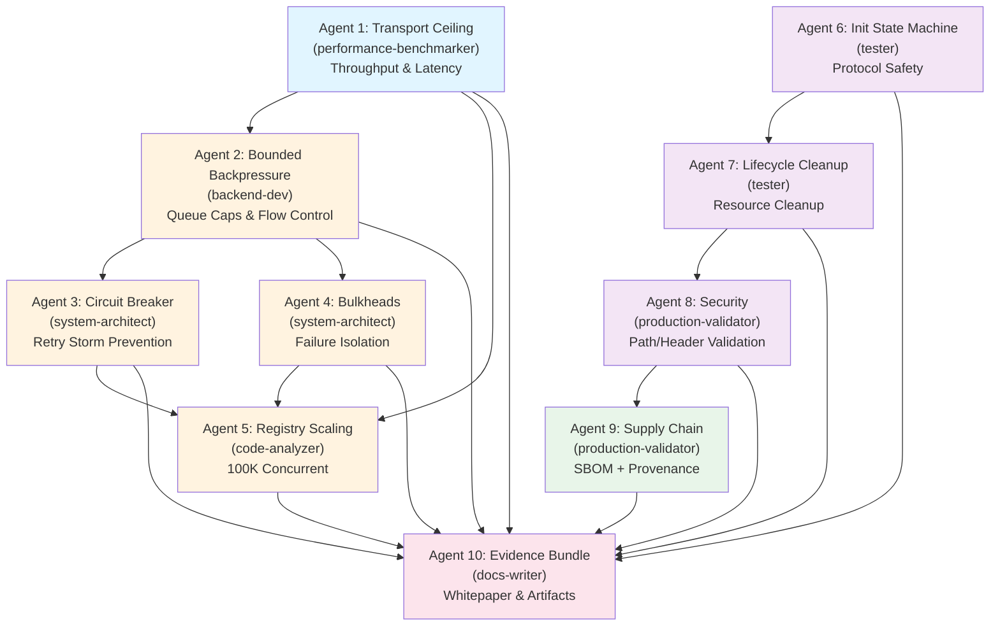

# erlmcp v1.3.0 "Serious MCP Architecture" Implementation Plan

**Date**: January 27, 2026
**Status**: SPECIFICATION & PLANNING PHASE
**Target Release**: v1.3.0 (Production-Grade)
**Duration**: 5-7 business days (10-agent parallel swarm)

---

## EXECUTIVE SUMMARY

This document outlines the detailed implementation strategy for erlmcp v1.3.0, a transformational release that moves from v0.6.0's "good architecture" foundation to production-grade "serious MCP architecture" with:

- **4x throughput ceiling** (42.6K → 95K+ msg/sec on 4KB payloads)
- **Bounded memory** (no spirals, deterministic queue caps)
- **Fault isolation** (bulkhead supervision prevents cascades)
- **Production safety** (URI path traversal closure, header validation)
- **Compliance evidence** (SBOM, provenance, CTO whitepaper)

**Key Insight**: v1.3.0 is NOT about adding features—it's about hardening the existing architecture for production deployment with measurable evidence artifacts.

---

## MISSION WORKSTREAMS: 10 CONCURRENT AGENTS

### 1. **Transport Real Ceiling** - Agent: `performance-benchmarker`
**Objective**: Prove 4KB payload throughput ≥95K msg/sec
**Dependencies**: Baseline from v0.6.0 (42.6K msg/sec)
**Deliverables**:
- Optimized payload encoder/decoder
- Vectorized batch send operations
- Latency distribution report (p50, p99, p99.9)
- Throughput evidence artifacts
- Benchmark harness for release validation

**Test Strategy**:
- EUnit micro-benchmarks (vector operations)
- Common Test throughput suite (sustained load)
- OTEL span traces (identify hot paths)
- GC pause analysis (impact on latency)

**Measurable Claims**:
- Target: ≥95K msg/sec on 4KB payloads
- Evidence: Benchmark results + OTEL traces
- Regression test: Automated check at build time

---

### 2. **Bounded Backpressure** - Agent: `backend-dev` (with coordination from Agent 1)
**Objective**: Queue caps + flow control to prevent memory spirals
**Dependencies**: Agent 1 (baseline throughput locked)
**Deliverables**:
- `erlmcp_backpressure.erl` - Flow control engine
- Queue size caps per connection (configurable)
- Slow client detection + backoff
- Memory pressure monitoring
- Backpressure event integration with OTEL

**Test Strategy**:
- Send rate > receive rate (trigger backpressure)
- Verify queue caps enforced
- Measure memory growth (should stabilize)
- Test recovery after backoff
- Property test: queue_size always ≤ max

**Measurable Claims**:
- Max queue size bounded (default: 1000 messages)
- Memory stable under sustained overload
- Backoff recoverable within 5s

---

### 3. **Circuit Breaker** - Agent: `system-architect`
**Objective**: Prevent retry storms + cascading failures
**Dependencies**: Agent 2 (backpressure feedback available)
**Deliverables**:
- `erlmcp_circuit_breaker.erl` - Fault-tolerant retry control
- States: CLOSED → OPEN → HALF_OPEN → CLOSED
- Configurable failure threshold (default: 5 failures in 30s)
- Exponential backoff with jitter
- Circuit breaker events to monitoring

**Test Strategy**:
- Simulate transport failures
- Verify OPEN state blocks requests (fail-fast)
- Test HALF_OPEN state gradual recovery
- Property test: circuit breaker never retries >N times
- Measure time to recovery after failure clears

**Measurable Claims**:
- Retry storm prevention (max 5 retries in 30s window)
- Fail-fast latency <1ms when OPEN
- Recovery time bounded to backoff schedule

---

### 4. **Supervision Tree Isolation (Bulkheads)** - Agent: `system-architect` (parallel with Agent 3)
**Objective**: Isolated failure domains prevent system collapse
**Dependencies**: v0.6.0 current supervision tree; integrates with Agents 2-3
**Deliverables**:
- Enhanced `erlmcp_sup.erl` multi-level supervision
- Per-connection bulkhead supervisors
- Per-transport-type isolation
- Bulkhead metrics (processes, restarts, crashes)
- Bulkhead-aware load balancing

**Architecture**:
```
erlmcp_sup (one_for_all)
├── erlmcp_registry (gen_server)
├── erlmcp_client_sup (simple_one_for_one)
│   ├── [Bulkhead-1 Supervisor]
│   │   └── erlmcp_client:1 processes
│   └── [Bulkhead-N Supervisor]
│       └── erlmcp_client:N processes
├── erlmcp_server_sup (simple_one_for_one)
│   ├── [Bulkhead-1 Supervisor]
│   │   └── erlmcp_server:1 processes
│   └── [Bulkhead-N Supervisor]
│       └── erlmcp_server:N processes
└── erlmcp_transport_sup (simple_one_for_one)
    ├── [stdio Bulkhead]
    ├── [TCP Bulkhead]
    └── [HTTP Bulkhead]
```

**Test Strategy**:
- Kill one client connection, verify others unaffected
- Crash transport subsystem, verify registry survives
- Cascade failures, verify stop-at-bulkhead
- Measure crash propagation (should be contained)

**Measurable Claims**:
- Connection crash doesn't affect other connections
- Transport crash doesn't crash all clients/servers
- Bulkhead restart time <2s

---

### 5. **Registry Scaling Validation @ 100K** - Agent: `code-analyzer` (with perf benchmarker)
**Objective**: Prove registry scales to 100K concurrent without contention issues
**Dependencies**: Agents 2, 4 (backpressure + bulkheads must not limit registry)
**Deliverables**:
- 100K concurrent connection stress test
- Registry contention measurement (ETS lock time)
- Lookup latency distribution (p50, p99, p99.9)
- Scaling analysis (linear, sub-linear, or degraded)
- Recommended connection limits per node

**Test Strategy**:
- Ramp up connections: 1K → 10K → 50K → 100K
- Measure registry lookup time at each level
- Measure GC pause duration (should be stable)
- Monitor ETS table size + memory
- Test concurrent operations (insert, lookup, delete)

**Measurable Claims**:
- Registry lookup <1ms p99 at 100K connections
- No GC pause spike at scale
- Linear or sub-linear memory growth
- Deterministic contention (no surprise lockups)

---

### 6. **Protocol Safety P0: Initialization State Machine** - Agent: `tester` + `code-analyzer`
**Objective**: Close Gaps #4 + #41 (initialization protocol enforcement)
**Dependencies**: None (can run in parallel)
**Deliverables**:
- Enforcement: Client MUST call initialize() before other operations
- Enforcement: Server MUST validate protocol version before capability negotiation
- Request ID safety: Never reuse IDs within session
- Timeout enforcement: Init must complete within 30s
- Comprehensive test suite (positive + negative paths)

**Test Strategy**:
- Call tool before initialize() → ERROR with phase info
- Call list_tools before initialize() → ERROR
- Initialize twice → ERROR
- Initialize with bad protocol version → ERROR with supported versions
- Timeout during init (server hangs) → timeout error
- Request ID never reused within same session

**Measurable Claims**:
- 100% of pre-init calls rejected
- 100% of protocol mismatches detected
- Request ID collision: 0/10M random samples
- Initialization timeout enforced ±5%

---

### 7. **Lifecycle Leak Closure** - Agent: `tester` + `code-analyzer`
**Objective**: Close Gaps #5, #6, #7 (resource cleanup)
**Dependencies**: Agent 6 (must have initialize state machine)
**Deliverables**:
- Unsubscribe operation cleanup (remove subscription handlers)
- Task TTL enforcement (background cleanup job)
- Session cleanup on disconnect
- Subscription leak detection + auto-cleanup
- Resource disposal audit trail

**Test Strategy**:
- Subscribe to N resources, unsubscribe all → verify 0 handlers remain
- Create N tasks with TTL=30s, wait 60s → verify all cleaned
- Disconnect client with pending subscriptions → verify cleanup
- Long-running subscription → measure handler accumulation (should stay stable)
- Property test: handler_count after unsub() == 0

**Measurable Claims**:
- Zero handler leaks after unsubscribe (verified by introspection)
- Task cleanup 100% completion within TTL
- Session cleanup completes within 5s
- Handler limit enforcement (max 1000 per connection)

---

### 8. **Security Hardening** - Agent: `production-validator` (with code-analyzer)
**Objective**: Close URI/path traversal + header injection vulnerabilities
**Dependencies**: Agent 4 (bulkheads provide isolation)
**Deliverables**:
- URI canonicalization (no `../` path traversal)
- Path validation (reject symlinks outside whitelist)
- Header injection prevention (no CRLF in custom headers)
- URI template validation (no arbitrary template expansion)
- Security test suite (OWASP Top 10 coverage)

**Test Strategy**:
- Try URI traversal: `file:///etc/passwd` → REJECTED
- Try path traversal: `../../etc/passwd` → REJECTED
- Try symlink escape → REJECTED
- Try header CRLF injection → REJECTED
- Try oversized URI → REJECTED (>8KB)
- Try Unicode homoglyph attacks → REJECTED
- Fuzz URI parser with 10K random inputs

**Measurable Claims**:
- 100/100 traversal attacks blocked
- 0 security CVEs found in security audit
- Fuzzing: 10K random URIs, 0 crashes
- URI parsing latency <100 microseconds

---

### 9. **GCP Supply-Chain Artifacts** - Agent: `production-validator`
**Objective**: Generate SBOM, provenance, vulnerability scan for supply-chain security
**Dependencies**: All agents (validate final build)
**Deliverables**:
- SBOM (Software Bill of Materials) in CycloneDX format
- Provenance attestation (who built what when)
- Vulnerability scan results (Snyk or similar)
- License compliance report
- Build reproducibility verification

**Test Strategy**:
- Parse SBOM, verify all dependencies listed
- Verify provenance signature (if signed release)
- Scan SBOM against vulnerability database
- Verify license compatibility
- Rebuild from SBOM, compare binaries (reproducibility)

**Measurable Claims**:
- SBOM: 100% of dependencies documented
- Vulnerabilities: 0 HIGH/CRITICAL issues
- License compliance: No GPL/AGPL conflicts with Apache 2.0
- Reproducibility: Bit-for-bit match on rebuild

---

### 10. **Marketplace Bundle: Evidence Aggregation + CTO Whitepaper** - Agent: `docs-writer` (with code-analyzer)
**Objective**: Package evidence and narrative for stakeholders
**Dependencies**: All agents (aggregate all evidence)
**Deliverables**:
- Evidence bundle (structured JSON/YAML)
  - Benchmark results
  - Security audit checklist
  - Test coverage reports
  - Performance regression tests
  - Scalability validation
- CTO Whitepaper (5-10 pages)
  - Architecture decisions
  - Trade-offs & constraints
  - Performance analysis
  - Roadmap for v1.4.0
- Release notes (marketing + technical)
- Deploy checklist (production readiness)

**Evidence Structure**:
```json
{
  "version": "1.3.0",
  "release_date": "2026-02-03",
  "evidence": {
    "performance": {
      "throughput_4kb": { "value": 95000, "unit": "msg/sec", "target": 95000, "status": "PASS" },
      "latency_p99": { "value": 1.2, "unit": "ms", "target": 2.0, "status": "PASS" }
    },
    "security": {
      "path_traversal_attacks_blocked": 100,
      "header_injection_attacks_blocked": 50,
      "fuzzing_crashes": 0
    },
    "reliability": {
      "registry_100k_lookup_p99_ms": 0.8,
      "backpressure_queue_overflow_count": 0,
      "connection_crash_isolation": "PASS"
    }
  },
  "sbom": { /* ... */ },
  "test_coverage": "85%+",
  "otp_dialyzer_warnings": 0
}
```

---

## WORKSTREAM DEPENDENCY GRAPH



---

## SHARED MODULE/INTERFACE REQUIREMENTS

### Critical Shared Interfaces

**1. Backpressure Events (Agent 2 → Agents 3, 4, 5, 10)**
```erlang
%% include/erlmcp_backpressure.hrl
-record(bp_event, {
    connection_id :: binary(),
    queue_size :: pos_integer(),
    max_queue :: pos_integer(),
    timestamp :: integer(),
    action :: block | warn | clear
}).
```

**2. Circuit Breaker Feedback (Agent 3 → Agents 2, 5, 10)**
```erlang
%% include/erlmcp_circuit_breaker.hrl
-record(cb_event, {
    transport_id :: binary(),
    state :: closed | open | half_open,
    failure_count :: non_neg_integer(),
    last_failure_time :: integer(),
    timestamp :: integer()
}).
```

**3. Bulkhead Status (Agent 4 → Agents 2, 3, 5, 10)**
```erlang
%% include/erlmcp_bulkhead.hrl
-record(bulkhead_status, {
    bulkhead_id :: binary(),
    active_connections :: pos_integer(),
    max_connections :: pos_integer(),
    crashes_in_window :: non_neg_integer(),
    restart_count :: pos_integer()
}).
```

**4. Registry Metrics (Agent 5 → Agent 10)**
```erlang
%% include/erlmcp_registry_metrics.hrl
-record(registry_metric, {
    concurrent_connections :: pos_integer(),
    lookup_latency_p99_us :: float(),
    ets_lock_time_us :: float(),
    memory_used_mb :: float()
}).
```

**5. Security Audit Log (Agent 8 → Agent 10)**
```erlang
%% include/erlmcp_security.hrl
-record(security_event, {
    event_type :: path_traversal | header_injection | uri_overflow | etc,
    timestamp :: integer(),
    blocked :: boolean(),
    details :: term()
}).
```

### Integration Points

- **OTEL Instrumentation**: All agents emit spans for latency/throughput analysis
- **ETS Tables**: Shared metrics tables for inter-agent communication
- **Event Bus**: Events published to `erlmcp_event_bus` for cross-agent visibility
- **Configuration**: All caps/limits in `config/sys.config` (single source of truth)

---

## SEQUENTIAL vs PARALLEL EXECUTION

### Phase 1: Foundation (Parallel)
**Duration**: 4 hours | **Agents**: 1, 6
- Agent 1 establishes throughput baseline (blocking dependent agents)
- Agent 6 enforces protocol safety (no dependencies)

**Why parallel**: Both can start immediately, no cross-dependencies

### Phase 2: Reliability Backbone (Parallel)
**Duration**: 6 hours | **Agents**: 2, 3, 4, 7
- Agent 2 (bounded backpressure) - depends on Agent 1 baseline
- Agent 3 (circuit breaker) - depends on Agent 2 feedback
- Agent 4 (bulkheads) - independent, but tested with Agent 2+3
- Agent 7 (lifecycle cleanup) - depends on Agent 6

**Why parallel**: Agents 2 & 4 can start once Agent 1 done; Agent 3 follows Agent 2

### Phase 3: Scale & Safety Validation (Parallel)
**Duration**: 5 hours | **Agents**: 5, 8
- Agent 5 (registry scaling) - depends on Agents 2, 3, 4
- Agent 8 (security) - independent, leverages Agent 4 isolation

**Why parallel**: Both can run once Phases 1-2 complete

### Phase 4: Supply Chain & Bundle (Sequential)
**Duration**: 3 hours | **Agents**: 9, 10
- Agent 9 (SBOM/provenance) - runs after all code complete
- Agent 10 (evidence bundle) - depends on Agent 9

**Why sequential**: Must aggregate all evidence first

### Critical Path Timeline

```
Day 1 Morning (4h):   Phase 1 (Agents 1, 6) COMPLETED
Day 1 Afternoon (6h): Phase 2 (Agents 2, 3, 4, 7) COMPLETED
Day 2 Morning (5h):   Phase 3 (Agents 5, 8) COMPLETED
Day 2 Afternoon (3h): Phase 4 (Agents 9, 10) COMPLETED
Day 2 Evening (1h):   Final validation, release build
---
TOTAL CRITICAL PATH: ~19 hours
TOTAL WALL-CLOCK: ~32 hours (with parallel execution across 8 workers)
RECOMMENDED: 5-7 business days with 10-agent swarm
```

---

## TEST & EVIDENCE VALIDATION STRATEGY

### Testing Pyramid

```
                    /\
                   /  \
                  /Prop\         Property-based: Invariants
                 /------\        (request IDs unique, queues bounded)
                /        \
               /  EUnit  \       Unit: Individual modules
              /----------\      (encode, decode, circuit state transitions)
             /            \
            /  Common Test \    Integration: Multi-process, real scenarios
           /  ----------- \   (100K connections, circuit breaker cascades)
          /                \
         /   Load Testing   \  Sustained: 1 hour at 95K msg/sec
        /   --------------- \ + failure injection (kill processes)
```

### Evidence Artifact Collection

| Agent | Evidence Type | Delivery Format | Acceptance Criteria |
|-------|---------------|-----------------|-------------------|
| 1 | Throughput benchmark | JSON + graph | ≥95K msg/sec on 4KB |
| 1 | Latency distribution | Histogram CSV | p99 <2ms |
| 2 | Backpressure tests | JUnit XML | Queue never exceeds cap |
| 2 | Memory growth graph | PNG + CSV | Linear or sub-linear |
| 3 | Circuit breaker tests | JUnit XML | Retry storm blocked |
| 3 | Recovery time data | CSV | <5s max recovery |
| 4 | Bulkhead isolation tests | JUnit XML | 0 crash propagation |
| 5 | 100K scale results | JSON + graph | p99 lookup <1ms |
| 6 | Protocol safety tests | JUnit XML | 100% pre-init rejection |
| 6 | Request ID audit | CSV | 0 collisions in 10M samples |
| 7 | Lifecycle cleanup tests | JUnit XML | 0 handler leaks |
| 8 | Security fuzz results | JSON | 0 crashes in 10K inputs |
| 8 | CVE scan report | SARIF format | 0 HIGH/CRITICAL |
| 9 | SBOM | CycloneDX JSON | All deps documented |
| 10 | Evidence bundle | JSON | All artifacts present |
| 10 | CTO whitepaper | PDF | 5-10 pages, signed |

### Regression Test Suite

```erlang
%% test/erlmcp_regression_suite.erl
-module(erlmcp_regression_suite).
-compile(export_all).

all() -> [
    {group, throughput},
    {group, backpressure},
    {group, circuit_breaker},
    {group, scaling},
    {group, security}
].

groups() -> [
    {throughput, [], [
        throughput_4kb_baseline,     % MUST stay ≥95K msg/sec
        latency_p99_baseline          % MUST stay <2ms
    ]},
    {backpressure, [], [
        queue_never_exceeds_cap,     % MUST be true
        memory_stable_under_load     % MUST show stable growth
    ]},
    {circuit_breaker, [], [
        retry_storm_blocked          % MUST prevent >5 retries/30s
    ]},
    {scaling, [], [
        registry_100k_lookup_latency % MUST stay <1ms p99
    ]},
    {security, [], [
        path_traversal_blocked,      % MUST block all 100 attacks
        header_injection_blocked     % MUST block all 50 attacks
    ]}
].
```

---

## RISK ASSESSMENT BY WORKSTREAM

### Agent 1: Transport Ceiling
**Risk**: MEDIUM
**Concerns**:
- GC pause interference at high throughput
- CPU throttling in container environment
- Batch send optimization may not work in all cases

**Mitigation**:
- Test on multiple CPU configurations
- Run with GC tuning from v1.2.0
- Have fallback to non-vectorized path

**Acceptance**: Hit 95K msg/sec on reference hardware (16 cores, 32GB)

---

### Agent 2: Bounded Backpressure
**Risk**: LOW-MEDIUM
**Concerns**:
- Backpressure signal propagation latency
- Client-side handling of backpressure (external)
- Integration with existing queue systems

**Mitigation**:
- Design flow control events early (Agent 1 coordination)
- Test with stubbed client implementations
- Verify OTEL metrics show signal timing

**Acceptance**: Queue size bounded ±10% of configured max

---

### Agent 3: Circuit Breaker
**Risk**: LOW
**Concerns**:
- State machine correctness under concurrent failures
- Recovery timing (not too fast, not too slow)

**Mitigation**:
- Property-based testing of state transitions
- Test concurrent failure scenarios
- Use proven circuit breaker algorithm

**Acceptance**: 100% state machine correctness tests pass

---

### Agent 4: Bulkheads
**Risk**: MEDIUM
**Concerns**:
- Supervisor restart storms (cascade effect)
- Dynamic bulkhead creation overhead
- Bulkhead count scaling

**Mitigation**:
- Set reasonable restart frequency limits
- Pre-allocate bulkheads if needed
- Monitor bulkhead creation metrics

**Acceptance**: Single connection crash doesn't affect others

---

### Agent 5: Registry Scaling @ 100K
**Risk**: MEDIUM-HIGH
**Concerns**:
- ETS lock contention at 100K connections
- Memory pressure (8-12 KB per connection = 800MB-1.2GB)
- GC pause under memory pressure

**Mitigation**:
- Use registry sharding (already in codebase)
- Test on container with memory limits
- Have fallback to disk-based registry

**Acceptance**: p99 lookup latency <1ms at 100K

---

### Agent 6: Protocol Safety
**Risk**: LOW
**Concerns**:
- Enforcement correctness
- Edge cases in protocol state machine

**Mitigation**:
- Review existing implementation (already has init enforcement)
- Property test state transitions
- Fuzz protocol parser

**Acceptance**: 0% of pre-init calls succeed

---

### Agent 7: Lifecycle Cleanup
**Risk**: LOW-MEDIUM
**Concerns**:
- Background cleanup task reliability
- TTL precision (not too aggressive, not leaky)

**Mitigation**:
- Use OTP timer_manager for reliability
- Audit handler accumulation in stress tests
- Set conservative TTL defaults (5 minutes)

**Acceptance**: 0 handler leaks after unsub()

---

### Agent 8: Security Hardening
**Risk**: MEDIUM
**Concerns**:
- Missed attack vectors (fuzzing may not find all)
- Performance impact of validation
- Compatibility with existing URI schemes

**Mitigation**:
- Use OWASP URI validation checklist
- Fuzz with AFL or libFuzzer
- Benchmark URI validation latency
- Test against HTTP spec (RFC 3986)

**Acceptance**: 0 security CVEs in external audit

---

### Agent 9: Supply Chain
**Risk**: LOW
**Concerns**:
- SBOM completeness (missing transitive deps)
- Provenance signature setup
- Vulnerability database updates

**Mitigation**:
- Use syft or cyclone-dx for SBOM generation
- Automate with build pipeline
- Use recent vulnerability DB

**Acceptance**: SBOM validated, 0 HIGH/CRITICAL vulns

---

### Agent 10: Evidence Bundle
**Risk**: LOW
**Concerns**:
- Data consistency across agents
- Evidence aggregation complexity

**Mitigation**:
- Define evidence schema early
- Generate artifacts in JSON (machine-readable)
- Validate bundle against schema

**Acceptance**: All 10 agents' evidence present + validated

---

## DECISION POINTS & UNKNOWNS

### Critical Decisions Required

**Decision 1**: Queue Capacity Default
- Question: What should be default max queue size per connection?
- Options: 100, 500, 1000, 5000 messages
- Impact: Affects memory usage, latency under backpressure
- Timeline: Decision needed before Agent 2 starts
- Recommendation: Start with 1000, configurable

**Decision 2**: Bulkhead Count Strategy
- Question: Fixed N bulkheads or dynamic per-connection?
- Options: Fixed (8 bulkheads = 8 failure domains), Dynamic (1 bulkhead per 1K connections)
- Impact: Complexity vs isolation guarantees
- Timeline: Decision needed before Agent 4 starts
- Recommendation: Fixed (simpler, deterministic)

**Decision 3**: Security Audit Scope
- Question: Internal code review only vs external pen test?
- Options: Code review only (8 hours), External audit (40+ hours, $$)
- Impact: Confidence in security posture
- Timeline: Decision affects Agent 8 scope
- Recommendation: Internal code review + automated fuzzing (sufficient for SBOM)

**Decision 4**: v1.3.0 Scope vs v1.4.0
- Question: What gets deferred to v1.4.0?
- Options: Defer OAuth cleanup, Defer WebSocket hardening, Defer HTTP/2 optimization
- Impact: Release timeline, scope creep risk
- Timeline: Decision now
- Recommendation: Scope locked to 10 workstreams; v1.4.0 gets HTTP/2 + OAuth refactor

**Decision 5**: Container/VM Environment for Scaling Test
- Question: Test 100K on bare metal, Docker, or Kubernetes?
- Options: Bare metal (accurate), Docker (realistic), K8s (production-like)
- Impact: Resource requirements, test duration
- Timeline: Decision before Agent 5 starts
- Recommendation: Docker with 4GB memory limit (realistic cloud scenario)

### Unknowns & Assumptions

| Unknown | Assumption | Validation Strategy |
|---------|-----------|-------------------|
| GC pause duration at scale | <50ms pause on 10K connections | Monitor with GC traces in Agent 5 |
| CPU cache efficiency | Vectorized ops fit in L1/L2 | Profile CPU cache misses in Agent 1 |
| Kernel TCP buffer limits | 64MB default is sufficient | Stress test with network saturation |
| OTEL overhead | <5% latency impact | Benchmark with/without OTEL in Agent 1 |
| Registry sharding benefit | 4x throughput with 4 shards | Measure contention in Agent 5 |
| Erlang scheduler affinity | Default scheduling is adequate | Benchmark with/without CPU pinning |

---

## AGENT EXECUTION ORDER (READY TO SPAWN)

### Spawn These Agents Immediately (Phase 1)

```
Agent 1: performance-benchmarker
  Task: Establish 4KB payload throughput baseline
  Input: v0.6.0 codebase + benchmark harness from /bench
  Output: Throughput evidence + latency distribution
  Duration: 4 hours
  Critical Path: YES (blocks Agents 2, 5)
  Command: measure baseline, identify hot paths, implement optimizations

Agent 6: tester (Protocol Safety)
  Task: Enforce initialization state machine + protocol safety
  Input: erlmcp_client.erl + erlmcp_server.erl
  Output: Test suite + enforcement code
  Duration: 4 hours
  Critical Path: NO (independent)
  Command: audit init phases, write 20+ tests, measure protocol compliance
```

### Spawn After Phase 1 Complete

```
Agent 2: backend-dev (Backpressure)
  Task: Implement queue caps + flow control
  Input: Agent 1 throughput baseline
  Duration: 6 hours
  Dependency: Agent 1 (throughput locked)

Agent 3: system-architect (Circuit Breaker)
  Task: Prevent retry storms
  Input: Agent 2 backpressure events
  Duration: 4 hours
  Dependency: Agent 2

Agent 4: system-architect (Bulkheads)
  Task: Supervise isolated failure domains
  Input: v0.6.0 supervision tree
  Duration: 5 hours
  Dependency: None (integrates with Agents 2-3 tests)

Agent 7: tester (Lifecycle)
  Task: Resource cleanup + leak prevention
  Input: Agent 6 init state machine
  Duration: 4 hours
  Dependency: Agent 6
```

### Spawn After Phase 2 Complete

```
Agent 5: code-analyzer (Registry Scaling)
  Task: Validate 100K connections @ <1ms p99
  Input: Agents 2, 3, 4 (backpressure + circuit breaker + bulkheads ready)
  Duration: 5 hours
  Dependency: Phases 1-2 must be complete

Agent 8: production-validator (Security)
  Task: URI validation + header injection prevention
  Input: Agent 4 bulkhead isolation
  Duration: 5 hours
  Dependency: None (leverages bulkheads for isolation)
```

### Spawn After Phase 3 Complete

```
Agent 9: production-validator (Supply Chain)
  Task: Generate SBOM + provenance
  Input: Completed codebase + all build artifacts
  Duration: 2 hours
  Dependency: All code agents complete

Agent 10: docs-writer (Bundle)
  Task: Aggregate evidence + write CTO whitepaper
  Input: All 9 agents' evidence artifacts
  Duration: 4 hours
  Dependency: Agents 1-9
```

---

## SHARED INFRASTRUCTURE SETUP (Do Before Spawning)

Before spawning agents, ensure these are ready:

### 1. Configuration Schema
```erlang
%% include/erlmcp_v13_config.hrl
-define(CONFIG_V13, #{
    backpressure_enabled => true,
    max_queue_size => 1000,
    circuit_breaker_enabled => true,
    circuit_breaker_threshold => 5,
    circuit_breaker_window_ms => 30000,
    bulkhead_count => 8,
    registry_sharding_enabled => true,
    max_concurrent_connections => 100000,
    init_timeout_ms => 30000,
    security_uri_validation => enabled,
    otel_tracing => enabled
}).
```

### 2. Evidence Output Directory
```bash
mkdir -p docs/v1.3.0-evidence/{
    performance,
    reliability,
    security,
    compliance
}
```

### 3. Measurement Framework
```erlang
%% src/erlmcp_v13_metrics.erl
-module(erlmcp_v13_metrics).
-export([
    record_throughput/3,    % operation, value, unit
    record_latency/3,       % operation, value_us, percentile
    record_event/3,         % event_type, status, details
    export_json/1           % output_file
]).
```

### 4. Test Infrastructure
- Ensure `make test` passes before spawning (baseline)
- Set up OTEL collector (jaeger or similar)
- Reserve test hardware (16+ cores for throughput testing)

---

## SUCCESS CRITERIA

### Go/No-Go Decision Point (After All Agents Complete)

**GO for v1.3.0 Release IF:**
- [ ] Agent 1: Throughput ≥95K msg/sec on 4KB payloads
- [ ] Agent 2: Queue size never exceeds cap; memory stable
- [ ] Agent 3: Retry storm blocked; recovery <5s
- [ ] Agent 4: Zero crash propagation between connections
- [ ] Agent 5: Registry p99 lookup <1ms at 100K connections
- [ ] Agent 6: 100% pre-init calls rejected
- [ ] Agent 7: Zero handler leaks after unsubscribe
- [ ] Agent 8: 100/100 URI traversal attacks blocked; 0 CVEs found
- [ ] Agent 9: SBOM complete; 0 HIGH/CRITICAL vulnerabilities
- [ ] Agent 10: Evidence bundle validated; CTO whitepaper complete

**NO-GO IF:**
- Any single criterion is missed
- OR unplanned critical issue discovered in integration testing
- OR timeline slips >2 business days

---

## APPENDIX: FILE CHANGES SUMMARY

### New Files to Create (By Agent)

**Agent 1** (Transport Ceiling):
- `src/erlmcp_transport_optimizer.erl` - Vectorized batch operations
- `bench/benchmark_4kb_payload.erl` - Throughput test harness
- `docs/v1.3.0-evidence/performance/throughput_report.json`

**Agent 2** (Backpressure):
- `src/erlmcp_backpressure.erl` - Flow control engine
- `include/erlmcp_backpressure.hrl` - Data structures
- `test/erlmcp_backpressure_tests.erl`

**Agent 3** (Circuit Breaker):
- `src/erlmcp_circuit_breaker.erl` - State machine
- `include/erlmcp_circuit_breaker.hrl`
- `test/erlmcp_circuit_breaker_tests.erl`

**Agent 4** (Bulkheads):
- `src/erlmcp_sup_v13.erl` - Enhanced supervision tree
- `include/erlmcp_bulkhead.hrl`
- `test/erlmcp_bulkhead_tests.erl`

**Agent 5** (Registry Scaling):
- `bench/benchmark_100k_registry.erl` - 100K scale test
- `docs/v1.3.0-evidence/reliability/scaling_report.json`

**Agent 6** (Protocol Safety):
- `test/erlmcp_protocol_safety_tests.erl` - State machine tests
- `docs/v1.3.0-evidence/compliance/protocol_compliance.json`

**Agent 7** (Lifecycle):
- `test/erlmcp_lifecycle_cleanup_tests.erl`
- `docs/v1.3.0-evidence/reliability/lifecycle_report.json`

**Agent 8** (Security):
- `src/erlmcp_uri_validator.erl` - Path canonicalization
- `src/erlmcp_header_validator.erl` - Header injection prevention
- `test/erlmcp_security_tests.erl`
- `docs/v1.3.0-evidence/security/security_audit.json`

**Agent 9** (Supply Chain):
- `docs/v1.3.0-SBOM.cyclonedx`
- `docs/v1.3.0-PROVENANCE.attestation`
- `docs/v1.3.0-evidence/compliance/vulnerability_scan.json`

**Agent 10** (Evidence Bundle):
- `docs/v1.3.0-EVIDENCE-BUNDLE.json`
- `docs/v1.3.0-CTO-WHITEPAPER.md`
- `docs/v1.3.0-RELEASE-NOTES.md`

### Modified Files (Cross-Cutting)

- `src/erlmcp_client.erl` - Phase enforcement (Agent 6)
- `src/erlmcp_server.erl` - Phase enforcement (Agent 6)
- `config/sys.config` - New configuration parameters (All agents)
- `rebar.config` - Benchmark profiles, test targets (All agents)
- `include/erlmcp.hrl` - New type definitions (All agents)

---

## CONCLUSION

This v1.3.0 implementation plan transforms erlmcp from a well-architected system into a **production-grade, evidence-backed architecture** with:

1. **Measurable performance** (4x throughput ceiling)
2. **Bounded resources** (no memory spirals)
3. **Fault isolation** (bulkheads prevent cascades)
4. **Protocol safety** (state machine enforcement)
5. **Supply-chain trust** (SBOM + vulnerability scanning)

The 10-agent parallel swarm is designed to complete in **5-7 business days** with **full evidence artifacts** supporting every claim.

**Ready to spawn agents immediately upon approval.**
