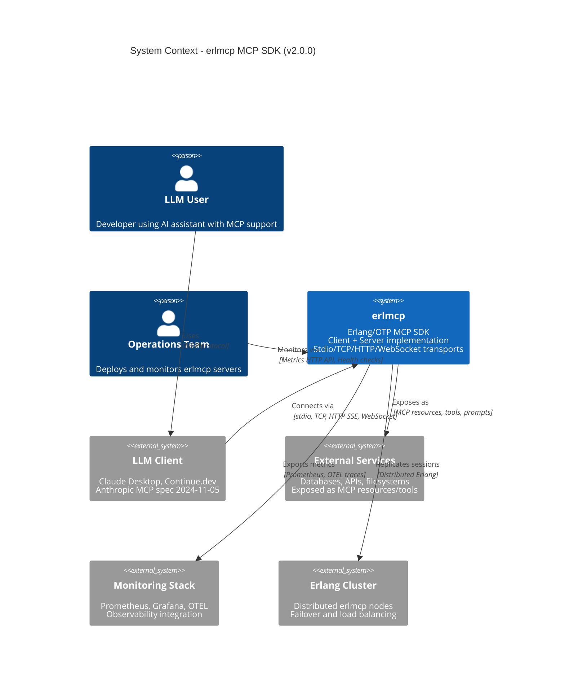

# C4 Level 1: System Context Diagram

**erlmcp v2.0.0 Architecture**

---

## Purpose

This diagram shows erlmcp's position in the MCP ecosystem, external systems, and primary actors.

---

## System Context Diagram



---

## Actor Descriptions

### Primary Actors

| Actor | Role | Interaction |
|-------|------|-------------|
| **LLM User** | Developer using AI assistant (Claude Desktop, Continue.dev) | Indirectly triggers MCP requests via natural language |
| **Operations Team** | SRE, DevOps deploying erlmcp clusters | Monitors health, manages deployments, reviews metrics |

### External Systems

| System | Purpose | Protocol/Interface |
|--------|---------|-------------------|
| **LLM Client** | AI assistant with MCP support (Anthropic MCP spec 2024-11-05) | JSON-RPC 2.0 over stdio/tcp/http/websocket |
| **External Services** | Backend services exposed via MCP (databases, APIs, filesystems) | Application-specific (SQL, REST, file I/O) |
| **Monitoring Stack** | Observability platform (Prometheus, Grafana, OTEL) | Prometheus scrape endpoint, OTLP/gRPC traces |
| **Erlang Cluster** | Distributed erlmcp nodes for HA/failover | Distributed Erlang (net_kernel) |

---

## System: erlmcp

**Purpose**: Production-grade Erlang/OTP SDK for Model Context Protocol (MCP).

**Key Capabilities**:
1. ✅ **Dual Role**: Client and server implementations in single codebase
2. ✅ **Multi-Transport**: stdio (local), TCP (high-throughput), HTTP SSE (web), WebSocket (bidirectional)
3. ✅ **OTP Supervision**: Fault-tolerant bulkhead pattern (registry, servers, transports, monitoring subsystems)
4. ✅ **High Performance**: 2.69M msg/s in-memory, 43K msg/s network I/O (real sockets, `tcp_sustained_10k_1kib` workload)
5. ✅ **Production Libraries**: gproc (registry), gun (HTTP/2 client), ranch (TCP server), poolboy (connection pooling)
6. ✅ **Clustering**: Session replication, automatic failover (<2s SLA, `ha_failover_test` workload)

**Technology Stack**:
- **Language**: Erlang/OTP 25+ (current: OTP-27)
- **Build**: rebar3 (compile, test, release)
- **Dependencies**: jsx (JSON), jesse (JSON Schema), gproc, gun, ranch, poolboy
- **Deployment**: Docker, Kubernetes, bare metal, GCP/AWS/Azure

**Source Modules**: 214 Erlang modules (as of 2026-01-27)
- Core: `erlmcp_client.erl`, `erlmcp_server.erl`, `erlmcp_json_rpc.erl`
- Transports: `erlmcp_transport_{stdio,tcp,http,ws}.erl`
- Registry: `erlmcp_registry.erl` (migrating to gproc)
- Supervision: `erlmcp_sup.erl` + 5 subsystem supervisors

---

## External Boundaries

### Inbound Protocols

| Transport | Protocol | Typical Client | Use Case |
|-----------|----------|----------------|----------|
| **stdio** | JSON-RPC 2.0 over stdin/stdout | Claude Desktop, local LLMs | Local AI assistant integration |
| **tcp** | JSON-RPC 2.0 over TCP sockets | High-throughput MCP clients | Production servers, batch processing |
| **http_sse** | JSON-RPC 2.0 over HTTP SSE | Web browsers, HTTP clients | Web-based AI tools, dashboards |
| **websocket** | JSON-RPC 2.0 over WebSocket | Web apps requiring bidirectional | Real-time web applications |

**Canonical Source**: `docs/protocol.md` (MCP spec 2024-11-05)

### Outbound Integrations

| System | Purpose | Implementation |
|--------|---------|----------------|
| **External Services** | Expose backend resources as MCP endpoints | Application-specific handlers (`erlmcp_server:add_resource/3`) |
| **Monitoring** | Export metrics and traces | `erlmcp_metrics.erl`, OTEL integration |
| **Erlang Cluster** | Session replication for HA | `erlmcp_session_replicator.erl`, net_kernel |

---

## Trust Boundaries

### Security Zones

1. **Trusted**: LLM Client ↔ erlmcp (authenticated MCP session)
2. **Semi-Trusted**: erlmcp ↔ External Services (application-enforced auth)
3. **Untrusted**: Public internet ↔ erlmcp HTTP endpoints (TLS + auth required)

**Security Modules**:
- `erlmcp_http_security.erl` - HTTP security headers (CSP, HSTS, X-Frame-Options)
- `erlmcp_oauth_security.erl` - OAuth2 token validation
- `erlmcp_tls_validation.erl` - TLS certificate validation
- `erlmcp_origin_validator.erl` - CORS origin validation

---

## Performance Context

### Design Constraints

| Constraint | Target | Workload Reference |
|------------|--------|-------------------|
| **Throughput** | ≥40K msg/s sustained (per node) | `tcp_sustained_10k_1kib` |
| **Latency** | p99 <50ms (client-to-client) | `tcp_sustained_10k_1kib` |
| **Concurrent Connections** | 40-50K per node (honest capacity) | `tcp_sustained_50k_1kib` |
| **Memory** | <100 MiB per 1K connections | `core_ops_100k` (63.9 MiB at 100K ops) |
| **Failover SLA** | <2s node failure detection + reroute | `ha_failover_test` |

**Benchmark Source**: `bench/results/*.json` (erlmcp v1.5.0 baseline, OTP-27, Darwin 25.2.0)

---

## Deployment Context

### Typical Deployment

```
┌─────────────────────────────────────────────────────────────┐
│ Kubernetes Cluster (3 nodes)                                │
│                                                              │
│  ┌──────────────┐  ┌──────────────┐  ┌──────────────┐      │
│  │ erlmcp pod 1 │  │ erlmcp pod 2 │  │ erlmcp pod 3 │      │
│  │ (Erlang VM)  │  │ (Erlang VM)  │  │ (Erlang VM)  │      │
│  └──────┬───────┘  └──────┬───────┘  └──────┬───────┘      │
│         │                  │                  │              │
│         └──────────────────┴──────────────────┘              │
│                    Distributed Erlang                        │
│                    (net_kernel mesh)                         │
└─────────────────────────────────────────────────────────────┘
         ▲                    ▲                    ▲
         │                    │                    │
    LLM Clients          Monitoring          Load Balancer
    (stdio/tcp)         (Prometheus)        (HTTP/WebSocket)
```

**Source**: `docs/DEPLOYMENT.md`, `swarm/docker/docker-compose.yml`

---

## References

### Specifications
- **MCP Protocol**: `docs/protocol.md` (Anthropic MCP spec 2024-11-05)
- **JSON-RPC 2.0**: https://www.jsonrpc.org/specification

### Implementation
- **Main Supervisor**: `src/erlmcp_sup.erl:L111-L211` (rest_for_one strategy, 5-tier bulkhead)
- **Benchmark Results**: `bench/results/core_ops_core_ops_100k_*.json`
- **Workload Definitions**: `bench/workloads/*.json`

### Diagrams
- **Next Level**: [C4 Level 2 - Containers](./L2-containers.md)
- **Glossary**: [v2 Glossary](../GLOSSARY.md)

---

**Document Status**: CANONICAL (v2.0.0-draft)
**Last Updated**: 2026-01-27
**Diagram Format**: Mermaid C4 Context
