# C4 Level 2: Container Diagram

**erlmcp v2.0.0 Architecture - Process Structure**

---

## Purpose

This diagram shows the internal structure of erlmcp: OTP supervision tree, process subsystems, and inter-process communication.

**Note**: In Erlang/OTP context, "containers" map to supervised processes and subsystems, not Docker containers.

---

## Container Diagram

```mermaid
C4Container
    title Container Diagram - erlmcp Supervision Tree (v2.0.0)

    Person(llm_client, "LLM Client", "Claude Desktop, MCP client")
    System_Ext(external, "External Services", "Databases, APIs")
    System_Ext(monitoring, "Monitoring", "Prometheus, Grafana")

    Container_Boundary(erlmcp_vm, "erlmcp Erlang VM") {

        Container_Boundary(registry_subsystem, "Registry Subsystem (Tier 1)") {
            Container(registry, "Registry", "gen_server (gproc)", "Routes messages between servers/transports<br/>553K msg/s (core_ops_100k)")
            ContainerDb(registry_ets, "Registry ETS", "ETS table", "Process lookups, O(1) access")
        }

        Container_Boundary(infrastructure, "Infrastructure Subsystem (Tier 2)") {
            Container(session_mgr, "Session Manager", "gen_server", "Session state, lifecycle")
            Container(task_mgr, "Task Manager", "gen_server", "Async task coordination")
            Container(resource_subs, "Resource Subscriptions", "gen_server", "Subscription tracking")
        }

        Container_Boundary(servers, "Protocol Servers Subsystem (Tier 3)") {
            Container(server_sup, "Server Supervisor", "simple_one_for_one", "Dynamic MCP server pool")
            Container(server_pool, "MCP Servers", "gen_server pool", "resources/list, tools/call<br/>242K msg/s per server")
        }

        Container_Boundary(transports, "Transports Subsystem (Tier 4)") {
            Container(transport_sup, "Transport Supervisor", "simple_one_for_one", "Dynamic transport pool")
            Container(stdio_transport, "stdio Transport", "gen_server", "stdin/stdout for local LLMs")
            Container(tcp_transport, "TCP Transport", "ranch protocol", "Raw TCP sockets<br/>43K msg/s network I/O")
            Container(http_transport, "HTTP Transport", "gun client", "HTTP SSE, long-polling")
            Container(ws_transport, "WebSocket Transport", "cowboy handler", "Bidirectional WebSocket")
        }

        Container_Boundary(observability, "Observability Subsystem (Tier 5)") {
            Container(metrics, "Metrics Server", "gen_server", "Prometheus endpoint")
            Container(health, "Health Monitor", "gen_server", "Component health checks")
            Container(tracing, "OTEL Tracer", "gen_server", "Distributed tracing")
        }
    }

    Rel(llm_client, stdio_transport, "JSON-RPC 2.0", "stdio pipe")
    Rel(llm_client, tcp_transport, "JSON-RPC 2.0", "TCP socket")
    Rel(llm_client, http_transport, "JSON-RPC 2.0", "HTTP SSE")
    Rel(llm_client, ws_transport, "JSON-RPC 2.0", "WebSocket")

    Rel(stdio_transport, registry, "route_to_server", "gen_server:call")
    Rel(tcp_transport, registry, "route_to_server", "gen_server:call")
    Rel(http_transport, registry, "route_to_server", "gen_server:call")
    Rel(ws_transport, registry, "route_to_server", "gen_server:call")

    Rel(registry, registry_ets, "lookup", "ets:lookup")
    Rel(registry, server_pool, "forward message", "Pid ! Msg")

    Rel(server_pool, external, "call handlers", "application code")
    Rel(server_pool, session_mgr, "session state", "gen_server:call")
    Rel(server_pool, resource_subs, "notify subscribers", "gen_server:cast")

    Rel(metrics, monitoring, "export metrics", "HTTP /metrics")
    Rel(health, monitoring, "health status", "HTTP /health")
    Rel(tracing, monitoring, "OTLP traces", "gRPC")

    UpdateLayoutConfig($c4ShapeInRow="2", $c4BoundaryInRow="1")
```



---

## Supervision Tree Structure

**Canonical Source**: `src/erlmcp_sup.erl:L111-L211`

```
erlmcp_sup (rest_for_one)
├─ [TIER 1] erlmcp_registry_sup (one_for_one)
│  └─ erlmcp_registry_sharded (gen_server pool)
│
├─ [TIER 2] erlmcp_infrastructure_sup (one_for_one)
│  ├─ erlmcp_session_manager
│  ├─ erlmcp_task_manager
│  └─ erlmcp_resource_subscriptions
│
├─ [TIER 3] erlmcp_server_sup (simple_one_for_one)
│  └─ erlmcp_server workers (dynamic)
│
├─ [TIER 4] erlmcp_transport_sup (simple_one_for_one)
│  └─ erlmcp_transport_* workers (dynamic)
│
└─ [TIER 5] erlmcp_monitoring_sup (one_for_one)
   ├─ erlmcp_metrics_server
   ├─ erlmcp_health_monitor
   └─ erlmcp_otel (OTEL integration)
```

**Restart Strategy**: `rest_for_one` at top level
- If Tier N fails → restart Tiers N+1..5 (dependents only)
- Example: Registry failure → restarts infrastructure, servers, transports, monitoring
- Example: Monitoring failure → does NOT restart protocol layers (isolated)

**Source**: `docs/otp-patterns.md:L6-L24`

---

## Container Descriptions

### Tier 1: Registry Subsystem

| Process | Type | Purpose | Performance |
|---------|------|---------|-------------|
| **erlmcp_registry** | gen_server | Routes messages between servers and transports | 553K msg/s (`core_ops_100k`) |
| **Registry ETS** | ETS table | O(1) process lookups (Server ID → Pid, Transport ID → Pid) | In-memory, concurrent reads |

**Key Operations**:
- `register_server(ServerId, Pid, Config)` - Register MCP server process
- `register_transport(TransportId, Pid, Config)` - Register transport process
- `route_to_server(ServerId, TransportId, Message)` - Route incoming JSON-RPC message
- `find_server(ServerId) -> {ok, Pid}` - Lookup server by ID

**Migration to gproc**: v2.0 will replace custom registry with gproc library
- ✅ Automatic process monitoring (no manual monitor/demonitor)
- ✅ Distributed registry (multi-node clusters)
- ✅ Property storage (capability metadata)

**Source**: `src/erlmcp_registry.erl`, `docs/library-migration-guide.md`

---

### Tier 2: Infrastructure Subsystem

| Process | Type | Purpose | Dependencies |
|---------|------|---------|--------------|
| **Session Manager** | gen_server | Manages MCP session lifecycle (initialize → ready) | Registry |
| **Task Manager** | gen_server | Coordinates async tasks (tool calls, resource fetches) | Registry |
| **Resource Subscriptions** | gen_server | Tracks resource/list/changed subscriptions | Registry, Servers |

**Session Lifecycle**:
1. Transport connects → `{transport_connected, Info}`
2. Client sends `initialize` → Session Manager validates capabilities
3. Server responds with capabilities → Session becomes `ready`
4. Subsequent `resources/list`, `tools/call` requests route to server

**Source**: `src/erlmcp_session_manager.erl`

---

### Tier 3: Protocol Servers Subsystem

| Process | Type | Purpose | Performance |
|---------|------|---------|-------------|
| **Server Supervisor** | simple_one_for_one | Dynamically spawns MCP server processes | N/A |
| **MCP Server** | gen_server | Implements MCP protocol server role (resources, tools, prompts) | 242K msg/s per server (`core_ops_100k`) |

**Server State**:
```erlang
-record(state, {
    server_id :: atom(),
    capabilities :: #mcp_server_capabilities{},
    resources = #{} :: #{binary() => fun()},
    tools = #{} :: #{binary() => fun()},
    prompts = #{} :: #{binary() => fun()},
    subscriptions = #{} :: #{binary() => sets:set(pid())}
}).
```

**Key Operations**:
- `add_resource(ServerId, Uri, Handler)` - Register static resource
- `add_resource_template(ServerId, UriPattern, Handler)` - Register template resource
- `add_tool(ServerId, ToolName, Handler)` - Register tool
- `add_prompt(ServerId, PromptName, Handler)` - Register prompt
- `call_tool(ServerId, ToolName, Args)` - Execute tool handler

**Source**: `src/erlmcp_server.erl`, `docs/protocol.md:L56-L78`

---

### Tier 4: Transports Subsystem

| Transport | Type | Protocol | Use Case | Performance |
|-----------|------|----------|----------|-------------|
| **stdio** | gen_server | stdin/stdout pipes | Local LLM integration | Sequential I/O |
| **TCP** | ranch protocol | Raw TCP sockets | High-throughput servers | 43K msg/s network I/O (`tcp_sustained_10k_1kib`) |
| **HTTP** | gun client | HTTP SSE, long-polling | Web clients | Concurrent HTTP/2 streams |
| **WebSocket** | cowboy handler | WebSocket (RFC 6455) | Bidirectional web apps | Real-time messaging |

**Transport Behavior**:
```erlang
-callback init(TransportId, Config) -> {ok, State}.
-callback send(Data, State) -> {ok, State} | {error, Reason}.
-callback close(State) -> ok.
```

**Message Flow** (Inbound):
1. Transport receives raw data → `{transport_data, Binary}`
2. Transport sends to Registry → `erlmcp_registry:route_to_server(ServerId, TransportId, Binary)`
3. Registry forwards to Server → `Server ! {transport_data, TransportId, Binary}`
4. Server parses JSON-RPC → `erlmcp_json_rpc:decode(Binary)`
5. Server handles request → response sent back via Transport

**Source**: `src/erlmcp_transport_*.erl`, `docs/transport-architecture-redesign.md`

---

### Tier 5: Observability Subsystem

| Process | Type | Purpose | Exported Data |
|---------|------|---------|---------------|
| **Metrics Server** | gen_server | Prometheus scrape endpoint | `throughput_msg_per_s`, `latency_p99_us`, `memory_total_mib` |
| **Health Monitor** | gen_server | Component health checks | `/health` HTTP endpoint (200 OK or 503) |
| **OTEL Tracer** | gen_server | Distributed tracing | OTLP/gRPC traces to Grafana Tempo |

**Metrics Exported**:
```
# TYPE erlmcp_messages_total counter
erlmcp_messages_total{transport="tcp",direction="inbound"} 450123

# TYPE erlmcp_latency_microseconds histogram
erlmcp_latency_microseconds_bucket{le="1000"} 98234
erlmcp_latency_microseconds_bucket{le="5000"} 99872

# TYPE erlmcp_memory_bytes gauge
erlmcp_memory_bytes{scope="per_node"} 67108864
```

**Source**: `src/erlmcp_metrics.erl`, `docs/TCPS_HEALTH_MONITORING.md`

---

## Inter-Process Communication

### Message Passing Patterns

| Pattern | Implementation | Example |
|---------|----------------|---------|
| **Synchronous Call** | `gen_server:call(Pid, Request, Timeout)` | Client calls server with timeout |
| **Asynchronous Cast** | `gen_server:cast(Pid, Message)` | Notify subscribers (fire-and-forget) |
| **Direct Send** | `Pid ! Message` | Registry routes messages to servers |
| **ETS Lookup** | `ets:lookup(Table, Key)` | Registry reads process mappings |

**Source**: `docs/otp-patterns.md:L88-L104`

---

## Performance Characteristics

### Throughput by Component

| Component | Throughput | Workload | Measurement |
|-----------|------------|----------|-------------|
| **Registry** | 553K msg/s | `core_ops_100k` | In-memory routing |
| **Queue** | 971K msg/s | `core_ops_100k` | Bounded queue ops |
| **Pool** | 149K msg/s | `core_ops_100k` | Connection pool checkout |
| **Session** | 242K msg/s | `core_ops_100k` | Session state ops |
| **Network I/O** | 43K msg/s | `tcp_sustained_10k_1kib` | Real TCP sockets (4 KiB packets) |

**Bottleneck**: Network I/O (43K msg/s) vs. in-memory (2.69M msg/s aggregate).

**Source**: `bench/results/core_ops_core_ops_100k_*.json`

---

## Memory Footprint

### Per-Node Breakdown

| Component | Memory (MiB) | Scope | Workload |
|-----------|--------------|-------|----------|
| **Base Overhead** | ~150 | per_node | VM + OTP apps + supervision |
| **Registry** | ~5 | per_node | ETS tables + process state |
| **Per Connection** | 0.048 | per_connection | Heap per gen_server |
| **Per Connection State** | 0.012 | per_connection | Transport buffers + pending requests |
| **Total (10K conn)** | ~750 | per_node | 150 + (10K × 0.06) |

**Formula**:
```
per_node_total_rss_mib ≈
  150 (base) +
  5 (registry) +
  (sockets_open × 0.048) (heap) +
  (sockets_open × 0.012) (state)
```

**Source**: `docs/metrology/METRICS_GLOSSARY.md:L60-L129`

---

## Failure Modes

### Bulkhead Isolation

| Tier | Failure | Impact | Recovery |
|------|---------|--------|----------|
| **Tier 1 (Registry)** | Process crash | New messages fail to route; existing connections continue | Supervisor restarts registry + all dependents (Tier 2-5) |
| **Tier 2 (Infrastructure)** | Session Manager crash | New sessions fail; existing sessions OK | Supervisor restarts infrastructure + servers + transports + monitoring |
| **Tier 3 (Servers)** | Server crash | Clients for that server disconnect | simple_one_for_one supervisor respawns server; clients reconnect |
| **Tier 4 (Transports)** | TCP transport crash | TCP clients disconnect; stdio/HTTP unaffected | Transport supervisor respawns; clients retry connection |
| **Tier 5 (Monitoring)** | Metrics server crash | Prometheus scrape fails; protocol layer UNAFFECTED | Monitoring supervisor restarts; metrics resume |

**Key Design**: Observability failures do NOT cascade to protocol layer.

**Source**: `src/erlmcp_sup.erl:L113-L119` (comments), `docs/otp-patterns.md:L133-L176`

---

## References

### Source Code
- **Main Supervisor**: `src/erlmcp_sup.erl:L111-L211`
- **Registry**: `src/erlmcp_registry.erl`
- **Server**: `src/erlmcp_server.erl`
- **Transports**: `src/erlmcp_transport_{stdio,tcp,http,ws}.erl`
- **Metrics**: `src/erlmcp_metrics.erl`

### Documentation
- **OTP Patterns**: `docs/otp-patterns.md`
- **Protocol Spec**: `docs/protocol.md`
- **Transport Architecture**: `docs/transport-architecture-redesign.md`
- **Library Migration**: `docs/library-migration-guide.md`

### Diagrams
- **Previous Level**: [C4 Level 1 - System Context](./L1-context.md)
- **Next Level**: [C4 Level 3 - Components (Core)](./L3-components-core.md)
- **Glossary**: [v2 Glossary](../GLOSSARY.md)

---

**Document Status**: CANONICAL (v2.0.0-draft)
**Last Updated**: 2026-01-27
**Diagram Format**: Mermaid C4 Container
