# C4 Level 3: Component Diagram - Core MCP Protocol

**erlmcp v2.0.0 Architecture - Core Protocol Components**

---

## Purpose

This diagram shows the internal structure of the core MCP protocol layer: JSON-RPC handling, capability negotiation, resource/tool/prompt management, and request-response correlation.

---

## Component Diagram

```mermaid
C4Component
    title Component Diagram - Core MCP Protocol (v2.0.0)

    Container_Boundary(transport_layer, "Transport Layer (Tier 4)") {
        Component(transport, "Transport", "gen_server", "Receives raw bytes<br/>Sends responses")
    }

    Container_Boundary(protocol_core, "MCP Protocol Core") {

        Container_Boundary(json_rpc, "JSON-RPC Layer") {
            Component(parser, "Message Parser", "erlmcp_message_parser", "Parses delimited JSON")
            Component(json_rpc_codec, "JSON-RPC Codec", "erlmcp_json_rpc", "Encode/decode JSON-RPC 2.0")
            Component(validator, "Schema Validator", "jesse", "Validates against JSON Schema")
        }

        Container_Boundary(session_layer, "Session Layer") {
            Component(session_fsm, "Session FSM", "gen_statem", "States: disconnected → connecting → connected → ready")
            Component(capability_mgr, "Capability Manager", "module", "Negotiate server/client capabilities")
            Component(request_tracker, "Request Tracker", "module", "Correlate request ID → response")
        }

        Container_Boundary(resource_layer, "Resource Management") {
            Component(resource_registry, "Resource Registry", "maps", "Static resources (uri → handler)")
            Component(template_engine, "Template Engine", "module", "Match URI templates (user://{id})")
            Component(subscription_mgr, "Subscription Manager", "sets", "Track resource subscribers")
            Component(resource_handlers, "Resource Handlers", "fun()", "User-defined resource logic")
        }

        Container_Boundary(tool_layer, "Tool Management") {
            Component(tool_registry, "Tool Registry", "maps", "Tool name → handler + schema")
            Component(tool_validator, "Tool Input Validator", "jesse", "Validate args against JSON Schema")
            Component(tool_handlers, "Tool Handlers", "fun()", "User-defined tool logic")
        }

        Container_Boundary(prompt_layer, "Prompt Management") {
            Component(prompt_registry, "Prompt Registry", "maps", "Prompt name → handler + args")
            Component(prompt_renderer, "Prompt Renderer", "module", "Render templates with args")
            Component(prompt_handlers, "Prompt Handlers", "fun()", "User-defined prompt logic")
        }
    }

    Container_Boundary(registry_tier, "Registry Subsystem (Tier 1)") {
        Component(registry, "Registry", "gen_server", "Route messages to servers")
    }

    Rel(transport, parser, "raw bytes", "Binary")
    Rel(parser, json_rpc_codec, "delimited JSON", "Binary")
    Rel(json_rpc_codec, validator, "JSON map", "Map")
    Rel(validator, session_fsm, "validated message", "{ok, Message}")

    Rel(session_fsm, capability_mgr, "initialize request", "Capabilities")
    Rel(session_fsm, request_tracker, "store request", "RequestID → From")
    Rel(session_fsm, resource_registry, "resources/list", "gen_server:call")
    Rel(session_fsm, tool_registry, "tools/call", "gen_server:call")
    Rel(session_fsm, prompt_registry, "prompts/get", "gen_server:call")

    Rel(resource_registry, template_engine, "match template", "Uri")
    Rel(resource_registry, resource_handlers, "invoke handler", "fun(Uri)")
    Rel(resource_registry, subscription_mgr, "notify subscribers", "sets:fold")

    Rel(tool_registry, tool_validator, "validate args", "jesse:validate")
    Rel(tool_registry, tool_handlers, "invoke handler", "fun(Args)")

    Rel(prompt_registry, prompt_renderer, "render prompt", "Args")
    Rel(prompt_registry, prompt_handlers, "invoke handler", "fun(Args)")

    Rel(session_fsm, registry, "route response", "gen_server:call")

    UpdateLayoutConfig($c4ShapeInRow="3", $c4BoundaryInRow="1")
```



---

## Component Details

### JSON-RPC Layer

#### Message Parser

**Module**: `erlmcp_message_parser.erl`

**Purpose**: Parse length-delimited JSON messages from raw byte streams.

**Format**:
```
Content-Length: 123\r\n
\r\n
{JSON-RPC message}
```

**Functions**:
- `parse(Binary, State) -> {ok, [Message], NewState} | {more, NewState}`
- Handles partial messages, accumulates buffer
- Supports multiple messages in single read

**Source**: `src/erlmcp_message_parser.erl`

---

#### JSON-RPC Codec

**Module**: `erlmcp_json_rpc.erl`

**Purpose**: Encode/decode JSON-RPC 2.0 messages.

**Request Encoding**:
```erlang
encode_request(Id, Method, Params) ->
    jsx:encode(#{
        <<"jsonrpc">> => <<"2.0">>,
        <<"id">> => Id,
        <<"method">> => Method,
        <<"params">> => Params
    }).
```

**Response Decoding**:
```erlang
decode_response(Binary) ->
    Map = jsx:decode(Binary),
    case Map of
        #{<<"result">> := Result} -> {ok, Result};
        #{<<"error">> := Error} -> {error, Error}
    end.
```

**Error Codes**:
- `-32700` - Parse error (invalid JSON)
- `-32600` - Invalid request (missing `jsonrpc`, `method`)
- `-32601` - Method not found
- `-32602` - Invalid params (schema validation failed)
- `-32603` - Internal error

**Source**: `src/erlmcp_json_rpc.erl`, `docs/protocol.md:L180-L198`

---

#### Schema Validator

**Module**: `jesse` (external library)

**Purpose**: Validate JSON-RPC params against JSON Schema.

**Example**:
```erlang
Schema = #{
    <<"type">> => <<"object">>,
    <<"properties">> => #{
        <<"query">> => #{<<"type">> => <<"string">>},
        <<"limit">> => #{<<"type">> => <<"integer">>, <<"minimum">> => 1}
    },
    <<"required">> => [<<"query">>]
},

jesse:validate(Schema, Args).
```

**Source**: `deps/jesse`, used in `erlmcp_server.erl:add_tool_with_schema/3`

---

### Session Layer

#### Session FSM

**Module**: `erlmcp_session_manager.erl` (gen_statem)

**States**:
1. `disconnected` - No transport connection
2. `connecting` - Transport connected, awaiting initialize
3. `connected` - Initialize sent, awaiting response
4. `ready` - Capability negotiation complete, session active

**State Transitions**:
```
disconnected --[transport_connected]--> connecting
connecting --[initialize request]--> connected
connected --[initialize response]--> ready
ready --[tcp_closed]--> disconnected
```

**Source**: `src/erlmcp_session_manager.erl`, `docs/otp-patterns.md:L68-L86`

---

#### Capability Manager

**Module**: `erlmcp_capabilities.erl`

**Purpose**: Negotiate MCP capabilities between client and server.

**Client Capabilities**:
```erlang
-record(mcp_client_capabilities, {
    roots :: #mcp_capability{enabled = boolean()},
    sampling :: #mcp_capability{enabled = boolean()}
}).
```

**Server Capabilities**:
```erlang
-record(mcp_server_capabilities, {
    resources :: #mcp_capability{
        enabled = boolean(),
        subscribe = boolean(),
        list_changed = boolean()
    },
    tools :: #mcp_capability{enabled = boolean()},
    prompts :: #mcp_capability{enabled = boolean()},
    logging :: #mcp_capability{enabled = boolean()}
}).
```

**Negotiation**:
1. Client sends `initialize` with client capabilities
2. Server responds with server capabilities
3. Only mutually agreed capabilities are used

**Source**: `src/erlmcp_capabilities.erl`, `docs/protocol.md:L80-L98`

---

#### Request Tracker

**Module**: Part of `erlmcp_client.erl` and `erlmcp_server.erl` state

**Purpose**: Correlate request IDs with pending `gen_server:call` callers.

**State**:
```erlang
-record(state, {
    request_id = 1 :: integer(),
    pending = #{} :: #{integer() => {pid(), reference()}}
}).
```

**Flow**:
1. Client calls `call_tool(Server, ToolName, Args)`
2. Generate request ID → Store `{From, Ref}` in pending map
3. Send JSON-RPC request with ID
4. Server responds with matching ID
5. Lookup pending → `gen_server:reply(From, Result)`

**Source**: `src/erlmcp_client.erl:L92-L104`, `docs/otp-patterns.md:L88-L104`

---

### Resource Management

#### Resource Registry

**Module**: Part of `erlmcp_server.erl` state

**Storage**:
```erlang
-record(state, {
    resources = #{} :: #{binary() => #resource_entry{}},
    resource_templates = [] :: [#template_entry{}]
}).

-record(resource_entry, {
    uri :: binary(),
    name :: binary(),
    description :: binary(),
    handler :: fun((binary()) -> #mcp_content{})
}).
```

**Operations**:
- `add_resource(ServerId, Uri, Handler)` - Register static resource
- `add_resource_template(ServerId, UriPattern, Handler)` - Register template
- `list_resources(ServerId) -> [#mcp_resource{}]`
- `read_resource(ServerId, Uri) -> #mcp_content{}`

**Source**: `src/erlmcp_server.erl:L200-L250`

---

#### Template Engine

**Module**: `erlmcp_templates.erl`

**Purpose**: Match URI patterns and extract variables.

**Pattern**: `user://{username}/profile`
**URI**: `user://alice/profile`
**Extract**: `#{<<"username">> => <<"alice">>}`

**Matching Algorithm**:
```erlang
match_template(UriPattern, Uri) ->
    case re:run(Uri, template_to_regex(UriPattern)) of
        {match, Captured} -> {ok, extract_variables(Captured)};
        nomatch -> {error, not_found}
    end.
```

**Source**: `src/erlmcp_templates.erl`

---

#### Subscription Manager

**Module**: `erlmcp_subscription_handlers.erl`

**Purpose**: Track which clients are subscribed to which resources.

**State**:
```erlang
-record(state, {
    subscriptions = #{} :: #{binary() => sets:set(pid())}
}).
```

**Operations**:
- `subscribe(Uri, ClientPid)` - Add client to subscription set
- `unsubscribe(Uri, ClientPid)` - Remove client from set
- `notify_subscribers(Uri, Event)` - Send notification to all subscribers

**Notification**:
```erlang
notify_subscribers(Uri, Event, State) ->
    Subscribers = maps:get(Uri, State#state.subscriptions, sets:new()),
    sets:fold(fun(Pid, _) ->
        Pid ! {resource_updated, Uri, Event}
    end, ok, Subscribers).
```

**Source**: `src/erlmcp_subscription_handlers.erl`, `docs/otp-patterns.md:L106-L119`

---

### Tool Management

#### Tool Registry

**Module**: Part of `erlmcp_server.erl` state

**Storage**:
```erlang
-record(state, {
    tools = #{} :: #{binary() => #tool_entry{}}
}).

-record(tool_entry, {
    name :: binary(),
    description :: binary(),
    schema :: map(),
    handler :: fun((map()) -> term())
}).
```

**Operations**:
- `add_tool(ServerId, ToolName, Handler)` - Register tool without schema
- `add_tool_with_schema(ServerId, ToolName, Handler, Schema)` - With JSON Schema
- `list_tools(ServerId) -> [#mcp_tool{}]`
- `call_tool(ServerId, ToolName, Args) -> Result | {error, Reason}`

**Source**: `src/erlmcp_server.erl:L300-L350`

---

#### Tool Input Validator

**Module**: `jesse` (external library)

**Purpose**: Validate tool arguments against JSON Schema before invoking handler.

**Example**:
```erlang
call_tool(ToolName, Args, State) ->
    #{ToolName := #tool_entry{schema = Schema, handler = Handler}} = State#state.tools,

    case jesse:validate(Schema, Args) of
        {ok, ValidArgs} ->
            try Handler(ValidArgs) of
                Result -> {reply, {ok, Result}, State}
            catch
                Error:Reason -> {reply, {error, {handler_error, Reason}}, State}
            end;
        {error, ValidationErrors} ->
            {reply, {error, {invalid_params, ValidationErrors}}, State}
    end.
```

**Source**: `src/erlmcp_server.erl:L400-L450`, `docs/protocol.md:L125-L151`

---

### Prompt Management

#### Prompt Registry

**Module**: Part of `erlmcp_server.erl` state

**Storage**:
```erlang
-record(state, {
    prompts = #{} :: #{binary() => #prompt_entry{}}
}).

-record(prompt_entry, {
    name :: binary(),
    description :: binary(),
    arguments :: [#mcp_prompt_argument{}],
    handler :: fun((map()) -> [#mcp_message{}])
}).
```

**Operations**:
- `add_prompt(ServerId, PromptName, Handler)` - Register prompt
- `add_prompt_with_args(ServerId, PromptName, Handler, Arguments)` - With args
- `list_prompts(ServerId) -> [#mcp_prompt{}]`
- `get_prompt(ServerId, PromptName, Args) -> [#mcp_message{}]`

**Source**: `src/erlmcp_server.erl:L500-L550`

---

#### Prompt Renderer

**Module**: Part of `erlmcp_server.erl`

**Purpose**: Render prompt templates with user-supplied arguments.

**Example**:
```erlang
PromptHandler = fun(Args) ->
    Language = maps:get(<<"language">>, Args),
    Style = maps:get(<<"style">>, Args, <<"default">>),

    [#{
        <<"role">> => <<"system">>,
        <<"content">> => <<"Review ", Language/binary, " code using ", Style/binary, " style.">>
    }]
end.
```

**Source**: `src/erlmcp_server.erl:L600-L650`, `docs/protocol.md:L153-L178`

---

## Message Flow Examples

### Example 1: Tool Call

```
1. LLM Client → Transport: {"jsonrpc":"2.0","id":1,"method":"tools/call","params":{"name":"sql_query","arguments":{"query":"SELECT *"}}}
2. Transport → Message Parser → JSON-RPC Codec → Validator
3. Validator → Session FSM: {ok, ToolCallRequest}
4. Session FSM → Request Tracker: Store RequestID 1 → From
5. Session FSM → Tool Registry: call_tool("sql_query", Args)
6. Tool Registry → Tool Validator: jesse:validate(Schema, Args)
7. Tool Validator → Tool Handler: fun(ValidArgs) -> execute_sql(Args)
8. Tool Handler → Tool Registry: {ok, Rows}
9. Tool Registry → Session FSM: {reply, {ok, Rows}}
10. Session FSM → Request Tracker: Lookup RequestID 1 → gen_server:reply(From, Rows)
11. Session FSM → JSON-RPC Codec → Transport: {"jsonrpc":"2.0","id":1,"result":{"content":[...]}}
12. Transport → LLM Client: Response
```

---

### Example 2: Resource Subscription

```
1. Client → Server: {"method":"resources/subscribe","params":{"uri":"weather://city"}}
2. Server → Subscription Manager: subscribe("weather://city", ClientPid)
3. Subscription Manager: Add ClientPid to sets:set()
4. Server → Client: {"id":2,"result":null}
5. [External Event: Weather updates]
6. Server → Subscription Manager: notify_subscribers("weather://city", UpdateEvent)
7. Subscription Manager → Client: {"method":"resources/updated","params":{"uri":"weather://city"}}
```

---

## Performance Characteristics

### Component Throughput

| Component | Throughput | Workload | Bottleneck |
|-----------|------------|----------|------------|
| **JSON Parser** | >1M msg/s | In-memory | CPU-bound (jsx decode) |
| **Schema Validator** | ~500K validations/s | `core_ops_100k` | CPU-bound (jesse) |
| **Request Tracker** | 553K lookups/s | `core_ops_100k` | maps:get/2 |
| **Resource Registry** | 242K reads/s | `core_ops_100k` | maps:get/2 |
| **Subscription Notify** | ~100K notifications/s | `core_ops_100k` | sets:fold/3 (per subscriber) |

**Source**: `bench/results/core_ops_*.json`

---

## Error Handling

### Validation Errors

```erlang
%% Invalid JSON
{error, {parse_error, <<"Unexpected token">>}}

%% Missing required field
{error, {invalid_request, <<"Missing 'method' field">>}}

%% Schema validation failure
{error, {invalid_params, [
    {data_invalid, #{<<"limit">> => -5}, wrong_type, <<"integer minimum 1">>}
]}}
```

### Handler Errors

```erlang
%% Tool handler exception
try Handler(Args) of
    Result -> {ok, Result}
catch
    error:Reason -> {error, {handler_error, Reason}};
    throw:Reason -> {error, {handler_throw, Reason}}
end.
```

**Source**: `src/erlmcp_error.erl`, `docs/protocol.md:L180-L198`

---

## References

### Source Code
- **JSON-RPC**: `src/erlmcp_json_rpc.erl`
- **Message Parser**: `src/erlmcp_message_parser.erl`
- **Server**: `src/erlmcp_server.erl`
- **Client**: `src/erlmcp_client.erl`
- **Capabilities**: `src/erlmcp_capabilities.erl`
- **Templates**: `src/erlmcp_templates.erl`
- **Subscriptions**: `src/erlmcp_subscription_handlers.erl`

### Documentation
- **Protocol Spec**: `docs/protocol.md`
- **OTP Patterns**: `docs/otp-patterns.md`
- **API Reference**: `docs/api-reference.md`

### Diagrams
- **Previous Level**: [C4 Level 2 - Containers](./L2-containers.md)
- **Next Level**: [C4 Level 3 - Transports](./L3-components-transports.md)
- **Glossary**: [v2 Glossary](../GLOSSARY.md)

---

**Document Status**: CANONICAL (v2.0.0-draft)
**Last Updated**: 2026-01-27
**Diagram Format**: Mermaid C4 Component
