# ErlMCP Transport Subsystem - C4 Level 3 Component Analysis

**Derived from**: `/Users/sac/erlmcp/src/erlmcp_transport_*.erl` comprehensive analysis
**Date**: 2026-01-27
**Status**: ACTIVE - Core subsystem with integration gaps

---

## Executive Summary

The ErlMCP transport subsystem is a **well-architected** abstraction layer providing pluggable I/O transports (STDIO, TCP, HTTP, WebSocket, SSE) with standardized lifecycle management, error handling, and registry integration. The core functionality is **75% operational** - transport startup/shutdown/messaging works, but auto-registration and MCP protocol integration has gaps.

**Critical Finding**: Three transport modules are referenced in supervisor but don't exist:
- `erlmcp_transport_stdio_new` ← **MISSING** (referenced in `erlmcp_transport_sup.erl:82`)
- HTTP variants have design duplication (4 modules for same purpose)
- WebSocket and SSE are fully implemented but not wired to supervisor

---

## C4 Component Diagram

```mermaid
graph TB
    subgraph TransportLayer["Transport Layer (erlmcp_transport_sup)"]
        SUP["<b>erlmcp_transport_sup</b><br/>Supervisor<br/>one_for_one strategy"]

        subgraph STDIO_Transport["STDIO Transport (Broken: stdio_new doesn't exist)"]
            STDIO["<b>erlmcp_transport_stdio</b><br/>Module: ACTIVE<br/>gen_server + port I/O<br/>start_link/1"]
            STDIO_TEST["Test mode: ✅ WORKS<br/>Real I/O: ⚠️ NOT TESTED"]
        end

        subgraph TCP_Transport["TCP Transport"]
            TCP["<b>erlmcp_transport_tcp</b><br/>Module: ACTIVE<br/>gen_server + ranch_protocol<br/>Client/Server modes"]
            TCP_BROKEN["<b>erlmcp_transport_tcp.erl.broken</b><br/>Legacy variant: IGNORE"]
            TCP_STATUS["Test mode: ✅ WORKS<br/>Real sockets: ✅ WORKS<br/>Reconnection: ⚠️ PARTIAL"]
        end

        subgraph HTTP_Transport["HTTP Transport (DUPLICATE DESIGN)"]
            HTTP["<b>erlmcp_transport_http</b><br/>Module: INTERFACE<br/>Delegates to server (52 lines)"]
            HTTP_NEW["<b>erlmcp_transport_http_new</b><br/>Module: ACTIVE<br/>gen_server implementation (455 lines)<br/>Full HTTP server logic"]
            HTTP_SERVER["<b>erlmcp_transport_http_server</b><br/>Module: ACTIVE<br/>gen_server + gun client (634 lines)<br/>HTTP client + server dual-mode"]
            HTTP_ADAPTER["<b>erlmcp_transport_http_adapter</b><br/>Module: ACTIVE<br/>Behavior adapter (40 lines)<br/>Wraps http module"]
            HTTP_STATUS["Status: ⚠️ CONFUSED<br/>4 modules for 1 purpose<br/>Delegation chain unclear"]
        end

        subgraph WS_Transport["WebSocket Transport"]
            WS["<b>erlmcp_transport_ws</b><br/>Module: ACTIVE<br/>WebSocket handler<br/>init/2, send/2, close/1<br/>Fragment reassembly<br/>Backpressure mgmt"]
            WS_STATUS["Status: ✅ COMPLETE<br/>NOT WIRED to supervisor<br/>No tests enabled"]
        end

        subgraph SSE_Transport["Server-Sent Events Transport"]
            SSE["<b>erlmcp_transport_sse</b><br/>Module: ACTIVE<br/>SSE handler<br/>Ping/retry logic<br/>Event numbering"]
            SSE_STATUS["Status: ✅ COMPLETE<br/>NOT WIRED to supervisor<br/>No tests enabled"]
        end
    end

    subgraph Behavior["Behavior Definitions"]
        BEHAVIOR["<b>erlmcp_transport_behavior</b><br/>Canonical interface<br/>Callbacks: init/1, send/2,<br/>close/1, get_info/1,<br/>handle_transport_call/2"]
        BEHAVIOR_OLD["<b>erlmcp_transport</b><br/>Legacy interface<br/>Minimal type defs"]
        VALIDATION["<b>erlmcp_transport_validation</b><br/>Config validator<br/>Type-specific rules"]
    end

    subgraph Registry["Integration Points"]
        REG["<b>erlmcp_registry</b><br/>Message routing<br/>Transport lookup<br/>⚠️ Auto-registration broken"]
        API["<b>erlmcp_transport_api</b><br/>Thin wrapper<br/>Delegates to erlmcp.erl"]
    end

    SUP -->|start_child| STDIO
    SUP -->|start_child| TCP
    SUP -->|start_child stdio_new| STDIO
    SUP -->|start_child http| HTTP

    HTTP -->|delegates| HTTP_SERVER
    HTTP_ADAPTER -->|wraps| HTTP
    HTTP_NEW -.->|DEAD CODE?| HTTP_SERVER

    WS -.->|NOT CONNECTED| SUP
    SSE -.->|NOT CONNECTED| SUP

    STDIO -->|implements| BEHAVIOR
    TCP -->|implements| BEHAVIOR
    HTTP -->|implements erlmcp_transport| BEHAVIOR_OLD
    WS -->|implements| BEHAVIOR_OLD
    SSE -->|implements| BEHAVIOR_OLD

    VALIDATION -->|validates| BEHAVIOR

    API -->|wraps| SUP
    REG -->|routes messages| STDIO
    REG -->|routes messages| TCP
    REG -->|routes messages| HTTP

    style SUP fill:#90EE90
    style STDIO fill:#FFB6C6
    style TCP fill:#90EE90
    style HTTP fill:#FFD700
    style WS fill:#87CEEB
    style SSE fill:#87CEEB
    style REG fill:#FFD700
    style BEHAVIOR fill:#90EE90
    style BEHAVIOR_OLD fill:#FFB6C6
```



**Legend**:
- 🟢 `#90EE90` = ACTIVE & WIRED (working)
- 🔴 `#FFB6C6` = BROKEN or MISSING
- 🟡 `#FFD700` = PARTIAL/CONFUSED (integration issues)
- 🔵 `#87CEEB` = IMPLEMENTED but NOT WIRED (dead code)

---

## Transport Modules Inventory

### 1. STDIO Transport

**Module**: `/Users/sac/erlmcp/src/erlmcp_transport_stdio.erl` (100 LOC)

**Status**: ✅ **ACTIVE** but supervisor references missing variant

**Responsibility**: Linux/Unix standard input/output transport for local process communication

**Key Functions**:
- `start_link/1` - Spawn reader process for stdin
- `send/2` - Write to stdout with newline framing
- `close/1` - Graceful shutdown
- `validate_message_size/2` - Message size limit enforcement
- `get_max_message_size/0` - Default 16MB limit

**Gen_server Callbacks**:
- `init/1`: Starts background reader on non-test mode
- `handle_info/2`: Processes incoming messages from reader
- `handle_cast/2`: Async operations
- `terminate/2`: Reader process cleanup

**Record State** (`#state`):
```erlang
-record(state, {
    owner :: pid(),
    reader :: pid() | undefined,
    buffer = <<>> :: binary(),
    test_mode = false :: boolean(),
    max_message_size :: pos_integer()
}).
```

**Integration Issues**:
- ⚠️ Supervisor references `erlmcp_transport_stdio_new` (doesn't exist)
- ⚠️ Auto-registration with registry not confirmed working
- ✅ Test mode fully functional

**Breaking Change for v2**: Must alias or consolidate with `_new` variant

---

### 2. TCP Transport

**Module**: `/Users/sac/erlmcp/src/erlmcp_transport_tcp.erl` (300+ LOC)

**Status**: ✅ **ACTIVE** - Core functionality working

**Dual Modes**: Client connection OR Server (ranch protocol handler)

**Key Functions**:
- `start_link/1`, `start_server/1`, `start_client/1` - Mode selection
- `connect/2` - Outbound TCP client
- `send/2` - Send with newline framing (iolist zero-copy)
- `close/1` - Socket cleanup
- `transport_init/1` - Separate from gen_server init (avoids callback conflicts)

**Record State** (`#state`):
```erlang
-record(state, {
    mode :: client | server,
    transport_id :: atom() | undefined,
    socket :: gen_tcp:socket() | undefined,
    ranch_ref :: ranch:ref() | undefined,
    owner :: pid() | undefined,
    host :: inet:hostname() | undefined,
    port :: inet:port_number() | undefined,
    buffer = <<>> :: binary(),
    connected = false :: boolean(),
    reconnect_timer :: reference() | undefined,
    reconnect_attempts = 0 :: non_neg_integer(),
    max_reconnect_attempts = infinity :: pos_integer() | infinity
}).
```

**Behaviors**:
- Implements both `gen_server` and `ranch_protocol`
- Avoids callback naming conflicts by exporting `transport_init/1` separately

**Features**:
- ✅ Exponential backoff reconnection (INITIAL: 1s, MAX: 60s)
- ✅ Configurable max reconnect attempts
- ✅ TCP_NODELAY for low-latency
- ✅ Keep-alive socket option
- ✅ Configurable buffer size (default 64KB)

**Broken Variant**: `/Users/sac/erlmcp/src/erlmcp_transport_tcp.erl.broken` (IGNORE - legacy)

---

### 3. HTTP Transport (COMPLICATED)

**Problem**: 4 modules implementing HTTP with unclear relationship

#### 3a. erlmcp_transport_http.erl (52 LOC - INTERFACE)
```
Implements: erlmcp_transport behavior
Purpose: Thin wrapper/facade
Delegations:
  - init/1 → erlmcp_transport_http_server:start_link/1
  - send/2 → gen_server:call(Pid, {send, Data})
  - close/1 → gen_server:stop/1
```
**Status**: ✅ Works as delegation layer (but unclear if needed)

#### 3b. erlmcp_transport_http_server.erl (634 LOC - MAIN IMPL)
```
Implements: gen_server
Purpose: Dual-mode HTTP client/server
Uses: gun/2.0.1 for HTTP client, inets for server
Key Functions:
  - Handle HTTP requests from gun
  - Queue management for pending requests
  - Retry logic with backoff
  - Pool-based connection management
```
**Status**: ⚠️ Complex but potentially functional

**Record State** (`#state`):
```erlang
-record(state, {
    url :: string(),
    owner :: pid(),
    method :: get | post,
    headers :: [{binary(), binary()}],
    timeout :: timeout(),
    gun_pid :: pid() | undefined,
    gun_stream_ref :: reference() | undefined,
    pending_requests = #{} :: #{...},
    message_queue :: queue:queue(...),
    pool_size :: non_neg_integer(),
    active_requests :: non_neg_integer(),
    host :: string(),
    port :: pos_integer(),
    path :: string(),
    scheme :: http | https
}).
```

#### 3c. erlmcp_transport_http_new.erl (455 LOC - ALTERNATIVE)
```
Implements: erlmcp_transport behavior (old interface)
Purpose: Alternative HTTP server implementation
Status: DEAD CODE? (not referenced anywhere)
```

#### 3d. erlmcp_transport_http_adapter.erl (40 LOC - BRIDGE)
```
Implements: erlmcp_transport_behavior (new interface)
Purpose: Adapter to wrap erlmcp_transport_http
Delegates all to erlmcp_transport_http functions
Status: ⚠️ Bridge between behavior interfaces
```

**HTTP Transport Recommendation for v2**:
- ❌ Delete `erlmcp_transport_http_new.erl` (unused)
- ❌ Delete `erlmcp_transport_http_adapter.erl` (confusing bridge)
- ✅ Keep `erlmcp_transport_http.erl` as interface
- ✅ Keep `erlmcp_transport_http_server.erl` as implementation
- 📝 Document the delegation pattern clearly

---

### 4. WebSocket Transport

**Module**: `/Users/sac/erlmcp/src/erlmcp_transport_ws.erl` (300+ LOC)

**Status**: ✅ **COMPLETE** but NOT WIRED TO SUPERVISOR

**Implements**: `erlmcp_transport` behavior (old interface)

**Key Functions**:
- `init/2` - WebSocket setup
- `send/2` - Frame serialization
- `close/1` - Connection termination
- `websocket_handle/2` - Incoming frame handling
- `websocket_info/2` - Process messages

**Features**:
- ✅ Fragment reassembly (30s timeout for partial frames)
- ✅ UTF-8 validation
- ✅ Backpressure management (100KB default buffer)
- ✅ Ping interval (30s)
- ✅ Idle timeout (5min)
- ✅ Max message size enforcement (16MB default)

**Problem**: NOT referenced in `erlmcp_transport_sup.erl:transport_module/1`

**For v2**: Either activate with supervisor support or remove entirely

---

### 5. Server-Sent Events (SSE) Transport

**Module**: `/Users/sac/erlmcp/src/erlmcp_transport_sse.erl` (300+ LOC)

**Status**: ✅ **COMPLETE** but NOT WIRED TO SUPERVISOR

**Implements**: `erlmcp_transport` behavior (old interface)

**Key Functions**:
- `init/2` - SSE setup with client_id, session_id
- `send/2` - Event serialization with event_number
- `close/1` - Connection termination
- `init/3`, `handle/2`, `terminate/3` - Cowboy HTTP handler

**Features**:
- ✅ Event numbering for retry logic
- ✅ Configurable retry timeouts (default 5s)
- ✅ Ping mechanism (30s)
- ✅ Last-Event-ID tracking for resume capability

**Problem**: NOT referenced in `erlmcp_transport_sup.erl:transport_module/1`

**For v2**: Either activate with supervisor support or remove entirely

---

## Behavior Definitions

### Primary: erlmcp_transport_behavior.erl (500 LOC)

**Status**: ✅ **CANONICAL** - Complete, well-documented spec

**Callbacks**:
1. `init(Config :: map()) → {ok, State} | {error, Reason}`
2. `send(State, Data :: binary()) → ok | {error, Reason}`
3. `close(State) → ok`
4. `get_info(State) → #{...}` *(optional)*
5. `handle_transport_call(Request, State) → {reply, Reply, NewState}` *(optional)*

**Helper Functions**:
- `start_link/2` - Standard startup
- `register_with_registry/3` - Auto-registration
- `unregister_from_registry/1` - Cleanup
- `handle_transport_message/2` - Message routing
- `extract_message_lines/2` - Line-based framing utility
- `validate_transport_config/1` - Config validation
- `default_get_info/3` - Boilerplate implementation
- `default_handle_transport_call/2` - No-op fallback

**Status**: ✅ Excellent design, well-documented, but not consistently used

### Legacy: erlmcp_transport.erl (57 LOC)

**Status**: ⚠️ **DEPRECATED** - Minimal type definitions only

Used by: WebSocket, SSE, some HTTP variants

**Should migrate to**: `erlmcp_transport_behavior`

---

## Validation & Configuration

### Module: erlmcp_transport_validation.erl

**Status**: ✅ **ACTIVE**

**Functions**:
- `validate_transport_config/2` - Type + config validation
- `validate_field/3` - Individual field validation
- `is_valid_transport_type/1` - Type checking
- `get_required_fields/1` - Type-specific requirements
- `get_optional_fields/1` - Type-specific options

**Type-Specific Rules**:

| Transport | Required | Optional |
|-----------|----------|----------|
| **stdio** | `transport_id` | `test_mode`, `max_message_size` |
| **tcp** | `transport_id`, `host`, `port` | `mode` (client/server), `keepalive`, `nodelay`, `buffer_size`, `reconnect_*` |
| **http** | `transport_id`, `url` | `method`, `headers`, `timeout`, `pool_size`, `ssl_options` |
| **websocket** | `transport_id`, `url` | `headers`, `max_message_size`, `ping_interval` |

---

## Supervision Tree Architecture

**Location**: `/Users/sac/erlmcp/src/erlmcp_transport_sup.erl`

**Strategy**: `one_for_one` (transport failures isolated)

**Child Specs**:
- `id = TransportId` (unique per transport instance)
- `start = {Module, start_link, [TransportId, Config]}`
- `restart = {temporary | transient}` - Based on transport type
- `shutdown = {2000 | 5000}ms` - Based on transport type

**Restart Strategy by Type**:
```erlang
stdio  → temporary  % One-shot, don't restart
tcp    → transient  % Restart on abnormal exit only
http   → transient  % Restart on abnormal exit only
_other → temporary  % Default safe fallback
```

**Shutdown Timeout by Type**:
```erlang
stdio  → 2000ms   % Quick
tcp    → 5000ms   % Graceful socket cleanup
http   → 5000ms   % Graceful request completion
_other → 5000ms   % Default
```

**Transport Type → Module Resolution** (line 81-90):
```erlang
stdio  → erlmcp_transport_stdio_new      ❌ MISSING!
tcp    → erlmcp_transport_tcp             ✅ ACTIVE
http   → erlmcp_transport_http            ✅ ACTIVE
_other → ERROR                            ✅ REJECT
```

**CRITICAL BUG**: Supervisor tries to load `erlmcp_transport_stdio_new` which doesn't exist.

---

## Integration Points

### Registry Integration

**Module**: `/Users/sac/erlmcp/src/erlmcp_registry.erl`

**Current State**: ⚠️ **PARTIAL**

**Functions Available**:
- `register_transport/3` - API exists
- `unregister_transport/1` - API exists
- `find_transport/1` - API exists
- `list_transports/0` - API exists
- `route_message/2` - API exists (message routing)

**Problem**: Auto-registration not working consistently
- Transports don't automatically appear in registry after startup
- Manual registration required
- Message routing exists but not connected

### Transport API Wrapper

**Module**: `/Users/sac/erlmcp/src/erlmcp_transport_api.erl`

**Purpose**: Thin delegation layer to `erlmcp` module

**Functions**:
- `start_transport/2, /3` → `erlmcp:start_transport/2, /3`
- `stop_transport/1` → `erlmcp:stop_transport/1`
- `list_transports/0` → `erlmcp:list_transports/0`
- `ensure_transport_supervisor/0` → `erlmcp:ensure_transport_supervisor/0`

**Status**: ✅ **WORKS** (simple wrapper)

---

## Runtime Supervision Tree (Actual)

```
erlmcp_sup (rest_for_one)
├── erlmcp_registry_sup
├── erlmcp_infrastructure_sup
├── erlmcp_server_sup
├── erlmcp_transport_sup (one_for_one) 👈 FOCUS
│   ├── TransportId_1 (gen_server: erlmcp_transport_stdio or erlmcp_transport_tcp)
│   ├── TransportId_2 (gen_server: erlmcp_transport_tcp)
│   └── TransportId_N (gen_server: erlmcp_transport_http)
└── erlmcp_monitoring_sup
```

**Isolation Strategy**:
- Transport failures don't affect servers (one_for_one restart)
- Server failures don't affect transports (rest_for_one only restarts dependents)
- Registry is core infrastructure (failures trigger full restart)

---

## Test Coverage

**Location**: `/Users/sac/erlmcp/test/`

**Test Files** (20KB+ total):
- `erlmcp_transport_behavior_SUITE.erl` - Behavior interface tests
- `erlmcp_transport_behavior_validation_SUITE.erl` - Config validation
- `erlmcp_transport_stdio_standard_SUITE.erl` - STDIO tests
- `erlmcp_transport_http_*.erl` (5 variants!) - HTTP tests duplication
- `erlmcp_transport_tcp_*.erl` (3+ variants!) - TCP tests
- `erlmcp_transport_sup_*.erl` - Supervisor tests
- `erlmcp_transport_sse_tests.erl` - SSE tests (likely not in suite)
- `erlmcp_transport_ws_tests.erl` - WebSocket tests (likely not in suite)
- `erlmcp_multi_transport_coordination_SUITE.erl` - Integration

**Status**: ⚠️ **MANY TEST DUPLICATES**
- Multiple HTTP test files with inconsistent naming
- Multiple TCP test files
- WebSocket/SSE tests exist but not enabled in suite

**For v2**: Consolidate and deduplicate test files

---

## Version & Status Summary

| Component | Module | Status | Works | Issue |
|-----------|--------|--------|-------|-------|
| **Behavior** | `erlmcp_transport_behavior` | ✅ Active | Yes | None - canonical spec |
| **Behavior** | `erlmcp_transport` | ⚠️ Legacy | Yes | Should deprecate |
| **Supervisor** | `erlmcp_transport_sup` | ✅ Active | Partial | References missing `stdio_new` |
| **STDIO** | `erlmcp_transport_stdio` | ✅ Active | Yes | Supervisor mismatch |
| **TCP** | `erlmcp_transport_tcp` | ✅ Active | Yes | None - solid |
| **HTTP** | `erlmcp_transport_http*` | ⚠️ Confused | Partial | 4 modules, unclear purpose |
| **WebSocket** | `erlmcp_transport_ws` | ✅ Active | Yes | Not wired to supervisor |
| **SSE** | `erlmcp_transport_sse` | ✅ Active | Yes | Not wired to supervisor |
| **Validation** | `erlmcp_transport_validation` | ✅ Active | Yes | None |
| **Registry** | `erlmcp_registry` | ⚠️ Partial | Partial | Auto-registration broken |
| **API** | `erlmcp_transport_api` | ✅ Active | Yes | None - simple wrapper |

---

## Critical Issues for v2.0

### 🔴 MUST FIX
1. **stdio_new reference is broken**
   - Supervisor tries to load non-existent module
   - Fix: Rename `erlmcp_transport_stdio.erl` → handle in supervisor OR
   - Fix: Create missing `erlmcp_transport_stdio_new.erl` (just alias)

2. **HTTP transport confusion**
   - 4 modules doing overlapping work
   - Recommend: Delete `_new` and `_adapter`, keep `http` + `http_server`
   - Document delegation clearly

### 🟡 SHOULD CLEAN UP
3. **Unused/unconnected transports**
   - WebSocket fully implemented but not wired
   - SSE fully implemented but not wired
   - Decision: Wire them or remove them

4. **Behavior interface confusion**
   - Two behavior specs (`erlmcp_transport` vs `erlmcp_transport_behavior`)
   - Recommend: Migrate all to canonical `erlmcp_transport_behavior`

5. **Test file explosion**
   - Multiple HTTP test files (5+)
   - Multiple TCP test files (3+)
   - Recommend: Consolidate to single file per transport

### ✅ WORKING WELL
6. **Core transport architecture is solid**
   - Process management works
   - Message framing works
   - Error handling comprehensive
   - Supervision tree design clean

---

## File Organization (Complete Inventory)

```
src/erlmcp/
├── Core Behavior Specs
│   ├── erlmcp_transport.erl                 (57 LOC, legacy)
│   ├── erlmcp_transport_behavior.erl        (500 LOC, canonical)
│   └── erlmcp_transport_validation.erl      (250 LOC, validators)
│
├── Supervisors & Routing
│   ├── erlmcp_transport_sup.erl             (120 LOC, supervisor)
│   ├── erlmcp_transport_api.erl             (27 LOC, wrapper)
│   └── [erlmcp_registry.erl]                (registry integration)
│
├── STDIO Transport
│   └── erlmcp_transport_stdio.erl           (100 LOC, ACTIVE)
│
├── TCP Transport
│   ├── erlmcp_transport_tcp.erl             (300+ LOC, ACTIVE)
│   └── erlmcp_transport_tcp.erl.broken      (IGNORE)
│
├── HTTP Transport (DUPLICATED)
│   ├── erlmcp_transport_http.erl            (52 LOC, interface)
│   ├── erlmcp_transport_http_new.erl        (455 LOC, alt impl - DEAD?)
│   ├── erlmcp_transport_http_server.erl     (634 LOC, main impl)
│   └── erlmcp_transport_http_adapter.erl    (40 LOC, bridge - DEAD?)
│
├── WebSocket Transport
│   └── erlmcp_transport_ws.erl              (300+ LOC, NOT WIRED)
│
└── SSE Transport
    └── erlmcp_transport_sse.erl             (300+ LOC, NOT WIRED)
```

---

## Recommendations for v2.0

### Phase 1: Fix Critical Bugs
```erlang
% In erlmcp_transport_sup.erl, line 82:
% BEFORE:
transport_module(stdio) -> {ok, erlmcp_transport_stdio_new};

% AFTER:
transport_module(stdio) -> {ok, erlmcp_transport_stdio};
```

### Phase 2: Consolidate HTTP Transport
```erlang
% DELETE:
- erlmcp_transport_http_new.erl
- erlmcp_transport_http_adapter.erl

% KEEP:
- erlmcp_transport_http.erl (interface)
- erlmcp_transport_http_server.erl (impl)

% DOCUMENT:
% http.erl delegates to http_server.erl:start_link/1
% This pattern allows interface separation from implementation
```

### Phase 3: Activate WebSocket & SSE
**Option A**: Wire to supervisor
```erlang
transport_module(websocket) -> {ok, erlmcp_transport_ws};
transport_module(sse) -> {ok, erlmcp_transport_sse};
```

**Option B**: Remove if not needed for v2
```erlang
% Delete erlmcp_transport_ws.erl
% Delete erlmcp_transport_sse.erl
% Remove from tests
```

### Phase 4: Migrate to Canonical Behavior
- Update all transport implementations to use `erlmcp_transport_behavior`
- Retire `erlmcp_transport` legacy interface
- Document in each module: `@behaviour(erlmcp_transport_behavior)`

### Phase 5: Test Consolidation
```erlang
% Consolidate:
- erlmcp_transport_http_*_SUITE.erl → erlmcp_transport_http_SUITE.erl (single file)
- erlmcp_transport_tcp_*_SUITE.erl → erlmcp_transport_tcp_SUITE.erl (single file)
- erlmcp_transport_stdio_*_SUITE.erl → erlmcp_transport_stdio_SUITE.erl (single file)
```

---

## Derived From Analysis

- **Source Files**: 14 transport-related .erl modules
- **Behavior Specs**: 2 (legacy + canonical)
- **Implementations**: 5 (STDIO, TCP, HTTP, WebSocket, SSE)
- **Supervisors**: 1
- **Test Files**: 20+ (duplicated)
- **Total LOC**: ~3,500 (transports) + ~500 (behavior) + ~250 (validation)

---

## Next Steps

**For Agent**: Review findings and make specific v2.0 deletion/consolidation decisions based on:
1. WebSocket/SSE: Keep or remove?
2. HTTP variants: Clear deletion targets?
3. Behavior migration: Deprecate legacy interface immediately?
4. Test consolidation: Priority?

**Output**: Ready for v2-components cleanup task
