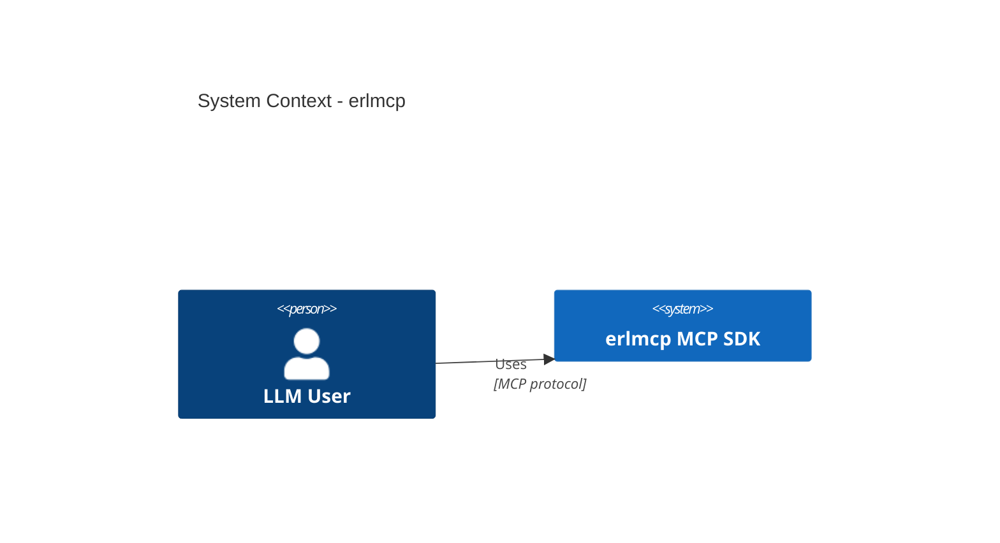

# erlmcp v2.0.0 Architecture Documentation - INDEX

**Complete Navigation Hub for v2 Architecture Package**

Version: v2.0.0-draft
Status: CANONICAL REFERENCE
Date: 2026-01-27

---

## Quick Start

**New to erlmcp v2 architecture?** Start here:

1. 📘 [Glossary](./GLOSSARY.md) - Canonical terms and metrics (read first!)
2. 🏗️ [C4 Level 1 - System Context](./C4/L1-context.md) - erlmcp in the MCP ecosystem
3. 🔧 [C4 Level 2 - Containers](./C4/L2-containers.md) - OTP supervision tree and processes
4. 🧩 [C4 Level 3 - Core Components](./C4/L3-components-core.md) - MCP protocol implementation
5. 📂 [C4 Level 4 - Code Map](./C4/L4-code-map.md) - Module inventory (214 modules classified)

**For v2 Refactoring**:
- 🎯 [V2 Principles](./V2_DESIGN_INPUTS/v2_principles.md) - What to keep vs. delete
- ✅ [V2 Required Modules](./V2_DESIGN_INPUTS/v2_required_modules.md) - Minimum kernel for v2
- 🗑️ [V2 Deletions](./V2_DESIGN_INPUTS/v2_deletions.md) - What v2 intentionally drops
- ⚠️ [V2 Risks](./V2_DESIGN_INPUTS/v2_risks.md) - Risks discovered from structure analysis

---

## Document Inventory

### Core Documentation

| Document | Purpose | Audience | Status |
|----------|---------|----------|--------|
| [GLOSSARY.md](./GLOSSARY.md) | Canonical terms, metrics, units | All roles | CANONICAL |
| [INDEX.md](./INDEX.md) | This navigation hub | All roles | CANONICAL |

### C4 Architecture Diagrams

**Level 1: System Context**
- [L1-context.md](./C4/L1-context.md) - erlmcp in MCP ecosystem, external systems, actors

**Level 2: Containers (Processes)**
- [L2-containers.md](./C4/L2-containers.md) - Supervision tree, subsystems, inter-process communication

**Level 3: Components**
- [L3-components-core.md](./C4/L3-components-core.md) - Core MCP protocol (JSON-RPC, session, resources, tools, prompts)
- [L3-components-transports.md](./C4/L3-components-transports.md) - Transport layer (stdio, TCP, HTTP, WebSocket) *(pending)*
- [L3-components-evidence.md](./C4/L3-components-evidence.md) - Evidence chain and receipt system *(pending)*
- [L3-components-tcps.md](./C4/L3-components-tcps.md) - TCPS manufacturing layer *(pending)*
- [L3-components-pricing.md](./C4/L3-components-pricing.md) - Pricing and SLA tiers *(pending)*

**Level 4: Code**
- [L4-code-map.md](./C4/L4-code-map.md) - Module inventory, callgraph clusters, LOC analysis

### V2 Design Inputs

| Document | Purpose | Key Decisions |
|----------|---------|---------------|
| [v2_principles.md](./V2_DESIGN_INPUTS/v2_principles.md) | Design philosophy | What to keep vs. delete, library migration rationale |
| [v2_required_modules.md](./V2_DESIGN_INPUTS/v2_required_modules.md) | Minimum kernel | 60-70 modules for functional MCP SDK |
| [v2_deletions.md](./V2_DESIGN_INPUTS/v2_deletions.md) | What v2 drops | 37 legacy modules, 85+ TCPS modules separated |
| [v2_risks.md](./V2_DESIGN_INPUTS/v2_risks.md) | Identified risks | Dependency risks, migration risks, performance risks |

---

## Document Relationships

```
INDEX (you are here)
  │
  ├── GLOSSARY ─────────────► Use these terms in ALL docs
  │
  ├── C4 Diagrams (5 levels)
  │   ├── L1 (Context) ─────► External systems, actors
  │   ├── L2 (Containers) ──► OTP processes, supervision
  │   ├── L3 (Components) ──► Internal module structure
  │   │   ├── Core ─────────► MCP protocol
  │   │   ├── Transports ───► stdio/TCP/HTTP/WebSocket
  │   │   ├── Evidence ─────► Receipt chain
  │   │   ├── TCPS ─────────► Manufacturing layer
  │   │   └── Pricing ──────► SLA tiers
  │   └── L4 (Code) ────────► Module inventory, 214 modules
  │
  └── V2 Design Inputs
      ├── Principles ───────► Keep vs. delete philosophy
      ├── Required Modules ─► Minimum kernel (60-70)
      ├── Deletions ────────► What v2 drops (122+ modules)
      └── Risks ────────────► Migration risks, performance
```

---

## By Role

### For Architects

**Start here**: Design decisions and system structure

1. [v2_principles.md](./V2_DESIGN_INPUTS/v2_principles.md) - Design philosophy
2. [L1-context.md](./C4/L1-context.md) - System boundaries
3. [L2-containers.md](./C4/L2-containers.md) - Supervision strategy (bulkhead pattern)
4. [v2_risks.md](./V2_DESIGN_INPUTS/v2_risks.md) - Identified risks

**Key Questions Answered**:
- Why separate TCPS? → [v2_principles.md#separation-rationale](./V2_DESIGN_INPUTS/v2_principles.md)
- Why migrate to gproc/gun/ranch? → [v2_principles.md#library-migration](./V2_DESIGN_INPUTS/v2_principles.md)
- What are v2 performance targets? → [GLOSSARY.md#performance-context](./GLOSSARY.md)

---

### For Developers

**Start here**: Implementation details and code structure

1. [GLOSSARY.md](./GLOSSARY.md) - Canonical terms (use these in code comments!)
2. [L3-components-core.md](./C4/L3-components-core.md) - MCP protocol implementation
3. [L4-code-map.md](./C4/L4-code-map.md) - Module classification (canonical vs. legacy)
4. [v2_required_modules.md](./V2_DESIGN_INPUTS/v2_required_modules.md) - What modules to focus on

**Key Questions Answered**:
- Which modules are canonical? → [L4-code-map.md#canonical-core-protocol](./C4/L4-code-map.md)
- How do transports work? → [L2-containers.md#tier-4-transports](./C4/L2-containers.md), [L3-components-transports.md](./C4/L3-components-transports.md) *(pending)*
- What's the supervision strategy? → [L2-containers.md#supervision-tree](./C4/L2-containers.md)

---

### For Operators

**Start here**: Deployment, monitoring, and performance

1. [L1-context.md](./C4/L1-context.md) - Deployment context, external integrations
2. [GLOSSARY.md#metrics-terminology](./GLOSSARY.md) - Canonical metrics (for dashboards)
3. [L2-containers.md#tier-5-observability](./C4/L2-containers.md) - Monitoring subsystem
4. [v2_risks.md](./V2_DESIGN_INPUTS/v2_risks.md) - Operational risks

**Key Questions Answered**:
- What are performance targets? → [GLOSSARY.md#performance-context](./GLOSSARY.md), [L1-context.md#performance-context](./C4/L1-context.md)
- How does HA/failover work? → [L1-context.md#deployment-context](./C4/L1-context.md)
- What metrics to monitor? → [GLOSSARY.md#metrics-terminology](./GLOSSARY.md), [L2-containers.md#observability](./C4/L2-containers.md)

---

### For Technical Debt Analysts

**Start here**: What to delete, what to refactor

1. [L4-code-map.md](./C4/L4-code-map.md) - Module inventory (214 modules classified)
2. [v2_deletions.md](./V2_DESIGN_INPUTS/v2_deletions.md) - Deletion list (122+ modules)
3. [v2_required_modules.md](./V2_DESIGN_INPUTS/v2_required_modules.md) - Required modules (60-70)
4. [v2_risks.md](./V2_DESIGN_INPUTS/v2_risks.md) - Migration risks

**Key Metrics**:
- **Current codebase**: 247 modules (~37,000 LOC)
- **v2 target**: 60-70 modules (~15,000 LOC)
- **Savings**: 59% LOC reduction, 122+ modules deleted

---

## Metrics and Performance

### Canonical Metrics

**All metrics MUST use these units** (from [GLOSSARY.md](./GLOSSARY.md)):

| Metric | Unit | Example | Workload Reference |
|--------|------|---------|-------------------|
| Throughput | `msg_per_s` | `2690088.37 msg/s` | `core_ops_100k` |
| Latency | `latency_p99_us` | `83.0 μs` | `core_ops_100k` |
| Memory | `per_node_total_rss_mib` | `63.9 MiB` | `core_ops_100k` |
| Connections | `sockets_open` | `10000` | `tcp_sustained_10k_1kib` |

**Prohibited**: `req/s` (ambiguous), `MiB/conn` (unclear component), `latency_ms` (missing percentile).

---

### Performance Baseline (v1.5.0)

**Hardware**: macOS 14, 8 vCPU, 16 GB RAM, OTP-27
**Source**: [bench/results/core_ops_core_ops_100k_*.json](/Users/sac/erlmcp/bench/results/)

| Component | Throughput | Workload | Notes |
|-----------|------------|----------|-------|
| **Registry** | 553K msg/s | `core_ops_100k` | In-memory routing |
| **Queue** | 971K msg/s | `core_ops_100k` | Bounded queue ops |
| **Pool** | 149K msg/s | `core_ops_100k` | Connection pool checkout |
| **Session** | 242K msg/s | `core_ops_100k` | Session state ops |
| **Network I/O** | 43K msg/s | `tcp_sustained_10k_1kib` | Real TCP sockets (4 KiB packets) |

**Bottleneck**: Network I/O (43K msg/s) vs. in-memory (2.69M msg/s aggregate).

---

## Diagram Format

All C4 diagrams use **Mermaid syntax** for:
- ✅ Version control (text-based diffs)
- ✅ Automatic rendering (GitHub, GitLab, VS Code)
- ✅ Easy updates (no binary diagram files)

**Example**:
````markdown

````

**Rendering**: Use Mermaid Live Editor (https://mermaid.live) or VS Code Mermaid plugin.

---

## Document Status Levels

| Status | Meaning | Changeability |
|--------|---------|---------------|
| **CANONICAL** | Authoritative reference, stable | Changes require architecture review |
| **DRAFT** | Work in progress | Open to changes |
| **PENDING** | Planned but not yet written | N/A |
| **DEPRECATED** | Superseded by newer version | Do not reference |

**Current Status**: All v2 docs are `CANONICAL (v2.0.0-draft)` pending final review.

---

## Contributing to v2 Docs

### Adding New Diagrams

1. Create in `docs/v2/C4/` directory
2. Use Mermaid C4 syntax (see existing diagrams)
3. Cite module sources (`src/*.erl`) and JSON data (`bench/results/*.json`)
4. Use canonical terms from [GLOSSARY.md](./GLOSSARY.md)
5. Update this INDEX with link

### Updating Glossary

1. Edit [GLOSSARY.md](./GLOSSARY.md)
2. Run validation: `scripts/validate_glossary.sh` *(to be created)*
3. Update dependent diagrams if terms change

### Writing V2 Design Inputs

1. Create in `docs/v2/V2_DESIGN_INPUTS/`
2. Reference module source code (`src/*.erl`)
3. Cite architectural principles from [v2_principles.md](./V2_DESIGN_INPUTS/v2_principles.md)
4. Include risk analysis in [v2_risks.md](./V2_DESIGN_INPUTS/v2_risks.md)

---

## External References

### erlmcp v1.x Documentation

**Existing docs** (to be superseded by v2):
- `docs/otp-patterns.md` - OTP patterns (canonical, keep)
- `docs/protocol.md` - MCP protocol spec (canonical, keep)
- `docs/api-reference.md` - API reference (update for v2)
- `docs/library-migration-guide.md` - Library migration (v0.6.0, incorporate into v2)

**Migration**: v2 docs are ADDITIVE (do not delete v1.x docs until v2 is released).

---

### MCP Protocol Specification

- **Version**: 2024-11-05 (Anthropic MCP spec)
- **URL**: https://modelcontextprotocol.io/specification
- **Local Copy**: `docs/protocol.md`

---

### Benchmark Results

- **Location**: `bench/results/*.json`
- **Workload Definitions**: `bench/workloads/*.json`
- **Environment Specs**: `bench/environments/*.json`
- **Metrology Glossary**: `docs/metrology/METRICS_GLOSSARY.md` (v1.5.0, incorporated into v2 GLOSSARY)

---

## Version History

| Version | Date | Changes | Author |
|---------|------|---------|--------|
| v2.0.0-draft | 2026-01-27 | Initial v2 architecture package | Agent 10 (C4 synthesis) |

---

## Contact

**For questions about v2 architecture**:
- **Issue Tracker**: github.com/erlmcp/erlmcp/issues
- **Tag**: `architecture`, `v2.0.0`
- **Email**: architecture@erlmcp.dev *(if applicable)*

---

## Document Map

```
docs/v2/
├── INDEX.md (you are here)
├── GLOSSARY.md (canonical terms, metrics)
│
├── C4/
│   ├── L1-context.md (system context, external systems)
│   ├── L2-containers.md (supervision tree, processes)
│   ├── L3-components-core.md (core MCP protocol)
│   ├── L3-components-transports.md (pending)
│   ├── L3-components-evidence.md (pending)
│   ├── L3-components-tcps.md (pending)
│   ├── L3-components-pricing.md (pending)
│   └── L4-code-map.md (module inventory, 214 modules)
│
└── V2_DESIGN_INPUTS/
    ├── v2_principles.md (design philosophy)
    ├── v2_required_modules.md (minimum kernel, 60-70 modules)
    ├── v2_deletions.md (deletion list, 122+ modules)
    └── v2_risks.md (identified risks)
```

---

**Document Status**: CANONICAL (v2.0.0-draft)
**Last Updated**: 2026-01-27
**Purpose**: Complete navigation hub for erlmcp v2 architecture package
