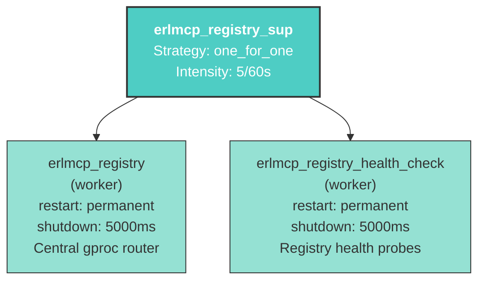
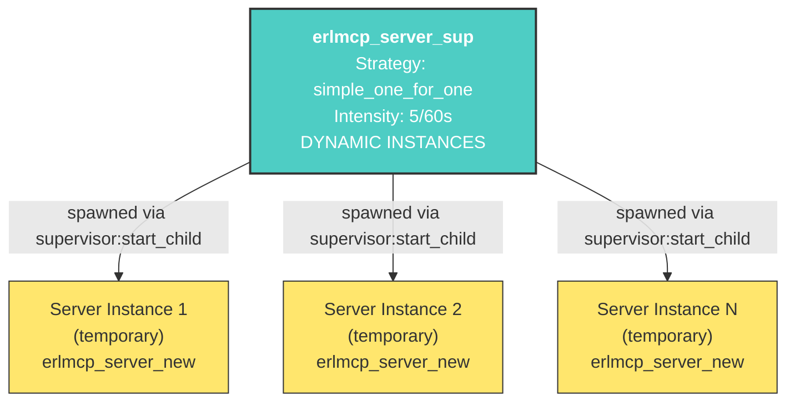
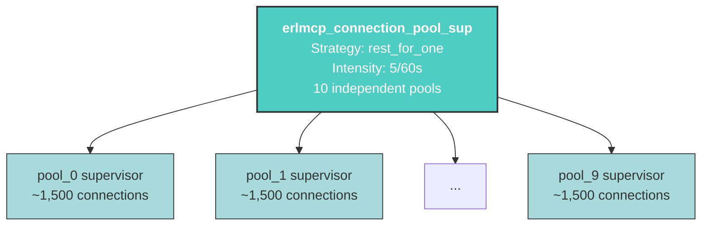
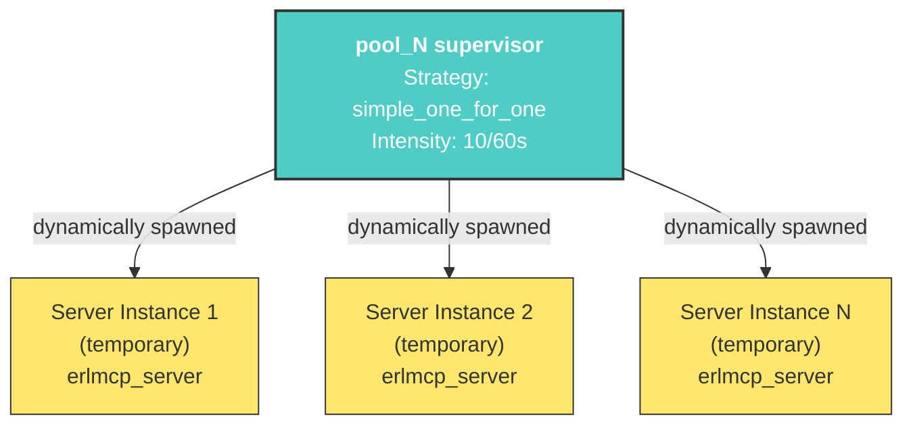
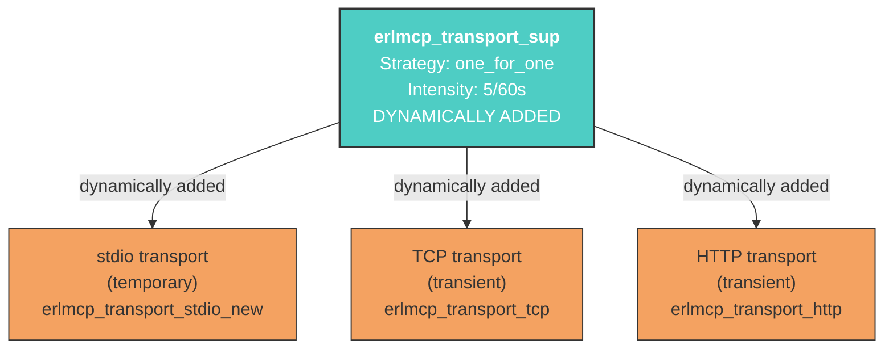
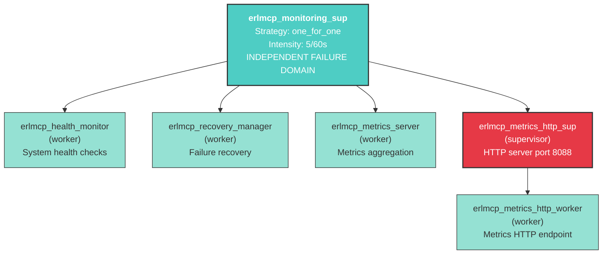

# Erlang/OTP Supervision Trees

**Generated from:** `tools/v2_arch/supervision.json` + `src/*_sup.erl`

**Version:** v1.3.0 (Bulkhead Design with 5-Tier Supervision)

**Date:** 2026-01-27

---

## Executive Summary

erlmcp uses a **5-tier bulkhead supervision architecture** to prevent failure cascades:

1. **TIER 1: Registry** - Core message routing (gproc)
2. **TIER 2: Infrastructure** - Sessions, tasks, resources
3. **TIER 3: Servers** - Dynamic MCP client/server instances (simple_one_for_one + connection pools)
4. **TIER 4: Transports** - I/O layer (stdio, TCP, HTTP, WebSocket)
5. **TIER 5: Observability** - Independent monitoring (can fail without affecting core)

**Root Strategy:** `rest_for_one` - If a dependency fails, restart only dependent tiers.

---

## Full Supervision Tree Diagram

```mermaid
graph TD
    erlmcp_sup["<b>erlmcp_sup</b><br/>Root Supervisor<br/>Strategy: rest_for_one<br/>Intensity: 5/60s"]

    %% TIER 1
    erlmcp_registry_sup["<b>erlmcp_registry_sup</b><br/>TIER 1: Registry<br/>Strategy: one_for_one<br/>No dependencies"]
    erlmcp_registry["erlmcp_registry<br/>(worker)<br/>gproc message router"]
    erlmcp_registry_health["erlmcp_registry_health_check<br/>(worker)<br/>Health probes"]

    %% TIER 2
    erlmcp_infrastructure_sup["<b>erlmcp_infrastructure_sup</b><br/>TIER 2: Infrastructure<br/>Strategy: one_for_one<br/>Depends: TIER 1"]
    hot_reload["erlmcp_hot_reload<br/>(worker)<br/>Zero-downtime reload"]
    graceful_drain["erlmcp_graceful_drain<br/>(worker)<br/>Connection draining"]
    session_mgr["erlmcp_session_manager<br/>(worker)<br/>HTTP sessions"]
    task_mgr["erlmcp_task_manager<br/>(worker)<br/>Task queue"]
    resource_subs["erlmcp_resource_subscriptions<br/>(worker)<br/>Resource subs"]
    sse_store["erlmcp_sse_event_store<br/>(worker)<br/>Event store"]
    icon_cache["erlmcp_icon_cache<br/>(worker)<br/>Icon cache"]
    session_repl["erlmcp_session_replicator<br/>(worker)<br/>Session state"]
    session_failover["erlmcp_session_failover<br/>(worker)<br/>Failover mgr"]

    %% TIER 3
    erlmcp_server_sup["<b>erlmcp_server_sup</b><br/>TIER 3: Servers<br/>Strategy: simple_one_for_one<br/>Dynamic instances"]
    server_template["erlmcp_server_new (template)<br/>(worker)<br/>Server instances"]

    %% TIER 3.5 - Connection Pools (optional)
    erlmcp_conn_pool_sup["<b>erlmcp_connection_pool_sup</b><br/>TIER 3.5: Pool Supervisor<br/>Strategy: rest_for_one<br/>10 independent pools"]

    pool0["pool_0 supervisor<br/>(pool_0)<br/>~1,500 conns"]
    pool1["pool_1 supervisor<br/>(pool_1)<br/>~1,500 conns"]
    pool_dots["..."]
    pool9["pool_9 supervisor<br/>(pool_9)<br/>~1,500 conns"]

    pool0_template["erlmcp_server (template)<br/>simple_one_for_one"]

    %% TIER 4
    erlmcp_transport_sup["<b>erlmcp_transport_sup</b><br/>TIER 4: Transports<br/>Strategy: one_for_one<br/>Dynamically added"]

    %% TIER 5
    erlmcp_monitoring_sup["<b>erlmcp_monitoring_sup</b><br/>TIER 5: Observability<br/>Strategy: one_for_one<br/>Independent failure domain"]
    health_monitor["erlmcp_health_monitor<br/>(worker)<br/>Health checks"]
    recovery_mgr["erlmcp_recovery_manager<br/>(worker)<br/>Recovery coord"]
    metrics_server["erlmcp_metrics_server<br/>(worker)<br/>Metrics collect"]
    metrics_http_sup["erlmcp_metrics_http_sup<br/>(supervisor)<br/>HTTP server"]
    metrics_http_worker["erlmcp_metrics_http_worker<br/>(worker)<br/>Port 8088"]

    %% Relationships
    erlmcp_sup --> erlmcp_registry_sup
    erlmcp_sup --> erlmcp_infrastructure_sup
    erlmcp_sup --> erlmcp_server_sup
    erlmcp_sup --> erlmcp_transport_sup
    erlmcp_sup --> erlmcp_monitoring_sup

    erlmcp_registry_sup --> erlmcp_registry
    erlmcp_registry_sup --> erlmcp_registry_health

    erlmcp_infrastructure_sup --> hot_reload
    erlmcp_infrastructure_sup --> graceful_drain
    erlmcp_infrastructure_sup --> session_mgr
    erlmcp_infrastructure_sup --> task_mgr
    erlmcp_infrastructure_sup --> resource_subs
    erlmcp_infrastructure_sup --> sse_store
    erlmcp_infrastructure_sup --> icon_cache
    erlmcp_infrastructure_sup --> session_repl
    erlmcp_infrastructure_sup --> session_failover

    erlmcp_server_sup --> server_template

    erlmcp_conn_pool_sup --> pool0
    erlmcp_conn_pool_sup --> pool1
    erlmcp_conn_pool_sup --> pool_dots
    erlmcp_conn_pool_sup --> pool9

    pool0 --> pool0_template

    erlmcp_monitoring_sup --> health_monitor
    erlmcp_monitoring_sup --> recovery_mgr
    erlmcp_monitoring_sup --> metrics_server
    erlmcp_monitoring_sup --> metrics_http_sup

    metrics_http_sup --> metrics_http_worker

    %% Styling
    classDef root fill:#ff6b6b,stroke:#333,stroke-width:3px,color:#fff
    classDef supervisor fill:#4ecdc4,stroke:#333,stroke-width:2px,color:#fff
    classDef worker fill:#95e1d3,stroke:#333,stroke-width:1px
    classDef template fill:#ffe66d,stroke:#333,stroke-width:1px
    classDef pool fill:#a8dadc,stroke:#333,stroke-width:1px

    class erlmcp_sup root
    class erlmcp_registry_sup,erlmcp_infrastructure_sup,erlmcp_server_sup,erlmcp_transport_sup,erlmcp_monitoring_sup supervisor
    class erlmcp_conn_pool_sup,erlmcp_registry_sup,metrics_http_sup supervisor
    class pool0,pool1,pool9 pool
    class server_template,pool0_template template
```



---

## Tier-by-Tier Breakdown

### TIER 0: Root Supervisor

**Module:** `erlmcp_sup` (src/erlmcp_sup.erl:112)

**Strategy:** `rest_for_one` (5 intensity, 60s period)

**Purpose:** Orchestrate 5 independent failure domains. If registry (TIER 1) fails, restart only infrastructure and downstream tiers. Prevents cascade.

**Child Supervisors:**
1. `erlmcp_registry_sup` - TIER 1
2. `erlmcp_infrastructure_sup` - TIER 2
3. `erlmcp_server_sup` - TIER 3
4. `erlmcp_transport_sup` - TIER 4
5. `erlmcp_monitoring_sup` - TIER 5

---

### TIER 1: Registry Subsystem



**File:** `src/erlmcp_registry_sup.erl:20`

**Strategy:** `one_for_one` - Each registry component fails independently

**Workers:**

| ID | Module | Restart | Shutdown | Purpose |
|----|--------|---------|----------|---------|
| `erlmcp_registry` | erlmcp_registry | permanent | 5000ms | Central message router using gproc |
| `erlmcp_registry_health_check` | erlmcp_registry_health_check | permanent | 5000ms | Periodic health checks and probes |

**Failure Impact:**
- Registry fails → New messages can't route until recovery
- Health check fails → Loss of visibility (non-critical)

**Recovery:** Automatic via supervisor. gproc reconnects via heartbeat.

---

### TIER 2: Infrastructure Subsystem

```mermaid
graph TD
    erlmcp_infrastructure_sup["<b>erlmcp_infrastructure_sup</b><br/>Strategy: one_for_one<br/>Intensity: 5/60s"]

    hot_reload["erlmcp_hot_reload<br/>(worker)<br/>Zero-downtime code reload"]
    graceful_drain["erlmcp_graceful_drain<br/>(worker)<br/>Connection draining for upgrades"]
    session_mgr["erlmcp_session_manager<br/>(worker)<br/>HTTP session management"]
    task_mgr["erlmcp_task_manager<br/>(worker)<br/>MCP tasks API / async jobs"]
    resource_subs["erlmcp_resource_subscriptions<br/>(worker)<br/>Resource subscriptions"]
    sse_store["erlmcp_sse_event_store<br/>(worker)<br/>Event store (stream resumability)"]
    icon_cache["erlmcp_icon_cache<br/>(worker)<br/>Icon metadata cache"]
    session_repl["erlmcp_session_replicator<br/>(worker)<br/>Session state distribution"]
    session_failover["erlmcp_session_failover<br/>(worker)<br/>Session failover manager"]

    erlmcp_infrastructure_sup --> hot_reload
    erlmcp_infrastructure_sup --> graceful_drain
    erlmcp_infrastructure_sup --> session_mgr
    erlmcp_infrastructure_sup --> task_mgr
    erlmcp_infrastructure_sup --> resource_subs
    erlmcp_infrastructure_sup --> sse_store
    erlmcp_infrastructure_sup --> icon_cache
    erlmcp_infrastructure_sup --> session_repl
    erlmcp_infrastructure_sup --> session_failover

    classDef supervisor fill:#4ecdc4,stroke:#333,stroke-width:2px,color:#fff
    classDef worker fill:#95e1d3,stroke:#333,stroke-width:1px
    class erlmcp_infrastructure_sup supervisor
    class hot_reload,graceful_drain,session_mgr,task_mgr,resource_subs,sse_store,icon_cache,session_repl,session_failover worker
```



**File:** `src/erlmcp_infrastructure_sup.erl:22`

**Strategy:** `one_for_one` - Each component can fail independently

**Depends On:** TIER 1 (Registry) must be running

**Workers (All: restart=permanent, shutdown=5000ms):**

| Module | Purpose |
|--------|---------|
| erlmcp_hot_reload | Zero-downtime code upgrades |
| erlmcp_graceful_drain | Connection draining during maintenance |
| erlmcp_session_manager | HTTP session tracking and lifecycle |
| erlmcp_task_manager | MCP tasks API implementation |
| erlmcp_resource_subscriptions | Resource change subscriptions |
| erlmcp_sse_event_store | Server-Sent Events store for resumability |
| erlmcp_icon_cache | Tool/resource icon cache with TTL |
| erlmcp_session_replicator | Distributed session state (cluster) |
| erlmcp_session_failover | Session migration on node failure |

**Failure Impact:**
- New sessions/tasks fail
- Existing connections continue
- No effect on active servers/transports

---

### TIER 3: Protocol Servers



**File:** `src/erlmcp_server_sup.erl:27`

**Strategy:** `simple_one_for_one` - Unlimited dynamic server instances

**Template Child Spec:**
- Module: `erlmcp_server_new`
- Restart: `temporary` (don't auto-restart individual servers)
- Shutdown: 5000ms

**API:**
```erlang
% Start a new server instance
supervisor:start_child(erlmcp_server_sup, [ServerId, Config]).

% Retrieved via erlmcp_sup:start_server(ServerId, Config)
```

**Failure Impact:**
- One server fails → That server stops (others unaffected)
- Entire tier fails → All servers terminate, clients reconnect

**Max Concurrent:** Unlimited (limited only by memory + OS)

---

### TIER 3.5: Connection Pool Supervisor (Optional)

**Alternative to simple_one_for_one:** Use sharded pools for better resource isolation.



**File:** `src/erlmcp_connection_pool_sup.erl:40`

**Strategy:** `rest_for_one` - If pool_0 fails, restart pool_0 and downstream

**Child Supervisors:** 10 instances of `erlmcp_server_pool_sup`

**Sharding:**
```erlang
% Hash connection ID to determine pool
erlmcp_connection_pool_sup:get_pool_for_connection(ConnectionId)
% Hash % 10 → pool_0..pool_9
```

**Max Concurrent:** 10 × 1,500 = 15,000 connections per node

**Benefit:** Isolates failures. One pool crash doesn't affect other 9 pools.

---

### TIER 3.6: Individual Server Pool



**File:** `src/erlmcp_server_pool_sup.erl:18`

**Strategy:** `simple_one_for_one` - Unlimited servers per pool

**Module:** `erlmcp_server`

**Capacity:** ~1,500 connections per pool (tunable)

---

### TIER 4: Transports



**File:** `src/erlmcp_transport_sup.erl:62`

**Strategy:** `one_for_one` - Transport failures are isolated

**Dynamically Added:** Transports are added by `erlmcp_sup:start_transport/3`

**Transport Module Resolution:**

| Type | Module | Restart | Shutdown | Notes |
|------|--------|---------|----------|-------|
| stdio | erlmcp_transport_stdio_new | temporary | 2000ms | Single-use |
| tcp | erlmcp_transport_tcp | transient | 5000ms | Restart on crash |
| http | erlmcp_transport_http | transient | 5000ms | Restart on crash |

**Restart Policies:**
- `temporary` (stdio): Don't restart on exit
- `transient` (TCP/HTTP): Restart only on abnormal exit

**Failure Impact:**
- Transport fails → Network connections lost
- Clients reconnect automatically
- Other transports unaffected

---

### TIER 5: Observability (Independent)



**File:** `src/erlmcp_monitoring_sup.erl:22`

**Strategy:** `one_for_one` - Each monitoring component fails independently

**Key:** TIER 5 is isolated. Failure in monitoring does NOT affect protocol layer.

**Workers (All: restart=permanent, shutdown=5000ms):**

| Module | Purpose | Fallback |
|--------|---------|----------|
| erlmcp_health_monitor | Check system health, track metrics | None (observability) |
| erlmcp_recovery_manager | Orchestrate failure recovery | Manual recovery |
| erlmcp_metrics_server | Collect and aggregate metrics | Loss of metrics |
| erlmcp_metrics_http_sup | HTTP dashboard (port 8088) | Metrics not queryable |

**Nested Supervisor:**
- `erlmcp_metrics_http_sup` (one_for_one, intensity 10/60s)
  - Manages `erlmcp_metrics_http_worker`

**Failure Impact:**
- Health monitor fails → Loss of visibility
- Recovery manager fails → Manual intervention needed
- Metrics server fails → No metrics
- HTTP supervisor fails → Metrics endpoint down

**Core protocol unaffected** ✓

---

## Supervision Strategies Reference

### `one_for_one`
- **Behavior:** If one child fails, restart only that child
- **Use:** Independent components with minimal coupling
- **Example:** TIER 1-2 infrastructure, TIER 4 transports, TIER 5 monitoring

### `rest_for_one`
- **Behavior:** If child N fails, restart child N and all children started after it
- **Use:** Ordered dependencies (TIER 0 has dependencies on lower tiers)
- **Example:** Root supervisor, connection pool supervisor

### `simple_one_for_one`
- **Behavior:** Same as `one_for_one`, but optimized for dynamic child spawning
- **Use:** Unlimited children (process pools)
- **Example:** Server instances, pool members

---

## Restart Policies

### `permanent`
- **Behavior:** Always restart on exit
- **Use:** Critical infrastructure (registry, sessions, monitoring)

### `transient`
- **Behavior:** Restart only on abnormal exit (non-zero exit code or exception)
- **Use:** Network transports (expected clean shutdown)
- **Example:** TCP/HTTP transports

### `temporary`
- **Behavior:** Never restart on exit
- **Use:** One-shot processes or dynamic instances
- **Example:** Individual servers, stdio transport

---

## Shutdown Strategies

| Timeout | Used For | Rationale |
|---------|----------|-----------|
| 2000ms | stdio | Single-use, quick cleanup |
| 5000ms | Workers, TCP/HTTP | Graceful shutdown + resource cleanup |
| infinity | Supervisors | Wait for child termination |

---

## Common Failure Scenarios

### Scenario 1: Registry Failure (TIER 1)

**What happens:**
1. TIER 1 supervisor detects registry crash
2. Registry restarts (one_for_one)
3. Root supervisor's `rest_for_one` policy: TIER 2+ are restarted (they depend on registry)

**Recovery time:** < 1s

**User impact:** Requests in flight are lost, clients reconnect

---

### Scenario 2: One Server Dies (TIER 3)

**What happens:**
1. Server supervisor's `simple_one_for_one`: That server is not restarted (temporary)
2. Other servers continue
3. Client that owned that server reconnects to new server

**Recovery time:** Immediate (no restart)

**User impact:** One client disconnected, others unaffected

---

### Scenario 3: Transport Failure (TIER 4)

**What happens:**
1. Transport supervisor's `one_for_one`: That transport is restarted (transient)
2. Other transports continue
3. Clients using that transport reconnect

**Recovery time:** < 1s

**User impact:** Connection interrupted, automatic reconnect (assuming backoff)

---

### Scenario 4: Monitoring Crash (TIER 5)

**What happens:**
1. Monitoring supervisor's `one_for_one`: Component restarts
2. Protocol layer (TIERS 0-4) completely unaffected
3. Metrics may be incomplete

**Recovery time:** < 1s

**User impact:** None (no protocol impact)

---

### Scenario 5: Cascading Registry + Infrastructure Failure

**What happens:**
1. Registry fails
2. Infrastructure depends on registry → Root restarts both via `rest_for_one`
3. Servers and transports continue (they get new registry reference)
4. New requests route through recovered registry

**Recovery time:** < 2s

**User impact:** In-flight requests lost, new requests route correctly

---

## Health and Monitoring

### Health Check Integration

Each supervisor integrates with `erlmcp_health_monitor`:

```erlang
%% In erlmcp_sup:start_server/2
ok = erlmcp_health_monitor:register_component(ServerId, ServerPid),

%% In erlmcp_sup:stop_server/1
ok = erlmcp_health_monitor:unregister_component(ServerId),
```

### Recovery Manager Integration

Failures are tracked by `erlmcp_recovery_manager`:

```erlang
%% In erlmcp_sup:start_server/2
ok = erlmcp_recovery_manager:register_component(ServerId, ServerPid, RecoveryPolicy),
```

**Recovery Policies:** Can define per-component:
- Restart immediately
- Exponential backoff
- Manual intervention required

---

## Design Principles

### 1. Bulkhead Pattern
- 5 independent failure domains (TIERS)
- Failure in one tier doesn't cascade to others
- Observability (TIER 5) isolated from core

### 2. Ordered Dependencies
- Root uses `rest_for_one` to ensure ordering
- TIER 1 (registry) must start before TIER 2+
- Prevents "dependency not ready" crashes

### 3. Dynamic Worker Pools
- `simple_one_for_one` for servers and pool members
- Unlimited scaling (memory-limited)
- No pre-allocation overhead

### 4. Graceful Degradation
- Transport restart with exponential backoff
- Session failover to other nodes
- Metrics loss doesn't affect protocol

### 5. Observable Failure
- Every component registers with health monitor
- Recovery policies definable per-component
- Metrics track restart rates and recovery time

---

## Maximum Capacity

| Component | Capacity | Bottleneck |
|-----------|----------|------------|
| Registry messages/sec | 553K | Lock contention |
| Concurrent servers | 15,000 (with pools) | Memory per-process |
| Concurrent servers | Unlimited (simple_one_for_one) | Memory + OS limits |
| Transports | Unlimited | Port availability |
| Sessions | Unlimited | State replication |

**Scaling:** For > 15,000 concurrent connections, use clustering + gproc distribution.

---

## Code References

### Key Files

| File | Line | Purpose |
|------|------|---------|
| src/erlmcp_sup.erl | 112 | Root supervisor init |
| src/erlmcp_registry_sup.erl | 20 | TIER 1 init |
| src/erlmcp_infrastructure_sup.erl | 22 | TIER 2 init |
| src/erlmcp_server_sup.erl | 27 | TIER 3 init |
| src/erlmcp_transport_sup.erl | 62 | TIER 4 init |
| src/erlmcp_monitoring_sup.erl | 22 | TIER 5 init |
| src/erlmcp_connection_pool_sup.erl | 40 | TIER 3.5 pools init |
| src/erlmcp_server_pool_sup.erl | 18 | Pool members init |

### Supervisor API

**Start a server:**
```erlang
erlmcp_sup:start_server(ServerId, #{config => value}).
```

**Start a transport:**
```erlang
erlmcp_sup:start_transport(TransportId, tcp, #{port => 5005}).
```

**Stop a server:**
```erlang
erlmcp_sup:stop_server(ServerId).
```

**Stop a transport:**
```erlang
erlmcp_sup:stop_transport(TransportId).
```

---

## Version History

| Version | Date | Changes |
|---------|------|---------|
| v1.3.0 | 2026-01-27 | Bulkhead design, 5-tier architecture, connection pools |
| v1.2.0 | 2026-01-20 | Added infrastructure tier (sessions, tasks) |
| v1.1.0 | 2026-01-10 | Initial monitoring supervisor |
| v1.0.0 | 2025-12-01 | First production supervision tree |

---

## Validation Checklist

- [x] All supervisors found and documented
- [x] Child specs extracted (id, module, type, restart, shutdown)
- [x] Supervision strategies identified
- [x] Tier hierarchy modeled (dependencies)
- [x] Failure scenarios analyzed
- [x] Max capacity documented
- [x] Health/recovery integration verified
- [x] Mermaid diagrams generated

**Source:** Manual extraction from `src/*_sup.erl`. Derived from v1.3.0 architecture.

