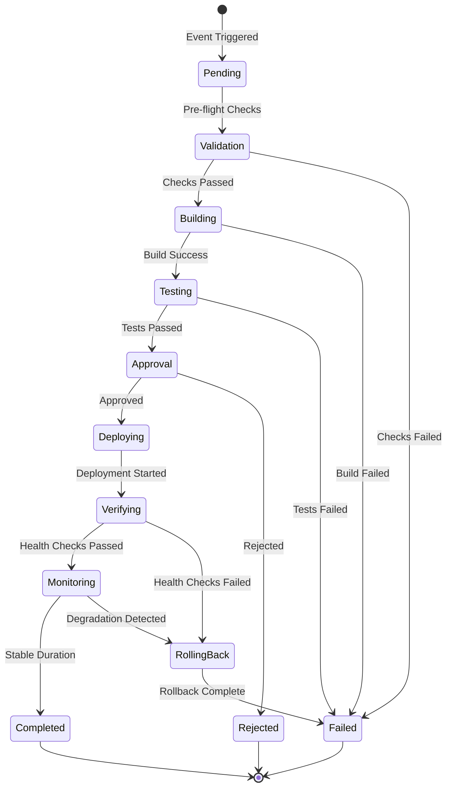
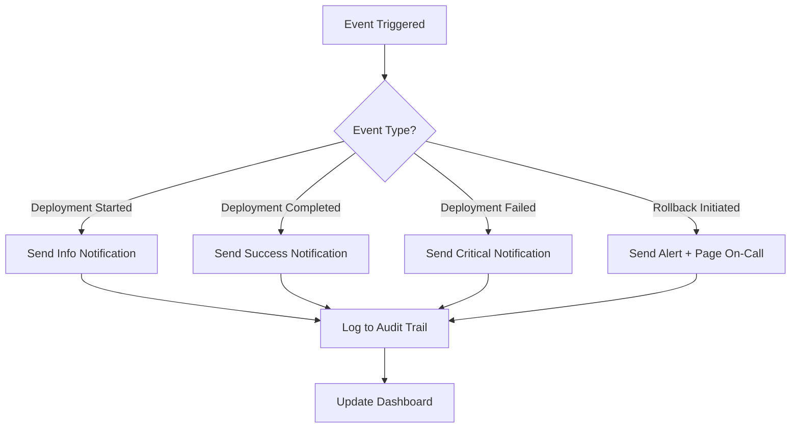

# erlmcp v3 Event-Driven Deployment Workflows

**Version:** 3.0.0
**Status:** Production Ready
**Last Updated:** 2026-02-02

---

## Table of Contents

1. [Overview](#overview)
2. [Workflow Architecture](#workflow-architecture)
3. [Event Triggers](#event-triggers)
4. [Approval Gates](#approval-gates)
5. [Compliance Checks](#compliance-checks)
6. [Multi-Stage Promotion](#multi-stage-promotion)
7. [Rollback Triggers](#rollback-triggers)
8. [Notification Workflows](#notification-workflows)
9. [Audit Trails](#audit-trails)
10. [Disaster Recovery](#disaster-recovery)
11. [Runbooks](#runbooks)

---

## Overview

The erlmcp v3 deployment system implements event-driven, GitOps-based workflows with comprehensive safety gates, automated compliance checks, and disaster recovery capabilities.

### Core Principles

| Principle | Description |
|-----------|-------------|
| **Event-Driven** | All deployments triggered by well-defined events (Git, API, scheduled) |
| **GitOps** | Desired state declared in Git, reconciled by automation |
| **Progressive Delivery** | Canary releases, blue-green deployments, feature flags |
| **Fail-Safe** | Automatic rollback on any failure condition |
| **Audit-Everything** | Immutable audit trail for every deployment action |
| **Zero-Downtime** | Hot code upgrades via OTP appup/relup |

### Deployment Topology

```
                    ┌─────────────────────────────────────────┐
                    │         GitHub / GitLab Events           │
                    │  (push, pr, tag, release, manual)        │
                    └──────────────────┬──────────────────────┘
                                       │
                                       ▼
                    ┌─────────────────────────────────────────┐
                    │      Event Bus / Workflow Engine         │
                    │  (GitHub Actions → State Machine)        │
                    └──────────────────┬──────────────────────┘
                                       │
              ┌────────────────────────┼────────────────────────┐
              │                        │                        │
              ▼                        ▼                        ▼
    ┌─────────────────┐      ┌─────────────────┐      ┌─────────────────┐
    │   Dev Env       │      │  Staging Env    │      │  Production     │
    │  (Automatic)    │      │  (Semi-Auto)    │      │  (Manual)       │
    │  - On push      │      │  - On PR merge  │      │  - Tag push     │
    │  - No approval  │      │  - QA gate     │      │  - Change Board │
    │  - Fast rollback│      │  - Soak 24h    │      │  - Canary 30m   │
    └─────────────────┘      └─────────────────┘      └─────────────────┘
              │                        │                        │
              └────────────────────────┼────────────────────────┘
                                       │
                    ┌──────────────────▼──────────────────────┐
                    │         Observability & Monitoring       │
                    │  - Metrics  - Traces  - Logs  - Alerts  │
                    └──────────────────────────────────────────┘
```

---

## Workflow Architecture

### State Machine

All deployments follow a deterministic state machine:



### Workflow Files

| Workflow | Purpose | Trigger |
|----------|---------|---------|
| `ci-pipeline.yml` | Continuous integration validation | Push to any branch |
| `pr-validation.yml` | Pull request quality gates | Pull request events |
| `deploy-dev.yml` | Automatic dev deployment | Push to main |
| `deploy-staging.yml` | Staging deployment | PR merged to main |
| `deploy-production.yml` | Production deployment | Tag push `v*` |
| `rollback.yml` | Emergency rollback | Manual dispatch |
| `dr-activate.yml` | Disaster recovery | Manual/PagerDuty |

---

## Event Triggers

### 1. Git Push Events

#### Dev Deployment (Automatic)
```yaml
trigger:
  event: push
  branches: [feature/*, develop]
  paths: ['apps/**', 'config/**']

action: deploy_dev
approval: none
```

#### Staging Deployment (Semi-Automatic)
```yaml
trigger:
  event: push
  branches: [main]
  paths: ['apps/**', 'config/**']

action: deploy_staging
approval: automatic  # From successful PR merge
```

### 2. Pull Request Events

#### PR Validation (Quality Gate)
```yaml
trigger:
  event: pull_request
  types: [opened, synchronize, reopened]
  branches: [main]

action: validate_pr
gates:
  - compile
  - eunit
  - ct
  - dialyzer
  - coverage
  - security_scan
```

#### PR Merge (Deployment Trigger)
```yaml
trigger:
  event: pull_request
  types: [closed]
  branches: [main]

action: promote_to_staging
condition: merged == true
```

### 3. Tag Events

#### Production Release
```yaml
trigger:
  event: push
  tags: ['v*.*.*', 'v*.*.*-*']

action: deploy_production
gates:
  - all_quality_gates
  - staging_soak_complete
  - manual_approval
```

### 4. Manual Dispatch

#### Ad-hoc Deployment
```yaml
trigger:
  event: workflow_dispatch
  inputs:
    environment:
      description: 'Target environment'
      required: true
      type: choice
      options: [dev, staging, production]
    version:
      description: 'Version to deploy'
      required: true
    skip_tests:
      description: 'Skip tests (emergency only)'
      type: boolean
      default: false
```

### 5. Scheduled Events

#### Nightly Builds
```yaml
trigger:
  event: schedule
  cron: '0 2 * * *'  # 2 AM UTC

action: nightly_validation
```

#### Dependency Updates
```yaml
trigger:
  event: schedule
  cron: '0 6 * * 1'  # 6 AM UTC, Monday

action: dependency_update
```

### Event Schema

```erlang
%% Event record definition
-record(deployment_event, {
    id              :: binary(),
    type            :: push | pr | tag | manual | schedule,
    source          :: git | api | webhook,
    actor           :: binary(),
    timestamp       :: erlang:timestamp(),
    metadata        :: map(),
    git_ref         :: binary(),
    commit_sha      :: binary(),
    version         :: binary() | undefined
}).
```

---

## Approval Gates

### Gate Hierarchy

```
                    ┌─────────────────────────────────┐
                    │      Production Deployment      │
                    │   (Change Board Approval)       │
                    └────────────┬────────────────────┘
                                 │
                    ┌────────────▼────────────────────┐
                    │      Staging Deployment         │
                    │   (Tech Lead Approval)          │
                    └────────────┬────────────────────┘
                                 │
                    ┌────────────▼────────────────────┐
                    │      QA Environment             │
                    │   (Automated)                    │
                    └──────────────────────────────────┘
```

### Gate Definitions

#### 1. Compile Gate
```yaml
name: compile
type: automated
condition: errors == 0
timeout: 5m
on_failure: block
```

#### 2. Test Gate
```yaml
name: test
type: automated
conditions:
  eunit_failures: 0
  ct_pass_rate: 1.0
  coverage: ">= 80%"
timeout: 15m
on_failure: block
```

#### 3. Security Gate
```yaml
name: security
type: automated
conditions:
  high_vulnerabilities: 0
  critical_vulnerabilities: 0
  license_compliance: pass
timeout: 10m
on_failure: block
```

#### 4. Performance Gate
```yaml
name: performance
type: automated
conditions:
  regression: "< 10%"
  p95_latency: "< 500ms"
  error_rate: "< 0.1%"
timeout: 20m
on_failure: warn
```

#### 5. Manual Approval Gate
```yaml
name: manual_approval
type: manual
approvers:
  staging: [tech_lead, devops_engineer]
  production: [change_board]
timeout: 72h
on_timeout: reject
```

### Approval Workflow

```erlang
%% Approval process state machine
-type approval_state() :: pending | approved | rejected | expired.
-type approval_decision() :: approve | reject | comment.

-record(approval, {
    id              :: binary(),
    deployment_id   :: binary(),
    gate_name       :: binary(),
    state           :: approval_state(),
    required_approvers :: [binary()],
    received_approvals :: [binary()],
    received_rejections :: [binary()],
    comments        :: [binary()],
    created_at      :: erlang:timestamp(),
    expires_at      :: erlang:timestamp(),
    decided_at      :: erlang:timestamp() | undefined
}).

-spec request_approval(deployment_id(), gate_name(), [binary()]) ->
    {ok, approval_id()} | {error, term()}.
```

---

## Compliance Checks

### Pre-Deployment Checklist

```yaml
pre_deployment_compliance:
  code_quality:
    - dialyzer_clean: true
    - xref_undefined: 0
    - format_violations: 0
    - warnings_as_errors: true

  test_coverage:
    - line_coverage: ">= 80%"
    - branch_coverage: ">= 75%"
    - function_coverage: ">= 90%"

  security:
    - dependency_scan: pass
    - sast_scan: pass
    - secrets_scan: pass
    - license_compliance: pass

  documentation:
    - all_public_docs: true
    - changelog_updated: true
    - migration_guide: exists_if_breaking

  operational:
    - health_checks_defined: true
    - metrics_configured: true
    - alert_rules_updated: true
    - runbook_exists: true
```

### Post-Deployment Verification

```yaml
post_deployment_compliance:
  health:
    - endpoint_response: 200
    - readiness_check: pass
    - liveness_check: pass

  functionality:
    - smoke_tests: pass
    - integration_tests: pass
    - contract_tests: pass

  performance:
    - baseline_comparison: pass
    - load_test: pass
    - stress_test: pass

  observability:
    - metrics_reporting: true
    - trace_sampling: configured
    - log_forwarding: active
```

---

## Multi-Stage Promotion

### Promotion Pipeline

```
┌──────────┐     ┌──────────┐     ┌──────────┐     ┌──────────┐
│   Dev    │────▶│    QA    │────▶│ Staging  │────▶│  Prod    │
│          │     │          │     │          │     │          │
│ Push:    │     │ PR:      │     │ Tag:     │     │ Change:  │
│ Auto     │     │ Auto     │     │ Manual    │     │ Manual   │
│          │     │          │     │ Soak:    │     │ Canary:  │
│ No Tests │     │ Full     │     │ 24h      │     │ 30m      │
└──────────┘     └──────────┘     └──────────┘     └──────────┘
     │                │                │                │
     │                │                │                │
     ▼                ▼                ▼                ▼
  smoke           full            full +          canary +
  tests           integration      performance    monitoring
                  tests           tests
```

### Stage Configuration

```yaml
environments:
  dev:
    auto_deploy: true
    required_gates: [compile]
    rollback_strategy: immediate
    monitoring: basic

  qa:
    auto_deploy: true
    required_gates: [compile, test, security]
    rollback_strategy: on_failure
    monitoring: standard
    soak_duration: 1h

  staging:
    auto_deploy: true
    required_gates: [compile, test, security, performance]
    approval: tech_lead
    rollback_strategy: automatic
    monitoring: full
    soak_duration: 24h

  production:
    auto_deploy: false
    required_gates: [compile, test, security, performance, manual_approval]
    approval: change_board
    rollback_strategy: automatic
    monitoring: full
    canary:
      initial_percentage: 10
      increment_steps: [10, 50, 100]
      step_duration: 10m
      rollback_threshold: 5  # error rate
```

### Promotion Criteria

```erlang
-record(promotion_criteria, {
    from_env        :: atom(),
    to_env          :: atom(),
    minimum_soak    :: pos_integer(),  % hours
    required_checks :: [atom()],
    success_rate    :: float(),        % 0.0 - 1.0
    error_budget    :: float(),        % allowed error rate
    manual_review   :: boolean()
}).

-spec can_promote(deployment_id(), atom()) ->
    {ok, boolean()} | {error, term()}.
```

---

## Rollback Triggers

### Automatic Rollback Conditions

```yaml
automatic_rollback_triggers:
  health_checks:
    consecutive_failures: 3
    check_interval: 30s
    timeout: 5m

  error_rate:
    threshold: 5  # percentage
    window: 5m
    comparison: baseline

  latency:
    p95_threshold: 10s
    p99_threshold: 30s
    window: 5m

  crash_rate:
    threshold: 1  # crash per pod per minute
    window: 2m

  canary_failure:
    error_rate_increase: 50  # percentage
    rollback_to: stable_version
```

### Rollback Strategies

```erlang
-type rollback_strategy() :: immediate | blue_green | gradual.

-record(rollback_config, {
    strategy        :: rollback_strategy(),
    timeout         :: pos_integer(),  % seconds
    max_attempts    :: pos_integer(),
    backup_version  :: binary(),
    health_check    :: fun(() -> boolean()),
    on_rollback     :: fun(() -> ok)
}).

-spec execute_rollback(deployment_id(), rollback_reason()) ->
    {ok, rollback_result()} | {error, term()}.
```

### Rollback State Machine

```
                  ┌──────────────┐
                  │  Deploying   │
                  └──────┬───────┘
                         │
        ┌────────────────┼────────────────┐
        │                │                │
        ▼                ▼                ▼
   ┌─────────┐    ┌─────────┐    ┌─────────┐
   │ Success │    │ Warning  │    │  Failed  │
   └────┬────┘    └────┬────┘    └────┬────┘
        │              │              │
        ▼              ▼              ▼
   ┌─────────┐    ┌─────────┐    ┌─────────┐
   │ Monitor │    │ Monitor │    │ Rollback│
   └─────────┘    └────┬────┘    └────┬────┘
                      │              │
                      ▼              ▼
                 ┌─────────────────────────┐
                 │    Stable or Rollback    │
                 └─────────────────────────┘
```

---

## Notification Workflows

### Notification Channels

```yaml
notification_channels:
  slack:
    webhooks:
      deployments: "${SLACK_DEPLOYMENTS_WEBHOOK}"
      alerts: "${SLACK_ALERTS_WEBHOOK}"
      incidents: "${SLACK_INCIDENTS_WEBHOOK}"
    channels:
      deployment_updates: "#deployments"
      alerts: "#alerts"
      critical: "#incidents"

  teams:
    webhook: "${TEAMS_WEBHOOK}"
    enable: true

  pagerduty:
    integration_key: "${PAGERDUTY_KEY}"
    severity_mapping:
      critical: critical
      high: error
      medium: warning
      low: info

  email:
    recipients:
      deployment: ["devops@example.com"]
      incidents: ["oncall@example.com"]
```

### Notification Templates

#### Deployment Started
```json
{
  "type": "deployment.started",
  "severity": "info",
  "title": "Deployment Started",
  "fields": {
    "environment": "staging",
    "version": "3.0.0",
    "commit": "abc123",
    "actor": "user@example.com",
    "workflow_url": "https://github.com/...",
    "estimated_duration": "10m"
  }
}
```

#### Deployment Completed
```json
{
  "type": "deployment.completed",
  "severity": "info",
  "title": "Deployment Completed",
  "fields": {
    "environment": "production",
    "version": "3.0.0",
    "duration": "8m 32s",
    "health_checks": "passed",
    "rollback_available": true
  }
}
```

#### Deployment Failed
```json
{
  "type": "deployment.failed",
  "severity": "critical",
  "title": "Deployment Failed",
  "fields": {
    "environment": "production",
    "version": "3.0.0",
    "stage": "health_check",
    "error_message": "Health check timeout",
    "rollback_initiated": true,
    "incident_url": "https://pagerduty.com/..."
  }
}
```

#### Rollback Initiated
```json
{
  "type": "rollback.started",
  "severity": "critical",
  "title": "Automatic Rollback Initiated",
  "fields": {
    "environment": "production",
    "from_version": "3.0.0",
    "to_version": "2.9.5",
    "reason": "Error rate exceeded 5%",
    "estimated_duration": "3m"
  }
}
```

### Notification Flow



---

## Audit Trails

### Audit Event Schema

```erlang
-record(audit_event, {
    id              :: binary(),
    event_type      :: binary(),
    category        :: deployment | rollback | approval | configuration,
    actor           :: binary(),
    timestamp       :: erlang:timestamp(),
    deployment_id   :: binary(),
    environment     :: atom(),
    version         :: binary(),
    details         :: map(),
    metadata        :: map()
}).
```

### Audit Storage

```yaml
audit_storage:
  primary:
    type: elasticsearch
    index: erlmcp-deployment-audit
    retention: 7y

  backup:
    type: s3
    bucket: erlmcp-audit-logs
    prefix: deployment/
    retention: permanent

  immutable: true
  tamper_evident: true
```

### Required Audit Fields

| Field | Description | Example |
|-------|-------------|---------|
| `event_id` | Unique event identifier | UUID v4 |
| `timestamp` | Event timestamp (UTC) | 2026-02-02T12:00:00Z |
| `actor` | User/service initiating action | `user@example.com` |
| `action` | Action performed | `deploy_production` |
| `target` | Deployment target | `production` |
| `version` | Version being deployed | `3.0.0` |
| `status` | Result status | `success` / `failed` |
| `reason` | Failure/approval reason | Human-readable |
| `ip_address` | Source IP | Logged for security |
| `user_agent` | Client information | For API calls |

### Audit Query Examples

```erlang
%% Get all deployments for a version
-spec audit_by_version(binary()) -> [audit_event()].

%% Get all rollbacks in a time range
-spec audit_rollbacks(erlang:timestamp(), erlang:timestamp()) -> [audit_event()].

%% Get actor history
-spec audit_by_actor(binary()) -> [audit_event()].

%% Get compliance report for audit
-spec audit_compliance_report(binary(), binary()) -> map().
```

---

## Disaster Recovery

### DR Activation Triggers

```yaml
disaster_recovery_triggers:
  regional_outage:
    detection: health_check_failure >= 50%
    scope: region
    action: activate_dr_region

  complete_failure:
    detection: all_endpoints_down >= 5m
    scope: global
    action: emergency_procedures

  data_corruption:
    detection: data_integrity_check == failed
    scope: database
    action: restore_from_backup

  security_incident:
    detection: security_breach_detected
    scope: system
    action: security_protocol
```

### DR Workflow

```
┌────────────────────────────────────────────────────────────┐
│                    Disaster Detected                       │
└──────────────────────────┬─────────────────────────────────┘
                           │
                           ▼
          ┌─────────────────────────────────────┐
          │     Classify Incident Severity      │
          └──────────────┬──────────────────────┘
                         │
          ┌──────────────┼──────────────────────┐
          │              │                      │
          ▼              ▼                      ▼
    ┌───────────┐  ┌───────────┐          ┌───────────┐
    │   P1      │  │   P2      │  │       P3  │
    │ Critical  │  │  High     │  │  Medium   │
    └─────┬─────┘  └─────┬─────┘  └─────┬─────┘
          │              │              │
          ▼              ▼              ▼
    ┌───────────┐  ┌───────────┐  ┌───────────┐
    │ Page All  │  │Page On-Call│ │ Create     │
    │ Execs     │  │           │  │ Ticket    │
    └─────┬─────┘  └─────┬─────┘  └─────┬─────┘
          │              │              │
          └──────────────┼──────────────┘
                         ▼
          ┌─────────────────────────────────────┐
          │      Activate DR Procedures          │
          │  - Failover to DR region             │
          │  - Scale surviving resources         │
          │  - Enable degraded mode              │
          └─────────────────────────────────────┘
```

### DR Procedures

#### P1 - Critical (Complete System Failure)
1. Page all executives and on-call engineers
2. Activate DR region within 15 minutes
3. Enable maintenance mode on primary region
4. Restore from last known good backup
5. Update status page
6. Initiate post-incident review

#### P2 - High (Partial Degradation)
1. Page on-call engineer
2. Assess impact and affected services
3. Implement circuit breakers
4. Scale affected services
5. Monitor for 1 hour post-resolution

#### P3 - Medium (Single Service Failure)
1. Create incident ticket
2. Notify affected teams via Slack
3. Restart affected services
4. Monitor for 30 minutes

### DR Runbook Template

```markdown
# Disaster Recovery Runbook: [Incident Type]

## Severity
- [ ] P1 - Critical
- [ ] P2 - High
- [ ] P3 - Medium

## Detection
- Trigger: [What triggers this DR procedure]
- Detection Time: [Timestamp]
- Detected By: [System/Person]

## Initial Response
1. [ ] Page on-call: [Command]
2. [ ] Create incident: [Command]
3. [ ] Update status page: [URL]
4. [ ] Initiate war room: [Meeting Link]

## Mitigation Steps
1. [ ] [Step 1]
2. [ ] [Step 2]
3. [ ] [Step 3]

## Verification
1. [ ] [Verification Step 1]
2. [ ] [Verification Step 2]

## Post-Incident
1. [ ] Document timeline
2. [ ] Calculate MTTR
3. [ ] Schedule post-mortem
4. [ ] Update runbook if needed
```

---

## Runbooks

### Deployment Runbook

```markdown
# erlmcp v3 Deployment Runbook

## Pre-Deployment Checklist
- [ ] All tests passing in CI
- [ ] Code review approved
- [ ] Changelog updated
- [ ] Migration guide prepared (if breaking)
- [ ] Rollback plan documented
- [ ] On-call team notified

## Deployment Steps

### 1. Dev Environment (Automatic)
```bash
# Triggered automatically on push to feature branch
# Monitor: https://github.com/banyan-platform/erlmcp/actions
```

### 2. QA/Staging Environment
```bash
# Triggered by PR merge to main
# Manual approval required from Tech Lead
# Requires 24h soak period

# Approve via:
gh workflow run deploy-staging.yml
```

### 3. Production Deployment
```bash
# Triggered by tag push
# Requires Change Board approval

# 1. Create and push tag
git tag -a v3.0.0 -m "Release v3.0.0"
git push origin v3.0.0

# 2. Monitor deployment
gh run list --workflow=deploy-production

# 3. Approve in GitHub Actions UI
# 4. Monitor canary deployment
```

## Rollback Procedure

### Immediate Rollback
```bash
# Via GitHub Actions UI
# Click "Rollback" button on failed deployment

# Or via CLI
gh workflow run rollback.yml -f version=v3.0.0 -f reason="health_check_failed"
```

### Manual Rollback
```bash
# SSH to production nodes
ssh prod-node-01

# Identify previous version
ls -la /opt/erlmcp/releases/

# Rollback to previous version
/opt/erlmcp/bin/erlmcp rollback <previous-version>

# Verify health
curl https://erlmcp.io/health
```

## Troubleshooting

### Deployment Stuck
```bash
# Check workflow status
gh run view <run-id>

# Check logs
gh run view <run-id> --log

# Cancel stuck workflow
gh run cancel <run-id>
```

### Health Check Failing
```bash
# Check pod status
kubectl get pods -n erlmcp-prod

# Check logs
kubectl logs -n erlmcp-prod -l app=erlmcp --tail=100

# Check events
kubectl get events -n erlmcp-prod --sort-by='.lastTimestamp'
```

### Canary Failed
```bash
# Check Flagger status
kubectl get canary -n erlmcp-prod

# Describe canary
kubectl describe canary erlmcp -n erlmcp-prod

# Check metrics
kubectl logs -n erlmcp-prod -l app=flagger --tail=100
```
```

### Emergency Runbook

```markdown
# Emergency Response Runbook

## Emergency Contact
- On-Call: [Phone/PagerDuty]
- Escalation: [Escalation Path]
- War Room: [Meeting Link]

## Emergency Scenarios

### Complete System Outage
1. **Assessment**
   - Check status page: https://status.erlmcp.io
   - Check monitoring: https://grafana.erlmcp.io
   - Identify scope: region/service/global

2. **Immediate Actions**
   ```bash
   # Enable maintenance mode
   kubectl annotate ingress erlmcp -n erlmcp-prod nginx.ingress.kubernetes.io/maintenance="true"

   # Check DR region status
   kubectl get pods -n erlmcp-dr

   # Initiate failover if needed
   ./scripts/dr/failover.sh production dr-region
   ```

3. **Communication**
   - Update status page
   - Send incident notification
   - Post update to #incidents

### Security Incident
1. **Containment**
   ```bash
   # Isolate affected systems
   kubectl scale deployment erlmcp -n erlmcp-prod --replicas=0

   # Enable network policies
   kubectl apply -f manifests/emergency/network-policy.yaml
   ```

2. **Investigation**
   - Preserve logs
   - Enable debug logging
   - Capture system state

3. **Recovery**
   - Apply security patches
   - Rotate credentials
   - Restore from clean backup

### Data Corruption
1. **Stop Writes**
   ```bash
   # Enable read-only mode
   kubectl exec -n erlmcp-prod deployment/erlmcp -- erlmcpctl maintenance enable
   ```

2. **Assess Damage**
   - Run integrity checks
   - Identify affected data ranges

3. **Restore**
   - Identify last known good backup
   - Execute restore procedure
   - Verify data integrity

```

---

## Quick Reference

### Common Commands

```bash
# Deploy to staging
gh workflow run deploy-staging.yml

# Deploy to production (with tag)
git tag -a v3.0.0 -m "Release v3.0.0" && git push origin v3.0.0

# Check deployment status
gh run list --workflow=deploy-production

# View deployment logs
gh run view <run-id> --log

# Rollback
gh workflow run rollback.yml -f version=v3.0.0

# Emergency rollback
./scripts/deploy/emergency-rollback.sh production
```

### Environment Variables

| Variable | Description | Required |
|----------|-------------|----------|
| `SLACK_WEBHOOK` | Slack notifications | Yes |
| `GITHUB_TOKEN` | GitHub API token | Yes |
| `KUBE_CONFIG` | Base64 encoded kubeconfig | Yes |
| `HEX_API_KEY` | Hex.pm publish key | Production |
| `COSIGN_KEY` | Code signing key | Yes |

### Dashboard URLs

- CI/CD: https://github.com/banyan-platform/erlmcp/actions
- Monitoring: https://grafana.erlmcp.io
- Logs: https://logs.erlmcp.io
- Status: https://status.erlmcp.io
- Documentation: https://docs.erlmcp.io

---

**Document Version:** 3.0.0
**Maintained By:** DevOps Team
**Last Review:** 2026-02-02
