# erlmcp v3 Deployment Workflow Diagrams

**Version:** 3.0.0
**Last Updated:** 2026-02-02

This document contains all workflow diagrams in Mermaid format for easy rendering and modification.

---

## Table of Contents

1. [Event-Driven Architecture](#event-driven-architecture)
2. [Deployment State Machine](#deployment-state-machine)
3. [Multi-Stage Promotion](#multi-stage-promotion)
4. [Approval Gate Flow](#approval-gate-flow)
5. [Rollback Decision Tree](#rollback-decision-tree)
6. [Notification Flow](#notification-flow)
7. [Canary Deployment](#canary-deployment)
8. [Blue-Green Deployment](#blue-green-deployment)
9. [Disaster Recovery](#disaster-recovery)

---

## Event-Driven Architecture

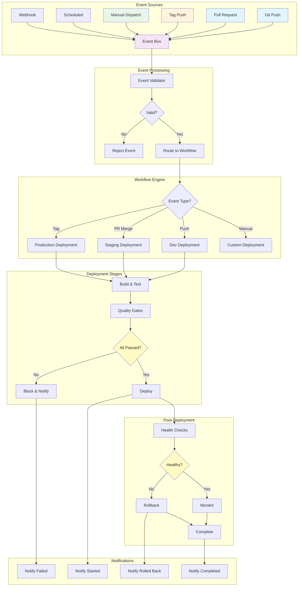

---

## Deployment State Machine

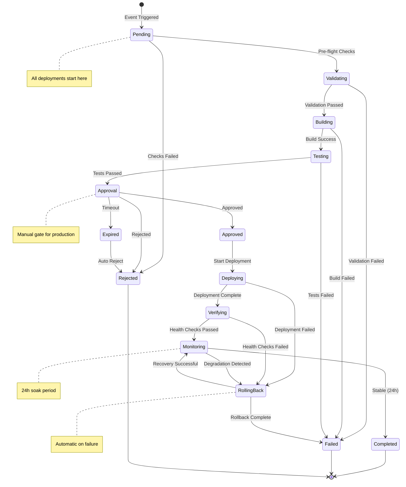

---

## Multi-Stage Promotion

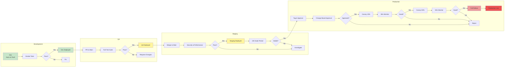

---

## Approval Gate Flow

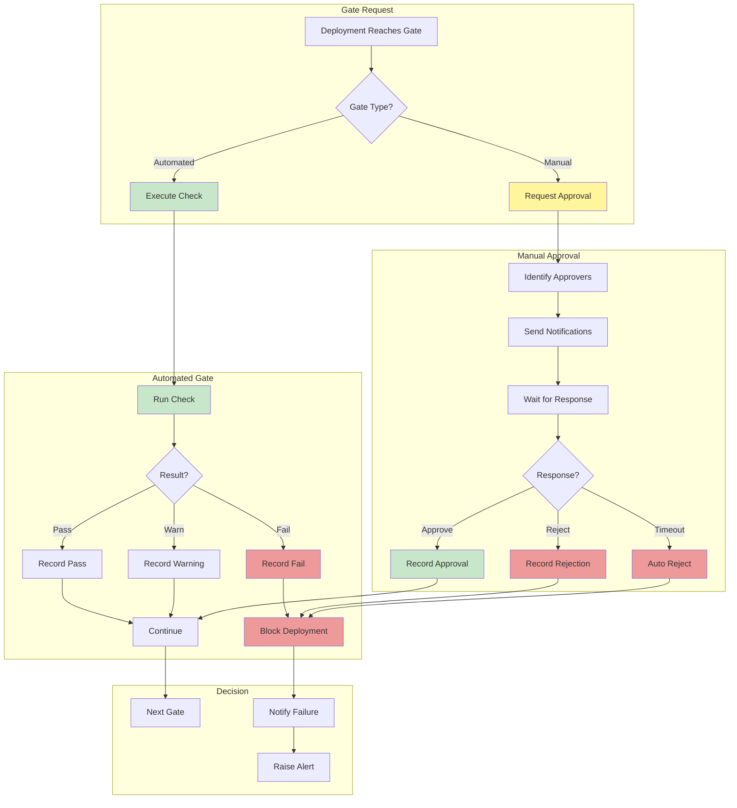

---

## Rollback Decision Tree

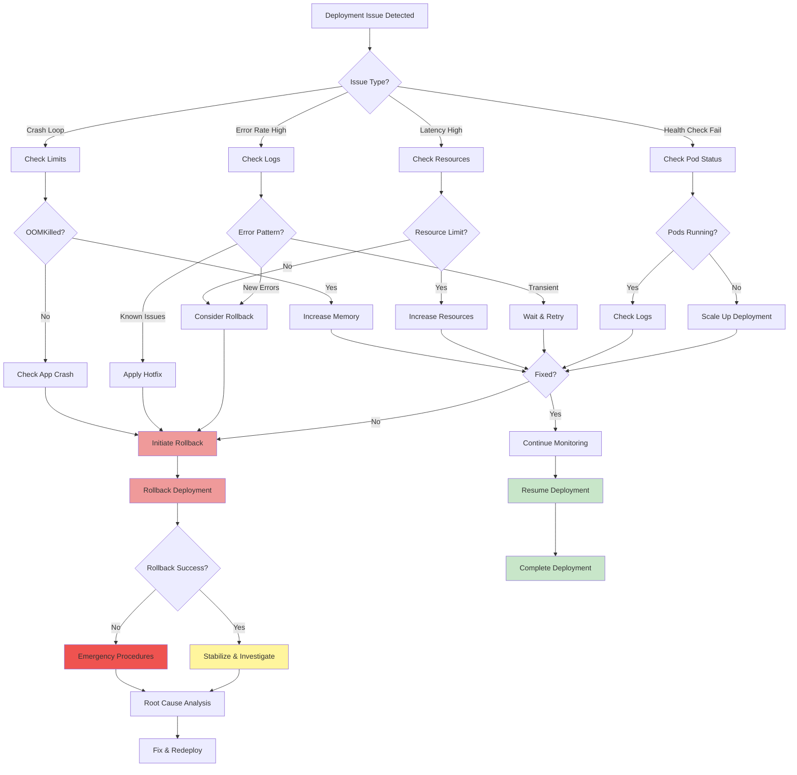

---

## Notification Flow

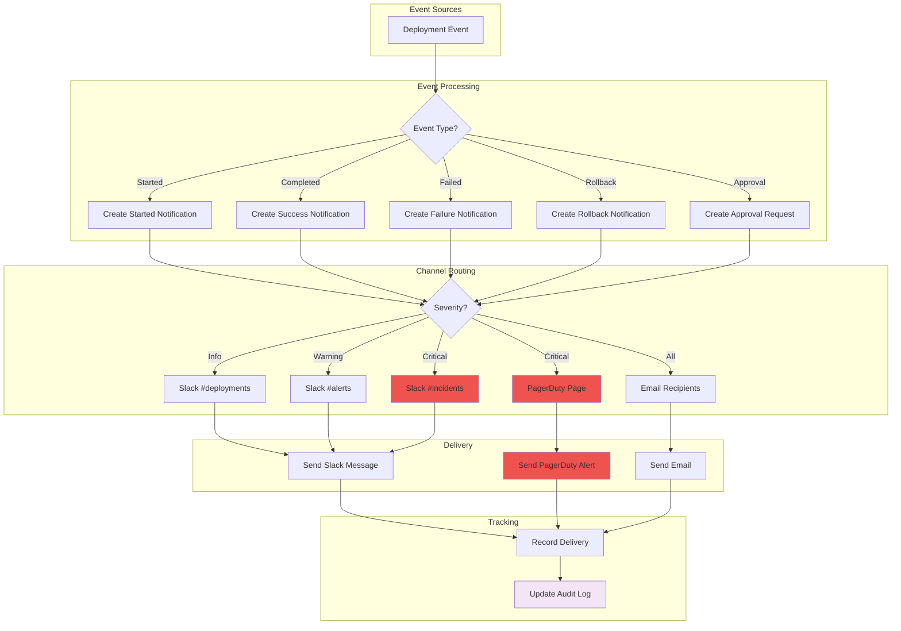

---

## Canary Deployment

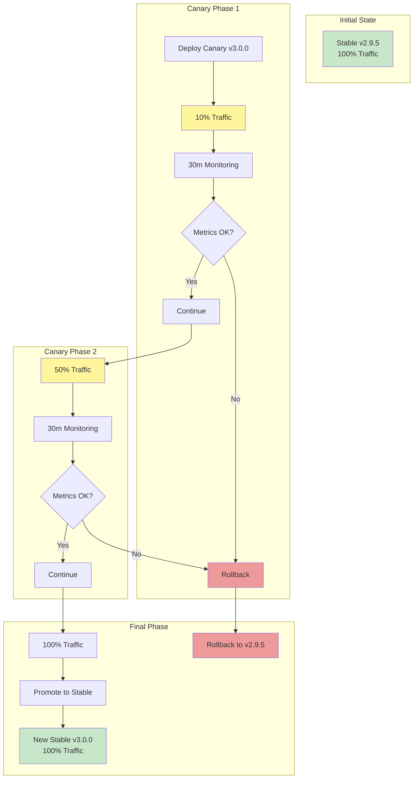

---

## Blue-Green Deployment

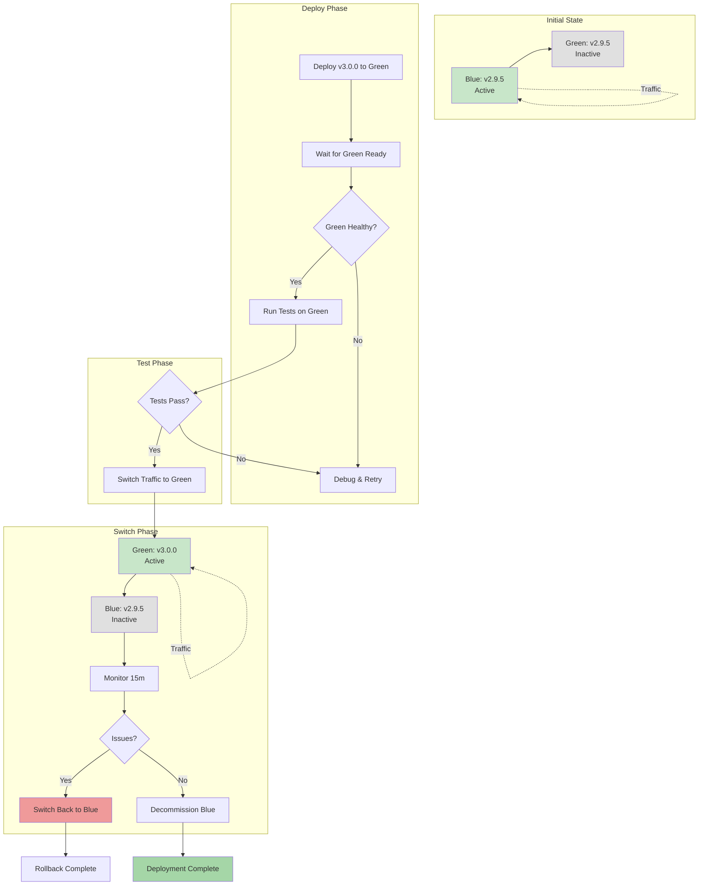

---

## Disaster Recovery

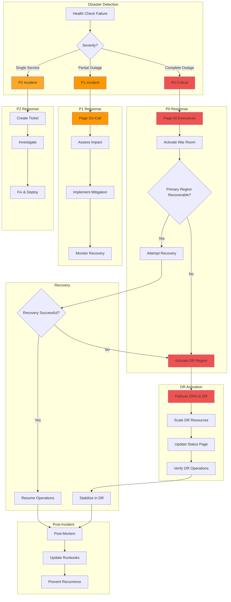

---

## Event Sequence Diagram

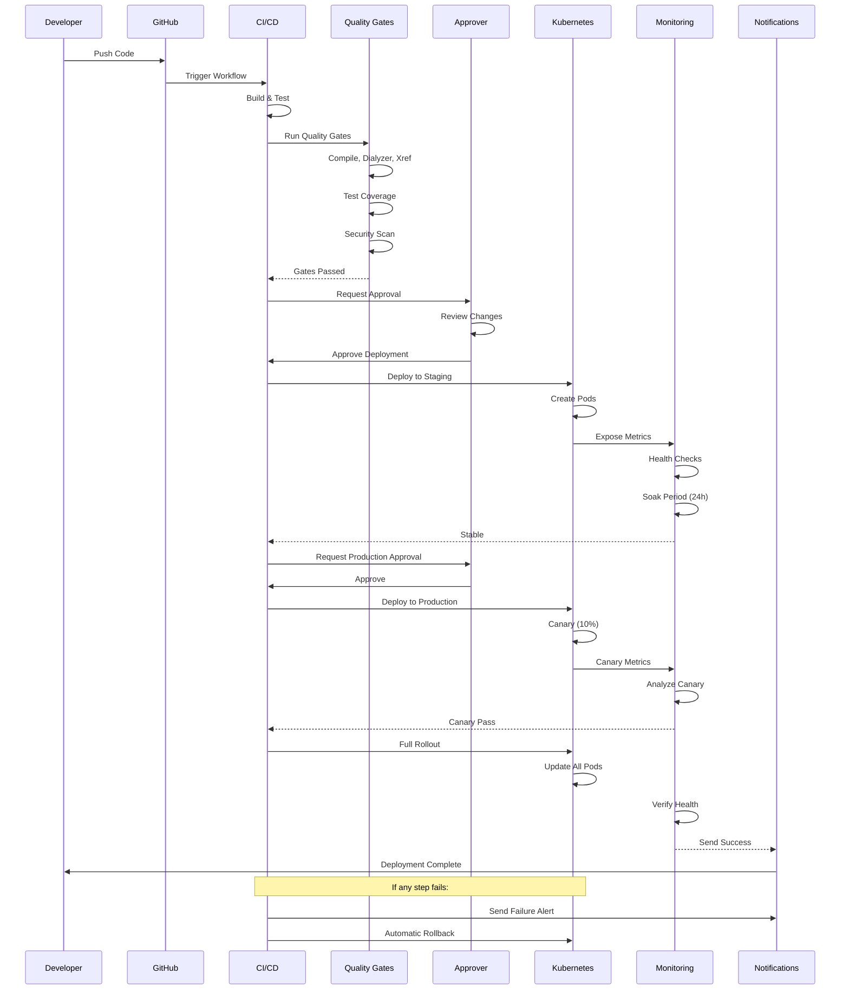

---

## Environment Promotion Flow

```mermaid
graph LR
    subgraph "Code Flow"
        A[Feature Branch] --> B[PR to Main]
        B --> C[Merge to Main]
    end

    subgraph "Deployment Flow"
        C --> D[Auto Deploy to Dev]
        D --> E[Dev Tests Pass?]
        E -->|Yes| F[Auto Deploy to QA]
        E -->|No| G[Fix & Retry]
        F --> H[QA Tests Pass?]
        H -->|Yes| I[Auto Deploy to Staging]
        H -->|No| G
        I --> J[Staging Soak 24h]
        J --> K{Stable?}
        K -->|Yes| L[Tag Release]
        K -->|No| M[Investigate]
        L --> N[Request Production Approval]
        N --> O[Approved?]
        O -->|Yes| P[Deploy to Production]
        O -->|No| Q[Reject]
        P --> R[Canary Rollout]
        R --> S[Full Production]
    end

    subgraph "Rollback Paths"
        S --> T{Issues?}
        T -->|Yes| U[Rollback]
        T -->|No| V[Complete]
        U --> W[Investigate]
    end

    style D fill:#c8e6c9
    style F fill:#c8e6c9
    style I fill:#fff59d
    style P fill:#fff59d
    style S fill:#ef9a9a
    style U fill:#ef5350
    style V fill:#a5d6a7
```

---

## How to Render These Diagrams

### Using Mermaid Live Editor
1. Copy the diagram code
2. Visit https://mermaid.live
3. Paste the code
4. Export as PNG/SVG

### Using VS Code
1. Install Mermaid Preview extension
2. Open this file
3. Right-click -> "Mermaid: Open Preview"

### Using GitHub
1. Commit this file to your repo
2. GitHub will render Mermaid diagrams automatically

### Using CLI
```bash
# Install mermaid-cli
npm install -g @mermaid-js/mermaid-cli

# Render diagram
mmdc -i diagrams.md -o output.png
```
