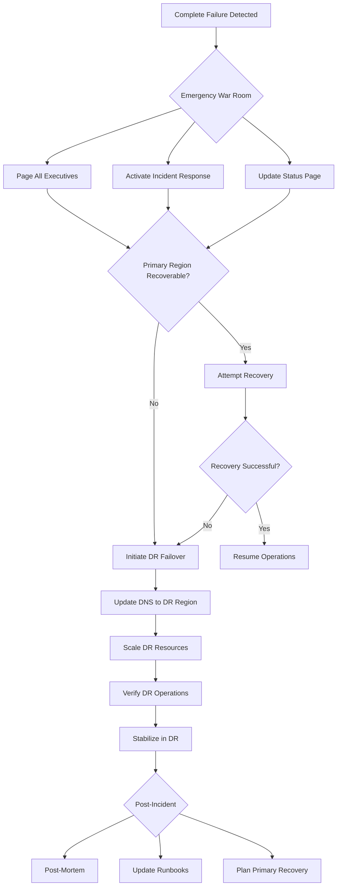
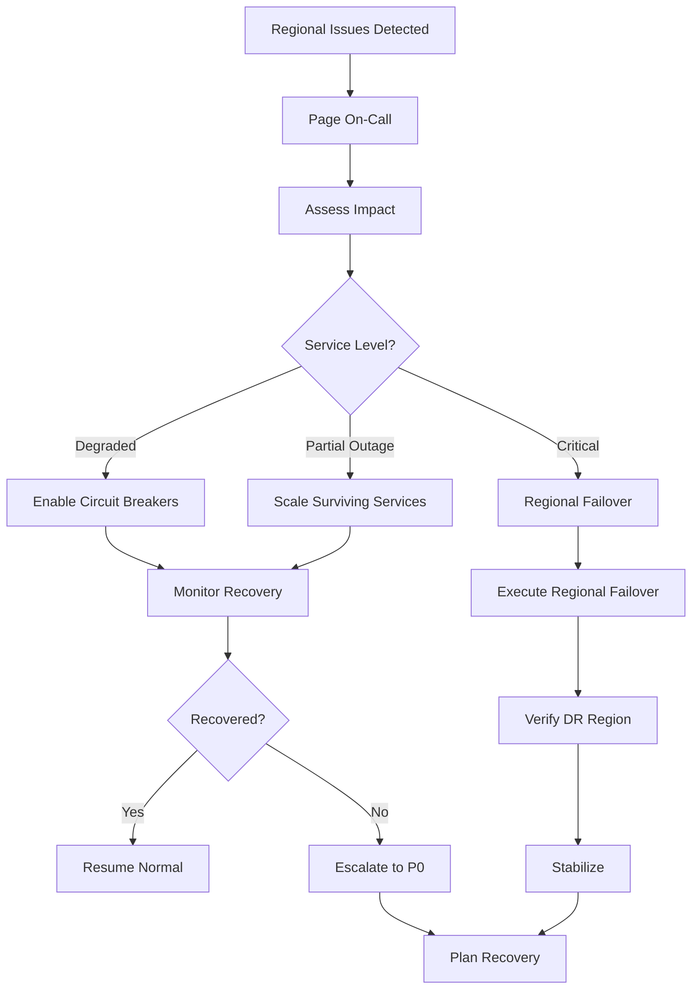
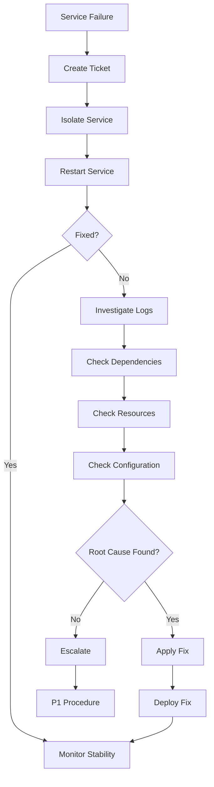
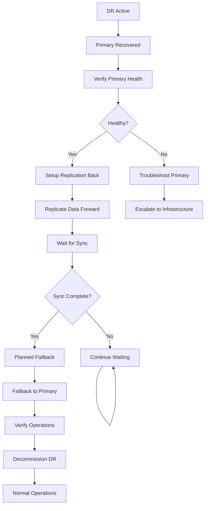

# erlmcp v3 Disaster Recovery Workflows

**Version:** 3.0.0
**Status:** Production Ready
**Last Updated:** 2026-02-02

---

## Table of Contents

1. [DR Architecture](#dr-architecture)
2. [Activation Triggers](#activation-triggers)
3. [DR Procedures](#dr-procedures)
4. [Failover Workflows](#failover-workflows)
5. [Recovery Procedures](#recovery-procedures)
6. [Testing & Drills](#testing--drills)

---

## DR Architecture

### Multi-Region Deployment

```
┌─────────────────────────────────────────────────────────────┐
│                    Global Load Balancer                     │
│                 (CloudFlare / AWS Route53)                  │
└────────────────────┬────────────────────────────────────────┘
                     │
        ┌────────────┴────────────┐
        │                         │
        ▼                         ▼
┌───────────────────┐     ┌───────────────────┐
│  Primary Region   │     │   DR Region       │
│  (us-east-1)      │     │   (us-west-2)     │
│                   │     │                   │
│  ┌─────────────┐ │     │  ┌─────────────┐  │
│  │ Kubernetes   │ │     │  │ Kubernetes   │  │
│  │ Cluster     │ │     │  │ Cluster     │  │
│  │ 3 nodes     │ │     │  │ 2 nodes     │  │
│  └─────────────┘ │     │  └─────────────┘  │
│  ┌─────────────┐ │     │  ┌─────────────┐  │
│  │ PostgreSQL  │ │     │  │ PostgreSQL  │  │
│  │ Primary     │ │     │  │ Standby     │  │
│  └─────────────┘ │     │  └─────────────┘  │
│  ┌─────────────┐ │     │  ┌─────────────┐  │
│  │ Redis       │ │     │  │ Redis       │  │
│  │ Cluster     │ │     │  │ Cluster     │  │
│  └─────────────┘ │     │  └─────────────┘  │
│  ┌─────────────┐ │     │  ┌─────────────┐  │
│  │ S3 Buckets  │ │     │  │ S3 Buckets  │  │
│  │ (Cross-Rep) │ │     │  │ (Cross-Rep) │  │
│  └─────────────┘ │     │  └─────────────┘  │
└───────────────────┘     └───────────────────┘
        │                         │
        └─────────────┬─────────┘
                      ▼
            ┌─────────────────────┐
            │   Monitoring &       │
            │   Alerting           │
            │   (Prometheus,       │
            │    Grafana, PD)      │
            └─────────────────────┘
```

### Data Replication Strategy

| Data Type | Replication | RPO | RTO |
|-----------|--------------|-----|-----|
| Application Data | Async streaming | < 1min | < 5min |
| Database (PostgreSQL) | Streaming replication | < 1min | < 5min |
| Cache (Redis) | Async replication | < 1min | < 5min |
| State (Mnesia) | Cross-region backup | < 5min | < 30min |
| Logs/Metrics | Multi-region | < 1min | N/A |
| Backup | Cross-region daily | 24h | < 1h |

---

## Activation Triggers

### Automatic Triggers

```yaml
automatic_dr_activation:
  regional_outage:
    detection_period: 5m
    conditions:
      - health_check_failures: ">= 50%"
      - region_unreachable: true
    action: activate_dr_region

  complete_failure:
    detection_period: 2m
    conditions:
      - all_endpoints_down: true
      - dns_unreachable: true
    action: emergency_procedures

  database_failure:
    detection_period: 1m
    conditions:
      - primary_db_unreachable: true
      - replication_lag: "> 5min"
    action: promote_standby_db

  data_corruption:
    detection_period: immediate
    conditions:
      - data_integrity_check: failed
      - checksum_mismatch: true
    action: restore_from_backup

  security_incident:
    detection_period: immediate
    conditions:
      - breach_detected: true
      - unauthorized_access: confirmed
    action: security_shutdown
```

### Manual Triggers

```yaml
manual_dr_activation:
  authorized_roles:
    - site_reliability_engineer
    - devops_lead
    - cto

  activation_steps:
    1. Page all executives
    2. Activate war room
    3. Assess situation
    4. Choose DR strategy
    5. Execute failover
    6. Verify DR operations
    7. Update status page

  required_approvals:
    - production_failover: 2 of 3
    - emergency_shutdown: CTO only
    - data_loss_incident: CTO + Security Lead
```

---

## DR Procedures

### P0 - Complete System Failure



**Procedure Steps:**

1. **Initial Response (0-5 minutes)**
   ```bash
   # 1. Declare incident
   pdectl incident create \
     --severity critical \
     --title "Complete System Outage" \
     --description "All services unreachable"

   # 2. Activate war room
   ./scripts/incident/activate-warroom.sh

   # 3. Update status page
   ./scripts/status/major-outage.sh

   # 4. Page all on-call
   ./scripts/paging/page-all.sh "P0 - Complete Outage"
   ```

2. **Assessment (5-15 minutes)**
   ```bash
   # Check primary region health
   ./scripts/dr/check-region.sh us-east-1

   # Check DR region health
   ./scripts/dr/check-region.sh us-west-2

   # Verify data replication status
   ./scripts/dr/check-replication.sh

   # Generate assessment report
   ./scripts/dr/assess-situation.sh > /tmp/dr-assessment.json
   ```

3. **Failover Decision (15-20 minutes)**
   ```bash
   # If primary unrecoverable
   ./scripts/dr/failover.sh us-west-2

   # This script:
   # - Updates DNS to point to DR region
   # - Scales up DR resources
   # - Promotes database standby
   # - Verifies all services
   ```

4. **Verification (20-30 minutes)**
   ```bash
   # Verify all endpoints
   ./scripts/dr/verify-endpoints.sh

   # Run smoke tests
   ./scripts/test/smoke-dr.sh

   # Verify metrics
   ./scripts/dr/check-metrics.sh
   ```

### P1 - Regional Degradation



**Procedure Steps:**

1. **Detection & Notification**
   ```bash
   # Automatic alert
   ./scripts/alerts/notify-p1.sh "Regional Degradation Detected"

   # Create incident ticket
   jira create --type Incident --priority High \
     --summary "Regional Degradation - us-east-1"
   ```

2. **Mitigation Actions**
   ```bash
   # Enable circuit breakers
   ./scripts/resilience/circuit-breaker-enable-all.sh

   # Scale surviving services
   kubectl scale deployment erlmcp -n erlmcp-prod --replicas=10

   # Enable degraded mode
   kubectl annotate ingress erlmcp -n erlmcp-prod \
     nginx.ingress.kubernetes.io/degraded-mode="true"
   ```

3. **Regional Failover (if needed)**
   ```bash
   # Partial failover - traffic only
   ./scripts/dr/failover-traffic.sh us-west-2

   # Full failover - compute and traffic
   ./scripts/dr/failover-full.sh us-west-2
   ```

### P2 - Service-Specific Failures



**Procedure Steps:**

1. **Isolation**
   ```bash
   # Remove from load balancer
   kubectl scale deployment <service> -n erlmcp-prod --replicas=0

   # Enable maintenance mode for service
   kubectl annotate service <service> -n erlmcp-prod \
     maintenance="true"
   ```

2. **Diagnosis**
   ```bash
   # Check logs
   kubectl logs -n erlmcp-prod -l app=<service> --tail=1000

   # Check resource usage
   kubectl top pods -n erlmcp-prod -l app=<service>

   # Check dependencies
   kubectl get pods -n erlmcp-prod -o wide
   ```

3. **Fix**
   ```bash
   # Apply fix
   kubectl set image deployment/<service> \
     <container>=<image>:<fixed-version> -n erlmcp-prod

   # Scale back up
   kubectl scale deployment <service> -n erlmcp-prod --replicas=3
   ```

---

## Failover Workflows

### Database Failover

```erlang
%% Database failover supervisor
-module(erlmcp_dr_database).
-behaviour(gen_server).

%% API
-export([
    failover/0,
    promote_standby/0,
    verify_replication/0,
    revert_failover/0
]).

%% @doc Execute database failover to standby
-spec failover() -> {ok, State :: map()} | {error, Reason :: term()}.
failover() ->
    gen_server:call(?MODULE, failover, 30000).

%% @doc Promote standby to primary
-spec promote_standby() -> ok | {error, Reason :: term()}.
promote_standby() ->
    % 1. Verify standby is healthy
    {ok, StandbyHealth} = check_standby_health(),

    % 2. Stop replication on standby
    ok = stop_replication(),

    % 3. Promote standby to primary
    ok = promote_standby(),

    % 4. Update application configuration
    ok = update_database_config(standby),

    % 5. Restart applications
    ok = restart_applications(),

    % 6. Verify new primary
    {ok, _} = verify_primary(),

    ok.

%% @doc Verify replication lag is acceptable
-spec verify_replication() -> {ok, LagSeconds :: integer()} | {error, term()}.
verify_replication() ->
    case pgquery:query("SELECT pg_last_wal_receive_lsn() - pg_last_wal_replay_lsn() AS lag", []) of
        {ok, #{rows := [{Lag}]}} when Lag =< 60 ->
            {ok, Lag};
        {ok, #{rows := [{Lag}]}} ->
            {error, {replication_lag_too_high, Lag}};
        {error, Reason} ->
            {error, Reason}
    end.
```

### Application Failover

```bash
#!/bin/bash
# scripts/dr/failover-application.sh

set -euo pipefail

DR_REGION="${1:-us-west-2}"
PRIMARY_REGION="${2:-us-east-1}"

echo "=== Application Failover to ${DR_REGION} ==="

# 1. Verify DR cluster is healthy
echo "Checking DR cluster health..."
kubectl get nodes -l "topology.kubernetes.io/region=${DR_REGION}"

# 2. Scale up DR applications
echo "Scaling up DR applications..."
kubectl scale deployment erlmcp -n erlmcp-${DR_REGION} --replicas=5

# 3. Wait for DR pods to be ready
echo "Waiting for DR pods to be ready..."
kubectl wait --for=condition=available deployment/erlmcp \
  -n erlmcp-${DR_REGION} --timeout=10m

# 4. Update DNS to point to DR region
echo "Updating DNS..."
./scripts/dns/update.sh --region="${DR_REGION}"

# 5. Verify services are accessible
echo "Verifying services..."
./scripts/dr/verify-services.sh "${DR_REGION}"

# 6. Update load balancer
echo "Updating load balancer..."
kubectl apply -f manifests/dr/ingress-${DR_REGION}.yaml

# 7. Verify end-to-end
echo "Running smoke tests..."
./scripts/test/smoke.sh "${DR_REGION}"

echo "=== Failover Complete ==="
echo "Primary: ${PRIMARY_REGION} -> DR: ${DR_REGION}"
```

---

## Recovery Procedures

### Primary Region Recovery



**Procedure Steps:**

1. **Prepare Primary Region**
   ```bash
   # Fix root cause in primary
   # (Depends on failure reason)

   # Verify primary infrastructure
   ./scripts/dr/verify-primary.sh

   # Scale up primary applications
   kubectl scale deployment erlmcp -n erlmcp-prod --replicas=5
   ```

2. **Establish Replication**
   ```bash
   # Set up replication from DR to primary
   # (Reverse replication direction)
   ./scripts/database/setup-reverse-replication.sh

   # Wait for data sync
   ./scripts/database/wait-for-sync.sh
   ```

3. **Planned Failback**
   ```bash
   # Schedule maintenance window
   # Notify users of brief interruption

   # Execute failback
   ./scripts/dr/failback.sh us-east-1

   # This script:
   # - Updates DNS gradually
   # - Shifts traffic back
   # - Monitors for issues
   # - Rolls back if problems detected
   ```

---

## Testing & Drills

### Quarterly DR Drill

```yaml
drill_schedule:
  frequency: quarterly
  duration: 4 hours
  participants:
    - sre_team
    - devops_team
    - security_team
    - product_team
  notification: 2 weeks in advance

drill_phases:
  - name: Preparation
    duration: 30m
    tasks:
      - Announce drill
      - Set up drill environment
      - Prepare checklist

  - name: Simulation
    duration: 60m
    tasks:
      - Simulate primary failure
      - Execute failover procedures
      - Verify DR operations

  - name: Validation
    duration: 90m
    tasks:
      - Run smoke tests in DR
      - Verify data integrity
      - Check metrics and logs

  - name: Failback
    duration: 60m
    tasks:
      - Restore primary
      - Execute failback
      - Verify normal operations

  - name: Review
    duration: 60m
    tasks:
      - Document findings
      - Update procedures
      - Create action items
```

### DR Drill Checklist

```markdown
# DR Drill Checklist - Q1 2026

## Pre-Drill
- [ ] Drill announced 2 weeks in advance
- [ ] All participants confirmed availability
- [ ] Drill environment prepared
- [ ] Monitoring dashboards ready
- [ ] Communication channels established

## Drill Execution
- [ ] Primary failure simulated at [time]
- [ ] Failover initiated at [time]
- [ ] DNS update completed
- [ ] DR services verified healthy
- [ ] Smoke tests passed
- [ ] Data integrity verified
- [ ] Failback initiated at [time]
- [ ] Primary restored
- [ ] Normal operations resumed

## Post-Drill
- [ ] All findings documented
- [ ] Action items assigned
- [ ] Procedures updated
- [ ] Follow-up meeting scheduled
- [ ] Report filed
```

### Failover Test Script

```bash
#!/bin/bash
# scripts/dr/test-failover.sh

set -euo pipefail

DRILL_MODE="${1:-dry-run}"  # dry-run or live

echo "=== DR Failover Test (${DRILL_MODE}) ==="

if [[ "$DRILL_MODE" == "live" ]]; then
    # 1. Create drill record
    DRILL_ID=$(./scripts/dr/create-drill-record.sh)
    echo "Drill ID: $DRILL_ID"

    # 2. Notify participants
    ./scripts/notifications/notify-drill.sh "$DRILL_ID"

    # 3. Set primary to maintenance mode
    kubectl annotate ingress erlmcp -n erlmcp-prod \
      nginx.ingress.kubernetes.io/maintenance="true"
fi

# 4. Verify DR readiness
echo "Verifying DR readiness..."
./scripts/dr/verify-readiness.sh

# 5. Test failover (dry-run or live)
echo "Testing failover..."
if [[ "$DRILL_MODE" == "dry-run" ]]; then
    ./scripts/dr/failover.sh us-west-2 --dry-run
else
    ./scripts/dr/failover.sh us-west-2
fi

# 6. Verify operations
echo "Verifying DR operations..."
./scripts/dr/verify-operations.sh us-west-2

# 7. Test failback
echo "Testing failback..."
if [[ "$DRILL_MODE" == "dry-run" ]]; then
    ./scripts/dr/failback.sh us-east-1 --dry-run
else
    ./scripts/dr/failback.sh us-east-1
fi

# 8. Generate report
echo "Generating drill report..."
./scripts/dr/drill-report.sh > "/tmp/dr-drill-$(date +%Y%m%d).txt"

# 9. Cleanup
if [[ "$DRILL_MODE" == "live" ]]; then
    # Remove maintenance mode
    kubectl annotate ingress erlmcp -n erlmcp-prod \
      nginx.ingress.kubernetes.io/maintenance- || true
fi

echo "=== DR Failover Test Complete ==="
```

---

## Communication Templates

### DR Activation Notification

```markdown
## 🚨 DR ACTIVATION INITIATED

**Time:** {{timestamp}}
**Severity:** {{severity}}
**Trigger:** {{trigger_reason}}

### Action Taken
- DR Region: {{dr_region}}
- Failover Type: {{failover_type}}
- Estimated Downtime: {{estimated_downtime}}

### Current Status
- Primary Region: {{primary_status}}
- DR Region: {{dr_status}}
- User Impact: {{user_impact}}

### Next Steps
1. Verify services at {{dr_region_url}}
2. Monitor dashboard: {{dashboard_url}}
3. Join war room: {{war_room_url}}

### Updates will be posted every 15 minutes
---
*DR System - erlmcp v3*
```

### DR Recovery Notification

```markdown
## ✅ DR RECOVERY COMPLETE

**Time:** {{timestamp}}
**Duration:** {{outage_duration}}

### Recovery Summary
- Primary Region: {{primary_region}}
- DR Region: {{dr_region}}
- Root Cause: {{root_cause}}
- Resolution: {{resolution}}

### Verification
- [x] All services operational
- [x] Data integrity verified
- [x] Metrics normal
- [x] No data loss

### Post-Incident
- Post-mortem scheduled: {{postmortem_date}}
- Report: {{report_url}}
- Action items: {{action_items_url}}

---
*Thank you for your patience*
```
