# erlmcp v3.0.0 Component Diagrams
## Visual Architecture Reference

**Version**: 3.0.0
**Date**: 2026-01-31
**OTP Requirement**: 28.3.1+

---

## Overview

This document provides visual diagrams for the erlmcp v3.0.0 architecture, including:
- Component hierarchy
- Data flow diagrams
- Deployment patterns
- Mermaid diagrams for documentation

---

## 1. System Architecture Overview

```
┌─────────────────────────────────────────────────────────────────────────┐
│                          erlmcp v3.0.0                                  │
│                     (OSS Release - Apache-2.0)                          │
└─────────────────────────────────────────────────────────────────────────┘
                                    │
        ┌───────────────────────────┼───────────────────────────┐
        │                           │                           │
        ▼                           ▼                           ▼
┌───────────────┐         ┌──────────────┐         ┌──────────────┐
│ erlmcp_core   │         │ erlmcp_...  │         │ erlmcp_...  │
│  (108 mod)    │         │transports    │         │observability│
│               │         │ (28 mod)     │         │ (38 mod)     │
│ ┌───────────┐ │         │              │         │              │
│ │ Protocol  │ │         │ ┌────────┐   │         │ ┌────────┐  │
│ │ JSON-RPC │ │         │ │ STDIO  │   │         │ │ Metrics│  │
│ │ MCP      │ │         │ │ TCP    │   │         │ │ OTEL   │  │
│ └───────────┘ │         │ │ HTTP   │   │         │ │ Health │  │
│ ┌───────────┐ │         │ │ WS     │   │         │ │ Chaos  │  │
│ │ Client   │ │         │ │ SSE    │   │         │ └────────┘  │
│ │ Server   │ │         │ └────────┘   │         │              │
│ └───────────┘ │         │              │         │              │
│ ┌───────────┐ │         │ ┌────────┐   │         │ ┌────────┐  │
│ │ Registry │ │         │ │ Pool   │   │         │ │Receipts│  │
│ │ (gproc)  │ │         │ │ Ranch  │   │         │ │Audit   │  │
│ └───────────┘ │         │ │ Gun    │   │         │ └────────┘  │
│ ┌───────────┐ │         │ └────────┘   │         │              │
│ │Sessions  │ │         │              │         │              │
│ │Protection│ │         │              │         │              │
│ └───────────┘ │         │              │         │              │
└───────────────┘         └──────────────┘         └──────────────┘
        │                           │                           │
        └───────────────────────────┼───────────────────────────┘
                                    │
        ┌───────────────────────────┼───────────────────────────┐
        │                           │                           │
        ▼                           ▼                           ▼
┌───────────────┐         ┌──────────────┐         ┌──────────────┐
│erlmcp_valid.. │         │ External     │         │ [OPTIONAL]   │
│  (16 mod)     │         │ Libraries    │         │ tcps_erlmcp  │
│               │         │              │         │ (63 mod)     │
│ ┌───────────┐ │         │ ┌────────┐   │         │              │
│ │ Protocol │ │         │ │ gproc  │   │         │ ┌────────┐  │
│ │Transport │ │         │ │ jesse  │   │         │ │ Quality│  │
│ │ Security │ │         │ │ jose   │   │         │ │ SHACL  │  │
│ │Perf      │ │         │ │ gun    │   │         │ │ Gates  │  │
│ └───────────┘ │         │ │ ranch  │   │         │ │ Kanban │  │
│               │         │ │ cowboy │   │         │ │ SKU    │  │
└───────────────┘         │ │ OTEL   │   │         │ └────────┘  │
                          │ └────────┘   │         │              │
                          │              │         │              │
                          └──────────────┘         └──────────────┘
```

---

## 2. Message Flow: Client Request

```
┌─────────────────────────────────────────────────────────────────────────┐
│                         Client Request Flow                              │
└─────────────────────────────────────────────────────────────────────────┘

Application Code
       │
       │ 1. API Call
       ▼
┌─────────────────────────────────────────────────────────────────────────┐
│ erlmcp_client (gen_server)                                             │
│                                                                         │
│  ┌───────────────────────────────────────────────────────────────────┐│
│  │ State:                                                             ││
│  │   - transport_module: erlmcp_transport_tcp                         ││
│  │   - transport_state: #{socket => Socket}                           ││
│  │   - capabilities: #{tools => true, resources => true}              ││
│  │   - request_id: 123                                                ││
│  │   - pending_requests: #{123 => {From, Timestamp}}                  ││
│  └───────────────────────────────────────────────────────────────────┘│
│                                                                         │
│  2. Generate Request ID                                               │
│  3. Store pending request                                             │
│  4. Encode JSON-RPC request                                           │
└─────────────────────────────────────────────────────────────────────────┘
       │
       │ 5. Encoded Message
       ▼
┌─────────────────────────────────────────────────────────────────────────┐
│ erlmcp_json_rpc                                                        │
│                                                                         │
│  {                                                                   │
│    "jsonrpc": "2.0",                                                  │
│    "id": 123,                                                         │
│    "method": "tools/call",                                            │
│    "params": {                                                        │
│      "name": "my_tool",                                               │
│      "arguments": {...}                                               │
│    }                                                                  │
│  }                                                                    │
└─────────────────────────────────────────────────────────────────────────┘
       │
       │ 6. Send via Transport
       ▼
┌─────────────────────────────────────────────────────────────────────────┐
│ erlmcp_transport_tcp (ranch)                                           │
│                                                                         │
│  Socket = ranch_tcp:handshake(TransportState)                          │
│  ok = gen_tcp:send(Socket, EncodedMessage)                              │
│                                                                         │
│  ┌───────────────────────────────────────────────────────────────────┐│
│  │ Network I/O: TCP socket write                                     ││
│  └───────────────────────────────────────────────────────────────────┘│
└─────────────────────────────────────────────────────────────────────────┘
       │
       │ 7. Network Transmission
       ▼
┌─────────────────────────────────────────────────────────────────────────┐
│ Server (Remote)                                                        │
│                                                                         │
│  8. Receive request                                                   │
│  9. Execute tool                                                      │
│  10. Generate response                                                │
└─────────────────────────────────────────────────────────────────────────┘
       │
       │ 11. Response Message
       ▼
┌─────────────────────────────────────────────────────────────────────────┐
│ erlmcp_transport_tcp (ranch)                                           │
│                                                                         │
│  12. Receive data from socket                                         │
│  13. Route to client via registry                                     │
└─────────────────────────────────────────────────────────────────────────┘
       │
       │ 14. Route: gproc lookup
       ▼
┌─────────────────────────────────────────────────────────────────────────┐
│ erlmcp_registry (gproc)                                                │
│                                                                         │
│  gproc:lookup_local_name({mcp, client, ClientId}) -> Pid               │
│                                                                         │
│  15. Forward to client process                                         │
└─────────────────────────────────────────────────────────────────────────┘
       │
       │ 16. gen_server:cast(response)
       ▼
┌─────────────────────────────────────────────────────────────────────────┐
│ erlmcp_client (gen_server)                                             │
│                                                                         │
│  17. Match request ID to pending request                              │
│  18. Decode JSON-RPC response                                         │
│  19. Reply to caller                                                  │
│  20. Record metrics                                                   │
└─────────────────────────────────────────────────────────────────────────┘
       │
       │ 21. Return result
       ▼
 Application Code
```

---

## 3. Message Flow: Server Request Handling

```
┌─────────────────────────────────────────────────────────────────────────┐
│                      Server Request Handling Flow                        │
└─────────────────────────────────────────────────────────────────────────┘

Client (Remote)
       │
       │ 1. Request Message (JSON-RPC)
       ▼
┌─────────────────────────────────────────────────────────────────────────┐
│ erlmcp_transport_tcp (ranch)                                           │
│                                                                         │
│  2. Receive data from socket                                           │
│  3. Route to server via registry                                       │
└─────────────────────────────────────────────────────────────────────────┘
       │
       │ 4. Route: gproc lookup
       ▼
┌─────────────────────────────────────────────────────────────────────────┐
│ erlmcp_registry (gproc)                                                │
│                                                                         │
│  gproc:lookup_local_name({mcp, server, ServerId}) -> Pid               │
│                                                                         │
│  5. Forward to server process                                          │
└─────────────────────────────────────────────────────────────────────────┘
       │
       │ 6. gen_server:cast(request)
       ▼
┌─────────────────────────────────────────────────────────────────────────┐
│ erlmcp_server (gen_server)                                             │
│                                                                         │
│  ┌───────────────────────────────────────────────────────────────────┐│
│  │ State:                                                             ││
│  │   - transport_module: erlmcp_transport_tcp                         ││
│  │   - transport_state: #{listener => Listener}                       ││
│  │   - tools: #{my_tool => #tool{...}}                                ││
│  │   - resources: #{my_resource => #resource{...}}                    ││
│  │   - prompts: #{my_prompt => #prompt{...}}                          ││
│  └───────────────────────────────────────────────────────────────────┘│
│                                                                         │
│  7. Decode JSON-RPC request                                            │
│  8. Validate request                                                   │
│  9. Route to handler (tool/resource/prompt)                            │
└─────────────────────────────────────────────────────────────────────────┘
       │
       │ 10. Execute handler
       ▼
┌─────────────────────────────────────────────────────────────────────────┐
│ Handler Function (User-Provided)                                       │
│                                                                         │
│  11. Execute business logic                                            │
│  12. Generate result                                                   │
└─────────────────────────────────────────────────────────────────────────┘
       │
       │ 13. Result
       ▼
┌─────────────────────────────────────────────────────────────────────────┐
│ erlmcp_server (gen_server)                                             │
│                                                                         │
│  14. Encode JSON-RPC response                                          │
│  15. Send response via transport                                       │
│  16. Record metrics                                                    │
└─────────────────────────────────────────────────────────────────────────┘
       │
       │ 17. Send response
       ▼
┌─────────────────────────────────────────────────────────────────────────┐
│ erlmcp_transport_tcp (ranch)                                           │
│                                                                         │
│  ok = gen_tcp:send(Socket, Response)                                    │
└─────────────────────────────────────────────────────────────────────────┘
       │
       │ 18. Response
       ▼
 Client (Remote)
```

---

## 4. Deployment Patterns

### Minimal Deployment

```
┌─────────────────────────────────────────────────────────────────────────┐
│                    Minimal Deployment (50MB)                            │
│                       Core OSS Components                               │
└─────────────────────────────────────────────────────────────────────────┘

┌─────────────────────────────────────────────────────────────────────────┐
│ Single Node Deployment                                                 │
│                                                                         │
│  ┌─────────────────────────────────────────────────────────────────┐   │
│  │ erlmcp Core                                                     │   │
│  │                                                                 │   │
│  │  ┌───────────┐  ┌───────────┐  ┌───────────┐  ┌───────────┐    │   │
│  │  │  Client   │  │  Server   │  │ Registry  │  │ Sessions  │    │   │
│  │  └───────────┘  └───────────┘  └───────────┘  └───────────┘    │   │
│  │                                                                 │   │
│  │  ┌───────────┐  ┌───────────┐  ┌───────────┐  ┌───────────┐    │   │
│  │  │   STDIO   │  │    TCP    │  │   HTTP    │  │   WS      │    │   │
│  │  └───────────┘  └───────────┘  └───────────┘  └───────────┘    │   │
│  │                                                                 │   │
│  │  ┌───────────┐  ┌───────────┐                                   │   │
│  │  │  Metrics  │  │  Health   │                                   │   │
│  │  └───────────┘  └───────────┘                                   │   │
│  └─────────────────────────────────────────────────────────────────┘   │
│                                                                         │
│  Capacity: 10K concurrent connections                                  │
│  Performance: 2.5M ops/sec                                             │
│  Use Case: Development, small deployments                              │
└─────────────────────────────────────────────────────────────────────────┘
```

### Standard Deployment

```
┌─────────────────────────────────────────────────────────────────────────┐
│                   Standard Deployment (75MB)                             │
│                      Full OSS Components                                │
└─────────────────────────────────────────────────────────────────────────┘

┌─────────────────────────────────────────────────────────────────────────┐
│ Single Node Deployment (Full Features)                                  │
│                                                                         │
│  ┌─────────────────────────────────────────────────────────────────┐   │
│  │ erlmcp Core + Observability                                     │   │
│  │                                                                 │   │
│  │  ┌───────────┐  ┌───────────┐  ┌───────────┐  ┌───────────┐    │   │
│  │  │  Client   │  │  Server   │  │ Registry  │  │ Sessions  │    │   │
│  │  └───────────┘  └───────────┘  └───────────┘  └───────────┘    │   │
│  │                                                                 │   │
│  │  ┌───────────┐  ┌───────────┐  ┌───────────┐  ┌───────────┐    │   │
│  │  │   STDIO   │  │    TCP    │  │   HTTP    │  │   WS      │    │   │
│  │  └───────────┘  └───────────┘  └───────────┘  └───────────┘    │   │
│  │                                                                 │   │
│  │  ┌───────────┐  ┌───────────┐  ┌───────────┐  ┌───────────┐    │   │
│  │  │   SSE     │  │   OTEL    │  │  Metrics  │  │  Chaos    │    │   │
│  │  └───────────┘  └───────────┘  └───────────┘  └───────────┘    │   │
│  │                                                                 │   │
│  │  ┌───────────┐  ┌───────────┐  ┌───────────┐                    │   │
│  │  │  Health   │  │ Dashboard │  │  Receipts │                    │   │
│  │  └───────────┘  └───────────┘  └───────────┘                    │   │
│  └─────────────────────────────────────────────────────────────────┘   │
│                                                                         │
│  Capacity: 50K concurrent connections                                  │
│  Performance: 2.7M ops/sec                                             │
│  Use Case: Production deployments                                      │
└─────────────────────────────────────────────────────────────────────────┘
```

### Enterprise Deployment (Clustered)

```
┌─────────────────────────────────────────────────────────────────────────┐
│                Enterprise Deployment (100MB - Clustered)                │
│                    OSS + Commercial Components                          │
└─────────────────────────────────────────────────────────────────────────┘

┌─────────────────────────────────────────────────────────────────────────┐
│ Node 1 (Primary)                                                       │
│                                                                         │
│  ┌─────────────────────────────────────────────────────────────────┐   │
│  │ erlmcp Core + Observability + Cluster                            │   │
│  │                                                                 │   │
│  │  ┌───────────┐  ┌───────────┐  ┌───────────┐  ┌───────────┐    │   │
│  │  │  Client   │  │  Server   │  │ Registry  │  │ Cluster   │    │   │
│  │  └───────────┘  └───────────┘  └───────────┘  └───────────┘    │   │
│  │                                                                 │   │
│  │  ┌───────────┐  ┌───────────┐  ┌───────────┐  ┌───────────┐    │   │
│  │  │  Metrics  │  │  Health   │  │  Receipts │  │   TCPS    │    │   │
│  │  └───────────┘  └───────────┘  └───────────┘  └───────────┘    │   │
│  └─────────────────────────────────────────────────────────────────┘   │
└─────────────────────────────────────────────────────────────────────────┘

┌─────────────────────────────────────────────────────────────────────────┐
│ Node 2 (Replica)                                                        │
│                                                                         │
│  ┌─────────────────────────────────────────────────────────────────┐   │
│  │ erlmcp Core + Observability + Cluster                            │   │
│  │                                                                 │   │
│  │  ┌───────────┐  ┌───────────┐  ┌───────────┐  ┌───────────┐    │   │
│  │  │  Client   │  │  Server   │  │ Registry  │  │ Cluster   │    │   │
│  │  └───────────┘  └───────────┘  └───────────┘  └───────────┘    │   │
│  │                                                                 │   │
│  │  ┌───────────┐  ┌───────────┐  ┌───────────┐  ┌───────────┐    │   │
│  │  │  Metrics  │  │  Health   │  │  Receipts │  │   TCPS    │    │   │
│  │  └───────────┘  └───────────┘  └───────────┘  └───────────┘    │   │
│  └─────────────────────────────────────────────────────────────────┘   │
└─────────────────────────────────────────────────────────────────────────┘

┌─────────────────────────────────────────────────────────────────────────┐
│ Node 3 (Replica)                                                        │
│                                                                         │
│  ┌─────────────────────────────────────────────────────────────────┐   │
│  │ erlmcp Core + Observability + Cluster                            │   │
│  │                                                                 │   │
│  │  ┌───────────┐  ┌───────────┐  ┌───────────┐  ┌───────────┐    │   │
│  │  │  Client   │  │  Server   │  │ Registry  │  │ Cluster   │    │   │
│  │  └───────────┘  └───────────┘  └───────────┘  └───────────┘    │   │
│  │                                                                 │   │
│  │  ┌───────────┐  ┌───────────┐  ┌───────────┐  ┌───────────┐    │   │
│  │  │  Metrics  │  │  Health   │  │  Receipts │  │   TCPS    │    │   │
│  │  └───────────┘  └───────────┘  └───────────┘  └───────────┘    │   │
│  └─────────────────────────────────────────────────────────────────┘   │
└─────────────────────────────────────────────────────────────────────────┘

        │                     │                     │
        └─────────────────────┴─────────────────────┘
                              │
                    Mnesia Cluster Sync
                    gproc Distributed Registry
                              │
                    ┌─────────────────────┐
                    │  Shared Session DB  │
                    │  (Distributed)      │
                    └─────────────────────┘

  Capacity: 100K+ concurrent connections (across cluster)
  Performance: 3M+ ops/sec (aggregated)
  Use Case: Enterprise, high-availability
```

---

## 5. Data Flow: Resource Subscription

```
┌─────────────────────────────────────────────────────────────────────────┐
│                   Resource Subscription Flow                            │
└─────────────────────────────────────────────────────────────────────────┘

Client                            Server
  │                                 │
  │ 1. subscribe(resource_uri)      │
  ├─────────────────────────────────>│
  │                                 │ 2. Store subscription
  │                                 │    erlmcp_resource_subscriptions
  │                                 │
  │ 3. {ok, subscription_id}        │
  │<─────────────────────────────────┤
  │                                 │
  │                                 │ 4. Resource changes (external)
  │                                 │    (e.g., file modified)
  │                                 │
  │                                 │ 5. Detect change
  │                                 │
  │ 6. notification                 │
  │    {method: "resources/notify",  │
  │     params: {                   │
  │       uri: resource_uri,        │
  │       change: "updated"         │
  │     }}                          │
  │<─────────────────────────────────┤
  │                                 │
  │ 7. Process notification         │
  │                                 │
  │ 8. get_resource(uri)            │
  ├─────────────────────────────────>│
  │                                 │
  │ 9. {ok, resource_content}       │
  │<─────────────────────────────────┤
  │                                 │
  │ 10. unsubscribe(subscription_id)│
  ├─────────────────────────────────>│
  │                                 │ 11. Remove subscription
```

---

## 6. Data Flow: Tool Execution with Progress

```
┌─────────────────────────────────────────────────────────────────────────┐
│                   Tool Execution with Progress                          │
└─────────────────────────────────────────────────────────────────────────┘

Client                            Server
  │                                 │
  │ 1. call_tool(name, args,        │
  │            progress_token)      │
  ├─────────────────────────────────>│
  │                                 │ 2. Start execution
  │                                 │
  │ 3. {ok, call_id}                │
  │<─────────────────────────────────┤
  │                                 │
  │                                 │ 4. Progress update (10%)
  │ 5. progress notification        │
  │    {method: "notifications/...",│
  │     params: {                   │
  │       progress: 0.1,            │
  │       message: "Processing..."  │
  │     }}                          │
  │<─────────────────────────────────┤
  │                                 │
  │                                 │ 6. Progress update (50%)
  │ 7. progress notification        │
  │<─────────────────────────────────┤
  │                                 │
  │                                 │ 8. Execution complete
  │ 9. result                       │
  │    {method: "tools/call",       │
  │     result: {                   │
  │       content: [...],           │
  │       isError: false            │
  │     }}                          │
  │<─────────────────────────────────┤
  │                                 │
  │ 10. Process result              │
```

---

## 7. Mermaid Diagrams (for Documentation)

### System Architecture (Mermaid)

```mermaid
graph TB
    subgraph "erlmcp v3.0.0"
        Core[erlmcp_core<br/>108 modules]
        Transports[erlmcp_transports<br/>28 modules]
        Observability[erlmcp_observability<br/>38 modules]
        Validation[erlmcp_validation<br/>16 modules]
    end

    subgraph "Core Components"
        Protocol[Protocol Engine<br/>JSON-RPC, MCP]
        ClientServer[Client/Server<br/>gen_servers]
        Registry[Registry<br/>gproc-based]
        Sessions[Sessions<br/>ETS/DETS/Mnesia]
        Protection[Protection<br/>Circuit Breaker<br/>Rate Limiter]
        Features[MCP Features<br/>Cancellation<br/>Pagination<br/>Completion]
    end

    subgraph "Transport Layer"
        STDIO[STDIO]
        TCP[TCP<br/>ranch]
        HTTP[HTTP<br/>gun]
        WS[WebSocket<br/>gun]
        SSE[SSE<br/>cowboy]
    end

    subgraph "Observability Layer"
        Metrics[Metrics<br/>Collection]
        OTEL[OpenTelemetry<br/>Tracing]
        Health[Health<br/>Monitoring]
        Chaos[Chaos<br/>Engineering]
        Receipts[Receipts<br/>Audit Trail]
    end

    subgraph "Validation Layer"
        ProtocolVal[Protocol<br/>Validator]
        TransportVal[Transport<br/>Validator]
        Security[Security<br/>Validator]
        Performance[Performance<br/>Validator]
    end

    Core --> Protocol
    Core --> ClientServer
    Core --> Registry
    Core --> Sessions
    Core --> Protection
    Core --> Features

    Core --> Transports
    Transports --> STDIO
    Transports --> TCP
    Transports --> HTTP
    Transports --> WS
    Transports --> SSE

    Core --> Observability
    Observability --> Metrics
    Observability --> OTEL
    Observability --> Health
    Observability --> Chaos
    Observability --> Receipts

    Core --> Validation
    Validation --> ProtocolVal
    Validation --> TransportVal
    Validation --> Security
    Validation --> Performance

    classDef coreClass fill:#4A90E2,stroke:#2E5C8A,stroke-width:2px,color:#fff
    classDef transportClass fill:#7ED321,stroke:#5A9E0D,stroke-width:2px,color:#fff
    classDef obsClass fill:#F5A623,stroke:#D48806,stroke-width:2px,color:#fff
    classDef valClass fill:#BD10E0,stroke:#8B0AA8,stroke-width:2px,color:#fff

    class Core,Protocol,ClientServer,Registry,Sessions,Protection,Features coreClass
    class Transports,STDIO,TCP,HTTP,WS,SSE transportClass
    class Observability,Metrics,OTEL,Health,Chaos,Receipts obsClass
    class Validation,ProtocolVal,TransportVal,Security,Performance valClass
```



### Supervision Tree (Mermaid)

```mermaid
graph TB
    subgraph "erlmcp_sup (one_for_one)"
        Core[erlmcp_core_sup<br/>one_for_one]
        Servers[erlmcp_server_sup<br/>simple_one_for_one]
        Observability[erlmcp_observability_sup<br/>one_for_one]
    end

    subgraph "Core Workers"
        Registry[erlmcp_registry]
        Health[erlmcp_health]
        Reload[erlmcp_reload_sup]
        Sessions[erlmcp_session_manager]
        Hooks[erlmcp_hooks]
        Cache[erlmcp_cache]
        CircuitBreaker[erlmcp_circuit_breaker]
        RateLimiter[erlmcp_rate_limiter]
        ConnLimiter[erlmcp_connection_limiter]
        MemoryMonitor[erlmcp_memory_monitor]
        CPUQuota[erlmcp_cpu_quota]
        Completion[erlmcp_completion]
        Elicitation[erlmcp_elicitation]
        Roots[erlmcp_roots_server]
        Apps[erlmcp_apps_server]
        ClientSup[erlmcp_client_sup]
    end

    subgraph "Server Instances"
        Server1[erlmcp_server 1]
        Server2[erlmcp_server 2]
        ServerN[erlmcp_server N]
    end

    subgraph "Observability Workers"
        Metrics[erlmcp_metrics]
        MetricsServer[erlmcp_metrics_server]
        Dashboard[erlmcp_dashboard_server]
        HealthMonitor[erlmcp_health_monitor]
        Recovery[erlmcp_recovery_manager]
        Chaos[erlmcp_chaos]
    end

    Core --> Registry
    Core --> Health
    Core --> Reload
    Core --> Sessions
    Core --> Hooks
    Core --> Cache
    Core --> CircuitBreaker
    Core --> RateLimiter
    Core --> ConnLimiter
    Core --> MemoryMonitor
    Core --> CPUQuota
    Core --> Completion
    Core --> Elicitation
    Core --> Roots
    Core --> Apps
    Core --> ClientSup

    Servers --> Server1
    Servers --> Server2
    Servers --> ServerN

    Observability --> Metrics
    Observability --> MetricsServer
    Observability --> Dashboard
    Observability --> HealthMonitor
    Observability --> Recovery
    Observability --> Chaos

    classDef supClass fill:#E24A4A,stroke:#A52C2C,stroke-width:2px,color:#fff
    classDef workerClass fill:#4A90E2,stroke:#2E5C8A,stroke-width:2px,color:#fff
    classDef serverClass fill:#7ED321,stroke:#5A9E0D,stroke-width:2px,color:#fff
    classDef obsClass fill:#F5A623,stroke:#D48806,stroke-width:2px,color:#fff

    class Core,Servers,Observability supClass
    class Registry,Health,Reload,Sessions,Hooks,Cache,CircuitBreaker,RateLimiter,ConnLimiter,MemoryMonitor,CPUQuota,Completion,Elicitation,Roots,Apps,ClientSup workerClass
    class Server1,Server2,ServerN serverClass
    class Metrics,MetricsServer,Dashboard,HealthMonitor,Recovery,Chaos obsClass
```



---

## Conclusion

These diagrams provide:

✅ **System architecture overview** - High-level component structure
✅ **Message flow diagrams** - Client and server request flows
✅ **Deployment patterns** - Minimal, standard, and enterprise
✅ **Data flow examples** - Resource subscriptions, tool execution
✅ **Mermaid diagrams** - For documentation generation

**Usage**:
- Include in README.md
- Use in documentation site
- Generate PNG/SVG from Mermaid
- Update as architecture evolves

---

**Document Status**: ✅ Complete
**Related Documents**:
- `10_architecture_design_plan.md` - Overall v3.0.0 architecture
- `20_supervision_tree_v3.md` - Complete supervision hierarchy
- `30_component_dependency_matrix.md` - Dependency analysis
