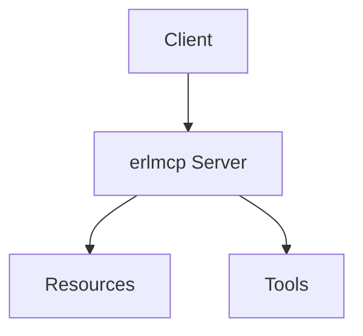

# erlmcp v3.0 Documentation

**Version**: 3.0.0 (OTP 28.3.1+)
**Last Updated**: 2026-01-31

---

## Welcome to erlmcp

erlmcp is a production-ready Erlang/OTP implementation of the [Model Context Protocol (MCP)](https://modelcontextprotocol.io/). This documentation covers everything you need to install, configure, operate, and troubleshoot erlmcp in production environments.

### What's New in v3.0

- **OTP 28.3.1+ Required**: Native JSON module, priority messages, O(1) process monitoring
- **2-3x Faster JSON**: Native `json` module replaces jsx
- **<1ms Health Checks**: Priority messages for critical operations
- **Better Scalability**: O(1) memory for process monitoring
- **Cleaner Codebase**: ~1,358 lines of backward compatibility removed

---

## Quick Navigation

### I Want To...

| Goal | Document | Time |
|------|----------|------|
| Get started in 5 minutes | [Installation Quickstart](../installation/quickstart.md) | 5 min |
| Build from source | [Install from Source](../installation/from-source.md) | 10 min |
| Deploy with Docker | [Docker Installation](../installation/docker.md) | 10 min |
| Deploy to Kubernetes | [Kubernetes Deployment](../installation/kubernetes.md) | 15 min |
| Upgrade from v2.x | [Migration Guide](../migration/v2-to-v3.md) | 20 min |
| Build an MCP server | [Server Implementation Guide](../user-guides/for-server-implementers.md) | 15 min |
| Build an MCP client | [Client Implementation Guide](../user-guides/for-client-implementers.md) | 15 min |
| Configure production | [Configuration Reference](../administration/configuration.md) | 30 min |
| Monitor operations | [Monitoring Guide](../administration/monitoring.md) | 20 min |
| Fix an issue | [Troubleshooting Guide](../troubleshooting/common-issues.md) | varies |
| Understand security | [Security Guide](../administration/security.md) | 25 min |

---

## Documentation by Category

### Installation

Set up erlmcp on your system.

| Document | Description |
|----------|-------------|
| [Quickstart](../installation/quickstart.md) | Get running in 5 minutes |
| [From Source](../installation/from-source.md) | Build from git repository |
| [Docker](../installation/docker.md) | Container deployment |
| [Kubernetes](../installation/kubernetes.md) | Orchestration deployment |
| [System Requirements](../installation/system-requirements.md) | Prerequisites and capacity planning |
| [Verification](../installation/verification.md) | Verify your installation |

### User Guides

Learn to use erlmcp for your use case.

| Document | Description |
|----------|-------------|
| [For Application Developers](../user-guides/for-application-developers.md) | Build MCP-enabled applications |
| [For Server Implementers](../user-guides/for-server-implementers.md) | Create MCP servers |
| [For Client Implementers](../user-guides/for-client-implementers.md) | Create MCP clients |
| [For AI Integrators](../user-guides/for-ai-integrators.md) | LLM integration patterns |
| [API Quick Reference](../user-guides/api-quick-reference.md) | Cheat sheet for common operations |

### Administration

Operate erlmcp in production.

| Document | Description |
|----------|-------------|
| [Configuration](../administration/configuration.md) | Complete configuration reference |
| [Deployment](../administration/deployment.md) | Production deployment strategies |
| [Monitoring](../administration/monitoring.md) | Observability and alerting |
| [Scaling](../administration/scaling.md) | Horizontal and vertical scaling |
| [Security](../administration/security.md) | Hardening guide |
| [Backup & Restore](../administration/backup-restore.md) | Data protection |
| [Incident Response](../administration/incident-response.md) | Operational runbooks |

### Troubleshooting

Resolve problems quickly.

| Document | Description |
|----------|-------------|
| [Common Issues](../troubleshooting/common-issues.md) | Frequently encountered problems |
| [Performance Issues](../troubleshooting/performance-issues.md) | Slowdown diagnosis |
| [Network Issues](../troubleshooting/network-issues.md) | Connectivity problems |
| [Error Codes](../troubleshooting/error-codes.md) | Error reference |
| [Diagnostics](../troubleshooting/diagnostics.md) | Debugging tools and techniques |

### Migration

Upgrade from previous versions.

| Document | Description |
|----------|-------------|
| [v2 to v3](../migration/v2-to-v3.md) | Main upgrade guide |
| [OTP 27 to 28](../migration/otp27-to-otp28.md) | OTP-specific changes |
| [Breaking Changes](../migration/breaking-changes.md) | Complete breaking changes list |

### Performance

Optimize your deployment.

| Document | Description |
|----------|-------------|
| [Benchmarking](../performance/benchmarking.md) | How to benchmark |
| [Tuning](../performance/tuning.md) | VM and application tuning |
| [Scalability](../performance/scalability.md) | Scaling strategies |

### Reference

Detailed technical information.

| Document | Description |
|----------|-------------|
| [API Reference](../api/reference.md) | Complete API documentation |
| [Architecture Overview](../architecture/overview.md) | System design |
| [Protocol Specification](../protocol/mcp-spec.md) | MCP protocol details |
| [OTP Patterns](../otp-patterns.md) | Erlang/OTP patterns used |

### Releases

Version-specific information.

| Document | Description |
|----------|-------------|
| [v3.0.0 Release Notes](../releases/v3.0.0.md) | What's new in v3.0 |
| [Roadmap](../releases/roadmap.md) | Future plans |
| [Deprecation Timeline](../releases/deprecation-timeline.md) | Feature lifecycle |

---

## Getting Started

### New to erlmcp?

Start here:

1. [Read the quickstart](../installation/quickstart.md) - Get running in 5 minutes
2. [Follow a user guide](../user-guides/) - Learn by doing
3. [Explore examples](../../examples/) - See working code

### Upgrading from v2.x?

The v3.0 release requires **OTP 28.3.1 or later** and includes breaking changes.

1. Read the [Migration Guide](../migration/v2-to-v3.md)
2. Review [Breaking Changes](../migration/breaking-changes.md)
3. Follow the upgrade steps
4. Run verification tests

### Looking for something specific?

Use the search function or check the [Index](../INDEX.md) for a complete list.

---

## Version Information

### Current Version: 3.0.0

| Component | Version | Status |
|-----------|---------|--------|
| erlmcp | 3.0.0 | Current |
| Minimum OTP | 28.3.1 | Required |
| Recommended OTP | 28.3.1+ | Latest stable |

### Supported Versions

| Version | Support Status | End of Life |
|---------|----------------|-------------|
| 3.0.x | Full Support | TBA |
| 2.x.x | Maintenance Only | 2026-07-31 |
| 1.x.x | Deprecated | 2026-01-31 |

---

## Documentation Conventions

### Code Examples

All code examples are complete and tested:

```erlang
% Complete, runnable example
-module(example).
-export([run/0]).

run() ->
    io:format("Hello from erlmcp!~n").
```

### Command Examples

Terminal commands include expected output:

```bash
$ erl -version
Erlang/OTP 28 [erts-15.0] [source] [64-bit] [smp:8:8]...
```

### Configuration Examples

Configuration is shown in the appropriate format:

```erlang
%% sys.config
{erlmcp, [
    {option, value}
]}.
```

```bash
# Environment variable
export ERLMCP_OPTION=value
```

### Diagrams

Architecture diagrams use Mermaid:



---

## Contributing to Documentation

Found an error or want to improve the docs?

1. Edit the file directly on GitHub
2. Submit a pull request
3. Reference the issue you're fixing

See [Contributing](../../CONTRIBUTING.md) for guidelines.

---

## Getting Help

### Self-Service

- Search the documentation
- Check the [troubleshooting guides](../troubleshooting/)
- Review [examples](../../examples/)

### Community

- **GitHub Issues**: [Report bugs](https://github.com/yourusername/erlmcp/issues)
- **GitHub Discussions**: [Ask questions](https://github.com/yourusername/erlmcp/discussions)

### Enterprise Support

For enterprise support, contact [support@example.com](mailto:support@example.com).

---

## Documentation Metrics

| Metric | Value |
|--------|-------|
| Total Documents | 45+ |
| Code Examples | 200+ |
| Diagrams | 50+ |
| Last Updated | 2026-01-31 |
| Target Coverage | 100% of public APIs |

---

**Document**: v3 Documentation Index
**Version**: 3.0.0
**Status**: Active
**Feedback**: [Submit feedback](https://github.com/yourusername/erlmcp/issues/new?template=documentation.md)
